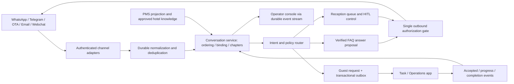

# App #1 — Hospitality Omnichannel Contact Center & Guest Communication Hub

Engineering and product dossier · researched 23 September 2026 · PostgreSQL 16 baseline · proposed initial market: independent/boutique hotels in Telavi and Kakheti, with portfolio expansion.

## 1. Decision, scope, and evidence standard

**Build a reservation-aware guest communication desk that owns the path from a guest message to an acknowledged hotel action.** A unified inbox is necessary but insufficient. The differentiator is an enforceable contract: one speaking owner, verified hotel facts, explicit reservation confidence, durable operational requests, and visible completion or escalation. A generated reply, accepted provider API call, task creation, and delivered hotel service are four different outcomes.

The MVP handles WhatsApp Cloud API, Telegram, Booking.com guest messaging through an authorized connector, email, and webchat through one normalization interface. It provides guest/reservation context, semantic chapters, multilingual assistance, guarded FAQ answers, human takeover, private AI drafts, operations dispatch, and delivery/audit monitoring. It does not replace the PMS, invent live room availability, autonomously grant financial exceptions, or treat a customer-service automation percentage as evidence of hotel ROI.

**Evidence labels:** **[D]** = official documentation describes behavior; **[V]** = vendor claims a capability or result, without independent product testing; **[O]** = directly observed retrieval/local execution; **[I]** = proposed design or engineering inference; **[U]** = unverified. All architecture, SQL, thresholds, examples, acceptance criteria, and delivery estimates below are **[I]** unless explicitly labeled otherwise. Examples use fictional hotel/guest data. Source IDs resolve to exact URLs and retrieval fingerprints in §11.

**[O] Local grounding:** read `task_research.md` without modifying it. Its evidence discipline, property boundaries, source/version attribution, explicit action authority, idempotency, and simple-baseline comparison inform this dossier. **[U]** That brief explicitly lacks verified property incident rates, monetary losses, and willingness to pay. This investigation adds public vendor/platform evidence and executable architecture validation; it does not claim customer interviews, a representative review corpus, vendor sandbox trials, or a live PMS/OTA integration. “Exhaustive” means coverage of the requested dimensions and their operational edge cases, not proof of every vendor behavior.

### Product outcomes and boundaries

| Hotel outcome | MVP behavior | Definition of done |
|---|---|---|
| Guest asks breakfast time before arrival | Identify property; retrieve effective approved schedule; respond in guest language | Answer trace includes policy ID/version; uncertainty is escalated |
| Guest in room 214 reports broken AC | Bind verified stay; capture safety/entry constraints; create maintenance request | Task system acknowledges the same request ID; guest sees honest progress |
| Guest asks for late checkout | Read current stay and applicable policy; ask reception to approve capacity/price | No checkout promise until the responsible system/operator authorizes it |
| Angry guest wants reception | Immediately queue escalation with reason, owner queue, deadline, and context | Human claims control; all older AI send intents are invalidated |
| Guest later asks for invoice | Open post-stay chapter; confirm identity and stay | Finance receives a request; invoice delivery uses approved secure mechanism |
| Night shift is unavailable | Keep request in staffed escalation/on-call workflow | No auto-resume of AI on a human timeout; no silent ticket closure |

## 2. Competitive teardown: strengths, limits, and falsifiable differentiation

### 2.1 Hospitality specialists and frontier contact centers

These are **capability comparisons from inspected official pages**, not test scores. “Not established” means the inspected material does not prove a guarantee; it does not mean the product lacks it. Marketing metrics have differing denominators, populations, and time periods, so they are deliberately not ranked.

| Product / evidence | What it does well or explicitly claims | Hotel-specific integration depth | Limit / diligence question | Our MVP response |
|---|---|---|---|---|
| **HiJiffy** [V: H1] | Unified web/social/WhatsApp/OTA conversations; guest-journey campaigns; full-context human routing and suggested replies; verified-knowledge and anti-hallucination guardrails | PMS-connected pre-check-in, in-house assistance, pre/post-stay communication | No inspected contract proves cancellation of already-generated AI sends, atomic operator ownership, or acknowledged housekeeping completion | Match channel/context strengths; demonstrate takeover fencing and operations acknowledgement under retries |
| **Duve** [V: H2–H3] | Unified WhatsApp/SMS/email/in-app/OTA inbox; real reservation context; Auto Answer and Suggestion Mode; human escalation with context; multilingual service | OTA coverage explicitly depends on supported PMS integration; broad guest journey including online check-in/upsells | Which PMS supports bidirectional OTA threads and which source wins after a room move? Suggestion Mode alone does not prove a dispatch-level lock | Per-connector capability registry; reservation provenance/freshness; human-authored send path for approved drafts |
| **Akia** [V: H4] | Reservation-aware guest messaging, PMS sync, no-download Mini Apps, configurable operational Skills | Inspected homepage explicitly illustrates contacting maintenance, creating a task, and notifying a guest when done | Therefore “isolated from housekeeping” is not a defensible blanket criticism; durability, task reconciliation, entry permissions, and timeout behavior need testing | Compare on source-linked task IDs, acknowledgement, cancellation, shift changes, and failure recovery |
| **Asksuite** [V: H5] | Multilingual, multi-topic text/audio reservation assistant; omnichannel CRM; official WhatsApp; AI copilot, hotel knowledge hub, workflow agents | Strong direct-booking/quotation positioning and integrations; traveler journey automation | Sales conversion does not establish safe in-stay maintenance or inventory authority. Exact PMS write scope and task completion semantics are unverified | Preserve sales-quality intake while separating operational actions from capacity/commercial approval |
| **Canary Technologies** [V: H6–H7] | PMS-connected unified inbox, journey-triggered messages; AI replies and translation; explicit automated handoff and service-ticket creation | Integrated guest experience, pre-arrival through post-stay; service tickets are expressly advertised | “No tasks” and “only decision trees” would misrepresent current pages. Need evidence for ownership races, task closure, and current-property policy isolation | Show tested lifecycle and access boundaries instead of claiming exclusive AI/ticket functionality |
| **Sierra** [V: F1–F2] | Multichannel agents, actions, proactive engagement, agent authoring; supervisory layers to reduce hallucination; controlled system-of-record access | General customer-service agent platform; hospitality adapters and authority mapping remain project work | Agent flexibility is not a ready-made hotel reservation/housekeeping model. Broad reliability claims are not a zero-hallucination guarantee | Smaller hotel-native scope, explicit tools/policies, fresh PMS context, traceable operational commitments |
| **Decagon** [V: F3] | Natural-language Agent Operating Procedures, testing, observability and experimentation; a configurable concierge model | General agent platform; inspected homepage does not establish this exact five-channel hotel/PMS combination | AOPs still require correct rules, authorization, source freshness, and integration work; no vendor failure rate established | Typed operations contracts underneath natural-language interpretation; hotel-specific replay cases |
| **Intercom Fin** [V/D: F4–F7] | Knowledge-grounded answers, API/data connectors, multi-step Procedures, simulations, escalation guidance/rules, full-context handoff | Broad helpdesk/customer-service ecosystem; PMS and hotel task mappings must be configured | Official troubleshooting documents assignment failures; email “Ask for input” documents an optional timeout that sends the original draft. This differs from strict human approval | Use deterministic mandatory escalation for explicit human requests and fail-closed approval timeouts; audit every transition |

**Competitive conclusion:** current leaders are not uniformly rigid decision-tree bots. HiJiffy claims guarded knowledge, Akia shows operational task skills, Canary claims service tickets, Duve describes human suggestion mode, and frontier platforms advertise tool use and testing. Our edge is a **testable implementation and hotel workflow fit**, not an unsupported assertion that competitors cannot do these things. No superiority claim should be published until identical cases are replayed against accessible products/configurations.

### 2.2 Failure teardown and evidence strength

| Failure | Evidence boundary | Mechanism and hotel consequence | Prevention and proof |
|---|---|---|---|
| Rigid branches fail on multi-intent/ambiguous requests | [I] Architecture failure mode; [V] Asksuite explicitly claims multi-topic handling, contradicting a blanket “all bots are trees” claim | “Breakfast at 6, vegan meal, and airport transfer” falls through one branch or silently drops two intents | Multi-label extraction; per-intent state; deterministic policy checks; all requested intents appear in operator review |
| AI invents hotel policy/amenity | [I] Known generative-system risk; [V] H1/F2/F7 advertise mitigation, not proof of observed incidents here | Wrong property's pool opening hours or invented free late checkout creates a commercial promise | Property-scoped effective knowledge, citations, conflict rejection, live authority checks; zero unsupported promises in release cases |
| Human handoff lands nowhere | **[D: F5]** Intercom lists conflicting workflows, missing assignment actions, deleted assignment workflows, and audience/availability mismatches as causes of wrong/unassigned routing | Overnight complaint appears handled but no person owns it | Required queue and deadline; active HITL session; supervisor escalation; queue watchdog detects orphaned work |
| AI talks over a human | [I] Distributed send/control race; not independently reproduced against named vendors | Model finishes after reception claims and sends an obsolete promise | Database epoch fencing, exclusive dispatch/takeover gate, cancellation at claim, receipt reconciliation |
| HITL timeout silently approves | **[D: F6]** Email “Ask for input” has “Proceed after”: if no teammate responds, Fin automatically sends its original draft. Documentation also distinguishes this from takeover | Unreviewed cancellation/checkout response can escape after night staff miss a prompt | No timeout grants authority. Expiration escalates; approval covers exact text/version and action, with no regeneration after approval |
| Ticket creation mistaken for service | [I] Operational failure; H4/H7 already advertise task capability | “Pillows delivered” sent when only a ticket was opened; issue disappears at shift change | Accepted/in-progress/completed events, completion evidence, guest confirmation or supervisor closure, overdue escalation |
| Reservation misbinding | [I] Identity/context failure | Shared family phone, recycled number, agency contact, or overlapping stays reveals room/VIP/invoice details | Candidate versus verified binding; second factor; no arbitrary top-score match |
| Thread sprawl and loss of context | [I] UX/data failure | Previous stay complaint contaminates current pre-arrival conversation | Temporal chapters with source links and separate unresolved request objects |
| Integration outage hidden as success | [I] Distributed-systems failure | Provider times out after accepting, duplicate send occurs; PMS cache stale after room move | Unknown delivery state, no blind resend, source freshness badge, reconciliation and DLQ |

### 2.3 Purchasing and build-vs-buy investigation

Run a scripted vendor evaluation with the same approved fictional property policies and synthetic PMS/task fixtures. Test: three intents in Georgian/Russian/English; shared phone with two future stays; room move during maintenance dispatch; takeover during a delayed send; human disconnect; WhatsApp window closure; duplicated OTA ingestion; no housekeeping acknowledgement; edited/cancelled request; wrong-property retrieval; prompt injection in guest text; invoice identity verification. Capture configuration, source versions, transcript, ownership timeline, API logs if available, task outcome, and elapsed staff effort. Do not infer internal locking from a polished demo.

Request connector entitlements, exact PMS/OTA capabilities, data/export ownership, guest-message retention, language quality including Georgian, support/on-call terms, and pricing across property/room/seat/message/AI-outcome charges. H3 publicly advertises a starting price, but that is not a comparable full deployment quote. No total-cost ranking is established. Buy/configure an existing product if it passes the same acceptance gates with less cost and integration effort; build where the measurable coordination gap remains.

## 3. MVP functional architecture for hotel operations

### 3.1 Components and ownership



Start with a modular application, PostgreSQL, stateless HTTP/SSE processes, and independent adapter/AI/outbox workers. A broker is optional initially: polling PostgreSQL is sufficient at pilot scale; the outbox still defines the boundary. LLMs propose structured interpretations and response text; trusted services authorize state changes and tools. External provider credentials live only in adapters. Model processes cannot call provider send endpoints or directly edit control state.

**Operator workspace:** inbox by property/team/priority/overdue status; guest and reservation card with confidence/freshness; original and translated message side by side; chapter navigation; unresolved requests across all chapters; current speaking owner and version; claim/release/assist controls; approved draft editor; citations and policy validity; visible queued/sent/delivered/unknown state; shift handover notes; escalation timer; task status and completion evidence. Claim is a server-acknowledged action, not a typing indicator. Keyboard access, screen-reader labels, responsive reception use, and reconnection banners are MVP requirements.

**Hotel onboarding:** provision property/timezone and operator roles; connect approved channel accounts and PMS; import and approve policies; map departments/on-call roster; configure quiet hours, consent, templates, SLAs, and escalation destination; test five scripted guest journeys; run shadow mode before autonomy. Absence of approved policies disables autonomous factual answers for those topics.

### 3.2 Channel adapter contract and production limitations

| Channel | Inbound / identity / dedupe | Outbound and operational restrictions | Pilot dependency |
|---|---|---|---|
| WhatsApp Cloud API | Verify subscription challenge and signed raw webhook; resolve registered business phone account to property; normalize each message separately; use provider message ID; statuses are receipt events | [D: P1–P2] Open 24-hour customer-service window permits service messages; outside it only approved templates. Current docs also describe call-triggered windows; text-only MVP advances its window from verified guest messages. Check consent/template approval/current account restrictions at send time, not enqueue time | Business account, number registration, credentials/permissions, approved templates and valid opt-in. No assumption that new accounts instantly qualify |
| Telegram Bot API | [D: P3] Verify `X-Telegram-Bot-Api-Secret-Token`; dedupe bot account + `update_id`; message ID is scoped to chat. Store IDs as strings on wire. Use edit events without creating a new original message | Bot chat identity is not a phone number. Require guest to establish conversation/access permitted by Telegram; rate-limit per bot/chat and handle provider retry advice. No assumption that bot can initiate arbitrary phone outreach | Bot setup; guest-initiated flow or verified signed deep link; private chats only in MVP |
| Booking.com / OTA | Partner-approved messaging connector or a supported PMS relay, mapping provider property, reservation and thread IDs. Poll if webhook support unavailable; checkpoint only after durable ingest; reconcile lookback windows | [O/D: P4] Official Connectivity index exposes Messaging API. Exact current deep endpoint, send limits, entitlement, and history were not verified; attempted deep URLs returned 404. Do not fabricate an endpoint or use public-site scraping. Provider IDs through two relays require cross-adapter alias dedupe | Obtain property authorization and certified/provider access. Until then use clearly labeled simulator or approved operator export; OTA production is blocked on this dependency |
| Email | Authenticated provider push or incremental mailbox sync with cursor; preserve mailbox/provider message ID, RFC Message-ID, In-Reply-To/References. Dedupe by provider ID; forwarded messages are not automatically the original sender | Preserve threading and reply address after verification; SPF/DKIM/DMARC signals inform trust but do not prove guest identity. Suppress vacation/bounce/list loops; quarantine attachments; do not auto-include quoted PII or internal notes | Property mailbox OAuth/service setup, tested send and incremental sync. Never assume all OTA relay email is equivalent to the OTA API |
| Webchat | Signed anonymous session scoped to property; server-minted thread; per-message client UUID + session scope; reconnect cursor and replay | Origin/CORS/CSRF protection, rate limits and abuse handling. Persist session without leaking one guest's chat on shared lobby devices; authenticated reservation link upgrades identity | Hotel embedding and privacy/consent notice; expiry/logout for shared devices |

Adapters acknowledge a webhook **only after durable recording**. Authentication failures return 401/403; malformed unsupported data is quarantined with bounded metadata; temporary storage failure returns retryable 503. Batch webhooks are split into independently idempotent events. Media is quarantined in object storage with size/MIME/virus checks and signed short-lived download URLs; SQL stores object references, never attachment bytes. No OCR/transcription interpretation executes instructions.

Canonical ingress identity includes `(channel account, provider event key)`; provider timestamps are retained but not trusted for database order. Duplicate original messages return the previously stored message, including if two workers race. On a uniqueness conflict roll back the entire attempted insertion transaction before rereading; **do not use `ON CONFLICT DO NOTHING` with sequence-allocation triggers**, which can otherwise consume logical counters without a row. Delivery/edit/delete events have their own dedupe namespaces. Unsupported events stay visible for operator reconciliation.

### 3.3 Reservation binding: instant candidate lookup, deliberate authorization

The PMS remains the source of truth. Mirror only required reservation fields via authorized change events plus periodic reconciliation. Persist property, source reservation ID, guest, arrival/departure, room type, room assignment, special requests, VIP indicator, source version and sync time. Local lookup is indexed and fast; it cannot make ambiguous identity trustworthy.

1. Resolve the **property from the authenticated destination account**, never from message text. Canonicalize phone to E.164 when enough country context exists; retain the raw value privately. Do not guess an ambiguous country code.
2. Resolve live channel identity to participant. A verified signed pre-arrival link/OTA reservation thread is stronger than display name or phone similarity. A PMS phone match is a candidate signal, not authentication. Identity verification records method/time/revocation.
3. Search in-house reservations first, then upcoming stays (proposed next 30 days), and explicitly requested recent stays (proposed previous 90 days for invoices). These are configurable business search windows, not entitlement or deletion rules. Cancelled/no-show/overlapping reservations remain visible to staff but never win by accident.
4. Exactly one appropriately verified candidate → bind with evidence, source version, and verified principal. Multiple/weak matches → `ambiguous`; ask for a secure booking-link verification or reception assistance. Never expose candidate room numbers, VIP status, guest names, or dates to help an unauthenticated stranger choose.
5. Guest Name/Room Type/Dates/Special Requests/VIP appear to authorized operators. AI receives only the minimum fields needed. Display “candidate” or “stale” clearly. No cross-property lookup without operator portfolio authorization and explicit property selection.
6. Family/group booking, travel agent phone, companion, room sharer, returning guest, changed phone, and recycled number require a verified association; primary guest ownership alone is insufficient. MVP routes companion authorization to reception instead of inventing automatic relationships.
7. Room moves, shortened stays, cancellations, and late checkout updates invalidate cached action proposals and future journey sends. For a new commercial promise or physical dispatch, refresh from PMS or require operator verification if cache age exceeds the proposed 60-second sensitive-action threshold. Read-only FAQ does not wait for PMS if property knowledge suffices.

Target local lookup p95 <150 ms under the declared load test; PMS network delay is separately measured. If PMS is down, retain the candidate card with last sync time, permit non-personal FAQs, and escalate room-specific or financial actions. Room type is not room assignment. Invoice requests after checkout are bound to a historical chapter without replacing the context of another active stay.

### 3.4 Conversation chapters and multi-topic handling

A conversation is the property-scoped communication/control aggregate for a verified guest, optionally spanning channels. Cross-channel merge requires verified identity and an audited staff-approved binding; do not merge by name alone. The MVP permits one external thread per channel in one conversation. A second same-channel thread (for example a separate OTA stay thread) becomes another conversation shown on the guest timeline, avoiding ambiguous recipient routing. A room change never silently changes the message recipient.

Each message has one immutable **primary temporal chapter**: a half-open message sequence interval `[start_seq,end_seq)`. Only one chapter is open. Examples: “Pre-arrival: airport pickup,” “In-stay: room 214 AC,” “Post-stay: invoice.” Chapters have stage, topic, stay reference, summary, source messages, and summary watermark. A classifier proposes a boundary when a new stay/journey stage or materially changed topic appears; an idle gap is only a signal. Operator confirms uncertain boundaries. Closing a chapter and opening the next occur under the conversation row lock before the next message insertion.

Temporal chapter intervals cannot overlap. **Semantic topics can overlap:** a message “AC still broken, and send two pillows” has one primary chapter and two request intents; secondary topic/evidence references live in structured message payload/request rows. An unresolved AC task stays visible after a later breakfast chapter. Do not claim chapter exclusion constraints prohibit multiple topics. MVP never rewrites accepted transcript order; correction is a versioned summary/annotation. Retrospective repartition would require a separate audited migration, outside this DDL's append-only chapter API.

On `RESOLVED`, append an event that schedules summary/extraction/QA jobs keyed by `(conversation,chapter,through_seq,extractor_version)`. Jobs operate on a snapshot watermark and attach provenance; a late-arriving message cannot be swallowed by a stale summary. Human-approved knowledge publication is separate: guest claims and old AI replies never become approved hotel policy automatically.

### 3.5 Dual-track routing and hotel authority

| Intent | AI may do | Required authority / dispatch | Guest wording and failure handling |
|---|---|---|---|
| WiFi, breakfast hours, parking rules | Retrieve current approved property policy and answer with internal citation | WiFi secret only after appropriate guest verification; public hours may be anonymous | Missing/conflicting/expired policy → ask reception, not infer from another hotel |
| Extra pillows/towels | Extract quantity, verified room/stay, preferred time, entry permission | Housekeeping request; team accepts capacity and completion | “I've requested two pillows”; never “delivered” at creation |
| AC/plumbing maintenance | Capture symptoms, urgency, room, permission to enter and availability | Maintenance task; urgent/safety issues notify duty manager via authorized channel | Avoid repair/safety diagnosis; provide approved immediate safety instructions if relevant |
| Late checkout/early arrival | Explain policy; gather requested time | Front desk/PMS availability and pricing approval, readiness dependencies | No promise from a static room-availability snippet or model inference |
| Refund, cancellation, compensation | Summarize and collect context | Authorized reception/manager; financial action in owning app with explicit permission | Draft only; escalation expiry cannot approve money |
| Invoice copy or billing dispute | Identify verified historical stay and issue | Finance task; secure invoice delivery | Never send another guest's folio based on phone match |
| Breakfast dietary request/transfer | Capture meal/time or transfer details | F&B/transport owner accepts feasibility; food allergy needs explicit human acknowledgement | Do not guarantee allergen safety or external transport availability |
| Fire, injury, threat, unsafe room | Immediate escalation and approved emergency contact text | Duty manager/local emergency workflow; not a normal queue | Never let FAQ automation or lack of task-app acknowledgement delay urgent escalation |

A message may produce both tracks: answer breakfast hours and dispatch pillows. Every intent must be accounted for as answered, awaiting clarification, dispatched, or escalated. Model outputs are schema-validated, source-linked proposals. Policy engine independently checks verified binding, allowed action, guest consent, knowledge validity, financial limits, and expected source versions. Reject prompt injection, unapproved tools, stale knowledge, missing citations, and low-quality translations. Low model confidence alone is not an authorization signal.

**Multilingual handling:** preserve original language/text; store translated text, locale, model/version and source hash separately; show staff both. Use property-approved terms for checkout dates, GEL amounts, room identifiers and dietary restrictions. Never translate opaque booking identifiers. Georgian/Russian/English code-switching, negation, transliteration and dates require native-speaker review in the pilot; fluent-looking output is not evidence of correctness.

**Journey automation:** reservation-created/changed events schedule approved pre-arrival, in-stay and post-stay messages using property timezone, guest consent, appropriate template, and a stable trigger key `(reservation,journey_step,source_version)`. Re-evaluate at dispatch: cancellation, changed arrival, quiet hours, channel window, consent revocation and HITL state suppress or reschedule. Operational reminders must not bypass human takeover. Marketing opt-in and operational contact basis are stored separately.

## 4. Exact HITL control machine and takeover protocol

### 4.1 State meaning and allowed authors

| State | Guest-facing authors | AI behavior | Ownership and exit condition |
|---|---|---|---|
| `AI_ACTIVE` | AI after policy/dispatch validation; approved system templates | Intake, retrieval and verified responses | No human owner; explicit operator claim or escalation interrupts |
| `ESC_REQUESTED` | Fixed approved system acknowledgement only; no AI-authored reply | Conversational generation stopped; intake/classification may continue without publishing | Queue + reason + deadline mandatory; human must claim before replying |
| `OPERATOR_LOCKED` | Assigned human only | Hard-muted conversational generation and sends; cancel queued jobs | Exactly one owner/session; heartbeat loss does not resume AI |
| `AI_ASSISTED` | Assigned human only | Private suggestions with source references; never sent automatically | Same owner/session; accepting a draft creates an operator command for the exact approved text |
| `RESOLVED` | None | Background extraction/summary/QA at fixed watermark | Reopen explicitly on new substantive message; no silent discarding of inbound messages |

A reception operator wishing to answer during `AI_ACTIVE` first claims. `AI_ASSISTED` is not “AI gets approval then generates another public answer”: the human sends the approved/edited bytes through the human path. All queued sends carry a control epoch; old epochs fail even when the state later returns to `AI_ACTIVE` (prevents the ABA problem).

### 4.2 Complete transition table

All transitions compare the expected control version, atomically increment it once, append audit history and a durable event, and invalidate queued prior-epoch dispatches. The trusted service authorizes the actor; the database enforces the graph/version/owner shape. Transitions not listed return 422. Same-state same-owner requests are rejected unless an already completed idempotency key returns the original response.

| From → To | Trigger / actor | Guards and atomic effects |
|---|---|---|
| `AI_ACTIVE → ESC_REQUESTED` | AI policy detector, deterministic rules, or staff | Explicit human request, unsupported policy, sensitive action, frustration/repetition, verification failure; set queue reason/due time; suppress AI |
| `AI_ACTIVE → OPERATOR_LOCKED` | Authorized reception operator | Voluntary takeover; establish owner/session before enabling compose/send |
| `AI_ACTIVE → RESOLVED` | AI via service or staff | All intents accounted for; no open unacknowledged requests; approved resolution rule and reason; schedule extraction |
| `ESC_REQUESTED → OPERATOR_LOCKED` | Eligible operator claim | CAS/version check; assignment capability; open session; only first claimant succeeds |
| `ESC_REQUESTED → AI_ACTIVE` | Authorized staff only | Explicit reviewed dismissal of escalation; no unattended timeout; reason required |
| `ESC_REQUESTED → RESOLVED` | Supervisor/staff | Duplicate/spam/withdrawn or externally handled case with evidence; no silently unresolved guest request |
| `OPERATOR_LOCKED → AI_ASSISTED` | Current owner or supervisor | Explicit opt-in to private assistance; owner/session retained |
| `AI_ASSISTED → OPERATOR_LOCKED` | Current owner or supervisor | Cancel private generation; owner retained |
| `OPERATOR_LOCKED / AI_ASSISTED → AI_ACTIVE` | Current owner or supervisor | Explicit release with handback summary; policy and pending-intent review; close session |
| `OPERATOR_LOCKED / AI_ASSISTED → ESC_REQUESTED` | Owner/supervisor or watchdog service | Shift abandonment/disconnect/SLA expiry; close old session; requeue with reason/due time; never implicitly enable AI |
| `OPERATOR_LOCKED / AI_ASSISTED → RESOLVED` | Owner/supervisor | Completion evidence or explicit documented closure override; close session; schedule extraction |
| `OPERATOR_LOCKED / AI_ASSISTED → same state, new owner` | Authorized supervisor/accepted shift transfer | Close old session and open new session at same new version boundary; invalidate old drafts/sends; no ownership gap |
| `RESOLVED → AI_ACTIVE` | Inbound/reopen service or staff | New non-sensitive substantive inquiry, approved reopen rule; append/open chapter as appropriate |
| `RESOLVED → ESC_REQUESTED` | Inbound/reopen service or staff | Reopened complaint/sensitive unresolved issue or explicit human request; queue immediately |

Record guest human-request intent as an untrusted inbound fact; the service acts on it, rather than letting a guest call the internal control API. The DB helper is not a substitute for role authorization: supervisor versus owner privileges, correct session actor, workflow completion, and request-specific policies are validated in the authenticated command service. It must never expose arbitrary `p_actor`/`p_owner` supplied by guests.

### 4.3 Race-free authorization and the unavoidable external boundary

**Invariant:** after a successful takeover commit, no new AI provider send is initiated for that conversation. It is impossible to retract a provider request already accepted or guarantee when a carrier will display a previously accepted message. The UI must distinguish these facts.

1. Generation starts with `(space,conversation,control_version,binding_version,last_message_seq,policy_versions,reservation_source_version)`. Queue records are cancellable; every later stage rereads the state. New guest messages invalidate stale reply context even when the control version is unchanged.
2. All outbound senders and takeover/release commands use the same conversation advisory lock key: `hashtextextended(space_id || ':' || conversation_id,0)`. Hash collisions only serialize unrelated work. Use a dedicated pinned DB connection, never transaction-pooled session locks.
3. The dispatcher holds the **session-level advisory lock across the final provider call**, while using short SQL transactions for validation/recording. Under a row lock, check state, epoch, binding version, current owner, latest guest context, policy versions, channel consent/window, and enabled account. Commit a `sending` marker with epoch and message ID. Only then call the provider, with bounded timeout and automatic HTTP retries disabled unless provider idempotency is verified.
4. A takeover transaction obtains the matching transaction-level advisory lock **before** the conversation row lock. It waits for a bounded in-flight call, rereads version, changes control, cancels queued old-epoch messages, closes/opens sessions, and appends outbox/audit records. The console displays “claim pending” until commit. A competing operator receives 409 with authoritative owner/version; typing or local optimistic UI never claims control.
5. Dispatcher records `accepted` with provider ID or `failed`/`unknown`, releases its session lock in `finally`, and resets/evicts broken pooled connections. Do not hold a row transaction open across network I/O. If the socket/worker dies after sending, the durable `sending` record becomes `unknown`; a sweeper reconciles it and never blindly resends.
6. A provider may still deliver an earlier request after takeover or after a client timeout. Show that in-flight/unknown record to the operator. The guarantee concerns new submissions after the takeover linearization point, not impossible cross-system atomic rollback. Keep external HTTP deadlines shorter than the operational takeover budget; if a stuck dispatcher prevents claiming, alert the supervisor and reconcile rather than lying that control changed.
7. Without this shared send/claim gate, “check state then HTTP send” has a TOCTOU race even with a row lock used earlier. Cancelling model jobs alone is insufficient. Redis presence locks, browser state, and expiring worker leases cannot authorize speaking.

A newly generated AI reply and an outbound operator command both require the current `expected_last_message_seq`; 409 on mismatch forces review. Receipt events do not count as new guest text. Unsent human drafts survive visually for review but cannot silently dispatch under a new owner. Outbound duplicates use stable command/message IDs; uncertain external acceptance stays `unknown` until provider history/receipt/operator reconciliation resolves it.

### 4.4 Presence, staffing, and escalation policy

Proposed defaults: console heartbeat every 15 seconds; absence after 60 seconds marks owner offline; after 120 seconds without recovery the watchdog asks the duty queue to reassign through `ESC_REQUESTED`. Those are configurable pilot policies, not SLA commitments. A heartbeat only updates session presence, not state/control version. Reconnection requires current owner/version. No other person sends as the disconnected owner.

Proposed handling targets: urgent in-stay complaint to duty manager immediately with acknowledgement target 2 minutes; ordinary human request acknowledgement target 5 minutes during staffed coverage; task acceptance target 2 minutes for urgent and 10 minutes for routine requests. Actual property staffing and service hours determine realistic targets. Deadlines use UTC; displays/business schedules use the hotel's IANA timezone. There is always a fallback queue/on-call owner. Escalation is durable even when push notifications fail; a watchdog queries overdue rows and alerts via authorized channels. Only the owning property can set emergency procedures and escalation contacts.

### 4.5 Real-time synchronization: SSE first, WebSocket optional

Use authenticated `GET /v1/spaces/{space}/conversations/{id}/events` with SSE for server updates and HTTP commands for mutations. WebSocket uses identical event envelopes, authorization and replay logic if bidirectional presence is needed; it is not a different source of truth. A connection is scoped to a property/conversation plus staff permissions. Revocation disconnects live subscribers. Internal notes/drafts never appear in guest subscriptions.

Each durable outbox event has an **aggregate-local monotonically increasing `event_seq`**, allocated while locking the conversation. SSE `id` is that decimal string. Clients send `Last-Event-ID`; server replays ordered committed rows then follows notifications, querying again after every notification. PostgreSQL `LISTEN/NOTIFY` may wake a reader but is not durable history. Subscribe-before-read or repeat-read closes the subscribe/snapshot race; reconnect always queries the outbox.

Snapshot endpoint returns state, transcript/task summary and `through_event_seq` from one repeatable-read database snapshot. Client subscribes after that watermark, dedupes by event ID, ignores older control versions, and applies events in per-conversation order. Gaps trigger replay; an expired cursor returns 410 `CURSOR_EXPIRED` with a fresh snapshot link. Send heartbeat comments about every 15 seconds; bound per-client buffers and disconnect slow consumers with resumable cursors. Outbox retention must cover the promised replay window (proposed 7 days); audit/retention obligations are separate.

**Do not use a global `BIGSERIAL` as a commit-order SSE cursor.** A lower sequence can commit after a higher one and be skipped. This design's row lock serializes commits for one conversation. Portfolio inbox uses snapshots plus per-conversation watermarks/invalidation, or a separate broker/CDC stream with committed offsets; it must not concatenate aggregate-local sequences into a fake global total order.

## 5. Data architecture and executable PostgreSQL DDL

### 5.1 Relational ownership and invariant map

`spaces` means a hotel property/tenant security boundary. A portfolio user's authorized property list lives in the identity/control plane; this schema does not weaken property isolation into shared guest tables. Shared OTA accounts serving several properties require a routing registry in the connector that resolves an authenticated provider-property tuple before using this schema; provision separate logical channel accounts per property.

The eight requested tables are present: `spaces`, `conversations`, `conversation_chapters`, `messages`, `channels`, `participants`, `hitl_sessions`, `outbox_events`. Supporting tables make reservation binding, membership, channel routing, delivery, idempotency, request lifecycle and knowledge approval implementable without EAV. Typed columns carry identities, ordering, state, money/authority boundaries and joins. JSONB carries bounded structured metadata, original channel fields, preference objects, evidence and extraction details; no generic attribute/value table is used.

| Invariant | Enforcement |
|---|---|
| No cross-property foreign-key joins | Composite `(space_id,id)` primary/foreign keys plus RLS on every table |
| One control owner and linear state versions | State/owner checks, graph/version trigger, conversation row lock, command helper and service authorization |
| No overlapping ownership epochs | GiST exclusion of `hitl_sessions.version_span` + partial unique live-session index |
| No overlapping primary chapters | GiST exclusion of chapter sequence ranges + one open chapter; chapter guard permits only forward boundary closure |
| Strict canonical message order | Trigger allocates conversation-local sequence under row lock; unique conversation/sequence; timestamps are descriptive only |
| No duplicate message/command identity | Unique channel/provider event key and conversation/client command key, plus actor/idempotency receipt |
| No public AI message in human states | Insert trigger checks author and control epoch; dispatcher independently checks current authorization immediately before external call |
| Ordered local events | Outbox allocation under same conversation row lock, unique event sequence and dedupe key |
| Correct channel and sender membership | Composite FKs to conversation channels and conversation participants |
| No unapproved/overlapping knowledge edition | Effective-time exclusion by property/policy/locale; approving actor authorization in service |

Foreign keys/checks alone do not enforce gap-free sequencing, meaningful completed work, author authentication, or provider side effects. The triggers/helpers enforce the stated local invariants; the service owns transaction composition, RBAC, lifecycle policy, semantic checks, schema validation, send fencing, and outbox publication. Exclusion constraints enforce non-overlap, not message ordering by themselves. `occurred_at` may be earlier for late webhooks; append to canonical sequence and show the original time/late badge.

### 5.2 Execution and runtime boundaries

The following **single SQL block** is executable on a fresh PostgreSQL 16 database with permission to install `btree_gist`. It creates an isolated `contact_center` schema and is intentionally a one-time migration, not a destructive reset or a rerunnable `CREATE IF NOT EXISTS` script that hides drift. `gen_random_uuid()` is available in PostgreSQL 16. Apply as migration owner; no application should run as database superuser.

All functions are security-invoker. Runtime connections set trusted `search_path=contact_center,public` (no untrusted schema creation), and transaction-local `app.space_id` after authenticated property authorization. `FORCE ROW LEVEL SECURITY` protects normal table owners but PostgreSQL superusers/BYPASSRLS roles bypass it. Runtime is `NOSUPERUSER NOBYPASSRLS`, with schema usage and narrowly granted table/column/function privileges provisioned by deployment. `PUBLIC` gets no access. No guest/browser/model receives database credentials. RLS setting is not safe if exposed to arbitrary SQL callers; the server must control it.

Control helper `change_control` must be the command service's only control mutation path. Do not grant raw conversation state updates to operator clients. A privileged service repository layer supplies other inserts/updates; worker roles should receive only their required columns. A security-definer wrapper could further narrow SQL roles, but must be independently hardened with fixed search path and authentication; none is silently introduced here. Unique constraints and RLS can leak existence through raw DB error details, so APIs return normalized errors without foreign-tenant identifiers.

```sql

BEGIN;
CREATE EXTENSION IF NOT EXISTS btree_gist;
CREATE SCHEMA contact_center;
SET search_path = contact_center, public;

CREATE TYPE control_state AS ENUM
 ('AI_ACTIVE','ESC_REQUESTED','OPERATOR_LOCKED','AI_ASSISTED','RESOLVED');
CREATE TYPE actor_kind AS ENUM ('guest','operator','ai','system');
CREATE TYPE channel_kind AS ENUM ('whatsapp','telegram','booking_com','email','webchat');

CREATE TABLE spaces (
 id uuid PRIMARY KEY DEFAULT gen_random_uuid(),
 property_code text NOT NULL UNIQUE,
 name text NOT NULL,
 timezone text NOT NULL DEFAULT 'Asia/Tbilisi',
 settings jsonb NOT NULL DEFAULT '{}' CHECK (jsonb_typeof(settings)='object'),
 created_at timestamptz NOT NULL DEFAULT clock_timestamp()
);
CREATE TABLE channels (
 space_id uuid NOT NULL REFERENCES spaces(id),
 id uuid NOT NULL DEFAULT gen_random_uuid(),
 kind channel_kind NOT NULL,
 provider_account_id text NOT NULL,
 credential_ref text NOT NULL, -- secret-manager reference, never an API token
 enabled boolean NOT NULL DEFAULT true,
 capabilities jsonb NOT NULL DEFAULT '{}' CHECK(jsonb_typeof(capabilities)='object'),
 metadata jsonb NOT NULL DEFAULT '{}' CHECK(jsonb_typeof(metadata)='object'),
 PRIMARY KEY(space_id,id),
 UNIQUE(kind,provider_account_id) -- one integration endpoint maps to one property
);
CREATE TABLE participants (
 space_id uuid NOT NULL REFERENCES spaces(id),
 id uuid NOT NULL DEFAULT gen_random_uuid(),
 kind actor_kind NOT NULL,
 display_name text NOT NULL,
 auth_subject text, -- operators only; assigned by trusted identity provisioning
 preferred_locale text,
 preferences jsonb NOT NULL DEFAULT '{}' CHECK(jsonb_typeof(preferences)='object'),
 PRIMARY KEY(space_id,id),
 UNIQUE(space_id,auth_subject),
 CHECK ((kind='operator') = (auth_subject IS NOT NULL))
);
CREATE TABLE participant_identities (
 space_id uuid NOT NULL,
 id uuid NOT NULL DEFAULT gen_random_uuid(),
 participant_id uuid NOT NULL,
 channel_id uuid NOT NULL,
 external_subject text NOT NULL,
 normalized_phone text CHECK(normalized_phone ~ '^\+[1-9][0-9]{6,14}$'),
 verified_at timestamptz,
 verification_method text,
 revoked_at timestamptz,
 metadata jsonb NOT NULL DEFAULT '{}' CHECK(jsonb_typeof(metadata)='object'),
 PRIMARY KEY(space_id,id),
 FOREIGN KEY(space_id,participant_id) REFERENCES participants(space_id,id),
 FOREIGN KEY(space_id,channel_id) REFERENCES channels(space_id,id),
 CHECK((verified_at IS NULL)=(verification_method IS NULL)),
 CHECK(revoked_at IS NULL OR verified_at IS NULL OR revoked_at>=verified_at)
);
CREATE UNIQUE INDEX identity_live_unique ON participant_identities
 (space_id,channel_id,external_subject) WHERE revoked_at IS NULL;
CREATE INDEX identity_phone_lookup ON participant_identities(space_id,normalized_phone)
 WHERE revoked_at IS NULL; -- intentionally NOT unique: families share phones

CREATE TABLE reservations (
 space_id uuid NOT NULL REFERENCES spaces(id),
 id uuid NOT NULL DEFAULT gen_random_uuid(),
 pms_system text NOT NULL,
 pms_reservation_id text NOT NULL,
 primary_guest_id uuid NOT NULL,
 arrival_at timestamptz NOT NULL,
 departure_at timestamptz NOT NULL,
 status text NOT NULL CHECK(status IN ('upcoming','in_house','checked_out','cancelled','no_show')),
 room_type text NOT NULL,
 room_number text,
 vip_status text NOT NULL DEFAULT 'none',
 special_requests jsonb NOT NULL DEFAULT '[]' CHECK(jsonb_typeof(special_requests)='array'),
 source_version text NOT NULL,
 source_updated_at timestamptz NOT NULL,
 synced_at timestamptz NOT NULL DEFAULT clock_timestamp(),
 PRIMARY KEY(space_id,id),
 UNIQUE(space_id,pms_system,pms_reservation_id),
 FOREIGN KEY(space_id,primary_guest_id) REFERENCES participants(space_id,id),
 CHECK(departure_at>arrival_at)
);
CREATE INDEX reservations_guest_stay ON reservations(space_id,primary_guest_id,arrival_at,departure_at);
CREATE TABLE conversations (
 space_id uuid NOT NULL REFERENCES spaces(id),
 id uuid NOT NULL DEFAULT gen_random_uuid(),
 guest_id uuid NOT NULL,
 reservation_id uuid,
 binding_status text NOT NULL DEFAULT 'unbound'
   CHECK(binding_status IN ('unbound','ambiguous','verified','stale')),
 binding_evidence jsonb NOT NULL DEFAULT '{}' CHECK(jsonb_typeof(binding_evidence)='object'),
 binding_version bigint NOT NULL DEFAULT 0 CHECK(binding_version>=0),
 state control_state NOT NULL DEFAULT 'AI_ACTIVE',
 control_version bigint NOT NULL DEFAULT 0 CHECK(control_version>=0),
 owner_id uuid,
 next_message_seq bigint NOT NULL DEFAULT 1 CHECK(next_message_seq>0),
 next_event_seq bigint NOT NULL DEFAULT 1 CHECK(next_event_seq>0),
 escalation_reason text,
 escalation_due_at timestamptz,
 created_at timestamptz NOT NULL DEFAULT clock_timestamp(),
 resolved_at timestamptz,
 PRIMARY KEY(space_id,id),
 FOREIGN KEY(space_id,guest_id) REFERENCES participants(space_id,id),
 FOREIGN KEY(space_id,reservation_id) REFERENCES reservations(space_id,id),
 FOREIGN KEY(space_id,owner_id) REFERENCES participants(space_id,id),
 CHECK((state IN ('OPERATOR_LOCKED','AI_ASSISTED'))=(owner_id IS NOT NULL)),
 CHECK((state='RESOLVED')=(resolved_at IS NOT NULL)),
 CHECK(binding_status<>'verified' OR reservation_id IS NOT NULL),
 CHECK(state<>'ESC_REQUESTED' OR (escalation_reason IS NOT NULL AND escalation_due_at IS NOT NULL))
);
CREATE INDEX conversations_queue ON conversations(space_id,state,escalation_due_at,created_at);
CREATE TABLE conversation_participants (
 space_id uuid NOT NULL,
 conversation_id uuid NOT NULL,
 participant_id uuid NOT NULL,
 PRIMARY KEY(space_id,conversation_id,participant_id),
 FOREIGN KEY(space_id,conversation_id) REFERENCES conversations(space_id,id),
 FOREIGN KEY(space_id,participant_id) REFERENCES participants(space_id,id)
);
CREATE TABLE conversation_channels (
 space_id uuid NOT NULL,
 conversation_id uuid NOT NULL,
 channel_id uuid NOT NULL,
 external_thread_id text NOT NULL,
 recipient_subject text NOT NULL,
 last_guest_message_at timestamptz,
 consent jsonb NOT NULL DEFAULT '{}' CHECK(jsonb_typeof(consent)='object'),
 PRIMARY KEY(space_id,conversation_id,channel_id),
 UNIQUE(space_id,channel_id,external_thread_id),
 FOREIGN KEY(space_id,conversation_id) REFERENCES conversations(space_id,id),
 FOREIGN KEY(space_id,channel_id) REFERENCES channels(space_id,id)
);
CREATE TABLE conversation_chapters (
 space_id uuid NOT NULL,
 id uuid NOT NULL DEFAULT gen_random_uuid(),
 conversation_id uuid NOT NULL,
 reservation_id uuid,
 title text NOT NULL,
 journey_stage text NOT NULL CHECK(journey_stage IN ('pre_arrival','in_stay','post_stay','unbound')),
 topic text NOT NULL,
 start_seq bigint NOT NULL CHECK(start_seq>0),
 end_seq bigint CHECK(end_seq>start_seq), -- exclusive; NULL = still open
 span int8range GENERATED ALWAYS AS (int8range(start_seq,end_seq,'[)')) STORED,
 summary jsonb NOT NULL DEFAULT '{}' CHECK(jsonb_typeof(summary)='object'),
 summary_through_seq bigint,
 created_at timestamptz NOT NULL DEFAULT clock_timestamp(),
 PRIMARY KEY(space_id,id),
 UNIQUE(space_id,conversation_id,id),
 FOREIGN KEY(space_id,conversation_id) REFERENCES conversations(space_id,id),
 FOREIGN KEY(space_id,reservation_id) REFERENCES reservations(space_id,id),
 EXCLUDE USING gist(space_id WITH =,conversation_id WITH =,span WITH &&),
 CHECK(summary_through_seq IS NULL OR
  (summary_through_seq>=start_seq AND (end_seq IS NULL OR summary_through_seq<end_seq)))
);
CREATE UNIQUE INDEX one_open_chapter ON conversation_chapters(space_id,conversation_id)
 WHERE end_seq IS NULL;

CREATE TABLE messages (
 space_id uuid NOT NULL,
 id uuid NOT NULL DEFAULT gen_random_uuid(),
 conversation_id uuid NOT NULL,
 chapter_id uuid NOT NULL,
 channel_id uuid NOT NULL,
 sender_id uuid NOT NULL,
 seq bigint NOT NULL, -- trigger allocates; caller value ignored
 direction text NOT NULL CHECK(direction IN ('inbound','outbound','internal')),
 body text,
 attachments jsonb NOT NULL DEFAULT '[]' CHECK(jsonb_typeof(attachments)='array'),
 provider_message_id text, -- inbound ID; outbound result lives in deliveries
 provider_event_key text, -- inbound canonical create identity, not delivery receipt ID
 client_command_key text,
 control_version bigint NOT NULL,
 occurred_at timestamptz NOT NULL,
 recorded_at timestamptz NOT NULL DEFAULT clock_timestamp(),
 payload jsonb NOT NULL DEFAULT '{}' CHECK(jsonb_typeof(payload)='object'),
 PRIMARY KEY(space_id,id),
 UNIQUE(space_id,conversation_id,id),
 UNIQUE(space_id,conversation_id,seq),
 UNIQUE(space_id,channel_id,provider_event_key),
 UNIQUE(space_id,conversation_id,client_command_key),
 FOREIGN KEY(space_id,conversation_id,chapter_id)
  REFERENCES conversation_chapters(space_id,conversation_id,id),
 FOREIGN KEY(space_id,conversation_id,channel_id)
  REFERENCES conversation_channels(space_id,conversation_id,channel_id),
 FOREIGN KEY(space_id,conversation_id,sender_id)
  REFERENCES conversation_participants(space_id,conversation_id,participant_id),
 CHECK(body IS NOT NULL OR jsonb_array_length(attachments)>0),
 CHECK(direction<>'inbound' OR (provider_event_key IS NOT NULL AND provider_message_id IS NOT NULL)),
 CHECK(direction='inbound' OR client_command_key IS NOT NULL),
 CHECK(direction='inbound' OR provider_event_key IS NULL)
);
CREATE INDEX messages_payload_gin ON messages USING gin(payload jsonb_path_ops);
CREATE INDEX participants_preferences_gin ON participants USING gin(preferences jsonb_path_ops);
CREATE INDEX channels_metadata_gin ON channels USING gin(metadata jsonb_path_ops);

CREATE TABLE message_deliveries (
 space_id uuid NOT NULL,
 message_id uuid NOT NULL,
 status text NOT NULL DEFAULT 'queued'
  CHECK(status IN ('queued','sending','accepted','delivered','read','failed','unknown','cancelled')),
 dispatch_epoch bigint NOT NULL,
 attempt_count integer NOT NULL DEFAULT 0 CHECK(attempt_count>=0),
 provider_message_id text,
 last_error_code text,
 updated_at timestamptz NOT NULL DEFAULT clock_timestamp(),
 PRIMARY KEY(space_id,message_id),
 FOREIGN KEY(space_id,message_id) REFERENCES messages(space_id,id)
);
CREATE TABLE delivery_receipts (
 space_id uuid NOT NULL,
 channel_id uuid NOT NULL,
 receipt_key text NOT NULL,
 message_id uuid,
 provider_message_id text NOT NULL,
 status text NOT NULL,
 occurred_at timestamptz NOT NULL,
 payload jsonb NOT NULL DEFAULT '{}' CHECK(jsonb_typeof(payload)='object'),
 PRIMARY KEY(space_id,channel_id,receipt_key),
 FOREIGN KEY(space_id,channel_id) REFERENCES channels(space_id,id),
 FOREIGN KEY(space_id,message_id) REFERENCES messages(space_id,id)
); -- permits a receipt arriving before the provider send response is recorded
CREATE TABLE hitl_sessions (
 space_id uuid NOT NULL,
 id uuid NOT NULL DEFAULT gen_random_uuid(),
 conversation_id uuid NOT NULL,
 operator_id uuid NOT NULL,
 start_version bigint NOT NULL,
 end_version bigint,
 acquired_at timestamptz NOT NULL DEFAULT clock_timestamp(),
 heartbeat_at timestamptz NOT NULL DEFAULT clock_timestamp(),
 ended_at timestamptz,
 end_reason text,
 version_span int8range GENERATED ALWAYS AS (int8range(start_version,end_version,'[)')) STORED,
 PRIMARY KEY(space_id,id),
 FOREIGN KEY(space_id,conversation_id) REFERENCES conversations(space_id,id),
 FOREIGN KEY(space_id,operator_id) REFERENCES participants(space_id,id),
 CHECK(end_version IS NULL OR end_version>start_version),
 CHECK((end_version IS NULL)=(ended_at IS NULL)),
 EXCLUDE USING gist(space_id WITH =,conversation_id WITH =,version_span WITH &&)
);
CREATE UNIQUE INDEX one_active_hitl ON hitl_sessions(space_id,conversation_id) WHERE end_version IS NULL;
CREATE TABLE control_history (
 space_id uuid NOT NULL,
 conversation_id uuid NOT NULL,
 version bigint NOT NULL,
 previous_state control_state NOT NULL,
 state control_state NOT NULL,
 actor_id uuid NOT NULL,
 owner_id uuid,
 reason text NOT NULL,
 occurred_at timestamptz NOT NULL DEFAULT clock_timestamp(),
 PRIMARY KEY(space_id,conversation_id,version),
 FOREIGN KEY(space_id,conversation_id) REFERENCES conversations(space_id,id),
 FOREIGN KEY(space_id,actor_id) REFERENCES participants(space_id,id),
 FOREIGN KEY(space_id,owner_id) REFERENCES participants(space_id,id)
);
CREATE TABLE outbox_events (
 space_id uuid NOT NULL,
 id uuid NOT NULL DEFAULT gen_random_uuid(),
 conversation_id uuid NOT NULL,
 event_seq bigint NOT NULL, -- allocated per conversation under the same row lock
 event_type text NOT NULL,
 schema_version integer NOT NULL DEFAULT 1 CHECK(schema_version>0),
 dedupe_key text NOT NULL,
 correlation_id uuid NOT NULL,
 causation_id uuid,
 payload jsonb NOT NULL CHECK(jsonb_typeof(payload)='object'),
 created_at timestamptz NOT NULL DEFAULT clock_timestamp(),
 available_at timestamptz NOT NULL DEFAULT clock_timestamp(),
 claimed_until timestamptz,
 attempts integer NOT NULL DEFAULT 0 CHECK(attempts>=0),
 published_at timestamptz,
 last_error text,
 PRIMARY KEY(space_id,id),
 UNIQUE(space_id,conversation_id,event_seq),
 UNIQUE(space_id,dedupe_key),
 FOREIGN KEY(space_id,conversation_id) REFERENCES conversations(space_id,id)
);
CREATE INDEX outbox_ready ON outbox_events(available_at,created_at) WHERE published_at IS NULL;
CREATE TABLE consumer_inbox (
 space_id uuid NOT NULL REFERENCES spaces(id),
 consumer_name text NOT NULL,
 event_id uuid NOT NULL,
 processed_at timestamptz NOT NULL DEFAULT clock_timestamp(),
 PRIMARY KEY(space_id,consumer_name,event_id)
); -- task app owns its equivalent inbox in its own transactional database
CREATE TABLE command_receipts (
 space_id uuid NOT NULL REFERENCES spaces(id),
 actor_id uuid NOT NULL,
 idempotency_key text NOT NULL,
 request_sha256 text NOT NULL CHECK(request_sha256 ~ '^[0-9a-f]{64}$'),
 response_status integer NOT NULL,
 response jsonb NOT NULL CHECK(jsonb_typeof(response)='object'),
 created_at timestamptz NOT NULL DEFAULT clock_timestamp(),
 PRIMARY KEY(space_id,actor_id,idempotency_key),
 FOREIGN KEY(space_id,actor_id) REFERENCES participants(space_id,id)
);
CREATE TABLE guest_requests (
 space_id uuid NOT NULL,
 id uuid NOT NULL DEFAULT gen_random_uuid(),
 conversation_id uuid NOT NULL,
 chapter_id uuid NOT NULL,
 reservation_id uuid NOT NULL,
 source_message_id uuid NOT NULL,
 intent_key text NOT NULL, -- stable extraction intent, not a hash of mutable text
 category text NOT NULL CHECK(category IN ('housekeeping','maintenance','front_desk','billing','food_beverage')),
 summary text NOT NULL,
 priority text NOT NULL CHECK(priority IN ('routine','urgent','emergency')),
 status text NOT NULL CHECK(status IN ('proposed','dispatched','accepted','in_progress','completed','rejected','cancelled')),
 version bigint NOT NULL DEFAULT 1 CHECK(version>0),
 assigned_team text NOT NULL,
 due_at timestamptz NOT NULL,
 task_id text,
 detail jsonb NOT NULL DEFAULT '{}' CHECK(jsonb_typeof(detail)='object'),
 PRIMARY KEY(space_id,id),
 UNIQUE(space_id,conversation_id,intent_key),
 FOREIGN KEY(space_id,conversation_id,chapter_id) REFERENCES conversation_chapters(space_id,conversation_id,id),
 FOREIGN KEY(space_id,conversation_id,source_message_id) REFERENCES messages(space_id,conversation_id,id),
 FOREIGN KEY(space_id,reservation_id) REFERENCES reservations(space_id,id)
);
CREATE TABLE knowledge_items (
 space_id uuid NOT NULL REFERENCES spaces(id),
 id uuid NOT NULL DEFAULT gen_random_uuid(),
 policy_key text NOT NULL,
 version integer NOT NULL CHECK(version>0),
 locale text NOT NULL,
 content text NOT NULL,
 valid_during tstzrange NOT NULL,
 approved_by uuid NOT NULL,
 approved_at timestamptz NOT NULL,
 source_uri text NOT NULL,
 PRIMARY KEY(space_id,id),
 UNIQUE(space_id,policy_key,locale,version),
 FOREIGN KEY(space_id,approved_by) REFERENCES participants(space_id,id),
 CHECK(NOT isempty(valid_during)),
 EXCLUDE USING gist(space_id WITH =,policy_key WITH =,locale WITH =,valid_during WITH &&)
);

-- Integrity triggers supplement FKs. They are not an authentication mechanism.
CREATE FUNCTION allocate_message() RETURNS trigger LANGUAGE plpgsql AS $$
DECLARE c conversations%ROWTYPE; k actor_kind;
BEGIN
 SELECT * INTO STRICT c FROM conversations
  WHERE space_id=NEW.space_id AND id=NEW.conversation_id FOR UPDATE;
 SELECT kind INTO STRICT k FROM participants WHERE space_id=NEW.space_id AND id=NEW.sender_id;
 IF NEW.direction='inbound' AND k<>'guest' THEN RAISE EXCEPTION 'inbound actor must be guest'; END IF;
 IF NEW.direction<>'inbound' THEN
  IF NEW.control_version<>c.control_version THEN RAISE EXCEPTION 'stale control version'; END IF;
  IF k='guest' OR c.state='RESOLVED' THEN RAISE EXCEPTION 'actor/state cannot send'; END IF;
  IF NEW.direction='outbound' AND NOT (
    (k='ai' AND c.state='AI_ACTIVE') OR
    (k='operator' AND c.state IN ('OPERATOR_LOCKED','AI_ASSISTED') AND c.owner_id=NEW.sender_id) OR
    (k='system' AND c.state IN ('AI_ACTIVE','ESC_REQUESTED'))
  ) THEN RAISE EXCEPTION 'external send forbidden'; END IF;
  IF NEW.direction='internal' AND k='ai' AND c.state<>'AI_ASSISTED'
   THEN RAISE EXCEPTION 'AI drafts require assisted state'; END IF;
 END IF;
 NEW.seq := c.next_message_seq;
 NEW.control_version := c.control_version;
 IF NOT EXISTS(SELECT 1 FROM conversation_chapters WHERE space_id=NEW.space_id
  AND conversation_id=NEW.conversation_id AND id=NEW.chapter_id AND span @> NEW.seq)
  THEN RAISE EXCEPTION 'message outside chapter'; END IF;
 UPDATE conversations SET next_message_seq=next_message_seq+1
  WHERE space_id=NEW.space_id AND id=NEW.conversation_id;
 RETURN NEW;
END $$;
CREATE TRIGGER message_allocate BEFORE INSERT ON messages FOR EACH ROW EXECUTE FUNCTION allocate_message();
CREATE FUNCTION immutable_message() RETURNS trigger LANGUAGE plpgsql AS $$
BEGIN RAISE EXCEPTION 'messages are immutable; use receipt, redaction procedure, or revision event'; END $$;
CREATE TRIGGER message_immutable BEFORE UPDATE OR DELETE ON messages FOR EACH ROW EXECUTE FUNCTION immutable_message();
CREATE FUNCTION guard_chapter() RETURNS trigger LANGUAGE plpgsql AS $$
DECLARE n bigint;
BEGIN
 SELECT next_message_seq INTO STRICT n FROM conversations
  WHERE space_id=NEW.space_id AND id=NEW.conversation_id FOR UPDATE;
 IF TG_OP='INSERT' THEN
  IF NEW.start_seq<>n OR NEW.end_seq IS NOT NULL THEN RAISE EXCEPTION 'open chapter at next sequence'; END IF;
 ELSE
  IF (NEW.space_id,NEW.id,NEW.conversation_id,NEW.start_seq) IS DISTINCT FROM
     (OLD.space_id,OLD.id,OLD.conversation_id,OLD.start_seq)
   THEN RAISE EXCEPTION 'chapter identity immutable'; END IF;
  IF NEW.end_seq IS DISTINCT FROM OLD.end_seq AND
     (OLD.end_seq IS NOT NULL OR NEW.end_seq IS NULL OR NEW.end_seq<>n)
   THEN RAISE EXCEPTION 'close chapter only at next sequence'; END IF;
 END IF;
 RETURN NEW;
END $$;
CREATE TRIGGER chapter_guard BEFORE INSERT OR UPDATE ON conversation_chapters FOR EACH ROW EXECUTE FUNCTION guard_chapter();
CREATE FUNCTION guard_control() RETURNS trigger LANGUAGE plpgsql AS $$
DECLARE k actor_kind;
BEGIN
 IF (NEW.reservation_id,NEW.binding_status,NEW.binding_evidence) IS DISTINCT FROM
    (OLD.reservation_id,OLD.binding_status,OLD.binding_evidence) THEN
  IF NEW.binding_version<>OLD.binding_version+1 THEN RAISE EXCEPTION 'binding version must advance once'; END IF;
 ELSIF NEW.binding_version<>OLD.binding_version THEN RAISE EXCEPTION 'binding version without change'; END IF;
 IF (NEW.state,NEW.owner_id) IS DISTINCT FROM (OLD.state,OLD.owner_id) THEN
  IF NEW.control_version<>OLD.control_version+1 THEN RAISE EXCEPTION 'version must advance once'; END IF;
  IF NOT (
   (OLD.state='AI_ACTIVE' AND NEW.state IN ('ESC_REQUESTED','OPERATOR_LOCKED','RESOLVED')) OR
   (OLD.state='ESC_REQUESTED' AND NEW.state IN ('OPERATOR_LOCKED','AI_ACTIVE','RESOLVED')) OR
   (OLD.state='OPERATOR_LOCKED' AND NEW.state IN ('AI_ASSISTED','AI_ACTIVE','ESC_REQUESTED','RESOLVED')) OR
   (OLD.state='AI_ASSISTED' AND NEW.state IN ('OPERATOR_LOCKED','AI_ACTIVE','ESC_REQUESTED','RESOLVED')) OR
   (OLD.state='RESOLVED' AND NEW.state IN ('AI_ACTIVE','ESC_REQUESTED')) OR
   (OLD.state IN ('OPERATOR_LOCKED','AI_ASSISTED') AND NEW.state=OLD.state AND NEW.owner_id IS DISTINCT FROM OLD.owner_id)
  ) THEN RAISE EXCEPTION 'invalid control transition'; END IF;
 ELSIF NEW.control_version<>OLD.control_version THEN RAISE EXCEPTION 'version without transition'; END IF;
 IF NEW.owner_id IS NOT NULL THEN
  SELECT kind INTO STRICT k FROM participants WHERE space_id=NEW.space_id AND id=NEW.owner_id;
  IF k<>'operator' THEN RAISE EXCEPTION 'owner must be operator'; END IF;
 END IF;
 RETURN NEW;
END $$;
CREATE TRIGGER control_guard BEFORE UPDATE ON conversations FOR EACH ROW EXECUTE FUNCTION guard_control();
CREATE FUNCTION allocate_event() RETURNS trigger LANGUAGE plpgsql AS $$
BEGIN
 UPDATE conversations SET next_event_seq=next_event_seq+1
  WHERE space_id=NEW.space_id AND id=NEW.conversation_id RETURNING next_event_seq-1 INTO NEW.event_seq;
 IF NOT FOUND THEN RAISE EXCEPTION 'missing conversation'; END IF;
 RETURN NEW;
END $$;
CREATE TRIGGER outbox_allocate BEFORE INSERT ON outbox_events FOR EACH ROW EXECUTE FUNCTION allocate_event();

-- Trusted command service calls this inside its idempotency transaction after RBAC.
-- Dispatch and takeover also share the advisory lock protocol specified in the dossier.
CREATE FUNCTION change_control(p_space uuid,p_conversation uuid,p_expected bigint,
 p_target control_state,p_actor uuid,p_owner uuid,p_reason text,p_due timestamptz DEFAULT NULL)
RETURNS bigint LANGUAGE plpgsql AS $$
DECLARE c conversations%ROWTYPE; v bigint; k actor_kind;
BEGIN
 PERFORM pg_advisory_xact_lock(hashtextextended(p_space::text||':'||p_conversation::text,0));
 SELECT * INTO STRICT c FROM conversations WHERE space_id=p_space AND id=p_conversation FOR UPDATE;
 IF c.control_version<>p_expected THEN RAISE EXCEPTION 'version conflict' USING ERRCODE='40001'; END IF;
 IF p_reason IS NULL OR length(trim(p_reason))=0 THEN RAISE EXCEPTION 'reason required'; END IF;
 SELECT kind INTO STRICT k FROM participants WHERE space_id=p_space AND id=p_actor;
 IF k='guest' THEN RAISE EXCEPTION 'guest cannot change control'; END IF;
 IF k='ai' AND NOT(c.state='AI_ACTIVE' AND p_target IN ('ESC_REQUESTED','RESOLVED'))
  THEN RAISE EXCEPTION 'AI transition forbidden'; END IF;
 IF p_target IN ('OPERATOR_LOCKED','AI_ASSISTED') AND k<>'operator'
  THEN RAISE EXCEPTION 'operator must claim'; END IF;
 IF (c.state,c.owner_id) IS NOT DISTINCT FROM (p_target,p_owner)
  THEN RAISE EXCEPTION 'no-op transition'; END IF;
 v := c.control_version+1;
 IF c.owner_id IS DISTINCT FROM p_owner THEN
  UPDATE hitl_sessions SET end_version=v,ended_at=clock_timestamp(),end_reason=p_reason
   WHERE space_id=p_space AND conversation_id=p_conversation AND end_version IS NULL;
  IF p_owner IS NOT NULL THEN
   INSERT INTO hitl_sessions(space_id,conversation_id,operator_id,start_version)
    VALUES(p_space,p_conversation,p_owner,v);
  END IF;
 END IF;
 UPDATE conversations SET state=p_target,control_version=v,owner_id=p_owner,
  escalation_reason=CASE WHEN p_target='ESC_REQUESTED' THEN p_reason ELSE NULL END,
  escalation_due_at=CASE WHEN p_target='ESC_REQUESTED' THEN p_due ELSE NULL END,
  resolved_at=CASE WHEN p_target='RESOLVED' THEN clock_timestamp() ELSE NULL END
  WHERE space_id=p_space AND id=p_conversation;
 UPDATE message_deliveries d SET status='cancelled',updated_at=clock_timestamp()
  FROM messages m WHERE d.space_id=p_space AND m.space_id=d.space_id AND m.id=d.message_id
  AND m.conversation_id=p_conversation AND d.status='queued' AND d.dispatch_epoch<>v;
 INSERT INTO control_history(space_id,conversation_id,version,previous_state,state,actor_id,owner_id,reason)
  VALUES(p_space,p_conversation,v,c.state,p_target,p_actor,p_owner,p_reason);
 INSERT INTO outbox_events(space_id,conversation_id,event_seq,event_type,dedupe_key,correlation_id,payload)
  VALUES(p_space,p_conversation,0,'ConversationControlChangedEvent','control:'||p_conversation||':'||v,
   gen_random_uuid(),jsonb_build_object('previous_state',c.state,'state',p_target,
    'control_version',v::text,'actor_id',p_actor,'owner_id',p_owner,'reason',p_reason));
 RETURN v;
END $$;

-- Fail closed when app.space_id is unset. This setting comes from trusted server auth,
-- never from a guest-supplied header. Runtime role must be NOSUPERUSER NOBYPASSRLS.
DO $$ DECLARE t text; BEGIN
 FOR t IN SELECT tablename FROM pg_tables WHERE schemaname='contact_center' LOOP
  EXECUTE format('ALTER TABLE contact_center.%I ENABLE ROW LEVEL SECURITY',t);
  EXECUTE format('ALTER TABLE contact_center.%I FORCE ROW LEVEL SECURITY',t);
  EXECUTE format('CREATE POLICY tenant_scope ON contact_center.%I USING
    (%I = nullif(current_setting(''app.space_id'',true),'''')::uuid)
    WITH CHECK (%I = nullif(current_setting(''app.space_id'',true),'''')::uuid)',
    t, CASE WHEN t='spaces' THEN 'id' ELSE 'space_id' END,
    CASE WHEN t='spaces' THEN 'id' ELSE 'space_id' END);
 END LOOP;
END $$;
REVOKE ALL ON SCHEMA contact_center FROM PUBLIC;
REVOKE ALL ON ALL TABLES IN SCHEMA contact_center FROM PUBLIC;
REVOKE ALL ON ALL FUNCTIONS IN SCHEMA contact_center FROM PUBLIC;
COMMIT;

```

### 5.3 Transaction recipes, storage limits, and lifecycle responsibilities

**Inbound transaction:** authenticate destination/account → normalize and look up canonical event identity → obtain conversation row lock → verify/reopen control if needed using the shared lock ordering (advisory before row when changing control) → create/close chapter if needed → insert message (trigger allocates sequence) → update channel's last guest timestamp using `greatest(existing,verified_occurred_at)` with clock-skew validation → append `MessageRecordedEvent` → commit → acknowledge provider. In practice decide whether a control transition is necessary before locking, acquire advisory first, and recheck under row lock; never acquire advisory after holding the conversation row lock. A duplicate uniqueness error rolls back the whole attempted transaction and returns the existing message. Never send a model reply inside this transaction.

**Outbound command transaction:** serialize actor/idempotency key; return stored receipt for identical canonical request hash or 409 for a changed body → validate authenticated author, expected control/binding versions and `expected_last_message_seq = next_message_seq - 1` → insert immutable outbound message → insert queued `message_deliveries` with dispatch epoch → append `MessageQueuedEvent` → save command receipt/202 response → commit. Store original context watermark, binding version, and policy/PMS versions in validated `messages.payload`. At final dispatch, require no **new inbound guest message** after that watermark; the queued outbound message's own sequence and private draft records must not make it stale. Regeneration requires a new command. A worker rechecks channel/actor/epoch as §4.3 describes.

**Task transaction:** validate verified stay and multi-intent extraction → create/reuse `guest_requests` with stable intent key → insert `GuestRequestDetectedEvent` in outbox → commit. Insertion means proposed/dispatched work, never completed service. The task app processes `(consumer,event_id)` once in its own transaction, creates or updates a task keyed by `(space,request_id)`, records its inbox ID and a response outbox record, then acknowledges. An event consumer's dedupe row and actual domain update must share a transaction. A request changed by the guest increments its version and produces an amendment/cancellation event; it does not create a second physical task by changing a text hash.

**Outbox publisher:** lease batches with `SELECT ... FOR UPDATE SKIP LOCKED` and commit the lease before broker/network operations. Publish at least once; set `published_at` only after acknowledgement. Retry with jitter and bounded backoff; expired claims become eligible. If publish succeeds and recording the acknowledgement fails, republish the same event ID. Consumers dedupe. To maintain live order, partition by `(space,conversation)` and ensure one publisher owns an aggregate at a time, selecting its lowest unpublished sequence first; unrestricted row-level `SKIP LOCKED` alone can publish later events ahead of earlier ones. SSE replay reads durable committed rows in `event_seq` order regardless of publication timestamps. Broker consumers still buffer/detect gaps and resync. Poison events enter a visible DLQ after a configured budget, preserving the aggregate gap until explicitly repaired; do not silently skip and pretend a complete stream.

The DDL does not pretend PostgreSQL has delivered an external message or completed maintenance. The service performs these additional invariants: authorize actor roles; require conversation creation at version 0/AI_ACTIVE; add valid memberships; enforce reservation/guest association; validate message attachment objects and size; restrict system outbound text to exact approved templates; write a delivery row only for outbound messages; enforce monotonic delivery projections; serialize request status/version changes; require completion evidence and closure policy; append corresponding outbox events in each transaction. Trigger-backed counters and checks remain the last local defense.

**Indexes and scale:** B-tree indexes serve queue, guest/reservation and transcript lookups. GIN `jsonb_path_ops` supports containment queries such as preferences `@> '{"pillow":"hypoallergenic"}'`; it does not support every `?` existence query—add a suitable expression/default-ops index only for demonstrated workload. Add FK-side indexes for measured delete/join workloads and retention scans before volume rollout. Bound channel JSON to 64 KiB, message text to 16,000 characters, and pilot attachments to 10 × 20 MiB at ingress; constraints for detailed JSON are in API schemas. Encrypt backups/transport/object storage; avoid unbounded raw webhook retention or storing secrets in JSONB.

**Retention:** proposed pilot defaults, subject to hotel policy/legal review: replay outbox 7 days, normalized transcript 180 days, raw quarantined payload 7 days, private drafts 30 days, with shorter attachment retention where possible; financial records stay in the owning finance system under its policy. Durable command/provider dedupe tombstones must outlive provider replay/resync windows (proposed 180 days, extended for historical imports) even if content is erased. Outbox publication is not permission to delete all rows immediately. Migrations must archive/audit rather than bypass uniqueness on replay.

The immutable-message trigger intentionally blocks ordinary content edits/deletes. Data-subject deletion requires a separately authorized maintenance procedure that redacts content/media/identity, preserves minimum lawful audit/dedupe metadata, processes replicas/backups under the retention policy, and writes a redaction audit event. No unrestricted application role should disable that trigger. Reservation projection stores current state/source version, not the full PMS history; action evidence must snapshot the relevant authorized context/version. Exact room/VIP/special-request details are restricted from broad analytics and downstream events unless needed for service.

## 6. API surface, authentication, and error semantics

Version all URLs under `/v1`. TLS throughout. Provider webhook routes authenticate the provider/account; staff APIs authenticate staff identity and property/team access; internal adapters/workers use scoped service credentials. Server resolves `actor_id` from the authenticated principal and rejects payload disagreement. Request body `space_id` must equal the authorized route/account. Operators cannot select another operator's session or impersonate AI; AI credentials cannot call takeover/approval endpoints. Guest APIs cannot read internal state, VIP indicators, drafts, other guests or staff notes.

| Method / route | Request / action | Response and consistency |
|---|---|---|
| `POST /v1/webhooks/{kind}/{account_handle}` | Provider-native body; verify raw signature/secret before normalization | Provider-compatible 2xx after durability; same provider event returns same canonical message; retryable 503 on unavailable storage |
| `POST /v1/internal/inbound-messages` | §7.1 normalized schema; trusted adapter only | 201 new / 200 duplicate with message/conversation/sequence; a signature field in JSON is not authentication |
| `GET /v1/spaces/{s}/conversations?state=ESC_REQUESTED` | Keyset pagination `(priority,due_at,id)` with filters | Authorized queue snapshot; cursor is opaque and scoped; no offset pagination under busy shifts |
| `GET /v1/spaces/{s}/conversations/{c}` | Snapshot including current control and chapters | 200 with `through_event_seq`; guest projection excludes staff-only fields |
| `GET /v1/spaces/{s}/conversations/{c}/messages?after_seq=...` | Ordered transcript; limit ≤100 | Message sequence and canonical IDs; attachments via scoped URL |
| `POST /v1/spaces/{s}/conversations/{c}/control` | `expected_control_version`, `target_state`, optional `new_owner_id`, mandatory `reason`; deadline for escalation | 200 after commit: state, owner, session, control version, event cursor. Timeout waiting for send gate returns 503 `CLAIM_PENDING`, not a fake successful takeover |
| `POST /v1/spaces/{s}/conversations/{c}/dispatch` | §7.2 schema; `Idempotency-Key` required | 202 durable queued command, not delivered message; 409 stale owner/epoch/context; 422 invalid channel/template/policy |
| `POST /v1/spaces/{s}/conversations/{c}/drafts` | Owner requests private assistance at current epoch | 202 private job only in `AI_ASSISTED`; streamed drafts are staff-only and non-authoritative until sent |
| `POST /v1/spaces/{s}/conversations/{c}/binding` | Verified reservation ID, proof reference, `expected_binding_version` | Increment separate `binding_version` under row lock; audit event; raw phone matching cannot call this as verified proof |
| `POST /v1/spaces/{s}/hitl-sessions/{id}/heartbeat` | Current owner session; idempotent presence update | 204 if still owner; 409 if superseded; never revives ended sessions |
| `GET /v1/spaces/{s}/conversations/{c}/events` | SSE, `Last-Event-ID` | Ordered replay/live events; 410 requires snapshot; authorization checked on reconnect and revocation |
| `POST /v1/internal/task-status` | Signed task-app event with task source ID, request ID/version, task sequence, status, evidence | Durable inbox + projection + republished status event; 200 duplicate; quarantine semantic conflicts |

**Idempotency:** command identity is `(space,authenticated_actor,Idempotency-Key)`. Hash canonical validated command JSON including route/actor; identical repeat returns original HTTP status/body even after state changes. Same key with different body → 409 `IDEMPOTENCY_KEY_REUSED`. Check receipt before ordinary stale-version validation. Two concurrent identical commands serialize on a key lock or unique receipt inside the transaction; loser rereads the winner. `command_id` is a UUID correlation identity, not permission to skip that check.

**Errors:** use `application/problem+json` with `type`, `title`, `status`, `code`, `request_id`, and safe `detail`; include current state/version only for an authorized conversation. Codes: `VERSION_CONFLICT`, `CONTEXT_CHANGED`, `NOT_CURRENT_OWNER`, `AI_MUTED`, `BINDING_REQUIRED`, `PMS_STALE`, `CHANNEL_WINDOW_CLOSED`, `TEMPLATE_REQUIRED`, `CONSENT_REQUIRED`, `CURSOR_EXPIRED`, `PROVIDER_DELIVERY_UNKNOWN`. 400 invalid JSON; 401 unauthenticated; 403 forbidden; 404 also for inaccessible tenant objects; 409 conflict; 413 too large; 422 semantic contract violation; 429 quota with Retry-After; 503 transient unavailable. Do not return raw SQL constraint details.

Example successful durable dispatch acknowledgement (illustrative response contract):

```json
{"command_id":"10000000-0000-4000-8000-000000000099","message_id":"10000000-0000-4000-8000-000000000050","status":"queued","message_seq":"19","control_version":"7","status_url":"/v1/spaces/10000000-0000-4000-8000-000000000001/conversations/10000000-0000-4000-8000-000000000031"}
```

## 7. Concrete JSON Schemas

These are JSON Schema **Draft 2020-12**, with strict object fields except intentionally flexible, adapter-filtered channel metadata. The `.example` schema IDs identify proposed contracts; they are not live endpoints. Validators must enable `uuid` and `date-time` format assertions. UUIDs are canonical identifiers, not secrets. Sequence/version integers are serialized as decimal strings to avoid JavaScript precision loss; server additionally bounds them to signed PostgreSQL bigint and requires request/event versions ≥1 where appropriate. JSON Schema validates structure, not tenancy, timestamps' truth, actor authority, PMS freshness, or relationships among IDs.

The normalization schema describes original guest message creation. Edits/deletes/receipts are distinct adapter event types and must not be coerced into original-message creates. Preserve original `messages` rows and store revisions as validated revision events keyed by original provider ID; correction extraction invalidates dependent pending proposals. MVP shows unsupported revisions for operator review rather than allowing stale AI interpretation.

### 7.1 Normalized inbound message

```json
{
  "$schema": "https://json-schema.org/draft/2020-12/schema",
  "$id": "https://schemas.smartstay.example/contact-center/inbound-message/1",
  "type": "object",
  "additionalProperties": false,
  "required": [
    "schema_version",
    "event_type",
    "ingest_id",
    "space_id",
    "channel_id",
    "channel_kind",
    "provider_event_key",
    "provider_message_id",
    "external_thread_id",
    "sender",
    "occurred_at",
    "received_at",
    "content",
    "reservation_hint",
    "channel_payload"
  ],
  "properties": {
    "schema_version": {
      "const": 1
    },
    "event_type": {
      "const": "message.created"
    },
    "ingest_id": {
      "type": "string",
      "format": "uuid"
    },
    "space_id": {
      "type": "string",
      "format": "uuid"
    },
    "channel_id": {
      "type": "string",
      "format": "uuid"
    },
    "channel_kind": {
      "enum": [
        "whatsapp",
        "telegram",
        "booking_com",
        "email",
        "webchat"
      ]
    },
    "provider_event_key": {
      "type": "string",
      "minLength": 1
    },
    "provider_message_id": {
      "type": "string",
      "minLength": 1
    },
    "external_thread_id": {
      "type": "string",
      "minLength": 1
    },
    "sender": {
      "type": "object",
      "additionalProperties": false,
      "required": [
        "external_subject",
        "display_name",
        "phone_e164"
      ],
      "properties": {
        "external_subject": {
          "type": "string",
          "minLength": 1
        },
        "display_name": {
          "type": [
            "string",
            "null"
          ]
        },
        "phone_e164": {
          "type": [
            "string",
            "null"
          ],
          "pattern": "^\\+[1-9][0-9]{6,14}$"
        }
      }
    },
    "occurred_at": {
      "type": "string",
      "format": "date-time"
    },
    "received_at": {
      "type": "string",
      "format": "date-time"
    },
    "content": {
      "type": "object",
      "additionalProperties": false,
      "required": [
        "text",
        "attachments",
        "locale"
      ],
      "properties": {
        "text": {
          "type": [
            "string",
            "null"
          ],
          "maxLength": 16000
        },
        "attachments": {
          "type": "array",
          "maxItems": 10,
          "items": {
            "type": "object",
            "additionalProperties": false,
            "required": [
              "object_key",
              "mime_type",
              "size_bytes",
              "sha256"
            ],
            "properties": {
              "object_key": {
                "type": "string",
                "minLength": 1
              },
              "mime_type": {
                "type": "string",
                "minLength": 1
              },
              "size_bytes": {
                "type": "integer",
                "minimum": 0,
                "maximum": 20971520
              },
              "sha256": {
                "type": "string",
                "pattern": "^[0-9a-f]{64}$"
              }
            }
          }
        },
        "locale": {
          "type": "string",
          "minLength": 2,
          "maxLength": 35
        }
      },
      "anyOf": [
        {
          "properties": {
            "text": {
              "type": "string",
              "minLength": 1
            }
          }
        },
        {
          "properties": {
            "attachments": {
              "minItems": 1
            }
          }
        }
      ]
    },
    "reservation_hint": {
      "type": "object",
      "additionalProperties": false,
      "required": [
        "pms_reservation_id",
        "ota_reservation_id"
      ],
      "properties": {
        "pms_reservation_id": {
          "type": [
            "string",
            "null"
          ]
        },
        "ota_reservation_id": {
          "type": [
            "string",
            "null"
          ]
        }
      }
    },
    "channel_payload": {
      "type": "object",
      "description": "Adapter-allowlisted provider metadata; bounded to 64 KiB by ingress. Never credentials."
    }
  }
}
```

### 7.2 Outbound operator / AI dispatch command

```json
{
  "$schema": "https://json-schema.org/draft/2020-12/schema",
  "$id": "https://schemas.smartstay.example/contact-center/outbound-dispatch/1",
  "oneOf": [
    {
      "type": "object",
      "additionalProperties": false,
      "required": [
        "schema_version",
        "command_id",
        "space_id",
        "conversation_id",
        "chapter_id",
        "channel_id",
        "expected_control_version",
        "expected_binding_version",
        "expected_last_message_seq",
        "content",
        "reply_to_message_id",
        "delivery_mode",
        "template",
        "author_kind",
        "actor_id",
        "hitl_session_id",
        "approved_draft_id"
      ],
      "properties": {
        "schema_version": {
          "const": 1
        },
        "command_id": {
          "type": "string",
          "format": "uuid"
        },
        "space_id": {
          "type": "string",
          "format": "uuid"
        },
        "conversation_id": {
          "type": "string",
          "format": "uuid"
        },
        "chapter_id": {
          "type": "string",
          "format": "uuid"
        },
        "channel_id": {
          "type": "string",
          "format": "uuid"
        },
        "expected_control_version": {
          "type": "string",
          "pattern": "^(0|[1-9][0-9]{0,18})$",
          "description": "Unsigned decimal; server additionally enforces PostgreSQL signed bigint range."
        },
        "expected_binding_version": {
          "type": "string",
          "pattern": "^(0|[1-9][0-9]{0,18})$",
          "description": "Unsigned decimal; server additionally enforces PostgreSQL signed bigint range."
        },
        "expected_last_message_seq": {
          "type": "string",
          "pattern": "^(0|[1-9][0-9]{0,18})$",
          "description": "Unsigned decimal; server additionally enforces PostgreSQL signed bigint range."
        },
        "content": {
          "type": "object",
          "additionalProperties": false,
          "required": [
            "text",
            "attachments",
            "locale"
          ],
          "properties": {
            "text": {
              "type": [
                "string",
                "null"
              ],
              "maxLength": 16000
            },
            "attachments": {
              "type": "array",
              "maxItems": 10,
              "items": {
                "type": "object",
                "additionalProperties": false,
                "required": [
                  "object_key",
                  "mime_type",
                  "size_bytes",
                  "sha256"
                ],
                "properties": {
                  "object_key": {
                    "type": "string",
                    "minLength": 1
                  },
                  "mime_type": {
                    "type": "string",
                    "minLength": 1
                  },
                  "size_bytes": {
                    "type": "integer",
                    "minimum": 0,
                    "maximum": 20971520
                  },
                  "sha256": {
                    "type": "string",
                    "pattern": "^[0-9a-f]{64}$"
                  }
                }
              }
            },
            "locale": {
              "type": "string",
              "minLength": 2,
              "maxLength": 35
            }
          },
          "anyOf": [
            {
              "properties": {
                "text": {
                  "type": "string",
                  "minLength": 1
                }
              }
            },
            {
              "properties": {
                "attachments": {
                  "minItems": 1
                }
              }
            }
          ]
        },
        "reply_to_message_id": {
          "anyOf": [
            {
              "type": "string",
              "format": "uuid"
            },
            {
              "type": "null"
            }
          ]
        },
        "delivery_mode": {
          "enum": [
            "service",
            "template"
          ]
        },
        "template": {
          "anyOf": [
            {
              "type": "null"
            },
            {
              "type": "object",
              "additionalProperties": false,
              "required": [
                "name",
                "locale",
                "parameters"
              ],
              "properties": {
                "name": {
                  "type": "string",
                  "minLength": 1
                },
                "locale": {
                  "type": "string",
                  "minLength": 1
                },
                "parameters": {
                  "type": "array",
                  "maxItems": 20,
                  "items": {
                    "type": "string",
                    "maxLength": 1024
                  }
                }
              }
            }
          ]
        },
        "author_kind": {
          "const": "operator"
        },
        "actor_id": {
          "type": "string",
          "format": "uuid"
        },
        "hitl_session_id": {
          "type": "string",
          "format": "uuid"
        },
        "approved_draft_id": {
          "anyOf": [
            {
              "type": "string",
              "format": "uuid"
            },
            {
              "type": "null"
            }
          ]
        }
      },
      "allOf": [
        {
          "if": {
            "properties": {
              "delivery_mode": {
                "const": "template"
              }
            }
          },
          "then": {
            "properties": {
              "template": {
                "type": "object"
              }
            }
          },
          "else": {
            "properties": {
              "template": {
                "type": "null"
              }
            }
          }
        }
      ]
    },
    {
      "type": "object",
      "additionalProperties": false,
      "required": [
        "schema_version",
        "command_id",
        "space_id",
        "conversation_id",
        "chapter_id",
        "channel_id",
        "expected_control_version",
        "expected_binding_version",
        "expected_last_message_seq",
        "content",
        "reply_to_message_id",
        "delivery_mode",
        "template",
        "author_kind",
        "actor_id",
        "generation_id",
        "policy_evidence",
        "reservation_source_version"
      ],
      "properties": {
        "schema_version": {
          "const": 1
        },
        "command_id": {
          "type": "string",
          "format": "uuid"
        },
        "space_id": {
          "type": "string",
          "format": "uuid"
        },
        "conversation_id": {
          "type": "string",
          "format": "uuid"
        },
        "chapter_id": {
          "type": "string",
          "format": "uuid"
        },
        "channel_id": {
          "type": "string",
          "format": "uuid"
        },
        "expected_control_version": {
          "type": "string",
          "pattern": "^(0|[1-9][0-9]{0,18})$",
          "description": "Unsigned decimal; server additionally enforces PostgreSQL signed bigint range."
        },
        "expected_binding_version": {
          "type": "string",
          "pattern": "^(0|[1-9][0-9]{0,18})$",
          "description": "Unsigned decimal; server additionally enforces PostgreSQL signed bigint range."
        },
        "expected_last_message_seq": {
          "type": "string",
          "pattern": "^(0|[1-9][0-9]{0,18})$",
          "description": "Unsigned decimal; server additionally enforces PostgreSQL signed bigint range."
        },
        "content": {
          "type": "object",
          "additionalProperties": false,
          "required": [
            "text",
            "attachments",
            "locale"
          ],
          "properties": {
            "text": {
              "type": [
                "string",
                "null"
              ],
              "maxLength": 16000
            },
            "attachments": {
              "type": "array",
              "maxItems": 10,
              "items": {
                "type": "object",
                "additionalProperties": false,
                "required": [
                  "object_key",
                  "mime_type",
                  "size_bytes",
                  "sha256"
                ],
                "properties": {
                  "object_key": {
                    "type": "string",
                    "minLength": 1
                  },
                  "mime_type": {
                    "type": "string",
                    "minLength": 1
                  },
                  "size_bytes": {
                    "type": "integer",
                    "minimum": 0,
                    "maximum": 20971520
                  },
                  "sha256": {
                    "type": "string",
                    "pattern": "^[0-9a-f]{64}$"
                  }
                }
              }
            },
            "locale": {
              "type": "string",
              "minLength": 2,
              "maxLength": 35
            }
          },
          "anyOf": [
            {
              "properties": {
                "text": {
                  "type": "string",
                  "minLength": 1
                }
              }
            },
            {
              "properties": {
                "attachments": {
                  "minItems": 1
                }
              }
            }
          ]
        },
        "reply_to_message_id": {
          "anyOf": [
            {
              "type": "string",
              "format": "uuid"
            },
            {
              "type": "null"
            }
          ]
        },
        "delivery_mode": {
          "enum": [
            "service",
            "template"
          ]
        },
        "template": {
          "anyOf": [
            {
              "type": "null"
            },
            {
              "type": "object",
              "additionalProperties": false,
              "required": [
                "name",
                "locale",
                "parameters"
              ],
              "properties": {
                "name": {
                  "type": "string",
                  "minLength": 1
                },
                "locale": {
                  "type": "string",
                  "minLength": 1
                },
                "parameters": {
                  "type": "array",
                  "maxItems": 20,
                  "items": {
                    "type": "string",
                    "maxLength": 1024
                  }
                }
              }
            }
          ]
        },
        "author_kind": {
          "const": "ai"
        },
        "actor_id": {
          "type": "string",
          "format": "uuid"
        },
        "generation_id": {
          "type": "string",
          "format": "uuid"
        },
        "policy_evidence": {
          "type": "array",
          "minItems": 1,
          "maxItems": 20,
          "items": {
            "type": "object",
            "additionalProperties": false,
            "required": [
              "knowledge_item_id",
              "policy_version",
              "valid_at"
            ],
            "properties": {
              "knowledge_item_id": {
                "type": "string",
                "format": "uuid"
              },
              "policy_version": {
                "type": "integer",
                "minimum": 1
              },
              "valid_at": {
                "type": "string",
                "format": "date-time"
              }
            }
          }
        },
        "reservation_source_version": {
          "type": [
            "string",
            "null"
          ]
        }
      },
      "allOf": [
        {
          "if": {
            "properties": {
              "delivery_mode": {
                "const": "template"
              }
            }
          },
          "then": {
            "properties": {
              "template": {
                "type": "object"
              }
            }
          },
          "else": {
            "properties": {
              "template": {
                "type": "null"
              }
            }
          }
        }
      ]
    }
  ]
}
```

### 7.3 Transactional outbox contracts

```json
{
  "$schema": "https://json-schema.org/draft/2020-12/schema",
  "$id": "https://schemas.smartstay.example/contact-center/outbox-event/1",
  "type": "object",
  "additionalProperties": false,
  "required": [
    "specversion",
    "id",
    "type",
    "source",
    "subject",
    "time",
    "datacontenttype",
    "schema_version",
    "space_id",
    "conversation_id",
    "event_seq",
    "correlation_id",
    "causation_id",
    "data"
  ],
  "properties": {
    "specversion": {
      "const": "1.0"
    },
    "id": {
      "type": "string",
      "format": "uuid"
    },
    "type": {
      "enum": [
        "GuestRequestDetectedEvent",
        "ConversationControlChangedEvent",
        "GuestRequestStatusChangedEvent",
        "MessageRecordedEvent",
        "MessageQueuedEvent",
        "MessageDeliveryChangedEvent",
        "ReservationBindingChangedEvent",
        "GuestRequestChangedEvent"
      ]
    },
    "source": {
      "type": "string",
      "pattern": "^urn:smartstay:space:[0-9a-f-]{36}:contact-center$"
    },
    "subject": {
      "type": "string",
      "pattern": "^conversations/[0-9a-f-]{36}$"
    },
    "time": {
      "type": "string",
      "format": "date-time"
    },
    "datacontenttype": {
      "const": "application/json"
    },
    "schema_version": {
      "const": 1
    },
    "space_id": {
      "type": "string",
      "format": "uuid"
    },
    "conversation_id": {
      "type": "string",
      "format": "uuid"
    },
    "event_seq": {
      "type": "string",
      "pattern": "^(0|[1-9][0-9]{0,18})$",
      "description": "Unsigned decimal; server additionally enforces PostgreSQL signed bigint range."
    },
    "correlation_id": {
      "type": "string",
      "format": "uuid"
    },
    "causation_id": {
      "anyOf": [
        {
          "type": "string",
          "format": "uuid"
        },
        {
          "type": "null"
        }
      ]
    },
    "data": {}
  },
  "$defs": {
    "GuestRequestDetectedEvent": {
      "type": "object",
      "additionalProperties": false,
      "required": [
        "request_id",
        "request_version",
        "chapter_id",
        "reservation_id",
        "reservation_source_version",
        "source_message_ids",
        "category",
        "summary",
        "priority",
        "assigned_team",
        "due_at",
        "room_number",
        "entry_permission",
        "guest_locale",
        "requested_quantity",
        "requested_service_at",
        "authority"
      ],
      "properties": {
        "request_id": {
          "type": "string",
          "format": "uuid"
        },
        "request_version": {
          "type": "string",
          "pattern": "^(0|[1-9][0-9]{0,18})$",
          "description": "Unsigned decimal; server additionally enforces PostgreSQL signed bigint range."
        },
        "chapter_id": {
          "type": "string",
          "format": "uuid"
        },
        "reservation_id": {
          "type": "string",
          "format": "uuid"
        },
        "reservation_source_version": {
          "type": "string",
          "minLength": 1
        },
        "source_message_ids": {
          "type": "array",
          "minItems": 1,
          "uniqueItems": true,
          "items": {
            "type": "string",
            "format": "uuid"
          }
        },
        "category": {
          "enum": [
            "housekeeping",
            "maintenance",
            "front_desk",
            "billing",
            "food_beverage"
          ]
        },
        "summary": {
          "type": "string",
          "minLength": 1,
          "maxLength": 1000
        },
        "priority": {
          "enum": [
            "routine",
            "urgent",
            "emergency"
          ]
        },
        "assigned_team": {
          "type": "string",
          "minLength": 1
        },
        "due_at": {
          "type": "string",
          "format": "date-time"
        },
        "room_number": {
          "type": [
            "string",
            "null"
          ]
        },
        "entry_permission": {
          "enum": [
            "granted",
            "denied",
            "unknown",
            "not_applicable"
          ]
        },
        "guest_locale": {
          "type": "string",
          "minLength": 1
        },
        "requested_quantity": {
          "type": [
            "integer",
            "null"
          ],
          "minimum": 1,
          "maximum": 100
        },
        "requested_service_at": {
          "anyOf": [
            {
              "type": "string",
              "format": "date-time"
            },
            {
              "type": "null"
            }
          ]
        },
        "authority": {
          "type": "object",
          "additionalProperties": false,
          "required": [
            "decision_id",
            "policy_key",
            "approved_by"
          ],
          "properties": {
            "decision_id": {
              "type": "string",
              "format": "uuid"
            },
            "policy_key": {
              "type": "string",
              "minLength": 1
            },
            "approved_by": {
              "anyOf": [
                {
                  "type": "string",
                  "format": "uuid"
                },
                {
                  "type": "null"
                }
              ]
            }
          }
        }
      }
    },
    "ConversationControlChangedEvent": {
      "type": "object",
      "additionalProperties": false,
      "required": [
        "previous_state",
        "state",
        "control_version",
        "actor_id",
        "owner_id",
        "reason"
      ],
      "properties": {
        "previous_state": {
          "enum": [
            "AI_ACTIVE",
            "ESC_REQUESTED",
            "OPERATOR_LOCKED",
            "AI_ASSISTED",
            "RESOLVED"
          ]
        },
        "state": {
          "enum": [
            "AI_ACTIVE",
            "ESC_REQUESTED",
            "OPERATOR_LOCKED",
            "AI_ASSISTED",
            "RESOLVED"
          ]
        },
        "control_version": {
          "type": "string",
          "pattern": "^(0|[1-9][0-9]{0,18})$",
          "description": "Unsigned decimal; server additionally enforces PostgreSQL signed bigint range."
        },
        "actor_id": {
          "type": "string",
          "format": "uuid"
        },
        "owner_id": {
          "anyOf": [
            {
              "type": "string",
              "format": "uuid"
            },
            {
              "type": "null"
            }
          ]
        },
        "reason": {
          "type": "string",
          "minLength": 1
        }
      }
    },
    "GuestRequestStatusChangedEvent": {
      "type": "object",
      "additionalProperties": false,
      "required": [
        "request_id",
        "request_version",
        "task_id",
        "status",
        "actor_ref",
        "reason",
        "completed_at",
        "evidence_refs"
      ],
      "properties": {
        "request_id": {
          "type": "string",
          "format": "uuid"
        },
        "request_version": {
          "type": "string",
          "pattern": "^(0|[1-9][0-9]{0,18})$",
          "description": "Unsigned decimal; server additionally enforces PostgreSQL signed bigint range."
        },
        "task_id": {
          "type": "string",
          "minLength": 1
        },
        "status": {
          "enum": [
            "accepted",
            "in_progress",
            "completed",
            "rejected",
            "cancelled"
          ]
        },
        "actor_ref": {
          "type": "string",
          "minLength": 1
        },
        "reason": {
          "type": [
            "string",
            "null"
          ]
        },
        "completed_at": {
          "anyOf": [
            {
              "type": "string",
              "format": "date-time"
            },
            {
              "type": "null"
            }
          ]
        },
        "evidence_refs": {
          "type": "array",
          "maxItems": 20,
          "items": {
            "type": "string",
            "minLength": 1
          }
        }
      },
      "allOf": [
        {
          "if": {
            "properties": {
              "status": {
                "const": "completed"
              }
            }
          },
          "then": {
            "properties": {
              "completed_at": {
                "type": "string",
                "format": "date-time"
              },
              "evidence_refs": {
                "minItems": 1
              }
            }
          },
          "else": {
            "properties": {
              "completed_at": {
                "type": "null"
              }
            }
          }
        }
      ]
    },
    "MessageRecordedEvent": {
      "type": "object",
      "additionalProperties": false,
      "required": [
        "message_id",
        "chapter_id",
        "message_seq",
        "direction",
        "control_version"
      ],
      "properties": {
        "message_id": {
          "type": "string",
          "format": "uuid"
        },
        "chapter_id": {
          "type": "string",
          "format": "uuid"
        },
        "message_seq": {
          "type": "string",
          "pattern": "^(0|[1-9][0-9]{0,18})$",
          "description": "Unsigned decimal; server additionally enforces PostgreSQL signed bigint range."
        },
        "direction": {
          "const": "inbound"
        },
        "control_version": {
          "type": "string",
          "pattern": "^(0|[1-9][0-9]{0,18})$",
          "description": "Unsigned decimal; server additionally enforces PostgreSQL signed bigint range."
        }
      }
    },
    "MessageQueuedEvent": {
      "type": "object",
      "additionalProperties": false,
      "required": [
        "message_id",
        "message_seq",
        "author_kind",
        "control_version"
      ],
      "properties": {
        "message_id": {
          "type": "string",
          "format": "uuid"
        },
        "message_seq": {
          "type": "string",
          "pattern": "^(0|[1-9][0-9]{0,18})$",
          "description": "Unsigned decimal; server additionally enforces PostgreSQL signed bigint range."
        },
        "author_kind": {
          "enum": [
            "operator",
            "ai",
            "system"
          ]
        },
        "control_version": {
          "type": "string",
          "pattern": "^(0|[1-9][0-9]{0,18})$",
          "description": "Unsigned decimal; server additionally enforces PostgreSQL signed bigint range."
        }
      }
    },
    "MessageDeliveryChangedEvent": {
      "type": "object",
      "additionalProperties": false,
      "required": [
        "message_id",
        "status",
        "provider_message_id",
        "error_code"
      ],
      "properties": {
        "message_id": {
          "type": "string",
          "format": "uuid"
        },
        "status": {
          "enum": [
            "queued",
            "sending",
            "accepted",
            "delivered",
            "read",
            "failed",
            "unknown",
            "cancelled"
          ]
        },
        "provider_message_id": {
          "type": [
            "string",
            "null"
          ]
        },
        "error_code": {
          "type": [
            "string",
            "null"
          ]
        }
      }
    },
    "ReservationBindingChangedEvent": {
      "type": "object",
      "additionalProperties": false,
      "required": [
        "reservation_id",
        "binding_status",
        "binding_version",
        "evidence_ref"
      ],
      "properties": {
        "reservation_id": {
          "anyOf": [
            {
              "type": "string",
              "format": "uuid"
            },
            {
              "type": "null"
            }
          ]
        },
        "binding_status": {
          "enum": [
            "unbound",
            "ambiguous",
            "verified",
            "stale"
          ]
        },
        "binding_version": {
          "type": "string",
          "pattern": "^(0|[1-9][0-9]{0,18})$",
          "description": "Unsigned decimal; server additionally enforces PostgreSQL signed bigint range."
        },
        "evidence_ref": {
          "type": "string",
          "minLength": 1
        }
      }
    },
    "GuestRequestChangedEvent": {
      "type": "object",
      "additionalProperties": false,
      "required": [
        "request_id",
        "request_version",
        "change_kind",
        "source_message_ids",
        "reason",
        "replacement"
      ],
      "properties": {
        "request_id": {
          "type": "string",
          "format": "uuid"
        },
        "request_version": {
          "type": "string",
          "pattern": "^(0|[1-9][0-9]{0,18})$",
          "description": "Unsigned decimal; server additionally enforces PostgreSQL signed bigint range."
        },
        "change_kind": {
          "enum": [
            "amend",
            "cancel"
          ]
        },
        "source_message_ids": {
          "type": "array",
          "minItems": 1,
          "uniqueItems": true,
          "items": {
            "type": "string",
            "format": "uuid"
          }
        },
        "reason": {
          "type": "string",
          "minLength": 1
        },
        "replacement": {
          "anyOf": [
            {
              "$ref": "#/$defs/GuestRequestDetectedEvent"
            },
            {
              "type": "null"
            }
          ]
        }
      },
      "allOf": [
        {
          "if": {
            "properties": {
              "change_kind": {
                "const": "amend"
              }
            }
          },
          "then": {
            "properties": {
              "replacement": {
                "type": "object"
              }
            }
          },
          "else": {
            "properties": {
              "replacement": {
                "type": "null"
              }
            }
          }
        }
      ]
    }
  },
  "allOf": [
    {
      "if": {
        "properties": {
          "type": {
            "const": "GuestRequestDetectedEvent"
          }
        }
      },
      "then": {
        "properties": {
          "data": {
            "$ref": "#/$defs/GuestRequestDetectedEvent"
          }
        }
      }
    },
    {
      "if": {
        "properties": {
          "type": {
            "const": "ConversationControlChangedEvent"
          }
        }
      },
      "then": {
        "properties": {
          "data": {
            "$ref": "#/$defs/ConversationControlChangedEvent"
          }
        }
      }
    },
    {
      "if": {
        "properties": {
          "type": {
            "const": "GuestRequestStatusChangedEvent"
          }
        }
      },
      "then": {
        "properties": {
          "data": {
            "$ref": "#/$defs/GuestRequestStatusChangedEvent"
          }
        }
      }
    },
    {
      "if": {
        "properties": {
          "type": {
            "const": "MessageRecordedEvent"
          }
        }
      },
      "then": {
        "properties": {
          "data": {
            "$ref": "#/$defs/MessageRecordedEvent"
          }
        }
      }
    },
    {
      "if": {
        "properties": {
          "type": {
            "const": "MessageQueuedEvent"
          }
        }
      },
      "then": {
        "properties": {
          "data": {
            "$ref": "#/$defs/MessageQueuedEvent"
          }
        }
      }
    },
    {
      "if": {
        "properties": {
          "type": {
            "const": "MessageDeliveryChangedEvent"
          }
        }
      },
      "then": {
        "properties": {
          "data": {
            "$ref": "#/$defs/MessageDeliveryChangedEvent"
          }
        }
      }
    },
    {
      "if": {
        "properties": {
          "type": {
            "const": "ReservationBindingChangedEvent"
          }
        }
      },
      "then": {
        "properties": {
          "data": {
            "$ref": "#/$defs/ReservationBindingChangedEvent"
          }
        }
      }
    },
    {
      "if": {
        "properties": {
          "type": {
            "const": "GuestRequestChangedEvent"
          }
        }
      },
      "then": {
        "properties": {
          "data": {
            "$ref": "#/$defs/GuestRequestChangedEvent"
          }
        }
      }
    }
  ]
}
```

### 7.4 Task Management callback contract

```json
{
  "$schema": "https://json-schema.org/draft/2020-12/schema",
  "$id": "https://schemas.smartstay.example/contact-center/task-status/1",
  "type": "object",
  "additionalProperties": false,
  "required": [
    "request_id",
    "request_version",
    "task_id",
    "status",
    "actor_ref",
    "reason",
    "completed_at",
    "evidence_refs",
    "schema_version",
    "event_id",
    "source",
    "space_id",
    "conversation_id",
    "task_seq",
    "occurred_at"
  ],
  "properties": {
    "request_id": {
      "type": "string",
      "format": "uuid"
    },
    "request_version": {
      "type": "string",
      "pattern": "^(0|[1-9][0-9]{0,18})$",
      "description": "Unsigned decimal; server additionally enforces PostgreSQL signed bigint range."
    },
    "task_id": {
      "type": "string",
      "minLength": 1
    },
    "status": {
      "enum": [
        "accepted",
        "in_progress",
        "completed",
        "rejected",
        "cancelled"
      ]
    },
    "actor_ref": {
      "type": "string",
      "minLength": 1
    },
    "reason": {
      "type": [
        "string",
        "null"
      ]
    },
    "completed_at": {
      "anyOf": [
        {
          "type": "string",
          "format": "date-time"
        },
        {
          "type": "null"
        }
      ]
    },
    "evidence_refs": {
      "type": "array",
      "maxItems": 20,
      "items": {
        "type": "string",
        "minLength": 1
      }
    },
    "schema_version": {
      "const": 1
    },
    "event_id": {
      "type": "string",
      "format": "uuid"
    },
    "source": {
      "const": "task-management"
    },
    "space_id": {
      "type": "string",
      "format": "uuid"
    },
    "conversation_id": {
      "type": "string",
      "format": "uuid"
    },
    "task_seq": {
      "type": "string",
      "pattern": "^(0|[1-9][0-9]{0,18})$",
      "description": "Unsigned decimal; server additionally enforces PostgreSQL signed bigint range."
    },
    "occurred_at": {
      "type": "string",
      "format": "date-time"
    }
  },
  "allOf": [
    {
      "if": {
        "properties": {
          "status": {
            "const": "completed"
          }
        }
      },
      "then": {
        "properties": {
          "completed_at": {
            "type": "string",
            "format": "date-time"
          },
          "evidence_refs": {
            "minItems": 1
          }
        }
      },
      "else": {
        "properties": {
          "completed_at": {
            "type": "null"
          }
        }
      }
    }
  ]
}
```

### 7.5 Serialization rules and event consumers

The publisher constructs the envelope from the persisted outbox row: `id`, `space_id`, `conversation_id`, `event_seq` (decimal string), `event_type → type`, `schema_version`, `created_at → time`, correlation/causation, and `payload → data`. `source` and `subject` are derived server-side, never accepted from guest text. One row equals one event; retries retain the same identity and sequence. These are CloudEvents-shaped JSON envelopes with explicit application versioning, not a claim that every broker uses CloudEvents binary transport.

The §7.3 schema validates all eight outbox event families. In addition to guest-request detection, task status and control changes, the notification families have the following consumers:

| Event | Required data fields; all additional fields rejected | Trigger / consumer |
|---|---|---|
| `MessageRecordedEvent` | `message_id:uuid`, `chapter_id:uuid`, `message_seq:decimal-string`, `direction:"inbound"`, `control_version:decimal-string` | Durable ingress; inbox refresh and AI intake fetch authorized message content |
| `MessageQueuedEvent` | `message_id:uuid`, `message_seq:decimal-string`, `author_kind:"operator" or "ai" or "system"`, `control_version:decimal-string` | Queued send; dispatch worker rereads DB authorization rather than trusting notification |
| `MessageDeliveryChangedEvent` | `message_id:uuid`, `status:queued/sending/accepted/delivered/read/failed/unknown/cancelled`, `provider_message_id:string or null`, `error_code:string or null` | Delivery projection update; operator UI |
| `ReservationBindingChangedEvent` | `reservation_id:uuid or null`, `binding_status:unbound/ambiguous/verified/stale`, `binding_version:decimal-string`, `evidence_ref:string` | CAS reservation binding change; invalidate old AI/action context |
| `GuestRequestChangedEvent` | `request_id:uuid`, `request_version:decimal-string`, `change_kind:amend/cancel`, `source_message_ids:nonempty uuid array`, `reason:string`, `replacement:full §7.3 GuestRequestDetectedEvent data or null` | Amend requires replacement for same request/new version; cancel requires null; task app revalidates and acknowledges |

No transcript/room/VIP payload is needed in broad inbox invalidations. Event-type-specific payloads are validated by the schema, not accepted as arbitrary JSON. The normalized `message.created` contract covers original messages; edit/receipt provider variants remain distinct adapter event types with explicit replay tests.

**Task-app inbound status contract:** required closed object fields `schema_version:1`, `event_id:uuid`, `source:"task-management"`, `space_id:uuid`, `conversation_id:uuid`, `request_id:uuid`, `request_version:decimal-string >=1`, `task_id:nonempty string`, `task_seq:decimal-string >=1`, `status:accepted|in_progress|completed|rejected|cancelled`, `occurred_at:RFC3339 timestamp`, `actor_ref:nonempty string`, `reason:string|null`, `completed_at:timestamp|null`, `evidence_refs:string[]`. Completed requires non-null completion time and nonempty evidence; other statuses require null completion time. Authenticate task producer separately. Store latest task sequence/producer identity in validated `guest_requests.detail`, dedupe in `consumer_inbox`, and republish a **new contact-center** `GuestRequestStatusChangedEvent` with original task event as causation. This avoids falsely using the contact-center event sequence as a task-app source sequence.

### 7.6 Worked hotel message, dispatch, and event examples

These seven examples validate against the schemas above. The operator and AI examples are alternatives in their respective legal states; they are not instructions for both actors to speak concurrently. The housekeeping event means requested, with entry permission still unknown. The separate AC intent receives its own request ID and maintenance routing. The guest-facing send is allowed only after those requests are durably recorded. `approved_by:null` denotes a permitted routine policy decision, never approval of a commercial exception.

**Task Status**

```json
{
  "request_id": "10000000-0000-4000-8000-000000000071",
  "request_version": "1",
  "task_id": "task-demo-214-pillows",
  "status": "completed",
  "actor_ref": "staff:housekeeping-demo",
  "reason": null,
  "completed_at": "2026-09-23T12:09:00Z",
  "evidence_refs": [
    "task-log:task-demo-214-pillows:completion-1"
  ],
  "schema_version": 1,
  "event_id": "10000000-0000-4000-8000-000000000096",
  "source": "task-management",
  "space_id": "10000000-0000-4000-8000-000000000001",
  "conversation_id": "10000000-0000-4000-8000-000000000031",
  "task_seq": "3",
  "occurred_at": "2026-09-23T12:09:00Z"
}
```

**Inbound**

```json
{
  "schema_version": 1,
  "event_type": "message.created",
  "ingest_id": "10000000-0000-4000-8000-000000000090",
  "space_id": "10000000-0000-4000-8000-000000000001",
  "channel_id": "10000000-0000-4000-8000-000000000021",
  "channel_kind": "whatsapp",
  "provider_event_key": "message:wamid.demo.1",
  "provider_message_id": "wamid.demo.1",
  "external_thread_id": "demo-guest-214",
  "sender": {
    "external_subject": "demo-wa-subject",
    "display_name": "Fictional Guest",
    "phone_e164": null
  },
  "occurred_at": "2026-09-23T12:00:00Z",
  "received_at": "2026-09-23T12:00:00Z",
  "content": {
    "text": "The AC is still broken. Please send two pillows too.",
    "attachments": [],
    "locale": "en"
  },
  "reservation_hint": {
    "pms_reservation_id": null,
    "ota_reservation_id": null
  },
  "channel_payload": {
    "message_type": "text",
    "business_phone_id": "demo-property-number"
  }
}
```

**Outbound Operator**

```json
{
  "schema_version": 1,
  "command_id": "10000000-0000-4000-8000-000000000099",
  "space_id": "10000000-0000-4000-8000-000000000001",
  "conversation_id": "10000000-0000-4000-8000-000000000031",
  "chapter_id": "10000000-0000-4000-8000-000000000041",
  "channel_id": "10000000-0000-4000-8000-000000000021",
  "expected_control_version": "7",
  "expected_binding_version": "2",
  "expected_last_message_seq": "18",
  "content": {
    "text": "I have asked maintenance to inspect the AC and housekeeping to bring two pillows. May they enter your room while you are out?",
    "attachments": [],
    "locale": "en"
  },
  "reply_to_message_id": "10000000-0000-4000-8000-000000000049",
  "delivery_mode": "service",
  "template": null,
  "author_kind": "operator",
  "actor_id": "10000000-0000-4000-8000-000000000012",
  "hitl_session_id": "10000000-0000-4000-8000-000000000061",
  "approved_draft_id": null
}
```

**Outbound Ai**

```json
{
  "schema_version": 1,
  "command_id": "10000000-0000-4000-8000-000000000099",
  "space_id": "10000000-0000-4000-8000-000000000001",
  "conversation_id": "10000000-0000-4000-8000-000000000031",
  "chapter_id": "10000000-0000-4000-8000-000000000041",
  "channel_id": "10000000-0000-4000-8000-000000000021",
  "expected_control_version": "7",
  "expected_binding_version": "2",
  "expected_last_message_seq": "18",
  "content": {
    "text": "Breakfast is served from 07:00 to 10:00 in the dining room.",
    "attachments": [],
    "locale": "en"
  },
  "reply_to_message_id": "10000000-0000-4000-8000-000000000049",
  "delivery_mode": "service",
  "template": null,
  "author_kind": "ai",
  "actor_id": "10000000-0000-4000-8000-000000000014",
  "generation_id": "10000000-0000-4000-8000-000000000070",
  "policy_evidence": [
    {
      "knowledge_item_id": "10000000-0000-4000-8000-000000000081",
      "policy_version": 2,
      "valid_at": "2026-09-23T12:00:00Z"
    }
  ],
  "reservation_source_version": "pms:42"
}
```

**Request Event**

```json
{
  "specversion": "1.0",
  "id": "10000000-0000-4000-8000-000000000091",
  "type": "GuestRequestDetectedEvent",
  "source": "urn:smartstay:space:10000000-0000-4000-8000-000000000001:contact-center",
  "subject": "conversations/10000000-0000-4000-8000-000000000031",
  "time": "2026-09-23T12:00:00Z",
  "datacontenttype": "application/json",
  "schema_version": 1,
  "space_id": "10000000-0000-4000-8000-000000000001",
  "conversation_id": "10000000-0000-4000-8000-000000000031",
  "event_seq": "23",
  "correlation_id": "10000000-0000-4000-8000-000000000092",
  "causation_id": "10000000-0000-4000-8000-000000000049",
  "data": {
    "request_id": "10000000-0000-4000-8000-000000000071",
    "request_version": "1",
    "chapter_id": "10000000-0000-4000-8000-000000000041",
    "reservation_id": "10000000-0000-4000-8000-000000000051",
    "reservation_source_version": "pms:42",
    "source_message_ids": [
      "10000000-0000-4000-8000-000000000049"
    ],
    "category": "housekeeping",
    "summary": "Bring two pillows to the verified guest in room 214.",
    "priority": "routine",
    "assigned_team": "housekeeping",
    "due_at": "2026-09-23T12:10:00Z",
    "room_number": "214",
    "entry_permission": "unknown",
    "guest_locale": "en",
    "requested_quantity": 2,
    "requested_service_at": null,
    "authority": {
      "decision_id": "10000000-0000-4000-8000-000000000093",
      "policy_key": "housekeeping.extra_pillows",
      "approved_by": null
    }
  }
}
```

**Control Event**

```json
{
  "specversion": "1.0",
  "id": "10000000-0000-4000-8000-000000000094",
  "type": "ConversationControlChangedEvent",
  "source": "urn:smartstay:space:10000000-0000-4000-8000-000000000001:contact-center",
  "subject": "conversations/10000000-0000-4000-8000-000000000031",
  "time": "2026-09-23T12:00:00Z",
  "datacontenttype": "application/json",
  "schema_version": 1,
  "space_id": "10000000-0000-4000-8000-000000000001",
  "conversation_id": "10000000-0000-4000-8000-000000000031",
  "event_seq": "24",
  "correlation_id": "10000000-0000-4000-8000-000000000092",
  "causation_id": "10000000-0000-4000-8000-000000000049",
  "data": {
    "previous_state": "AI_ACTIVE",
    "state": "OPERATOR_LOCKED",
    "control_version": "7",
    "actor_id": "10000000-0000-4000-8000-000000000012",
    "owner_id": "10000000-0000-4000-8000-000000000012",
    "reason": "Guest requested reception"
  }
}
```

**Completion Event**

```json
{
  "specversion": "1.0",
  "id": "10000000-0000-4000-8000-000000000095",
  "type": "GuestRequestStatusChangedEvent",
  "source": "urn:smartstay:space:10000000-0000-4000-8000-000000000001:contact-center",
  "subject": "conversations/10000000-0000-4000-8000-000000000031",
  "time": "2026-09-23T12:00:00Z",
  "datacontenttype": "application/json",
  "schema_version": 1,
  "space_id": "10000000-0000-4000-8000-000000000001",
  "conversation_id": "10000000-0000-4000-8000-000000000031",
  "event_seq": "25",
  "correlation_id": "10000000-0000-4000-8000-000000000092",
  "causation_id": "10000000-0000-4000-8000-000000000049",
  "data": {
    "request_id": "10000000-0000-4000-8000-000000000071",
    "request_version": "1",
    "task_id": "task-demo-214-pillows",
    "status": "completed",
    "actor_ref": "staff:housekeeping-demo",
    "reason": null,
    "completed_at": "2026-09-23T12:09:00Z",
    "evidence_refs": [
      "task-log:task-demo-214-pillows:completion-1"
    ]
  }
}
```

## 8. Operations round trip, reliability, security and economics

### 8.1 Request lifecycle and concrete end-to-end trace

Request state is independent of conversation speaking control. Legal task projection flow: `proposed → dispatched → accepted → in_progress → completed`; rejection from dispatched/accepted; cancellation from proposed/dispatched/accepted/in_progress when acknowledged by the responsible owner. A task app may report completed without intermediate progress notifications; accept the authoritative higher task sequence if evidence and request version match. Never assume room entry is permitted because a request exists. Conversation resolution does not cancel tasks.

| Time / action (fictional) | Persisted facts | Guest-visible behavior |
|---|---|---|
| 15:58 guest asks “AC still broken and two pillows” | Inbound seq 18; verified stay source `pms:42`; two intent keys | No premature success claim |
| Intake classifies persistent AC complaint | Escalation + maintenance request; housekeeping request separately | Fixed reception acknowledgement; urgency flagged |
| Reception claims | Control version 7; owner/session; older queued AI messages cancelled | Human compose enabled after commit |
| Outbox publishes both requests | Stable distinct request IDs, source seq 18, room snapshot, entry permission unknown | Reception may say requests were made |
| Housekeeping acknowledges | Task ID and task source sequence; acceptance stored once | “Housekeeping has accepted the request”; no ETA unless supplied by owner |
| PMS room move occurs to 216 | New source version, invalidated context; explicit amendment to existing tasks | Ask responsible team to acknowledge relocation; no duplicate delivery task |
| Housekeeper completes | Completion event with actor/time/evidence; contact-center inbox dedupes | Notify only through current speaking owner/allowed channel; human remains in control |
| AC task remains overdue | Request still open; duty-manager escalation and shift handover | Conversation not auto-closed because pillows finished |
| Reception confirms resolution | Both intents accounted for; resolution reason; extraction watermark | Optional service feedback; no repeat upsell during an unresolved complaint |

**Idempotency and ordering:** source task events have independent producer sequence numbers; request versions identify guest amendments. Persist the last accepted task sequence and reject/quarantine mismatched request/stay/task IDs. Ignore already-applied older status events while retaining audit. If status arrives for a future request amendment, buffer/reconcile rather than overwrite current state. A completed request cannot regress to accepted because an old webhook arrives. Completion revoked or guest disputes require a new reviewed request version/reopen reason, not silent state reversal.

**Outage behavior:** when the task app is unavailable, request remains dispatched/pending acknowledgement; retry outbox with stable IDs; overdue escalates. When completed status delivery is unavailable, the task app retains its response outbox. Reconciliation compares open requests/task references regularly (proposed each 5 minutes) using authorized read APIs. Rejected/unsafe/unfulfillable requests return the actual reason to reception; AI cannot manufacture a substitute promise.

**Physical service is not exactly-once delivery.** Even perfectly idempotent task creation cannot prove that two workers did not both bring towels. The task app must own worker claim, room/entry check, acceptance, cancellation and completion. Contact center owns guest interpretation and communications. A2A here is typed asynchronous responsibility transfer across these boundaries, not a collection of models chatting without authority.

### 8.2 Reliability and proposed service targets

Targets are pilot engineering budgets, not measured production performance or promises to a hotel. Declare a load profile before reporting them: proposed 10 properties, 200 simultaneous operator SSE sessions, 25 inbound events/second sustained with 100/second short bursts, 10,000 messages/property/day, and injected provider/PMS delays. Revisit against observed hotel traffic.

| Measure | Proposed target / response |
|---|---|
| Durable webhook acknowledgement | p95 <500 ms excluding provider delivery; 99.9% monthly API availability target after production hardening |
| Local reservation candidate lookup | p95 <150 ms warm; show cache age separately |
| FAQ reply | p95 <5 s from durable ingest for approved text-only topics; beyond 10 s show controlled fallback/escalation |
| Human claim | p95 <1 s when no external send is in flight; bounded in-flight send deadline proposed 5 s, after which status may be unknown |
| SSE update after commit | p95 <500 ms for connected operator under declared load |
| Outbox age | normal p95 <2 s; warning at 30 s, critical at 2 minutes for guest operations |
| Recovery | Proposed RPO ≤5 minutes / RTO ≤30 minutes with managed PostgreSQL PITR, restored object storage and tested replay |
| Invariant failures | Zero in release test suite; page immediately on AI-after-claim submission, cross-tenant read/write, or duplicate operational effect |

Metrics: received/normalized/duplicate/rejected counts per adapter; oldest outbox age; provider accepted/delivered/read/failed/unknown; stale AI proposals cancelled; escalation queue age, claim delay, owner heartbeat gaps; task acknowledgement/completion latency by category; PMS/knowledge freshness; unbound/ambiguous resolution; model time/token/cost; translation defects; unresolved-intent count. Keep logs correlated by property/conversation/message/request/command/event IDs with no raw guest bodies, secrets, phone numbers or special-request details in general telemetry. Trace sampling must not remove required audit records.

Retry only transient failure with bounded exponential backoff and jitter, honor provider Retry-After, and cap per-property concurrency to prevent one property's campaign starving urgent messages elsewhere. Use separate urgent/system and bulk journey queues with fairness. Rate-limit guest flood without dropping urgent content invisibly. A circuit breaker stops repeated failed provider calls and creates a visible operational incident; silence is not success.

Provider receipt projection is monotonic where meaningful: `accepted → delivered → read`; terminal failure/unknown reconciliation needs explicit handling. Persist all deduped receipt facts; do not regress a read message to delivered if receipts arrive late. Receipts arriving before provider response are retained and later linked by provider message ID and channel. Email/webchat/Telegram do not all provide WhatsApp-like read semantics; capabilities determine which statuses can truthfully be shown.

### 8.3 Security and authorization tied to hotel workflows

Staff roles: reception can read/send for assigned properties and claim allowed queues; housekeeping receives only service location/entry/time and relevant request details; maintenance gets fault/location/access details; finance gets approved invoice/billing context; supervisors can transfer/override with reason; knowledge editors propose policy versions and designated approvers publish; auditors get read-only redacted history. Guest identity verification is distinct from staff RBAC. RLS protects property boundaries, while the API enforces team/role and field-level access.

A room/VIP flag, special dietary request, or invoice can be sensitive. Do not broadcast those fields to marketing, broad SSE feeds, model traces or unrelated downstream apps. Restrict data residency/model retention according to the hotel's approved deployment agreement; default to no training use where configurable and verify the actual provider terms. Do not claim all vendors have the same data-retention behavior. Avoid card/passport data in chat; route payments and identity documents to approved secure owning systems and mask accidental disclosures.

Guest text, OTA payloads, PDFs, email quoted text and retrieved material are untrusted. Prompts cannot grant tools or override policy. Retrieval filters use authenticated property and approved version, not model-chosen tenant IDs. Tools accept typed arguments and enforce authority server-side. Protect media fetchers from SSRF with allowlisted object/provider retrieval, file limits, private-address rejection and egress controls. Separate staff/internal content from guest channel rendering to prevent leaked notes and stored XSS. Secrets are secret-manager references and are rotated/revoked when channel accounts disconnect.

### 8.4 Product measurement and cost model

Judge guest outcomes, not containment alone. Proposed dashboard denominators:

- Verified FAQ resolution rate = audited eligible FAQ intents resolved correctly / audited eligible FAQ intents; exclude operational requests rather than calling task creation “resolved.”
- Handoff success = escalations with an accountable human acknowledgement within the hotel's configured target / escalations requiring a human; report after-hours separately.
- Operational completion = eligible requests completed with evidence / eligible requests whose due window elapsed; separately report rejected, cancelled, and reopened cases.
- Avoided repeat contacts = compare linked same-issue follow-ups per completed request against an observed baseline, controlling channel/stay mix.
- Staff effort = observed active handling minutes per case, including exception recovery and knowledge maintenance; do not equate response speed with labor savings.
- Guest satisfaction = response rate, respondent count, language/channel and outcome segment; nonresponders are not assumed satisfied.

Monthly cost estimate requires measured inputs: provider message/template fees + email/media storage and egress + model input/output and translation tokens + database/worker/broker/observability + support/onboarding/knowledge review effort. Formula: `Σ(channel_billable_units × contracted_unit_price) + Σ(model_tokens_by_type × unit_price) + infrastructure + staff_operations`. No invented ROI, local wage, price quote, percentage saving, or OTA fee is supplied. Track costs per successfully resolved eligible intent and per completed operational request alongside mistakes and manual recovery.

## 9. Acceptance suite and release gates

All scenarios are proposed release tests unless marked executed in §10. Use deterministic provider/PMS/task fakes with controlled delays and errors, seeded PostgreSQL, and an external-effect ledger. Model transcript quality is reviewed independently; database success alone is not enough.

| Test | Oracle |
|---|---|
| Two workers ingest same WhatsApp event simultaneously | One canonical message and one intake event; returned identity stable; no committed counter gap from failed duplicate transaction |
| Guest sends from shared phone with two upcoming stays | Binding stays ambiguous; no guest-specific room/VIP/folio disclosure |
| Wrong-property policy retrieval | No cross-property knowledge result; AI abstains/escalates |
| Three mixed intents and Georgian/Russian code-switching | Every intent accounted for; amounts/dates/negation correct; native reviewer accepts meaning |
| Guest says “human now” while AI generates | Escalation immediately suppresses AI public output; operator queue has reason/deadline |
| Two simultaneous operator claims | Exactly one current owner/session, one successful version increment; other gets 409 |
| AI send waiting behind successful takeover | Stale epoch rejected at dispatch; provider effect ledger has no new AI submission after commit |
| Provider accepts then client times out/crashes | Unknown/receipt reconciliation; no blind duplicate resend; UI exposes prior in-flight possibility |
| Operator disconnects in `AI_ASSISTED` | Private drafts stay private; watchdog requeues to human; no timeout-triggered AI sending |
| Release then reclaim (ABA) | Old AI/operator command still rejected even if state name repeats |
| New guest correction after draft, with unchanged control state | Context watermark check rejects obsolete draft |
| Reservation binding or room assignment changes without new message | Binding/PMS version check invalidates obsolete dispatch/room instructions |
| Chapter split with concurrent message | Each message falls in exactly one primary interval; no overlap; unresolved task stays visible |
| Late/out-of-order inbound timestamp | Canonical append sequence stable; original time preserved; no rewriting historical send order |
| SSE disconnect before and after commit | Replay yields every committed event once after client dedupe; no skipped lower committed sequence |
| Global outbox workers reorder events | Aggregate publisher serializes; consumer detects gap; replay restores order |
| WhatsApp window expires while queue waits | Service message blocked; approved template path or operator fallback only |
| Cancelled reservation after pre-arrival job scheduled | No stale automated message; job records suppression reason |
| Maintenance request emitted twice | One task, one canonical request ID; duplicate receipt does not restart physical service |
| Housekeeping completes, maintenance remains open | No “everything resolved” message or automatic overall closure |
| Room entry denied; worker receives task | Task cannot authorize entry; permitted alternative/time negotiated |
| Task acknowledgement missing / obsolete completion arrives | Timer escalates; stale sequence/version cannot falsely complete latest request |
| Crash between domain write and event publication | Atomic outbox prevents loss; repeat publisher/consumer causes no second effect |
| Expired guest/media/session tokens and revoked operator | Access denied, live subscriptions revoked, no cross-property data |
| Restore database and retry retained provider events | Dedupe tombstones prevent replayed action; expected outstanding requests reconcile |
| Model/provider/PMS outage during night shift | Honest queue/state, approved fallback, duty escalation; no invented availability or policy |

**Safety/quality gate:** zero authorization, tenancy, ordering, or duplicate-effect violations in the declared deterministic suite; zero unsupported commercial promises in the reviewed critical-topic suite; all ambiguous identity cases safely handled; all operational handoffs have a recoverable owner/deadline. The suite is finite and is not a mathematical proof of no hallucination.

**Pilot gate:** operator confirms policies/roster, channel and PMS permissions work, all external sends are authorized, reconnect/replay and backup restore demonstrated, staff trained to distinguish queued/accepted/completed, and costs/latency measured on the actual runtime. Start shadow mode → human-approved drafts → allowlisted FAQ autonomy → routine request dispatch → broader scope only after audited results. Existing safeguards stay enabled during rollout.

### 9.1 Delivery plan within the brief's 115-hour constraint

This is an estimated engineering allocation, not a commitment that five production connectors or vendor approvals can be obtained within 115 hours. Sum = 115 hours; staffing and parallel execution are not assumed.

| Hours | Concrete deliverable |
|---|---|
| 0–10 | Confirm property policies, sample messages, channel/PMS access, task owner and simple task-list baseline |
| 10–25 | Schema migration, tenant roles, versioned contracts, normalization and idempotency fixtures |
| 25–45 | Webchat + one authorized messaging channel vertical slice; PMS projection or labeled simulator; chapter UI |
| 45–65 | HITL state/control API, dispatch gate, receipts, SSE/replay and two-operator tests |
| 65–83 | Verified FAQs, multilingual drafts, two-intent task round trip with amendments/completion |
| 83–101 | Failure/restore/security tests, night-shift workflow, WhatsApp windows and adapter conformance |
| 101–115 | Staff review, baseline comparison, measured demo, runbook and declared connector gaps |

Production scope still requires all five channel adapters to pass conformance tests and OTA/PMS access to be authorized. If only a simulator is available, present it as a simulator and list the blocked integration explicitly. A production-grade dossier supplies the complete design and gates; it does not claim a production application was built by writing this document.

## 10. Executed validation and reproducibility

**[O] SQL execution:** created an isolated PostgreSQL **16.15** cluster in `/tmp`, applied the single DDL block to a fresh database, and ran behavioral SQL checks. Successful operations included guest ingestion, AI-active outbound insertion, human claim, owner outbound, private draft in assisted mode, forward chapter closure/opening, assistance toggling and explicit release. Negative checks rejected duplicate provider events, stale AI epochs, AI outbound in locked/assisted states, nonowner operator sends, stale competing claims, overlapping HITL sessions, overlapping chapters, messages outside their chapter, transcript mutation, state changes without version increment, and cross-property foreign-key references. Message sequences remained `[1,2,3,4,5]`; control events were `[1,2,3,4]` after the sequential scenario. An ordinary `NOSUPERUSER NOBYPASSRLS` role saw zero rows with unset tenant context and only its authorized property with context set.

**[O] Concurrent claim test:** two PostgreSQL client sessions submitted a claim with the same expected version 4. One committed version 5; the other failed with the intended version conflict. The final design was validated after adding a separate reservation `binding_version` so context rebinding does not misuse speaking control versions. This test establishes database claim serialization, not external-provider send fencing.

**[O] JSON validation:** checked all four schemas using Python `jsonschema` Draft202012Validator with FormatChecker. Seven worked examples passed (inbound, operator dispatch, AI dispatch, request/control/completion events, and task callback). Eight negative cases were rejected: invalid UUID, empty content, numeric instead of string version, template mode without template, AI response without policy evidence, completed task without evidence, invalid priority, and extra top-level event field.

**[U] Not executed:** live provider sends, OTA/PMS authentication, real hotel task dispatch, full web/API implementation, the cross-process HTTP send/claim fence, full graph edge coverage, load/latency targets, native-language quality evaluation, and backup restoration. These remain explicit §9 release gates. No vendor product was logged into or benchmarked under controlled traffic. No source material supplies representative local commercial outcomes.

**Reproduce DDL extraction** from the project root; use an empty disposable database and a migration role with extension privileges. The Python snippet only writes `/tmp/contact-center.sql`:

```python
from pathlib import Path
import re
path = Path('research/apps/01_contact_center_dossier.md')
blocks = re.findall(r'^```sql\n(.*?)^```', path.read_text(), re.M | re.S)
assert len(blocks) == 1, 'Expected exactly one standalone DDL block'
Path('/tmp/contact-center.sql').write_text(blocks[0])
```

```bash
psql "$CONTACT_CENTER_TEST_DSN" -v ON_ERROR_STOP=1 -f /tmp/contact-center.sql
```

**Reproduce schema syntax checking** (requires the Python `jsonschema` package). This recognizes schema blocks separately from example JSON:

```python
import json, re
from pathlib import Path
from jsonschema import Draft202012Validator
text = Path('research/apps/01_contact_center_dossier.md').read_text()
schemas = []
for raw in re.findall(r'^```json\n(.*?)^```', text, re.M | re.S):
    obj = json.loads(raw)
    if isinstance(obj, dict) and '$schema' in obj:
        Draft202012Validator.check_schema(obj)
        schemas.append(obj)
assert len(schemas) == 4
print('Four Draft 2020-12 schemas are structurally valid')
```

Reconstruct behavioral scenarios from §9 using the table fields and helper in §5. Keep provider/PMS/task tests separate from SQL/schema validation so one passing layer cannot hide another unimplemented layer.

## 11. Evidence register and research limitations

**[O] Retrieval date: 23 September 2026.** All entries below returned readable official source content. Most product pages/help articles are rolling undated pages; no historical publication date or frozen product version is inferred. The table records the exact inspected URL, raw response bytes and first 16 SHA-256 hex characters. Hashes identify the retrieved snapshot, not a promise that a future fetch is identical. Sources were staged in `/tmp` for this investigation; the dossier retains source identities, fingerprints and attributable findings rather than committing raw marketing pages. No login, private customer data or vendor outreach was used.

| ID | Official source / URL | Bytes / SHA-256 prefix | What it supports and limitation |
|---|---|---|---|
| H1 | [HiJiffy — Guest Communications Platform](https://www.hijiffy.com/) | 1284746 / `c4a0228ae724edb3` | Unified channels, full-context routing, approved-knowledge/guardrail claims; vendor marketing. |
| H2 | [Duve — Hospitality Guest Experience Platform](https://duve.com/) | 190323 / `54a129a0fd030028` | PMS/integration and full guest-journey positioning; vendor marketing. |
| H3 | [Duve — Guest Communication Software for Hotels](https://duve.com/guest-communication-for-hospitality/) | 165142 / `3dd8ce6ebd53c342` | Supported-PMS condition on OTA coverage; Auto Answer, Suggestion Mode, escalation and reservation context; vendor claims. |
| H4 | [Akia — AI Agent for Hospitality](https://www.akia.com/) | 373770 / `3267ffa042fc2ab8` | Reservation-aware messaging, PMS sync and operational Skills example; not a tested task-delivery guarantee. |
| H5 | [Asksuite — AI-Powered Hospitality Omnichannel Platform](https://asksuite.com/) | 239678 / `7cd9f4dfc82f887b` | Multilingual/multi-topic reservation assistant, WhatsApp, copilot and workflow-agent claims. |
| H6 | [Canary — Guest Messaging](https://www.canarytechnologies.com/products/guest-messaging) | 287636 / `506942093f68e817` | Unified inbox, PMS connectivity and guest-journey automation claims. |
| H7 | [Canary — AI Guest Messaging](https://www.canarytechnologies.com/products/ai-guest-messaging) | 269909 / `28b9b37e74ca7ccd` | Explicit service-ticket generation, translation and automated human handoff claims. |
| F1 | [Sierra — Better customer experiences](https://sierra.ai/) | 314977 / `ff5e63cc01a0b801` | Agent/multichannel/action authoring and proactive engagement claims. |
| F2 | [Sierra — Trust and reliability](https://sierra.ai/product/trust-and-reliability) | 187561 / `f1c6022088e076c3` | Supervisory layers reduce hallucinations; secure integration and provider continuity claims. |
| F3 | [Decagon — The AI concierge for every customer](https://decagon.ai/) | 394583 / `58e750d623a8faeb` | Agent Operating Procedures, testing, observability and experimentation claims. |
| F4 | [Fin — Customer Agent](https://fin.ai/) | 2391891 / `a695588e35ac856d` | API/data integrations, Procedures, simulations, helpdesk handoff; redirected from https://www.intercom.com/fin. |
| F5 | [Intercom Help — Manage and troubleshoot assignment Workflows](https://www.intercom.com/help/en/articles/11961281-manage-and-troubleshoot-assignment-workflows) | 792679 / `4ce5e3650e5ac777` | Official troubleshooting documents missing/conflicting assignment steps, unassigned conversations, timing and availability issues. |
| F6 | [Intercom Help — Manage Fin AI Agent’s escalation guidance and rules](https://www.intercom.com/help/en/articles/12396892-manage-fin-ai-agent-s-escalation-guidance-and-rules) | 847227 / `8614e2a2a1582613` | Official default/rule/guidance escalation behavior; email Ask for input and Proceed after fallback; availability qualifiers apply. |
| F7 | [Fin — Trust and reliability](https://fin.ai/trust-reliability) | 1896080 / `70360f6b7461a2d0` | Grounding, safety checks, simulations and control boundaries; vendor assurance, not independent accuracy measurement. |
| P1 | [Meta — About the WhatsApp Business Platform](https://developers.facebook.com/documentation/business-messaging/whatsapp/about-the-platform) | 16529 / `39e436cd7cc61262` | Official Cloud API platform overview; redirected from the older /docs/whatsapp/cloud-api/overview route. |
| P2 | [Meta — Send service messages](https://developers.facebook.com/documentation/business-messaging/whatsapp/messages/send-messages) | 17953 / `08420f192277e818` | Official customer-service window, pre-approved templates outside window and opt-in requirements; current docs include call-triggered windows. |
| P3 | [Telegram — Bot API](https://core.telegram.org/bots/api) | 860075 / `56a1d750a573f60c` | Official update_id, webhook secret header, chat IDs, delivery/update model; large reference inspected selectively. |
| P4 | [Booking.com — Connectivity APIs introduction/index](https://developers.booking.com/connectivity/docs/) | 475283 / `e06094b62badf53b` | Official navigation exposes Messaging API and connectivity/security material; exact messaging endpoint/entitlement not established. |
| P5 | [PostgreSQL — Constraints](https://www.postgresql.org/docs/current/ddl-constraints.html) | 46707 / `5b1c78d31eca7d11` | Official constraints reference; baseline DDL separately executed on PostgreSQL 16. |
| P6 | [PostgreSQL 16 — Row Security Policies](https://www.postgresql.org/docs/16/ddl-rowsecurity.html) | 31246 / `a5042aadadf86a24` | Official default-deny, owner, FORCE RLS and superuser/BYPASSRLS distinctions. |
| P7 | [PostgreSQL 16 — Explicit Locking](https://www.postgresql.org/docs/16/explicit-locking.html) | 46867 / `ddafd6f62068ea2f` | Official advisory session/transaction lock behavior and deadlock considerations. |

**[O] Unsuccessful discovery attempts:** Booking.com deep paths `/connectivity/docs/messaging-api/messaging-overview`, `/messaging-api`, `/messaging-api/overview`, and `/messaging-api/introduction` returned 404; the supported index remained accessible. An initially guessed Intercom handover article returned 404; the official help search produced the inspected F5/F6 articles. A transient DNS failure on that help search succeeded on an authorized retry. These failures are access/discovery limitations, not evidence the products lack messaging or handoff features.

**[O] Brief preservation:** `task_research.md` SHA-256 before investigation: `f0ee1ae0c272a54e56a64c25e3351aacf21bd10a78a8a0be2b88a445958095c3`. It was treated as read-only. The task deliverable is this dossier; ephemeral SQL/schema/test/source files were kept in `/tmp`.

**[U] Evidence boundary:** no representative customer review sample, independent competitor latency/accuracy benchmark, vendor internal implementation audit, or local hotel outcome measurement was available. The documented Intercom failure conditions are specific configuration/behavior evidence, not a claim that all deployments fail. Hotel vendor task/handoff/guardrail claims were preserved where they contradict the prompt’s proposed blanket criticisms. This makes the MVP advantage a falsifiable operating contract and acceptance suite rather than an invented competitive result.
