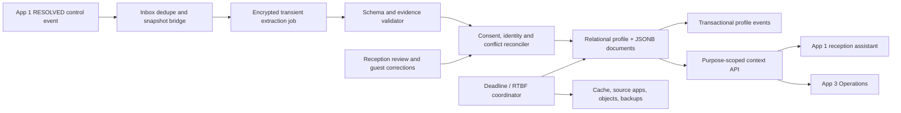

# App #2 — Customer Center / Adaptive Hotel Guest CRM

**The Living Guest Profile System** · engineering and product dossier · researched 23 September 2026 · PostgreSQL 16 · Telavi, Kakheti, independent hotels and wine-tourism stays.

## 1. Product decision, evidence boundaries and scope

Build a property-scoped guest memory system that converts **explicit, attributable guest statements** into reviewable, expiring service preferences. It must reconcile identity, contradictory statements, consent, source revisions, and deletion before feeding context to the Contact Center or Operations. A profile is a current projection of evidence with provenance and expiry, not an ever-growing collection of model guesses.

**[I] Evidence convention:** **[D]** directly documented source behavior or legal text; **[V]** vendor claim, not independently tested; **[O]** observed retrieval/local execution; **[I]** proposed product/design/test/threshold; **[U]** unavailable or unverified. Unless explicitly labeled otherwise, architectures, code, examples, budgets and acceptance criteria are proposals. All guest examples are fictional. Source IDs resolve to §12. “Exhaustive” means coverage of the requested dimensions and failure/recovery cases, not proof of every competitor feature or legal deployment condition.

**[O] Read-only inputs:** `task_research.md` and `research/apps/01_contact_center_dossier.md`. The brief does not establish representative local loss, demand, customer willingness to pay, or operator interview evidence. App #1 establishes property UUIDs, verified reservation binding, immutable ordered messages, temporal chapters, control versions and an outbox. This dossier neither changes those files nor treats their simulated scenarios as observed hotel results.

**Naming scope:** the comparison names only the four CRM vendors explicitly requested. Additional data-engine designs are described generically. No unspecified proprietary system names are introduced. The request supplied no list of forbidden names; this conservative scope avoids importing unrelated names from the input dossier.

### 1.1 MVP user outcomes

| Hotel situation | Living profile behavior | Hard boundary |
|---|---|---|
| Returning guest asks for a quiet courtyard room | Show latest explicit preference, date, scope and source confidence to reception | Preference does not reserve inventory or promise availability |
| Wine-tour visitor chooses an alcohol-free tasting | Save declared experience preference only for the requested scope | Never infer religion, pregnancy, health, addiction, wealth or personality |
| Guest says an earlier nut-allergy entry was about a companion | Stop using the disputed association immediately; request human verification | Never assign a companion's health data to the person holding the phone |
| Travel agency books using an OTA relay address | Record reservation-scoped contact and possible identity candidates | Relay-address similarity is not identity proof or marketing consent |
| Guest later books directly | Link only through verified evidence; review any ambiguous merge | Shared family phone cannot automatically merge people |
| Hotel adds “preferred wine-tour language” | Approve a field definition; JSONB documents accept the new key | No arbitrary SQL, schema migration, model-created sensitive field or generic scoring field |
| Guest invokes deletion | Fence reads/writes, delete local CRM PII, propagate to all recipients, track completion | Do not claim backups or another app were deleted merely because a local row vanished |

### 1.2 MVP boundary and non-goals

Include dynamic property fields and logical collections, identity candidate review, explicit-preference extraction, consent/purpose checks, conflict resolution, a fast context API, deletion/retention coordination, audit, segmentation and export controls. The PMS owns reservations and checked-in guest associations; Finance owns folios; Operations owns task completion; App #1 owns messages and speaking control. CRM cannot authorize late checkout, grant refunds, create financial eligibility scores, infer emotions, or turn service requests into marketing permission.

No autonomous cross-property identity graph, predictive personality, emotion recognition, social scoring, credit profiling, inferred wealth, or automated exclusion from hotel services is in scope. “Spending tier” means a transparent **hotel-local historical loyalty band**, derived from settled/refunded folio amounts in a declared currency/window and used only for permitted hospitality reporting/loyalty benefits. It is not ability-to-pay, creditworthiness, future value prediction, a worthiness score, or a reason to deny service. Actual revenue remains in Finance; the CRM stores the bounded band and its calculation/version/provenance.

## 2. Competitive teardown and benchmark design

### 2.1 Hospitality platforms and modern data-engine patterns

| Platform / evidence | Demonstrated public positioning or claim | Unverified gap / what to test | Our response |
|---|---|---|---|
| **Revinate** [V: V1–V3] | Unified rich guest profiles from booking/folio/other hotel sources; cleansing/normalization; segmentation and activation; current pages describe AI-driven recommendations and approval-controlled action | The inspected AI page distinguishes current functions from future strategy/execution. Exact per-claim dialogue provenance, relay-email identity handling, conflict/erasure semantics and schema extensibility were not independently tested | Do not claim it is merely static. Benchmark chapter-to-preference accuracy, evidence visibility, review burden and deletion behavior |
| **Cendyn** [U: V4] | Requested comparator for hospitality CRM; direct homepage/product/help retrieval encountered access challenges | Current functionality, matching rules, custom-field costs, unstructured extraction and retention controls could not be verified in this session. No feature absence or failure rate is asserted | Require a documented demo covering the same fixtures; leave capability cells unknown until product evidence is accessible |
| **Duve Guest Profiles** [V: V5–V7] | Profiles built from PMS data, booking source, party composition, check-in answers and in-app behavior; segmentation changes guest content/offers; configurable check-in questions feed profiles | This contradicts a blanket claim that custom fields require vendor migrations or all data is manually typed. Unstructured chapter extraction, provenance/conflict handling, lifetime consent and safe merge rules still need a controlled test | Match survey/PMS strengths; prove explicit chat evidence, companion separation and expiry propagation |
| **Profitroom** [V: V8–V9] | Integrated CRM/email automation; behavior-triggered messages and campaign measurement; broader booking/direct-guest-data ecosystem | Marketing automation is not evidence of real-time service-memory reconciliation. Exact dedupe, relay-email rules, custom-schema changes and chat extraction were not established | Compare marketing and service purposes separately; demonstrate an updated preference actually reaches reception without granting marketing consent |
| **Streaming profile engine** [I: architecture pattern] | CDC/events maintain materialized guest projections and low-latency reads | Transport does not prove identity or lawful purpose; replay can resurrect deleted people | Versioned source links, inbox/outbox, expiry gates and erasure fences |
| **Schema-driven extraction engine** [I] | Structured model output turns text into typed candidates | Valid JSON is not true, correctly attributed, current or consented information | Exact-source evidence check, guest/companion attribution, policy allowlist, conflict review and expiry |
| **Identity graph / record-linkage engine** [I] | Candidate generation and deterministic/probabilistic matching across channels | Transitivity can merge a family, agency or group booking into one person | Property partition, evidence-qualified edges, no-contact-only auto-merge, reversible merge plan |
| **Warehouse-to-operational-profile engine** [I] | Segmentation/read models can reuse hotel data without another manual entry workflow | Batch freshness, deletion propagation and authorization may lag | Explicit freshness/consistency contract and purpose-limited context payloads |

The last four rows are engineering pattern benchmarks, not claims about unnamed proprietary products. PostgreSQL JSONB/indexing behavior is supported by technical source T1; pattern performance is subject to local measurement.

### 2.2 Failure mechanisms, evidence strength and competitive edge

| Proposed market failure | Evidence-based finding | Engineering failure / hotel impact | MVP acceptance oracle |
|---|---|---|---|
| Passive static profiles | [V] Current inspected products already advertise automation and integrated profiles; prevalence of manual reception work is [U] | A new preference remains in chat and reception acts on old data | A completed eligible chapter creates attributable candidates and an updated context version, without retyping |
| No chat-driven updates | [U] Exact extraction capabilities across vendors unverified | “No stairs for my father on this stay” becomes the booker's permanent accessibility label | Correct subject/scope, human review for sensitive service facts, no permanent companion attribution |
| OTA relay fragmentation | [I] Identity mechanism risk; no controlled vendor failure reproduced | One guest has multiple booking aliases, while one agency email represents many guests | Relay identity scoped by property/issuer/reservation; no merge solely from proxy address/name |
| Rigid schema / expensive migrations | [U] No pricing/contract evidence establishes this broadly; Duve advertises custom questions [V] | Every new service attribute needs engineering/vendor work, or uncontrolled custom fields become a privacy dump | Add an approved field/collection with no database DDL; reject unknown fields and prohibited purposes |
| “AI knows the guest” overreach | [I] Generative inference risk | Wine interest becomes alcohol-use or wealth inference; complaint becomes a personality label | Model cannot emit emotion/social/credit fields; disputed/source-free claims never activate |
| Silent conflict overwrites | [I] Event-order and evidence problem | A late-arriving old chapter replaces a recent guest correction | Source revision, observation time and evidence precedence; conflict queue with no silent last-arrival-wins |
| Erasure stops at database | [I] Distributed lifecycle problem | Old cache, export, model trace or outbox recreates deleted profile | Local fence plus consumer receipts, key expiry, restore suppression and retry-safe purge |

**Competitive edge:** service memory with an auditable chain `chapter snapshot → explicit evidence → consent/purpose → candidate → reconciled fact → versioned context → expiration/erasure`. It is a falsifiable implementation property, not a claim that competitors cannot implement it. Preserve the competitors' PMS ingestion, survey, segmentation and automated-trigger strengths while proving these harder safety/coordination cases.

### 2.3 Controlled evaluation and buying decision

Use identical synthetic Telavi hotel policies, PMS records and conversation fixtures in every vendor demo: same guest through an OTA relay and direct email; two family members sharing a phone; repeat visitor with changed preference; negation in Georgian/Russian/English; companion allergy; explicit wine-tour interest without alcohol-use inference; correction after chapter resolution; delayed duplicate event; field addition; RTBF while extraction is running; deletion and replay after restore. Record configuration, entitlement, actor work, resulting profiles, provenance, match/merge decisions, API latency and deletion receipts. Unknown functionality remains unknown.

Ask for documented matching/proof rules, custom-field limits and pricing, supported PMS/OTA access, purpose controls, export/delete APIs, model/subprocessor retention, Georgian-language quality, multi-property isolation and undo behavior. Compare total cost including reception review, data cleanup, integration, support and privacy operations. No vendor accuracy, local ROI or cost ranking is established here. Configure/buy a platform if it passes the same gates more efficiently than a new build.

## 3. Functional architecture and property-defined schemas

### 3.1 Components and read/write ownership



Start as a modular service backed by PostgreSQL, object/key storage for transient snapshots, stateless API processes, and asynchronous workers. Models propose candidates only. Trusted code owns identity linking, permissions, field activation, merge commits, profile versions, retention clocks and events. A broker is optional initially; the outbox/inbox pattern is not optional. Source adapters and workers run with different credentials and least privilege.

**Reception workspace:** identity candidate card, verification proof and ambiguity; current preferences with source/date/scope/expiry; disputed claims queue; original quote available only during the transient window; field-definition approval; merge comparison/undo; purpose/permission history; deletion progress. Staff should see a small useful service summary, not a dossier of inferred personal traits. A guest correction suppresses the disputed value immediately while verification proceeds.

### 3.2 Custom attributes and logical tables without DDL changes

A property's schema is **metadata**, with `custom_collections` defining logical tables and `profile_custom_fields` defining their allowed attributes. `crm_profiles.custom_attributes` stores one JSONB document for profile-level fields. `custom_records.attributes` stores one JSONB document per row of a repeatable logical collection, e.g. requested wine-tour experiences. These are not per-cell value rows. The fixed relational tables preserve identity, ownership, versions, expiry and constraints.

Example property definitions:

| Collection / attribute | Type / permitted meaning | Example value | Governance |
|---|---|---|---|
| `profile.room_area` | enum: quiet_courtyard, near_lift, no_preference | quiet_courtyard | Explicit preference; does not promise allocation |
| `profile.meal_choice` | enum: vegetarian, vegan, standard | vegetarian | Do not infer religion or medical diagnosis |
| `profile.corporate_affiliation` | bounded text | Fictional Kakheti Event Team | Guest-declared/company-booking proof; not employment eligibility |
| `profile.loyalty_band` | enum defined by published hotel calculation | returning_guest | Deterministic folio/visit facts; no inferred wealth/credit |
| `wine_visits.tour_language` | enum: ka, en, ru | ka | Declared service language, not nationality |
| `wine_visits.alcohol_free` | boolean | true | Guest choice; no reason/health inference |
| `wine_visits.requested_date` | ISO date | 2026-10-04 | Expire with service purpose/stay |

Lifecycle: proposed field → privacy/semantic approval → active → deprecated/retired → purpose-based deletion. An LLM cannot create/activate fields. Validate ASCII field keys, type, allowed values, collection ownership, semantic code, purpose, value size and schema version. Human semantic review is required because a denylist cannot detect every coded synonym in every language. The API rejects arbitrary schema keywords and executable expressions. Field type/meaning changes use a new key/version and an explicit migration job; do not silently reinterpret existing values. Remove or migrate populated values before setting the old definition to retired, since the validator deliberately rejects writes containing retired keys. Adding a new field needs no table DDL; a new high-volume numeric filter may still justify an index migration after measurement.

Segmentation example: `custom_attributes @> '{"room_area":"quiet_courtyard"}'` uses `jsonb_path_ops` GIN [D: T1]. Multi-valued enum containment is also supported. Numeric ranges/sorting are not what that index optimizes: use bounded supported query operators and targeted expression/B-tree indexes for proven workloads. Do not allow arbitrary user SQL/JSONPath. Filter active profile, purpose/permission and expiry before returning segments or activating a campaign. Hotel-service data cannot automatically join a marketing audience.

### 3.3 Preference modeling and precedence

`guest_preferences` holds a **domain-specific assertion document**, not an untyped attribute/value cell. A room assertion may contain pillow type and area together, with shared source, scope and evidence. Relational columns hold domain, status, stay reference, observation time, permission, confidence, source IDs and expiry. The current profile is a derived projection of accepted assertions; `candidate`, `disputed`, `superseded` and `withdrawn` rows are not active service context.

Precedence: explicit guest correction/withdrawal → current verified guest statement → staff confirmation backed by a guest interaction → explicit survey answer → older accepted preference. Source observation time and revision matter; ingestion arrival order is not truth. A newer statement does not automatically override a higher-authority correction or a differently scoped stay preference. “Two pillows tonight” is a stay request; “please remember that I prefer hypoallergenic pillows” is eligible persistent service memory if a valid purpose/basis exists. Guest statements are verified **as statements**, not independently proven medical or biographical facts.

Conflict key is `(property,canonical subject,domain,scope,stay,key)`. Conflicting values produce a review item and a withheld/disputed key, while unrelated accepted keys remain available. A reconciler performs per-key attribution and materializes only the selected values; it does not blindly concatenate documents. A removed message/source revision invalidates dependent claims even after resolution. Source references and reviewer decisions persist only for the accepted preference's lawful lifetime; copied transcripts do not.

### 3.4 Identity resolution and merge engine

Normalize in a trusted service: verified E.164 where country context is known; email domain canonicalization without globally stripping dots/plus tags or changing case-sensitive local-part semantics; provider subject scoped by account; PMS guest ID scoped by PMS/property; OTA proxy scoped by issuer/property/reservation. Store tenant-keyed HMAC for exact candidate search and encrypted contact value only when needed. Unsalted email hashes are vulnerable to dictionary recovery. HMACs and encrypted identifiers remain personal/pseudonymous data, not anonymous data. Key rotation uses a controlled dual-read/dual-write interval and cross-key duplicate checks; a unique index within one key version alone is insufficient.

| Evidence | Suggested confidence / use | Automatic outcome |
|---|---|---|
| Same verified source identity and same property/issuer/scope | 1.00 for source continuity, not metaphysical personhood | Reuse its existing profile subject to sharing/revocation |
| Signed reservation link with verified guest challenge and PMS association | Candidate score target ≥0.995 after calibration | Link a channel to that verified person if no contradictory/shared evidence |
| Same phone/email with possession only | Candidate signal; never treated as unique person by itself | Review or challenge; families and agencies share contacts |
| OTA relay address or approximate name/date similarity | Weak/booking-scoped evidence | No automatic person merge |
| Different verified guests using same contact | Conflict veto regardless of high model score | Preserve separate profiles and shared-contact relation |

Scores are proposed calibrated linkage probabilities, not LLM confidence claims. Until labeled hotel pairs and false-merge rates are measured, deterministic verified-source continuity is the only automatic reuse rule. Thresholds should be chosen for very low false merges, with precision/recall and abstention reported; no arbitrary score converts weak evidence into identity proof. Georgian transliteration/name similarity may generate candidates but cannot authorize a merge.

`IdentityLinkedEvent` means an identity was associated with a profile after proof; it is different from `IdentityMergeCommand`, which proposes combining two existing profile views. All person merges in the MVP require an authorized reviewer, two expected profile versions and evidence. Shared family phones are nonexclusive; OTA relays are never exclusive. The `exclusive` flag is granted only for an issuer identity whose uniqueness has actually been verified. An expired exclusive row must be revoked/removed before reuse; the partial unique index intentionally blocks rather than silently stealing it.

**Merge transaction:** validate staff role/evidence/proof expiry → expand both existing alias clusters → acquire advisory locks on sorted `(space,profile UUID)` before row locks → validate every version/privacy epoch/deadline and absence of erasure → compute field conflicts → approve plan → insert review and aliases → bump affected versions/clear summaries → write event/outbox/audit → commit. No cross-property merge. Flatten to a single canonical root and reject cycles; only the merge service writes aliases. SQL self-reference checks alone do not enforce acyclicity.

MVP merge is a **reversible overlay**: retain original source profiles, identities, permissions, jobs and assertions under their original IDs and deadlines; do not physically move job rows or union permissions. Source profiles remain active internally, and the lookup API resolves the alias to the canonical view. The optional `merged` profile state is reserved for a later archival workflow, not used to hide overlay evidence. New direct API requests to aliases resolve explicitly and return canonical ID/version. Combine only lawful currently active evidence; never extend a visitor's seven-day lifetime by aliasing it to a registered profile. A preference contributed by an expired source stops contributing even if the canonical registered profile survives.

Undo removes the reviewed edge, recomputes affected projections and versions, and retains provenance under its proper remaining retention window. New post-merge claims must identify their original evidence subject so they can be separated; ambiguous claims go to review on undo. Merge never promotes marketing/sensitive permissions from one person or source to another. RTBF expands and erases the verified subject's entire merge cluster; the coordinator acquires all locks, removes aliases and calls local erasure for each member in one transaction. The single-profile SQL helper deliberately refuses an unresolved merge cluster rather than partially deleting it.

## 4. Asynchronous extraction and proactive context

### 4.1 Exact integration with the read-only Contact Center

**[O] Existing App #1 contract:** `ConversationControlChangedEvent`, `schema_version:1`, with `data.state:"RESOLVED"`, `data.control_version`, actor/owner/reason and conversation envelope identifiers. It does **not** contain a chapter ID, source revision, message watermark or CRM profile ID. Its text proposes extraction keyed by `(conversation,chapter,through_seq,extractor_version)`, but the event payload alone is insufficient to create a reproducible job.

**Required bridge, specified here without editing App #1:** consume the existing event, dedupe `(space,consumer,event_id)`, validate state/version, and call a trusted snapshot endpoint proposed for App #1: `GET /v1/internal/conversations/{id}/resolved-snapshots?control_version={v}`. The source must capture a manifest in the same resolution transaction or reconstruct it from durable source history at that version; reading “the latest transcript” later is not equivalent. The manifest contains `space_id`, conversation/control version, each eligible chapter ID, `through_seq`, `source_revision`, source digest, guest participant/reservation binding proof and source content expiry. A receiver creates one job per eligible chapter/revision/model version. A new endpoint/source snapshot capture is an explicit integration requirement, not an existing feature falsely attributed to the read-only file.

App #1 participant UUID and CRM profile UUID are **not assumed equal**. `profile_source_links` maps the verified source participant; ambiguous binding creates a review/visitor record only when an allowed purpose exists. No LLM chooses property/profile IDs. Completion is not registration: `RESOLVED` does not prove a PMS stay, create marketing consent, or turn a visitor into a registered guest.

The CRM's 24-hour processing policy applies to its copies, including raw snapshot, candidate output, quote snippets, retries, traces and intermediate files. App #1's original transcript policy in its dossier is longer. This dossier cannot claim to change that read-only policy: cross-app deletion requires an implemented retention/redaction API and property policy alignment. Treat this as a release dependency, and explicitly distinguish “CRM transient copy deleted” from “all conversations deleted.” The model provider's retention and logging must meet the same processing deadline or the integration is ineligible.

### 4.2 Job state machine and transaction boundaries

`queued → running → review → applied`, or `running → applied` for allowlisted ordinary explicit facts. `queued/running/review → rejected|expired|cancelled`. A recoverable worker error returns to queued only before the original deadline and retry budget; applied is terminal for that job version. Corrections create a new revision/job and a compensating reconciliation, not an overwritten historical model result.

1. Validate authenticated App #1 event + source manifest; check source subject, current privacy epoch, permission, source revision and deletion fence. Record inbox/job atomically. Reject unsupported schema versions to a metadata-only quarantine; never store an unbounded raw rejected payload.
2. Assign fixed `first_ingested_at` and `transient_deadline = min(first_ingested_at + property transient policy, source content expiry, profile expiry)`. Redelivery, retry, extractor upgrades and review do not reset the deadline. Different extractor versions of the same snapshot share the original ingest anchor; coordinator and SQL guard reuse the earliest anchor for the same chapter/source digest. Changed snapshots extract only newly eligible evidence and respect per-source content expiry; they cannot repeatedly copy old source text to evade its processing deadline.
3. Obtain a row lease/token with `FOR UPDATE SKIP LOCKED`, increment attempts, mark running and commit. Fetch a minimum filtered guest-text snapshot; exclude staff private notes, unrelated people, payment/passport data and model replies as evidence. Encrypt transient payload under a deadline-controlled key; no raw text in outbox/logs.
4. Invoke a model in schema-constrained structured-output or function-call mode. The declared function returns **candidate data only** and grants no tool authority. The chosen provider must support the schema subset; if it does not, validate locally and fail closed. JSON validity is not factual verification.
5. Validate structure, allowed domains/keys, subject attribution, exact message IDs and quote/offset correspondence, explicit-vs-inferred assertion, temporal scope and source revision. “I don't want wine tastings” is a negated preference, not positive wine interest; “my father” is not the verified booker. Detect conflicting source/corrections and reject prompt-injection attempts as data, not instructions.
6. Policy reconciliation checks approved field metadata, service-memory purpose, sensitive-data explicit consent and reviewer, retention, guest correction precedence, current source binding, expected profile version and privacy epoch. No raw model-supplied confidence can bypass those checks.
7. Commit under the profile row lock and deletion gate: validate lease token/expiry/deadline again; mark job applied while its expected version still matches; write accepted preference documents; update profile and clear/rebuild summary at new version; append `ProfileExtractedEvent`; commit. Job and profile writes share one transaction. If profile version changed, rollback, reread, re-reconcile against current facts and update expected version only after review—not a blind retry of the stale patch.
8. Record only source IDs, digest, extracted allowed fact, basis, scope, observation/expiry and decision—not a duplicate transcript. Candidates requiring review remain encrypted/transient until accepted or the deadline. At deadline reject/expire unfinished processing and erase payload; do not extend storage because reception has not reviewed it.

A source digest is a content-integrity check, not anonymity proof. Re-identifiable source references and sparse preference combinations remain personal data. If source text has expired, the system may retain the accepted fact and its verified processing record within the profile lifetime, but must not pretend a reviewer can still inspect the original quote. The UI shows “source text expired; acceptance record retained.”

### 4.3 Ethical AI policy as code

Allowlisted extraction domains: room, dining, wine experience, service, explicit feedback. No free-form `tags`, `traits`, arbitrary score array or catch-all `other` field. Schema `additionalProperties:false`, domain-specific allowed keys, controlled metadata activation and SQL triggers reject unsupported fields. Invalid candidates are rejected with a safe error code, not persisted verbatim in a failure log. The field API rejects prohibited purposes and terms; all active fields require a human semantic approval ID. Translations/synonyms and covert coded fields require reviewer oversight: a regex is a backstop, not a complete semantic proof.

**Satisfaction indicators** are explicit survey ratings and guest-reported service issues/resolution. Do not infer anger, sadness, stress, personality or emotional state from words, voice, face, behavior or embeddings. A guest's complaint can become `reported_service_issue:"room_ac"`, never `emotion:"angry"` or a person-level negativity score. Do not persist voice/face emotion features at all. No model-based credit/risk/wealth ranking or social score may be created under a different field label. Ordinary service preference extraction does not authorize high-impact automated decisions.

Dietary choices may be ordinary preferences, but allergies and accessibility/health requirements can be sensitive, as can inferences about religion from food choices. The fixed sensitive keys are never downgraded to ordinary by a client flag. Persistent sensitive memory requires explicit, scoped permission, human confirmation and minimum duration; absent that basis, handle a necessary current service request in the responsible operational workflow with its own lawful controls instead of retaining a CRM health profile. No claim that service consent covers all sensitive processing is made.

### 4.4 Context feeding to Apps #1 and #3

`POST /v1/spaces/{space}/profile-lookup` accepts one verified source identity reference or profile ID and a purpose/audience, never a URL query containing raw email/phone. It returns zero/one/ambiguous matches and minimum context, with `profile_version`, `privacy_epoch`, `valid_until`, source freshness and allowed preference scope. App #1 gets service language and relevant current preferences; App #3 gets only the operationally needed meal/room/service instructions, not contact identities, corporate history, ratings or loyalty data. A CRM preference does not create or authorize an Operations task.

**Target <50 ms:** define this as same-region server-side p95 for an authorized, indexed lookup at a declared pilot load, excluding external PMS/model/network time. It is not a measured deployment guarantee. Candidate lookup uses composite HMAC/source-link indexes; direct profile lookup uses composite primary keys. Materialized non-sensitive summary uses `summary_through_version`, `summary_valid_until` and `privacy_epoch`. Recompute if stale; never cache beyond the earliest included profile/preference/permission/source-cluster expiry. Sensitive values are not stored in broad summary/cache/segmentation payloads; fetch them under separate authorized purpose checks.

Proposed budget: auth/property/purpose 8 ms; identity/profile and permission lookup 12 ms; projection/expiry validation 12 ms; serialization 5 ms; headroom 13 ms. Benchmark 20 properties, 50,000 profiles/property, 2,000,000 identity rows overall, 200 requests/second and 20 concurrent writes before asserting the target. Report p50/p95/p99, warm/cold cache, read-after-write correctness, expiry behavior and the actual generated fixture counts.

A cache-only tombstone subscription cannot guarantee immediate RTBF because event delivery can lag. Every context response checks the authoritative primary privacy gate/version (or a synchronously updated gate with equivalent guarantees); cache entries carry subject/epoch/version and are rejected when mismatched. Erasure fail-closed mode returns no personalized context if the gate is unavailable. For read-after-write, use primary or a replica with a verified commit watermark; a stale replica cannot authorize service memory. No global sequence is assumed to equal commit order.

## 5. Privacy, Georgia law and EU GDPR

### 5.1 Legal evidence and jurisdiction

**[D: L1–L2]** GDPR Articles 3, 5, 6, 9, 12, 17, 19, 22, 28, 32, 35 and 44 address scope, principles, lawful bases, sensitive categories, rights, erasure, recipient notification, significant automated decisions, processors, security, impact assessment and transfers. The Commission's official overview was retrieved. Official consolidated regulation routes did not deliver usable text; the article text inspected was a clearly identified secondary reproduction. This is an engineering mapping, not a statement that a secondary website is the legal publisher.

**[U: L3] Georgian-law verification limitation:** the requested national legal analysis needs the current consolidated Law of Georgia on Personal Data Protection, including amendments in force at deployment. The official legislative-portal entry and attempted download returned access-denied content; regulator routes failed. The law identifier/entry is recorded, but the current consolidated text, article numbers, regulator identity and local response/notification deadlines were not verified here. Do not copy deadlines or institutional names from an old law or present them as confirmed September 2026 requirements. Before production, a qualified Georgian privacy reviewer must validate the current text, hotel recordkeeping duties, marketing/sensitive-data bases, transfer rules and rights response deadlines. The software below deliberately implements strong purpose, minimization, security, rights and retention controls without inventing local statutory periods.

GDPR does not apply merely because a hotel guest has an EU passport. Apply Article 3's establishment/targeting/monitoring tests to the actual hotel and processing. Where GDPR applies, hotel/controller and processor duties, permitted transfer mechanism, notices and processor contracts must be documented. A model/service hosted abroad is not automatically an authorized transfer. Retention requirements of registration/accounting/tax law belong in the owning system's purpose-specific register; they do not justify keeping an unrestricted CRM profile forever.

### 5.2 User-defined retention rules versus law

The **24-hour / seven-day / 24-month limits are this product's required policies**, not deadlines established as blanket legal mandates by the inspected GDPR articles or the inaccessible Georgian text. GDPR storage limitation is purpose-based; erasure has grounds and exceptions. Article 12's one-month response rule (with conditional extension) is a legal rights-handling outer rule, not permission to wait a month before stopping an unlawful use. The product chooses immediate fencing after authenticated RTBF acceptance.

| Data class | Exact program rule / anchor | What cannot reset it | End action |
|---|---|---|---|
| Transient conversation processing | Default 86,400 seconds from **first CRM receipt of snapshot**; property may shorten, never silently lengthen; cap by source/profile expiry | Delivery retry, model retry, job lease, review delay, extractor-version rerun | Stop access/decryption; expire job content; delete snapshot/candidates/quotes/traces and keys |
| Unregistered visitor | **Exactly 7×24 hours from initial profile creation**, UTC; no sliding activity window | A chat, survey, resolution, merge or guessed booking | Profile becomes inaccessible at deadline; autonomous purge across child PII and projections |
| Registered guest | Configurable 1–24 calendar months from verified registration anchor, never beyond 24 | Chat activity, extraction, marketing opens, repeated job attempts | Inaccessible at computed deadline; purge ordinary CRM profile |
| Stay-only preference | Earliest of explicitly selected service/stay purpose end, permission expiry and profile expiry | A later unrelated chapter | Stop use and purge/withdraw assertion/projection |
| Sensitive service memory | Explicit permission scope/deadline; shorter necessary duration; no broad 24-month default merely because profile lasts | General service or marketing permission | Revoke/suppress and erase sensitive fields when purpose/basis ends |
| RTBF | Fence at local transaction commit after request identity/scope verification | In-flight job, cached profile, duplicate webhook or stale snapshot | Local hard deletion plus durable cross-app erasure workflow |

A visitor converts to registered only on an authenticated, documented PMS/account-registration event before visitor expiry; state `RESOLVED` is insufficient. Set a new immutable `registered_at` and proof reference. Registering an already-purged visitor creates a new independently authorized profile; it does not recover erased history. The 24-month anchor is not “last activity.” Renewal is not automatic; the MVP expires this profile at its original capped deadline. Policy changes may shorten existing effective deadlines immediately; increasing a policy never extends already-stored deadlines. Use UTC instants for durations and property timezone only for display/guest communication; calculate calendar months with a defined PostgreSQL/session timezone, set to UTC for this service.

**Strictness and physical limits:** ordinary reads/writes/decryption must stop at the exact deadline even if a sweeper is down. PostgreSQL RLS/API gates compare wall-clock deadline, not just an overnight cron status. A database cannot physically remove bytes from all replicas, encrypted backups and third-party processors at a nanosecond deadline during outages. Therefore report two measures separately: **zero permitted access after expiry** and **physical purge completion lag**, proposed ≤60 seconds for healthy online stores, with an alert for any miss. Do not call a midnight daily purge “strictly seven days,” and do not certify literal worldwide physical deletion at exactly seven days. If that literal interpretation is required contractually, a deployment cannot claim to satisfy it with asynchronous distributed storage.

Transient keys must have provider-enforced not-after and no plaintext copies outside the controlled worker. SQL ciphertext clearing alone is not cryptographic erasure if a live key can decrypt an old backup. The JSONB searchable profile is not individually cryptographically erased merely because the transient snapshot key is deleted; it still requires row/index/backup lifecycle controls.

### 5.3 Immediate RTBF protocol and anonymized audit boundary

1. Authenticate requester with proportionate proof through a secure channel; do not accept a deletion command from an unverified shared phone. Avoid collecting a new passport copy merely to erase optional preferences. Determine subject/cluster and controller scope; staff/processor requests require authorized credentials.
2. Serialize on all affected profile IDs in stable order. Reject concurrent merge; terminate/revoke extraction leases and increment privacy epoch conceptually in the erasure fence. The included helper writes a durable pseudonymous erasure record, hard-deletes the local profile and cascaded PII, writes recipient tasks/outbox and minimal audit in **one transaction**. HTTP returns only after this commit. No “soft deleted but still serving cache” interval is acceptable.
3. Cascade local identities/ciphertext, custom documents, permissions, preference assertions, source links, jobs/raw/candidates, alias/review PII and ordinary profile event rows. Cancel in-flight model output. A worker finishing after deletion finds no live profile/matching epoch and cannot commit.
4. Emit a minimal restricted erasure command; invalidate caches/search/exports/feature stores, source App #1 participant mappings and associated source content as appropriate, App #3 personal instructions, object storage, tracing/analytics and subprocessors. Each recipient has an idempotent receipt. Ordinary profile events already in a broker must be suppressed/redacted by consumer policy and retention; deleting the sender outbox cannot recall a delivered copy.
5. Keep state `local_erased → propagating → complete` only after required receipts and backup/restore suppression are in place. `exception_review` exposes legally retained source records and reasons; do not label partial erasure complete. Failed recipient jobs retry with a deadline and human escalation. Do not delete suppression records before all queues/replays/backup restore windows are covered.
6. Backups are access-restricted and expire on a documented rotation. A deletion ledger is replayed into an isolated restore **before** any restored system serves guests or resumes extraction. Where encrypted raw objects are recoverable, revoke their keys. Ledger contains only necessary pseudonymous correlation, has separate access/purpose/expiry, and is not described as anonymous.

`gdpr_audit_log` deliberately stores only property, day, action/policy and count, with no profile/contact/request/actor ID, quote, IP, freeform JSON or exact timestamp. Financial and operational history retained for general analytics must be irreversibly de-identified: remove subject keys/free text/room-stay links and coarsen/suppress rare combinations. A one-person wine-tour refund can remain identifiable from date/amount despite removing a name. Aggregate/suppress small cells and assess re-identification; pseudonymization alone is not anonymization.

If law requires retaining identifiable invoices/registration records or information necessary for legal claims, keep the minimum in a restricted Finance/recordkeeping system under a documented basis and deadline, separated from CRM personalization. Such a record is **lawfully restricted personal data**, not an anonymized record, and must be disclosed in the rights response as applicable. Do not destructively “anonymize” records that must remain identifiable for a verified statutory obligation, and do not invent a Georgian accounting retention period.

### 5.4 Programmatic retention engine and recovery

Scheduler ticks at least every minute per property; worker acquires bounded batches, uses original immutable anchors and idempotent erasure IDs, clears transient jobs with `purge_transient`, and deletes expired profiles with `expire_due`. Expired merge clusters go to the coordinator rather than being ignored: expand aliases, remove only the expired contributions for normal retention, recompute surviving canonical summaries, and erase all verified subject members for RTBF. The single-profile helper intentionally raises on live aliases; the coordinator removes/handles them within its locked transaction first.

The DDL includes a distinct maintenance role so it can see expired rows while still respecting tenant RLS. Ordinary runtime accounts cannot assume that role. The worker sets tenant context from a trusted inventory, never a request body. Retry expiry jobs with stable IDs and fail closed on gate/key-store outage. Monitor oldest overdue row/key, physical lag, outstanding erasure receipts, cache rejection, resurrected events and restore validation. Reaper failure is an incident, not a silent retention extension.

Thirty-day pseudonymous erasure/suppression records in the baseline are a proposed bounded control-store setting requiring a lawful purpose and adjustment to the actual replay/backup window. They are **not remaining visitor CRM profiles**, not contact-value hashes and not anonymous audits. Delete them only when receipts are complete and old data can no longer be reintroduced; otherwise escalate an explicitly documented retention exception instead of silently extending a guest profile. Before cascading source links, the SQL helper snapshots their source-system/subject UUIDs into the restricted erasure record and outgoing command. The source-link trigger blocks reattaching those erased source subjects to a new random profile ID. Recipients therefore still know what to erase after local mappings disappear. Source systems must additionally reject source events older than the deletion watermark. A UUID/source-subject tombstone alone cannot stop arbitrary re-creation from a fresh contact string without source-ingestion controls.

## 6. PostgreSQL 16 data architecture and DDL

### 6.1 Model and enforcement map

The seven requested tables are present: `crm_profiles`, `profile_identities`, `profile_custom_fields`, `guest_preferences`, `extraction_jobs`, `retention_policies`, `gdpr_audit_log`. Supporting collections, permissions, source links, merge reviews/aliases, inbox/outbox and erasure receipts make their workflows durable. `spaces` is a CRM-side property registry provisioned with the exact App #1 UUIDs, not a second independent tenant identity generator. All joins/FKs include `space_id`.

There is no legacy three-table EAV value model. Metadata defines allowed keys; each profile or logical collection row holds an ordinary JSONB document, with GIN containment indexing. Preference documents have explicit hospitality domain, scope, provenance and permission, rather than arbitrary key/value cell joins. Relational fields carry lifecycle and consistency-critical facts.

| Invariant | Enforced by |
|---|---|
| Property isolation | Composite FKs + tenant RLS on all tables + trusted authentication |
| No visitor sliding lifetime | Immutable creation anchor, deadline cap, RLS wall-clock check |
| ≤24-month registered profile | Policy CHECK, immutable registration anchor, deadline trigger/RLS |
| Expired raw/candidate unavailable | Job deadline CHECK/trigger/RLS; key not-after and worker purge required outside SQL |
| No unapproved/custom unknown key | Metadata approval, type/enum/size validation trigger; semantic review for field meaning |
| No emotion/social/credit fields | Fixed domain schemas, allowlisted semantic purposes/keys, prohibited-name backstop; no model-created fields |
| Shared contacts do not imply person equality | Nonunique candidate index, verified exclusive partial index, no OTA exclusivity |
| No stale extraction commit | Profile/epoch/version/lease/deadline checks in worker transaction; SQL guards baseline |
| RTBF cascades local PII | Profile child FKs, `erase_profile`, replay fence, outbox/receipt transaction |
| Audit survives without guest linkage | Minimal fixed audit columns, immutable trigger; aggregate disclosure controls |
| Context expiry/version | Active-profile view, summary version/validity, primary privacy gate and permission recheck |

### 6.2 Execution and security prerequisites

This single migration is executable on a **fresh PostgreSQL 16** database. It creates the isolated `guest_crm` schema and a global NOLOGIN maintenance role if absent; migration role needs extension/role creation privileges. `btree_gist` is available for future temporal constraints but no time-range index is falsely claimed to enforce identity certainty. This is one-time DDL, not a reset script; apply future changes as reviewed migrations.

Runtime roles are `NOSUPERUSER NOBYPASSRLS`, not table owners, with narrowly provisioned schema/table/column/function permissions. Public gets none. `FORCE ROW LEVEL SECURITY` does not restrain superusers/BYPASSRLS; tests must use an ordinary role for isolation proof. Set trusted `search_path=guest_crm,public`, `TimeZone=UTC`, and transaction-local `app.space_id` after authenticated property authorization. No guest, browser or model receives SQL credentials or the ability to set tenant/maintenance context. SQL functions are security-invoker; role provisioning deliberately remains deployment-specific rather than granting all tables to a general application role.

RLS adds expiry checks for normal profile and child reads. Private review/candidate workflows use time-bounded extraction jobs and narrowly controlled service paths; active context never exposes pending candidates. Identity/merge review evidence, erasure records and raw payload columns must not be granted to ordinary context readers. Read/write roles and lifecycle worker roles are separate. RLS with trusted GUCs is defense in depth, not authentication for arbitrary SQL users.

```sql

BEGIN;
CREATE EXTENSION IF NOT EXISTS btree_gist;
CREATE SCHEMA guest_crm;
DO $$ BEGIN
 IF NOT EXISTS(SELECT 1 FROM pg_roles WHERE rolname='guest_crm_privacy_maintenance') THEN
  CREATE ROLE guest_crm_privacy_maintenance NOLOGIN NOSUPERUSER NOBYPASSRLS;
 END IF;
END $$;
SET search_path=guest_crm,public;
CREATE TABLE spaces (
 id uuid PRIMARY KEY,
 property_code text NOT NULL UNIQUE,
 timezone text NOT NULL DEFAULT 'Asia/Tbilisi'
); -- provision with the same property UUID as App #1; never infer from model output
CREATE TABLE retention_policies (
 space_id uuid PRIMARY KEY REFERENCES spaces(id),
 version bigint NOT NULL DEFAULT 1 CHECK(version>0),
 transient_seconds integer NOT NULL DEFAULT 86400 CHECK(transient_seconds BETWEEN 60 AND 86400),
 visitor_days integer NOT NULL DEFAULT 7 CHECK(visitor_days=7),
 registered_months integer NOT NULL DEFAULT 24 CHECK(registered_months BETWEEN 1 AND 24),
 approved_by uuid NOT NULL,
 changed_at timestamptz NOT NULL DEFAULT clock_timestamp()
);
CREATE TABLE crm_profiles (
 space_id uuid NOT NULL REFERENCES spaces(id), id uuid NOT NULL DEFAULT gen_random_uuid(),
 kind text NOT NULL CHECK(kind IN ('visitor','registered')),
 state text NOT NULL DEFAULT 'active' CHECK(state IN ('active','restricted','merged','deletion_pending')),
 created_at timestamptz NOT NULL DEFAULT clock_timestamp(), registered_at timestamptz,
 registration_proof_ref text,
 expires_at timestamptz NOT NULL,
 version bigint NOT NULL DEFAULT 1 CHECK(version>0),
 privacy_epoch bigint NOT NULL DEFAULT 1 CHECK(privacy_epoch>0),
 display_name text,
 locale text,
 custom_attributes jsonb NOT NULL DEFAULT '{}' CHECK(jsonb_typeof(custom_attributes)='object'),
 context_summary jsonb NOT NULL DEFAULT '{}' CHECK(jsonb_typeof(context_summary)='object'),
 summary_through_version bigint NOT NULL DEFAULT 0 CHECK(summary_through_version>=0),
 summary_valid_until timestamptz,
 PRIMARY KEY(space_id,id),
 CHECK((kind='registered')=(registered_at IS NOT NULL)),
 CHECK((kind='registered')=(registration_proof_ref IS NOT NULL)),
 CHECK(expires_at>created_at),
 CHECK(registered_at IS NULL OR registered_at>=created_at)
);
CREATE INDEX profile_attributes_gin ON crm_profiles USING gin(custom_attributes jsonb_path_ops);
CREATE INDEX profile_expiry ON crm_profiles(space_id,expires_at,id);
CREATE TABLE processing_permissions (
 space_id uuid NOT NULL, id uuid NOT NULL DEFAULT gen_random_uuid(), profile_id uuid NOT NULL,
 purpose text NOT NULL CHECK(purpose IN ('service_memory','sensitive_service','marketing')),
 basis text NOT NULL CHECK(basis IN ('consent','explicit_consent','contract','legitimate_interest')),
 notice_version text NOT NULL, proof_ref text NOT NULL,
 granted_at timestamptz NOT NULL, expires_at timestamptz NOT NULL, revoked_at timestamptz,
 PRIMARY KEY(space_id,id), UNIQUE(space_id,profile_id,id),
 FOREIGN KEY(space_id,profile_id) REFERENCES crm_profiles(space_id,id) ON DELETE CASCADE,
 CHECK(expires_at>granted_at),
 CHECK(purpose<>'sensitive_service' OR basis='explicit_consent'),
 CHECK(purpose<>'marketing' OR basis IN ('consent','explicit_consent'))
);
CREATE TABLE profile_identities (
 space_id uuid NOT NULL, id uuid NOT NULL DEFAULT gen_random_uuid(), profile_id uuid NOT NULL,
 kind text NOT NULL CHECK(kind IN ('email','phone','channel_subject','pms_guest','ota_relay')),
 issuer text NOT NULL, scope_key text NOT NULL,
 token_hmac bytea NOT NULL CHECK(octet_length(token_hmac)=32), hmac_key_version integer NOT NULL CHECK(hmac_key_version>0),
 value_ciphertext bytea, -- encryption key and normalized-value HMAC produced by trusted identity service
 confidence numeric(5,4) NOT NULL CHECK(confidence BETWEEN 0 AND 1),
 proof_kind text NOT NULL CHECK(proof_kind IN ('unverified','possession','reservation_link','pms_association','staff_verified')),
 exclusive boolean NOT NULL DEFAULT false,
 shared_contact boolean NOT NULL DEFAULT false,
 verified_at timestamptz, revoked_at timestamptz, expires_at timestamptz NOT NULL,
 PRIMARY KEY(space_id,id),
 FOREIGN KEY(space_id,profile_id) REFERENCES crm_profiles(space_id,id) ON DELETE CASCADE,
 UNIQUE(space_id,profile_id,kind,issuer,scope_key,token_hmac,hmac_key_version),
 CHECK(NOT exclusive OR (verified_at IS NOT NULL AND NOT shared_contact AND kind<>'ota_relay')),
 CHECK(kind<>'ota_relay' OR (scope_key<>'' AND NOT exclusive))
);
CREATE UNIQUE INDEX identity_exclusive_live ON profile_identities
 (space_id,kind,issuer,scope_key,token_hmac,hmac_key_version) WHERE exclusive AND revoked_at IS NULL;
CREATE INDEX identity_candidates ON profile_identities(space_id,kind,issuer,scope_key,token_hmac,hmac_key_version)
 WHERE revoked_at IS NULL;
CREATE TABLE custom_collections (
 space_id uuid NOT NULL REFERENCES spaces(id), collection_key text NOT NULL,
 label text NOT NULL, version bigint NOT NULL DEFAULT 1 CHECK(version>0),
 approved_by uuid NOT NULL,
 PRIMARY KEY(space_id,collection_key),
 CHECK(collection_key ~ '^[a-z][a-z0-9_]{0,47}$')
); -- 'profile' is the field-definition namespace for crm_profiles.custom_attributes
CREATE TABLE profile_custom_fields (
 space_id uuid NOT NULL, collection_key text NOT NULL, field_key text NOT NULL,
 label text NOT NULL,
 value_type text NOT NULL CHECK(value_type IN ('text','integer','number','boolean','date','enum','multi_enum')),
 allowed_values jsonb NOT NULL DEFAULT '[]' CHECK(jsonb_typeof(allowed_values)='array'),
 semantic_code text NOT NULL CHECK(semantic_code IN
  ('room_preference','meal_choice','wine_experience','corporate_affiliation','loyalty_band','explicit_feedback','service_requirement')),
 purpose text NOT NULL CHECK(purpose IN ('service_personalization','guest_declared_interest','service_quality','loyalty_reporting')),
 status text NOT NULL DEFAULT 'proposed' CHECK(status IN ('proposed','active','retired')),
 version bigint NOT NULL DEFAULT 1 CHECK(version>0),
 approved_by uuid, approved_at timestamptz,
 max_length integer NOT NULL DEFAULT 256 CHECK(max_length BETWEEN 1 AND 512),
 PRIMARY KEY(space_id,collection_key,field_key),
 FOREIGN KEY(space_id,collection_key) REFERENCES custom_collections(space_id,collection_key),
 CHECK(field_key ~ '^[a-z][a-z0-9_]{0,47}$'),
 CHECK(status<>'active' OR (approved_by IS NOT NULL AND approved_at IS NOT NULL)),
 CHECK(value_type NOT IN ('enum','multi_enum') OR jsonb_array_length(allowed_values)>0),
 CHECK((field_key||' '||label) !~* '(emotion|social.?score|credit|psychometric|personality|wealth|trustworth|criminal|religion|ethnic)')
);
CREATE TABLE custom_records (
 space_id uuid NOT NULL, id uuid NOT NULL DEFAULT gen_random_uuid(), profile_id uuid NOT NULL,
 collection_key text NOT NULL, version bigint NOT NULL DEFAULT 1 CHECK(version>0),
 attributes jsonb NOT NULL CHECK(jsonb_typeof(attributes)='object'),
 expires_at timestamptz NOT NULL,
 PRIMARY KEY(space_id,id),
 FOREIGN KEY(space_id,profile_id) REFERENCES crm_profiles(space_id,id) ON DELETE CASCADE,
 FOREIGN KEY(space_id,collection_key) REFERENCES custom_collections(space_id,collection_key),
 CHECK(collection_key<>'profile')
);
CREATE INDEX custom_records_gin ON custom_records USING gin(attributes jsonb_path_ops);
CREATE INDEX custom_records_owner ON custom_records(space_id,profile_id,collection_key);
CREATE TABLE extraction_jobs (
 space_id uuid NOT NULL, id uuid NOT NULL DEFAULT gen_random_uuid(), profile_id uuid NOT NULL,
 source_event_id uuid NOT NULL, conversation_id uuid NOT NULL, chapter_id uuid NOT NULL,
 source_control_version bigint NOT NULL CHECK(source_control_version>0),
 through_seq bigint NOT NULL CHECK(through_seq>0),
 source_revision bigint NOT NULL CHECK(source_revision>0), extractor_version text NOT NULL,
 schema_version integer NOT NULL DEFAULT 1 CHECK(schema_version=1),
 source_digest text NOT NULL CHECK(source_digest ~ '^[0-9a-f]{64}$'),
 expected_profile_version bigint NOT NULL, expected_privacy_epoch bigint NOT NULL,
 state text NOT NULL DEFAULT 'queued' CHECK(state IN ('queued','running','review','applied','rejected','expired','cancelled')),
 first_ingested_at timestamptz NOT NULL DEFAULT clock_timestamp(),
 transient_deadline timestamptz NOT NULL,
 raw_ciphertext bytea, candidate_ciphertext bytea, payload_key_ref text,
 attempts integer NOT NULL DEFAULT 0 CHECK(attempts>=0),
 lease_token uuid, lease_until timestamptz,
 error_code text, -- code only, no model output/guest quote
 PRIMARY KEY(space_id,id), UNIQUE(space_id,profile_id,id),
 UNIQUE(space_id,conversation_id,chapter_id,through_seq,source_revision,extractor_version),
 FOREIGN KEY(space_id,profile_id) REFERENCES crm_profiles(space_id,id) ON DELETE CASCADE,
 CHECK(transient_deadline>first_ingested_at AND transient_deadline<=first_ingested_at+interval '24 hours'),
 CHECK(state='running' OR (lease_token IS NULL AND lease_until IS NULL))
);
CREATE INDEX extraction_ready ON extraction_jobs(space_id,state,lease_until);
CREATE INDEX extraction_expiry ON extraction_jobs(transient_deadline);
CREATE TABLE guest_preferences (
 space_id uuid NOT NULL, id uuid NOT NULL DEFAULT gen_random_uuid(), profile_id uuid NOT NULL,
 domain text NOT NULL CHECK(domain IN ('room','dining','wine_experience','service','explicit_feedback')),
 scope text NOT NULL CHECK(scope IN ('stay','persistent')),
 reservation_ref text,
 document jsonb NOT NULL CHECK(jsonb_typeof(document)='object'),
 evidence_kind text NOT NULL CHECK(evidence_kind IN ('guest_explicit','staff_confirmed','survey_explicit')),
 source_job_id uuid, source_message_ids uuid[] NOT NULL,
 confidence numeric(5,4) NOT NULL CHECK(confidence BETWEEN 0 AND 1),
 status text NOT NULL CHECK(status IN ('candidate','active','disputed','superseded','withdrawn')),
 sensitive boolean NOT NULL DEFAULT false, permission_id uuid NOT NULL,
 observed_at timestamptz NOT NULL, expires_at timestamptz NOT NULL,
 reviewed_by uuid,
 PRIMARY KEY(space_id,id),
 FOREIGN KEY(space_id,profile_id) REFERENCES crm_profiles(space_id,id) ON DELETE CASCADE,
 FOREIGN KEY(space_id,profile_id,source_job_id) REFERENCES extraction_jobs(space_id,profile_id,id),
 FOREIGN KEY(space_id,profile_id,permission_id) REFERENCES processing_permissions(space_id,profile_id,id),
 CHECK((scope='stay')=(reservation_ref IS NOT NULL)),
 CHECK(expires_at>observed_at), CHECK(cardinality(source_message_ids)>0),
 CHECK(NOT sensitive OR status<>'active' OR reviewed_by IS NOT NULL)
);
CREATE INDEX preferences_owner ON guest_preferences(space_id,profile_id,status,expires_at);
CREATE INDEX preferences_document_gin ON guest_preferences USING gin(document jsonb_path_ops);
CREATE TABLE profile_source_links (
 space_id uuid NOT NULL, profile_id uuid NOT NULL, source text NOT NULL, source_subject uuid NOT NULL,
 PRIMARY KEY(space_id,source,source_subject),
 FOREIGN KEY(space_id,profile_id) REFERENCES crm_profiles(space_id,id) ON DELETE CASCADE
); -- App #1 participant UUID, not an assumed equal CRM UUID
CREATE TABLE identity_merge_reviews (
 space_id uuid NOT NULL, id uuid NOT NULL DEFAULT gen_random_uuid(),
 source_profile_id uuid NOT NULL, target_profile_id uuid NOT NULL,
 source_version bigint NOT NULL, target_version bigint NOT NULL,
 confidence numeric(5,4) NOT NULL CHECK(confidence BETWEEN 0 AND 1),
 evidence jsonb NOT NULL CHECK(jsonb_typeof(evidence)='object'),
 state text NOT NULL CHECK(state IN ('proposed','approved','rejected','applied','undone')),
 approved_by uuid, created_at timestamptz NOT NULL DEFAULT clock_timestamp(), expires_at timestamptz NOT NULL,
 PRIMARY KEY(space_id,id),
 FOREIGN KEY(space_id,source_profile_id) REFERENCES crm_profiles(space_id,id) ON DELETE CASCADE,
 FOREIGN KEY(space_id,target_profile_id) REFERENCES crm_profiles(space_id,id) ON DELETE CASCADE,
 CHECK(source_profile_id<>target_profile_id),
 CHECK(state NOT IN ('approved','applied') OR approved_by IS NOT NULL)
);
CREATE TABLE profile_aliases (
 space_id uuid NOT NULL, alias_id uuid NOT NULL, canonical_id uuid NOT NULL, merge_review_id uuid NOT NULL,
 PRIMARY KEY(space_id,alias_id),
 FOREIGN KEY(space_id,alias_id) REFERENCES crm_profiles(space_id,id) ON DELETE CASCADE,
 FOREIGN KEY(space_id,canonical_id) REFERENCES crm_profiles(space_id,id) ON DELETE CASCADE,
 FOREIGN KEY(space_id,merge_review_id) REFERENCES identity_merge_reviews(space_id,id) ON DELETE CASCADE,
 CHECK(alias_id<>canonical_id)
);
CREATE TABLE crm_outbox (
 space_id uuid NOT NULL REFERENCES spaces(id), id uuid NOT NULL DEFAULT gen_random_uuid(),
 profile_id uuid, profile_version bigint, causation_id uuid,
 event_type text NOT NULL CHECK(event_type IN ('ProfileExtractedEvent','IdentityLinkedEvent','ProfileChangedEvent','ProfileErasureRequestedEvent')),
 schema_version integer NOT NULL DEFAULT 1 CHECK(schema_version=1),
 dedupe_key text NOT NULL, payload jsonb NOT NULL CHECK(jsonb_typeof(payload)='object'),
 created_at timestamptz NOT NULL DEFAULT clock_timestamp(), published_at timestamptz,
 PRIMARY KEY(space_id,id), UNIQUE(space_id,dedupe_key),
 CHECK(event_type='ProfileErasureRequestedEvent' OR causation_id IS NOT NULL),
 FOREIGN KEY(space_id,profile_id) REFERENCES crm_profiles(space_id,id) ON DELETE CASCADE
); -- erasure event has no FK to the deleted profile; payload is restricted control data
CREATE INDEX crm_outbox_ready ON crm_outbox(created_at) WHERE published_at IS NULL;
CREATE TABLE consumer_inbox (
 space_id uuid NOT NULL REFERENCES spaces(id), consumer text NOT NULL, event_id uuid NOT NULL,
 recorded_at timestamptz NOT NULL DEFAULT clock_timestamp(), expires_at timestamptz NOT NULL,
 PRIMARY KEY(space_id,consumer,event_id)
);
CREATE TABLE api_command_receipts (
 space_id uuid NOT NULL REFERENCES spaces(id), actor_id uuid NOT NULL, command_id uuid NOT NULL,
 profile_id uuid, request_hash text NOT NULL CHECK(request_hash ~ '^[0-9a-f]{64}$'),
 response_code integer NOT NULL CHECK(response_code BETWEEN 200 AND 599),
 response jsonb NOT NULL CHECK(jsonb_typeof(response)='object'), expires_at timestamptz NOT NULL,
 PRIMARY KEY(space_id,actor_id,command_id),
 FOREIGN KEY(space_id,profile_id) REFERENCES crm_profiles(space_id,id) ON DELETE CASCADE
); -- minimal response identities only; never store context/PII response bodies here
CREATE TABLE erasure_requests (
 space_id uuid NOT NULL REFERENCES spaces(id), id uuid NOT NULL DEFAULT gen_random_uuid(),
 profile_id uuid NOT NULL, privacy_epoch bigint NOT NULL,
 source_subjects jsonb NOT NULL DEFAULT '[]' CHECK(jsonb_typeof(source_subjects)='array'),
 reason_code text NOT NULL CHECK(reason_code IN ('rtbf','visitor_expired','registered_expired')),
 state text NOT NULL CHECK(state IN ('local_erased','propagating','complete','exception_review')),
 requested_at timestamptz NOT NULL DEFAULT clock_timestamp(),
 suppress_until timestamptz NOT NULL,
 PRIMARY KEY(space_id,id), UNIQUE(space_id,profile_id)
); -- temporary, restricted pseudonymous anti-resurrection record; NOT anonymous audit
CREATE TABLE erasure_receipts (
 space_id uuid NOT NULL, request_id uuid NOT NULL, system_code text NOT NULL,
 completed_at timestamptz, outcome text NOT NULL CHECK(outcome IN ('pending','erased','lawful_restriction','failed')),
 PRIMARY KEY(space_id,request_id,system_code),
 FOREIGN KEY(space_id,request_id) REFERENCES erasure_requests(space_id,id) ON DELETE CASCADE
);
CREATE TABLE gdpr_audit_log (
 space_id uuid NOT NULL REFERENCES spaces(id), id uuid NOT NULL DEFAULT gen_random_uuid(),
 action_code text NOT NULL CHECK(action_code IN ('erasure_local','retention_run','field_approved','permission_revoked','merge_reviewed')),
 occurred_day date NOT NULL DEFAULT (clock_timestamp() AT TIME ZONE 'UTC')::date,
 policy_version bigint NOT NULL,
 affected_count integer NOT NULL CHECK(affected_count>=0),
 PRIMARY KEY(space_id,id)
); -- no profile/contact/guest/actor/request IDs, quotes, IPs, exact timestamps or arbitrary JSON

CREATE FUNCTION profile_live(s uuid,p uuid) RETURNS boolean LANGUAGE sql STABLE AS $$
 SELECT EXISTS(SELECT 1 FROM crm_profiles c JOIN retention_policies r ON r.space_id=c.space_id
  WHERE c.space_id=s AND c.id=p AND c.state='active'
   AND clock_timestamp()<c.expires_at
   AND clock_timestamp()<CASE WHEN c.kind='visitor' THEN c.created_at+interval '7 days'
       ELSE c.registered_at+make_interval(months=>r.registered_months) END);
$$;
-- Profile RLS below uses direct deadline predicates, avoiding recursive calls to this function.
CREATE FUNCTION validate_attributes(s uuid,collection text,doc jsonb) RETURNS void LANGUAGE plpgsql AS $$
DECLARE kv record; f profile_custom_fields%ROWTYPE; item jsonb;
BEGIN
 IF jsonb_typeof(doc)<>'object' OR octet_length(doc::text)>16384 THEN RAISE EXCEPTION 'invalid attribute document'; END IF;
 FOR kv IN SELECT * FROM jsonb_each(doc) LOOP
  SELECT * INTO f FROM profile_custom_fields WHERE space_id=s AND collection_key=collection AND field_key=kv.key;
  IF NOT FOUND OR f.status<>'active' THEN RAISE EXCEPTION 'unknown or inactive field'; END IF;
  IF f.value_type IN ('text','date','enum') AND jsonb_typeof(kv.value)<>'string' THEN RAISE EXCEPTION 'string required'; END IF;
  IF f.value_type IN ('number','integer') AND jsonb_typeof(kv.value)<>'number' THEN RAISE EXCEPTION 'number required'; END IF;
  IF f.value_type='integer' AND (kv.value::text)::numeric<>trunc((kv.value::text)::numeric) THEN RAISE EXCEPTION 'integer required'; END IF;
  IF f.value_type='boolean' AND jsonb_typeof(kv.value)<>'boolean' THEN RAISE EXCEPTION 'boolean required'; END IF;
  IF f.value_type IN ('text','date','enum') AND length(kv.value#>>'{}')>f.max_length THEN RAISE EXCEPTION 'field too long'; END IF;
  IF f.value_type='date' THEN
   IF (kv.value#>>'{}') !~ '^\d{4}-\d{2}-\d{2}$' THEN RAISE EXCEPTION 'ISO date required'; END IF;
   PERFORM (kv.value#>>'{}')::date;
  END IF;
  IF f.value_type='enum' AND NOT(f.allowed_values @> jsonb_build_array(kv.value)) THEN RAISE EXCEPTION 'enum rejected'; END IF;
  IF f.value_type='multi_enum' THEN
   IF jsonb_typeof(kv.value)<>'array' OR jsonb_array_length(kv.value)>32 THEN RAISE EXCEPTION 'enum array required'; END IF;
   FOR item IN SELECT * FROM jsonb_array_elements(kv.value) LOOP
    IF jsonb_typeof(item)<>'string' OR NOT(f.allowed_values @> jsonb_build_array(item)) THEN RAISE EXCEPTION 'enum member rejected'; END IF;
   END LOOP;
  END IF;
 END LOOP;
END $$;
CREATE FUNCTION profile_guard() RETURNS trigger LANGUAGE plpgsql AS $$
DECLARE pol retention_policies%ROWTYPE; cap timestamptz; k text;
BEGIN
 SELECT * INTO STRICT pol FROM retention_policies WHERE space_id=NEW.space_id;
 IF TG_OP='UPDATE' THEN
  IF (NEW.space_id,NEW.id,NEW.created_at) IS DISTINCT FROM (OLD.space_id,OLD.id,OLD.created_at) THEN RAISE EXCEPTION 'identity/creation immutable'; END IF;
  IF OLD.registered_at IS NOT NULL AND (NEW.registered_at,NEW.kind) IS DISTINCT FROM (OLD.registered_at,OLD.kind) THEN RAISE EXCEPTION 'registration anchor immutable'; END IF;
  IF NEW.version<>OLD.version+1 THEN RAISE EXCEPTION 'profile version must increment'; END IF;
  IF NEW.privacy_epoch<OLD.privacy_epoch THEN RAISE EXCEPTION 'privacy epoch cannot regress'; END IF;
 END IF;
 IF EXISTS(SELECT 1 FROM erasure_requests WHERE space_id=NEW.space_id AND profile_id=NEW.id AND suppress_until>clock_timestamp()) THEN RAISE EXCEPTION 'erased subject blocked'; END IF;
 cap:=CASE WHEN NEW.kind='visitor' THEN NEW.created_at+interval '7 days'
      ELSE NEW.registered_at+make_interval(months=>pol.registered_months) END;
 NEW.expires_at:=least(coalesce(NEW.expires_at,cap),cap);
 IF TG_OP='UPDATE' AND NOT(OLD.kind='visitor' AND NEW.kind='registered') THEN NEW.expires_at:=least(NEW.expires_at,OLD.expires_at); END IF;
 PERFORM validate_attributes(NEW.space_id,'profile',NEW.custom_attributes);
 FOR k IN SELECT jsonb_object_keys(NEW.context_summary) LOOP
  IF NOT(k=ANY(ARRAY['room','dining','wine_experience','service','explicit_feedback','custom'])) THEN RAISE EXCEPTION 'unsupported summary domain'; END IF;
 END LOOP;
 IF NEW.summary_through_version>NEW.version THEN RAISE EXCEPTION 'future summary version'; END IF;
 RETURN NEW;
END $$;
CREATE TRIGGER profile_write BEFORE INSERT OR UPDATE ON crm_profiles FOR EACH ROW EXECUTE FUNCTION profile_guard();
CREATE FUNCTION custom_guard() RETURNS trigger LANGUAGE plpgsql AS $$
BEGIN
 IF NOT profile_live(NEW.space_id,NEW.profile_id) THEN RAISE EXCEPTION 'profile unavailable'; END IF;
 PERFORM validate_attributes(NEW.space_id,NEW.collection_key,NEW.attributes);
 IF TG_OP='UPDATE' AND NEW.version<>OLD.version+1 THEN RAISE EXCEPTION 'record version must increment'; END IF;
 RETURN NEW;
END $$;
CREATE TRIGGER custom_write BEFORE INSERT OR UPDATE ON custom_records FOR EACH ROW EXECUTE FUNCTION custom_guard();
CREATE FUNCTION job_guard() RETURNS trigger LANGUAGE plpgsql AS $$
DECLARE pol retention_policies%ROWTYPE; p crm_profiles%ROWTYPE;
BEGIN
 SELECT * INTO STRICT pol FROM retention_policies WHERE space_id=NEW.space_id;
 SELECT * INTO STRICT p FROM crm_profiles WHERE space_id=NEW.space_id AND id=NEW.profile_id FOR UPDATE;
 IF NOT profile_live(NEW.space_id,NEW.profile_id) AND (NEW.raw_ciphertext IS NOT NULL OR NEW.candidate_ciphertext IS NOT NULL OR NEW.state IN ('running','applied','review')) THEN RAISE EXCEPTION 'profile unavailable'; END IF;
 IF TG_OP='UPDATE' AND (NEW.first_ingested_at,NEW.space_id,NEW.id,NEW.profile_id) IS DISTINCT FROM (OLD.first_ingested_at,OLD.space_id,OLD.id,OLD.profile_id) THEN RAISE EXCEPTION 'job anchor immutable'; END IF;
 IF TG_OP='INSERT' THEN
  NEW.first_ingested_at:=least(NEW.first_ingested_at,coalesce((SELECT min(first_ingested_at) FROM extraction_jobs
   WHERE space_id=NEW.space_id AND conversation_id=NEW.conversation_id AND chapter_id=NEW.chapter_id
   AND source_digest=NEW.source_digest),NEW.first_ingested_at));
 END IF;
 NEW.transient_deadline:=least(NEW.transient_deadline,NEW.first_ingested_at+make_interval(secs=>pol.transient_seconds),p.expires_at);
 IF TG_OP='UPDATE' THEN NEW.transient_deadline:=least(NEW.transient_deadline,OLD.transient_deadline); END IF;
 IF (NEW.raw_ciphertext IS NOT NULL OR NEW.candidate_ciphertext IS NOT NULL) AND clock_timestamp()>=NEW.transient_deadline THEN RAISE EXCEPTION 'transient expired'; END IF;
 IF NEW.state IN ('running','applied') AND (p.privacy_epoch<>NEW.expected_privacy_epoch OR p.version<>NEW.expected_profile_version) THEN RAISE EXCEPTION 'stale extraction'; END IF;
 RETURN NEW;
END $$;
CREATE TRIGGER job_write BEFORE INSERT OR UPDATE ON extraction_jobs FOR EACH ROW EXECUTE FUNCTION job_guard();
CREATE FUNCTION preference_guard() RETURNS trigger LANGUAGE plpgsql AS $$
DECLARE prm processing_permissions%ROWTYPE; k text; allowed text[];
BEGIN
 IF NOT profile_live(NEW.space_id,NEW.profile_id) THEN RAISE EXCEPTION 'profile unavailable'; END IF;
 SELECT * INTO STRICT prm FROM processing_permissions WHERE space_id=NEW.space_id AND profile_id=NEW.profile_id AND id=NEW.permission_id;
 IF prm.revoked_at IS NOT NULL OR prm.expires_at<=clock_timestamp() THEN RAISE EXCEPTION 'permission unavailable'; END IF;
 IF prm.purpose NOT IN ('service_memory','sensitive_service') THEN RAISE EXCEPTION 'wrong processing purpose'; END IF;
 IF NEW.sensitive AND (prm.purpose<>'sensitive_service' OR prm.basis<>'explicit_consent') THEN RAISE EXCEPTION 'explicit sensitive permission required'; END IF;
 allowed:=CASE NEW.domain
  WHEN 'room' THEN ARRAY['quiet_area','floor_preference','pillow_type']
  WHEN 'dining' THEN ARRAY['meal_choice','allergen_avoidance']
  WHEN 'wine_experience' THEN ARRAY['tour_interest','alcohol_free_option','tour_language']
  WHEN 'service' THEN ARRAY['contact_language','contact_channel','access_requirement']
  ELSE ARRAY['rating','rating_scale','reported_service_issue'] END;
 FOR k IN SELECT jsonb_object_keys(NEW.document) LOOP
  IF NOT(k=ANY(allowed)) THEN RAISE EXCEPTION 'unsupported preference field'; END IF;
 END LOOP;
 IF NEW.document ?| ARRAY['allergen_avoidance','access_requirement'] AND NOT NEW.sensitive THEN RAISE EXCEPTION 'sensitivity cannot be downgraded'; END IF;
 IF NEW.status='active' AND NEW.evidence_kind NOT IN ('guest_explicit','staff_confirmed','survey_explicit') THEN RAISE EXCEPTION 'explicit evidence required'; END IF;
 NEW.expires_at:=least(NEW.expires_at,prm.expires_at,(SELECT expires_at FROM crm_profiles WHERE space_id=NEW.space_id AND id=NEW.profile_id));
 RETURN NEW;
END $$;
CREATE TRIGGER preference_write BEFORE INSERT OR UPDATE ON guest_preferences FOR EACH ROW EXECUTE FUNCTION preference_guard();
CREATE FUNCTION audit_immutable() RETURNS trigger LANGUAGE plpgsql AS $$
BEGIN RAISE EXCEPTION 'audit is append only'; END $$;
CREATE TRIGGER audit_no_rewrite BEFORE UPDATE OR DELETE ON gdpr_audit_log FOR EACH ROW EXECUTE FUNCTION audit_immutable();

-- Trusted privacy service only. API proves requester identity and authorizes scope first.
CREATE FUNCTION erase_profile(s uuid,p uuid,why text) RETURNS uuid LANGUAGE plpgsql AS $$
DECLARE r uuid; ep bigint; pol bigint; refs jsonb;
BEGIN
 PERFORM pg_advisory_xact_lock(hashtextextended(s::text||':'||p::text,0));
 SELECT id INTO r FROM erasure_requests WHERE space_id=s AND profile_id=p;
 IF FOUND THEN RETURN r; END IF;
 SELECT privacy_epoch+1 INTO STRICT ep FROM crm_profiles WHERE space_id=s AND id=p FOR UPDATE;
 -- Merge clusters require coordinator fan-out first, so no alias can resurrect a member.
 IF EXISTS(SELECT 1 FROM profile_aliases WHERE space_id=s AND (alias_id=p OR canonical_id=p)) THEN RAISE EXCEPTION 'erase merge cluster through coordinator'; END IF;
 SELECT coalesce(jsonb_agg(jsonb_build_object('source',source,'subject_id',source_subject)),'[]'::jsonb) INTO refs
  FROM profile_source_links WHERE space_id=s AND profile_id=p;
 INSERT INTO erasure_requests(space_id,profile_id,privacy_epoch,source_subjects,reason_code,state,suppress_until)
  VALUES(s,p,ep,refs,why,'local_erased',clock_timestamp()+interval '30 days') RETURNING id INTO r;
 DELETE FROM crm_profiles WHERE space_id=s AND id=p;
 INSERT INTO erasure_receipts(space_id,request_id,system_code,outcome)
  SELECT s,r,x,'pending' FROM unnest(ARRAY['contact_center','operations','cache_search','object_store','backup_ledger']) x;
 INSERT INTO crm_outbox(space_id,event_type,dedupe_key,payload)
  VALUES(s,'ProfileErasureRequestedEvent','erase:'||r,jsonb_build_object('request_id',r,'profile_id',p,'privacy_epoch',ep::text,'source_subjects',refs));
 SELECT version INTO STRICT pol FROM retention_policies WHERE space_id=s;
 INSERT INTO gdpr_audit_log(space_id,action_code,policy_version,affected_count) VALUES(s,'erasure_local',pol,1);
 RETURN r;
END $$;
CREATE FUNCTION source_link_guard() RETURNS trigger LANGUAGE plpgsql AS $$
BEGIN
 IF EXISTS(SELECT 1 FROM erasure_requests WHERE space_id=NEW.space_id AND suppress_until>clock_timestamp()
  AND source_subjects @> jsonb_build_array(jsonb_build_object('source',NEW.source,'subject_id',NEW.source_subject)))
 THEN RAISE EXCEPTION 'erased source replay blocked'; END IF;
 RETURN NEW;
END $$;
CREATE TRIGGER source_link_write BEFORE INSERT OR UPDATE ON profile_source_links FOR EACH ROW EXECUTE FUNCTION source_link_guard();
CREATE INDEX erasure_source_lookup ON erasure_requests USING gin(source_subjects jsonb_path_ops);
CREATE FUNCTION expire_due(s uuid,limit_rows integer DEFAULT 100) RETURNS integer LANGUAGE plpgsql AS $$
DECLARE p record; n integer:=0;
BEGIN
 IF limit_rows NOT BETWEEN 1 AND 1000 THEN RAISE EXCEPTION 'invalid batch'; END IF;
 -- Calling service handles merge clusters in a separate privacy-coordinator queue.
 FOR p IN SELECT c.id,c.kind FROM crm_profiles c JOIN retention_policies r ON r.space_id=c.space_id
  WHERE c.space_id=s AND (c.expires_at<=clock_timestamp() OR
   CASE WHEN c.kind='visitor' THEN c.created_at+interval '7 days' ELSE c.registered_at+make_interval(months=>r.registered_months) END<=clock_timestamp())
  AND NOT EXISTS(SELECT 1 FROM profile_aliases a WHERE a.space_id=s AND (a.alias_id=c.id OR a.canonical_id=c.id))
  ORDER BY c.id LIMIT limit_rows LOOP
  PERFORM erase_profile(s,p.id,CASE WHEN p.kind='visitor' THEN 'visitor_expired' ELSE 'registered_expired' END); n:=n+1;
 END LOOP;
 RETURN n;
END $$;

CREATE FUNCTION purge_transient(s uuid,limit_rows integer DEFAULT 100) RETURNS integer LANGUAGE plpgsql AS $$
DECLARE n integer;
BEGIN
 IF limit_rows NOT BETWEEN 1 AND 1000 THEN RAISE EXCEPTION 'invalid batch'; END IF;
 WITH due AS (
  SELECT j.id FROM extraction_jobs j JOIN retention_policies r ON r.space_id=j.space_id
  WHERE j.space_id=s AND least(j.transient_deadline,j.first_ingested_at+make_interval(secs=>r.transient_seconds))<=clock_timestamp()
  AND (j.raw_ciphertext IS NOT NULL OR j.candidate_ciphertext IS NOT NULL OR j.payload_key_ref IS NOT NULL)
  ORDER BY j.id LIMIT limit_rows FOR UPDATE OF j SKIP LOCKED
 ) UPDATE extraction_jobs j SET raw_ciphertext=NULL,candidate_ciphertext=NULL,payload_key_ref=NULL,
  state='expired',lease_token=NULL,lease_until=NULL FROM due WHERE j.space_id=s AND j.id=due.id;
 GET DIAGNOSTICS n=ROW_COUNT;
 RETURN n;
END $$;

-- Owner/migration role is separate from every runtime role. No browser or model gets SQL access.
DO $$ DECLARE t text; BEGIN
 FOR t IN SELECT tablename FROM pg_tables WHERE schemaname='guest_crm' LOOP
  EXECUTE format('ALTER TABLE guest_crm.%I ENABLE ROW LEVEL SECURITY',t);
  EXECUTE format('ALTER TABLE guest_crm.%I FORCE ROW LEVEL SECURITY',t);
  EXECUTE format('CREATE POLICY tenant_scope ON guest_crm.%I USING (%I=nullif(current_setting(''app.space_id'',true),'''')::uuid) WITH CHECK (%I=nullif(current_setting(''app.space_id'',true),'''')::uuid)',
    t,CASE WHEN t='spaces' THEN 'id' ELSE 'space_id' END,CASE WHEN t='spaces' THEN 'id' ELSE 'space_id' END);
 END LOOP;
END $$;
-- Privacy worker has a separate login granted membership in this NOLOGIN role;
-- it SET ROLEs explicitly. Ordinary application credentials must not be members.
CREATE POLICY profile_lifecycle ON crm_profiles AS RESTRICTIVE USING (
 current_user='guest_crm_privacy_maintenance' OR
 (state='active' AND expires_at>clock_timestamp() AND
  CASE WHEN kind='visitor' THEN created_at+interval '7 days'
   ELSE registered_at+make_interval(months=>(SELECT registered_months FROM retention_policies WHERE space_id=crm_profiles.space_id)) END>clock_timestamp())
) WITH CHECK (current_user='guest_crm_privacy_maintenance' OR expires_at>clock_timestamp());
DO $$ DECLARE t text; BEGIN
 FOREACH t IN ARRAY ARRAY['processing_permissions','profile_identities','custom_records','extraction_jobs','guest_preferences','profile_source_links'] LOOP
  EXECUTE format('CREATE POLICY parent_lifecycle ON guest_crm.%I AS RESTRICTIVE USING (current_user=''guest_crm_privacy_maintenance'' OR guest_crm.profile_live(space_id,profile_id)) WITH CHECK (current_user=''guest_crm_privacy_maintenance'' OR guest_crm.profile_live(space_id,profile_id))',t);
 END LOOP;
END $$;
CREATE POLICY permission_lifecycle ON processing_permissions AS RESTRICTIVE USING
 (current_user='guest_crm_privacy_maintenance' OR (revoked_at IS NULL AND expires_at>clock_timestamp())) WITH CHECK(true);
CREATE POLICY identity_lifecycle ON profile_identities AS RESTRICTIVE USING
 (current_user='guest_crm_privacy_maintenance' OR (revoked_at IS NULL AND expires_at>clock_timestamp())) WITH CHECK(true);
CREATE POLICY record_lifecycle ON custom_records AS RESTRICTIVE USING
 (current_user='guest_crm_privacy_maintenance' OR expires_at>clock_timestamp()) WITH CHECK(true);
CREATE POLICY job_lifecycle ON extraction_jobs AS RESTRICTIVE USING
 (current_user='guest_crm_privacy_maintenance' OR (transient_deadline>clock_timestamp() AND first_ingested_at+
  make_interval(secs=>(SELECT transient_seconds FROM retention_policies WHERE space_id=extraction_jobs.space_id))>clock_timestamp())) WITH CHECK(true);
CREATE POLICY preference_lifecycle ON guest_preferences AS RESTRICTIVE USING
 (current_user='guest_crm_privacy_maintenance' OR (expires_at>clock_timestamp() AND status='active' AND
 EXISTS(SELECT 1 FROM processing_permissions p WHERE p.space_id=guest_preferences.space_id AND p.id=permission_id))) WITH CHECK(true);
CREATE VIEW active_profile_context WITH (security_invoker=true) AS
 SELECT space_id,id,version,privacy_epoch,locale,
 CASE WHEN summary_through_version=version AND summary_valid_until>clock_timestamp() THEN context_summary ELSE '{}'::jsonb END AS context_summary,
 summary_through_version,summary_valid_until,expires_at
 FROM crm_profiles WHERE profile_live(space_id,id);
REVOKE ALL ON SCHEMA guest_crm FROM PUBLIC;
REVOKE ALL ON ALL TABLES IN SCHEMA guest_crm FROM PUBLIC;
REVOKE ALL ON ALL FUNCTIONS IN SCHEMA guest_crm FROM PUBLIC;
COMMIT;

```

### 6.3 What SQL enforces and what the service must enforce

The DDL ran locally, but it is not an entire deployed application. SQL provides table/foreign-key/RLS integrity, domain/key and custom-type validation, deadline caps, selected epoch checks, durable job identities, local erasure cascades and audit immutability. The service additionally owns actor authorization, model/source attribution, consent verification, semantic field review, identity calibration, merge-graph acyclicity, key destruction, external deletion receipts, role grants, per-key preference reconciliation, current summary assembly and permitted-context filtering. These are explicit implementation contracts, not implied by a JSONB column.

**Profile updates:** every mutable profile change increments `version` under a row lock; privacy changes also increment `privacy_epoch`. Revoking a permission is one transaction: mark permission revoked, withdraw/dispute its claims, clear affected summary, bump profile version/epoch, cancel pending jobs, append `ProfileChangedEvent` and invalidate downstream context. The raw permission UPDATE alone is not the supported API. Even before projections catch up, response-time permission/expiry checks exclude invalid values. Sensitive values never enter a general cached summary.

**Extraction ordering:** validate job expected version/epoch and lease while marking applied **before** incrementing the profile version, inside the same transaction. Otherwise the job trigger correctly rejects an apparently stale update. A failed insertion or uniqueness race rolls back the whole transaction; do not increment profile versions and then commit an ignored duplicate event. Duplicate job scheduling uses the unique `(space,conversation,chapter,through_seq,source_revision,extractor_version)` key and verifies that profile/source digest match the existing job. A same key with different content is a conflict, not a duplicate success.

**Outbox serialization:** `crm_outbox.id → event_id`, `event_type → type`, row `space_id`, `created_at → occurred_at`, `causation_id`, `schema_version`, and `payload → data`. Normal profile events carry a profile FK and cascade on local erasure; already-delivered broker copies require consumer deletion/expiry. Erasure commands deliberately have no profile FK so they survive deletion. Their closed payload is `{request_id:uuid, profile_id:uuid, privacy_epoch:positive-decimal-string, source_subjects:[{source:string,subject_id:uuid}]}` and is a restricted privacy-control message, not public analytics. `ProfileChangedEvent` has closed data `{profile_id:uuid,profile_version:positive-decimal-string,privacy_epoch:positive-decimal-string,reason_code:permission_revoked|guest_corrected|merge_applied|merge_undone|expired_contribution}`. Other published event contracts are fully defined in §8.

Publish at least once with bounded leases/backoff, stable event IDs and consumer-inbox dedupe. Consumer records processed event and projection change in one transaction. Profile versions are consistency tokens, **not gap-free event counters**: some internal updates may not produce the event family a subscriber observes. Apply only newer versions, detect unknown/stale state, and refetch the authoritative context rather than waiting forever for version numbers that may never appear on that stream. Do not use global serial IDs as commit-order cursors. Erasure always dominates profile enrichment regardless of arrival order; a consumer checks the privacy fence before every materialization.

**Normal reads:** active-profile and child RLS rejects expired records. `active_profile_context` returns `{}` when the summary watermark/validity is stale; the API recomputes or returns explicit no-context rather than treating an empty/stale summary as proof of no preferences. A merged overlay includes only live permitted source members and the earliest included expiry. Review data is served through bounded private endpoints, never the guest/context API.

**Maintenance:** provision grants to the dedicated privacy role only on needed tables/functions; the tests grant broad table access inside an isolated cluster solely to exercise the worker path. Production maintenance credentials are not exposed to reception or model workers. Retention policies themselves require a versioned authenticated admin command and audit; changing a policy row directly without version/logging is not an application API. Role-control and source proof IDs refer to the trusted identity/control plane; no fictitious operator records are invented in this schema.

### 6.4 Segmentation and operational sizing

The approved segment query is structurally `space_id = authorized_space AND custom_attributes @> validated_json`, with profile lifecycle RLS and purpose/permission conditions. GIN `jsonb_path_ops` supports containment, not every JSON existence/sort/range predicate [D: T1]. Bound returned IDs and paginated counts; use cursor pagination and explicit audience-estimation jobs for large segments. Do not automatically create one expression index per arbitrary field. Measure write amplification, JSON document size, index bloat, autovacuum and query plans; constrain profile/custom document size to 16 KiB in the validator and set API row/collection quotas.

A new field definition does not require a database migration. Changing the meaning/type of existing populated data, adding a hot range index or changing retention purpose can require a migration/reprocessing plan. That is deliberate governance, not a claim that JSONB removes all schema evolution work. Identity tokens need deterministic normalization/HMAC versioning in the service, and exact verified-contact constraints do not resolve semantic person identity.

## 7. REST API surface and consistency

All API paths use `/v1`, TLS and scoped service/staff authentication. Property is derived/authorized from credentials and must match route/body; the server resolves actor identity. Service callers have purpose/audience grants. No query-string phone/email, unverified guest bulk lookup, arbitrary profile search, or model-selected tenant is permitted. Inaccessible cross-property objects return 404 without revealing existence. Responses/logs never expose raw SQL constraint details.

| Method / path | Contract and transaction | Response |
|---|---|---|
| `POST /spaces/{s}/profile-lookup` | §8.5; authorized source subject/profile; verify binding/proof and purpose | §8.6; matched/ambiguous/unmatched, no identifying candidate list to a guest; target server p95 <50 ms |
| `POST /spaces/{s}/collections` | `{schema_version:1,command_id:uuid,collection_key:ASCII-key,label:bounded-string}`; approved staff only; uniqueness by property/key | 201 metadata collection/version; no SQL table created |
| `POST /spaces/{s}/collections/{k}/fields` | §8.7; expected collection version, semantic/purpose validation; creates **proposed** field | 201 field key/status/version; cannot accept client `approved_by` or `active:true` |
| `POST /spaces/{s}/collections/{k}/fields/{f}/approve` | `{schema_version:1,command_id:uuid,expected_field_version:decimal-string,review_ref:uuid}`; designated reviewer from auth | 200 activated definition/new version; audit; models cannot call |
| `PATCH /spaces/{s}/profiles/{p}/attributes` | `{schema_version:1,command_id:uuid,expected_profile_version:decimal-string,set:object,remove:unique-string-array}`; dynamic keys validated against active metadata; no implicit JSON merge | 200 new version; reject unapproved fields, forbidden purpose and set/remove overlap |
| `POST /spaces/{s}/profiles/{p}/custom-records` | `{schema_version:1,command_id:uuid,collection_key:ASCII-key,attributes:object,expires_at:RFC3339}`; parent/purpose/expiry checks | 201 row ID/version; expiry ≤parent and purpose deadline |
| `POST /spaces/{s}/identity-merges` | §8.4; review approval, evidence and two versions/epochs; sorted cluster locks | 200 canonical profile/version and merge-review ID, or 409/review-required |
| `POST /spaces/{s}/identity-merges/{review}/undo` | command ID, expected current affected versions, reason code; reviewed cluster transaction | 200 new canonical mapping/versions; ambiguous new evidence withheld |
| `POST /spaces/{s}/erasure-requests` | §8.8; identity proof, expected privacy epoch and subject-cluster scope; synchronous local deletion + outbox | 202 §8.9 after local commit; local state explicitly erased, cross-app state may be propagating |
| `GET /spaces/{s}/erasure-requests/{r}` | Privacy-authorized caller; no guest content | Required recipients/outcomes, safe exception codes and completion status |
| `POST /spaces/{s}/permissions/{id}/revoke` | command ID, expected profile version/epoch, proof reference; revoke + claims/summary/epoch transaction | 200 new epoch; no continued personalization under old consent |
| `GET /v1/internal/conversations/{c}/resolved-snapshots?control_version={v}` **in App #1 bridge** | §8.10 manifest; authenticated internal call; original source snapshot fixed at resolution | 200 exact manifest or 409/410 unavailable; never silently substitute latest transcript |

Paths above are relative to `/v1` except the explicitly spelled bridge path. Closed request objects reject unknown fields. The additional collection/patch/approval/undo routes have their required fields described here; arbitrary nested values are permitted only at the dynamic document boundary and must pass metadata type/purpose validation, not a generic “accept JSON” route.

`command_id` is also the UUID `Idempotency-Key`; record `(space,authenticated_actor,command_id)`, canonical request hash and a **minimal** response in `api_command_receipts` in the same transaction. Same key/body returns original result; same key/different body returns 409. Receipts tied to a profile cascade on erasure and never store context response bodies. Erasure retries additionally use the durable erasure-request uniqueness, so they remain idempotent after the profile is gone. Access authorization is still checked on retries. An already-deleted subject is not resurrected to satisfy an old command.

Problem responses use `application/problem+json` with `status`, `code`, `request_id`, safe detail, and authorized current version when appropriate. Codes include `VERSION_CONFLICT`, `PRIVACY_EPOCH_CHANGED`, `PROFILE_EXPIRED`, `SOURCE_EXPIRED`, `BINDING_AMBIGUOUS`, `SOURCE_REPLAY_BLOCKED`, `PERMISSION_REQUIRED`, `SENSITIVE_REVIEW_REQUIRED`, `FIELD_NOT_APPROVED`, `FORBIDDEN_INFERENCE`, `MERGE_REVIEW_REQUIRED`, `IDEMPOTENCY_CONFLICT`, `ERASURE_PENDING` and `DEPENDENCY_UNAVAILABLE`. HTTP 400 malformed syntax, 401/403 auth, 404 inaccessible object, 409 conflicting state, 410 expired source, 413 size limit, 422 schema/policy rejection, 429 bounded quota and 503 unavailable privacy gate/dependency. A schema-valid field named for a forbidden score is still rejected by semantic/policy validation and SQL before insertion.

## 8. Draft 2020-12 JSON Schemas

Ten complete standalone schemas follow. `.example` IDs identify proposed schema resources, not live endpoints. Enable `uuid` and `date-time` format checking. Decimal-string versions avoid client integer precision loss; the server also bounds them to signed PostgreSQL bigint. Schemas enforce shape and allowed semantic slots; they cannot prove identity, compare IDs across fields, validate source quotations, enforce lawful basis or guarantee model truth.

Model output is only the first schema. The trusted service attaches all guest/property/profile IDs to subsequent events. Evidence offsets count **Unicode code points**, start-inclusive/end-exclusive, in the exact source message text; keep source text unchanged while validating offsets. An original-text hash or matched quote is not independent semantic proof that the statement describes the verified guest. Persistent sensitive facts require review beyond structural validity.

### 8.1 extraction-result

```json
{
  "$schema": "https://json-schema.org/draft/2020-12/schema",
  "$id": "https://schemas.smartstay.example/guest-crm/extraction-result/1",
  "type": "object",
  "additionalProperties": false,
  "required": [
    "schema_version",
    "observations",
    "abstention_reasons"
  ],
  "properties": {
    "schema_version": {
      "const": 1
    },
    "observations": {
      "type": "array",
      "maxItems": 20,
      "items": {
        "type": "object",
        "additionalProperties": false,
        "required": [
          "subject",
          "domain",
          "scope",
          "reservation_ref",
          "persistence_requested",
          "document",
          "evidence_kind",
          "evidence",
          "model_confidence",
          "sensitive"
        ],
        "properties": {
          "subject": {
            "const": "verified_guest"
          },
          "domain": {
            "enum": [
              "room",
              "dining",
              "wine_experience",
              "service",
              "explicit_feedback"
            ]
          },
          "scope": {
            "enum": [
              "stay",
              "persistent"
            ]
          },
          "reservation_ref": {
            "type": [
              "string",
              "null"
            ],
            "maxLength": 128
          },
          "persistence_requested": {
            "type": "boolean"
          },
          "document": {},
          "evidence_kind": {
            "enum": [
              "guest_explicit",
              "survey_explicit"
            ]
          },
          "evidence": {
            "type": "array",
            "minItems": 1,
            "maxItems": 5,
            "items": {
              "type": "object",
              "additionalProperties": false,
              "required": [
                "message_id",
                "start_offset",
                "end_offset",
                "quote"
              ],
              "properties": {
                "message_id": {
                  "type": "string",
                  "format": "uuid"
                },
                "start_offset": {
                  "type": "integer",
                  "minimum": 0
                },
                "end_offset": {
                  "type": "integer",
                  "minimum": 1
                },
                "quote": {
                  "type": "string",
                  "minLength": 1,
                  "maxLength": 600
                }
              }
            }
          },
          "model_confidence": {
            "type": "number",
            "minimum": 0,
            "maximum": 1
          },
          "sensitive": {
            "type": "boolean"
          }
        },
        "allOf": [
          {
            "if": {
              "properties": {
                "domain": {
                  "const": "room"
                }
              }
            },
            "then": {
              "properties": {
                "document": {
                  "type": "object",
                  "additionalProperties": false,
                  "required": [],
                  "properties": {
                    "quiet_area": {
                      "type": "boolean"
                    },
                    "floor_preference": {
                      "enum": [
                        "ground",
                        "upper",
                        "near_lift",
                        "no_preference"
                      ]
                    },
                    "pillow_type": {
                      "enum": [
                        "hypoallergenic",
                        "firm",
                        "soft",
                        "no_preference"
                      ]
                    }
                  },
                  "minProperties": 1
                }
              }
            }
          },
          {
            "if": {
              "properties": {
                "domain": {
                  "const": "dining"
                }
              }
            },
            "then": {
              "properties": {
                "document": {
                  "type": "object",
                  "additionalProperties": false,
                  "required": [],
                  "properties": {
                    "meal_choice": {
                      "enum": [
                        "vegetarian",
                        "vegan",
                        "standard",
                        "no_preference"
                      ]
                    },
                    "allergen_avoidance": {
                      "type": "array",
                      "minItems": 1,
                      "maxItems": 12,
                      "uniqueItems": true,
                      "items": {
                        "enum": [
                          "nuts",
                          "milk",
                          "eggs",
                          "fish",
                          "shellfish",
                          "wheat",
                          "soy",
                          "sesame",
                          "other_guest_specified"
                        ]
                      }
                    }
                  },
                  "minProperties": 1
                }
              }
            }
          },
          {
            "if": {
              "properties": {
                "domain": {
                  "const": "wine_experience"
                }
              }
            },
            "then": {
              "properties": {
                "document": {
                  "type": "object",
                  "additionalProperties": false,
                  "required": [],
                  "properties": {
                    "tour_interest": {
                      "type": "boolean"
                    },
                    "alcohol_free_option": {
                      "type": "boolean"
                    },
                    "tour_language": {
                      "enum": [
                        "ka",
                        "en",
                        "ru",
                        "other"
                      ]
                    }
                  },
                  "minProperties": 1
                }
              }
            }
          },
          {
            "if": {
              "properties": {
                "domain": {
                  "const": "service"
                }
              }
            },
            "then": {
              "properties": {
                "document": {
                  "type": "object",
                  "additionalProperties": false,
                  "required": [],
                  "properties": {
                    "contact_language": {
                      "enum": [
                        "ka",
                        "en",
                        "ru",
                        "other"
                      ]
                    },
                    "contact_channel": {
                      "enum": [
                        "whatsapp",
                        "telegram",
                        "email",
                        "webchat",
                        "reception"
                      ]
                    },
                    "access_requirement": {
                      "enum": [
                        "step_free",
                        "lift_required",
                        "staff_assistance"
                      ]
                    }
                  },
                  "minProperties": 1
                }
              }
            }
          },
          {
            "if": {
              "properties": {
                "domain": {
                  "const": "explicit_feedback"
                }
              }
            },
            "then": {
              "properties": {
                "document": {
                  "type": "object",
                  "additionalProperties": false,
                  "required": [],
                  "properties": {
                    "rating": {
                      "type": "number",
                      "minimum": 0,
                      "maximum": 10
                    },
                    "rating_scale": {
                      "type": "integer",
                      "minimum": 1,
                      "maximum": 10
                    },
                    "reported_service_issue": {
                      "enum": [
                        "room_ac",
                        "noise",
                        "meal_service",
                        "wine_tour",
                        "housekeeping",
                        "billing"
                      ]
                    }
                  },
                  "minProperties": 1,
                  "dependentRequired": {
                    "rating": [
                      "rating_scale"
                    ],
                    "rating_scale": [
                      "rating"
                    ]
                  }
                }
              }
            }
          },
          {
            "if": {
              "properties": {
                "scope": {
                  "const": "stay"
                }
              }
            },
            "then": {
              "properties": {
                "reservation_ref": {
                  "type": "string",
                  "minLength": 1
                }
              }
            },
            "else": {
              "properties": {
                "reservation_ref": {
                  "type": "null"
                },
                "persistence_requested": {
                  "const": true
                }
              }
            }
          },
          {
            "if": {
              "properties": {
                "document": {
                  "anyOf": [
                    {
                      "required": [
                        "allergen_avoidance"
                      ]
                    },
                    {
                      "required": [
                        "access_requirement"
                      ]
                    }
                  ]
                }
              }
            },
            "then": {
              "properties": {
                "sensitive": {
                  "const": true
                }
              }
            }
          }
        ]
      }
    },
    "abstention_reasons": {
      "type": "array",
      "uniqueItems": true,
      "maxItems": 10,
      "items": {
        "enum": [
          "no_explicit_preference",
          "companion_subject",
          "ambiguous_scope",
          "contradiction",
          "unsupported_domain",
          "source_unavailable",
          "sensitive_without_permission",
          "injection_detected"
        ]
      }
    }
  }
}
```

### 8.2 profile-extracted-event

```json
{
  "$schema": "https://json-schema.org/draft/2020-12/schema",
  "$id": "https://schemas.smartstay.example/guest-crm/profile-extracted-event/1",
  "type": "object",
  "additionalProperties": false,
  "required": [
    "schema_version",
    "event_id",
    "type",
    "space_id",
    "occurred_at",
    "causation_id",
    "data"
  ],
  "properties": {
    "schema_version": {
      "const": 1
    },
    "event_id": {
      "type": "string",
      "format": "uuid"
    },
    "type": {
      "const": "ProfileExtractedEvent"
    },
    "space_id": {
      "type": "string",
      "format": "uuid"
    },
    "occurred_at": {
      "type": "string",
      "format": "date-time"
    },
    "causation_id": {
      "type": "string",
      "format": "uuid"
    },
    "data": {
      "type": "object",
      "additionalProperties": false,
      "required": [
        "profile_id",
        "profile_version",
        "privacy_epoch",
        "job_id",
        "chapter_id",
        "through_seq",
        "source_revision",
        "extractor_version",
        "changed_preferences",
        "context_valid_until"
      ],
      "properties": {
        "profile_id": {
          "type": "string",
          "format": "uuid"
        },
        "profile_version": {
          "type": "string",
          "pattern": "^[1-9][0-9]{0,18}$"
        },
        "privacy_epoch": {
          "type": "string",
          "pattern": "^[1-9][0-9]{0,18}$"
        },
        "job_id": {
          "type": "string",
          "format": "uuid"
        },
        "chapter_id": {
          "type": "string",
          "format": "uuid"
        },
        "through_seq": {
          "type": "string",
          "pattern": "^[1-9][0-9]{0,18}$"
        },
        "source_revision": {
          "type": "string",
          "pattern": "^[1-9][0-9]{0,18}$"
        },
        "extractor_version": {
          "type": "string",
          "minLength": 1,
          "maxLength": 256
        },
        "changed_preferences": {
          "type": "array",
          "maxItems": 20,
          "items": {
            "type": "object",
            "additionalProperties": false,
            "required": [
              "preference_id",
              "domain",
              "operation"
            ],
            "properties": {
              "preference_id": {
                "type": "string",
                "format": "uuid"
              },
              "domain": {
                "enum": [
                  "room",
                  "dining",
                  "wine_experience",
                  "service",
                  "explicit_feedback"
                ]
              },
              "operation": {
                "enum": [
                  "activated",
                  "superseded",
                  "withdrawn",
                  "disputed"
                ]
              }
            }
          }
        },
        "context_valid_until": {
          "type": "string",
          "format": "date-time"
        }
      }
    }
  }
}
```

### 8.3 identity-linked-event

```json
{
  "$schema": "https://json-schema.org/draft/2020-12/schema",
  "$id": "https://schemas.smartstay.example/guest-crm/identity-linked-event/1",
  "type": "object",
  "additionalProperties": false,
  "required": [
    "schema_version",
    "event_id",
    "type",
    "space_id",
    "occurred_at",
    "causation_id",
    "data"
  ],
  "properties": {
    "schema_version": {
      "const": 1
    },
    "event_id": {
      "type": "string",
      "format": "uuid"
    },
    "type": {
      "const": "IdentityLinkedEvent"
    },
    "space_id": {
      "type": "string",
      "format": "uuid"
    },
    "occurred_at": {
      "type": "string",
      "format": "date-time"
    },
    "causation_id": {
      "type": "string",
      "format": "uuid"
    },
    "data": {
      "type": "object",
      "additionalProperties": false,
      "required": [
        "profile_id",
        "profile_version",
        "privacy_epoch",
        "identity_id",
        "identity_kind",
        "issuer",
        "scope_key",
        "confidence",
        "proof_kind",
        "proof_ref",
        "shared_contact",
        "exclusive"
      ],
      "properties": {
        "profile_id": {
          "type": "string",
          "format": "uuid"
        },
        "profile_version": {
          "type": "string",
          "pattern": "^[1-9][0-9]{0,18}$"
        },
        "privacy_epoch": {
          "type": "string",
          "pattern": "^[1-9][0-9]{0,18}$"
        },
        "identity_id": {
          "type": "string",
          "format": "uuid"
        },
        "identity_kind": {
          "enum": [
            "email",
            "phone",
            "channel_subject",
            "pms_guest",
            "ota_relay"
          ]
        },
        "issuer": {
          "type": "string",
          "minLength": 1,
          "maxLength": 256
        },
        "scope_key": {
          "type": "string",
          "maxLength": 128
        },
        "confidence": {
          "type": "number",
          "minimum": 0,
          "maximum": 1
        },
        "proof_kind": {
          "enum": [
            "possession",
            "reservation_link",
            "pms_association",
            "staff_verified"
          ]
        },
        "proof_ref": {
          "type": "string",
          "format": "uuid"
        },
        "shared_contact": {
          "type": "boolean"
        },
        "exclusive": {
          "type": "boolean"
        }
      },
      "allOf": [
        {
          "if": {
            "properties": {
              "identity_kind": {
                "const": "ota_relay"
              }
            }
          },
          "then": {
            "properties": {
              "exclusive": {
                "const": false
              },
              "scope_key": {
                "minLength": 1
              }
            }
          }
        },
        {
          "if": {
            "properties": {
              "shared_contact": {
                "const": true
              }
            }
          },
          "then": {
            "properties": {
              "exclusive": {
                "const": false
              }
            }
          }
        }
      ]
    }
  }
}
```

### 8.4 identity-merge-command

```json
{
  "$schema": "https://json-schema.org/draft/2020-12/schema",
  "$id": "https://schemas.smartstay.example/guest-crm/identity-merge-command/1",
  "type": "object",
  "additionalProperties": false,
  "required": [
    "schema_version",
    "command_id",
    "space_id",
    "source_profile_id",
    "target_profile_id",
    "expected_source_version",
    "expected_target_version",
    "expected_source_privacy_epoch",
    "expected_target_privacy_epoch",
    "approved_review_id",
    "reason_code",
    "evidence_refs"
  ],
  "properties": {
    "schema_version": {
      "const": 1
    },
    "command_id": {
      "type": "string",
      "format": "uuid"
    },
    "space_id": {
      "type": "string",
      "format": "uuid"
    },
    "source_profile_id": {
      "type": "string",
      "format": "uuid"
    },
    "target_profile_id": {
      "type": "string",
      "format": "uuid"
    },
    "expected_source_version": {
      "type": "string",
      "pattern": "^[1-9][0-9]{0,18}$"
    },
    "expected_target_version": {
      "type": "string",
      "pattern": "^[1-9][0-9]{0,18}$"
    },
    "expected_source_privacy_epoch": {
      "type": "string",
      "pattern": "^[1-9][0-9]{0,18}$"
    },
    "expected_target_privacy_epoch": {
      "type": "string",
      "pattern": "^[1-9][0-9]{0,18}$"
    },
    "approved_review_id": {
      "type": "string",
      "format": "uuid"
    },
    "reason_code": {
      "const": "same_guest_verified"
    },
    "evidence_refs": {
      "type": "array",
      "minItems": 1,
      "maxItems": 10,
      "items": {
        "type": "string",
        "format": "uuid"
      }
    }
  }
}
```

### 8.5 profile-lookup-request

```json
{
  "$schema": "https://json-schema.org/draft/2020-12/schema",
  "$id": "https://schemas.smartstay.example/guest-crm/profile-lookup-request/1",
  "type": "object",
  "additionalProperties": false,
  "required": [
    "schema_version",
    "space_id",
    "audience",
    "purpose",
    "identifier",
    "reservation_ref"
  ],
  "properties": {
    "schema_version": {
      "const": 1
    },
    "space_id": {
      "type": "string",
      "format": "uuid"
    },
    "audience": {
      "enum": [
        "contact_center",
        "operations"
      ]
    },
    "purpose": {
      "const": "service_personalization"
    },
    "identifier": {
      "oneOf": [
        {
          "type": "object",
          "additionalProperties": false,
          "required": [
            "kind",
            "profile_id"
          ],
          "properties": {
            "kind": {
              "const": "profile_id"
            },
            "profile_id": {
              "type": "string",
              "format": "uuid"
            }
          }
        },
        {
          "type": "object",
          "additionalProperties": false,
          "required": [
            "kind",
            "source",
            "subject_id"
          ],
          "properties": {
            "kind": {
              "const": "source_subject"
            },
            "source": {
              "enum": [
                "contact_center",
                "pms"
              ]
            },
            "subject_id": {
              "type": "string",
              "format": "uuid"
            }
          }
        }
      ]
    },
    "reservation_ref": {
      "type": [
        "string",
        "null"
      ],
      "maxLength": 128
    }
  }
}
```

### 8.6 profile-context-response

```json
{
  "$schema": "https://json-schema.org/draft/2020-12/schema",
  "$id": "https://schemas.smartstay.example/guest-crm/profile-context-response/1",
  "type": "object",
  "additionalProperties": false,
  "required": [
    "schema_version",
    "match_status",
    "profile"
  ],
  "properties": {
    "schema_version": {
      "const": 1
    },
    "match_status": {
      "enum": [
        "matched",
        "unmatched",
        "ambiguous"
      ]
    },
    "profile": {
      "anyOf": [
        {
          "type": "null"
        },
        {
          "type": "object",
          "additionalProperties": false,
          "required": [
            "profile_id",
            "profile_version",
            "privacy_epoch",
            "locale",
            "valid_until",
            "preferences"
          ],
          "properties": {
            "profile_id": {
              "type": "string",
              "format": "uuid"
            },
            "profile_version": {
              "type": "string",
              "pattern": "^[1-9][0-9]{0,18}$"
            },
            "privacy_epoch": {
              "type": "string",
              "pattern": "^[1-9][0-9]{0,18}$"
            },
            "locale": {
              "type": [
                "string",
                "null"
              ],
              "maxLength": 35
            },
            "valid_until": {
              "type": "string",
              "format": "date-time"
            },
            "preferences": {
              "type": "array",
              "maxItems": 30,
              "items": {
                "type": "object",
                "additionalProperties": false,
                "required": [
                  "preference_id",
                  "domain",
                  "scope",
                  "document",
                  "expires_at",
                  "evidence_kind"
                ],
                "properties": {
                  "preference_id": {
                    "type": "string",
                    "format": "uuid"
                  },
                  "domain": {
                    "enum": [
                      "room",
                      "dining",
                      "wine_experience",
                      "service",
                      "explicit_feedback"
                    ]
                  },
                  "scope": {
                    "enum": [
                      "stay",
                      "persistent"
                    ]
                  },
                  "document": {},
                  "expires_at": {
                    "type": "string",
                    "format": "date-time"
                  },
                  "evidence_kind": {
                    "enum": [
                      "guest_explicit",
                      "staff_confirmed",
                      "survey_explicit"
                    ]
                  }
                },
                "allOf": [
                  {
                    "if": {
                      "properties": {
                        "domain": {
                          "const": "room"
                        }
                      }
                    },
                    "then": {
                      "properties": {
                        "document": {
                          "type": "object",
                          "additionalProperties": false,
                          "required": [],
                          "properties": {
                            "quiet_area": {
                              "type": "boolean"
                            },
                            "floor_preference": {
                              "enum": [
                                "ground",
                                "upper",
                                "near_lift",
                                "no_preference"
                              ]
                            },
                            "pillow_type": {
                              "enum": [
                                "hypoallergenic",
                                "firm",
                                "soft",
                                "no_preference"
                              ]
                            }
                          },
                          "minProperties": 1
                        }
                      }
                    }
                  },
                  {
                    "if": {
                      "properties": {
                        "domain": {
                          "const": "dining"
                        }
                      }
                    },
                    "then": {
                      "properties": {
                        "document": {
                          "type": "object",
                          "additionalProperties": false,
                          "required": [],
                          "properties": {
                            "meal_choice": {
                              "enum": [
                                "vegetarian",
                                "vegan",
                                "standard",
                                "no_preference"
                              ]
                            },
                            "allergen_avoidance": {
                              "type": "array",
                              "minItems": 1,
                              "maxItems": 12,
                              "uniqueItems": true,
                              "items": {
                                "enum": [
                                  "nuts",
                                  "milk",
                                  "eggs",
                                  "fish",
                                  "shellfish",
                                  "wheat",
                                  "soy",
                                  "sesame",
                                  "other_guest_specified"
                                ]
                              }
                            }
                          },
                          "minProperties": 1
                        }
                      }
                    }
                  },
                  {
                    "if": {
                      "properties": {
                        "domain": {
                          "const": "wine_experience"
                        }
                      }
                    },
                    "then": {
                      "properties": {
                        "document": {
                          "type": "object",
                          "additionalProperties": false,
                          "required": [],
                          "properties": {
                            "tour_interest": {
                              "type": "boolean"
                            },
                            "alcohol_free_option": {
                              "type": "boolean"
                            },
                            "tour_language": {
                              "enum": [
                                "ka",
                                "en",
                                "ru",
                                "other"
                              ]
                            }
                          },
                          "minProperties": 1
                        }
                      }
                    }
                  },
                  {
                    "if": {
                      "properties": {
                        "domain": {
                          "const": "service"
                        }
                      }
                    },
                    "then": {
                      "properties": {
                        "document": {
                          "type": "object",
                          "additionalProperties": false,
                          "required": [],
                          "properties": {
                            "contact_language": {
                              "enum": [
                                "ka",
                                "en",
                                "ru",
                                "other"
                              ]
                            },
                            "contact_channel": {
                              "enum": [
                                "whatsapp",
                                "telegram",
                                "email",
                                "webchat",
                                "reception"
                              ]
                            },
                            "access_requirement": {
                              "enum": [
                                "step_free",
                                "lift_required",
                                "staff_assistance"
                              ]
                            }
                          },
                          "minProperties": 1
                        }
                      }
                    }
                  },
                  {
                    "if": {
                      "properties": {
                        "domain": {
                          "const": "explicit_feedback"
                        }
                      }
                    },
                    "then": {
                      "properties": {
                        "document": {
                          "type": "object",
                          "additionalProperties": false,
                          "required": [],
                          "properties": {
                            "rating": {
                              "type": "number",
                              "minimum": 0,
                              "maximum": 10
                            },
                            "rating_scale": {
                              "type": "integer",
                              "minimum": 1,
                              "maximum": 10
                            },
                            "reported_service_issue": {
                              "enum": [
                                "room_ac",
                                "noise",
                                "meal_service",
                                "wine_tour",
                                "housekeeping",
                                "billing"
                              ]
                            }
                          },
                          "minProperties": 1,
                          "dependentRequired": {
                            "rating": [
                              "rating_scale"
                            ],
                            "rating_scale": [
                              "rating"
                            ]
                          }
                        }
                      }
                    }
                  }
                ]
              }
            }
          }
        }
      ]
    }
  },
  "allOf": [
    {
      "if": {
        "properties": {
          "match_status": {
            "const": "matched"
          }
        }
      },
      "then": {
        "properties": {
          "profile": {
            "type": "object"
          }
        }
      },
      "else": {
        "properties": {
          "profile": {
            "type": "null"
          }
        }
      }
    }
  ]
}
```

### 8.7 custom-field-create-command

```json
{
  "$schema": "https://json-schema.org/draft/2020-12/schema",
  "$id": "https://schemas.smartstay.example/guest-crm/custom-field-create-command/1",
  "type": "object",
  "additionalProperties": false,
  "required": [
    "schema_version",
    "command_id",
    "space_id",
    "collection_key",
    "expected_collection_version",
    "field_key",
    "label",
    "value_type",
    "allowed_values",
    "semantic_code",
    "purpose",
    "max_length"
  ],
  "properties": {
    "schema_version": {
      "const": 1
    },
    "command_id": {
      "type": "string",
      "format": "uuid"
    },
    "space_id": {
      "type": "string",
      "format": "uuid"
    },
    "collection_key": {
      "type": "string",
      "pattern": "^[a-z][a-z0-9_]{0,47}$"
    },
    "expected_collection_version": {
      "type": "string",
      "pattern": "^[1-9][0-9]{0,18}$"
    },
    "field_key": {
      "type": "string",
      "pattern": "^[a-z][a-z0-9_]{0,47}$"
    },
    "label": {
      "type": "string",
      "minLength": 1,
      "maxLength": 256
    },
    "value_type": {
      "enum": [
        "text",
        "integer",
        "number",
        "boolean",
        "date",
        "enum",
        "multi_enum"
      ]
    },
    "allowed_values": {
      "type": "array",
      "maxItems": 100,
      "uniqueItems": true,
      "items": {
        "type": "string",
        "minLength": 1,
        "maxLength": 128
      }
    },
    "semantic_code": {
      "enum": [
        "room_preference",
        "meal_choice",
        "wine_experience",
        "corporate_affiliation",
        "loyalty_band",
        "explicit_feedback",
        "service_requirement"
      ]
    },
    "purpose": {
      "enum": [
        "service_personalization",
        "guest_declared_interest",
        "service_quality",
        "loyalty_reporting"
      ]
    },
    "max_length": {
      "type": "integer",
      "minimum": 1,
      "maximum": 512
    }
  },
  "allOf": [
    {
      "if": {
        "properties": {
          "value_type": {
            "enum": [
              "enum",
              "multi_enum"
            ]
          }
        }
      },
      "then": {
        "properties": {
          "allowed_values": {
            "minItems": 1
          }
        }
      }
    }
  ]
}
```

### 8.8 erasure-request

```json
{
  "$schema": "https://json-schema.org/draft/2020-12/schema",
  "$id": "https://schemas.smartstay.example/guest-crm/erasure-request/1",
  "type": "object",
  "additionalProperties": false,
  "required": [
    "schema_version",
    "command_id",
    "space_id",
    "profile_id",
    "expected_privacy_epoch",
    "verified_request_ref",
    "scope",
    "reason_code"
  ],
  "properties": {
    "schema_version": {
      "const": 1
    },
    "command_id": {
      "type": "string",
      "format": "uuid"
    },
    "space_id": {
      "type": "string",
      "format": "uuid"
    },
    "profile_id": {
      "type": "string",
      "format": "uuid"
    },
    "expected_privacy_epoch": {
      "type": "string",
      "pattern": "^[1-9][0-9]{0,18}$"
    },
    "verified_request_ref": {
      "type": "string",
      "format": "uuid"
    },
    "scope": {
      "const": "verified_subject_cluster"
    },
    "reason_code": {
      "const": "rtbf"
    }
  }
}
```

### 8.9 erasure-response

```json
{
  "$schema": "https://json-schema.org/draft/2020-12/schema",
  "$id": "https://schemas.smartstay.example/guest-crm/erasure-response/1",
  "type": "object",
  "additionalProperties": false,
  "required": [
    "schema_version",
    "request_id",
    "local_state",
    "propagation_state",
    "accepted_at",
    "status_url"
  ],
  "properties": {
    "schema_version": {
      "const": 1
    },
    "request_id": {
      "type": "string",
      "format": "uuid"
    },
    "local_state": {
      "const": "local_erased"
    },
    "propagation_state": {
      "enum": [
        "propagating",
        "complete",
        "exception_review"
      ]
    },
    "accepted_at": {
      "type": "string",
      "format": "date-time"
    },
    "status_url": {
      "type": "string",
      "pattern": "^/v1/spaces/[0-9a-f-]{36}/erasure-requests/[0-9a-f-]{36}$"
    }
  }
}
```

### 8.10 resolved-snapshot-manifest

```json
{
  "$schema": "https://json-schema.org/draft/2020-12/schema",
  "$id": "https://schemas.smartstay.example/guest-crm/resolved-snapshot-manifest/1",
  "type": "object",
  "additionalProperties": false,
  "required": [
    "schema_version",
    "space_id",
    "conversation_id",
    "source_event_id",
    "source_control_version",
    "guest_participant_id",
    "binding_status",
    "chapters"
  ],
  "properties": {
    "schema_version": {
      "const": 1
    },
    "space_id": {
      "type": "string",
      "format": "uuid"
    },
    "conversation_id": {
      "type": "string",
      "format": "uuid"
    },
    "source_event_id": {
      "type": "string",
      "format": "uuid"
    },
    "source_control_version": {
      "type": "string",
      "pattern": "^[1-9][0-9]{0,18}$"
    },
    "guest_participant_id": {
      "type": "string",
      "format": "uuid"
    },
    "binding_status": {
      "const": "verified"
    },
    "chapters": {
      "type": "array",
      "minItems": 1,
      "items": {
        "type": "object",
        "additionalProperties": false,
        "required": [
          "chapter_id",
          "through_seq",
          "source_revision",
          "source_digest",
          "first_ingested_at",
          "source_expires_at",
          "snapshot_ref"
        ],
        "properties": {
          "chapter_id": {
            "type": "string",
            "format": "uuid"
          },
          "through_seq": {
            "type": "string",
            "pattern": "^[1-9][0-9]{0,18}$"
          },
          "source_revision": {
            "type": "string",
            "pattern": "^[1-9][0-9]{0,18}$"
          },
          "source_digest": {
            "type": "string",
            "pattern": "^[0-9a-f]{64}$"
          },
          "first_ingested_at": {
            "type": "string",
            "format": "date-time"
          },
          "source_expires_at": {
            "type": "string",
            "format": "date-time"
          },
          "snapshot_ref": {
            "type": "string",
            "pattern": "^snapshot:[A-Za-z0-9:_-]+$"
          }
        }
      }
    }
  }
}
```

## 9. Worked contracts and hotel extraction examples

The following ten JSON examples validate against the corresponding §8 schemas. They are independent fictional contract examples, not a claim that the entire multi-app system is implemented. The OTA link is nonexclusive and booking-scoped; the merge requires a prior approved review; erasure is locally committed while recipient propagation continues. A positive structured-output example proves schema compliance and exact quote correspondence, not native-language or model accuracy.

**extraction-result**

```json
{
  "schema_version": 1,
  "observations": [
    {
      "subject": "verified_guest",
      "domain": "room",
      "scope": "persistent",
      "reservation_ref": null,
      "persistence_requested": true,
      "document": {
        "pillow_type": "hypoallergenic"
      },
      "evidence_kind": "guest_explicit",
      "evidence": [
        {
          "message_id": "30000000-0000-4000-8000-000000000035",
          "start_offset": 0,
          "end_offset": 53,
          "quote": "Please remember that I prefer hypoallergenic pillows."
        }
      ],
      "model_confidence": 0.99,
      "sensitive": false
    }
  ],
  "abstention_reasons": []
}
```

**profile-extracted-event**

```json
{
  "schema_version": 1,
  "event_id": "30000000-0000-4000-8000-000000000061",
  "type": "ProfileExtractedEvent",
  "space_id": "30000000-0000-4000-8000-000000000001",
  "occurred_at": "2026-09-23T12:00:00Z",
  "causation_id": "30000000-0000-4000-8000-000000000062",
  "data": {
    "profile_id": "30000000-0000-4000-8000-000000000011",
    "profile_version": "8",
    "privacy_epoch": "2",
    "job_id": "30000000-0000-4000-8000-000000000031",
    "chapter_id": "30000000-0000-4000-8000-000000000034",
    "through_seq": "18",
    "source_revision": "1",
    "extractor_version": "crm-explicit-v1",
    "changed_preferences": [
      {
        "preference_id": "30000000-0000-4000-8000-000000000041",
        "domain": "room",
        "operation": "activated"
      }
    ],
    "context_valid_until": "2026-09-24T12:00:00Z"
  }
}
```

**identity-linked-event**

```json
{
  "schema_version": 1,
  "event_id": "30000000-0000-4000-8000-000000000061",
  "type": "IdentityLinkedEvent",
  "space_id": "30000000-0000-4000-8000-000000000001",
  "occurred_at": "2026-09-23T12:00:00Z",
  "causation_id": "30000000-0000-4000-8000-000000000062",
  "data": {
    "profile_id": "30000000-0000-4000-8000-000000000011",
    "profile_version": "9",
    "privacy_epoch": "2",
    "identity_id": "30000000-0000-4000-8000-000000000021",
    "identity_kind": "ota_relay",
    "issuer": "ota-provider",
    "scope_key": "reservation:fictional-stay",
    "confidence": 0.8,
    "proof_kind": "reservation_link",
    "proof_ref": "30000000-0000-4000-8000-000000000022",
    "shared_contact": false,
    "exclusive": false
  }
}
```

**identity-merge-command**

```json
{
  "schema_version": 1,
  "command_id": "30000000-0000-4000-8000-000000000071",
  "space_id": "30000000-0000-4000-8000-000000000001",
  "source_profile_id": "30000000-0000-4000-8000-000000000011",
  "target_profile_id": "30000000-0000-4000-8000-000000000012",
  "expected_source_version": "9",
  "expected_target_version": "3",
  "expected_source_privacy_epoch": "2",
  "expected_target_privacy_epoch": "1",
  "approved_review_id": "30000000-0000-4000-8000-000000000072",
  "reason_code": "same_guest_verified",
  "evidence_refs": [
    "30000000-0000-4000-8000-000000000073"
  ]
}
```

**profile-lookup-request**

```json
{
  "schema_version": 1,
  "space_id": "30000000-0000-4000-8000-000000000001",
  "audience": "contact_center",
  "purpose": "service_personalization",
  "identifier": {
    "kind": "source_subject",
    "source": "contact_center",
    "subject_id": "30000000-0000-4000-8000-000000000015"
  },
  "reservation_ref": "fictional-stay"
}
```

**profile-context-response**

```json
{
  "schema_version": 1,
  "match_status": "matched",
  "profile": {
    "profile_id": "30000000-0000-4000-8000-000000000011",
    "profile_version": "8",
    "privacy_epoch": "2",
    "locale": "en",
    "valid_until": "2026-09-24T12:00:00Z",
    "preferences": [
      {
        "preference_id": "30000000-0000-4000-8000-000000000041",
        "domain": "room",
        "scope": "persistent",
        "document": {
          "pillow_type": "hypoallergenic"
        },
        "expires_at": "2026-09-24T12:00:00Z",
        "evidence_kind": "guest_explicit"
      }
    ]
  }
}
```

**custom-field-create-command**

```json
{
  "schema_version": 1,
  "command_id": "30000000-0000-4000-8000-000000000081",
  "space_id": "30000000-0000-4000-8000-000000000001",
  "collection_key": "wine_visits",
  "expected_collection_version": "1",
  "field_key": "tour_language",
  "label": "Preferred wine-tour language",
  "value_type": "enum",
  "allowed_values": [
    "ka",
    "en",
    "ru"
  ],
  "semantic_code": "wine_experience",
  "purpose": "guest_declared_interest",
  "max_length": 16
}
```

**erasure-request**

```json
{
  "schema_version": 1,
  "command_id": "30000000-0000-4000-8000-000000000091",
  "space_id": "30000000-0000-4000-8000-000000000001",
  "profile_id": "30000000-0000-4000-8000-000000000011",
  "expected_privacy_epoch": "2",
  "verified_request_ref": "30000000-0000-4000-8000-000000000092",
  "scope": "verified_subject_cluster",
  "reason_code": "rtbf"
}
```

**erasure-response**

```json
{
  "schema_version": 1,
  "request_id": "30000000-0000-4000-8000-000000000093",
  "local_state": "local_erased",
  "propagation_state": "propagating",
  "accepted_at": "2026-09-23T12:00:00Z",
  "status_url": "/v1/spaces/30000000-0000-4000-8000-000000000001/erasure-requests/30000000-0000-4000-8000-000000000093"
}
```

**resolved-snapshot-manifest**

```json
{
  "schema_version": 1,
  "space_id": "30000000-0000-4000-8000-000000000001",
  "conversation_id": "30000000-0000-4000-8000-000000000033",
  "source_event_id": "30000000-0000-4000-8000-000000000062",
  "source_control_version": "4",
  "guest_participant_id": "30000000-0000-4000-8000-000000000015",
  "binding_status": "verified",
  "chapters": [
    {
      "chapter_id": "30000000-0000-4000-8000-000000000034",
      "through_seq": "18",
      "source_revision": "1",
      "source_digest": "aaaaaaaaaaaaaaaaaaaaaaaaaaaaaaaaaaaaaaaaaaaaaaaaaaaaaaaaaaaaaaaa",
      "first_ingested_at": "2026-09-23T12:00:00Z",
      "source_expires_at": "2026-09-24T12:00:00Z",
      "snapshot_ref": "snapshot:fictional-telavi:chapter34:rev1"
    }
  ]
}
```

## 10. Reliability, adversarial tests and release criteria

### 10.1 Acceptance matrix

| Case | Required oracle |
|---|---|
| Duplicate RESOLVED event / worker retry | One job per canonical snapshot/extractor key, stable first receipt and deadline; same source digest, no duplicate preference/event |
| RESOLVED event without chapter watermark | Bridge obtains historical snapshot; cannot silently use current mutable transcript |
| Extraction finishes after a new source correction | New revision wins or review; obsolete candidate cannot silently overwrite |
| Model JSON valid but quote fabricated | Evidence check rejects; no profile update or copied raw failure log |
| “My father needs step-free access” | Companion claim excluded from booker's profile; needed service routed for human handling |
| “No wine tasting; alcohol-free tour only” | Explicit tour choice/negation preserved; no emotion, religion, health or alcohol-use inference |
| Rating 4 on a 5-point survey | Store exact explicit rating/scale; no invented emotional state or incomparable unlabelled score |
| Dietary allergy with no explicit sensitive permission | No active persistent sensitive preference; human service workflow; expiry of transient candidate |
| Model asks to create a credit or emotion field | Schema/API/metadata governance rejects; no field, tag, embedding trait or derived score |
| Shared family phone, multiple direct guests | Two candidates/profiles; no automatic merge from shared contact |
| Multiple OTA relays for one returning person | Verified proof needed; relays scoped by booking; no relay exclusivity |
| Same name / transliteration collision | Candidate only; no personal-data disclosure to help choose a guest |
| Concurrent merge/guest correction | Sorted locks and CAS produce one reviewed plan or a conflict; no lost correction |
| Merge cycle / cross-property merge | Rejected by service graph validation/property authorization; composite FKs also stop cross-property relationships |
| Undo after new post-merge evidence | Original sources recover; ambiguous claims withheld; no consent inherited across people |
| Visitor chat at day 6.99 | Original day-seven anchor unchanged; context unavailable at deadline |
| Registered profile with configured 25 months | Rejected; registration/activity cannot reset anchor |
| Worker/queue outage at expiry | Read/decrypt gate fails closed at deadline; physical purge incident visible; no silent extension |
| Retention policy shortened | Effective read deadlines tighten immediately; reaper follows; longer setting cannot revive old profile/data |
| Raw snapshot retried with new extractor version | Same content first receipt reused; expired raw/candidate unavailable |
| RTBF while model runs | Profile/epoch gate blocks late commit; canceled output destroyed; no re-creation from source link |
| RTBF after identity merge | Whole verified subject cluster handled, original source references propagated, audit separated |
| Duplicate erasure command | Same request identity; no second deletion side effect; receipts remain recoverable |
| Recipient or broker down during erasure | Local access blocked; durable pending receipts and retry; no false “complete” |
| Old cache/replica serves a profile after erasure | Primary privacy gate rejects it; context endpoint returns no personalization |
| Backup restore and replay | Deletion ledger applied before serving/consuming events; erased subjects not rebuilt under new random IDs |
| Custom field type/meaning changes | Explicit new version/key and migration; no implicit reinterpretation or generic EAV values |
| Malicious dynamic field label or unknown key | Purpose/semantic gate plus SQL rejects unsupported schema/data; no arbitrary SQL/JSONPath |
| Unauthorized Operations lookup | Only operationally necessary allowed fields; no contact/loyalty/feedback or sensitive data without purpose |
| <50 ms context target | Measured p95 under declared dataset/concurrency plus privacy checks; correctness remains mandatory at p99 |

**Launch gates:** all retention, tenant isolation, source attribution, conflict, erasure and forbidden-inference invariants pass a deterministic test suite; source adapters and source retention APIs exist; verified legal/privacy review covers Georgia/current applicability; native Georgian/Russian review passes agreed fixtures; model processor retention/transfer terms meet policy; production role/permission and key lifecycle are tested; backup restore and downstream deletion receipts are demonstrated. A schema-valid payload alone cannot satisfy these gates.

### 10.2 Operational SLOs and observability

Proposed pilot budgets, not measured service promises: context p95 <50 ms as defined in §4.4; non-sensitive eligible chapter extraction p95 <30 seconds after a durable snapshot becomes available; queue wait warning 5 minutes; processing deadline absolute at 24 hours or earlier cap; healthy online physical purge lag ≤60 seconds with alerts on every violation; RTBF local transaction p95 <2 seconds for bounded profiles, with larger verified clusters returning local fencing status only if synchronous deletion cannot yet be completed. The baseline HTTP contract returns `local_erased` only when local deletion truly committed; do not substitute “queued” for that response.

Track oldest queued job, remaining processing budget, source revision conflicts, unsupported field rejections, corrected/disputed assertions, identity false merges/undo, proof challenges, profile/permission expiry, reaper lag, outstanding recipient receipts, replay blocks, stale-summary returns, context latency and model tokens/cost. Logs contain event/job/profile IDs only where operationally necessary, have a purpose/retention class, and are erased or pseudonymized consistently; no raw guest statements, contact values, model hidden reasoning or sensitive attributes in general telemetry.

Bound retries with exponential backoff and jitter; never retry beyond the original transient deadline. Lease expiry lets another worker resume only after a new token and fresh version/privacy check. No model call holds a database transaction open. Outbox failure leaves durable work; poison records use metadata-only dead-letter state with a review deadline, not indefinite raw content retention. Rate-limit by property so bulk campaign segments cannot starve in-stay context/deletion requests.

Production PostgreSQL needs managed backup/PITR or equivalent, tested restore, TLS, least privilege, connection limits, statement/lock timeouts and maintenance. Document RPO/RTO from actual infrastructure rather than invent a verified recovery capability. Event/command/schema versions are contract versions; breaking changes require a new schema/version and dual-consumer rollout. Additive document fields are not automatically backward compatible with strict `additionalProperties:false` consumers.

### 10.3 Product metrics and economic evaluation

Measure useful accepted explicit preferences per eligible chapter; reception review minutes; stale/wrong preference correction rate; identity precision/false-merge rate and abstention; same-guest profile continuity; proportion of service interactions with current permitted context; deletion completion and overdue count. Satisfaction is explicit survey data with denominator/language/stay mix, never inferred emotion. Report registered/visitor and persistent/stay-only cohorts separately.

Compare against observed manual notes plus a simple deterministic extraction/rules baseline. Cost = model input/output/transcription/translation + storage/key/DB/queue + native-language review + staff verification/merge cleanup + privacy operations/integrations. No sector-average wage, local ROI or vendor cost saving is asserted. An extraction model is justified only if it improves correctly attributed service memory and handling effort without weakening privacy; if a structured pre-stay survey solves the case, keep it.

### 10.4 Bounded implementation plan

A practical first slice: one property, approved ordinary room/wine-tour preference fields, verified source IDs, synthetic/resolved source snapshots, manual merge review, primary context API, and full deletion path. Add sensitive service memory only after permission/reviewer/retention controls work. Shadow extraction → private staff review → allowlisted ordinary explicit facts → wider fields/channels after holdout evaluation. This is a rollout sequence, not permission to call a simulated source bridge a live integration.

If using the brief's 115-hour planning constraint, a proposed allocation is: 12 hours source/legal/access decisions; 20 hours schema/contracts/fixtures; 24 hours bridge/extraction/reconciliation; 18 hours identity review/context; 20 hours retention/RTBF/recipient integration; 14 hours adversarial and language review; 7 hours measured demo/runbook. Sum 115. Legal access, vendor approval and real multilingual validation may exceed that schedule; then deliver a labeled simulator/pilot design rather than a false production certification.

## 11. Executed local verification and reproduction

**[O] PostgreSQL:** initialized a dedicated PostgreSQL 16 cluster under `/tmp`, executed the final DDL in a fresh database, and ran behavioral SQL fixtures. The migration created all tables, functions, indexes, triggers, role policies and context view successfully. Tests proved:

- Visitor/registered deadline caps and immutable visitor creation anchor; invalid 25-month policy rejected.
- Approved custom enum/document writes accepted; unknown keys/wrong types/prohibited field label rejected.
- Two profiles can share a nonexclusive phone; duplicate exclusive identity and exclusive OTA relay rejected.
- Sensitive allergy data cannot be downgraded or activated under ordinary service-memory permission; unsupported emotion key rejected.
- Stale extraction epoch and moved first-ingest anchor rejected; cross-property FK rejected.
- An ordinary `NOSUPERUSER NOBYPASSRLS` reader sees no tenant data with unset context, no other property's profiles, and no expired visitor profile; an explicitly granted identity insertion is still rejected for an expired parent by lifecycle RLS.
- A short-lived transient fixture expired after a 2.1-second test wait; `purge_transient` cleared one payload and `expire_due` deleted one expired visitor.
- RTBF cascaded identities, preferences, custom records, permissions and jobs for the target; retained coarse audit and five recipient tasks per deletion; duplicate calls returned the identical erasure ID without duplicating audit.
- Recreating an erased profile UUID and linking an erased source subject to a new profile were rejected; audit rewriting/deletion was rejected.

The short-lived fixture tests deadline mechanics, not a claim that the production transient policy is two seconds. The normal default remains 24 hours. One initial test incorrectly expected every caller-supplied earlier privacy deadline to be exactly day seven; it was corrected to check the maximum/no-extension invariant. The final schema and fixtures passed together on a clean database. No failure was hidden by skipping a failed schema migration.

**[O] Offline JSON/model-contract verification:** ten Draft 2020-12 schemas checked with Python `jsonschema` and format checking; ten worked examples accepted; twelve negative examples rejected (unsupported emotion/credit fields, companion subject, missing evidence, invalid persistence/sensitivity, exclusive OTA relay, numeric version, empty enum, prohibited purpose, invalid UUID and inconsistent match response). Five separate mock evidence/privacy checks exercised exact quoted text, mismatched text, deleted-profile blocking, privacy-epoch change and missing sensitive permission. No live model or external guest data was used. The mock is not a semantic accuracy evaluation; for example, exact quote matching cannot by itself prove subject attribution or that a quote supports a medical assertion.

**[U] Not executed:** live PMS/OTA/source bridge, full API/server authentication implementation, merge/undo concurrency, actual model extraction/language quality, processor/key-provider deletion, downstream source redaction, backup restoration, full legal compliance verification, or the <50 ms load benchmark. These remain §10 gates; this deliverable is a tested engineering dossier, not a deployed guest CRM.

**Extract the exact executable DDL** from the dossier. Use an empty disposable database and a migration role with the privileges stated in §6:

```python
from pathlib import Path
import re
text = Path('research/apps/02_guest_crm_dossier.md').read_text()
blocks = re.findall(r'^```sql\n(.*?)^```', text, re.M | re.S)
assert len(blocks) == 1
Path('/tmp/guest-crm.sql').write_text(blocks[0])
```

```bash
psql "$GUEST_CRM_TEST_DSN" -v ON_ERROR_STOP=1 -f /tmp/guest-crm.sql
```

**Validate every JSON schema and worked example from the file** (Python `jsonschema` required):

```python
import json, re
from pathlib import Path
from jsonschema import Draft202012Validator, FormatChecker
text = Path('research/apps/02_guest_crm_dossier.md').read_text()
schemas = {}
for raw in re.findall(r'^```json\n(.*?)^```', text, re.M | re.S):
    item = json.loads(raw)
    if '$schema' in item:
        Draft202012Validator.check_schema(item)
        schemas[item['$id'].split('/')[-2]] = item
assert len(schemas) == 10
examples = re.findall(r'^\*\*([a-z-]+)\*\*\n\n```json\n(.*?)^```', text, re.M | re.S)
assert len(examples) == 10
for name, raw in examples:
    Draft202012Validator(schemas[name], format_checker=FormatChecker()).validate(json.loads(raw))
print('Ten schemas and ten worked examples validated')
```

The executed SQL tests and offline mock fixtures were staged in `/tmp` during this investigation. Recreate behavioral fixtures from §10/§11 against the extracted migration when implementing the service; maintain them in the implementation's test suite with deterministic clocks/provider fakes. Pure schema validation must never be reported as proof of identity correctness, legal compliance or physical deletion across third parties.

## 12. Evidence register and research limits

**[O] Access date: 23 September 2026.** Product pages are rolling vendor materials; no publication date, product version, quote validity or customer result is inferred. Raw responses were staged in `/tmp`. Fingerprints below are response bytes and the first 16 hexadecimal SHA-256 characters; they identify the actual retrieved snapshot, including explicitly labeled error pages, not immutable future content.

| ID | Source / exact URL | Bytes / SHA-256 prefix | Evidence scope |
|---|---|---|---|
| V1 | [Revinate — platform overview](https://www.revinate.com/) | 420369 / `4196e37c3e542b30` | Vendor claims: guest profiles, integration and activation; no independent outcome measurement. |
| V2 | [Revinate — hospitality customer data platform](https://www.revinate.com/hotel-customer-data-platform/) | 534703 / `d091a441e83be29e` | Vendor claims: unified profile sources, behavioral segmentation and recommendations/approval-controlled action. |
| V3 | [Revinate — intelligence layer](https://www.revinate.com/intelligence-layer/) | 449049 / `ae93165bb50c7d2d` | Vendor page distinguishes current features from future predictive/strategic capabilities; do not promote roadmap claims to tested functionality. |
| V4 | [Cendyn — requested CRM comparator](https://www.cendyn.com/) | 5362 / `a61cd3aa9d87b55a` | Observed access challenge, HTTP 403; not usable product evidence. Product and help routes also inaccessible. |
| V5 | [Duve — guest experience platform](https://duve.com/) | 190323 / `9100f4179f9fcbc3` | Vendor claims: guest insights, PMS ecosystem, journey personalization. |
| V6 | [Duve — analytics and segmentation](https://duve.com/hotel-analytics-and-segmentation/) | 161782 / `0723b6d727955854` | Vendor explicitly describes profiles from PMS, booking source, check-in answers and in-app behavior. |
| V7 | [Duve — online check-in](https://duve.com/contactless-online-check-in/) | 164515 / `22d6d9fcb729f742` | Vendor describes configurable questions feeding profiles and PMS writeback; no transcript-extraction guarantee established. |
| V8 | [Profitroom — booking platform overview](https://profitroom.com/) | 270561 / `20f713497e49f2b8` | Vendor CRM/marketing/direct-booking ecosystem positioning. |
| V9 | [Profitroom — CRM and email marketing](https://profitroom.com/products/crm-email-marketing/) | 289136 / `d09e5d7ddf874188` | Vendor describes triggered messages, automated communication and campaign measurement. |
| L1 | [European Commission — Data protection](https://commission.europa.eu/law/law-topic/data-protection_en) | 164554 / `5b8609ee7904b3e2` | Official regulatory overview retrieved; detailed article text inspected through L2 secondary reproduction. |
| L3 | [Georgian legislative portal — requested law entry](https://matsne.gov.ge/en/document/view/5827307) | 840 / `50b49c8e82ed4e0f` | Returned access-denied page despite HTTP 200. This fingerprint is the error page, NOT verified law text or a current consolidated version. |
| T1 | [PostgreSQL 16 — JSON types and indexing](https://www.postgresql.org/docs/16/datatype-json.html) | 60318 / `9d65bee73947652a` | Official JSONB and jsonb_path_ops indexing behavior. |
| T2 | [PostgreSQL 16 — Row security policies](https://www.postgresql.org/docs/16/ddl-rowsecurity.html) | 31246 / `a5042aadadf86a24` | Official role, default-deny, FORCE RLS and bypass behavior; local non-superuser tests supplement this. |
| T3 | [JSON Schema — Draft 2020-12 validation](https://json-schema.org/draft/2020-12/json-schema-validation) | 169423 / `64c43895e89395dd` | Official schema vocabulary; implementation and format assertions verified locally. |

**L2 — GDPR article text, secondary reproduction.** These pages reproduced the relevant article text and were inspected. They are not the official legal publisher; use the official consolidated regulation and competent legal review before production. The official regulation retrieval attempts returned HTTP 202 without usable regulation text.

| Article | Exact inspected URL | Bytes / SHA-256 prefix | Engineering mapping |
|---|---|---|---|
| 3 | https://gdpr-info.eu/art-3-gdpr/ | 87111 / `14e7152acbafbde1` | Territorial scope; citizenship alone is not the test. |
| 5 | https://gdpr-info.eu/art-5-gdpr/ | 88163 / `ee1e5941542fcf73` | Purpose, minimization, accuracy, storage limitation and accountability. |
| 6 | https://gdpr-info.eu/art-6-gdpr/ | 91874 / `3c42b4d6892db59a` | Lawful basis must match processing purpose. |
| 9 | https://gdpr-info.eu/art-9-gdpr/ | 91559 / `45b1487a956c3680` | Sensitive categories require an applicable condition beyond general processing basis. |
| 12 | https://gdpr-info.eu/art-12-gdpr/ | 91575 / `6d4a575ff20779a9` | Rights request handling, identity checks and response timing. |
| 17 | https://gdpr-info.eu/art-17-gdpr/ | 88888 / `8f091f6637ff5334` | Erasure grounds and exceptions; not an absolute rule to delete legally required records. |
| 19 | https://gdpr-info.eu/art-19-gdpr/ | 86645 / `d22103b97c606db9` | Recipient notification of rectification/erasure/restriction. |
| 22 | https://gdpr-info.eu/art-22-gdpr/ | 87489 / `89ae9f63a3d8258f` | Significant solely automated individual decisions; product scope is more restrictive. |
| 28 | https://gdpr-info.eu/art-28-gdpr/ | 92041 / `f6228b6883cd8709` | Processor/subprocessor obligations and guarantees. |
| 32 | https://gdpr-info.eu/art-32-gdpr/ | 88274 / `1a143feb5527af6a` | Security controls and resilience. |
| 35 | https://gdpr-info.eu/art-35-gdpr/ | 91569 / `117b564caf69a44b` | Impact assessment where processing is likely high risk. |
| 44 | https://gdpr-info.eu/art-44-gdpr/ | 86675 / `270564d4ccb5ce9d` | International transfers and onward-transfer controls. |

**[O] Failed access, not negative product/legal evidence:** the Cendyn homepage, alternate hostname, requested product route and help center returned access challenges. The Georgian legal portal returned access-denied content on language/view/download variations; the attempted regulator URLs failed TLS/connectivity, including authorized retries. Official regulation HTML/PDF routes did not return readable law text. General search fallback returned a redirect/interstitial or timed out. Browser inspection was unavailable in this environment. These facts do not establish that a vendor lacks a feature or that a legal obligation is absent. No CAPTCHA, login or security restriction was bypassed.

**[U] Remaining research:** current Georgian consolidated legal text and local duties/deadlines; controlled vendor product access; pricing and contractual field/retention limits; native-language extraction quality; labeled identity matches/false merges; real property baseline and willingness to pay; live source/PMS/Operations deletion contracts. These unknowns are carried into launch gates rather than replaced with invented facts.

**[O] Read-only preservation fingerprints:**

- `task_research.md`: `f0ee1ae0c272a54e56a64c25e3351aacf21bd10a78a8a0be2b88a445958095c3`.
- `research/apps/01_contact_center_dossier.md`: `d60c9100092e275a9a4165e5a139f3f7e5c96273dbec53e6a18f234b485edd65`.

Only `research/apps/02_guest_crm_dossier.md` is the project deliverable. Source snapshots, schema extraction, mock fixtures and the isolated database were temporary investigation artifacts in `/tmp`.
