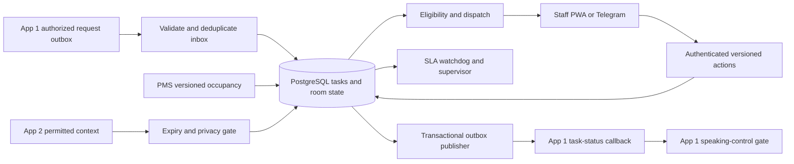

# App #3 — Operations / Hotel Task & Workflow Management

**Engineering and product dossier · 23 September 2026 · PostgreSQL 16 · Kakheti boutique and resort operations**

**[I] Decision.** Build a property-scoped Operations service that receives authorized guest requests from the Contact Center, creates durable work, assigns eligible staff, records human completion, and returns versioned status through the Contact Center's existing callback. Preserve the PMS as the authority for reservation/occupancy, CRM as the authority for permitted guest preferences, Operations as the authority for physical service progress, and the Contact Center as the authority for guest communication. A model may propose classification, routing and handover summaries. It cannot attest, inspect, release a room, override entry consent, or claim a guest received a service.

**[O] Deliverable status.** The embedded DDL was executed locally on PostgreSQL 16 in an isolated `/tmp` cluster. Offline tests exercised database lifecycle, tenancy, concurrency and JSON Schema contracts; results and reproducible materials appear in §10. This is an engineering dossier with a tested persistence/action core, not a deployed product or certification of live hotel integrations. Room/PMS ingestion, evidence scanning/storage, workforce administration, request amendment coordination, outbox transport and user interfaces still require the implementations specified here. No simulated connector is described as live.

## 1. Evidence, scope and system boundaries

Use **[D]** for official technical documentation; **[V]** for vendor-published capabilities, not independent efficacy evidence; **[O]** for executed retrieval/tests; **[I]** for proposed design or inference; **[U]** for unresolved evidence. Tables inherit their marked column or preceding label. All architecture, policy defaults, algorithms, schemas, SQL and synthetic examples below are **[I]** unless explicitly reported as executed. Source IDs resolve to §11. Retrieval date is 23 September 2026; undated product pages establish what was advertised when retrieved, not a historical release date.

**[O/U] Local grounding.** `task_research.md` explicitly reports no hotel-supplied operating records, completed interviews, representative local review corpus, proven property losses, willingness to pay or measured automation ROI. This dossier does not invent these. Kakheti examples—small shift teams, wine-tour return times, dispersed cottages, seasonal staff, a leaking bathroom tap, and Georgian-language handovers—are design fixtures to validate with operators. They do not establish local incident prevalence.

**[O] Read-only dependencies.** App #1 §7.4 defines a flat task-status callback. App #2 defines audience-limited operational context and cross-app deletion requirements. Neither input was modified. The dependencies' source hashes are recorded in §10. A disagreement with an existing contract is documented as a versioned migration requirement; it is not silently “fixed” in an input dossier.

### 1.1 Authority and ownership

| Fact or decision | Owner | Operations behavior |
|---|---|---|
| Reservation, booked room, checkout/check-in and room move | PMS adapter with versioned source proof | Reconcile actual occupancy; freeze entry/release when the source is stale or conflicted |
| Guest request meaning, chapter, source messages, reservation binding and request revision | App #1, after its authority gates | Preserve identifiers and approved scope; do not bind a room using its displayed number alone |
| Active service preferences | App #2, with purpose, expiry and privacy epoch | Request `operations` audience; cache only permitted task-relevant facts |
| Task progress, assignee, blocker and physical attestation | App #3 plus authenticated staff | Store durable transitions and auditable evidence |
| Inspection and room release | Authorized human supervisor, using fresh PMS state | Separate service completion, inspection, release and occupancy |
| Guest-facing text and who may speak | App #1 HITL ownership | Return facts through callback; never send directly to WhatsApp/Telegram guest threads |
| Refund, folio, paid upgrade and discretionary late checkout | Front desk/PMS/Finance approval flow | Create a decision task; do not treat dispatch as approval |
| Emergency response | Property emergency procedure and accountable supervisor | Immediate alert; no model diagnosis, no waiting for routine queue optimization |

**[I] MVP boundary.** One property deployment supports room board, guest-service tasks, maintenance defects/assets, staff roster and eligibility, human claim/start/block/attest, supervisor inspection, SLA alerts, handovers, recurring work, App #1 inbox/outbox, App #2 context and privacy propagation. Support multiple isolated properties in the data model from day one. Start with deterministic dispatch and manual override, existing staff phones and a PWA; Telegram is an optional staff action surface. New hardware, mandatory location tracking, robotics, payroll, employee disciplinary scoring, revenue management and model-controlled emergency decisions are outside scope.

## 2. Competitive teardown: demonstrated strengths and testable weaknesses

### 2.1 Market benchmark

**[V/U] Public product evidence supports substantial functionality. It does not substantiate blanket claims that these products have no guest messaging, use only static queues, lack photos, or cannot automate assignment.** A missing public concurrency/attestation contract is an assurance gap to investigate, not evidence that a vendor's implementation is defective. No paid tenant, internal API trace, procurement quote or controlled performance benchmark was available.

| Platform / evidence | What the inspected material does well | Limits of evidence and hotel failure test | MVP response |
|---|---|---|---|
| **ALICE by Actabl** [A1–A3] | Housekeeping: two-way PMS updates, automated room assignments/boards, rush rooms, inspections, turndown and mobile reassignment. Guest Messaging: pre-arrival/check-in criteria, history, direct/automated messages, and dedicated tickets within conversations with progress tracking | Conversation-to-ticket support directly contradicts “staff always retype requests.” Public pages do not specify the exact atomic boundary between message, task, cancellation, human takeover and final guest reply. Test room move + repeated webhook + human takeover during task completion | Preserve integrated messaging and housekeeping strengths; expose idempotency, source revisions and callback ownership as explicit guarantees |
| **hotelkit** [H1–H2] | Real-time PMS-linked room status, automated daily planning, allocation, cleaning checklists/inspections; suite includes repairs, guest requests, maintenance cycles and shift handovers | Public capabilities do not establish what happens to stale mobile actions after shift transfer, DND, or PMS rollback. Test overnight handover with an offline attendant and a reopened defect. No claim that handovers/checklists are absent | Keep mobile checklists and shift continuity; require acknowledgement, current versions and evidence references |
| **Optii** [O1–O4] | Two-way PMS, AI/predictive room-attendant routes, live timeline, workload visibility, inspection, notes/photos; Service advertises auto-assignment, predictive due times and guest-messaging partner integrations; Maintenance covers assets, schedules and checklists | Explicit predictive routing and messaging integrations contradict “static-only/zero autonomous load balancing.” Public pages do not establish a sick-call race guarantee or end-to-end acknowledgment contract. Test a staff member going unavailable while accepting work; compare predicted due time with an existing guest commitment | Match eligibility-aware routing and live workload; never reset contractual deadlines to make a new prediction look successful |
| **Flexkeeping** [F1–F3] | Dynamic cleaning patterns, automated scheduling and even allocation by skills/availability; maintenance prioritization, recurring work, contractor handling, real-time progress and digital checklists | Product page marks its no-code workflow builder as beta/rolling out; do not assume universal availability. Existing automation disproves “no autonomous balancing.” Public evidence does not prove tamper-resistant human completion or safe offline replay | Configurable policy/checklist versions; explicit human evidence; deterministic retry and reconciliation behavior |
| **Mews housekeeping / operations ecosystem** [M1–M2] | PMS/occupancy-centered room visibility and mobile work; inspected housekeeping page describes Flexkeeping integration, flexible stay-based schedules, different cleaning types and opt-outs | `/en/products/operations` redirected to the product directory. The current housekeeping offering includes integration-dependent capabilities: do not count every partner feature as independent native PMS functionality. Validate exact connector edition, room status ownership and release semantics | Distinguish occupancy from cleanliness, avoid integration write-back loops, and require source version and current safety holds |

**[V] Caution on marketing outcomes.** Some pages advertise productivity/response-time improvements and customer testimonials. Their denominators, selection, implementation mix and causal controls were not audited; these numbers are not used as predicted Kakheti savings. Downloaded Optii HTML also contained repeated unrelated CMS/import boilerplate. Only relevant visible product statements are used above.

### 2.2 Where workflows can fail badly

**[I/U] The following are concrete failure modes to reproduce, not attributed vendor incidents.** The root problem is a missing guarantee across systems and humans. Require the same replay against an incumbent before choosing to build.

| Failure mode | Observable hotel harm | Fixture and pass criterion |
|---|---|---|
| Message-to-task gap | Towels acknowledged in chat but never assigned; reception copies requests into a second system | Repeat a guest request webhook 20 times, interrupt the consumer after each write boundary; one task and a durable queue event exist, or the transaction rolls back |
| “Done” without a human | AI announces AC fixed after opening a ticket | Model/service credential cannot execute staff actions or insert attestation; completion requires current staff action, evidence and matching task version |
| Staff click is treated as proof of reality | Wrong room photograph or accidental completion appears verified | Evidence binds task/staff/checklist/cycle; supervisor reviews risk-based samples. A click still cannot mathematically prove physical work |
| Arrival priority detached from work | Guests return from a wine tour before their rooms are released | Update trusted ETA and actual checkout; reprioritize eligible vacant rooms without overriding DND, safety holds or older urgent commitments |
| Sick-call redistribution races | Absent employee keeps new tasks; two staff deliver the same service | Lock eligibility/capacity before claim; revoke future offers; transfer unstarted work with version increment; stop-and-acknowledge in-progress transfers |
| Offline completion targets old guest | A room moved from one reservation to another while a phone was offline | Changed reservation/PMS version or room cycle invalidates the old action; no completion/entry without fresh authority |
| Supervisor handover is only prose | Overnight leak disappears from morning board | Every unresolved incident has current owner, deadline, blocker and explicit successor acknowledgment; summary alone never transfers accountability |
| Bot bypasses front desk | Late checkout granted by routing inference | Task says “decision required”; authorized approval updates App #1/PMS, and service execution follows only within approved scope |
| Callback retry changes history | Completion is lost or earlier `accepted` overwrites it | Exact event retry is idempotent; task sequence is monotonic; terminal progress cannot regress; reconcile missing history |

### 2.3 Competitive edge and buy/build gate

**[I] Our proposed advantage is inspectable coordination:** source-linked request creation, deterministic dispatch gates, verifiable staff identity and evidence integrity, current room-cycle inspection, crash-safe outbox transport, strict tenant isolation and privacy-aware operational context. Existing platforms may satisfy these needs; public evidence does not establish that only a new product can do so.

**[I] Procurement teardown script.** Ask each vendor to perform: duplicated towels request; late checkout requiring approval; room move after claim; a sick attendant with five queued tasks; a maintenance emergency; a stayover with DND; two simultaneous claim taps; offline photo completion after reassignment; post-completion correction; shift handover; deletion of guest content; and a supervisor-controlled guest conversation. Obtain connector entitlements, API limits, outbound retry semantics, offline conflict handling, photo retention/deletion, multi-property access tests, Georgian UI/translation review, export rights, all fees and support/on-call terms. Buy/configure if these tests pass more cheaply and reliably than building. No cost ranking is established here.

## 3. Functional architecture and hotel work model

### 3.1 Runtime layout



**[I] Deployment.** Use a modular application with PostgreSQL, object storage and stateless HTTP/worker processes before splitting into microservices. Outbox/inbox reliability is required; a separate broker is optional initially. Keep integration, staff gateway, watchdog, publisher, evidence service and administrative migration credentials separate. Models have no database credentials and no staff session. UTC instants are stored as `timestamptz`; display and schedule by `Asia/Tbilisi`. Never add four hours to a stored timestamp as a persistence convention.

### 3.2 Dynamic room turnover, with occupancy kept separate

**[I] Three different facts:** PMS occupancy (`VACANT`, `OCCUPIED`, `UNKNOWN`), availability (`AVAILABLE`, `HOLD`, `OUT_OF_ORDER`), and the turnover board. `CLEAN` does not authorize check-in by itself. A maintenance safety hold blocks release even if cleaning is complete. PMS disagreement is a visible reconciliation incident, not a reason to fabricate vacancy.

| Transition / trigger | Preconditions and actor | Atomic result / failure behavior |
|---|---|---|
| `OCCUPIED → DIRTY`: verified checkout | New PMS source version confirms vacancy; adapter locks active room tasks in stable ID order, then room/current board | Increment turnover cycle and board version; clear old cleaning/inspection reference; invalidate old entry authority/actions; append history. Duplicate PMS event is a no-op |
| `DIRTY → CLEANING` | Current cycle's turnover/deep-clean task is `IN_PROGRESS`; current assignee; fresh vacancy; entry authority checked on task start | Associate cleaning task and append board history; incomplete cleaning does not imply readiness |
| `CLEANING → INSPECTED` | Cleaning task completed with human attestation; current cycle; distinct enabled supervisor performs physical inspection | Record supervisor and server timestamp. Failed inspection returns to `DIRTY`, increments cycle, and schedules a new rework task |
| `INSPECTED → CLEAN` | Supervisor release; still vacant and fresh; availability `AVAILABLE`; current task/cycle and inspection | Publish releasable cleanliness to PMS adapter with expected source version. PMS must still accept the release; local state is not a booking promise |
| `CLEAN → OCCUPIED`: verified check-in | Authoritative PMS event, newer source version, same room identity | Record occupancy, board version and history. Invalidate prior task entry snapshots; never accept a staff “occupied” click as a PMS event |
| Unexpected PMS check-in while dirty/held | Real occupied state must not be rejected just because the normal path was violated | Reflect actual `OCCUPIED`, preserve incident history, set `HOLD`/supervisor alert, and reconcile. Do not keep showing vacant to staff |
| Inspection rework | Supervisor documents failure with current board version | New cycle/new cleaning task; old completion is retained as historical service, not reused to pass inspection |

**[I] Freshness default.** The executable start/completion/release core requires room source observation within five minutes for entry-sensitive work and exact `pms_version`/cycle matches. This is a conservative pilot parameter, not a universal PMS guarantee. A reservation-binding adapter must verify reservation-to-room membership before setting entry authority. The message's `room_number` is a display hint; an unresolved or mismatched room is quarantined for front desk review. A trustworthy PMS heartbeat may refresh observation only after successful readback; a worker retry cannot make stale data fresh.

**[I] Non-turnover work.** Stayover cleaning and turndown are tasks while the board remains `OCCUPIED`. Respect opt-out, DND, agreed service window and explicit entry permission. Completing them never vacates a room or increments its turnover cycle. Deep-clean work can require a hold and a subsequent inspection; schedule it around actual occupancy and minimum staffing, not just calendar recurrence. Public-area cleaning has a location label and no room FK. A cottages/resort zone is not necessarily a numeric floor.

**[I] PMS adapter transaction recipe.** Authenticate source; dedupe `(space, source event)` in a dedicated adapter inbox; acquire all affected task rows sorted by ID, then room row and cleaning state; reject stale source versions and quarantine gaps; update occupancy/source version/observation and board using the transitions above; invalidate or flag active tasks whose reservation/room/cycle changed; append `room_state_history`; persist adapter outbox for staff alerts and PMS writeback acknowledgment; commit before acknowledging source. The supplied `task_inbox` is specifically the App #1 request inbox, so do not overload it with a PMS message lacking a request ID. The adapter needs its own inbox/outbox migration when connected. Echoed writes carry an origin key and are reconciled by source version, not endlessly re-published.

### 3.3 Maintenance and defect handling

**[I] Severity is operational, not sentiment.** `ROUTINE`: squeaking wardrobe hinge or scheduled filter check. `URGENT`: active leaking faucet, unavailable AC in an occupied room, or a trip hazard requiring immediate assessment. `EMERGENCY`: smoke, suspected electrical hazard, serious flooding or threat to life. The emergency procedure immediately alerts the supervisor and appropriate real-world response route; it must not wait for a model to diagnose or for a technician to finish a routine task. Staff isolate an area only under trained property procedures. An automated room hold may be conservative, but clearing it requires authorized inspection.

**[I] Defect record.** Store room/floor/public area, asset tag if known, human-readable issue, observed severity, reporter, safe photo references, timestamps, required certification/skill and blocker/dependency. A leak in room 12 and a leak at the wine-cellar tasting counter are different locations; room identifiers remain property-scoped. Photos pass MIME/size limits, malware screening, metadata stripping, access control and content handling before registration. Do not upload guest faces, passports, valuables or folios as routine proof. Use a checklist or service receipt when photos add privacy risk without evidential value.

**[I] Preventive work.** `recurring_task_plans` contains typed schedule JSON (local service window, cadence, weekdays and checklist revision), not arbitrary executable code. Validate it in the scheduling service. `recurring_task_occurrences(space_id, plan_id, service_date, slot)` makes generation idempotent after outages and daylight-saving changes at other properties. Missed critical maintenance becomes an explicit overdue occurrence; do not flood staff by generating every obsolete cosmetic occurrence. Asset warranty/vendor manual references and maintenance intervals are property-approved. Parts unavailable, contractor needed, room access denied and guest rescheduling are blockers with owners and review deadlines, not completion states.

### 3.4 Dispatch and load balancing

**[I] Two phases.** The scheduler ranks eligible work and offers it to a staff member; a human claim reserves capacity and becomes `CLAIMED`. An offer is a notification/recommendation, not proof the person has accepted. The database enforces one active assignment per task. A future automatic assignment mode must preserve acknowledgment deadlines and cannot label unacknowledged work `accepted` to guests. The tested MVP deliberately uses explicit claim.

**[I] Eligibility gates precede scoring:** enabled staff identity; current non-overlapping shift; `AVAILABLE` rather than break/sick/off duty; required skill/certification; authorized team; zone or supervisor-approved cross-zone coverage; remaining capacity; dependency readiness; verified room binding; permitted service window and entry rules. Claim code implements skills, shift, room zone and capacity; department authorization, dependencies and non-room zone gates must be applied by the trusted gateway/dispatch adapter before token issuance. Do not advertise those additional gates as implemented by the SQL alone.

**[I] Deterministic scoring proposal.** After safety gates, select emergencies through the emergency procedure, then rank by least slack (`deadline − now − estimated service − travel`), promised arrival/service window, aging, and workload/travel tie-breakers. FIFO by `(created_at, task_id)` makes ties reproducible. Estimate service minutes from approved task class; learn aggregate estimates only after collecting sufficient task samples and checking bias. Preserve the old estimate and reason for updates. Do not penalize individual workers by a hidden productivity/emotion score. Guest VIP status never outranks a safety incident or authorizes denied entry.

**[I] Arrival updates.** Use PMS/front-desk-confirmed ETA or an authorized guest update; external flight data needs access, consent and a binding to the arriving guest. A delayed flight does not automatically prove a late hotel arrival. A wine-tour group returning early can move eligible turnover work forward, but not past an older urgent guest commitment or into an occupied room. Treat uncertain ETA as a range and retain its source timestamp. Recompute offers on arrival, checkout, task progress, absence or priority change with a short debounce; do not thrash active assignments.

**[I] Sick-call transaction.** Mark roster unavailable first; new claims fail. Then process affected tasks in stable task-ID order. For `CLAIMED` but unstarted work, supervisor releases assignment with reason, increments task version, returns it to `QUEUED`, revokes action tokens and creates a new offer. Do not emit a fictitious `accepted → pending` callback, because App #1 has no pending callback status. Keep its last acknowledged state, notify the operator internally, and send the next valid status with a reason. For `IN_PROGRESS`, contact the worker and explicitly establish whether physical work stopped before transfer; otherwise duplicate entry/service is possible. Escalate when the worker cannot be reached. A roster flag is not evidence that work ceased.

**[I] Concurrency.** All mutators lock task first, then action token where relevant, staff, roster, room and board. Multi-task operations sort task IDs. The same staff row serializes capacity calculations for concurrent claims on different tasks. Use short transactions; never hold a lock during model inference, photo upload or HTTP delivery. Retry deadlocks/serialization failures with bounded jitter and the same idempotency key. A `SKIP LOCKED` scan is appropriate for queues, not for silently skipping a mandatory guest deletion or cancellation.

### 3.5 Shift continuity and briefing

**[I] Handover includes task ID/version, last physical action, blocker, promised deadline, room access restrictions, safe evidence pointers, outgoing and incoming staff, and successor acknowledgment.** A staff member finishing a shift must not leave an unowned active incident. `shift_handovers` records receipt; the reassignment transaction changes ownership separately and atomically. Acknowledgment is rejected if the task version or nominated recipient changed. Unacknowledged handovers alert the supervisor. Ongoing emergency custody remains explicit.

**[I] Morning briefing.** Generate a deterministic list of overdue/blocked work, uninspected rooms, out-of-order assets, incoming arrivals, unacknowledged handovers and staffing gaps. Optional AI converts this list into Georgian/English prose, retaining links and task versions. Staff can see the underlying facts; the summary has an `as_of` time and expires when relevant facts change. The model cannot close tasks, create evidence or omit a safety incident to shorten the summary. Translation does not replace technical instructions or safety training. Validate Georgian service vocabulary with actual hotel staff before rollout.

## 4. Physical attestation and task state machine

### 4.1 Task transitions

| From | To | Authority and checks | Guest callback mapping |
|---|---|---|---|
| `QUEUED` | `CLAIMED` | Eligible human claims current version; one active assignment; capacity reservation | `accepted` |
| `CLAIMED` | `IN_PROGRESS` | Current assignee on shift; fresh permission/binding for entry | `in_progress` |
| `CLAIMED` / `IN_PROGRESS` | `BLOCKED` | Current assignee gives a concrete reason; deadline remains running | Preserve `accepted` if not started, otherwise `in_progress`, with reason |
| `BLOCKED` | `IN_PROGRESS` | Assignee explicitly resumes; start/entry guards rerun | `in_progress` |
| `IN_PROGRESS` | `COMPLETED` | Explicit current staff attestation and registered matching evidence; atomic completion transaction | `completed`, evidence nonempty and server completion timestamp |
| `CLAIMED` / `BLOCKED` | `QUEUED` | Supervisor transfer/requeue transaction, release assignment, invalidate tokens | Internal event/notification; no unsupported wire status |
| `QUEUED` | `REJECTED` | Authorized front desk/supervisor explains impossibility or invalid authorization | `rejected` |
| Any nonterminal | `CANCELLED` | Authorized cancellation; in-progress physical stop requires staff/supervisor coordination | `cancelled` after disposition is established |
| Terminal | New rework/follow-up task | Do not reopen the completed row and reuse its evidence | New request/task linkage; preserve original history |

**[I] Safety invariant.** `COMPLETED` requires non-null `attested_by_staff_id`, `completion_evidence_ref`, `completed_at` and a matching attestation row for the current task, assignment, pre-completion task version, request version and room cycle. The task's composite FK ties completion values to the same attestation. The attestation binds the evidence to the same task and staff. No runtime automation role has table DML or execution permission on staff actions. A model's proposed JSON is not a staff action, and a notification delivery receipt is not service completion.

**[I] What evidence proves.** Authenticated staff plus a server-validated action records who asserted performance, when, for which work revision, and against what evidence. Signed sessions, integrity hashes, checklist versions and object access controls make that assertion auditable. They cannot prove a towel was physically handed over or a leak repaired. Independent inspection, guest confirmation where appropriate, random supervisor review and anomaly investigation improve assurance. Do not label an AI photo judgment as physical verification. A compromised staff credential, collusion or false statement remains a residual risk.

### 4.2 Completion transaction

**[I] Required order:** authenticate staff and property; validate request schema and command UUID; lock task; return an exact stored response for a previously completed identical command; reject key reuse with a different body/actor/task; validate short-lived single-use action token bound to staff/task/action/current version; check active assignee, enabled staff and current shift; recheck room authority where needed; lock registered evidence; verify task/staff binding, integrity-registration status, retention and access; insert the explicit statement; update task to completed and release assignment; increment callback sequence and insert callback outbox row; consume token and save command response; commit; only then report success to the phone.

**[I] Evidence registration is a separate trusted service.** Upload directly to a quarantined object path; scan and finalize outside the task transaction. Register the final reference/hash/checklist revision only after successful verification. The SQL `verified_at` means the service verified the evidence artifact and metadata; it does not mean an independent person witnessed the work. Registration must authorize the uploader as the active staff member and bind to the current assignment, task/request revision and room cycle. SQL rechecks those evidence bindings at completion, so an old artifact cannot be reused after a blocker/resume or amendment without reviewed re-registration. The dossier's tests register synthetic evidence as the migration administrator; no scanner or object store was exercised. Production grants must expose a narrow registration function, not table ownership to a bot.

**[I] Offline operation.** PWA can retain a minimal encrypted work list and pending actions, with device/session expiry. Display “pending sync” locally until server acknowledgment. Never show globally completed while offline. On reconnection, stale version, changed room, reassignment, expired token or revoked staff membership produces a conflict requiring a refreshed view and explicit staff reconfirmation. Do not automatically mint a fresh token and replay an old completion. Media captured offline retains client capture time separately from trusted server completion time. Clock skew cannot backdate SLAs.

**[I] Small-property staffing tradeoff.** The executable room function requires a different supervisor for inspection. A single-person shift therefore cannot release a room through that path. The MVP should schedule a second authorized inspector or keep release pending. A future exceptional self-inspection policy requires explicit property approval, a separate override event, displayed lower assurance, and review; it must not be represented as independent inspection. There is no hidden bypass in this schema.

## 5. SLA watchdog and escalation protocol

**[I] These are configurable pilot defaults, not legal or industry-standard service promises.** Define policies by property, category, severity and revision. Requested due time from App #1 is already a guest commitment; choose the earlier of that time and the property response target from intake. A requested future service must use an approved future-window policy rather than accidentally assigning “15 minutes from now” to tomorrow's turndown; the gateway must reject incompatible policy/commitment combinations for review. Dispatch estimates never silently extend an agreed deadline.

| Task class | Severity | Human acknowledgment target | Service target | Pre-breach reminder |
|---|---|---:|---:|---:|
| Urgent towels / door handoff | `URGENT` | 2 minutes | 15 minutes | 3 minutes before due |
| Leaking faucet, after safety triage | `URGENT` | 2 minutes | 30 minutes for agreed response/containment | 5 minutes before due |
| Routine request / permitted low-risk service | `ROUTINE` | 5 minutes | 60 minutes | 10 minutes before due |
| Emergency | `EMERGENCY` | Immediate supervisor alert | Property emergency procedure; no generic completion promise | No waiting for reminder grace |

**[I] A 30-minute leak SLA must specify response/containment versus final repair.** A technician's attendance does not complete a repair request. Split “assess and contain” and “repair/inspect” tasks when the work requires parts or a contractor; track dependencies and tell App #1 which request is actually complete. The watchdog never manufactures completion to satisfy a target.

**[I] Escalation state machine:** `NORMAL(0) → STAFF_WARNED(1) → SUPERVISOR_ALERTED(2)`. Stage 1 occurs on unacknowledged deadline or pre-due warning. Stage 2 occurs on service overdue, acknowledgment still absent two minutes after its deadline, or immediately for emergency. Stage 1 targets the assignee when one exists, otherwise the dispatch desk; stage 2 targets the supervisor and backup contact. The SQL records both stages if the worker wakes after both thresholds; emergency records both in one transaction and routes supervisor delivery immediately. Recording a reminder is not proof a human saw it: transport receipts and supervisor acknowledgment need separate delivery tracking.

**[I] Poll every 15 seconds as a pilot target.** This bounds normal detection lag to approximately 15 seconds plus queue/database delay, not a hard real-time guarantee. Select eligible tasks `FOR UPDATE SKIP LOCKED`; recheck terminal state under the lock. `(space, task, sla_revision, stage)` prevents repeated alerts. The transaction inserts escalation and outbox together. If completion wins the lock, no new warning is emitted; if warning wins, later completion marks it historical and UI shows that the task is now complete. A queued notification must read current state before sending stale alarming text, while retaining its delivery audit.

**[I] Reassignment, blockers and shift changes do not reset `due_at`, `ack_due_at` or erase escalation history.** A supervisor can revise a commitment only through an authorized change workflow recording reason, prior/new deadline, guest/operator approval where required, and new SLA revision. Baseline MVP does not pause the clock for parts/DND automatically. Reports distinguish original commitment misses from negotiated changes. An alert consumer retries with an idempotent key; repeated transport failure pages the fallback supervisor route and appears as a delivery failure, not a served alert.

## 6. PostgreSQL 16 design and executable DDL

### 6.1 Modeling, tenancy and security

**[I] Hybrid design.** Stable task identity, room, staff, assignment, policy, state, time and evidence relationships are relational with same-tenant composite FKs. `hotel_rooms.attributes`, `operational_tasks.details` and recurrence schedule JSON hold validated, bounded extensions. `jsonb_path_ops` GIN indexes support containment/JSONPath segmentation, while B-tree/partial indexes serve queue/deadline workloads. This is not a three-table EAV store. Avoid putting authoritative state, room binding, assignee or completion facts into untyped JSON. JSON shape checks in SQL only ensure objects; the gateway validates allowlisted nested attributes, depth/size and field-specific types. Avoid indexing raw private conversations.

**[I] `ops.spaces` is a property registry projection**, not a second source for tenant creation. A verified control-plane process mirrors the App #1 tenant UUID and provisioning/deprovisioning status. The executable schema stands alone for local verification and does not assume App #1 tables share a database. Cross-app reservation/conversation IDs are external references, checked by adapters; local staff/room/task FKs enforce consistency inside Operations.

**[I] RLS trust boundary.** Every table has `ENABLE` and `FORCE ROW LEVEL SECURITY`, using the current `app.space_id`. The definer owner is `NOLOGIN NOBYPASSRLS`. Runtime roles have only explicitly granted functions, no table DML; public function execution is revoked. A trusted gateway derives property and staff UUID from authenticated memberships and sets them transaction-locally before calling SQL. Never expose arbitrary SQL or a client-supplied tenant/staff GUC. PostgreSQL custom settings alone do not authenticate a tenant: a client with general SQL execution could set its own value. Pool checkout/check-in must reset state; use `BEGIN; SET LOCAL ...; ...; COMMIT`, not persistent session settings in production. The test harness uses short dedicated sessions for fixtures.

**[I] Role operations.** Apply the migration as an administrator in a fresh database with these new cluster-wide role names. Production migration tooling should provision/reuse roles explicitly after auditing memberships; do not grant runtime membership in `ops_owner`, superuser or `BYPASSRLS`. Staff gateway connections may assume `ops_human`; integration/model workers cannot. Search paths are pinned in security-definer functions and the `ops` schema is owner-controlled. Administrators/backups remain privileged; RLS does not constrain a superuser. Rotate service credentials, use authenticated transport, and redact error/log output that would reveal other properties' existence.

**[I] Guarantee inventory.** Enforced by the DDL: same-tenant relational links; one active assignee; non-overlapping staff shifts; relational completion evidence; legal task transitions with state versions; function-only human completion; task callback sequence uniqueness; inbox idempotency; command/token idempotency; queue indexes; RLS; supervisor inspection and room-release gates. Enforced by the gateway/adapters specified here: JSON Schema, staff identity, channel signature, request authorization, live reservation membership, content limits, evidence storage/scan, metadata retention, departments/dependencies, PMS reconciliation and delivery. Do not deploy the SQL alone and claim those adapter guarantees.

**[I] Ordering.** `state_version` counts mutable task workflow revisions. `request_version` comes from App #1 and governs request scope. `task_seq` counts only guest callback projections, starting at 1 when the task is first claimed. `room_cleaning_states.version` orders room changes; `turnover_cycle` invalidates prior physical work. None is a global timestamp order. Row locks allocate revisions; uniqueness constraints catch duplicate assignments/sequences; the roster exclusion constraint prevents overlapping shifts. Timestamps measure time and cannot substitute for these counters. Sequence gaps trigger replay/reconciliation, not arithmetic guesses about missing states.

**[I] Executable migration follows.** It intentionally creates objects rather than masking existing schema drift with `CREATE TABLE IF NOT EXISTS`. The final room function is a second transaction in the same script. A failure stops execution when run with `psql -v ON_ERROR_STOP=1`. To deploy atomically as one migration, migration tooling may combine the transactions after testing in its target environment.

```sql
-- PostgreSQL 16. Fresh database migration; execute as a migration administrator.
BEGIN;
CREATE EXTENSION IF NOT EXISTS btree_gist;
CREATE ROLE ops_owner NOLOGIN NOSUPERUSER NOBYPASSRLS;
CREATE ROLE ops_human NOLOGIN NOSUPERUSER NOBYPASSRLS;
CREATE ROLE ops_integration NOLOGIN NOSUPERUSER NOBYPASSRLS;
CREATE ROLE ops_watchdog NOLOGIN NOSUPERUSER NOBYPASSRLS;
CREATE SCHEMA ops AUTHORIZATION ops_owner;
SET LOCAL ROLE ops_owner;
SET LOCAL search_path = ops, pg_catalog;
CREATE FUNCTION tenant() RETURNS uuid LANGUAGE sql STABLE AS
$$ SELECT nullif(current_setting('app.space_id',true),'')::uuid $$;
CREATE FUNCTION actor() RETURNS uuid LANGUAGE sql STABLE AS
$$ SELECT nullif(current_setting('app.staff_id',true),'')::uuid $$;
CREATE TABLE spaces (
 space_id uuid PRIMARY KEY, property_name text NOT NULL, timezone text NOT NULL DEFAULT 'Asia/Tbilisi'
);
CREATE TABLE hotel_rooms (
 space_id uuid NOT NULL REFERENCES spaces, room_id uuid NOT NULL DEFAULT gen_random_uuid(),
 room_number text NOT NULL, floor_label text NOT NULL, zone text NOT NULL,
 occupancy text NOT NULL DEFAULT 'UNKNOWN' CHECK(occupancy IN ('VACANT','OCCUPIED','UNKNOWN')),
 availability text NOT NULL DEFAULT 'HOLD' CHECK(availability IN ('AVAILABLE','HOLD','OUT_OF_ORDER')),
 pms_version bigint NOT NULL DEFAULT 0 CHECK(pms_version>=0), pms_observed_at timestamptz,
 expected_arrival_at timestamptz, expected_arrival_source text,
 attributes jsonb NOT NULL DEFAULT '{}' CHECK(jsonb_typeof(attributes)='object'),
 PRIMARY KEY(space_id,room_id), UNIQUE(space_id,room_number)
);
CREATE TABLE staff_members (
 space_id uuid NOT NULL REFERENCES spaces, staff_id uuid NOT NULL DEFAULT gen_random_uuid(),
 auth_subject text NOT NULL, display_name text NOT NULL, enabled boolean NOT NULL DEFAULT true,
 staff_role text NOT NULL CHECK(staff_role IN ('ATTENDANT','TECHNICIAN','FRONT_DESK','SUPERVISOR')),
 skills text[] NOT NULL DEFAULT '{}', PRIMARY KEY(space_id,staff_id), UNIQUE(space_id,auth_subject)
);
CREATE TABLE staff_roster (
 space_id uuid NOT NULL, roster_id uuid NOT NULL DEFAULT gen_random_uuid(), staff_id uuid NOT NULL,
 shift_window tstzrange NOT NULL CHECK(NOT isempty(shift_window) AND lower(shift_window) IS NOT NULL
   AND upper(shift_window) IS NOT NULL AND lower_inc(shift_window) AND NOT upper_inc(shift_window)),
 zone text NOT NULL, availability text NOT NULL DEFAULT 'AVAILABLE'
   CHECK(availability IN ('AVAILABLE','BREAK','SICK','OFF_DUTY')),
 capacity_minutes integer NOT NULL CHECK(capacity_minutes BETWEEN 1 AND 720),
 PRIMARY KEY(space_id,roster_id), UNIQUE(space_id,roster_id,staff_id),
 FOREIGN KEY(space_id,staff_id) REFERENCES staff_members,
 EXCLUDE USING gist(space_id WITH =,staff_id WITH =,shift_window WITH &&)
);
CREATE TABLE task_sla_policies (
 space_id uuid NOT NULL REFERENCES spaces, policy_id uuid NOT NULL DEFAULT gen_random_uuid(),
 policy_key text NOT NULL, revision integer NOT NULL CHECK(revision>0),
 category text NOT NULL CHECK(category IN ('housekeeping','maintenance','front_desk','billing','food_beverage')),
 priority text NOT NULL CHECK(priority IN ('ROUTINE','URGENT','EMERGENCY')),
 ack_seconds integer NOT NULL CHECK(ack_seconds>0), target_seconds integer NOT NULL CHECK(target_seconds>0),
 warning_seconds integer NOT NULL CHECK(warning_seconds>0),
 CHECK(ack_seconds<=target_seconds AND warning_seconds<=target_seconds),
 PRIMARY KEY(space_id,policy_id), UNIQUE(space_id,policy_key,revision)
);
CREATE TABLE assets (
 space_id uuid NOT NULL, asset_id uuid NOT NULL DEFAULT gen_random_uuid(), asset_tag text NOT NULL,
 room_id uuid, location_label text NOT NULL, maintenance_interval_days integer CHECK(maintenance_interval_days>0),
 last_serviced_at timestamptz, manual_ref text, PRIMARY KEY(space_id,asset_id), UNIQUE(space_id,asset_tag),
 FOREIGN KEY(space_id) REFERENCES spaces, FOREIGN KEY(space_id,room_id) REFERENCES hotel_rooms
);
CREATE TABLE operational_tasks (
 space_id uuid NOT NULL REFERENCES spaces, task_id uuid NOT NULL DEFAULT gen_random_uuid(),
 request_id uuid, request_version bigint CHECK(request_version>0), conversation_id uuid, chapter_id uuid,
 reservation_id uuid, reservation_source_version text, source_message_ids uuid[] NOT NULL DEFAULT '{}',
 source_event_id uuid, profile_ref uuid, context_epoch bigint, context_expires_at timestamptz,
 category text NOT NULL CHECK(category IN ('housekeeping','maintenance','front_desk','billing','food_beverage')),
 service_kind text NOT NULL CHECK(service_kind IN ('GUEST_REQUEST','TURNOVER','STAYOVER','TURNDOWN','DEEP_CLEAN','PREVENTIVE')),
 priority text NOT NULL CHECK(priority IN ('ROUTINE','URGENT','EMERGENCY')),
 title text NOT NULL CHECK(length(title) BETWEEN 1 AND 1000), assigned_team text NOT NULL,
 location_kind text NOT NULL CHECK(location_kind IN ('ROOM','FLOOR','PUBLIC_AREA','UNRESOLVED')),
 room_id uuid, location_label text, asset_id uuid, required_skill text NOT NULL,
 entry_permission text NOT NULL CHECK(entry_permission IN ('granted','denied','unknown','not_applicable')),
 requires_room_entry boolean NOT NULL DEFAULT false, room_pms_version bigint, room_cycle bigint,
 status text NOT NULL DEFAULT 'QUEUED' CHECK(status IN ('QUEUED','CLAIMED','IN_PROGRESS','BLOCKED','COMPLETED','REJECTED','CANCELLED')),
 state_version bigint NOT NULL DEFAULT 1 CHECK(state_version>0), task_seq bigint NOT NULL DEFAULT 0 CHECK(task_seq>=0),
 estimated_minutes integer NOT NULL DEFAULT 15 CHECK(estimated_minutes BETWEEN 1 AND 720),
 sla_policy_id uuid NOT NULL, created_at timestamptz NOT NULL DEFAULT clock_timestamp(),
 ack_due_at timestamptz NOT NULL, due_at timestamptz NOT NULL, warning_at timestamptz NOT NULL,
 sla_revision integer NOT NULL DEFAULT 1 CHECK(sla_revision>0),
 escalation_stage integer NOT NULL DEFAULT 0 CHECK(escalation_stage BETWEEN 0 AND 2),
 requested_service_at timestamptz, claimed_at timestamptz, started_at timestamptz,
 reason text, completed_at timestamptz, attested_by_staff_id uuid, completion_evidence_ref uuid,
 completion_attestation_id uuid, details jsonb NOT NULL DEFAULT '{}' CHECK(jsonb_typeof(details)='object'),
 PRIMARY KEY(space_id,task_id), UNIQUE(space_id,request_id),
 CHECK((request_id IS NULL AND request_version IS NULL AND conversation_id IS NULL) OR
       (request_id IS NOT NULL AND request_version IS NOT NULL AND conversation_id IS NOT NULL)),
 CHECK((location_kind='ROOM') = (room_id IS NOT NULL)),
 CHECK(location_kind NOT IN ('FLOOR','PUBLIC_AREA') OR location_label IS NOT NULL),
 CHECK((status='COMPLETED') = (completed_at IS NOT NULL AND attested_by_staff_id IS NOT NULL
   AND completion_evidence_ref IS NOT NULL AND completion_attestation_id IS NOT NULL)),
 CHECK(status='COMPLETED' OR (completed_at IS NULL AND attested_by_staff_id IS NULL
   AND completion_evidence_ref IS NULL AND completion_attestation_id IS NULL)),
 FOREIGN KEY(space_id,room_id) REFERENCES hotel_rooms,
 FOREIGN KEY(space_id,asset_id) REFERENCES assets,
 FOREIGN KEY(space_id,sla_policy_id) REFERENCES task_sla_policies,
 FOREIGN KEY(space_id,attested_by_staff_id) REFERENCES staff_members
);
CREATE TABLE task_assignments (
 space_id uuid NOT NULL, assignment_id uuid NOT NULL DEFAULT gen_random_uuid(), task_id uuid NOT NULL,
 staff_id uuid NOT NULL, roster_id uuid NOT NULL, assigned_at timestamptz NOT NULL DEFAULT clock_timestamp(),
 released_at timestamptz, release_reason text, task_version_at_claim bigint NOT NULL,
 PRIMARY KEY(space_id,assignment_id), UNIQUE(space_id,assignment_id,task_id,staff_id),
 FOREIGN KEY(space_id,task_id) REFERENCES operational_tasks,
 FOREIGN KEY(space_id,roster_id,staff_id) REFERENCES staff_roster(space_id,roster_id,staff_id),
 CHECK(released_at IS NULL OR released_at>=assigned_at)
);
CREATE UNIQUE INDEX one_active_assignment ON task_assignments(space_id,task_id) WHERE released_at IS NULL;
CREATE INDEX staff_active_work ON task_assignments(space_id,staff_id) WHERE released_at IS NULL;
CREATE TABLE completion_evidence (
 space_id uuid NOT NULL, evidence_id uuid NOT NULL DEFAULT gen_random_uuid(), task_id uuid NOT NULL,
 staff_id uuid NOT NULL, assignment_id uuid NOT NULL, task_version bigint NOT NULL CHECK(task_version>0),
 request_version bigint, room_cycle bigint, kind text NOT NULL CHECK(kind IN ('CHECKLIST','PHOTO','SERVICE_RECEIPT')),
 object_ref text NOT NULL, sha256 text NOT NULL CHECK(sha256 ~ '^[0-9a-f]{64}$'),
 checklist_version text NOT NULL, verified_at timestamptz NOT NULL,
 expires_at timestamptz NOT NULL, redacted_at timestamptz,
 PRIMARY KEY(space_id,evidence_id), UNIQUE(space_id,evidence_id,task_id,staff_id),
 FOREIGN KEY(space_id,task_id) REFERENCES operational_tasks,
 FOREIGN KEY(space_id,staff_id) REFERENCES staff_members,
 FOREIGN KEY(space_id,assignment_id,task_id,staff_id) REFERENCES task_assignments(space_id,assignment_id,task_id,staff_id),
 CHECK(expires_at>verified_at)
);
CREATE TABLE task_attestations (
 space_id uuid NOT NULL, attestation_id uuid NOT NULL DEFAULT gen_random_uuid(), task_id uuid NOT NULL,
 assignment_id uuid NOT NULL, attested_by_staff_id uuid NOT NULL, completion_evidence_ref uuid NOT NULL,
 task_version bigint NOT NULL, request_version bigint, room_cycle bigint,
 completed_at timestamptz NOT NULL DEFAULT clock_timestamp(), statement text NOT NULL
   CHECK(statement='I personally completed and checked this hotel service.'),
 PRIMARY KEY(space_id,attestation_id), UNIQUE(space_id,task_id),
 UNIQUE(space_id,attestation_id,task_id,attested_by_staff_id,completion_evidence_ref,completed_at),
 FOREIGN KEY(space_id,assignment_id,task_id,attested_by_staff_id)
   REFERENCES task_assignments(space_id,assignment_id,task_id,staff_id),
 FOREIGN KEY(space_id,completion_evidence_ref,task_id,attested_by_staff_id)
   REFERENCES completion_evidence(space_id,evidence_id,task_id,staff_id)
);
ALTER TABLE operational_tasks ADD CONSTRAINT completed_attestation_matches
 FOREIGN KEY(space_id,completion_attestation_id,task_id,attested_by_staff_id,completion_evidence_ref,completed_at)
 REFERENCES task_attestations(space_id,attestation_id,task_id,attested_by_staff_id,completion_evidence_ref,completed_at);
CREATE TABLE room_cleaning_states (
 space_id uuid NOT NULL, room_id uuid NOT NULL,
 state text NOT NULL DEFAULT 'DIRTY' CHECK(state IN ('DIRTY','CLEANING','INSPECTED','CLEAN','OCCUPIED')),
 version bigint NOT NULL DEFAULT 1 CHECK(version>0), turnover_cycle bigint NOT NULL DEFAULT 1 CHECK(turnover_cycle>0),
 cleaning_task_id uuid, inspector_staff_id uuid, inspected_at timestamptz, updated_at timestamptz NOT NULL DEFAULT clock_timestamp(),
 PRIMARY KEY(space_id,room_id), FOREIGN KEY(space_id,room_id) REFERENCES hotel_rooms,
 FOREIGN KEY(space_id,cleaning_task_id) REFERENCES operational_tasks,
 FOREIGN KEY(space_id,inspector_staff_id) REFERENCES staff_members,
 CHECK(state NOT IN ('INSPECTED','CLEAN') OR (inspector_staff_id IS NOT NULL AND inspected_at IS NOT NULL))
);
CREATE TABLE room_state_history (
 space_id uuid NOT NULL, room_id uuid NOT NULL, version bigint NOT NULL, turnover_cycle bigint NOT NULL,
 old_state text NOT NULL, new_state text NOT NULL, actor_ref text NOT NULL, reason text NOT NULL,
 changed_at timestamptz NOT NULL DEFAULT clock_timestamp(), PRIMARY KEY(space_id,room_id,version),
 FOREIGN KEY(space_id,room_id) REFERENCES hotel_rooms
);
CREATE TABLE staff_action_tokens (
 space_id uuid NOT NULL, token_id uuid NOT NULL DEFAULT gen_random_uuid(), task_id uuid NOT NULL,
 staff_id uuid NOT NULL, action text NOT NULL CHECK(action IN ('ClaimTask','StartTask','AttestCompleted','ReportBlocker')),
 expected_version bigint NOT NULL, expires_at timestamptz NOT NULL, consumed_at timestamptz,
 PRIMARY KEY(space_id,token_id), FOREIGN KEY(space_id,task_id) REFERENCES operational_tasks,
 FOREIGN KEY(space_id,staff_id) REFERENCES staff_members
);
CREATE TABLE staff_commands (
 space_id uuid NOT NULL, command_id uuid NOT NULL, task_id uuid NOT NULL, staff_id uuid NOT NULL,
 request_body jsonb NOT NULL, result jsonb NOT NULL, created_at timestamptz NOT NULL DEFAULT clock_timestamp(),
 PRIMARY KEY(space_id,command_id), FOREIGN KEY(space_id,task_id) REFERENCES operational_tasks,
 FOREIGN KEY(space_id,staff_id) REFERENCES staff_members
);
CREATE TABLE task_inbox (
 space_id uuid NOT NULL REFERENCES spaces, source text NOT NULL, event_id uuid NOT NULL,
 request_id uuid NOT NULL, request_version bigint NOT NULL CHECK(request_version>0),
 payload_hash text NOT NULL CHECK(payload_hash ~ '^[0-9a-f]{64}$'), received_at timestamptz NOT NULL DEFAULT clock_timestamp(),
 task_id uuid, disposition text NOT NULL CHECK(disposition IN ('APPLIED','STALE','QUARANTINED')),
 PRIMARY KEY(space_id,source,event_id), FOREIGN KEY(space_id,task_id) REFERENCES operational_tasks
);
CREATE TABLE task_outbox (
 space_id uuid NOT NULL REFERENCES spaces, event_id uuid NOT NULL DEFAULT gen_random_uuid(),
 task_id uuid NOT NULL, event_type text NOT NULL CHECK(event_type IN ('TaskStatusChangedEvent','SlaEscalatedEvent','TaskQueuedEvent')),
 task_seq bigint, payload jsonb NOT NULL CHECK(jsonb_typeof(payload)='object'),
 created_at timestamptz NOT NULL DEFAULT clock_timestamp(), available_at timestamptz NOT NULL DEFAULT clock_timestamp(),
 attempts integer NOT NULL DEFAULT 0 CHECK(attempts>=0), leased_until timestamptz, lease_token uuid, published_at timestamptz, last_error text,
 CHECK((leased_until IS NULL)=(lease_token IS NULL)),
 PRIMARY KEY(space_id,event_id), FOREIGN KEY(space_id,task_id) REFERENCES operational_tasks,
 CHECK((event_type='TaskStatusChangedEvent') = (task_seq IS NOT NULL)), CHECK(task_seq>0)
);
CREATE UNIQUE INDEX ordered_task_callback ON task_outbox(space_id,task_id,task_seq) WHERE task_seq IS NOT NULL;
CREATE INDEX task_outbox_pending ON task_outbox(space_id,available_at,created_at) WHERE published_at IS NULL;
CREATE TABLE sla_escalations (
 space_id uuid NOT NULL, task_id uuid NOT NULL, sla_revision integer NOT NULL,
 stage integer NOT NULL CHECK(stage IN (1,2)), raised_at timestamptz NOT NULL DEFAULT clock_timestamp(),
 PRIMARY KEY(space_id,task_id,sla_revision,stage), FOREIGN KEY(space_id,task_id) REFERENCES operational_tasks
);
CREATE TABLE shift_handovers (
 space_id uuid NOT NULL, handover_id uuid NOT NULL DEFAULT gen_random_uuid(), task_id uuid NOT NULL,
 from_staff_id uuid NOT NULL, to_staff_id uuid NOT NULL, note text NOT NULL, task_version bigint NOT NULL,
 created_at timestamptz NOT NULL DEFAULT clock_timestamp(), acknowledged_at timestamptz,
 PRIMARY KEY(space_id,handover_id), FOREIGN KEY(space_id,task_id) REFERENCES operational_tasks,
 FOREIGN KEY(space_id,from_staff_id) REFERENCES staff_members, FOREIGN KEY(space_id,to_staff_id) REFERENCES staff_members
);
CREATE TABLE recurring_task_plans (
 space_id uuid NOT NULL, plan_id uuid NOT NULL DEFAULT gen_random_uuid(), room_id uuid, asset_id uuid,
 service_kind text NOT NULL CHECK(service_kind IN ('STAYOVER','TURNDOWN','DEEP_CLEAN','PREVENTIVE')),
 timezone text NOT NULL DEFAULT 'Asia/Tbilisi', schedule jsonb NOT NULL CHECK(jsonb_typeof(schedule)='object'),
 next_due_at timestamptz NOT NULL, enabled boolean NOT NULL DEFAULT true,
 PRIMARY KEY(space_id,plan_id), FOREIGN KEY(space_id) REFERENCES spaces,
 FOREIGN KEY(space_id,room_id) REFERENCES hotel_rooms, FOREIGN KEY(space_id,asset_id) REFERENCES assets
);
CREATE TABLE recurring_task_occurrences (
 space_id uuid NOT NULL, plan_id uuid NOT NULL, service_date date NOT NULL, slot text NOT NULL,
 task_id uuid NOT NULL, PRIMARY KEY(space_id,plan_id,service_date,slot),
 FOREIGN KEY(space_id,plan_id) REFERENCES recurring_task_plans, FOREIGN KEY(space_id,task_id) REFERENCES operational_tasks
);
CREATE INDEX room_attributes_gin ON hotel_rooms USING gin(attributes jsonb_path_ops);
CREATE INDEX task_details_gin ON operational_tasks USING gin(details jsonb_path_ops);
CREATE INDEX dispatch_queue ON operational_tasks(space_id,priority,due_at,created_at) WHERE status='QUEUED';
CREATE INDEX watchdog_queue ON operational_tasks(space_id,warning_at,due_at)
 WHERE status NOT IN ('COMPLETED','REJECTED','CANCELLED');
CREATE INDEX profile_erasure_lookup ON operational_tasks(space_id,profile_ref) WHERE profile_ref IS NOT NULL;
CREATE INDEX room_tasks ON operational_tasks(space_id,room_id,status);
-- Force RLS even for the non-bypass function owner. Tenant context is set only by trusted gateways.
DO $$ DECLARE r record; BEGIN
 FOR r IN SELECT tablename FROM pg_tables WHERE schemaname='ops' LOOP
 EXECUTE format('ALTER TABLE ops.%I ENABLE ROW LEVEL SECURITY',r.tablename);
 EXECUTE format('ALTER TABLE ops.%I FORCE ROW LEVEL SECURITY',r.tablename);
 EXECUTE format('CREATE POLICY tenant_isolation ON ops.%I USING (space_id=ops.tenant()) WITH CHECK (space_id=ops.tenant())',r.tablename);
 END LOOP;
END $$;
-- Prevent unversioned state changes even in privileged administration code.
CREATE FUNCTION guard_task() RETURNS trigger LANGUAGE plpgsql SET search_path=ops,pg_temp AS $$ BEGIN
 IF NEW.space_id<>OLD.space_id OR NEW.task_id<>OLD.task_id THEN RAISE EXCEPTION 'immutable task key'; END IF;
 IF NEW.status IS DISTINCT FROM OLD.status THEN
  IF NOT ((OLD.status='QUEUED' AND NEW.status IN ('CLAIMED','REJECTED','CANCELLED')) OR
    (OLD.status='CLAIMED' AND NEW.status IN ('IN_PROGRESS','QUEUED','CANCELLED','BLOCKED')) OR
    (OLD.status='IN_PROGRESS' AND NEW.status IN ('COMPLETED','BLOCKED','CANCELLED')) OR
    (OLD.status='BLOCKED' AND NEW.status IN ('IN_PROGRESS','QUEUED','CANCELLED'))) THEN
   RAISE EXCEPTION 'illegal task transition'; END IF;
  IF NEW.state_version<>OLD.state_version+1 THEN RAISE EXCEPTION 'state version must increment'; END IF;
 END IF;
 IF NEW.status='COMPLETED' AND OLD.status<>'COMPLETED' AND NOT EXISTS (
   SELECT 1 FROM task_attestations a WHERE a.space_id=NEW.space_id AND a.task_id=NEW.task_id
   AND a.attestation_id=NEW.completion_attestation_id AND a.task_version=OLD.state_version
   AND a.request_version IS NOT DISTINCT FROM NEW.request_version
   AND a.room_cycle IS NOT DISTINCT FROM NEW.room_cycle) THEN RAISE EXCEPTION 'current human attestation required'; END IF;
 RETURN NEW;
END $$;
CREATE TRIGGER task_transition BEFORE UPDATE ON operational_tasks FOR EACH ROW EXECUTE FUNCTION guard_task();
CREATE FUNCTION emit_callback(p_task uuid,p_actor text,p_reason text DEFAULT NULL) RETURNS uuid
 LANGUAGE plpgsql SECURITY DEFINER SET search_path=ops,pg_temp AS $$
DECLARE t operational_tasks; e uuid:=gen_random_uuid(); wire_status text; body jsonb;
BEGIN
 SELECT * INTO STRICT t FROM operational_tasks WHERE space_id=tenant() AND task_id=p_task FOR UPDATE;
 IF t.request_id IS NULL THEN RETURN NULL; END IF;
 wire_status:=CASE t.status WHEN 'CLAIMED' THEN 'accepted' WHEN 'IN_PROGRESS' THEN 'in_progress'
   WHEN 'BLOCKED' THEN CASE WHEN t.started_at IS NULL THEN 'accepted' ELSE 'in_progress' END
   WHEN 'COMPLETED' THEN 'completed' WHEN 'REJECTED' THEN 'rejected' WHEN 'CANCELLED' THEN 'cancelled' ELSE NULL END;
 IF wire_status IS NULL THEN RETURN NULL; END IF;
 UPDATE operational_tasks SET task_seq=task_seq+1 WHERE space_id=t.space_id AND task_id=t.task_id RETURNING * INTO t;
 body:=jsonb_build_object('schema_version',1,'event_id',e,'source','task-management','space_id',t.space_id,
 'conversation_id',t.conversation_id,'request_id',t.request_id,'request_version',t.request_version::text,
 'task_id',t.task_id::text,'task_seq',t.task_seq::text,'occurred_at',clock_timestamp(),'status',wire_status,
 'actor_ref',p_actor,'reason',p_reason,'completed_at',t.completed_at,
 'evidence_refs',CASE WHEN t.status='COMPLETED' THEN jsonb_build_array('evidence:'||t.completion_evidence_ref::text) ELSE '[]'::jsonb END);
 INSERT INTO task_outbox(space_id,event_id,task_id,event_type,task_seq,payload)
 VALUES(t.space_id,e,t.task_id,'TaskStatusChangedEvent',t.task_seq,body);
 RETURN e;
END $$;
-- Gateway validates Draft 2020-12 schema, provenance, authority and SHA-256 of canonical JSON first.
-- Resolve policy/skill from trusted property configuration, never from an LLM-selected SQL argument.
CREATE FUNCTION ingest_request(p_event jsonb,p_sha256 text,p_policy uuid,p_requires_entry boolean,p_skill text)
 RETURNS uuid LANGUAGE plpgsql SECURITY DEFINER SET search_path=ops,pg_temp AS $$
DECLARE d jsonb:=p_event->'data'; existing task_inbox; t operational_tasks; pol task_sla_policies;
 r hotel_rooms; cyc bigint; sid uuid:=tenant(); eid uuid:=(p_event->>'id')::uuid;
 rid uuid:=(d->>'request_id')::uuid; rev bigint:=(d->>'request_version')::bigint;
 tid uuid; received timestamptz:=clock_timestamp(); deadline timestamptz;
BEGIN
 IF sid IS NULL OR sid<>(p_event->>'space_id')::uuid OR p_event->>'type'<>'GuestRequestDetectedEvent'
 OR p_event->>'source'<>'urn:smartstay:space:'||sid::text||':contact-center'
 OR p_event->>'subject'<>'conversations/'||(p_event->>'conversation_id')
 OR rev<1 OR (p_event->>'event_seq')::bigint<1 THEN RAISE EXCEPTION 'invalid source or version'; END IF;
 -- Request lock serializes duplicate IDs and first creation; hash collisions only reduce concurrency.
 PERFORM pg_advisory_xact_lock(hashtextextended(sid::text||rid::text,0));
 SELECT * INTO existing FROM task_inbox WHERE space_id=sid AND source=p_event->>'source' AND event_id=eid;
 IF FOUND THEN
  IF existing.payload_hash<>p_sha256 THEN RAISE EXCEPTION 'event ID reused with different content'; END IF;
  RETURN existing.task_id;
 END IF;
 SELECT * INTO t FROM operational_tasks WHERE space_id=sid AND request_id=rid FOR UPDATE;
 IF FOUND THEN
  IF rev>t.request_version THEN RAISE EXCEPTION 'new version requires amendment workflow'; END IF;
  IF rev=t.request_version THEN RAISE EXCEPTION 'same request version under new event ID: reconcile'; END IF;
  INSERT INTO task_inbox VALUES(sid,p_event->>'source',eid,rid,rev,p_sha256,received,t.task_id,'STALE');
  RETURN t.task_id;
 END IF;
 SELECT * INTO STRICT pol FROM task_sla_policies WHERE space_id=sid AND policy_id=p_policy;
 IF pol.category<>d->>'category' OR pol.priority<>upper(d->>'priority') THEN RAISE EXCEPTION 'policy mismatch'; END IF;
 SELECT * INTO r FROM hotel_rooms WHERE space_id=sid AND room_number=d->>'room_number' FOR UPDATE;
 IF r.room_id IS NOT NULL THEN
  SELECT turnover_cycle INTO cyc FROM room_cleaning_states WHERE space_id=sid AND room_id=r.room_id;
 END IF;
 -- Guest commitment cannot be silently extended by intake delay or a local policy.
 deadline:=least((d->>'due_at')::timestamptz,received+make_interval(secs=>pol.target_seconds));
 INSERT INTO operational_tasks(space_id,request_id,request_version,conversation_id,chapter_id,reservation_id,
 reservation_source_version,source_message_ids,source_event_id,category,service_kind,priority,title,assigned_team,
 location_kind,room_id,location_label,required_skill,entry_permission,requires_room_entry,room_pms_version,room_cycle,
 sla_policy_id,ack_due_at,due_at,warning_at,requested_service_at,details)
 VALUES(sid,rid,rev,(p_event->>'conversation_id')::uuid,(d->>'chapter_id')::uuid,(d->>'reservation_id')::uuid,
 d->>'reservation_source_version',ARRAY(SELECT jsonb_array_elements_text(d->'source_message_ids')::uuid),eid,
 d->>'category','GUEST_REQUEST',upper(d->>'priority'),d->>'summary',d->>'assigned_team',
 CASE WHEN r.room_id IS NULL THEN 'UNRESOLVED' ELSE 'ROOM' END,r.room_id,d->>'room_number',p_skill,
 d->>'entry_permission',p_requires_entry,r.pms_version,cyc,pol.policy_id,
 least(deadline,received+make_interval(secs=>pol.ack_seconds)),deadline,
 deadline-make_interval(secs=>pol.warning_seconds),(d->>'requested_service_at')::timestamptz,
 jsonb_build_object('authority',d->'authority','requested_quantity',d->'requested_quantity','guest_locale',d->'guest_locale'))
 RETURNING task_id INTO tid;
 INSERT INTO task_inbox VALUES(sid,p_event->>'source',eid,rid,rev,p_sha256,received,tid,'APPLIED');
 INSERT INTO task_outbox(space_id,task_id,event_type,payload) VALUES(sid,tid,'TaskQueuedEvent',
 jsonb_build_object('task_id',tid,'request_id',rid,'priority',pol.priority));
 RETURN tid;
END $$;
CREATE FUNCTION issue_action_token(p_task uuid,p_action text,p_version bigint) RETURNS uuid
 LANGUAGE plpgsql SECURITY DEFINER SET search_path=ops,pg_temp AS $$
DECLARE tok uuid; BEGIN
 IF NOT EXISTS(SELECT 1 FROM staff_members WHERE space_id=tenant() AND staff_id=actor() AND enabled)
 THEN RAISE EXCEPTION 'staff authentication required'; END IF;
 IF NOT EXISTS(SELECT 1 FROM operational_tasks WHERE space_id=tenant() AND task_id=p_task AND state_version=p_version)
 THEN RAISE EXCEPTION 'task version mismatch'; END IF;
 INSERT INTO staff_action_tokens(space_id,task_id,staff_id,action,expected_version,expires_at)
 VALUES(tenant(),p_task,actor(),p_action,p_version,clock_timestamp()+interval '5 minutes') RETURNING token_id INTO tok;
 RETURN tok;
END $$;
CREATE FUNCTION staff_action(p_task uuid,p_command uuid,p_body jsonb) RETURNS jsonb
 LANGUAGE plpgsql SECURITY DEFINER SET search_path=ops,pg_temp AS $$
DECLARE t operational_tasks; tok staff_action_tokens; prior staff_commands; s staff_members;
 roster staff_roster; a task_assignments; ev completion_evidence; rm hotel_rooms;
 action_name text:=p_body->>'action'; old_version bigint; workload integer; aid uuid;
 now_at timestamptz:=clock_timestamp(); result jsonb; cycle_now bigint;
BEGIN
 -- Lock order: task -> token -> staff -> roster -> room. All action writers follow this order.
 SELECT * INTO STRICT t FROM operational_tasks WHERE space_id=tenant() AND task_id=p_task FOR UPDATE;
 now_at:=clock_timestamp();
 SELECT * INTO prior FROM staff_commands WHERE space_id=tenant() AND command_id=p_command;
 IF FOUND THEN
  IF prior.staff_id<>actor() OR prior.task_id<>p_task OR prior.request_body<>p_body THEN RAISE EXCEPTION 'idempotency conflict'; END IF;
  RETURN prior.result;
 END IF;
 SELECT * INTO STRICT tok FROM staff_action_tokens WHERE space_id=tenant() AND token_id=(p_body->>'action_token')::uuid FOR UPDATE;
 IF tok.staff_id<>actor() OR tok.task_id<>p_task OR tok.action<>action_name OR tok.consumed_at IS NOT NULL
 OR tok.expires_at<=now_at OR tok.expected_version<>t.state_version
 OR (p_body->>'expected_version')::bigint<>t.state_version THEN RAISE EXCEPTION 'expired or stale action'; END IF;
 SELECT * INTO STRICT s FROM staff_members WHERE space_id=tenant() AND staff_id=actor() AND enabled FOR UPDATE;
 old_version:=t.state_version;
 IF action_name='ClaimTask' THEN
  IF t.status<>'QUEUED' THEN RAISE EXCEPTION 'task not claimable'; END IF;
  IF t.location_kind='UNRESOLVED' THEN RAISE EXCEPTION 'location must be resolved'; END IF;
  SELECT * INTO STRICT roster FROM staff_roster WHERE space_id=tenant() AND staff_id=s.staff_id
   AND shift_window @> now_at AND availability='AVAILABLE' FOR UPDATE;
  IF NOT (t.required_skill=ANY(s.skills)) THEN RAISE EXCEPTION 'required skill missing'; END IF;
  IF t.room_id IS NOT NULL AND NOT EXISTS(SELECT 1 FROM hotel_rooms WHERE space_id=tenant() AND room_id=t.room_id
    AND zone=roster.zone) THEN RAISE EXCEPTION 'zone mismatch'; END IF;
  SELECT coalesce(sum(q.estimated_minutes),0) INTO workload FROM task_assignments x
   JOIN operational_tasks q USING(space_id,task_id) WHERE x.space_id=tenant() AND x.staff_id=s.staff_id AND x.released_at IS NULL;
  IF workload+t.estimated_minutes>roster.capacity_minutes THEN RAISE EXCEPTION 'staff capacity exhausted'; END IF;
  INSERT INTO task_assignments(space_id,task_id,staff_id,roster_id,task_version_at_claim)
   VALUES(tenant(),p_task,s.staff_id,roster.roster_id,t.state_version);
  UPDATE operational_tasks SET status='CLAIMED',state_version=state_version+1,claimed_at=now_at
   WHERE space_id=tenant() AND task_id=p_task;
 ELSE
  SELECT * INTO STRICT a FROM task_assignments WHERE space_id=tenant() AND task_id=p_task AND released_at IS NULL;
  IF a.staff_id<>s.staff_id THEN RAISE EXCEPTION 'only current assignee may act'; END IF;
  IF action_name IN ('StartTask','AttestCompleted') THEN
   IF NOT EXISTS(SELECT 1 FROM staff_roster WHERE space_id=tenant() AND roster_id=a.roster_id
    AND shift_window @> now_at AND availability='AVAILABLE') THEN RAISE EXCEPTION 'staff not on available shift'; END IF;
   IF t.requires_room_entry THEN
    SELECT * INTO STRICT rm FROM hotel_rooms WHERE space_id=tenant() AND room_id=t.room_id FOR UPDATE;
    SELECT turnover_cycle INTO cycle_now FROM room_cleaning_states WHERE space_id=tenant() AND room_id=t.room_id;
    IF t.entry_permission<>'granted' OR rm.pms_observed_at IS NULL OR rm.pms_observed_at<now_at-interval '5 minutes'
      OR t.room_pms_version IS DISTINCT FROM rm.pms_version OR t.room_cycle IS DISTINCT FROM cycle_now
      OR rm.occupancy='UNKNOWN' THEN RAISE EXCEPTION 'room authority stale or entry denied'; END IF;
   END IF;
  END IF;
  IF action_name='StartTask' THEN
   IF t.status NOT IN ('CLAIMED','BLOCKED') THEN RAISE EXCEPTION 'cannot start'; END IF;
   UPDATE operational_tasks SET status='IN_PROGRESS',state_version=state_version+1,started_at=coalesce(started_at,now_at),reason=NULL
    WHERE space_id=tenant() AND task_id=p_task;
  ELSIF action_name='ReportBlocker' THEN
   IF t.status NOT IN ('CLAIMED','IN_PROGRESS') OR length(coalesce(p_body->>'reason',''))=0 THEN RAISE EXCEPTION 'invalid blocker'; END IF;
   UPDATE operational_tasks SET status='BLOCKED',state_version=state_version+1,reason=p_body->>'reason'
    WHERE space_id=tenant() AND task_id=p_task;
  ELSIF action_name='AttestCompleted' THEN
   IF t.status<>'IN_PROGRESS' OR p_body->>'statement'<>'I personally completed and checked this hotel service.'
     OR p_body->>'statement' IS NULL THEN RAISE EXCEPTION 'explicit physical attestation required'; END IF;
   SELECT * INTO STRICT ev FROM completion_evidence WHERE space_id=tenant()
     AND evidence_id=(p_body->>'completion_evidence_ref')::uuid AND task_id=p_task AND staff_id=s.staff_id FOR UPDATE;
   IF ev.redacted_at IS NOT NULL OR ev.expires_at<=now_at OR ev.task_version<>t.state_version
    OR ev.assignment_id<>a.assignment_id OR ev.request_version IS DISTINCT FROM t.request_version
    OR ev.room_cycle IS DISTINCT FROM t.room_cycle THEN RAISE EXCEPTION 'evidence unavailable'; END IF;
   INSERT INTO task_attestations(space_id,task_id,assignment_id,attested_by_staff_id,completion_evidence_ref,
    task_version,request_version,room_cycle,completed_at,statement)
   VALUES(tenant(),p_task,a.assignment_id,s.staff_id,ev.evidence_id,old_version,t.request_version,t.room_cycle,now_at,p_body->>'statement')
   RETURNING attestation_id INTO aid;
   UPDATE operational_tasks SET status='COMPLETED',state_version=state_version+1,completed_at=now_at,
    attested_by_staff_id=s.staff_id,completion_evidence_ref=ev.evidence_id,completion_attestation_id=aid
    WHERE space_id=tenant() AND task_id=p_task;
   UPDATE task_assignments SET released_at=now_at,release_reason='completed' WHERE space_id=tenant() AND assignment_id=a.assignment_id;
  ELSE RAISE EXCEPTION 'unknown action'; END IF;
 END IF;
 PERFORM emit_callback(p_task,'staff:'||s.staff_id::text,CASE WHEN action_name='ReportBlocker' THEN p_body->>'reason' ELSE NULL END);
 UPDATE staff_action_tokens SET consumed_at=now_at WHERE space_id=tenant() AND token_id=tok.token_id;
 SELECT jsonb_build_object('task_id',task_id,'state',status,'state_version',state_version::text,'task_seq',task_seq::text)
  INTO result FROM operational_tasks WHERE space_id=tenant() AND task_id=p_task;
 INSERT INTO staff_commands VALUES(tenant(),p_command,p_task,s.staff_id,p_body,result,now_at);
 RETURN result;
END $$;
CREATE FUNCTION run_watchdog() RETURNS integer LANGUAGE plpgsql SECURITY DEFINER SET search_path=ops,pg_temp AS $$
DECLARE t operational_tasks; st integer; count_events integer:=0; n timestamptz:=clock_timestamp(); BEGIN
 FOR t IN SELECT * FROM operational_tasks WHERE space_id=tenant() AND status NOT IN ('COMPLETED','REJECTED','CANCELLED')
   AND (warning_at<=n OR ack_due_at<=n OR priority='EMERGENCY') ORDER BY task_id FOR UPDATE SKIP LOCKED LOOP
  st:=CASE WHEN t.priority='EMERGENCY' OR t.due_at<=n OR (t.claimed_at IS NULL AND t.ack_due_at+interval '2 minutes'<=n)
    THEN 2 ELSE 1 END;
  -- If a worker was down, record both stages in order; emergency never waits for a reminder grace period.
  FOR i IN 1..st LOOP
   INSERT INTO sla_escalations(space_id,task_id,sla_revision,stage) VALUES(tenant(),t.task_id,t.sla_revision,i) ON CONFLICT DO NOTHING;
   IF FOUND THEN
    INSERT INTO task_outbox(space_id,task_id,event_type,payload) VALUES(tenant(),t.task_id,'SlaEscalatedEvent',
     jsonb_build_object('task_id',t.task_id,'stage',i,'sla_revision',t.sla_revision,'due_at',t.due_at));
    count_events:=count_events+1;
   END IF;
  END LOOP;
  UPDATE operational_tasks SET escalation_stage=greatest(escalation_stage,st) WHERE space_id=tenant() AND task_id=t.task_id;
 END LOOP;
 RETURN count_events;
END $$;
-- Read-only projections: do not grant raw tables containing guest notes to mobile clients.
REVOKE ALL ON ALL FUNCTIONS IN SCHEMA ops FROM PUBLIC;
GRANT USAGE ON SCHEMA ops TO ops_human,ops_integration,ops_watchdog;
GRANT EXECUTE ON FUNCTION tenant(),actor() TO ops_human,ops_integration,ops_watchdog;
GRANT EXECUTE ON FUNCTION issue_action_token(uuid,text,bigint),staff_action(uuid,uuid,jsonb) TO ops_human;
GRANT EXECUTE ON FUNCTION ingest_request(jsonb,text,uuid,boolean,text) TO ops_integration;
GRANT EXECUTE ON FUNCTION run_watchdog() TO ops_watchdog;
-- No runtime role has table DML, emit_callback, attestation insertion, or ownership privileges.
-- Separate reviewed adapters implement room/PMS updates, evidence registration, amendments and publisher leases.
COMMIT;
BEGIN;
SET LOCAL ROLE ops_owner;
SET LOCAL search_path=ops,pg_catalog;
CREATE FUNCTION room_transition(p_room uuid,p_expected bigint,p_next text,p_task uuid,p_reason text)
 RETURNS bigint LANGUAGE plpgsql SECURITY DEFINER SET search_path=ops,pg_temp AS $$
DECLARE st room_cleaning_states; rm hotel_rooms; t operational_tasks; s staff_members; n timestamptz:=clock_timestamp();
BEGIN
 -- Task first, then room: same order as staff actions and PMS adapter.
 IF p_task IS NOT NULL THEN SELECT * INTO STRICT t FROM operational_tasks WHERE space_id=tenant() AND task_id=p_task FOR UPDATE; END IF;
 SELECT * INTO STRICT rm FROM hotel_rooms WHERE space_id=tenant() AND room_id=p_room FOR UPDATE;
 SELECT * INTO STRICT st FROM room_cleaning_states WHERE space_id=tenant() AND room_id=p_room FOR UPDATE;
 SELECT * INTO STRICT s FROM staff_members WHERE space_id=tenant() AND staff_id=actor() AND enabled;
 IF NOT EXISTS(SELECT 1 FROM staff_roster WHERE space_id=tenant() AND staff_id=actor()
  AND shift_window @> n AND availability='AVAILABLE') THEN RAISE EXCEPTION 'available inspector shift required'; END IF;
 IF st.version<>p_expected OR length(coalesce(p_reason,''))=0 THEN RAISE EXCEPTION 'stale room or missing reason'; END IF;
 IF rm.occupancy<>'VACANT' OR rm.pms_observed_at IS NULL OR rm.pms_observed_at<n-interval '5 minutes'
 THEN RAISE EXCEPTION 'fresh vacant room required'; END IF;
 IF p_next='CLEANING' AND st.state='DIRTY' THEN
  IF t.task_id IS NULL OR t.room_id IS DISTINCT FROM p_room OR t.room_cycle IS DISTINCT FROM st.turnover_cycle
   OR t.service_kind NOT IN ('TURNOVER','DEEP_CLEAN') OR t.status<>'IN_PROGRESS'
   OR NOT EXISTS(SELECT 1 FROM task_assignments WHERE space_id=tenant() AND task_id=p_task AND staff_id=actor() AND released_at IS NULL)
  THEN RAISE EXCEPTION 'current cleaning assignment required'; END IF;
 ELSIF p_next='INSPECTED' AND st.state='CLEANING' THEN
  IF s.staff_role<>'SUPERVISOR' OR st.cleaning_task_id IS DISTINCT FROM p_task OR t.status<>'COMPLETED'
   OR t.room_cycle IS DISTINCT FROM st.turnover_cycle OR t.attested_by_staff_id=s.staff_id
  THEN RAISE EXCEPTION 'independent supervisor inspection required'; END IF;
 ELSIF p_next='CLEAN' AND st.state='INSPECTED' THEN
  IF s.staff_role<>'SUPERVISOR' OR rm.availability<>'AVAILABLE' OR st.cleaning_task_id IS DISTINCT FROM p_task
    OR t.status<>'COMPLETED' OR t.room_cycle IS DISTINCT FROM st.turnover_cycle
  THEN RAISE EXCEPTION 'release requirements not met'; END IF;
 ELSIF p_next='DIRTY' AND st.state IN ('CLEANING','INSPECTED','CLEAN') THEN
  IF s.staff_role<>'SUPERVISOR' THEN RAISE EXCEPTION 'supervisor rework required'; END IF;
 ELSE RAISE EXCEPTION 'illegal room transition'; END IF;
 UPDATE room_cleaning_states SET state=p_next,version=version+1,
 turnover_cycle=turnover_cycle+CASE WHEN p_next='DIRTY' THEN 1 ELSE 0 END,
 cleaning_task_id=CASE WHEN p_next='DIRTY' THEN NULL ELSE p_task END,
 inspector_staff_id=CASE WHEN p_next='INSPECTED' THEN actor() WHEN p_next='CLEAN' THEN inspector_staff_id ELSE NULL END,
 inspected_at=CASE WHEN p_next='INSPECTED' THEN n WHEN p_next='CLEAN' THEN inspected_at ELSE NULL END,updated_at=n
 WHERE space_id=tenant() AND room_id=p_room;
 INSERT INTO room_state_history VALUES(tenant(),p_room,st.version+1,
 st.turnover_cycle+CASE WHEN p_next='DIRTY' THEN 1 ELSE 0 END,st.state,p_next,'staff:'||actor()::text,p_reason,n);
 RETURN st.version+1;
END $$;
REVOKE ALL ON FUNCTION room_transition(uuid,bigint,text,uuid,text) FROM PUBLIC;
GRANT EXECUTE ON FUNCTION room_transition(uuid,bigint,text,uuid,text) TO ops_human;
COMMIT;
```

### 6.2 Additional transactional adapters specified for implementation

**[I] Request amendment/cancellation.** Consume App #1 `GuestRequestChangedEvent` from its existing envelope, not a mutated `GuestRequestDetectedEvent`. Validate its `change_kind`, reason, source message IDs and replacement schema against App #1's `$defs`. In one transaction: lock `(space,request)` advisory key and task; dedupe event ID/hash; require exactly the expected next request revision (or reconcile a gap from the source); archive old request scope outside guest-visible mutable fields under the appropriate retention policy; update `request_version` and increment `state_version`; invalidate all outstanding tokens; revalidate reservation/room/entry/quantity/authority and update task context only from the approved replacement. Completion for the previous revision must fail. A source sequence gap is not permission to infer the missing amendment.

**[I] Unstarted cancellation** releases assignment and sets `CANCELLED`, inserts inbox acknowledgment and a flat `cancelled` callback with new request revision in the same transaction. **In-progress cancellation** creates a supervisor/staff stop-confirmation workflow; mark the request change pending and stop new AI promises, but do not assert the physical activity ceased until acknowledged. A task already completed is not changed to cancelled: reconcile the terminal fact with App #1, then create a new compensating/follow-up request if appropriate. Never delete the prior evidence to make a cancellation appear earlier. Existing callback and task sequence are preserved across revisions; event and request versions are distinct.

**[I] The supplied `ingest_request` deliberately rejects a newer request revision on the detection endpoint.** It does not partially apply an amendment or reuse a source event ID. A repeat with identical event ID/hash returns the same task. A different event ID at the same request revision is rejected for source reconciliation rather than assuming semantically identical content. An older revision can be marked `STALE` after a legitimate amendment. Gateway quarantine records and dead-letter payload storage need a separately governed encrypted store with redaction/expiry; `task_inbox` retains only hash and identifiers, not raw guest text.

**[I] Outbox publisher.** Add a narrowly granted publisher function for lease acquisition/acknowledgment; never grant it attestation permissions. Per property, claim a batch ordered by `(available_at,created_at,event_id)` with `FOR UPDATE SKIP LOCKED`, set lease expiry and increment attempts, then commit. Deliver outside the transaction. For `TaskStatusChangedEvent`, serialize only `payload`, unchanged, to App #1 §7.4. After a valid acknowledgment update `published_at` under the lease token; for transient failure use bounded exponential backoff and jitter. Set a fresh random `lease_token` with `leased_until`; acknowledgment must compare that token so an expired worker cannot acknowledge a successor's lease. Clear both fields together when releasing the lease; time alone is not ownership proof. Dead-letter persistent schema/auth errors, surface them to the operator, and allow reviewed replay with the original event ID. Ordering should serialize per task or rely on the receiver's declared replay/reconciliation behavior; do not assume arbitrary parallel delivery is ordered.

**[I] Dispatch/scheduler and supervision** require narrow administrative functions implementing the requeue/shift/recurrence/handover recipes above. The baseline runtime deliberately lacks generic mutation APIs. A privileged administrator can prepare fixtures, but is not an application integration strategy. Extend permissions only to reviewed functions, and run the same negative tests after every grant change.

### 6.3 Privacy, retention, erasure and operating scale

**[I] Data minimization.** Tasks store request meaning and references rather than complete chat history. Resolve guest names/contact only in an authorized short-lived UI projection; staff need room, service and access constraints, not loyalty history, marketing segmentation or inferred emotions. CRM facts include source version, purpose, expiry and privacy epoch; on unavailable/expired/revoked context, show unknown and ask front desk. Do not complete a dietary/wine-tour request using stale inferred preferences. No staff or guest emotion recognition, social scoring or credit eligibility inference is required for Operations.

**[I] Retention proposal, subject to property/legal approval:** active tasks retain necessary service facts; closed-task free text and ordinary photo artifacts expire after 30 days by default; authenticated action receipts/checklist facts retain for 90 days by default; dispatch notification previews expire after 24 hours; callback retry/replay records retain at least the agreed replay window, initially seven days after acknowledgment. Safety incidents, employment records and maintenance/warranty logs need separately documented purposes and schedules. These numbers are product defaults, not claims about Georgian statutory deadlines. Configure exception/hold scope explicitly, with owner and review date. Do not retain raw identifiers simply because a payload hash remains useful.

**[I] Cross-app limits.** App #2's transient 24-hour, unregistered visitor seven-day and registered profile up-to-24-month policies govern its CRM data; they do not magically change App #1's longer transcript policy or define every Operations record's lawful retention. Coordinate a property policy and implementation across all apps. App #2 already flags unresolved current Georgian-law verification; this dossier does not turn that uncertainty into a confirmed legal deadline.

**[I] RTBF/expiry protocol.** On an authenticated erasure event, first block rehydration at the subject/privacy-epoch gate. Resolve task/profile/reservation/source references before unlinking CRM IDs; deny new context reads; revoke object URLs and purge guest-specific text, cached projections, pending notification content and applicable evidence objects. Replace task title/details/reason with a neutral service category when lawful operational facts must remain; delete/restrict identity mappings and change evidence object references to a non-PII tombstone while preserving a minimal integrity/attestation record where justified. Scrub command replay bodies/results and outbox payloads if they contain PII. Do not return an old stored command response that reintroduces erased data. Completion FKs may preserve opaque evidence IDs; an ID alone is not proof of anonymization while a linking table exists.

**[I] Append an erasure audit receipt with scope, job ID, counts and outstanding holds, not deleted PII.** Acknowledge completion to the coordinator only when all online stores and recipients have confirmed. Retry failures, alert on deadline, and apply deletion tombstones before restoring any backup or replaying old events. Document backup expiry and restricted restore procedure; do not promise physical removal from immutable backups instantly. Staff identity retention has a separate employment/accountability purpose from guest profile deletion. Financial audit retention belongs to Finance; do not preserve guest photos under an invented financial exception. Truly anonymized aggregate metrics cannot retain joinable guest IDs.

**[I] Growth and SLOs.** Pilot targets: staff action p95 <300 ms excluding uploads; accepted inbound durable within 1 second; callback visible to App #1 p95 <2 seconds when healthy; watchdog detection within 30 seconds; context read p95 <50 ms from App #2 under its declared privacy checks. These are unmeasured targets. Benchmark at expected occupancy and burst checkout load, include connection pool contention and RLS; `EXPLAIN (ANALYZE,BUFFERS)` queue queries on synthetic volumes, not empty-table plans. Partition by time only after measured need and preserve tenant/FK/unique guarantees; do not partition away global request idempotency. Size worker pools against DB connections and avoid unbounded model/notification fan-out.

## 7. Event and API contracts

### 7.1 Contract rules and authentication

**[I/O] All schemas below use Draft 2020-12; format checking must be enabled.** UUID/date-time annotations are not automatically assertions in every validator. Keep `additionalProperties:false` at closed boundaries. Parse decimal-string counters into signed PostgreSQL `bigint`; semantic constraints require 1..9223372036854775807 for request/event callback versions. App #1's exact callback pattern syntactically permits `"0"`; preserve it unchanged and apply the positive-value rule in trusted code. No floating-point conversion of counters in JavaScript. Reject invalid schema versions before persistence; quarantine with event hash and redacted error details.

**[I] Network security.** Internal endpoints use authenticated service identity (mTLS or short-lived audience-bound token), property scope and replay protections. Source labels/UUIDs inside JSON are not authentication. Compare `space_id`, source URN, conversation subject and credential property; verify request authority decision and reservation scope through the source adapter. TLS plus a static header alone does not establish staff identity. Reject oversized bodies, malformed Unicode and unsupported media; use bounded timeouts and rate limits per property/principal. Logs retain correlation IDs and safe error codes rather than guest text.

### 7.2 Inbound `GuestRequestDetectedEvent`

**[O/I] This schema narrows App #1's existing outbox family to its detected-request variant without changing the request data definition.** The embedded fixture was validated against both this schema and the original App #1 schema. Required `reservation_id` means a request with unresolved reservation binding must remain in App #1/front-desk review; do not invent a UUID. `room_number:null` is permitted by the source, but the Operations gateway needs verified non-room location or review before dispatch. Maintenance location/asset enrichment is a separate trusted operation because those fields are not present in this immutable v1 source contract.

```json
{
  "$schema": "https://json-schema.org/draft/2020-12/schema",
  "$id": "https://schemas.smartstay.example/operations/guest-request/1",
  "type": "object",
  "additionalProperties": false,
  "required": [
    "specversion",
    "id",
    "type",
    "source",
    "subject",
    "time",
    "datacontenttype",
    "schema_version",
    "space_id",
    "conversation_id",
    "event_seq",
    "correlation_id",
    "causation_id",
    "data"
  ],
  "properties": {
    "specversion": {
      "const": "1.0"
    },
    "id": {
      "type": "string",
      "format": "uuid"
    },
    "type": {
      "const": "GuestRequestDetectedEvent"
    },
    "source": {
      "type": "string",
      "pattern": "^urn:smartstay:space:[0-9a-f-]{36}:contact-center$"
    },
    "subject": {
      "type": "string",
      "pattern": "^conversations/[0-9a-f-]{36}$"
    },
    "time": {
      "type": "string",
      "format": "date-time"
    },
    "datacontenttype": {
      "const": "application/json"
    },
    "schema_version": {
      "const": 1
    },
    "space_id": {
      "type": "string",
      "format": "uuid"
    },
    "conversation_id": {
      "type": "string",
      "format": "uuid"
    },
    "event_seq": {
      "type": "string",
      "pattern": "^(0|[1-9][0-9]{0,18})$",
      "description": "Unsigned decimal; server additionally enforces PostgreSQL signed bigint range."
    },
    "correlation_id": {
      "type": "string",
      "format": "uuid"
    },
    "causation_id": {
      "anyOf": [
        {
          "type": "string",
          "format": "uuid"
        },
        {
          "type": "null"
        }
      ]
    },
    "data": {
      "$ref": "#/$defs/GuestRequestDetectedEvent"
    }
  },
  "$defs": {
    "GuestRequestDetectedEvent": {
      "type": "object",
      "additionalProperties": false,
      "required": [
        "request_id",
        "request_version",
        "chapter_id",
        "reservation_id",
        "reservation_source_version",
        "source_message_ids",
        "category",
        "summary",
        "priority",
        "assigned_team",
        "due_at",
        "room_number",
        "entry_permission",
        "guest_locale",
        "requested_quantity",
        "requested_service_at",
        "authority"
      ],
      "properties": {
        "request_id": {
          "type": "string",
          "format": "uuid"
        },
        "request_version": {
          "type": "string",
          "pattern": "^(0|[1-9][0-9]{0,18})$",
          "description": "Unsigned decimal; server additionally enforces PostgreSQL signed bigint range."
        },
        "chapter_id": {
          "type": "string",
          "format": "uuid"
        },
        "reservation_id": {
          "type": "string",
          "format": "uuid"
        },
        "reservation_source_version": {
          "type": "string",
          "minLength": 1
        },
        "source_message_ids": {
          "type": "array",
          "minItems": 1,
          "uniqueItems": true,
          "items": {
            "type": "string",
            "format": "uuid"
          }
        },
        "category": {
          "enum": [
            "housekeeping",
            "maintenance",
            "front_desk",
            "billing",
            "food_beverage"
          ]
        },
        "summary": {
          "type": "string",
          "minLength": 1,
          "maxLength": 1000
        },
        "priority": {
          "enum": [
            "routine",
            "urgent",
            "emergency"
          ]
        },
        "assigned_team": {
          "type": "string",
          "minLength": 1
        },
        "due_at": {
          "type": "string",
          "format": "date-time"
        },
        "room_number": {
          "type": [
            "string",
            "null"
          ]
        },
        "entry_permission": {
          "enum": [
            "granted",
            "denied",
            "unknown",
            "not_applicable"
          ]
        },
        "guest_locale": {
          "type": "string",
          "minLength": 1
        },
        "requested_quantity": {
          "type": [
            "integer",
            "null"
          ],
          "minimum": 1,
          "maximum": 100
        },
        "requested_service_at": {
          "anyOf": [
            {
              "type": "string",
              "format": "date-time"
            },
            {
              "type": "null"
            }
          ]
        },
        "authority": {
          "type": "object",
          "additionalProperties": false,
          "required": [
            "decision_id",
            "policy_key",
            "approved_by"
          ],
          "properties": {
            "decision_id": {
              "type": "string",
              "format": "uuid"
            },
            "policy_key": {
              "type": "string",
              "minLength": 1
            },
            "approved_by": {
              "anyOf": [
                {
                  "type": "string",
                  "format": "uuid"
                },
                {
                  "type": "null"
                }
              ]
            }
          }
        }
      }
    }
  }
}
```

**[I] Synthetic Kakheti fixture; not a recorded guest interaction.** Its deadline is intentionally fixed to make overdue behavior reproducible in the offline test. Production computes/validates current deadlines and requested service windows.

```json
{
  "specversion": "1.0",
  "id": "00000000-0000-0000-0000-000000000003",
  "type": "GuestRequestDetectedEvent",
  "source": "urn:smartstay:space:00000000-0000-0000-0000-000000000001:contact-center",
  "subject": "conversations/00000000-0000-0000-0000-000000000002",
  "time": "2026-09-23T13:00:00Z",
  "datacontenttype": "application/json",
  "schema_version": 1,
  "space_id": "00000000-0000-0000-0000-000000000001",
  "conversation_id": "00000000-0000-0000-0000-000000000002",
  "event_seq": "1",
  "correlation_id": "00000000-0000-0000-0000-000000000004",
  "causation_id": null,
  "data": {
    "request_id": "00000000-0000-0000-0000-000000000005",
    "request_version": "1",
    "chapter_id": "00000000-0000-0000-0000-000000000006",
    "reservation_id": "00000000-0000-0000-0000-000000000007",
    "reservation_source_version": "pms-42",
    "source_message_ids": [
      "00000000-0000-0000-0000-000000000008"
    ],
    "category": "housekeeping",
    "summary": "Deliver two towels to room 12 at the agreed door handoff.",
    "priority": "urgent",
    "assigned_team": "housekeeping",
    "due_at": "2026-09-23T13:15:00Z",
    "room_number": "12",
    "entry_permission": "not_applicable",
    "guest_locale": "ka-GE",
    "requested_quantity": 2,
    "requested_service_at": null,
    "authority": {
      "decision_id": "00000000-0000-0000-0000-000000000009",
      "policy_key": "towels_urgent",
      "approved_by": null
    }
  }
}
```

**[I] Ingestion endpoint:** `POST /v1/internal/guest-requests`, body above. `Idempotency-Key` is the event UUID and must equal `id`. Return `202` only after inbox, task and queue outbox transaction commits, with `{ "task_id": "<uuid>", "disposition": "APPLIED" }`; identical replay returns `200` with the same task and `REPLAY`. `409 EVENT_ID_REUSED`, `409 REQUEST_REVISION_CONFLICT`, `422 INVALID_SCHEMA/AUTHORITY/LOCATION`, `401/403` for auth/scope, `503` for retryable persistence failure. A durable reviewed quarantine may return `202` with `QUARANTINED`, but must be monitored and must not claim staff acceptance. The baseline SQL raises errors rather than implementing an HTTP quarantine store.

### 7.3 Outbound `TaskStatusChangedEvent`: exact App #1 callback schema

**[O] The following JSON is copied directly from App #1 §7.4.** The wire body is flat, with no `type`, `data`, `specversion` or `event_seq` field. `TaskStatusChangedEvent` is the Operations outbox's internal event type and this document's name for the callback. It is not an extra JSON property.

```json
{
  "$schema": "https://json-schema.org/draft/2020-12/schema",
  "$id": "https://schemas.smartstay.example/contact-center/task-status/1",
  "type": "object",
  "additionalProperties": false,
  "required": [
    "request_id",
    "request_version",
    "task_id",
    "status",
    "actor_ref",
    "reason",
    "completed_at",
    "evidence_refs",
    "schema_version",
    "event_id",
    "source",
    "space_id",
    "conversation_id",
    "task_seq",
    "occurred_at"
  ],
  "properties": {
    "request_id": {
      "type": "string",
      "format": "uuid"
    },
    "request_version": {
      "type": "string",
      "pattern": "^(0|[1-9][0-9]{0,18})$",
      "description": "Unsigned decimal; server additionally enforces PostgreSQL signed bigint range."
    },
    "task_id": {
      "type": "string",
      "minLength": 1
    },
    "status": {
      "enum": [
        "accepted",
        "in_progress",
        "completed",
        "rejected",
        "cancelled"
      ]
    },
    "actor_ref": {
      "type": "string",
      "minLength": 1
    },
    "reason": {
      "type": [
        "string",
        "null"
      ]
    },
    "completed_at": {
      "anyOf": [
        {
          "type": "string",
          "format": "date-time"
        },
        {
          "type": "null"
        }
      ]
    },
    "evidence_refs": {
      "type": "array",
      "maxItems": 20,
      "items": {
        "type": "string",
        "minLength": 1
      }
    },
    "schema_version": {
      "const": 1
    },
    "event_id": {
      "type": "string",
      "format": "uuid"
    },
    "source": {
      "const": "task-management"
    },
    "space_id": {
      "type": "string",
      "format": "uuid"
    },
    "conversation_id": {
      "type": "string",
      "format": "uuid"
    },
    "task_seq": {
      "type": "string",
      "pattern": "^(0|[1-9][0-9]{0,18})$",
      "description": "Unsigned decimal; server additionally enforces PostgreSQL signed bigint range."
    },
    "occurred_at": {
      "type": "string",
      "format": "date-time"
    }
  },
  "allOf": [
    {
      "if": {
        "properties": {
          "status": {
            "const": "completed"
          }
        }
      },
      "then": {
        "properties": {
          "completed_at": {
            "type": "string",
            "format": "date-time"
          },
          "evidence_refs": {
            "minItems": 1
          }
        }
      },
      "else": {
        "properties": {
          "completed_at": {
            "type": "null"
          }
        }
      }
    }
  ]
}
```

**[I/O] Endpoint:** `POST /v1/internal/task-status` on App #1. The SQL-generated `payload` is sent unchanged. `task_id` is a UUID string in our implementation even though App #1 permits any nonempty string. `actor_ref` is an opaque `staff:<uuid>` for human actions, or an approved service/supervisor actor reference for cancellation/rejection; it does not itself prove human identity. `completed_at` is server time and present only for completed. Evidence references are opaque identifiers resolved by an authenticated evidence API, not permanent signed media URLs. The receiver can validate provenance and authorization without expanding private photos into chat.

**[I] Naming reconciliation.** The brief asks Operations to emit `GuestRequestStatusChangedEvent`, while also requiring a 100% match to the flat App #1 callback. These are two distinct boundaries. Operations emits its `TaskStatusChangedEvent` payload to the callback. After App #1 validates/dedupes/projects that fact, **App #1** publishes its own `GuestRequestStatusChangedEvent` in its native outbox envelope. Do not post that envelope to the callback or invent extra fields. No input contract was changed to hide this distinction.

### 7.4 Bidirectional synchronization and ordering

**[I] Send path:** App #1 request outbox → Operations inbox transaction → `TaskQueuedEvent` for dispatch → staff claim → callback `accepted` → start callback → evidence-backed completion callback. A queue record alone does not generate `accepted`. Callback retries reuse the same `event_id`, `task_seq`, request revision and exact body. App #1 commits its dedupe record and request projection before acknowledging. A network timeout after receiver commit causes a harmless replay, not a new event UUID.

**[I] Receiver rules consistent with App #1:** scope and schema validate first; verify request/conversation/task association and current request revision; dedupe by event identity and detect same-ID changed payload; serialize per request/task; compare `task_seq`; apply only compatible current progress, retain stale messages for audit without regression, and reconcile sequence gaps from a replay source. Older request revisions cannot complete the amended request. A callback for a future revision waits for source reconciliation rather than overwriting the current request. The publisher must use the receiver's documented semantic acknowledgment, not treat every HTTP 2xx body as an unconditional apply result. No new callback response schema is invented here; pin it when the HTTP adapter is implemented.

**[I] Guest wording:** accepted → “The housekeeping team has accepted the towel request”; in progress → “The team has started”; blocked reason → operator-visible blocker, with policy-approved guest update only if useful; completed → “The staff member marked the towel delivery complete.” Avoid “your AC is fixed” if only assessment finished. Completion does not resolve the entire conversation while an invoice or another service request remains open. App #1's `OPERATOR_LOCKED`/`AI_ASSISTED` speaking gate remains authoritative; Operations never makes an unsolicited guest send that bypasses it.

**[I] Operator/mobile real-time view.** `GET /v1/operations/snapshot` returns a consistent snapshot, room/task versions and a durable event cursor from one transaction. `GET /v1/operations/events?after=<opaque-cursor>` provides SSE; WebSocket may be used for the same semantics. Authorize property and role on connection and periodically revalidate membership. The live stream needs a dedicated durable cursor/event-log projection: do not reuse `task_seq` as a global cursor or expose raw `task_outbox` guest/evidence payloads. Client dedupes event IDs, applies per-entity versions, requests missing history and replaces state after cursor expiry (`410`). Heartbeats around 15 seconds and bounded buffers permit safe reconnect. `LISTEN/NOTIFY` may wake consumers but is not durable replay storage. The schema's outbox is the reliable source from which that projection is built; a public SSE server is not implemented by this dossier.

### 7.5 Staff PWA and Telegram action APIs

**[I] Shared command endpoint:** `POST /v1/tasks/{task_id}/actions`. `Idempotency-Key` is a UUID command ID; the authenticated session supplies staff identity, never a body `staff_id`. Use the closed action union below. `expected_version` must match the task; require `If-Match: "<version>"` to agree with it if the UI uses HTTP ETags. All commands return the common result schema after commit; exact replay returns the stored result. `409 VERSION_CONFLICT/IDEMPOTENCY_CONFLICT/ASSIGNEE_CHANGED`, `410 ACTION_TOKEN_EXPIRED`, `422 EVIDENCE_REQUIRED/ENTRY_NOT_AUTHORIZED`, `403 STAFF_NOT_ELIGIBLE`, `503 RETRYABLE` are explicit machine-readable errors with a safe message and refreshed-view link. Normalize PostgreSQL exceptions into these codes without leaking SQL or other tenants' data.

| One-click action | Purpose and required UI context | Rule |
|---|---|---|
| `ClaimTask` | Claim visible eligible task | Reserves one assignment/capacity; it is not start/completion |
| `StartTask` | Begin work or resume an acknowledged blocker | Current assignee; authority refreshed at the door when entry is needed |
| `AttestCompleted` | Final explicit button after checklist/evidence and statement are visible | Server derives staff and completion time; cannot be triggered by opening a link, model prediction or push receipt |
| `ReportBlocker` | Report DND, stock/parts, access or other concrete blocker | Mandatory reason; does not pause SLA or discard assignment |

```json
{
  "$schema": "https://json-schema.org/draft/2020-12/schema",
  "$id": "https://schemas.smartstay.example/operations/staff-action/1",
  "oneOf": [
    {
      "type": "object",
      "additionalProperties": false,
      "required": [
        "action",
        "expected_version",
        "action_token"
      ],
      "properties": {
        "action": {
          "const": "ClaimTask"
        },
        "expected_version": {
          "type": "string",
          "pattern": "^[1-9][0-9]{0,18}$"
        },
        "action_token": {
          "type": "string",
          "format": "uuid"
        }
      }
    },
    {
      "type": "object",
      "additionalProperties": false,
      "required": [
        "action",
        "expected_version",
        "action_token"
      ],
      "properties": {
        "action": {
          "const": "StartTask"
        },
        "expected_version": {
          "type": "string",
          "pattern": "^[1-9][0-9]{0,18}$"
        },
        "action_token": {
          "type": "string",
          "format": "uuid"
        }
      }
    },
    {
      "type": "object",
      "additionalProperties": false,
      "required": [
        "action",
        "expected_version",
        "action_token",
        "reason"
      ],
      "properties": {
        "action": {
          "const": "ReportBlocker"
        },
        "expected_version": {
          "type": "string",
          "pattern": "^[1-9][0-9]{0,18}$"
        },
        "action_token": {
          "type": "string",
          "format": "uuid"
        },
        "reason": {
          "type": "string",
          "minLength": 1,
          "maxLength": 1000
        }
      }
    },
    {
      "type": "object",
      "additionalProperties": false,
      "required": [
        "action",
        "expected_version",
        "action_token",
        "completion_evidence_ref",
        "statement"
      ],
      "properties": {
        "action": {
          "const": "AttestCompleted"
        },
        "expected_version": {
          "type": "string",
          "pattern": "^[1-9][0-9]{0,18}$"
        },
        "action_token": {
          "type": "string",
          "format": "uuid"
        },
        "completion_evidence_ref": {
          "type": "string",
          "format": "uuid"
        },
        "statement": {
          "const": "I personally completed and checked this hotel service."
        }
      }
    }
  ]
}
```

**[I] Shared successful result schema.** Internal-only tasks may have `task_seq:"0"` because they have no guest callback; `state_version` is always positive. This distinction does not relax positive callback sequence semantics.

```json
{
  "$schema": "https://json-schema.org/draft/2020-12/schema",
  "$id": "https://schemas.smartstay.example/operations/staff-result/1",
  "type": "object",
  "additionalProperties": false,
  "required": [
    "task_id",
    "state",
    "state_version",
    "task_seq"
  ],
  "properties": {
    "task_id": {
      "type": "string",
      "format": "uuid"
    },
    "state": {
      "enum": [
        "QUEUED",
        "CLAIMED",
        "IN_PROGRESS",
        "BLOCKED",
        "COMPLETED",
        "REJECTED",
        "CANCELLED"
      ]
    },
    "state_version": {
      "type": "string",
      "pattern": "^[1-9][0-9]{0,18}$"
    },
    "task_seq": {
      "type": "string",
      "pattern": "^(0|[1-9][0-9]{0,18})$",
      "description": "Unsigned decimal; server additionally enforces PostgreSQL signed bigint range."
    }
  }
}
```

**[I] Token endpoint:** authenticated `POST /v1/tasks/{id}/action-tokens` accepts action and expected version and calls the narrow issuance function after all gateway eligibility gates. Tokens are random 128-bit UUIDs, expire in five minutes in the baseline, and are single-use. Scope is property, task, staff, action and version. A token is not an authentication credential by itself. Rate-limit issuance and mask tokens in logs; for stronger bearer handling store a hash in a production token table while keeping the same semantics. Completion additionally requires a current matching artifact; stale tokens are never refreshed silently.

**[D/I: T1] Telegram adapter.** Inline `callback_data` is limited to 1–64 bytes, so send a short opaque action token or server-side lookup key, not task JSON, guest names or evidence links. Verify webhook `X-Telegram-Bot-Api-Secret-Token`, dedupe `update_id`, bind Telegram user ID to an explicitly enrolled current staff identity, and check hotel membership. Group chat membership and display name are not employee authentication. Answer `callback_query` promptly to stop the client spinner; this transport acknowledgment is not task success. Edit/send the result only after server commit. Webhooks and `getUpdates` are mutually exclusive delivery modes; do not run both ingestion strategies simultaneously. Use private staff chats or minimal authorized group notifications; avoid guest content on shared staff devices. Revocation/unlinking invalidates action tokens and disconnects live views. Prefer the PWA for photo upload, checklist review and sensitive maintenance evidence; Telegram remains a convenience surface over the same authoritative API.

## 8. Failure recovery, observability and operational runbooks

**[I] Correlate without over-logging:** request ID/revision, conversation ID, source event ID, task ID/version/sequence, command ID, outbox ID and safe reason code. Track inbox age, quarantines, unapplied request revisions, claim conflicts, unassigned overdue work, assignment load, stale PMS age, completion rejection reasons, evidence verification latency, unacknowledged handovers, callback delay/retries, dead letters, RLS rejects, privacy-epoch lag and erasure completion. Guest text and photographs do not belong in routine tracing.

| Failure | Recovery and what staff see |
|---|---|
| DB failure before commit | No acknowledgment; retry same event/command ID; UI shows pending, not success |
| DB commit then HTTP failure | Replay returns same result; no second assignment/task/attestation |
| Callback endpoint unavailable | Outbox retries; operator sees “service recorded, guest system sync pending”; do not repeat physical work |
| PMS source stale or room move | Freeze entry/release-dependent actions; request front desk reconciliation; door handoff may proceed only if verified scope permits |
| Evidence upload/scan fails | Work can remain in progress/blocked; completion withheld; permit approved checklist/receipt alternative, never fabricated photo |
| Staff phone lost/revoked | Disable membership, tokens and sessions; supervisor reviews and transfers outstanding work |
| Network outage during night shift | Staff follow documented manual safety procedure; reconcile signed human records later with explicit original/capture/server times; do not backdate a supposedly online success |
| Poison event or schema mismatch | Quarantine safe metadata, alert integration owner, replay only after correction/approved version; no infinite hot retry |
| Worker crash after warning | Uniqueness makes watchdog retry harmless; notification outbox redelivers |
| Duplicate repair complaint | Keep separate source requests until front desk decides they describe one incident; link shared operational incident while preserving each guest callback |
| Cancel after completion | Preserve actual historical completion; reconcile source revision; compensation/follow-up request if needed |

**[I] Backups and disaster recovery.** Enable encrypted backups and point-in-time recovery; define pilot RPO/RTO with the property (proposed five-minute RPO/one-hour RTO, unmeasured). Exercise restore in an isolated environment, apply privacy tombstones before enabling traffic, and reconcile source/outbox high-watermarks before resuming dispatch. Do not redeliver service just because a restored database lost a callback acknowledgment. Maintain a human fallback room board and emergency contact route. A successful schema test is not a backup recovery test.

## 9. MVP delivery and production acceptance

**[I] Incremental rollout.** First shadow-ingest one property's approved guest requests and show proposed tasks to reception. Then allow staff claim/start/attest for low-risk towels and permitted housekeeping, with supervisor review. Add turnover inspection/release only after live PMS reconciliation and staff training. Add maintenance and emergency escalation after the actual property procedure and fallback contacts are verified. Enable broader automated offers after absence/reassignment drills pass. AI briefing/translation follows, with source links and human review. Never launch safety-critical automation on synthetic-only evidence.

**[I] Product acceptance metrics with denominators:** matched task creation per authorized request; duplicate tasks per replayed source event; percentage of callbacks delivered within SLO; falsely completed services per audited completion; median/p95 time to human acknowledgment and physical completion by class; SLA breaches per eligible request using original commitment; rooms released before/after planned arrival with occupancy checks; missed handovers per outgoing-shift unresolved task; staff conflict/rework rate; active-staff time spent copying requests, measured before/after at comparable occupancy. Record exclusions, outage periods and missing evidence. Treat observed staff time reduction separately from revenue/guest satisfaction causality.

**[I/U] Release gates:**

1. Property/PMS and App #1 authority/room-binding adapters operate on real credentials, versioned events and replayable traces; request amendments/cancellations and source gaps are implemented.
2. Narrow evidence registration, publisher leasing/acknowledgment and workforce/supervisor functions are implemented and privilege-tested. No migration-owner credentials in runtime workers.
3. Physical completion and room release pass hostile/stale/offline/reassignment tests; incident response and second-inspector staffing are agreed.
4. Cross-property tests include every read/write/list/search/object-download/SSE endpoint, not just SQL row visibility. JWT/session tenant spoofing and connection-pool reset tests pass.
5. Legal/property review sets guest/staff/evidence retention, lawful holds, current Georgian requirements and cross-app erasure acknowledgments; restore-time erasure replay is exercised.
6. Staff usability and Georgian-language comprehension are observed at a participating hotel; no local adoption/ROI claim precedes that evidence.
7. Load, crash, transport retry, token revocation, restore and real connector certification tests pass. The offline checks in §10 do not substitute for these.

## 10. Local verification and reproducibility

**[O] Executed result:** 47 named offline checks passed on `16.15 (Ubuntu 16.15-0ubuntu0.24.04.1)`. All 6 actual SQL-generated callback payloads validated against both the copied callback schema and App #1's original schema. Four Draft 2020-12 schemas passed meta-validation; inbound and all four action variants passed fixture validation. The final migration was executed with `ON_ERROR_STOP=1` in `/tmp/ops-finaldata`, Unix socket `/tmp`, port `55442`, TCP disabled. The exploratory cluster was `/tmp/ops-pgdata`, port `55441`. Both clusters were isolated from project data.

**[O] Verification found and corrected a trigger search-path defect.** The trigger now pins `ops,pg_temp`, and the final schema/lifecycle suite was rerun from a reset disposable schema. Evidence bindings were strengthened to assignment, task/request version and room cycle; stale-artifact rejection was added. Only final passing results are summarized below; prior exploratory passes are not counted as additional checks.

| Check | Final result |
|---|---|
| atomic ingest creates task/inbox/outbox | PASS |
| same event replay returns same task | PASS |
| event ID payload collision rejected | PASS |
| same request version with new ID requires reconciliation | PASS |
| semantic version zero rejected | PASS |
| source tenant mismatch rejected | PASS |
| overlapping roster exclusion | PASS |
| cross-tenant room FK rejected | PASS |
| RLS owner sees only tenant | PASS |
| missing tenant fails closed | PASS |
| RLS WITH CHECK blocks other tenant | PASS |
| human runtime has no direct task DML | PASS |
| automation cannot issue human action tokens | PASS |
| claim transitions to accepted | PASS |
| second/stale claim rejected | PASS |
| cannot complete before start | PASS |
| start transitions in_progress | PASS |
| missing evidence rejected | PASS |
| unattested completion rejected | PASS |
| blocker retains valid in_progress wire mapping | PASS |
| resume preserves first start | PASS |
| evidence from stale task version rejected | PASS |
| attested completion atomically releases assignment | PASS |
| command replay returns identical result | PASS |
| command ID payload mismatch rejected | PASS |
| terminal task cannot silently reopen | PASS |
| concurrent claim has exactly one winner | PASS |
| overdue watchdog records two stages | PASS |
| watchdog replay creates no duplicate escalation | PASS |
| completed task never escalated | PASS |
| stale PMS observation prevents entry | PASS |
| denied entry prevents start | PASS |
| sick shift prevents start | PASS |
| expired action token rejected | PASS |
| cleaner cannot self-inspect | PASS |
| room safety hold blocks clean release | PASS |
| turnover DIRTY CLEANING INSPECTED CLEAN history | PASS |
| stale room transition rejected | PASS |
| all SQL-produced callbacks validate against exact App1 schema | PASS |
| schema rejects extra type field | PASS |
| schema rejects missing completion time | PASS |
| schema rejects missing completion evidence | PASS |
| schema rejects invalid status | PASS |
| inbound rejects invalid UUID | PASS |
| inbound rejects unknown inbound field | PASS |
| inbound rejects zero quantity | PASS |
| all four staff action fixture variants validate | PASS |

**[O] Additional catalog inspection:** all 20 Operations tables had both enabled and forced RLS. The concurrent-claim check used two separate `psql` connections in Python threads, with two tokens issued against the same task version; exactly one assignment won. These are synthetic functional checks, not a load benchmark, real photo verification, actual PMS/check-in integration, Telegram delivery test, erasure rehearsal, or production readiness certification.

**[I] Reproduce from this dossier.** Requires PostgreSQL 16 server/client binaries, `btree_gist`, Python 3 and `jsonschema` with format dependencies. Run as a local non-root PostgreSQL-capable user in a disposable environment. The commands below use `/tmp` paths that must be absent or dedicated to this test; do not run the fixture loader against a populated database. The role names are cluster-wide, so use a fresh isolated cluster. No external API/model call is made by the tests.

The extraction helper below reconstructs the exact DDL, schemas, fixture and test script from the Markdown; it also reads the original App #1 outbox/callback schemas for independent compatibility validation. It does not modify the read-only source dossiers.

```python
import json,re
from pathlib import Path
repo=Path.cwd()
s=(repo/'research/apps/03_operations_task_dossier.md').read_text()
blocks=re.findall(r"```(sql|json|python)\n(.*?)\n```",s,re.S)
root=Path('/tmp/ops-contracts'); root.mkdir(exist_ok=True)
Path('/tmp/ops-ddl.sql').write_text(next(b for lang,b in blocks if lang=='sql')+'\n')
names={'https://schemas.smartstay.example/operations/guest-request/1':'inbound.schema.json',
'https://schemas.smartstay.example/contact-center/task-status/1':'callback.schema.json',
'https://schemas.smartstay.example/operations/staff-action/1':'staff-action.schema.json',
'https://schemas.smartstay.example/operations/staff-result/1':'staff-result.schema.json'}
for lang,b in blocks:
 if lang=='json':
  obj=json.loads(b)
  if obj.get('$id') in names: (root/names[obj['$id']]).write_text(b+'\n')
  elif obj.get('type')=='GuestRequestDetectedEvent': (root/'inbound.example.json').write_text(b+'\n')
# The harness is identified by its import line, not by executing arbitrary Markdown.
harness=next(b for lang,b in blocks if lang=='python' and b.startswith('import subprocess,json,uuid,hashlib,copy,concurrent.futures'))
Path('/tmp/ops-verify.py').write_text(harness+'\n')
source=(repo/'research/apps/01_contact_center_dossier.md').read_text()
for b in re.findall(r"```json\n(.*?)\n```",source,re.S):
 obj=json.loads(b)
 if obj.get('$id')=='https://schemas.smartstay.example/contact-center/outbox-event/1':
  Path('/tmp/ops-source-outbox.json').write_text(b+'\n')
 if obj.get('$id')=='https://schemas.smartstay.example/contact-center/task-status/1':
  Path('/tmp/ops-callback.json').write_text(b+'\n')
print('Extracted DDL, four schemas, fixture, independent source schemas and test harness.')
```

```bash
/usr/lib/postgresql/16/bin/initdb -D /tmp/ops-repro-data -A trust --no-locale -E UTF8
/usr/lib/postgresql/16/bin/pg_ctl -D /tmp/ops-repro-data -l /tmp/ops-repro.log -o '-k /tmp -p 55442 -h ""' start
psql -X -h /tmp -p 55442 -d postgres -v ON_ERROR_STOP=1 -f /tmp/ops-ddl.sql
python3 /tmp/ops-verify.py
/usr/lib/postgresql/16/bin/pg_ctl -D /tmp/ops-repro-data -m fast stop
```

**[I/O] Exact offline test harness used for the final checks:**

```python
import subprocess,json,uuid,hashlib,copy,concurrent.futures
from pathlib import Path
from jsonschema import Draft202012Validator,FormatChecker
BASE=['psql','-X','-h','/tmp','-p','55442','-d','postgres','-v','ON_ERROR_STOP=1','-Atq']
checks=[]
def uid(n):return str(uuid.UUID(int=n))
sid=uid(1);staff=uid(20);other=uid(21);supervisor=uid(22);room=uid(30);policy=uid(40)
def lit(v):return "'"+str(v).replace("'","''")+"'"
def run(q,role=None,who=staff,tenant=sid,fail=False):
 prefix=f"SET app.space_id={lit(tenant)}; SET app.staff_id={lit(who)};"
 if role: prefix+=f'SET ROLE {role};'
 r=subprocess.run(BASE+['-c',prefix+q],text=True,capture_output=True)
 if fail:
  assert r.returncode!=0,'Expected rejection: '+q
  return r.stderr.strip().splitlines()[0]
 if r.returncode:raise RuntimeError(r.stderr+'\n'+q)
 return r.stdout.strip()
def ok(name,condition=True):assert condition,name;checks.append(name)
# Apply the final staff function text, including clock capture after lock acquisition.
ddl=Path('/tmp/ops-ddl.sql').read_text(); begin=ddl.index('CREATE FUNCTION staff_action(');end=ddl.index('CREATE FUNCTION run_watchdog',begin)
run(ddl[begin:end].replace('CREATE FUNCTION staff_action','CREATE OR REPLACE FUNCTION staff_action'))
run(f"""
INSERT INTO ops.spaces VALUES('{sid}','Kakheti synthetic lodge','Asia/Tbilisi'),('{uid(101)}','Other synthetic hotel','Asia/Tbilisi');
INSERT INTO ops.hotel_rooms(space_id,room_id,room_number,floor_label,zone,occupancy,availability,pms_version,pms_observed_at)
VALUES('{sid}','{room}','12','1','east','VACANT','AVAILABLE',42,clock_timestamp()),('{uid(101)}','{uid(130)}','12','1','east','VACANT','AVAILABLE',1,clock_timestamp());
INSERT INTO ops.room_cleaning_states(space_id,room_id) VALUES('{sid}','{room}');
INSERT INTO ops.staff_members(space_id,staff_id,auth_subject,display_name,staff_role,skills) VALUES
('{sid}','{staff}','staff-a','Nino fixture','ATTENDANT',ARRAY['housekeeping']),
('{sid}','{other}','staff-b','Giorgi fixture','ATTENDANT',ARRAY['housekeeping']),
('{sid}','{supervisor}','staff-c','Supervisor fixture','SUPERVISOR',ARRAY['housekeeping']);
INSERT INTO ops.staff_roster(space_id,staff_id,shift_window,zone,capacity_minutes)
SELECT space_id,staff_id,tstzrange(clock_timestamp()-interval '1 hour',clock_timestamp()+interval '8 hours','[)'),'east',480 FROM ops.staff_members WHERE space_id='{sid}';
INSERT INTO ops.task_sla_policies VALUES('{sid}','{policy}','towels_urgent',1,'housekeeping','URGENT',120,900,180);
""")
event=json.loads(Path('/tmp/ops-contracts/inbound.example.json').read_text())
def ingest(e,fail=False):
 body=json.dumps(e,sort_keys=True,separators=(',',':'));h=hashlib.sha256(body.encode()).hexdigest()
 return run(f'SELECT ops.ingest_request({lit(body)}::jsonb,{lit(h)},{lit(policy)},false,\'housekeeping\');','ops_integration',fail=fail)
tid=ingest(event);ok('atomic ingest creates task/inbox/outbox',run('SELECT (SELECT count(*) FROM ops.task_inbox)||\',\'||(SELECT count(*) FROM ops.operational_tasks)||\',\'||(SELECT count(*) FROM ops.task_outbox)')=='1,1,1')
ok('same event replay returns same task',ingest(event)==tid)
bad=copy.deepcopy(event);bad['data']['summary']='changed';ingest(bad,True);ok('event ID payload collision rejected')
bad=copy.deepcopy(event);bad['id']=uid(60);ingest(bad,True);ok('same request version with new ID requires reconciliation')
bad=copy.deepcopy(event);bad['data']['request_version']='0';ingest(bad,True);ok('semantic version zero rejected')
bad=copy.deepcopy(event);bad['space_id']=uid(101);ingest(bad,True);ok('source tenant mismatch rejected')
run(f"INSERT INTO ops.staff_roster(space_id,staff_id,shift_window,zone,capacity_minutes) VALUES('{sid}','{staff}',tstzrange(now(),now()+interval '1 hour','[)'),'east',30)",fail=True);ok('overlapping roster exclusion')
run(f"INSERT INTO ops.assets(space_id,asset_tag,room_id,location_label) VALUES('{sid}','bad','{uid(130)}','wrong hotel')",fail=True);ok('cross-tenant room FK rejected')
ok('RLS owner sees only tenant',run('SELECT count(*) FROM ops.spaces','ops_owner')=='1')
ok('missing tenant fails closed',run('SELECT count(*) FROM ops.spaces','ops_owner',tenant='')=='0')
run(f"INSERT INTO ops.assets(space_id,asset_tag,location_label) VALUES('{uid(101)}','bad','wrong hotel')",'ops_owner',fail=True);ok('RLS WITH CHECK blocks other tenant')
run(f"UPDATE ops.operational_tasks SET status='COMPLETED' WHERE task_id='{tid}'",'ops_human',fail=True);ok('human runtime has no direct task DML')
run(f"SELECT ops.issue_action_token('{tid}','ClaimTask',1)",'ops_integration',fail=True);ok('automation cannot issue human action tokens')
counter=200

def body_for(tid,action,version,who=staff,**extra):
 tok=run(f"SELECT ops.issue_action_token('{tid}','{action}',{version})",'ops_human',who)
 return {'action':action,'expected_version':str(version),'action_token':tok,**extra}
def action(tid,body,who=staff,command=None,fail=False):
 global counter
 counter+=1;command=command or uid(counter)
 out=run(f"SELECT ops.staff_action('{tid}','{command}',{lit(json.dumps(body))}::jsonb)",'ops_human',who,fail=fail)
 return out if fail else json.loads(out)
claim=body_for(tid,'ClaimTask',1); stale=body_for(tid,'ClaimTask',1,other)
r=action(tid,claim);ok('claim transitions to accepted',r['state']=='CLAIMED' and r['task_seq']=='1')
action(tid,stale,other,fail=True);ok('second/stale claim rejected')
action(tid,body_for(tid,'AttestCompleted',2,statement='I personally completed and checked this hotel service.',completion_evidence_ref=uid(99)),fail=True);ok('cannot complete before start')
r=action(tid,body_for(tid,'StartTask',2));ok('start transitions in_progress',r['state_version']=='3')
action(tid,body_for(tid,'AttestCompleted',3,statement='I personally completed and checked this hotel service.',completion_evidence_ref=uid(99)),fail=True);ok('missing evidence rejected')
action(tid,body_for(tid,'AttestCompleted',3,statement='AI thinks done',completion_evidence_ref=uid(99)),fail=True);ok('unattested completion rejected')
r=action(tid,body_for(tid,'ReportBlocker',3,reason='Linen store locked; supervisor requested.'));ok('blocker retains valid in_progress wire mapping',r['state']=='BLOCKED')
r=action(tid,body_for(tid,'StartTask',4));ok('resume preserves first start',r['state']=='IN_PROGRESS')
def evidence(tid,who=staff):
 eid=str(uuid.uuid4())
 run(f"INSERT INTO ops.completion_evidence(space_id,evidence_id,task_id,staff_id,assignment_id,task_version,request_version,room_cycle,kind,object_ref,sha256,checklist_version,verified_at,expires_at) SELECT '{sid}','{eid}','{tid}','{who}',a.assignment_id,t.state_version,t.request_version,t.room_cycle,'CHECKLIST','evidence://synthetic/checklist','{'a'*64}','towels-v1',now(),now()+interval '1 day' FROM ops.operational_tasks t JOIN ops.task_assignments a USING(space_id,task_id) WHERE t.space_id='{sid}' AND t.task_id='{tid}' AND a.released_at IS NULL")
 return eid
eid=evidence(tid)
run(f"UPDATE ops.completion_evidence SET task_version=4 WHERE evidence_id='{eid}'")
action(tid,body_for(tid,'AttestCompleted',5,statement='I personally completed and checked this hotel service.',completion_evidence_ref=eid),fail=True);ok('evidence from stale task version rejected')
run(f"UPDATE ops.completion_evidence SET task_version=5 WHERE evidence_id='{eid}'")
b=body_for(tid,'AttestCompleted',5,statement='I personally completed and checked this hotel service.',completion_evidence_ref=eid);cmd=uid(299)
r=action(tid,b,command=cmd);ok('attested completion atomically releases assignment',r['state']=='COMPLETED' and run(f"SELECT count(*) FROM ops.task_assignments WHERE task_id='{tid}' AND released_at IS NULL")=='0')
ok('command replay returns identical result',action(tid,b,command=cmd)==r)
b2=copy.deepcopy(b);b2['statement']='different';action(tid,b2,command=cmd,fail=True);ok('command ID payload mismatch rejected')
run(f"UPDATE ops.operational_tasks SET status='IN_PROGRESS',state_version=state_version+1 WHERE task_id='{tid}'",fail=True);ok('terminal task cannot silently reopen')
# Real two-connection race, both tokens issued against the same initial version.
e2=copy.deepcopy(event);e2['id']=uid(70);e2['data']['request_id']=uid(71);t2=ingest(e2)
ba=body_for(t2,'ClaimTask',1);bb=body_for(t2,'ClaimTask',1,other)
def racing(arg):
 b,w,c=arg
 try:return action(t2,b,w,command=c)['state']=='CLAIMED'
 except RuntimeError:return False
with concurrent.futures.ThreadPoolExecutor(2) as pool: results=list(pool.map(racing,[(ba,staff,uid(72)),(bb,other,uid(73))]))
ok('concurrent claim has exactly one winner',sum(results)==1 and run(f"SELECT count(*) FROM ops.task_assignments WHERE task_id='{t2}' AND released_at IS NULL")=='1')
ok('overdue watchdog records two stages',run('SELECT ops.run_watchdog()','ops_watchdog')=='2')
ok('watchdog replay creates no duplicate escalation',run('SELECT ops.run_watchdog()','ops_watchdog')=='0')
ok('completed task never escalated',run(f"SELECT count(*) FROM ops.sla_escalations WHERE task_id='{tid}'")=='0')
# Turnover uses a distinct internal task and cycle; fixtures inserted by migration administrator.
t3=uid(80)
run(f"""INSERT INTO ops.operational_tasks(space_id,task_id,category,service_kind,priority,title,assigned_team,location_kind,room_id,required_skill,entry_permission,requires_room_entry,room_pms_version,room_cycle,sla_policy_id,ack_due_at,due_at,warning_at)
VALUES('{sid}','{t3}','housekeeping','TURNOVER','URGENT','Turn over vacant room 12','housekeeping','ROOM','{room}','housekeeping','granted',true,42,1,'{policy}',now()+interval '2 minutes',now()+interval '1 hour',now()+interval '55 minutes')""")
action(t3,body_for(t3,'ClaimTask',1))
run(f"UPDATE ops.hotel_rooms SET pms_observed_at=now()-interval '10 minutes' WHERE room_id='{room}'")
action(t3,body_for(t3,'StartTask',2),fail=True);ok('stale PMS observation prevents entry')
run(f"UPDATE ops.hotel_rooms SET pms_observed_at=clock_timestamp() WHERE room_id='{room}'")
run(f"UPDATE ops.operational_tasks SET entry_permission='denied' WHERE task_id='{t3}'")
action(t3,body_for(t3,'StartTask',2),fail=True);ok('denied entry prevents start')
run(f"UPDATE ops.operational_tasks SET entry_permission='granted' WHERE task_id='{t3}'")
run(f"UPDATE ops.staff_roster SET availability='SICK' WHERE staff_id='{staff}'")
action(t3,body_for(t3,'StartTask',2),fail=True);ok('sick shift prevents start')
run(f"UPDATE ops.staff_roster SET availability='AVAILABLE' WHERE staff_id='{staff}'")
expired=body_for(t3,'StartTask',2)
run(f"UPDATE ops.staff_action_tokens SET expires_at=now()-interval '1 second' WHERE token_id='{expired['action_token']}'")
action(t3,expired,fail=True);ok('expired action token rejected')
action(t3,body_for(t3,'StartTask',2))
run(f"SELECT ops.room_transition('{room}',1,'CLEANING','{t3}','Started turnover checklist')",'ops_human')
action(t3,body_for(t3,'AttestCompleted',3,statement='I personally completed and checked this hotel service.',completion_evidence_ref=evidence(t3)))
run(f"SELECT ops.room_transition('{room}',2,'INSPECTED','{t3}','Self inspection')",'ops_human',fail=True);ok('cleaner cannot self-inspect')
run(f"SELECT ops.room_transition('{room}',2,'INSPECTED','{t3}','Supervisor checked checklist')",'ops_human',supervisor)
run(f"UPDATE ops.hotel_rooms SET availability='HOLD' WHERE room_id='{room}'")
run(f"SELECT ops.room_transition('{room}',3,'CLEAN','{t3}','Release room')",'ops_human',supervisor,fail=True);ok('room safety hold blocks clean release')
run(f"UPDATE ops.hotel_rooms SET availability='AVAILABLE' WHERE room_id='{room}'")
run(f"SELECT ops.room_transition('{room}',3,'CLEAN','{t3}','Release checked room')",'ops_human',supervisor)
ok('turnover DIRTY CLEANING INSPECTED CLEAN history',run(f"SELECT state||','||version FROM ops.room_cleaning_states WHERE room_id='{room}'")=='CLEAN,4')
run(f"SELECT ops.room_transition('{room}',3,'DIRTY',NULL,'Stale rework')",'ops_human',supervisor,fail=True);ok('stale room transition rejected')
# Validate every actual SQL-produced callback against BOTH documents' schema files.
callbacks=[json.loads(x) for x in run("SELECT payload FROM ops.task_outbox WHERE event_type='TaskStatusChangedEvent' ORDER BY task_id,task_seq").splitlines()]
for f in ['/tmp/ops-callback.json','/tmp/ops-contracts/callback.schema.json']:
 v=Draft202012Validator(json.loads(Path(f).read_text()),format_checker=FormatChecker())
 for cb in callbacks:v.validate(cb)
ok('all SQL-produced callbacks validate against exact App1 schema')
cb=next(x for x in callbacks if x['status']=='completed')
v=Draft202012Validator(json.loads(Path('/tmp/ops-callback.json').read_text()),format_checker=FormatChecker())
for name,change in [('extra type field',{'type':'TaskStatusChangedEvent'}),('missing completion time',{'completed_at':None}),('missing completion evidence',{'evidence_refs':[]}),('invalid status',{'status':'blocked'})]:
 invalid={**cb,**change};assert list(v.iter_errors(invalid));ok('schema rejects '+name)
source=json.loads(Path('/tmp/ops-source-outbox.json').read_text());new=json.loads(Path('/tmp/ops-contracts/inbound.schema.json').read_text())
for schema in [source,new]:Draft202012Validator(schema,format_checker=FormatChecker()).validate(event)
for name,mutation in [('invalid UUID',lambda e:e.update(id='wrong')),('unknown inbound field',lambda e:e['data'].update(extra=True)),('zero quantity',lambda e:e['data'].update(requested_quantity=0))]:
 e=copy.deepcopy(event);mutation(e);assert list(Draft202012Validator(new,format_checker=FormatChecker()).iter_errors(e));ok('inbound rejects '+name)
for f in Path('/tmp/ops-contracts').glob('*.schema.json'):Draft202012Validator.check_schema(json.loads(f.read_text()))
v=Draft202012Validator(json.loads(Path('/tmp/ops-contracts/staff-action.schema.json').read_text()),format_checker=FormatChecker())
for b in [claim,ba,bb]:v.validate(b)
for ac,ex in [('StartTask',{}),('ReportBlocker',{'reason':'DND active'}),('AttestCompleted',{'completion_evidence_ref':uid(90),'statement':'I personally completed and checked this hotel service.'})]:v.validate({'action':ac,'expected_version':'2','action_token':uid(91),**ex})
ok('all four staff action fixture variants validate')
Path('/tmp/ops-callbacks-tested.json').write_text(json.dumps(callbacks,indent=2)+'\n')
Path('/tmp/ops-test-results.json').write_text(json.dumps({'server':run('SHOW server_version'),'passed':len(checks),'callbacks':len(callbacks),'checks':checks},indent=2)+'\n')
print(json.dumps({'passed':len(checks),'callbacks':len(callbacks),'server':run('SHOW server_version')},indent=2))
```

**[O] Read-only input SHA-256 fingerprints:**

| File | SHA-256 |
|---|---|
| `task_research.md` | `f0ee1ae0c272a54e56a64c25e3351aacf21bd10a78a8a0be2b88a445958095c3` |
| `research/apps/01_contact_center_dossier.md` | `d60c9100092e275a9a4165e5a139f3f7e5c96273dbec53e6a18f234b485edd65` |
| `research/apps/02_guest_crm_dossier.md` | `e7481fcce7303cb55864ddfaac5c6f2bd8b4d2458eb427f6d3a286c815b7f2fb` |

**[O] Final SQL SHA-256:** `bbcd0d38a75cb0cd982b8ae03da70edc410dd29e8fa34644fc14441680b6c102`. Schema equality is checked structurally, preserving App #1's required fields, constraints, `$id` and closed-object boundary; the callback JSON block itself is copied from the source.


## 11. Evidence register

**[O] Official pages below were fetched over HTTP and extracted locally.** A 200 response and a page hash establish the inspected artifact, not the truth of every marketing claim. Hash prefixes refer to downloaded HTML bytes. The source snapshots/tests live in `/tmp` for this investigation; they are not promised durable project artifacts. The URLs, retrieval date, capability summaries and evidence limits in this document provide the durable research record.

| ID | Source (retrieved 23 September 2026) | Bytes / SHA-256 prefix | Use and limits |
|---|---|---|---|
| A1 | [actabl](https://actabl.com/alice/) | 830856 / `6e714443b0e4a45c` | ALICE product overview; suite/portfolio claims require product-specific attribution. |
| A2 | [alice-hk](https://actabl.com/operations-software/housekeeping/) | 710913 / `650e2ef610e860cb` | PMS, rush rooms, assignment, inspection, mobile reassignment and turndown. |
| A3 | [alice-message](https://actabl.com/operations-software/guest-messaging/) | 712928 / `6804847a9200be28` | Guest journey messaging; tickets and conversations with progress tracking. |
| H1 | [hotelkit](https://hotelkit.net/) | 601411 / `9391729789699c86` | Suite overview: housekeeping, repairs, guest requests, checklists and handovers. |
| H2 | [hotelkit-hk](https://hotelkit.net/products/housekeeping/) | 795311 / `4a931f2a240cdd0b` | Daily planning, PMS room updates, cleaning checklists and inspections. |
| O1 | [optii](https://www.optiisolutions.com/) | 91429 / `7b0a398b82bc327e` | Overview of housekeeping/service/maintenance; marketing evidence only. |
| O2 | [optii-hk](https://www.optiisolutions.com/housekeeping) | 74170 / `3ae5c69e5ff6d1a3` | PMS-connected predictive routes, timeline, inspections, photos. |
| O3 | [optii-service](https://www.optiisolutions.com/service) | 71634 / `6f325737a48c30a2` | Auto-assignment, predictive due times and guest-messaging integrations. |
| O4 | [optii-maint](https://www.optiisolutions.com/maintenance) | 80396 / `e60b5cd6969cd8c2` | Asset lifecycle, maintenance schedules, checklists, project tracking. |
| F1 | [flex](https://flexkeeping.com/) | 197084 / `77a81c5b768ee8c4` | Product suite overview; www URL redirected here. |
| F2 | [flex-auto](https://flexkeeping.com/products/hotel-automation-software) | 158987 / `3ff522e09ea333ce` | Dynamic cleaning, skills/availability allocation; workflow builder beta qualifier. |
| F3 | [flex-maint](https://flexkeeping.com/products/hotel-maintenance-software) | 184142 / `3e367b1f64442923` | Defects, priority, recurring work, checklists and contractor support. |
| M1 | [mews](https://www.mews.com/en/products) | 1000935 / `8c135a18b1e14bee` | Products directory; requested /en/products/operations redirected here. |
| M2 | [mews-hk](https://www.mews.com/en/products/housekeeping-software) | 1104445 / `19869b781f58ab12` | PMS/housekeeping offering with Flexkeeping integration; avoid native/partner conflation. |
| T1 | [telegram](https://core.telegram.org/bots/api) | 860075 / `d767b9fbf0106ee8` | Official Bot API: callbacks, callback_data size, webhook secret and delivery modes. |
| P1 | [pg-locks](https://www.postgresql.org/docs/16/explicit-locking.html) | 46867 / `2ae75bdd0e29b8fa` | Official PostgreSQL 16 locking, row locks and advisory locks. |
| P2 | [pg-rls](https://www.postgresql.org/docs/16/ddl-rowsecurity.html) | 31246 / `a5042aadadf86a24` | Official PostgreSQL 16 RLS, owner/superuser bypass and FORCE behavior. |


**[U] Remaining evidence:** controlled vendor product/API demonstrations; contract/pricing/connector entitlements; actual hotel shift, arrival, request and incident records; verified local language usability; live integration throughput; maintenance safety procedures; current legal retention duties; real-world false-attestation rate. Public product pages cannot settle these questions.
