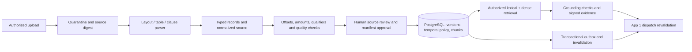

# App #4 — Storage / Drive & Hospitality Knowledge Base

**Grounded RAG & Document Intelligence · engineering and product dossier · 23 September 2026 · PostgreSQL 16 / pgvector · Kakheti wine hotels, chateaux, dining and regional tourism.**

## 1. Decision, evidence and integration boundaries

**Build a verified hotel knowledge service: preserve document structure, require human publication, enforce effective dates, and return attributable evidence that the Contact Center can revalidate before sending.** A searchable file is not automatically an approved hotel fact. This distinction applies equally to menus, company descriptions, tour brochures and formal policies.

**[O] Verification status:** the embedded DDL executed in a fresh PostgreSQL **16.15** cluster under `/tmp/app04-review/pgdata`, with actual **pgvector 0.6.0**, `btree_gist` and `pgcrypto`. The two embedded verification programs passed **60 named checks**, including a two-session overlapping-approval race. Five Draft 2020-12 schema documents (four service contracts plus the exact App #1 evidence-array contract) were meta-validated; positive and negative fixtures were validated with format assertions. Twelve database-produced lifecycle events passed the event schema. These are local synthetic tests, not a production deployment, OCR benchmark, independent vendor trial or proof of Georgian semantic embedding quality.

**Evidence convention:** **[D]** official technical documentation; **[V]** vendor-described capability, not independently tested efficacy; **[O]** directly inspected or locally executed; **[I]** proposed design, acceptance threshold or engineering inference; **[U]** unknown. Architecture, SQL, algorithms, contracts, product requirements and fictional hospitality examples inherit **[I]** unless marked otherwise. Source links are adjacent to supported findings and collected in §11. “Exhaustive” means coverage of the requested engineering dimensions and important failure cases, not every product or hotel.

**[O/U] Local grounding:** the four supplied input files remain unchanged; their hashes appear in §10. `task_research.md` explicitly lacks hotel operating records, completed operator interviews, representative local review data and proven willingness to pay. No property loss, incident prevalence, savings percentage or Georgian language accuracy is invented here. The comparison includes only relevant hospitality products and document/search projects; unrelated corporate names are omitted. The request did not supply a specific forbidden-name list.

### 1.1 Authority map

| Domain | Authoritative component | App #4 boundary |
|---|---|---|
| Hotel descriptions, published menus, service rules, seasonal hours | App #4 plus accountable human content owners | Versioned, approved evidence; never infer a missing price or rule |
| Guest reply, speaking owner, conversation binding and dispatch | App #1 | Return evidence; never contact guests directly |
| Personal preferences, identity, consent and retention | App #2 | No guest profiles in the general document corpus; quarantine accidental personal data |
| Internal manuals, maintenance procedure evidence | App #4; execution and status in App #3 | Separate operations audience; instructions do not establish that work was completed |
| Reservations, availability, folio, personalized cancellation terms, live stock | PMS / reservation / inventory authorities | Static brochure cannot prove current room availability, bottle stock or a particular booking's cancellation entitlement |
| Refunds, exceptions, safety assessments | Authorized hotel staff | Route uncertainty to App #1 human takeover / App #3 decision task |

**Integration finding:** App #1 §7.2 permits exactly `knowledge_item_id`, `policy_version`, `valid_at` in each `policy_evidence` item and sets `additionalProperties:false`. Adding `source_sha256` or `chunk_offset` inside that item breaks the existing contract. Return the exact three-field array plus a separate signed `citations` envelope, linked by item ID and version. §6 specifies the projection and send-time gate without modifying App #1's dossier.

## 2. Competitive teardown and measurable MVP edge

### 2.1 Public product and document-engine benchmark

**[V/U] These are public-document teardowns. No paid vendor tenant, controlled internal trace or commercial quote was available.** Claims that every incumbent lacks structure, source attribution, expiry or human review are unsupported. Multilingual answering does not by itself establish a multilingual vector implementation; none of the hospitality marketing sources proves its underlying retrieval algorithm or Georgian recall.

| Product / engine | Documented strength | Missing assurance or specific evaluation question | Our requirement |
|---|---|---|---|
| **HiJiffy knowledge scanner / property FAQs** [V] | Upload property knowledge and generate FAQ suggestions; organized FAQ workflows lower onboarding work. The help page explicitly scopes uploaded knowledge to the property. [Scanner](https://www.hijiffy.com/resources/product-highlights/ai-knowledge-scanner), [FAQ workflow](https://help.hijiffy.com/generate-faq-answers-via-chatbot-knowledge-base) | Public text does not establish immutable cell-level provenance, independent reviewer credentials, or overlapping valid-time exclusion. Do not equate suggested FAQ generation with automatic publication or claim there is no review UI | Preserve quick onboarding; prove a parser credential cannot publish and each approved wine row remains attributable |
| **Quicktext Q-DATA / Q-Brain+ / Velma** [V] | Structured hotel facts and hospitality intents; product material describes conversational plus generative layers, application versions and staging/production environments. [Structured hotel data](https://www.quicktext.im/?trk=products_details_guest_secondary_call_to_action), [Q-Brain+](https://www.quicktext.im/q-brain/) | Structured data is an existing market capability. Application/model versioning does not prove per-policy temporal validity or exact source-cell signatures. Product pages have differing data-point counts, so no count is used as a quality ranking | Typed menu records, effective intervals and reproducible approved revisions; compare Georgian terms and vintage disambiguation in a trial |
| **Asksuite Sophia / AI Data Hub** [V] | FAQs, PDFs and URLs in a central knowledge hub. Its **29 May 2026** governance article explicitly describes content expiry that stops expired material being used while retaining history, and source-level term search. [Data hub](https://asksuite.com/home/), [Governance release](https://asksuite.com/blog/content-governance-ai-sophia/) | This directly contradicts a blanket “seasonal invalidation is absent” claim. Public documentation does not prove a non-overlap constraint, two-person approval, cell-level evidence or consistency during concurrent publication and queued dispatch | Match source discovery and expiry; demonstrate transactional supersession, cancellation of stale evidence and approval race behavior |
| **Canary AI / digital compendium** [V] | Hotel-specific knowledge, multilingual guest messaging and a guest-accessible information hub for amenities and attractions. [Hospitality AI](https://www.canarytechnologies.com/products/hospitality-ai), [Digital compendium](https://www.canarytechnologies.com/products/digital-compendium) | Multilingual language counts are marketing coverage, not verified Georgian quality. Easy editing does not establish approval, PDF table fidelity, immutable evidence or cache invalidation semantics | Keep guest information simple; ensure menu and policy changes reach retrieval and the final dispatch gate consistently |
| **Docling** [D] | Layout and table processing; table data exposes row/column spans and cell locations. Its options distinguish accurate/fast extraction and cell matching. [Document model](https://docling-project.github.io/docling/reference/docling_document/), [Pipeline options](https://docling-project.github.io/docling/reference/pipeline_options/) | A parser is not a hotel policy authority. Models may misread merged cells, digits or Georgian scans; no accuracy on our fixtures was established | Use structured extraction as a candidate generator; preserve cells, review questionable numbers and bind corrections to a new revision |
| **Unstructured partitioning / chunking** [D] | Element-aware processing, isolated tables and title boundaries. Documentation says oversized tables can become text-split `TableChunk` elements. The inspected endpoint is labeled legacy and points to newer processing jobs. [Chunking documentation](https://docs.unstructured.io/api-reference/legacy-api/partition/chunking) | Table isolation alone does not guarantee atomic wine rows once a table exceeds the chunk limit. Section detection may misidentify headings | Convert validated rows to typed atomic records before length budgeting; never silently split a price or allergen qualifier from its item |

### 2.2 Failure mechanisms: test them, do not invent competitor incidents

| Mechanism [I/U] | Kakheti failure fixture | Required observable outcome |
|---|---|---|
| Flattened / arbitrary token chunking | Two Saperavi vintages; 2022 at GEL 85 and 2020 at GEL 120, with a sulphite footnote | Each answer binds item, vintage, serving size, price and footnote from the same row; unknown allergen remains unknown |
| Merged or repeated headers | Wine list has glass/bottle columns and a header repeated on page 2 | No header interpreted as an item; missing glass price does not inherit bottle price |
| Seasonal staleness | Pool hours expire at a precise Tbilisi midnight while a guest answer is queued | Retrieval excludes expired facts without a scheduler; dispatch revalidates and declines stale evidence |
| Approval bypass | Newly uploaded harvest dinner PDF says a lower price; parser attempts to publish | Guest sees only old approved content or abstention; worker cannot approve through either SQL or API |
| Hallucinated join | Menu lists walnuts; brochure says vegetarian; no assurance of allergy-safe preparation | Never infer allergen-free, vegan or absence of cross-contact; offer staff confirmation |
| Retrieval without entailment | Relevant cancellation heading retrieved, but group-booking exception is missing | No generated entitlement; retrieve the complete clause or abstain |
| Wrong locale / property | Georgian policy is awaiting review; an English sibling is approved for another property | No cross-property fallback; locale fallback requires explicit service policy and visible source-language labeling |
| Citation laundering | Malicious PDF says “ignore policies” and fabricates a source ID | Content remains data; only trusted service creates source IDs and signs receipts |
| Stale projection | Superseded menu remains in App #1 cache during delayed outbox delivery | Online evidence gate rejects old item/version; queue delay does not extend authority |

**Competitive edge [I]:** table-aware normalization **plus** independent human approval **plus** non-overlapping effective ranges **plus** hybrid retrieval **plus** authenticated, revalidated evidence. Each component exists elsewhere; the claim is that this combined contract can be tested end to end. Do not market “hallucination-free”: source mistakes, translation errors and unsupported synthesis remain possible.

### 2.3 Buy/build evaluation

Run the same blind dataset through incumbents and the reference pipeline: 30 menus/wine lists, 20 policy packs, 10 brochures/manuals; native spreadsheets, digital PDFs, scanned PDFs and phone images; Georgian/English pairs; repeated vintages, decimal commas, page breaks, seasonal replacements and injected instructions. This is a proposed sample, not a completed benchmark. Measure row exact-match and critical-field error rate separately from answer relevance. Ask vendors for exportable sources/versions, publication roles, expiry resolution, policy-change latency, per-tenant isolation, citations, deletion behavior and Georgian trial access. Compare setup labor, review labor, licensing/usage fees, hosting and ongoing content ownership; no verified total-cost ranking is available. Buy if an existing product passes the guarantees with lower total effort.

## 3. MVP product, folders and ingestion

### 3.1 Drive and knowledge hierarchy

| Root folder | Contents | Default audience / reviewer |
|---|---|---|
| `Documents` | Incoming files, quarantine and uncategorized property material | Internal editor only; no guest retrieval until explicitly classified and approved |
| `About Company` | Chateau story, location, accessibility descriptions, contact facts | Guest publication after property manager review |
| `Menus & Cellar` | Dining menus, breakfast, tasting flights, wines and serving sizes | Guest publication after restaurant/cellar reviewer checks prices and qualifiers |
| `Tours & Experiences` | Telavi experiences, vineyard walks, regional tours, cancellation/weather conditions | Guest publication after experience owner review; live availability elsewhere |
| `Policies & Rules` | Check-in/out, pets, quiet hours, cancellation, pool seasons | Guest publication after authorized policy owner review |
| `Maintenance & Manuals` | Cellar equipment, cottage heating, service procedures | Operations only; engineering supervisor review |

Folders organize work; they are **not** approval states or security principals. Every document carries explicit `space_id`, audience, locale and policy key. Moving a file never publishes it. Group-level brochures are copied into explicit property revisions for MVP: no invisible inheritance from another tenant. One policy key/locale maps to one logical document with multiple revisions; keys such as `menu.cellar`, `policy.pets`, `pool.seasonal.hours` identify independently publishable units. A source policy pack with independently changing clauses is split into multiple logical documents referencing the same immutable source bytes; each extracted unit preserves its own locator and approval. Never mix a manual and a guest FAQ under one audience.

**Editor workflow:** upload with progress; duplicates/retries resolved idempotently; source preview beside extracted cells/clauses; parser confidence and missing fields; original/translation side by side; revision diff for price, time, allergen and conditions; explicit validity window with timezone; reviewer assignment and expiry reminders. Reviewer sees the exact source, normalized text and manifest digest, checks highlighted differences, and approves the immutable manifest. Search preview clearly says “internal preview” and uses a separate authorized endpoint. Draft previews never use guest cache keys or guest credentials. Accessible table navigation, keyboard review, zoomable source pages and non-color-only error markers are MVP requirements.

**MVP acceptance:** upload PDF, DOCX, XLSX, CSV, PNG/JPEG and sanitized HTML; folder browsing, metadata filtering, duplicate detection, immutable revisions, approval queue, effective-date scheduling, source-linked search, guest/operations separation, audit/outbox monitoring and App #1 evidence. Deferred: live web crawling, collaborative rich-text editing, per-guest file drives, public sharing links, autonomous policy creation, cross-property inherited policies and generated pricing. No general corporate document archive is required.

### 3.2 Pipeline and trust boundaries



1. Authenticate user/property before accepting bytes. Issue a short-lived upload URL tied to a server-chosen tenant object key, allowlisted MIME and size ceiling (50 MiB in this schema). On completion, verify actual size, MIME magic and SHA-256 by reading stored bytes. Do not trust filename, client digest or URL. No arbitrary remote URL fetch in MVP; later fetchers require outbound allowlists and private-address blocking.
2. Quarantine until malware and content checks finish. Parsers run without network, credentials, shell or unrestricted filesystem access, with CPU/memory/page/zip-expansion limits. Do not evaluate spreadsheet formulas or macros. Reject unsupported encryption, corrupt archives and formula-only prices without trustworthy cached values.
3. Prefer native sheet/cell structure over OCR. For digital PDFs use layout and table detection; for scans retain page image, OCR token boxes and confidence. Preserve raw source bytes. A low-confidence numeral, unit, allergen marker, date or negation forces review; model confidence is not proof.
4. Emit typed candidates and a deterministic normalized UTF-8 text artifact; persist source and normalized digests, parser version, schema version, row/page locators and embeddings. Raw OCR text and clean normalized text are distinct artifacts. Normalize Unicode NFC and line endings before defining offsets; never re-normalize after signing.
5. Validate cell relationships, explicit conditions, required fields and cross-reference closure. Build immutable chunks and a manifest. The DDL performs the publication of parsed results atomically; a parser crash before commit leaves the policy draft and exposes no partial rows. Expensive OCR runs outside this transaction. Job leases, retries and quarantine status live in the upload worker, not a long-running SQL transaction.
6. Seal revision, queue human review. No on-the-fly model correction updates a sealed revision. Correct and re-ingest as a new version; unresolved flags cannot be waived by the model. Approve with a different authenticated human from the uploader. Approval is not proof that the document itself is true; the reviewer is accountable for verification with hotel owners.

### 3.3 Domain extraction contracts

**Wine row:** `{item_id, name_original, producer, appellation, grape, vintage:integer|null, non_vintage:boolean, description, serving_ml, unit, price_minor, currency, tax_included:boolean|null, service_charge_note, allergens:list|null, allergen_note, source_cells, table_context}`. A null vintage with `non_vintage=false` means unknown. Keep harvest year distinct from a wine's label number. Use integer minor currency units, never binary float; `85.00 GEL` becomes `8500`, not `85`. Missing amount is null and cannot support a price response; “from 85” is a qualified minimum, not an exact price. Store variant prices as separate serving variants or explicit nested variants, never transfer across rows.

**Dining row:** `{item_id, name_original, description, portion, price_minor, currency, dietary_claims, allergens:list|null, cross_contact_note, availability_note, source_cells}`. Dietary claims are copied only if explicit. Blank allergen cell means unknown; it does not mean empty/allergen-free. A menu legend such as “* contains walnuts” must accompany every referenced row. Guest-specific allergy requests go to hotel staff if supporting preparation assurance is absent. No medical advice is derived from menus.

**Policy clause:** `{policy_key, heading_path, subject, rule, conditions, exceptions, scope, booking_channel_or_rate_scope, referenced_clause_ids, authority_locale, effective_start, effective_end, timezone, source_spans}`. Cancellation notice periods are durations relative to the activity/check-in; effective dates govern when the policy version is authoritative. Keep those two time concepts separate. Never apply generic free cancellation to a reservation governed by a specific rate plan. Preserve “unless”, “except”, “subject to confirmation” and group-size rules in the same retrievable unit.

**Experience:** typed inclusions/exclusions, duration, meeting point, minimum age if explicitly stated, cancellation/weather rules, transport, price basis (per person/group), booking lead time and operator confirmation requirement. Brochure description of a vineyard tour does not prove tomorrow's operation or road/weather safety.

**Manual:** asset/model identity, prerequisites, ordered procedure, warnings, stop/escalation conditions and revision. Retrieve complete warning context. A service manual does not authorize unqualified staff to operate equipment.

### 3.4 Chunking algorithm and provenance

For tables, reconstruct the grid before chunking: detect merged headers; attach section labels and units; distinguish row data from page headers/footers; join multi-page continuations only with matching columns/table identity and reviewer confirmation when ambiguous. Create one atomic chunk per complete item/serving variant, with repeated headers and referenced notes. Long descriptions may have child search chunks, but the answer builder must expand back to the complete row; a hard token budget causes abstention rather than truncating price/allergen context. Never place two prices into a free-form sentence without their serving/vintage keys.

For policies, split by stable heading and complete rule/exception block. Proposed target is 250–600 tokens; it is subordinate to semantic completeness. Resolve referenced exceptions before serving. Keep an explicit policy key per independently approved clause. A token overflow is a review error or bounded parent expansion, not an invitation to drop exceptions. Fixed-window overlap alone cannot preserve policy scope.

`chunk_offset` uses **zero-based Unicode scalar positions** into the immutable `normalized_text`, end-exclusive. PostgreSQL substring uses one-based positions, so validation uses `start_char + 1` and `end_char - start_char`. These are not PDF byte offsets or UTF-16 browser indexes. Each quote must exactly equal that slice; chunk hash is SHA-256 of its UTF-8 bytes. Locator identifies source page (one-based), table and row; production table locators should also retain cell boxes and spans in the stored locator JSON. The API's v1 locator exposes a compact page/table/row subset. For spreadsheets, the renderer assigns stable preview pages and stores sheet/cell coordinates in the underlying locator; never invent a PDF page number.

**[O] Offline fixtures** verify quoted CSV commas, vintage/price/allergen row integrity, Georgian dish names, unknown allergens, excessive decimal precision, exact source slices, heading-based policy exceptions and rejection of oversized clauses. They begin with structured CSV/text; they do **not** exercise actual OCR, merged-cell image recognition or scanned Georgian accuracy. The larger parser benchmark in §9 is still a release gate.

## 4. Approval, time and invalidation

### 4.1 State machine

| State / transition | Actor and required evidence | Guest visibility |
|---|---|---|
| `DRAFT` | Editor registers immutable source identity and next version | None |
| `DRAFT → PROCESSING` | Trusted ingestion service; draft locked; validated parse output supplied | None |
| `PROCESSING → REVIEW_REQUIRED` | Complete nonempty chunks, checked offsets, sealed manifest; flags visible | None |
| `REVIEW_REQUIRED → APPROVED_ACTIVE` | Separate human approver, correct state version and manifest, no unresolved flags, valid temporal range | Only when current time lies in range and audience/locale/property match |
| `APPROVED_ACTIVE → SUPERSEDED` | Same transaction approves a newer version and closes the predecessor's range | None in guest search; history retained |
| `SUPERSEDED → ARCHIVED` | Authorized human archival action | None |
| Review/processing/active → `ARCHIVED` | Authorized withdrawal with reason and epoch change | None |

This implements the requested principal path `DRAFT → PROCESSING → REVIEW_REQUIRED → APPROVED_ACTIVE → SUPERSEDED → ARCHIVED`, with explicit withdrawal branches. A failed atomic processing call rolls back to DRAFT; retries can safely try again. In this minimal SQL core, PROCESSING occurs inside the publication transaction and is not a durable OCR-progress indicator. A rejected sealed parse requires a new revision. The archival function deliberately excludes DRAFT: abandon it through editor workflow until a separately audited draft-disposal API is implemented; no guest leakage results.

`knowledge_item_id` identifies a **particular immutable published candidate/version**, consistent with App #1's `knowledge_items` primary key and unique `(policy_key,locale,version)`. `document_id` identifies the logical document across versions. `version` is a positive consecutive document revision integer. `state_version` is a separate optimistic concurrency counter; revision 3 can have state version 4. Never conflate these counters.

### 4.2 Valid time and transaction time

**[D/I]** PostgreSQL range types and GiST exclusion can enforce non-overlap; equality on scalar tenant/key/locale uses `btree_gist`. The DDL excludes overlap on `(space_id, policy_key, locale, valid_during)` for approved rows. It uses nonempty lower-bounded **`[from, until)`** `tstzrange` values. `until=null` means open-ended, not “missing approval.” [PostgreSQL range documentation](https://www.postgresql.org/docs/16/rangetypes.html)

`APPROVED_ACTIVE` means approved for its effective interval, including a scheduled future interval. Two adjacent approved seasons may coexist; at any instant at most one intersects that instant for the same tenant/key/locale. The search predicate always includes `valid_during @> statement_timestamp()`. Expired/future versions cannot leak even if the cleanup worker is down. Store timestamp instants in UTC; render the owner's `Asia/Tbilisi` input as an explicitly converted instant. A season ending 1 October at local midnight ends at `2026-09-30T20:00:00Z`. API must reject ambiguous or reversed windows before SQL.

Transaction times (`approved_at`, outbox `occurred_at`) separately establish when the system recorded a decision. The schema is not a complete bitemporal historical query engine. Audit events retain prior effective ranges. A guest query cannot supply arbitrary `as_of` to recover stale policies. `service_date` is intent context; v1 still returns only presently approved/current authority. Questions about a future service need explicit future applicability in the approved clause and must abstain when uncertain. An administrative historical viewer is a separate endpoint/role.

### 4.3 Immediate versus scheduled replacement

Immediate replacement locks the space publication row, candidate and predecessor; verifies reviewer, expected state counter and manifest; truncates old range at the new effective lower bound; marks old SUPERSEDED; approves new; increments `knowledge_epoch`; and inserts both outbox events before commit. A uniqueness/exclusion failure rolls back everything. A newer revision is required. The API should default the boundary to server time; any backdated correction requires an explicit human explanation and is not allowed to rewrite prior receipts. The SQL permits an authorized past boundary strictly after the predecessor start and no later than current time, and retains previous state in events.

Scheduled replacement is **not** immediate supersession: upload the next season with a start equal to the already finite current-season end and approve without `p_supersede`. Both ranges remain approved and non-overlapping; at the boundary the time predicate selects the successor. If the existing policy is open-ended, the MVP does not silently trim it to accommodate a future candidate. The reviewer must create an explicitly bounded current/future pair through a reviewed migration, or publish an immediate replacement at the change time. A generalized atomic future-rescheduling API is deferred. This limitation must be visible in the scheduling UI.

Archival is immediate withdrawal. It increments epoch and emits an event; query-time approval-state checks remove the row regardless of its remaining validity. Do not hard-delete source revisions, rewrite approved content, extend validity on a stale row, or automatically republish a superseded version. Reinstatement is a new revision and approval.

### 4.4 Authentication and deployment limits

The DDL gives `kb_ingest`, `kb_reviewer`, `kb_guest`, `kb_operations` and `kb_transport` distinct non-login roles. Model tools have no database credentials. Only the authenticated service chooses tenant/actor settings, using `SET LOCAL` inside a transaction after verifying membership. Caller JSON is not authority. The reviewer service authenticates a human session, checks `auth_subject → actor_id`, and alone holds the reviewer role. The database checks enabled APPROVER membership and uploader inequality. A UUID alone does not prove human identity.

All tables use ENABLE and FORCE RLS and composite tenant foreign keys. `kb_owner` is a non-login, non-bypass owner. Definer functions have pinned paths; PUBLIC function execution is revoked. Runtime roles receive no raw guest-accessible table SELECT or publication DML. **RLS using session settings is not protection against a hostile holder of the service database credential:** custom settings are caller-settable. Credentials must stay in the trusted gateway; enforce tenant authorization there and reset pools transactionally. Superusers, migration owners and backup operators are privileged trust boundaries. [PostgreSQL RLS](https://www.postgresql.org/docs/16/ddl-rowsecurity.html)

Property/member/folder/document provisioning and human source previews require trusted administrative endpoints; their complete CRUD code is not in the DDL. Do not give the browser or parser `kb_owner`. Provision metadata through reviewed transactions; folder move must check ancestry with a recursive query under a property lock, reject cycles, and keep audience changes separately reviewed. The schema checks self-parenting and tenant FK but does not implement arbitrary folder-move cycle detection. Guest lookup cannot traverse the folder tree, so a metadata defect cannot bypass approval.

## 5. Hybrid search and answer grounding

### 5.1 Dense and lexical retrieval

**[D/I]** Store 384-dimensional vectors with a pinned multilingual model identifier. The dimension is an MVP engineering choice, not evidence of a particular model's Georgian quality. Model changes require re-embedding/version migration; never compare different models solely because dimensions match. Reject empty, nonfinite, wrong-dimensional and zero vectors at the gateway. Index with `vector_cosine_ops`, `hnsw(m=16,ef_construction=64)` and evaluate recall/latency before changing defaults. pgvector documents exact/approximate search and cosine operators; HNSW does not require an IVFFlat training step. [pgvector documentation](https://github.com/pgvector/pgvector)

The executable reference search deliberately materializes the **eligible approved corpus first** and performs exact vector distances inside it. It combines dense and lexical ranks; it does not claim its materialized scan uses HNSW. This is a simple correctness baseline for small hotel corpora. The HNSW index exists and was separately executed. At scale, use tenant partitions or a tested eligible-candidate strategy, measure ANN recall after filters, and backfill with exact search when too few authorized candidates survive. Filtering global ANN top-k after the fact can destroy recall; it must never relax authorization to fill the result count. pgvector 0.6.0, tested here, does not supply later iterative-scan features; enable those only after an independently tested extension upgrade.

**IVFFlat alternative:** create the commented `lists=100` index only after representative embeddings exist; begin an evaluation with `SET LOCAL ivfflat.probes=10` and compare against exact search. `lists`, probes and the HNSW query setting `hnsw.ef_search` trade recall, latency and memory; the example values are not universal recommendations. Prefer one measured ANN strategy rather than paying for both indexes without a use case. No IVFFlat training, recall benchmark or production HNSW speedup was tested here.

**[D/I] English configuration** copies `pg_catalog.english`; **Georgian configuration** explicitly copies `pg_catalog.simple`. PostgreSQL 16's standard installation here has no Georgian morphological stemmer. Calling this configuration `kb.georgian` does not add one. It tokenizes and normalizes lexical terms without Georgian inflection awareness. Keep a second simple `exact_tsv` for identifiers, vintages and numeric tokens; both have GIN indexes. Test `ts_debug` and real Georgian forms before adding a reviewed synonym/lemmatization layer. Use the same normalization and configuration at index/query time. [Dictionary mechanics](https://www.postgresql.org/docs/16/textsearch-dictionaries.html), [Configuration](https://www.postgresql.org/docs/16/textsearch-configuration.html)

Examples: `Saperavi 2022` must retain the vintage; `Room 304` must retain the room number; `11:00 AM` must retain time and meridiem. FTS token matches are not equality guarantees: structured filters and row identifiers disambiguate vintage/unit/room when the guest asks an exact question. Don't allow dense similarity to substitute 2020 for 2022 or infer a room from 304 in an unrelated phone number. Georgian inflections/transliteration should be evaluated with native speakers; implicit English fallback is disabled in the SQL.

### 5.2 Reciprocal Rank Fusion

Candidate lists: top 100 lexical and top 100 dense within the same eligible set; deduplicate by `chunk_id`. For each chunk:

`rrf_score = (lexical_present ? 1/(60 + lexical_rank) : 0) + (dense_present ? 1/(60 + dense_rank) : 0)`

Ranks start at 1; deterministic tie-break is `chunk_id`. The SQL weights the two lists equally and returns at most 20. Lexical score combines simple-token and locale-configured `ts_rank_cd`, yielding one lexical rank, not two independent RRF votes. This rank fusion avoids pretending cosine distance and text rank have interchangeable scales. A positive score is **not** an answer confidence probability. The 60 constant, list sizes and any later weights are tunable design defaults; no local statistical optimization is claimed.

Pipeline after retrieval: expand complete rows/exception context → enforce exact requested entities and applicable scope → remove duplicate evidence → detect conflicting claims → bind each proposed assertion to supporting quotes → check numbers/units/negations deterministically → produce a signed receipt or abstain. No unsupported benefit, price, availability or policy exception may be generated merely because the query returned a neighbor. If embeddings are unavailable, lexical-only search can continue with an explicit retrieval mode and the same approval checks; a semantic-only question may need abstention.

### 5.3 Answer and cache rules

Guest models receive only selected approved quotes and typed facts; document instructions cannot create tools, change roles or override system policy. Citation labels and source tokens come from trusted code. A proposed answer must have claim-to-source support; numeric prices and hours should be rendered from validated fields. No score threshold alone proves entailment. Unsupported claims, conflicts, missing applicability, parser flags, stale projection or unavailable freshness gate result in `ABSTAIN` and App #1 human routing.

Cache keys include space, audience, locale, query normalization version, embedding model, retrieval version and knowledge epoch. TTL cannot exceed the earliest policy end or receipt expiry; 30 seconds is the proposed receipt ceiling. Epoch invalidation handles publication/withdrawal, while wall-clock range checks handle expiry without events. Revalidate every cached result before exposure. Record query HMAC rather than plaintext by default, because a question may contain guest details; per-tenant HMAC keys reduce dictionary attacks compared with plain hashes. Proposed audit retention is 30 days, subject to hotel privacy policy; there is no claim of a statutory retention period.

## 6. Grounded citation contract for App #1

### 6.1 Exact adapter and provenance envelope

The three-field adapter is deliberately mechanical:

```python
policy_evidence = [
    {"knowledge_item_id": c["knowledge_item_id"],
     "policy_version": c["version"], "valid_at": response["retrieved_at"]}
    for c in unique_citations_by_item_and_version(response["citations"])
]
```

`valid_at` is the server retrieval instant, not a client-chosen historical timestamp. The response's `citations` array contains `knowledge_item_id`, `version`, `revision_id`, `chunk_id`, `valid_during`, `source_sha256`, `normalized_sha256`, `chunk_sha256`, `chunk_offset`, source locator, exact quote, RRF score, signed token and token expiry. Multiple chunks may map to one deduplicated policy evidence item. Schemas cannot enforce this cross-array join; the service must check set equality and version correspondence.

Hash the original source bytes, normalized UTF-8 text and exact quote separately. Hashes detect changes **only relative to a trusted digest**; an attacker able to replace bytes and hashes can forge a bare hash chain. The SQL manifest binds source digest, parser version, normalized text and ordered chunk records including offsets, locators, structured facts, model ID and embedding text. Its serialization is PostgreSQL JSONB text, a database-specific internal format. Treat it as an opaque approved digest rather than trying to recompute it with an arbitrary JSON serializer. Pin/version its format on database or parser changes.

The evidence service authenticates a canonical receipt with a protected signing key. The offline fixture uses HMAC-SHA256 over deterministic UTF-8 JSON, verifies with constant-time comparison and retains no secret. Production must version its canonicalization and token format, use protected keys with key IDs/rotation, allowlist the algorithm and bind **space, audience, item/version, revision/chunk, source/normalized/chunk digests, offset, valid interval, epoch and expiration**. Additionally bind query/generation identity where replay across requests matters; these fields are part of the signed receipt, not App #1's three-field item. Store the signed receipt server-side keyed to generation/query so dispatch cannot substitute fabricated evidence from model text. Shared HMAC verifiers can also sign; asymmetric signatures are preferable if independent consumers need verification without signing authority. Tamper resistance is conditional on key/admin security; this is not immutable proof against the database owner.

### 6.2 Dispatch-time check and races

Before a guest answer is queued, bind the generated text and its exact evidence receipt to `generation_id`. Before the external send starts, App #1's trusted gate verifies receipt authenticity/expiry, space/audience, item/version equality, source/quote hashes, current approval state, current validity and current epoch through App #4. It also performs its existing ownership/binding/message-sequence checks. Fail closed on missing or unavailable evidence validation. Never accept the mere presence of a citation ID as sufficient grounding.

For an enforceable publication-versus-send boundary, use the same publication lock domain: App #4 provides a short evidence lease while holding the property publication lock; App #1 begins its authorized send attempt before releasing the lease. In a modular single-database deployment this can be a bounded shared row lock on the space while publication takes an exclusive update lock. Separate services need an explicit lease protocol with fencing and bounded expiry; that protocol is specified here but not implemented in the SQL core. Do not claim that an asynchronous invalidation event eliminates the race. Once an external message has begun sending, later policy withdrawal cannot retract it; the guarantee is validity at authorized send initiation, not at guest read time. Use strict timeouts to avoid long network stalls holding publication locks; unknown delivery follows App #1's existing reconciliation rules.

### 6.3 Existing App #1 projection constraints

App #1's `knowledge_items` table has an unconditional temporal exclusion constraint and an `approved_by` FK to its participants; it has no policy-state or receipt fields. Map App #4 item ID to `knowledge_items.id`, version to version, current approved quote/content to content, and use an authorized immutable source URI. Map the reviewer to a real corresponding participant; do not invent a placeholder actor.

Apply a supersession batch in one App #1 transaction: shorten the predecessor range before inserting the successor. A future already-nonoverlapping version can be projected ahead of its start. For archival, remove the item from the serving projection while retaining history in App #4/audit. Out-of-order events cannot resurrect it: maintain consumer inbox deduplication and latest `state_version` tombstones. Gap recovery must fetch a tenant-scoped snapshot and reconcile atomically before resuming AI dispatch. App #1's current DDL does not implement these consumer/tombstone tables or the online receipt gate; they are explicit integration work, not silently present functionality. Its wire `policy_evidence` schema needs no change. Event enrichment uses a read API because the event intentionally carries identifiers/digests rather than full source content.

## 7. Executable PostgreSQL 16 DDL

**[O/I] The following `ddl.sql` is the complete tested persistence/retrieval core.** Run once in a fresh database/cluster as a migration administrator able to install the three extensions and create the fixed non-login roles. Provision extension packages first. The transaction fails cleanly if `vector` is unavailable; it never substitutes a fake vector domain or quietly calls a lexical-only test an ANN test. Roles are cluster-global; repeated execution in the same cluster needs a normal migration strategy, not blind recreation.

Besides the seven requested tables, `spaces`, `knowledge_members` and `ingestion_commands` provide tenant context, human authorization and upload idempotency. HNSW and lexical indexes are executable; the commented IVFFlat alternative is a specification, not an executed performance test. No passwords or application logins are created. The surrounding upload, authentication, object store, reviewer UI, transport, audit writer and citation signer still need implementation as specified above.


<!-- artifact: ddl.sql -->
```sql
-- PostgreSQL 16; pgvector >=0.6.0, btree_gist, pgcrypto. Fresh application schema.
BEGIN;
CREATE EXTENSION IF NOT EXISTS vector;
CREATE EXTENSION IF NOT EXISTS btree_gist;
CREATE EXTENSION IF NOT EXISTS pgcrypto;
CREATE ROLE kb_owner NOLOGIN NOSUPERUSER NOBYPASSRLS;
CREATE ROLE kb_ingest NOLOGIN NOSUPERUSER NOBYPASSRLS;
CREATE ROLE kb_reviewer NOLOGIN NOSUPERUSER NOBYPASSRLS;
CREATE ROLE kb_guest NOLOGIN NOSUPERUSER NOBYPASSRLS;
CREATE ROLE kb_operations NOLOGIN NOSUPERUSER NOBYPASSRLS;
CREATE ROLE kb_transport NOLOGIN NOSUPERUSER NOBYPASSRLS;
REVOKE CREATE ON SCHEMA public FROM PUBLIC;
CREATE SCHEMA kb AUTHORIZATION kb_owner;
SET LOCAL ROLE kb_owner;
SET LOCAL search_path=kb,public,pg_catalog;
CREATE FUNCTION tenant() RETURNS uuid LANGUAGE sql STABLE AS
$$ SELECT nullif(current_setting('app.space_id',true),'')::uuid $$;
CREATE FUNCTION actor() RETURNS uuid LANGUAGE sql STABLE AS
$$ SELECT nullif(current_setting('app.actor_id',true),'')::uuid $$;
CREATE TEXT SEARCH CONFIGURATION kb.english (COPY=pg_catalog.english);
-- Explicit lexical fallback, NOT a Georgian stemmer or morphological dictionary.
CREATE TEXT SEARCH CONFIGURATION kb.georgian (COPY=pg_catalog.simple);
CREATE TABLE spaces (
 space_id uuid PRIMARY KEY, name text NOT NULL, knowledge_epoch bigint NOT NULL DEFAULT 1 CHECK(knowledge_epoch>0)
);
CREATE TABLE knowledge_members (
 space_id uuid NOT NULL REFERENCES spaces, actor_id uuid NOT NULL, auth_subject text NOT NULL,
 role_name text NOT NULL CHECK(role_name IN ('EDITOR','APPROVER')), enabled boolean NOT NULL DEFAULT true,
 PRIMARY KEY(space_id,actor_id), UNIQUE(space_id,auth_subject)
);
CREATE TABLE storage_folders (
 space_id uuid NOT NULL REFERENCES spaces, folder_id uuid NOT NULL DEFAULT gen_random_uuid(), parent_id uuid,
 name text NOT NULL CHECK(length(name) BETWEEN 1 AND 120),
 PRIMARY KEY(space_id,folder_id), FOREIGN KEY(space_id,parent_id) REFERENCES storage_folders,
 UNIQUE NULLS NOT DISTINCT(space_id,parent_id,name), CHECK(parent_id IS DISTINCT FROM folder_id)
);
CREATE TABLE storage_documents (
 space_id uuid NOT NULL, document_id uuid NOT NULL DEFAULT gen_random_uuid(), folder_id uuid NOT NULL,
 title text NOT NULL CHECK(length(title) BETWEEN 1 AND 300), policy_key text NOT NULL CHECK(policy_key ~ '^[a-z][a-z0-9_.-]{0,119}$'),
 locale text NOT NULL CHECK(locale ~ '^[a-z]{2,3}(-[A-Za-z0-9]{2,8})*$'),
 audience text NOT NULL CHECK(audience IN ('GUEST','OPERATIONS')),
 document_kind text NOT NULL CHECK(document_kind IN ('POLICY','MENU','WINE_LIST','EXPERIENCE','COMPANY','MANUAL')),
 deleted_at timestamptz, created_at timestamptz NOT NULL DEFAULT clock_timestamp(),
 PRIMARY KEY(space_id,document_id), UNIQUE(space_id,policy_key,locale),
 FOREIGN KEY(space_id,folder_id) REFERENCES storage_folders
);
CREATE TABLE document_revisions (
 space_id uuid NOT NULL, revision_id uuid NOT NULL DEFAULT gen_random_uuid(), document_id uuid NOT NULL,
 version integer NOT NULL CHECK(version>0), uploaded_by uuid NOT NULL,
 source_object_key text NOT NULL, source_sha256 text NOT NULL CHECK(source_sha256 ~ '^[0-9a-f]{64}$'),
 source_mime text NOT NULL, source_bytes bigint NOT NULL CHECK(source_bytes BETWEEN 1 AND 52428800),
 normalized_text text NOT NULL DEFAULT '',
 normalized_sha256 text GENERATED ALWAYS AS (encode(public.digest(normalized_text,'sha256'),'hex')) STORED,
 parser_version text NOT NULL, schema_version integer NOT NULL DEFAULT 1 CHECK(schema_version=1),
 parse_status text NOT NULL DEFAULT 'PENDING' CHECK(parse_status IN ('PENDING','RUNNING','READY','FAILED')),
 review_flags jsonb NOT NULL DEFAULT '[]' CHECK(jsonb_typeof(review_flags)='array'),
 manifest_sha256 text CHECK(manifest_sha256 ~ '^[0-9a-f]{64}$'), sealed_at timestamptz,
 created_at timestamptz NOT NULL DEFAULT clock_timestamp(),
 PRIMARY KEY(space_id,revision_id), UNIQUE(space_id,document_id,version),
 UNIQUE(space_id,revision_id,document_id,version),
 FOREIGN KEY(space_id,document_id) REFERENCES storage_documents,
 FOREIGN KEY(space_id,uploaded_by) REFERENCES knowledge_members,
 CHECK((parse_status='READY')=(sealed_at IS NOT NULL AND manifest_sha256 IS NOT NULL))
);
CREATE TABLE document_chunks (
 space_id uuid NOT NULL, chunk_id uuid NOT NULL DEFAULT gen_random_uuid(), revision_id uuid NOT NULL,
 ordinal integer NOT NULL CHECK(ordinal>=0), start_char integer NOT NULL CHECK(start_char>=0),
 end_char integer NOT NULL CHECK(end_char>start_char), content text NOT NULL CHECK(length(content)>0),
 chunk_sha256 text GENERATED ALWAYS AS (encode(public.digest(content,'sha256'),'hex')) STORED,
 chunk_kind text NOT NULL CHECK(chunk_kind IN ('POLICY_CLAUSE','MENU_ROW','WINE_ROW','EXPERIENCE','MANUAL_SECTION','COMPANY')),
 locator jsonb NOT NULL CHECK(jsonb_typeof(locator)='object'), structured_data jsonb NOT NULL DEFAULT '{}' CHECK(jsonb_typeof(structured_data)='object'),
 locale text NOT NULL, embedding public.vector(384), embedding_model text,
 search_tsv tsvector GENERATED ALWAYS AS (to_tsvector(CASE WHEN locale LIKE 'en%' THEN 'kb.english'::regconfig ELSE 'kb.georgian'::regconfig END,content)) STORED,
 exact_tsv tsvector GENERATED ALWAYS AS (to_tsvector('pg_catalog.simple'::regconfig,content)) STORED,
 PRIMARY KEY(space_id,chunk_id), UNIQUE(space_id,revision_id,ordinal),
 FOREIGN KEY(space_id,revision_id) REFERENCES document_revisions,
 CHECK((embedding IS NULL)=(embedding_model IS NULL)),
 CHECK(embedding IS NULL OR public.vector_norm(embedding)>0)
);
CREATE INDEX chunk_dense_hnsw ON document_chunks USING hnsw(embedding public.vector_cosine_ops) WITH(m=16,ef_construction=64);
-- IVFFlat alternative AFTER representative training data exists:
-- CREATE INDEX chunk_dense_ivf ON kb.document_chunks USING ivfflat(embedding public.vector_cosine_ops) WITH(lists=100);
CREATE INDEX chunk_lexical_gin ON document_chunks USING gin(search_tsv);
CREATE INDEX chunk_exact_gin ON document_chunks USING gin(exact_tsv);
CREATE INDEX chunk_structured_gin ON document_chunks USING gin(structured_data jsonb_path_ops);
CREATE INDEX chunk_revision ON document_chunks(space_id,revision_id,ordinal);
CREATE TABLE knowledge_policies (
 space_id uuid NOT NULL, knowledge_item_id uuid NOT NULL DEFAULT gen_random_uuid(), document_id uuid NOT NULL,
 revision_id uuid NOT NULL, policy_key text NOT NULL, locale text NOT NULL, version integer NOT NULL CHECK(version>0),
 state text NOT NULL DEFAULT 'DRAFT' CHECK(state IN ('DRAFT','PROCESSING','REVIEW_REQUIRED','APPROVED_ACTIVE','SUPERSEDED','ARCHIVED')),
 state_version bigint NOT NULL DEFAULT 1 CHECK(state_version>0), valid_during tstzrange NOT NULL,
 approved_by uuid, approved_at timestamptz, approval_manifest_sha256 text, approval_reason text,
 PRIMARY KEY(space_id,knowledge_item_id), UNIQUE(space_id,revision_id), UNIQUE(space_id,policy_key,locale,version),
 FOREIGN KEY(space_id,revision_id,document_id,version) REFERENCES document_revisions(space_id,revision_id,document_id,version),
 FOREIGN KEY(space_id,approved_by) REFERENCES knowledge_members,
 CHECK(NOT isempty(valid_during) AND NOT lower_inf(valid_during) AND lower_inc(valid_during) AND NOT upper_inc(valid_during)),
 CHECK(state NOT IN ('APPROVED_ACTIVE','SUPERSEDED') OR
  (approved_by IS NOT NULL AND approved_at IS NOT NULL AND approval_manifest_sha256 IS NOT NULL AND approval_reason IS NOT NULL)),
 EXCLUDE USING gist(space_id WITH =,policy_key WITH =,locale WITH =,valid_during WITH &&)
  WHERE(state='APPROVED_ACTIVE')
);
CREATE INDEX policy_active ON knowledge_policies(space_id,policy_key,locale) WHERE state='APPROVED_ACTIVE';
CREATE TABLE ingestion_commands (
 space_id uuid NOT NULL REFERENCES spaces, command_id uuid NOT NULL, body_hash text NOT NULL CHECK(body_hash ~ '^[0-9a-f]{64}$'),
 revision_id uuid NOT NULL, received_at timestamptz NOT NULL DEFAULT clock_timestamp(),
 PRIMARY KEY(space_id,command_id), FOREIGN KEY(space_id,revision_id) REFERENCES document_revisions
);
CREATE TABLE retrieval_query_audit (
 space_id uuid NOT NULL REFERENCES spaces, query_id uuid NOT NULL, principal_ref text NOT NULL,
 audience text NOT NULL CHECK(audience IN ('GUEST','OPERATIONS')), locale text NOT NULL,
 query_hmac text NOT NULL, queried_at timestamptz NOT NULL, expires_at timestamptz NOT NULL,
 knowledge_epoch bigint NOT NULL, result_manifest jsonb NOT NULL CHECK(jsonb_typeof(result_manifest)='array'),
 outcome text NOT NULL CHECK(outcome IN ('GROUNDED','ABSTAIN')), model_id text, retrieval_mode text NOT NULL,
 PRIMARY KEY(space_id,query_id), CHECK(expires_at>queried_at)
);
CREATE TABLE storage_outbox (
 space_id uuid NOT NULL REFERENCES spaces, event_id uuid NOT NULL DEFAULT gen_random_uuid(),
 knowledge_item_id uuid NOT NULL, event_type text NOT NULL CHECK(event_type IN ('PolicyApprovedEvent','PolicySupersededEvent','PolicyArchivedEvent')),
 aggregate_version bigint NOT NULL CHECK(aggregate_version>0), payload jsonb NOT NULL CHECK(jsonb_typeof(payload)='object'),
 created_at timestamptz NOT NULL DEFAULT clock_timestamp(), available_at timestamptz NOT NULL DEFAULT clock_timestamp(),
 lease_token uuid, leased_until timestamptz, attempts integer NOT NULL DEFAULT 0 CHECK(attempts>=0), published_at timestamptz,
 PRIMARY KEY(space_id,event_id), UNIQUE(space_id,knowledge_item_id,aggregate_version),
 FOREIGN KEY(space_id,knowledge_item_id) REFERENCES knowledge_policies,
 CHECK((lease_token IS NULL)=(leased_until IS NULL))
);
CREATE INDEX storage_pending_outbox ON storage_outbox(space_id,available_at,created_at) WHERE published_at IS NULL;
DO $$ DECLARE r record; BEGIN
 FOR r IN SELECT tablename FROM pg_tables WHERE schemaname='kb' LOOP
  EXECUTE format('ALTER TABLE kb.%I ENABLE ROW LEVEL SECURITY',r.tablename);
  EXECUTE format('ALTER TABLE kb.%I FORCE ROW LEVEL SECURITY',r.tablename);
  EXECUTE format('CREATE POLICY tenant_scope ON kb.%I USING(space_id=kb.tenant()) WITH CHECK(space_id=kb.tenant())',r.tablename);
 END LOOP;
END $$;
CREATE FUNCTION guard_revision() RETURNS trigger LANGUAGE plpgsql SET search_path=pg_catalog,kb,public,pg_temp AS $$ BEGIN
 IF OLD.sealed_at IS NOT NULL THEN RAISE EXCEPTION 'sealed revision is immutable'; END IF;
 IF TG_OP='DELETE' THEN RETURN OLD; END IF;
 IF NEW.space_id<>OLD.space_id OR NEW.revision_id<>OLD.revision_id OR NEW.source_sha256<>OLD.source_sha256
 OR NEW.source_object_key<>OLD.source_object_key OR NEW.document_id<>OLD.document_id OR NEW.version<>OLD.version
 THEN RAISE EXCEPTION 'immutable revision source'; END IF;
 RETURN NEW;
END $$;
CREATE TRIGGER revision_immutable BEFORE UPDATE OR DELETE ON document_revisions FOR EACH ROW EXECUTE FUNCTION guard_revision();
CREATE FUNCTION guard_chunk() RETURNS trigger LANGUAGE plpgsql SET search_path=pg_catalog,kb,public,pg_temp AS $$
DECLARE r document_revisions; d storage_documents; BEGIN
 IF TG_OP<>'INSERT' THEN RAISE EXCEPTION 'chunk is immutable; create a new revision'; END IF;
 SELECT * INTO STRICT r FROM document_revisions WHERE space_id=NEW.space_id AND revision_id=NEW.revision_id FOR UPDATE;
 SELECT * INTO STRICT d FROM storage_documents WHERE space_id=r.space_id AND document_id=r.document_id;
 IF r.sealed_at IS NOT NULL OR r.parse_status<>'RUNNING' THEN RAISE EXCEPTION 'revision not processing'; END IF;
 IF NEW.locale<>d.locale OR NEW.end_char>length(r.normalized_text)
 OR substring(r.normalized_text FROM NEW.start_char+1 FOR NEW.end_char-NEW.start_char)<>NEW.content
 THEN RAISE EXCEPTION 'chunk offset/content/locale mismatch'; END IF;
 RETURN NEW;
END $$;
CREATE TRIGGER chunk_integrity BEFORE INSERT OR UPDATE OR DELETE ON document_chunks FOR EACH ROW EXECUTE FUNCTION guard_chunk();
CREATE FUNCTION guard_policy() RETURNS trigger LANGUAGE plpgsql SET search_path=pg_catalog,kb,public,pg_temp AS $$
DECLARE r document_revisions; d storage_documents; BEGIN
 SELECT * INTO STRICT r FROM document_revisions WHERE space_id=NEW.space_id AND revision_id=NEW.revision_id;
 SELECT * INTO STRICT d FROM storage_documents WHERE space_id=NEW.space_id AND document_id=NEW.document_id;
 IF NEW.policy_key<>d.policy_key OR NEW.locale<>d.locale THEN RAISE EXCEPTION 'policy identity mismatch'; END IF;
 IF TG_OP='UPDATE' THEN
  IF (NEW.space_id,NEW.knowledge_item_id,NEW.revision_id,NEW.document_id,NEW.policy_key,NEW.locale,NEW.version)
    IS DISTINCT FROM (OLD.space_id,OLD.knowledge_item_id,OLD.revision_id,OLD.document_id,OLD.policy_key,OLD.locale,OLD.version)
  THEN RAISE EXCEPTION 'immutable policy identity'; END IF;
  IF NEW.state<>OLD.state AND NOT ((OLD.state='DRAFT' AND NEW.state='PROCESSING') OR
   (OLD.state='PROCESSING' AND NEW.state IN ('REVIEW_REQUIRED','ARCHIVED')) OR
   (OLD.state='REVIEW_REQUIRED' AND NEW.state IN ('APPROVED_ACTIVE','ARCHIVED')) OR
   (OLD.state='APPROVED_ACTIVE' AND NEW.state IN ('SUPERSEDED','ARCHIVED')) OR
   (OLD.state='SUPERSEDED' AND NEW.state='ARCHIVED')) THEN RAISE EXCEPTION 'illegal policy transition'; END IF;
  IF NEW.state_version<>OLD.state_version+1 THEN RAISE EXCEPTION 'state version must increment'; END IF;
 END IF;
 IF NEW.state='APPROVED_ACTIVE' AND (r.parse_status<>'READY' OR r.review_flags<>'[]'::jsonb OR
 NEW.approval_manifest_sha256 IS DISTINCT FROM r.manifest_sha256 OR d.deleted_at IS NOT NULL)
 THEN RAISE EXCEPTION 'unreviewed or unsealed publication'; END IF;
 RETURN NEW;
END $$;
CREATE TRIGGER policy_integrity BEFORE INSERT OR UPDATE ON knowledge_policies FOR EACH ROW EXECUTE FUNCTION guard_policy();
CREATE FUNCTION policy_event(p_id uuid,p_type text) RETURNS void LANGUAGE plpgsql SECURITY DEFINER SET search_path=pg_catalog,kb,public,pg_temp AS $$
DECLARE p knowledge_policies; r document_revisions; e uuid:=gen_random_uuid(); epoch bigint; BEGIN
 SELECT * INTO STRICT p FROM knowledge_policies WHERE space_id=tenant() AND knowledge_item_id=p_id;
 SELECT * INTO STRICT r FROM document_revisions WHERE space_id=tenant() AND revision_id=p.revision_id;
 SELECT knowledge_epoch INTO epoch FROM spaces WHERE space_id=tenant();
 INSERT INTO storage_outbox(space_id,event_id,knowledge_item_id,event_type,aggregate_version,payload)
 VALUES(tenant(),e,p_id,p_type,p.state_version,jsonb_build_object('schema_version',1,'event_id',e,
 'type',p_type,'space_id',tenant(),'knowledge_item_id',p_id,'policy_key',p.policy_key,'locale',p.locale,
 'version',p.version,'state',p.state,'state_version',p.state_version::text,'knowledge_epoch',epoch::text,
 'valid_during',jsonb_build_object('from',lower(p.valid_during),'until',upper(p.valid_during)),
 'source_sha256',r.source_sha256,'manifest_sha256',r.manifest_sha256,'actor_id',actor(),'occurred_at',clock_timestamp()));
END $$;
-- Upload registration runs only after object verification and command schema/permission validation.
CREATE FUNCTION register_revision(p_command uuid,p_hash text,p_document uuid,p_version integer,p_object text,p_sha text,
 p_mime text,p_bytes bigint,p_parser text,p_valid tstzrange) RETURNS uuid
 LANGUAGE plpgsql SECURITY DEFINER SET search_path=pg_catalog,kb,public,pg_temp AS $$
DECLARE old ingestion_commands; d storage_documents; rid uuid; BEGIN
 PERFORM pg_advisory_xact_lock(hashtextextended(tenant()::text||p_command::text,0));
 SELECT * INTO old FROM ingestion_commands WHERE space_id=tenant() AND command_id=p_command;
 IF FOUND THEN IF old.body_hash<>p_hash THEN RAISE EXCEPTION 'command collision'; END IF; RETURN old.revision_id; END IF;
 IF NOT EXISTS(SELECT 1 FROM knowledge_members WHERE space_id=tenant() AND actor_id=actor() AND enabled)
 THEN RAISE EXCEPTION 'authenticated editor required'; END IF;
 SELECT * INTO STRICT d FROM storage_documents WHERE space_id=tenant() AND document_id=p_document AND deleted_at IS NULL FOR UPDATE;
 IF p_version<>coalesce((SELECT max(version) FROM document_revisions WHERE space_id=tenant() AND document_id=p_document),0)+1
 THEN RAISE EXCEPTION 'nonconsecutive document version'; END IF;
 INSERT INTO document_revisions(space_id,document_id,version,uploaded_by,source_object_key,source_sha256,source_mime,source_bytes,parser_version)
 VALUES(tenant(),p_document,p_version,actor(),p_object,p_sha,p_mime,p_bytes,p_parser) RETURNING revision_id INTO rid;
 INSERT INTO knowledge_policies(space_id,document_id,revision_id,policy_key,locale,version,valid_during)
 VALUES(tenant(),p_document,rid,d.policy_key,d.locale,p_version,p_valid);
 INSERT INTO ingestion_commands VALUES(tenant(),p_command,p_hash,rid,clock_timestamp());
 RETURN rid;
END $$;
-- Model/parser output is untrusted until validated; this function does not approve publication.
CREATE FUNCTION process_revision(p_revision uuid,p_text text,p_chunks jsonb,p_flags jsonb) RETURNS void
 LANGUAGE plpgsql SECURITY DEFINER SET search_path=pg_catalog,kb,public,pg_temp AS $$
DECLARE r document_revisions; p knowledge_policies; d storage_documents; c jsonb; manifest text; BEGIN
 SELECT * INTO STRICT p FROM knowledge_policies WHERE space_id=tenant() AND revision_id=p_revision FOR UPDATE;
 SELECT * INTO STRICT r FROM document_revisions WHERE space_id=tenant() AND revision_id=p_revision FOR UPDATE;
 SELECT * INTO STRICT d FROM storage_documents WHERE space_id=tenant() AND document_id=r.document_id;
 IF p.state<>'DRAFT' OR jsonb_typeof(p_chunks)<>'array' OR jsonb_array_length(p_chunks)=0
 OR jsonb_typeof(p_flags)<>'array' THEN RAISE EXCEPTION 'invalid processing input or state'; END IF;
 UPDATE knowledge_policies SET state='PROCESSING',state_version=state_version+1 WHERE space_id=tenant() AND revision_id=p_revision;
 UPDATE document_revisions SET parse_status='RUNNING',normalized_text=p_text WHERE space_id=tenant() AND revision_id=p_revision;
 FOR c IN SELECT value FROM jsonb_array_elements(p_chunks) LOOP
  INSERT INTO document_chunks(space_id,revision_id,ordinal,start_char,end_char,content,chunk_kind,locator,structured_data,locale,embedding,embedding_model)
  VALUES(tenant(),p_revision,(c->>'ordinal')::integer,(c->>'start_char')::integer,(c->>'end_char')::integer,
  c->>'content',c->>'chunk_kind',c->'locator',coalesce(c->'structured_data','{}'),d.locale,
  (c->>'embedding')::public.vector,c->>'embedding_model');
 END LOOP;
 SELECT encode(public.digest(jsonb_build_object(
  'source_sha256',r.source_sha256,'parser_version',r.parser_version,'normalized_text',p_text,
  'chunks',jsonb_agg(jsonb_build_object('ordinal',ordinal,'chunk_sha256',chunk_sha256,
    'start',start_char,'end',end_char,'locator',locator,'structured_data',structured_data,
    'embedding_model',embedding_model,'embedding',embedding::text) ORDER BY ordinal))::text,
  'sha256'),'hex') INTO manifest FROM document_chunks WHERE space_id=tenant() AND revision_id=p_revision;
 UPDATE document_revisions SET parse_status='READY',review_flags=p_flags,manifest_sha256=manifest,sealed_at=clock_timestamp()
 WHERE space_id=tenant() AND revision_id=p_revision;
 UPDATE knowledge_policies SET state='REVIEW_REQUIRED',state_version=state_version+1 WHERE space_id=tenant() AND revision_id=p_revision;
END $$;
CREATE FUNCTION approve_policy(p_id uuid,p_expected bigint,p_manifest text,p_reason text,p_supersede uuid DEFAULT NULL) RETURNS bigint
 LANGUAGE plpgsql SECURITY DEFINER SET search_path=pg_catalog,kb,public,pg_temp AS $$
DECLARE p knowledge_policies; r document_revisions; old knowledge_policies; epoch bigint; BEGIN
 -- Space row serializes publication epochs and prevents cross-key lock cycles in the MVP.
 PERFORM 1 FROM spaces WHERE space_id=tenant() FOR UPDATE;
 SELECT * INTO STRICT p FROM knowledge_policies WHERE space_id=tenant() AND knowledge_item_id=p_id FOR UPDATE;
 SELECT * INTO STRICT r FROM document_revisions WHERE space_id=tenant() AND revision_id=p.revision_id;
 IF NOT EXISTS(SELECT 1 FROM knowledge_members WHERE space_id=tenant() AND actor_id=actor() AND role_name='APPROVER' AND enabled)
 OR r.uploaded_by=actor() THEN RAISE EXCEPTION 'independent human approver required'; END IF;
 IF p.state<>'REVIEW_REQUIRED' OR p.state_version<>p_expected OR p_manifest<>r.manifest_sha256
 OR length(coalesce(p_reason,''))=0 THEN RAISE EXCEPTION 'review version/manifest mismatch'; END IF;
 IF p_supersede IS NOT NULL THEN
  SELECT * INTO STRICT old FROM knowledge_policies WHERE space_id=tenant() AND knowledge_item_id=p_supersede FOR UPDATE;
  IF old.state<>'APPROVED_ACTIVE' OR (old.policy_key,old.locale) IS DISTINCT FROM (p.policy_key,p.locale)
   OR old.version>=p.version OR NOT (old.valid_during @> clock_timestamp())
   OR lower(p.valid_during)>clock_timestamp() OR lower(p.valid_during)<=lower(old.valid_during)
  THEN RAISE EXCEPTION 'invalid immediate supersession'; END IF;
  -- A replacement starts at its approved effective boundary; keep old valid history for App1 projection.
  UPDATE knowledge_policies SET state='SUPERSEDED',state_version=state_version+1,
   valid_during=tstzrange(lower(valid_during),lower(p.valid_during),'[)')
   WHERE space_id=tenant() AND knowledge_item_id=p_supersede;
 END IF;
 UPDATE knowledge_policies SET state='APPROVED_ACTIVE',state_version=state_version+1,approved_by=actor(),approved_at=clock_timestamp(),
 approval_manifest_sha256=p_manifest,approval_reason=p_reason WHERE space_id=tenant() AND knowledge_item_id=p_id;
 UPDATE spaces SET knowledge_epoch=knowledge_epoch+1 WHERE space_id=tenant() RETURNING knowledge_epoch INTO epoch;
 IF p_supersede IS NOT NULL THEN PERFORM policy_event(p_supersede,'PolicySupersededEvent'); END IF;
 PERFORM policy_event(p_id,'PolicyApprovedEvent');
 RETURN epoch;
END $$;
CREATE FUNCTION archive_policy(p_id uuid,p_expected bigint,p_reason text) RETURNS void
 LANGUAGE plpgsql SECURITY DEFINER SET search_path=pg_catalog,kb,public,pg_temp AS $$
BEGIN
 PERFORM 1 FROM spaces WHERE space_id=tenant() FOR UPDATE;
 IF NOT EXISTS(SELECT 1 FROM knowledge_members WHERE space_id=tenant() AND actor_id=actor() AND role_name='APPROVER' AND enabled)
 OR length(coalesce(p_reason,''))=0 THEN RAISE EXCEPTION 'human archival authority required'; END IF;
 UPDATE knowledge_policies SET state='ARCHIVED',state_version=state_version+1,approval_reason=p_reason
 WHERE space_id=tenant() AND knowledge_item_id=p_id AND state_version=p_expected
 AND state IN ('PROCESSING','REVIEW_REQUIRED','APPROVED_ACTIVE','SUPERSEDED');
 IF NOT FOUND THEN RAISE EXCEPTION 'stale archive'; END IF;
 UPDATE spaces SET knowledge_epoch=knowledge_epoch+1 WHERE space_id=tenant();
 PERFORM policy_event(p_id,'PolicyArchivedEvent');
END $$;
-- Exact authorized candidate scan is the MVP reference retrieval. HNSW is available for evaluated optimization.
CREATE FUNCTION search_core(p_query text,p_locale text,p_vector public.vector,p_model text,p_limit integer,p_audience text)
 RETURNS TABLE(knowledge_item_id uuid,policy_version integer,valid_at timestamptz,valid_during tstzrange,
 revision_id uuid,chunk_id uuid,content text,source_sha256 text,normalized_sha256 text,chunk_sha256 text,
 start_char integer,end_char integer,locator jsonb,structured_data jsonb,rrf_score double precision,knowledge_epoch bigint)
 LANGUAGE sql STABLE SECURITY DEFINER SET search_path=pg_catalog,kb,public,pg_temp AS $$
 WITH eligible AS MATERIALIZED (
 SELECT p.knowledge_item_id,p.version AS policy_version,p.valid_during,r.revision_id,r.source_sha256,r.normalized_sha256,
 c.chunk_id,c.content,c.chunk_sha256,c.start_char,c.end_char,c.locator,c.structured_data,
 c.search_tsv,c.exact_tsv,c.embedding,c.embedding_model,s.knowledge_epoch FROM knowledge_policies p
 JOIN document_revisions r ON (r.space_id,r.revision_id)=(p.space_id,p.revision_id)
 JOIN storage_documents d ON (d.space_id,d.document_id)=(p.space_id,p.document_id)
 JOIN document_chunks c ON (c.space_id,c.revision_id)=(r.space_id,r.revision_id)
 JOIN spaces s ON s.space_id=p.space_id
 WHERE p.space_id=tenant() AND p.state='APPROVED_ACTIVE' AND p.valid_during @> statement_timestamp()
 AND p.locale=p_locale AND d.audience=p_audience AND d.deleted_at IS NULL
 AND r.parse_status='READY' AND p.approval_manifest_sha256=r.manifest_sha256 AND r.review_flags='[]'::jsonb
 ), lexical AS (
 SELECT chunk_id,row_number() OVER(ORDER BY ts_rank_cd(exact_tsv,websearch_to_tsquery('pg_catalog.simple',p_query))+
 ts_rank_cd(search_tsv,websearch_to_tsquery(CASE WHEN p_locale LIKE 'en%' THEN 'kb.english'::regconfig ELSE 'kb.georgian'::regconfig END,p_query)) DESC,chunk_id) AS rank
 FROM eligible WHERE exact_tsv @@ websearch_to_tsquery('pg_catalog.simple',p_query)
 OR search_tsv @@ websearch_to_tsquery(CASE WHEN p_locale LIKE 'en%' THEN 'kb.english'::regconfig ELSE 'kb.georgian'::regconfig END,p_query)
 ORDER BY rank LIMIT 100
 ), dense AS (
 SELECT chunk_id,row_number() OVER(ORDER BY embedding <=> p_vector,chunk_id) AS rank FROM eligible
 WHERE p_vector IS NOT NULL AND public.vector_dims(p_vector)=384 AND public.vector_norm(p_vector)>0
 AND embedding IS NOT NULL AND embedding_model=p_model
 ORDER BY embedding <=> p_vector,chunk_id LIMIT 100
 ), fused AS (
 SELECT coalesce(l.chunk_id,v.chunk_id) AS chunk_id,coalesce(1.0/(60+l.rank),0)+coalesce(1.0/(60+v.rank),0) AS score
 FROM lexical l FULL JOIN dense v USING(chunk_id)
 )
 SELECT e.knowledge_item_id,e.policy_version,statement_timestamp(),e.valid_during,e.revision_id,e.chunk_id,e.content,
 e.source_sha256,e.normalized_sha256,e.chunk_sha256,e.start_char,e.end_char,e.locator,e.structured_data,
 f.score::double precision,e.knowledge_epoch FROM eligible e JOIN fused f USING(chunk_id)
 ORDER BY f.score DESC,e.chunk_id LIMIT greatest(0,least(p_limit,20));
$$;
CREATE FUNCTION guest_search(p_query text,p_locale text,p_vector public.vector,p_model text,p_limit integer)
 RETURNS TABLE(knowledge_item_id uuid,policy_version integer,valid_at timestamptz,valid_during tstzrange,
 revision_id uuid,chunk_id uuid,content text,source_sha256 text,normalized_sha256 text,chunk_sha256 text,
 start_char integer,end_char integer,locator jsonb,structured_data jsonb,rrf_score double precision,knowledge_epoch bigint)
 LANGUAGE sql STABLE SECURITY DEFINER SET search_path=pg_catalog,kb,public,pg_temp AS
$$ SELECT * FROM search_core(p_query,p_locale,p_vector,p_model,p_limit,'GUEST') $$;
CREATE FUNCTION operations_search(p_query text,p_locale text,p_vector public.vector,p_model text,p_limit integer)
 RETURNS TABLE(knowledge_item_id uuid,policy_version integer,valid_at timestamptz,valid_during tstzrange,
 revision_id uuid,chunk_id uuid,content text,source_sha256 text,normalized_sha256 text,chunk_sha256 text,
 start_char integer,end_char integer,locator jsonb,structured_data jsonb,rrf_score double precision,knowledge_epoch bigint)
 LANGUAGE sql STABLE SECURITY DEFINER SET search_path=pg_catalog,kb,public,pg_temp AS
$$ SELECT * FROM search_core(p_query,p_locale,p_vector,p_model,p_limit,'OPERATIONS') $$;
-- No caller can select arbitrary audience through a granted function.
REVOKE ALL ON ALL FUNCTIONS IN SCHEMA kb FROM PUBLIC;
GRANT USAGE ON SCHEMA kb TO kb_ingest,kb_reviewer,kb_guest,kb_operations;
GRANT EXECUTE ON FUNCTION tenant(),actor() TO kb_ingest,kb_reviewer,kb_guest,kb_operations;
GRANT EXECUTE ON FUNCTION register_revision(uuid,text,uuid,integer,text,text,text,bigint,text,tstzrange),
 process_revision(uuid,text,jsonb,jsonb) TO kb_ingest;
GRANT EXECUTE ON FUNCTION approve_policy(uuid,bigint,text,text,uuid),archive_policy(uuid,bigint,text) TO kb_reviewer;
GRANT EXECUTE ON FUNCTION guest_search(text,text,public.vector,text,integer) TO kb_guest;
GRANT EXECUTE ON FUNCTION operations_search(text,text,public.vector,text,integer) TO kb_operations;
-- Transport has no publication authority and no content mutation grant.
GRANT USAGE ON SCHEMA kb TO kb_transport;
GRANT EXECUTE ON FUNCTION tenant() TO kb_transport;
GRANT SELECT ON storage_outbox TO kb_transport;
GRANT UPDATE(lease_token,leased_until,attempts,published_at,available_at) ON storage_outbox TO kb_transport;
GRANT INSERT ON retrieval_query_audit TO kb_transport;
ALTER DEFAULT PRIVILEGES IN SCHEMA kb REVOKE EXECUTE ON FUNCTIONS FROM PUBLIC;
COMMIT;
```

### 7.1 Schema decisions and runtime operations

The serving join requires approved state, currently effective range, matching locale/audience/tenant, non-deleted document, sealed READY revision, matching approval manifest and no review flags. Each is independently necessary. A row in `document_chunks` alone is never guest authorization. The database makes source identity and sealed content immutable; the object store must separately prevent overwrite of approved source keys. Internal reviewer reads and approved source downloads go through authenticated gateway endpoints with the same tenant checks.

`register_revision` locks the command identity and document, rejects a reused command with different request hash, and enforces consecutive versions. The service computes request hashes from a versioned canonical command; caller-provided hashes are not trusted. The parser transaction locks the revision and verifies each source slice before sealing. `approve_policy` serializes per-property publication to keep epochs monotonic and races simple. This is appropriate for low-frequency hotel publication; measure lock wait before moving to per-policy-key locking. Deadlock/serialization failures receive bounded retry; semantic conflict is a 409, not blind retry.

`retrieval_query_audit` is an insert target for the trusted API audit writer; `guest_search` does not automatically write it. Insert the final outcome, selected evidence manifest, epoch, model/retrieval versions and keyed query digest in the request transaction; expose a response only after the required audit commit. No raw guest query or source download URL in ordinary logs. The transport role can insert audit rows and update only outbox delivery columns, not publish knowledge or change event bodies. A privileged retention job applies the agreed deletion schedule. Immutable source/chunk rows deliberately reject ordinary deletion; legal/privacy purge requires a reviewed administrative procedure with an audit trail and object-store/cache/backup handling.

Outbox delivery is at-least-once. Per tenant, atomically lease eligible rows using `FOR UPDATE SKIP LOCKED`, set a random lease token, expiration and increment attempts, commit, send, then acknowledge only where event ID and lease token still match. Reclaim expired leases; bound retries with exponential backoff and visible dead-letter status. Never hold a DB transaction while waiting for a broker/network acknowledgment. `published_at` means transport acknowledgment, not that App #1 applied the event. Order by property epoch and aggregate state version where possible; consumer deduplication, gap detection and the online freshness gate remain necessary.

```sql
-- Worker transaction, after authenticated SET LOCAL app.space_id.
WITH next_rows AS (
 SELECT space_id,event_id FROM kb.storage_outbox
 WHERE published_at IS NULL AND available_at <= clock_timestamp()
 AND (leased_until IS NULL OR leased_until < clock_timestamp())
 ORDER BY created_at,event_id FOR UPDATE SKIP LOCKED LIMIT 20
)
UPDATE kb.storage_outbox o SET lease_token=gen_random_uuid(),
 leased_until=clock_timestamp()+interval '30 seconds', attempts=o.attempts+1
FROM next_rows n WHERE (o.space_id,o.event_id)=(n.space_id,n.event_id)
RETURNING o.event_id,o.lease_token,o.payload;
```

This lease query is illustrative operational SQL; it was not included in the 60-test count. Add transport crash/reclaim/duplicate-delivery tests before shipping that worker. Private operational roles are separate from guest API credentials even when a process hosts multiple endpoints.

## 8. HTTP, commands and event contracts

### 8.1 Endpoints and error behavior

| Endpoint | Authentication and semantics | Result |
|---|---|---|
| `POST /v1/spaces/{s}/storage/documents` | Human editor; folder, title, key, locale, kind and explicit audience; provision metadata through trusted service | 201 document ID; does not publish content |
| `POST /v1/spaces/{s}/storage/upload-intents` | Editor; MIME/size; server chooses object key and enforces tenant binding | Expiring upload URL; quarantine only |
| `POST /v1/spaces/{s}/knowledge/ingestions` | Upload command schema; idempotency key equals command ID; service verifies stored bytes/digest before registration | 202 revision/job identifiers; identical replay same result; collision 409 |
| `GET /v1/spaces/{s}/knowledge/review/{item}` | Human editor/reviewer endpoint; read draft source and extraction diff | Private no-store preview, manifest and state version |
| `POST /v1/spaces/{s}/knowledge/{item}/approve` | Human approver; `{expected_state_version, manifest_sha256, reason, supersede_item_id}`; two-person and temporal checks | New epoch and lifecycle state; retries reconcile original outcome |
| `POST /v1/spaces/{s}/knowledge/{item}/archive` | Approver; expected state version and reason | Immediate withdrawal and outbox event |
| `POST /v1/spaces/{s}/knowledge/search` | App #1 service; schema below; guest audience fixed server-side | 200 GROUNDED evidence or ABSTAIN; no draft preview mode |
| `POST /v1/spaces/{s}/operations/knowledge/search` | App #3 service; operations role; separate cache/audience | Approved internal knowledge; cannot be forwarded as guest evidence |
| `POST /v1/spaces/{s}/knowledge/evidence/verify` | App #1 trusted sender; generation/query receipt identity and exact evidence set | Current valid/invalid decision with bounded lease/fence, as specified in §6 |
| `GET /v1/spaces/{s}/knowledge/approved/{item}` | Authorized consumer or human; item/version/epoch | Source metadata/approved content for projection and reconciliation |

For approval retries, the SQL optimistic counter rejects a second action; the service reconciles the stored approval/outbox event and reports already-applied only if the original manifest, actor and request match. Unlike upload, an approval-command idempotency table is not implemented in this core. Add one if transport retries must return the same approval response without reconciliation.

Return `application/problem+json` with `type`, `title`, `status`, `code`, `request_id` and safe detail. Codes: `SOURCE_HASH_MISMATCH`, `MIME_REJECTED`, `PARSE_REVIEW_REQUIRED`, `COMMAND_COLLISION`, `STATE_VERSION_CONFLICT`, `MANIFEST_CHANGED`, `INDEPENDENT_APPROVER_REQUIRED`, `POLICY_RANGE_OVERLAP`, `EVIDENCE_EXPIRED`, `EVIDENCE_WITHDRAWN`, `PROJECTION_STALE`. 400 malformed JSON; 401/403 authentication/authority; 404 for inaccessible tenant objects; 409 concurrency; 413 upload size; 422 schema/semantic rejection; 429 quota; 503 unavailable trusted gate. Valid no-match is 200 ABSTAIN, not an exception or fabricated answer. Do not expose SQL constraint internals or another tenant's existence.

### 8.2 Draft 2020-12 contracts

**[O/I] Each following schema is complete and self-contained.** Schema IDs use the repository's established example domain as logical identifiers, not live network dependencies. All five schemas were checked using `Draft202012Validator.check_schema`; instance tests use `FormatChecker` so UUID/date-time formats are assertions. Plain schema validation without a format checker is insufficient. Unknown properties are rejected. Draft 2020-12 syntax and format behavior are documented in the [validation specification](https://json-schema.org/draft/2020-12/json-schema-validation).

Service-level checks still enforce path/body tenant equality; authenticated actor and audience; integer-safe counters; source object ownership; real digest/size; start < end; nonempty/effective interval; quote length/hash/slice; matching evidence/citation sets; current epoch; token authenticity; and correspondence between event and persisted row. JSON Schema cannot compare arbitrary fields or attest that a human approved a PDF.

**Upload command:** document metadata already exists; MIME and validity describe a candidate revision. Object key is tenant-scoped, not a client-authorized fetch URL. `version` must be next in sequence.

#### Document Upload & Ingestion Command

<!-- artifact: contracts/upload.schema.json -->
```json
{
  "$schema": "https://json-schema.org/draft/2020-12/schema",
  "$id": "https://schemas.smartstay.example/knowledge/upload/1",
  "type": "object",
  "additionalProperties": false,
  "required": [
    "schema_version",
    "command_id",
    "space_id",
    "document_id",
    "version",
    "object_key",
    "source_sha256",
    "source_bytes",
    "mime_type",
    "parser_version",
    "valid_during"
  ],
  "properties": {
    "schema_version": {
      "const": 1
    },
    "command_id": {
      "type": "string",
      "format": "uuid"
    },
    "space_id": {
      "type": "string",
      "format": "uuid"
    },
    "document_id": {
      "type": "string",
      "format": "uuid"
    },
    "version": {
      "type": "integer",
      "minimum": 1
    },
    "object_key": {
      "type": "string",
      "minLength": 1,
      "maxLength": 1024
    },
    "source_sha256": {
      "type": "string",
      "pattern": "^[0-9a-f]{64}$"
    },
    "source_bytes": {
      "type": "integer",
      "minimum": 1,
      "maximum": 52428800
    },
    "mime_type": {
      "enum": [
        "application/pdf",
        "text/csv",
        "application/vnd.openxmlformats-officedocument.spreadsheetml.sheet",
        "application/vnd.openxmlformats-officedocument.wordprocessingml.document",
        "text/html",
        "image/png",
        "image/jpeg"
      ]
    },
    "parser_version": {
      "type": "string",
      "minLength": 1
    },
    "valid_during": {
      "type": "object",
      "additionalProperties": false,
      "required": [
        "from",
        "until"
      ],
      "properties": {
        "from": {
          "type": "string",
          "format": "date-time"
        },
        "until": {
          "anyOf": [
            {
              "type": "string",
              "format": "date-time"
            },
            {
              "type": "null"
            }
          ]
        }
      }
    }
  }
}
```

#### Search & Citation Query

<!-- artifact: contracts/query.schema.json -->
```json
{
  "$schema": "https://json-schema.org/draft/2020-12/schema",
  "$id": "https://schemas.smartstay.example/knowledge/query/1",
  "type": "object",
  "additionalProperties": false,
  "required": [
    "schema_version",
    "query_id",
    "space_id",
    "query",
    "locale",
    "limit",
    "service_date"
  ],
  "properties": {
    "schema_version": {
      "const": 1
    },
    "query_id": {
      "type": "string",
      "format": "uuid"
    },
    "space_id": {
      "type": "string",
      "format": "uuid"
    },
    "query": {
      "type": "string",
      "minLength": 1,
      "maxLength": 2000
    },
    "locale": {
      "type": "string",
      "pattern": "^[a-z]{2,3}(-[A-Za-z0-9]{2,8})*$"
    },
    "limit": {
      "type": "integer",
      "minimum": 1,
      "maximum": 20
    },
    "service_date": {
      "anyOf": [
        {
          "type": "string",
          "format": "date"
        },
        {
          "type": "null"
        }
      ]
    }
  }
}
```

#### Search & Citation Response

<!-- artifact: contracts/response.schema.json -->
```json
{
  "$schema": "https://json-schema.org/draft/2020-12/schema",
  "$id": "https://schemas.smartstay.example/knowledge/response/1",
  "type": "object",
  "additionalProperties": false,
  "required": [
    "schema_version",
    "query_id",
    "space_id",
    "knowledge_epoch",
    "retrieved_at",
    "outcome",
    "reason",
    "citations",
    "policy_evidence"
  ],
  "properties": {
    "schema_version": {
      "const": 1
    },
    "query_id": {
      "type": "string",
      "format": "uuid"
    },
    "space_id": {
      "type": "string",
      "format": "uuid"
    },
    "knowledge_epoch": {
      "type": "string",
      "pattern": "^[1-9][0-9]{0,18}$"
    },
    "retrieved_at": {
      "type": "string",
      "format": "date-time"
    },
    "outcome": {
      "enum": [
        "GROUNDED",
        "ABSTAIN"
      ]
    },
    "reason": {
      "enum": [
        "MATCHED",
        "NO_APPROVED_EVIDENCE",
        "INSUFFICIENT_SUPPORT",
        "STALE_PROJECTION"
      ]
    },
    "citations": {
      "type": "array",
      "maxItems": 20,
      "items": {
        "type": "object",
        "additionalProperties": false,
        "required": [
          "knowledge_item_id",
          "version",
          "revision_id",
          "chunk_id",
          "valid_during",
          "source_sha256",
          "normalized_sha256",
          "chunk_sha256",
          "chunk_offset",
          "locator",
          "quote",
          "rrf_score",
          "provenance_token",
          "token_expires_at"
        ],
        "properties": {
          "knowledge_item_id": {
            "type": "string",
            "format": "uuid"
          },
          "version": {
            "type": "integer",
            "minimum": 1
          },
          "revision_id": {
            "type": "string",
            "format": "uuid"
          },
          "chunk_id": {
            "type": "string",
            "format": "uuid"
          },
          "valid_during": {
            "type": "object",
            "additionalProperties": false,
            "required": [
              "from",
              "until"
            ],
            "properties": {
              "from": {
                "type": "string",
                "format": "date-time"
              },
              "until": {
                "anyOf": [
                  {
                    "type": "string",
                    "format": "date-time"
                  },
                  {
                    "type": "null"
                  }
                ]
              }
            }
          },
          "source_sha256": {
            "type": "string",
            "pattern": "^[0-9a-f]{64}$"
          },
          "normalized_sha256": {
            "type": "string",
            "pattern": "^[0-9a-f]{64}$"
          },
          "chunk_sha256": {
            "type": "string",
            "pattern": "^[0-9a-f]{64}$"
          },
          "chunk_offset": {
            "type": "object",
            "additionalProperties": false,
            "required": [
              "unit",
              "start",
              "end"
            ],
            "properties": {
              "unit": {
                "const": "unicode_scalar"
              },
              "start": {
                "type": "integer",
                "minimum": 0
              },
              "end": {
                "type": "integer",
                "minimum": 1
              }
            }
          },
          "locator": {
            "type": "object",
            "additionalProperties": false,
            "required": [
              "page",
              "table_id",
              "row_id"
            ],
            "properties": {
              "page": {
                "type": "integer",
                "minimum": 1
              },
              "table_id": {
                "type": [
                  "string",
                  "null"
                ]
              },
              "row_id": {
                "type": [
                  "string",
                  "null"
                ]
              }
            }
          },
          "quote": {
            "type": "string",
            "minLength": 1
          },
          "rrf_score": {
            "type": "number",
            "minimum": 0
          },
          "provenance_token": {
            "type": "string",
            "minLength": 20
          },
          "token_expires_at": {
            "type": "string",
            "format": "date-time"
          }
        }
      }
    },
    "policy_evidence": {
      "type": "array",
      "maxItems": 20,
      "items": {
        "type": "object",
        "additionalProperties": false,
        "required": [
          "knowledge_item_id",
          "policy_version",
          "valid_at"
        ],
        "properties": {
          "knowledge_item_id": {
            "type": "string",
            "format": "uuid"
          },
          "policy_version": {
            "type": "integer",
            "minimum": 1
          },
          "valid_at": {
            "type": "string",
            "format": "date-time"
          }
        }
      }
    }
  },
  "allOf": [
    {
      "if": {
        "properties": {
          "outcome": {
            "const": "GROUNDED"
          }
        }
      },
      "then": {
        "properties": {
          "citations": {
            "minItems": 1
          },
          "policy_evidence": {
            "type": "array",
            "minItems": 1,
            "maxItems": 20,
            "items": {
              "type": "object",
              "additionalProperties": false,
              "required": [
                "knowledge_item_id",
                "policy_version",
                "valid_at"
              ],
              "properties": {
                "knowledge_item_id": {
                  "type": "string",
                  "format": "uuid"
                },
                "policy_version": {
                  "type": "integer",
                  "minimum": 1
                },
                "valid_at": {
                  "type": "string",
                  "format": "date-time"
                }
              }
            }
          },
          "reason": {
            "const": "MATCHED"
          }
        }
      },
      "else": {
        "properties": {
          "citations": {
            "maxItems": 0
          },
          "policy_evidence": {
            "maxItems": 0
          },
          "reason": {
            "enum": [
              "NO_APPROVED_EVIDENCE",
              "INSUFFICIENT_SUPPORT",
              "STALE_PROJECTION"
            ]
          }
        }
      }
    }
  ]
}
```

#### Policy Approved / Superseded / Archived Event

<!-- artifact: contracts/policy-event.schema.json -->
```json
{
  "$schema": "https://json-schema.org/draft/2020-12/schema",
  "$id": "https://schemas.smartstay.example/knowledge/policy-event/1",
  "type": "object",
  "additionalProperties": false,
  "required": [
    "schema_version",
    "event_id",
    "type",
    "space_id",
    "knowledge_item_id",
    "policy_key",
    "locale",
    "version",
    "state",
    "state_version",
    "knowledge_epoch",
    "valid_during",
    "source_sha256",
    "manifest_sha256",
    "actor_id",
    "occurred_at"
  ],
  "properties": {
    "schema_version": {
      "const": 1
    },
    "event_id": {
      "type": "string",
      "format": "uuid"
    },
    "type": {
      "enum": [
        "PolicyApprovedEvent",
        "PolicySupersededEvent",
        "PolicyArchivedEvent"
      ]
    },
    "space_id": {
      "type": "string",
      "format": "uuid"
    },
    "knowledge_item_id": {
      "type": "string",
      "format": "uuid"
    },
    "policy_key": {
      "type": "string",
      "minLength": 1
    },
    "locale": {
      "type": "string",
      "pattern": "^[a-z]{2,3}(-[A-Za-z0-9]{2,8})*$"
    },
    "version": {
      "type": "integer",
      "minimum": 1
    },
    "state": {
      "enum": [
        "APPROVED_ACTIVE",
        "SUPERSEDED",
        "ARCHIVED"
      ]
    },
    "state_version": {
      "type": "string",
      "pattern": "^[1-9][0-9]{0,18}$"
    },
    "knowledge_epoch": {
      "type": "string",
      "pattern": "^[1-9][0-9]{0,18}$"
    },
    "valid_during": {
      "type": "object",
      "additionalProperties": false,
      "required": [
        "from",
        "until"
      ],
      "properties": {
        "from": {
          "type": "string",
          "format": "date-time"
        },
        "until": {
          "anyOf": [
            {
              "type": "string",
              "format": "date-time"
            },
            {
              "type": "null"
            }
          ]
        }
      }
    },
    "source_sha256": {
      "type": "string",
      "pattern": "^[0-9a-f]{64}$"
    },
    "manifest_sha256": {
      "anyOf": [
        {
          "type": "string",
          "pattern": "^[0-9a-f]{64}$"
        },
        {
          "type": "null"
        }
      ]
    },
    "actor_id": {
      "type": "string",
      "format": "uuid"
    },
    "occurred_at": {
      "type": "string",
      "format": "date-time"
    }
  },
  "allOf": [
    {
      "if": {
        "properties": {
          "type": {
            "const": "PolicyApprovedEvent"
          }
        }
      },
      "then": {
        "properties": {
          "state": {
            "const": "APPROVED_ACTIVE"
          },
          "manifest_sha256": {
            "type": "string",
            "pattern": "^[0-9a-f]{64}$"
          }
        }
      }
    },
    {
      "if": {
        "properties": {
          "type": {
            "const": "PolicySupersededEvent"
          }
        }
      },
      "then": {
        "properties": {
          "state": {
            "const": "SUPERSEDED"
          },
          "manifest_sha256": {
            "type": "string",
            "pattern": "^[0-9a-f]{64}$"
          }
        }
      }
    },
    {
      "if": {
        "properties": {
          "type": {
            "const": "PolicyArchivedEvent"
          }
        }
      },
      "then": {
        "properties": {
          "state": {
            "const": "ARCHIVED"
          }
        }
      }
    }
  ]
}
```

#### Exact App #1 evidence array schema (compatibility reference)

<!-- artifact: contracts/app1-policy-evidence.schema.json -->
```json
{
  "$schema": "https://json-schema.org/draft/2020-12/schema",
  "type": "array",
  "minItems": 1,
  "maxItems": 20,
  "items": {
    "type": "object",
    "additionalProperties": false,
    "required": [
      "knowledge_item_id",
      "policy_version",
      "valid_at"
    ],
    "properties": {
      "knowledge_item_id": {
        "type": "string",
        "format": "uuid"
      },
      "policy_version": {
        "type": "integer",
        "minimum": 1
      },
      "valid_at": {
        "type": "string",
        "format": "date-time"
      }
    }
  }
}
```

#### Concrete validated search example

The token below was produced with an ephemeral test key and has expired; it is a structural fixture, not reusable production authority.

<!-- artifact: contracts/upload.example.json -->
```json
{
  "schema_version": 1,
  "command_id": "00000000-0000-0000-0000-00000000005b",
  "space_id": "00000000-0000-0000-0000-000000000001",
  "document_id": "00000000-0000-0000-0000-00000000000a",
  "version": 4,
  "object_key": "fixtures/menu.csv",
  "source_sha256": "a16caea843f7bffaba2f97986430d1136c2e57f39e9f205abd11721f3329902d",
  "source_bytes": 152,
  "mime_type": "text/csv",
  "parser_version": "fixture-parser-v1",
  "valid_during": {
    "from": "2026-09-23T18:03:55.862846+00:00",
    "until": "2026-12-22T18:04:55.862846+00:00"
  }
}
```

<!-- artifact: contracts/query.example.json -->
```json
{
  "schema_version": 1,
  "query_id": "00000000-0000-0000-0000-00000000005a",
  "space_id": "00000000-0000-0000-0000-000000000001",
  "query": "Saperavi 2022",
  "locale": "en",
  "limit": 5,
  "service_date": null
}
```

<!-- artifact: contracts/response.example.json -->
```json
{
  "schema_version": 1,
  "query_id": "00000000-0000-0000-0000-00000000005a",
  "space_id": "00000000-0000-0000-0000-000000000001",
  "knowledge_epoch": "7",
  "retrieved_at": "2026-09-23T22:04:58.844552+04:00",
  "outcome": "GROUNDED",
  "reason": "MATCHED",
  "citations": [
    {
      "knowledge_item_id": "ff074105-69ce-44ae-af38-e25dd80c454f",
      "version": 3,
      "revision_id": "8c829a49-2ec3-467c-923d-42f2afa4ca6b",
      "chunk_id": "fcf683d1-96f2-4e4e-8969-5e3b890359ac",
      "valid_during": {
        "from": "2026-09-23T18:03:55.862846+00:00",
        "until": "2026-12-22T18:04:55.862846+00:00"
      },
      "source_sha256": "6eb9af3bd4fe32ef04f6409e92c8b494e9c46a00351899c210656faf6b731607",
      "normalized_sha256": "73869336ebfc7f5e72fc1aa78235e118f93439214ce3d66247bfe57338f912d5",
      "chunk_sha256": "0bde0fd245db6aa2fc88b49492bf40bbef5aeb6786762a7bbdf8213894f63d6c",
      "chunk_offset": {
        "unit": "unicode_scalar",
        "start": 0,
        "end": 91
      },
      "locator": {
        "page": 1,
        "row_id": "1",
        "table_id": "cellar-1"
      },
      "quote": "Saperavi, estate reserve | vintage 2022 | 90.00 GEL per 750ml bottle | allergens: sulphites",
      "rrf_score": 0.01639344262295082,
      "provenance_token": "eyJhdWRpZW5jZSI6ImNvbnRhY3QtY2VudGVyIiwiY2h1bmtfaWQiOiJmY2Y2ODNkMS05NmYyLTRlNGUtODk2OS01ZTNiODkwMzU5YWMiLCJjaHVua19zaGEyNTYiOiIwYmRlMGZkMjQ1ZGI2YWEyZmM4OGI0OTQ5MmJmNDBiYmVmNWFlYjY3ODY3NjJhN2JiZGY4MjEzODk0ZjYzZDZjIiwiZW5kIjo5MSwiZXBvY2giOiI3IiwiZXhwaXJlc19hdCI6IjIwMjYtMDktMjNUMTg6MDU6MjguOTk0ODk1KzAwOjAwIiwia25vd2xlZGdlX2l0ZW1faWQiOiJmZjA3NDEwNS02OWNlLTQ0YWUtYWYzOC1lMjVkZDgwYzQ1NGYiLCJub3JtYWxpemVkX3NoYTI1NiI6IjczODY5MzM2ZWJmYzdmNWU3MmZjMWFhNzgyMzVlMTE4ZjkzNDM5MjE0Y2UzZDY2MjQ3YmZlNTczMzhmOTEyZDUiLCJyZXZpc2lvbl9pZCI6IjhjODI5YTQ5LTJlYzMtNDY3Yy05MjNkLTQyZjJhZmE0Y2E2YiIsInNvdXJjZV9zaGEyNTYiOiI2ZWI5YWYzYmQ0ZmUzMmVmMDRmNjQwOWU5MmM4YjQ5NGU5YzQ2YTAwMzUxODk5YzIxMDY1NmZhZjZiNzMxNjA3Iiwic3BhY2VfaWQiOiIwMDAwMDAwMC0wMDAwLTAwMDAtMDAwMC0wMDAwMDAwMDAwMDEiLCJzdGFydCI6MCwidmFsaWRfZnJvbSI6IjIwMjYtMDktMjNUMTg6MDM6NTUuODYyODQ2KzAwOjAwIiwidmFsaWRfdW50aWwiOiIyMDI2LTEyLTIyVDE4OjA0OjU1Ljg2Mjg0NiswMDowMCIsInZlcnNpb24iOjN9.34eee3f1157953fff7e49ff0d152818810eaf22da7bcd94d9d687121b3af58fe",
      "token_expires_at": "2026-09-23T18:05:28.994895+00:00"
    }
  ],
  "policy_evidence": [
    {
      "knowledge_item_id": "ff074105-69ce-44ae-af38-e25dd80c454f",
      "policy_version": 3,
      "valid_at": "2026-09-23T22:04:58.844552+04:00"
    }
  ]
}
```

### 8.3 Response, event and snapshot semantics

A GROUNDED response means validated source candidates exist; it does not by itself attest that every word in a subsequently generated answer is supported. App #1's claim verifier and send gate complete that contract. An ABSTAIN response has both arrays empty and cannot be placed in App #1's AI dispatch, which requires at least one evidence item. Do not forge a generic fallback citation to satisfy that minimum; route to a human.

`PolicyApprovedEvent` and `PolicySupersededEvent` share a closed event schema with state/type conditionals; `PolicyArchivedEvent` is included for reliable invalidation. `state_version` orders a single item, while `knowledge_epoch` fences the property publication snapshot. Superseding produces two different item events at the same epoch. Therefore **epoch alone is not a complete event sequence**: the App #1 consumer must stage the replacement pair or refresh the approved snapshot and commit it atomically. If the successor event arrives first, inserting it before shortening its predecessor can violate App #1's exclusion constraint. Maintain unique `(space_id,event_id)` inbox records and reject duplicate IDs with different payload hashes. Durable transport acknowledgment precedes consumer application acknowledgment.

The event's source and manifest digests identify the approval artifact. Its actor is a mapped human reviewer, not a model identity. Event source authentication (service identity and transport ACL/signature) is required; schema-valid events from an arbitrary client have no authority. Reconciliation endpoint returns the complete approved serving snapshot and current epoch in one consistent transaction, preserving future and current non-overlapping ranges and withdrawal tombstones. Rollbacks/new approvals use new versions; do not replay an old event as a new approval.

## 9. Production implementation and release gates

### 9.1 Performance, reliability and security budgets

Initial design workload: 10 properties, 2,000 revisions/property, 50,000 total retained chunks/property, 20 concurrent retrievals/property; these are sizing assumptions, not measured demand. A 384-dimensional float vector has roughly 1.5 KiB of element data before row/index overhead; 500,000 vectors alone are roughly 0.77 GB decimal. Measure table, TOAST, HNSW, GIN and backup footprints rather than extrapolating vector bytes to a hosting bill. Approved-current subsets should be much smaller than retained history; apply exact search first and adopt partitions/ANN only with evidence.

Proposed SLOs: retrieval p95 <500 ms / p99 <1.5 s at the stated pilot workload excluding answer generation; approval commit <2 s excluding human review; serving freshness enforced synchronously even if projection lag is >2 s; 99.9% monthly serving availability with safe abstention under dependency failure. None was load-tested in this investigation. OCR SLA depends on file type/page count; set a bounded asynchronous job deadline, queue progress and retry budget. Publish actual percentiles by format/language before making a customer commitment.

Metrics: ingestion queue age, scan/parse failures, high-risk field review rate, approval age, soon-expiring policies, retrieval no-match/abstention, grounding failure, unauthorized-attempt count, epoch mismatch, stale-receipt rejection, ANN recall against exact baseline, outbox lease age/retries, consumer lag and source-download authorization failures. Log event/request IDs and version metadata, not guest query bodies or full menu/manual text. Alert on any draft, wrong-tenant or withdrawn evidence served; such incidents block automation until understood.

Use encrypted object storage, versioned immutable source keys, tenant-scoped access, short source-view URLs, encrypted transport, secrets outside prompts, rate limits and parser resource limits. Backup database plus object-version inventory; test restoring matching source digests and replay-safe outbox/inbox state. Proposed pilot RPO ≤15 minutes and RTO ≤4 hours require an actual restore exercise. Expired source-download URLs and revoked keys must not be restored as current authority. Disaster recovery starts with guest AI disabled until epoch/projection/source reconciliation completes.

### 9.2 Acceptance matrix

| Gate | Required release result | Evidence now |
|---|---|---|
| Tenant/role isolation | No wrong-tenant draft/manual access; model/parser cannot publish | Local RLS, permissions and retrieval tests passed; penetration/auth gateway tests pending |
| Human approval | Independent enabled reviewer, exact manifest, expected state; no flagged publication | SQL positive/negative tests passed; human identity provider/UI integration pending |
| Policy temporal authority | Concurrent overlapping approval cannot commit; expiry/future/withdrawn content excluded | Local two-session race, adjacent ranges and boundary predicates passed |
| Menu integrity | 100% correct vintage/unit/price/allergen/qualifier binding on critical curated rows; ambiguous rows abstain | Structured mock rows passed; 60-document PDF/OCR benchmark pending |
| Policy semantics | Exceptions, rate/channel scope and negation preserved | Mock heading/exception cases passed; representative policy corpus and native review pending |
| Retrieval quality | Proposed Recall@10 ≥95% on approved gold evidence, exact identifier top-1 ≥99%; report each locale and document type separately | Hybrid mechanics and exact fixtures passed; no statistical model-quality claim |
| Grounded answers | Zero unsupported critical financial/allergen/cancellation assertions in release test set; report denominator | Citation/schema/tamper mechanics passed; end-to-end generation evaluation pending |
| Citation compatibility | Exact existing App #1 schema; added fields rejected; server links envelope | Full App #1 AI example validated with returned evidence; projection/lease services pending |
| Event resilience | Crash after commit, duplicate/out-of-order delivery and consumer restart converge without stale send | Real event payload schemas and rollback behavior passed; transport failure injection pending |
| Restore and operations | Source/database consistency, key rotation, retention and restore drill | Design only; no recovery/retention production claim |

A finite zero-failure suite is a release threshold, not a guarantee of zero future errors. Measure citation precision/recall and grounded answer correctness separately from retrieval relevance. Have Georgian speakers judge both original meaning and generated answer; translation cannot silently repair a contradictory policy. Keep a held-out regression set and compare against lexical-only, dense-only and manual FAQ baselines.

### 9.3 Delivery sequence and ownership

1. **Persistence and content contract:** backend/data engineer integrates DDL, auth gateway, immutable object store and tenant provisioning; content owners agree policy keys, locales, expiry responsibility and approval roles.
2. **Parsing and review:** document engineer builds native/table/OCR adapters and typed validators; restaurant/cellar/policy owners validate critical fields through the review UI. Benchmark before enabling automated guest answers.
3. **Retrieval and evidence:** backend/retrieval engineer adds exact-entity gating, tested multilingual embeddings, signing and audit; maintain approved-only lexical fallback.
4. **Contact Center integration:** App #1 owner implements generation-bound receipts, projection consumer/tombstones, synchronous verification/lease and fail-closed dispatch. App #3 receives only operations-audience sources; App #2 remains the source of guest preferences.
5. **Pilot and operations:** run failure injection, tenant tests, native-language review, load and restore drills; pilot with draft assistance before permitting bounded automatic FAQ answers. Track author/reviewer effort and wrong-answer corrections, not merely deflection counts.

This is a complete engineering specification with an executable, locally tested database core. It is not a claim that the object scanner, parser models, UI, signing service, event transport or App #1 gate have already been deployed.

## 10. Local verification, reproducibility and evidence

### 10.1 What ran

The existing machine had PostgreSQL 16.15 but no system-installed vector extension. An existing local test distribution under `/tmp/kb-pgdist` contained actual pgvector 0.6.0, matching PostgreSQL 16 binaries and standard extensions; it was inspected and reused as a dependency. Its underlying local package was `postgresql-16-pgvector_0.6.0-1` for amd64. A **fresh** data directory and port 55464 were used for this dossier; earlier scratch test reports were not counted as this run's evidence. System extension directories and existing test clusters were not modified. The cluster used a Unix socket only, with TCP listening disabled. Sandbox socket creation and access initially failed; authorized escalation enabled the isolated test server and test clients.

`ddl.sql` completed with `ON_ERROR_STOP=1`. Then `verify.py` passed 43 checks and produced eight validated events; `extra.py` passed 17 more checks and validated all twelve total events. HNSW was verified by an explicit index plan and query; the functional search used the approved-filtered exact scan. The tests use deterministic synthetic one-hot embeddings to exercise fusion and vector operations. They do not demonstrate learned semantic relevance or multilingual dense retrieval quality. Cryptographic tests use an ephemeral random key and reject a tampered manifest; they do not constitute key-management integration testing.

The embedded Python programs are executable test fixtures, not production ingestion code. They intentionally invoke privileged `psql` to provision synthetic properties, then `SET ROLE` to test runtime restrictions. Production never exposes these admin capabilities to a browser, model or parser. Synthetic hotel policies/prices have no authority outside the fixtures.

### 10.2 Input and artifact fingerprints

The input files were hashed before work and verified unchanged after generation. Exact fingerprints and test summaries follow.


| Read-only input | SHA-256 |
|---|---|
| `task_research.md` | `f0ee1ae0c272a54e56a64c25e3351aacf21bd10a78a8a0be2b88a445958095c3` |
| `research/apps/01_contact_center_dossier.md` | `d60c9100092e275a9a4165e5a139f3f7e5c96273dbec53e6a18f234b485edd65` |
| `research/apps/02_guest_crm_dossier.md` | `e7481fcce7303cb55864ddfaac5c6f2bd8b4d2458eb427f6d3a286c815b7f2fb` |
| `research/apps/03_operations_task_dossier.md` | `e0de5d8b68a4ff106d164dfdf39790213d7b83b4e2b372d8ba875946419f5c1b` |

| Tested artifact | SHA-256 |
|---|---|
| `ddl.sql` | `3ad6e166044766ac8288c8cafd456fc621c6999d90d0b6dfb5795cb99eaf7d26` |
| `verify.py` | `8f64c0ef1516ed06abc3cb8f4fd695d7e8bd196cc9aa287c372abd08554b7f03` |
| `extra.py` | `adf5a55aaad405b2c5a28e4673a2fcabf8705f186b72125aeaad7f7e7c72a69f` |
| `contracts/app1-policy-evidence.schema.json` | `37520b8a9c1824671b80f260c63bdbe1ebf87fb5ef53760f097ff4b87f352eda` |
| `contracts/policy-event.schema.json` | `1269b2d5289e5d0220da14d282d43bcdb4d50f4a2a7598e9decb7265568a9dce` |
| `contracts/query.schema.json` | `c0bb582614e19a77d8cd1802cd499e508c9a18c4a86fc0d220df8d216aae881c` |
| `contracts/response.schema.json` | `d9a46fc81dafd08e1b3b95f43396520af221f557102056a95e91f6fa207ac1e0` |
| `contracts/upload.schema.json` | `bac7c8aebd754e45693fb69c8f0e21604412b1e55694c4f2349cc6bd7132dd24` |

**Executed checks:**

- PASS — wine vintage price allergens remain in one row
- PASS — ambiguous price precision rejected
- PASS — chunk offsets preserve quoted CSV row identity
- PASS — upload replay returns same revision
- PASS — upload key hash collision rejected
- PASS — DRAFT excluded from guest search
- PASS — REVIEW_REQUIRED excluded from guest search
- PASS — uploader cannot approve own content
- PASS — manifest mismatch rejects approval
- PASS — hybrid ranks exact vintage above semantic sibling
- PASS — sealed chunk tampering rejected
- PASS — sealed normalized source immutable
- PASS — ingestion role cannot publish by table DML
- PASS — parser credential cannot call approval
- PASS — guest has no raw chunk read
- PASS — guest cannot select internal audience
- PASS — RLS owner sees only current property
- PASS — missing tenant returns no rows
- PASS — other tenant cannot retrieve approved wine
- PASS — RLS WITH CHECK rejects other property
- PASS — cross-property folder FK rejected
- PASS — offset mismatch rolls back processing
- PASS — unresolved review flags prevent approval
- PASS — expired policy excluded
- PASS — future policy excluded
- PASS — internal manual excluded from guest
- PASS — operations can retrieve approved manual
- PASS — Georgian lexical tokens retrieve without English fallback
- PASS — GiST excludes overlapping active policy ranges
- PASS — supersession retrieves new price only
- PASS — old version marked SUPERSEDED
- PASS — HNSW cosine index has executable plan
- PASS — actual pgvector ANN query executes
- PASS — signed provenance verifies
- PASS — tampered provenance fails verification
- PASS — response evidence validates inside full App1 AI dispatch
- PASS — App1 rejects added provenance fields in evidence item
- PASS — ABSTAIN response permits no dispatch evidence
- PASS — GROUNDED response requires citations
- PASS — archived content excluded immediately
- PASS — knowledge epoch changes invalidate old signed receipt
- PASS — all database approval supersession archive events validate
- PASS — all tables enable and force RLS
- PASS — concurrent overlapping approvals serialize; exactly one commits
- PASS — concurrent loser emits no approval outbox event
- PASS — adjacent approved ranges coexist without overlap
- PASS — scheduled future replacement is excluded today
- PASS — half-open range excludes exact end and includes exact start
- PASS — Room 304 and 11:00 AM lexical terms retrieve their approved clause
- PASS — policy heading chunk retains cancellation exception and excludes pet rule
- PASS — oversized policy clause fails closed instead of truncating exception
- PASS — Georgian dining item description price and walnut allergen remain together
- PASS — blank dining allergen remains unknown
- PASS — query schema rejects invalid tenant UUID
- PASS — upload schema rejects invalid digest
- PASS — upload schema rejects zero version
- PASS — event discriminator rejects wrong state
- PASS — guest query cannot override audience
- PASS — guest cannot call private publication event emitter
- PASS — all additional race and scheduling events validate

### 10.3 Reproduce from this dossier

Dependencies: Python 3 with `jsonschema`, PostgreSQL 16 server/client and the `vector`, `btree_gist`, `pgcrypto` extension packages. Use a disposable cluster as a non-root OS user. The migration connection must be a cluster administrator; test roles created by DDL remain non-login. Do not run this fixture against a hotel database. No network or embedding service is needed after dependencies exist.

Extract the named artifact fences from this Markdown and derive App #1's contract directly from its unchanged dossier. This makes the verification portable; `/tmp` artifacts from this investigation are not required.

```bash
export APP04_WORKDIR="$(mktemp -d /tmp/app04-replay.XXXXXX)"
python - <<'PY'
import os,re,json
from pathlib import Path
root=Path(os.environ['APP04_WORKDIR'])
md=Path('research/apps/04_storage_knowledge_dossier.md').read_text()
for name,lang,body in re.findall(r'<!-- artifact: ([\w./-]+) -->\n```(\w+)\n(.*?)\n```',md,re.S):
    p=root/name
    p.parent.mkdir(parents=True,exist_ok=True)
    p.write_text(body.replace('/tmp/app04-review',str(root))+'\n')
app=Path('research/apps/01_contact_center_dossier.md').read_text()
blocks=[json.loads(b) for b in re.findall(r'```json\n(.*?)\n```',app,re.S)]
schema=next(b for b in blocks if b.get('$id','').endswith('outbound-dispatch/1'))
example=next(b for b in blocks if b.get('author_kind')=='ai' and 'policy_evidence' in b)
for name,data in [('app1-dispatch.json',schema),('app1-ai-example.json',example)]:
    (root/name).write_text(json.dumps(data))
from jsonschema import Draft202012Validator
for p in (root/'contracts').glob('*.schema.json'):
    Draft202012Validator.check_schema(json.loads(p.read_text()))
print(root)
PY
export APP04_PG_BIN="$(pg_config --bindir)"
mkdir -m 700 "$APP04_WORKDIR/socket"
"$APP04_PG_BIN/initdb" -D "$APP04_WORKDIR/pgdata" -A trust --no-locale --encoding=UTF8
"$APP04_PG_BIN/pg_ctl" -D "$APP04_WORKDIR/pgdata" -l "$APP04_WORKDIR/postgres.log" \
  -o "-k $APP04_WORKDIR/socket -p 55464 -h ''" start
psql -X -h "$APP04_WORKDIR/socket" -p 55464 -d postgres -v ON_ERROR_STOP=1 \
  -f "$APP04_WORKDIR/ddl.sql"
python "$APP04_WORKDIR/verify.py"
python "$APP04_WORKDIR/extra.py"
"$APP04_PG_BIN/pg_ctl" -D "$APP04_WORKDIR/pgdata" -m fast stop
```

Stop if DDL fails; a missing `vector` extension is a dependency failure, not an acceptable silent type substitution. A lexical-only fallback is an explicit deployment mode requiring its own migration and service flag; that fallback was not needed or claimed as executed here. Where a permitted local PostgreSQL distribution already includes vector, point `APP04_PG_BIN` to its `bin` directory. A socket-blocking sandbox may require authorized execution outside its restrictions. The private socket directory protects the local trust-authenticated disposable cluster; production uses properly authenticated connections.

The tests use port 55464 within their own unique socket directory and no TCP listener. Repeated runs require fresh cluster directories because roles/schema/fixtures are not idempotent migrations. Preserve logs on failure and stop the test cluster. The dossier below embeds the exact scripts that passed, including expected negative cases; timing-dependent policy ranges are relative to execution time.

### 10.4 Executable offline verification fixtures

<!-- artifact: verify.py -->
```python
import subprocess,json,uuid,hashlib,hmac,base64,secrets,csv,io,copy,concurrent.futures
from pathlib import Path
from decimal import Decimal
from datetime import datetime,timedelta,timezone
from jsonschema import Draft202012Validator,FormatChecker
BASE=['psql','-X','-h','/tmp/app04-review/socket','-p','55464','-d','postgres','-v','ON_ERROR_STOP=1','-Atq']
checks=[];sid=str(uuid.UUID(int=1));editor=str(uuid.UUID(int=2));reviewer=str(uuid.UUID(int=3));folder=str(uuid.UUID(int=4))
def uid(n):return str(uuid.UUID(int=n))
def lit(x):return "'"+str(x).replace("'","''")+"'"
def sql(q,role=None,actor=editor,tenant=sid,fail=False):
 prefix=f'SET app.space_id={lit(tenant)}; SET app.actor_id={lit(actor)};'
 if role:prefix+=f'SET ROLE {role};'
 r=subprocess.run(BASE+['-c',prefix+q],text=True,capture_output=True)
 if fail:assert r.returncode!=0,q;return r.stderr
 if r.returncode:raise RuntimeError(r.stderr+'\n'+q)
 return r.stdout.strip()
def ok(n,b=True):assert b,n;checks.append(n)
def vector(i=0):return '['+','.join('1' if k==i else '0' for k in range(384))+']'
now=datetime.now(timezone.utc);start=(now-timedelta(days=1)).isoformat();end=(now+timedelta(days=90)).isoformat()
sql(f"""INSERT INTO kb.spaces VALUES('{sid}','Kakheti synthetic wine hotel',1),('{uid(101)}','Other hotel',1);
INSERT INTO kb.knowledge_members VALUES('{sid}','{editor}','editor','EDITOR',true),('{sid}','{reviewer}','reviewer','APPROVER',true);
INSERT INTO kb.storage_folders(space_id,folder_id,name) VALUES('{sid}','{folder}','Menus & Cellar');""")
def document(n,key,locale='en',audience='GUEST',kind='POLICY'):
 did=uid(n);sql(f"INSERT INTO kb.storage_documents(space_id,document_id,folder_id,title,policy_key,locale,audience,document_kind) VALUES('{sid}','{did}','{folder}',{lit(key)},{lit(key)},{lit(locale)},{lit(audience)},{lit(kind)})");return did
counter=200

def register(did,text,version=1,valid=None):
 global counter
 counter+=1;cmd=uid(counter);sha=hashlib.sha256(text.encode()).hexdigest();rng=valid or f'[{start},{end})'
 q=f"SELECT kb.register_revision('{cmd}','{'a'*64}','{did}',{version},'fixtures/{sha}',{lit(sha)},'text/csv',{len(text.encode())},'fixture-parser-v1',{lit(rng)}::tstzrange)"
 rid=sql(q,'kb_ingest');pid=sql(f"SELECT knowledge_item_id FROM kb.knowledge_policies WHERE revision_id='{rid}'")
 return rid,pid,q

def menu_chunks(text):
 chunks=[];pieces=[];offset=0
 for i,row in enumerate(csv.DictReader(io.StringIO(text))):
  required=['item','vintage','price_gel','unit','allergens']
  if any(k not in row or row[k] is None for k in required):raise ValueError('incomplete menu row')
  amount=Decimal(row['price_gel'])
  if amount<0 or amount*100!=(amount*100).to_integral():raise ValueError('invalid price precision')
  allergies=None if row['allergens'].strip()=='' else [x.strip() for x in row['allergens'].split(';')]
  data={'item':row['item'],'vintage':int(row['vintage']),'price_minor':int(amount*100),'currency':'GEL','unit':row['unit'],'allergens':allergies}
  content=f"{row['item']} | vintage {row['vintage']} | {row['price_gel']} GEL per {row['unit']} | allergens: {row['allergens'] or 'UNKNOWN'}"
  chunks.append({'ordinal':i,'start_char':offset,'end_char':offset+len(content),'content':content,'chunk_kind':'WINE_ROW','locator':{'page':1,'table_id':'cellar-1','row_id':str(i+1)},'structured_data':data,'embedding':vector(0),'embedding_model':'fixture-384-v1'})
  pieces.append(content);offset+=len(content)+1
 return '\n'.join(pieces),chunks

def clause(text,locale='en',vec=1):return [{'ordinal':0,'start_char':0,'end_char':len(text),'content':text,'chunk_kind':'POLICY_CLAUSE','locator':{'page':1,'table_id':None,'row_id':None},'structured_data':{},'embedding':vector(vec),'embedding_model':'fixture-384-v1'}]
def process(rid,text,chunks,flags=[]):return sql(f"SELECT kb.process_revision('{rid}',{lit(text)},{lit(json.dumps(chunks,ensure_ascii=False))}::jsonb,{lit(json.dumps(flags))}::jsonb)",'kb_ingest')
def approve(pid,supersede=None,who=reviewer,fail=False):
 manifest=sql(f"SELECT r.manifest_sha256 FROM kb.document_revisions r JOIN kb.knowledge_policies p USING(space_id,revision_id) WHERE p.knowledge_item_id='{pid}'")
 return sql(f"SELECT kb.approve_policy('{pid}',3,{lit(manifest)},'Human checked source and extracted cells',{'NULL' if supersede is None else lit(supersede)+'::uuid'})",'kb_reviewer',actor=who,fail=fail)
def search(query,locale='en',vec=None,role='kb_guest',tenant=sid):
 fun='guest_search' if role=='kb_guest' else 'operations_search';v='NULL' if vec is None else lit(vec)+'::vector'
 return json.loads(sql(f"SELECT coalesce(json_agg(r),'[]') FROM kb.{fun}({lit(query)},{lit(locale)},{v},'fixture-384-v1',10) r",role,tenant=tenant))
raw='item,vintage,price_gel,unit,allergens\n"Saperavi, estate reserve",2022,85.00,750ml bottle,sulphites\n"Saperavi, estate reserve",2020,120.00,750ml bottle,\n'
text,chunks=menu_chunks(raw)
ok('wine vintage price allergens remain in one row',chunks[0]['structured_data']['vintage']==2022 and chunks[0]['structured_data']['price_minor']==8500 and chunks[1]['structured_data']['allergens'] is None)
try:menu_chunks('item,vintage,price_gel,unit,allergens\nSaperavi,2022,85.001,bottle,\n');raise AssertionError('price accepted')
except ValueError:ok('ambiguous price precision rejected')
for c in chunks:assert text[c['start_char']:c['end_char']]==c['content']
ok('chunk offsets preserve quoted CSV row identity')
did=document(10,'menu.cellar',kind='WINE_LIST');rid,pid,q=register(did,raw)
ok('upload replay returns same revision',sql(q,'kb_ingest')==rid)
sql(q.replace('a'*64,'b'*64),'kb_ingest',fail=True);ok('upload key hash collision rejected')
ok('DRAFT excluded from guest search',search('Saperavi')==[])
process(rid,text,chunks)
ok('REVIEW_REQUIRED excluded from guest search',search('Saperavi')==[])
approve(pid,who=editor,fail=True);ok('uploader cannot approve own content')
sql(f"SELECT kb.approve_policy('{pid}',3,'{'f'*64}','bad',NULL)",'kb_reviewer',reviewer,fail=True);ok('manifest mismatch rejects approval')
approve(pid);rows=search('Saperavi 2022',vec=vector())
ok('hybrid ranks exact vintage above semantic sibling',rows[0]['structured_data']['vintage']==2022)
sql(f"UPDATE kb.document_chunks SET content='price changed' WHERE revision_id='{rid}'",fail=True);ok('sealed chunk tampering rejected')
sql(f"UPDATE kb.document_revisions SET normalized_text='changed' WHERE revision_id='{rid}'",fail=True);ok('sealed normalized source immutable')
sql(f"UPDATE kb.knowledge_policies SET state='APPROVED_ACTIVE' WHERE knowledge_item_id='{pid}'",'kb_ingest',fail=True);ok('ingestion role cannot publish by table DML')
sql(f"SELECT kb.approve_policy('{pid}',3,'{'a'*64}','model',NULL)",'kb_ingest',fail=True);ok('parser credential cannot call approval')
sql('SELECT * FROM kb.document_chunks','kb_guest',fail=True);ok('guest has no raw chunk read')
sql("SELECT * FROM kb.search_core('secret','en',NULL,NULL,5,'OPERATIONS')",'kb_guest',fail=True);ok('guest cannot select internal audience')
ok('RLS owner sees only current property',sql('SELECT count(*) FROM kb.spaces','kb_owner')=='1')
ok('missing tenant returns no rows',sql('SELECT count(*) FROM kb.spaces','kb_owner',tenant='')=='0')
ok('other tenant cannot retrieve approved wine',search('Saperavi',tenant=uid(101))==[])
sql(f"INSERT INTO kb.storage_folders(space_id,name) VALUES('{uid(101)}','forbidden')",'kb_owner',fail=True);ok('RLS WITH CHECK rejects other property')
sql(f"INSERT INTO kb.storage_folders(space_id,parent_id,name) VALUES('{uid(101)}','{folder}','bad foreign key')",fail=True);ok('cross-property folder FK rejected')
# Invalid offsets roll back processing and all chunk writes.
badid=document(11,'policy.bad');br,bp,_=register(badid,'Room 304 check-in 11:00 AM');bad=clause('Room 304 check-in 11:00 AM');bad[0]['end_char']-=1
sql(f"SELECT kb.process_revision('{br}','Room 304 check-in 11:00 AM',{lit(json.dumps(bad))}::jsonb,'[]')",'kb_ingest',fail=True)
ok('offset mismatch rolls back processing',sql(f"SELECT state FROM kb.knowledge_policies WHERE knowledge_item_id='{bp}'")=='DRAFT')
process(br,'Room 304 check-in 11:00 AM',clause('Room 304 check-in 11:00 AM'),['human must verify check-in exception'])
approve(bp,fail=True);ok('unresolved review flags prevent approval')
# Seasonal, internal and locale fixtures.
for n,key,txt,locale,audience,valid in [
 (12,'pool.hours','Pool opens 09:00 last summer','en','GUEST',f'[{(now-timedelta(days=400)).isoformat()},{(now-timedelta(days=300)).isoformat()})'),
 (13,'manual.cellar','Internal cellar alarm reset procedure','en','OPERATIONS',None),
 (14,'policy.checkout','გასვლა შესაძლებელია 11:00 საათამდე','ka','GUEST',None),
 (15,'pool.future','Pool opens 10:00 next summer','en','GUEST',f'[{(now+timedelta(days=100)).isoformat()},{(now+timedelta(days=200)).isoformat()})')]:
 d=document(n,key,locale,audience);r,p,_=register(d,txt,valid=valid);process(r,txt,clause(txt));approve(p)
ok('expired policy excluded',search('last summer')==[])
ok('future policy excluded',search('next summer')==[])
ok('internal manual excluded from guest',search('alarm')==[])
ok('operations can retrieve approved manual',len(search('alarm',role='kb_operations'))==1)
ok('Georgian lexical tokens retrieve without English fallback',len(search('გასვლა','ka'))==1 and search('გასვლა','en')==[])
# Revisions for same key: GiST rejects overlap even after human approval is attempted.
r2,p2,_=register(did,raw,version=2);process(r2,text,chunks);approve(p2,fail=True);ok('GiST excludes overlapping active policy ranges')
newstart=(now-timedelta(minutes=1)).isoformat();r3,p3,_=register(did,raw.replace('85.00','90.00'),version=3,valid=f'[{newstart},{end})');t3,c3=menu_chunks(raw.replace('85.00','90.00'));process(r3,t3,c3)
approve(p3,supersede=pid)
newrows=search('Saperavi 2022');ok('supersession retrieves new price only',len(newrows)==1 and newrows[0]['structured_data']['price_minor']==9000 and newrows[0]['policy_version']==3)
ok('old version marked SUPERSEDED',sql(f"SELECT state FROM kb.knowledge_policies WHERE knowledge_item_id='{pid}'")=='SUPERSEDED')
# HNSW real index executes separately; production reference query uses filtered exact scan.
plan=sql("SET enable_seqscan=off; EXPLAIN SELECT chunk_id FROM kb.document_chunks ORDER BY embedding <=> '"+vector()+"'::vector LIMIT 2")
ok('HNSW cosine index has executable plan','chunk_dense_hnsw' in plan)
ann=sql("SET enable_seqscan=off; SELECT count(*) FROM (SELECT chunk_id FROM kb.document_chunks ORDER BY embedding <=> '"+vector()+"'::vector LIMIT 2) q")
ok('actual pgvector ANN query executes',ann=='2')
# Canonical integer/string provenance manifest: HMAC authenticates it; hashes alone do not.
secret=secrets.token_bytes(32)
def canonical(x):return json.dumps(x,ensure_ascii=False,sort_keys=True,separators=(',',':')).encode()
def sign(m):return base64.urlsafe_b64encode(canonical(m)).decode().rstrip('=')+'.'+hmac.new(secret,canonical(m),hashlib.sha256).hexdigest()
def verify(token,m):return hmac.compare_digest(token,sign(m))
row=newrows[0];expires=(datetime.now(timezone.utc)+timedelta(seconds=30)).isoformat()
manifest={'space_id':sid,'knowledge_item_id':row['knowledge_item_id'],'version':row['policy_version'],'chunk_id':row['chunk_id'],'source_sha256':row['source_sha256'],'chunk_sha256':row['chunk_sha256'],'start':row['start_char'],'end':row['end_char'],'epoch':str(row['knowledge_epoch']),'expires_at':expires,'audience':'contact-center','valid_from':newstart,'valid_until':end,'normalized_sha256':row['normalized_sha256'],'revision_id':row['revision_id']}
token=sign(manifest);ok('signed provenance verifies',verify(token,manifest));tampered={**manifest,'version':99};ok('tampered provenance fails verification',not verify(token,tampered))
response={'schema_version':1,'query_id':uid(90),'space_id':sid,'knowledge_epoch':str(row['knowledge_epoch']),'retrieved_at':row['valid_at'],'outcome':'GROUNDED','reason':'MATCHED','citations':[{'knowledge_item_id':row['knowledge_item_id'],'version':row['policy_version'],'revision_id':row['revision_id'],'chunk_id':row['chunk_id'],'valid_during':{'from':newstart,'until':end},'source_sha256':row['source_sha256'],'normalized_sha256':row['normalized_sha256'],'chunk_sha256':row['chunk_sha256'],'chunk_offset':{'unit':'unicode_scalar','start':row['start_char'],'end':row['end_char']},'locator':row['locator'],'quote':row['content'],'rrf_score':row['rrf_score'],'provenance_token':token,'token_expires_at':expires}], 'policy_evidence':[{'knowledge_item_id':row['knowledge_item_id'],'policy_version':row['policy_version'],'valid_at':row['valid_at']}]}
root=Path('/tmp/app04-review/contracts');schemas={p.name:json.loads(p.read_text()) for p in root.glob('*.schema.json')}
for s in schemas.values():Draft202012Validator.check_schema(s)
def validate(n,x):Draft202012Validator(schemas[n],format_checker=FormatChecker()).validate(x)
validate('response.schema.json',response)
app1=json.loads(Path('/tmp/app04-review/app1-ai-example.json').read_text());app1['policy_evidence']=response['policy_evidence']
Draft202012Validator(json.loads(Path('/tmp/app04-review/app1-dispatch.json').read_text()),format_checker=FormatChecker()).validate(app1)
ok('response evidence validates inside full App1 AI dispatch')
invalid=copy.deepcopy(app1);invalid['policy_evidence'][0]['source_sha256']='a'*64
assert list(Draft202012Validator(json.loads(Path('/tmp/app04-review/app1-dispatch.json').read_text())).iter_errors(invalid));ok('App1 rejects added provenance fields in evidence item')
query={'schema_version':1,'query_id':uid(90),'space_id':sid,'query':'Saperavi 2022','locale':'en','limit':5,'service_date':None};validate('query.schema.json',query)
upload={'schema_version':1,'command_id':uid(91),'space_id':sid,'document_id':did,'version':4,'object_key':'fixtures/menu.csv','source_sha256':hashlib.sha256(raw.encode()).hexdigest(),'source_bytes':len(raw.encode()),'mime_type':'text/csv','parser_version':'fixture-parser-v1','valid_during':{'from':newstart,'until':end}};validate('upload.schema.json',upload)
empty={**response,'outcome':'ABSTAIN','reason':'NO_APPROVED_EVIDENCE','citations':[],'policy_evidence':[]};validate('response.schema.json',empty);ok('ABSTAIN response permits no dispatch evidence')
invalid={**response,'citations':[]};assert list(Draft202012Validator(schemas['response.schema.json']).iter_errors(invalid));ok('GROUNDED response requires citations')
# Archive and ensure no cache/token may resurrect the row.
sv=sql(f"SELECT state_version FROM kb.knowledge_policies WHERE knowledge_item_id='{p3}'")
sql(f"SELECT kb.archive_policy('{p3}',{sv},'Season ended')",'kb_reviewer',reviewer)
ok('archived content excluded immediately',search('Saperavi')==[])
ok('knowledge epoch changes invalidate old signed receipt',sql('SELECT knowledge_epoch FROM kb.spaces WHERE space_id='+lit(sid))!=manifest['epoch'])
events=[json.loads(x) for x in sql('SELECT payload FROM kb.storage_outbox ORDER BY created_at,event_id').splitlines()]
for e in events:validate('policy-event.schema.json',e)
ok('all database approval supersession archive events validate')
ok('all tables enable and force RLS',sql("SELECT bool_and(c.relrowsecurity AND c.relforcerowsecurity) FROM pg_class c JOIN pg_namespace n ON n.oid=c.relnamespace WHERE n.nspname='kb' AND c.relkind='r'")=='t')
# Export fixture artifacts; secret never persisted. Receipt is an example, not reusable production authority.
for name,value in [('response.example.json',response),('query.example.json',query),('upload.example.json',upload),('menu-chunks.example.json',{'normalized_text':text,'chunks':chunks})]: (root/name).write_text(json.dumps(value,ensure_ascii=False,indent=2)+'\n')
Path('/tmp/app04-review/tested-events.json').write_text(json.dumps(events,indent=2)+'\n')
result={'server':sql('SHOW server_version'),'vector':sql("SELECT extversion FROM pg_extension WHERE extname='vector'"),'checks':checks,'passed':len(checks),'events':len(events)}
Path('/tmp/app04-review/test-results.json').write_text(json.dumps(result,indent=2)+'\n');print(json.dumps({k:v for k,v in result.items() if k!='checks'},indent=2))
```

<!-- artifact: extra.py -->
```python
# Execute AFTER verify.py in a fresh database; reuse its fixture helpers without rerunning it.
import ast
from pathlib import Path
s=Path('/tmp/app04-review/verify.py').read_text();tree=ast.parse(s)
keep=[n for n in tree.body if isinstance(n,(ast.Import,ast.ImportFrom,ast.FunctionDef))]
import uuid
sid=str(uuid.UUID(int=1));editor=str(uuid.UUID(int=2));reviewer=str(uuid.UUID(int=3));folder=str(uuid.UUID(int=4))
exec(compile(ast.Module(body=keep,type_ignores=[]),'helpers','exec'))
BASE=['psql','-X','-h','/tmp/app04-review/socket','-p','55464','-d','postgres','-v','ON_ERROR_STOP=1','-Atq']
sid=uid(1);editor=uid(2);reviewer=uid(3);folder=uid(4);counter=500;checks=[]
now=datetime.now(timezone.utc);start=(now-timedelta(hours=2)).isoformat();end=(now+timedelta(days=30)).isoformat()
# Functions' default arguments were taken from earlier global names; the import setup supplies these below.
# Independent sessions race to approve overlapping candidates.
did=document(700,'policy.tasting.cancellation')
text='Wine tasting cancellation: free until 24 hours before start. Private harvest groups require 48 hours.'
pids=[]
for version in (1,2):
 r,p,_=register(did,text,version=version);process(r,text,clause(text));pids.append(p)
with concurrent.futures.ThreadPoolExecutor(max_workers=2) as pool:
 futures=[pool.submit(approve,p) for p in pids]
 outcomes=[]
 for f in futures:
  try:f.result();outcomes.append('approved')
  except RuntimeError as e:
   assert 'exclusion constraint' in str(e);outcomes.append('overlap rejected')
ok('concurrent overlapping approvals serialize; exactly one commits',sorted(outcomes)==['approved','overlap rejected'])
ok('concurrent loser emits no approval outbox event',sql("SELECT count(*) FROM kb.storage_outbox WHERE payload->>'policy_key'='policy.tasting.cancellation'")=='1')
# Half-open endpoints touch without overlapping. The future version is approved but invisible now.
did2=document(710,'pool.seasonal.hours');boundary=(now+timedelta(days=3)).isoformat()
for version,txt,rng in [(1,'Pool closes at 19:00 this season',f'[{start},{boundary})'),(2,'Pool closes at 17:00 next season',f'[{boundary},{end})')]:
 r,p,_=register(did2,txt,version=version,valid=rng);process(r,txt,clause(txt));approve(p)
ok('adjacent approved ranges coexist without overlap',sql("SELECT count(*) FROM kb.knowledge_policies WHERE policy_key='pool.seasonal.hours' AND state='APPROVED_ACTIVE'")=='2')
ok('scheduled future replacement is excluded today',search('17:00')==[] and len(search('19:00'))==1)
ok('half-open range excludes exact end and includes exact start',sql(f"SELECT NOT (tstzrange('{start}','{boundary}','[)') @> '{boundary}'::timestamptz) AND (tstzrange('{boundary}','{end}','[)') @> '{boundary}'::timestamptz)")=='t')
# Verify exact lexical identifiers, not semantic fabrication.
d3=document(720,'policy.room304.arrival');txt='Room 304 check-in exception: 11:00 AM only with front desk confirmation.'
r,p,_=register(d3,txt);process(r,txt,clause(txt));approve(p)
ok('Room 304 and 11:00 AM lexical terms retrieve their approved clause',len(search('"Room 304" "11:00 AM"'))==1)
# Semantic section boundaries are deterministic; exception paragraphs remain in the same chunk.
def policy_sections(raw):
 sections=[]
 for section in raw.split('\n## ')[1:]:
  title,body=section.split('\n',1);content=title+'\n'+body.strip()
  if len(content)>2400:raise ValueError('review oversized clause; never truncate exceptions')
  sections.append(content)
 return sections
raw='Kakheti Chateau policies\n## Cancellation\nWine tasting: cancel free until 24 hours before start.\n\nException: private harvest groups need 48 hours.\n## Pets\nPets on terrace by arrangement; no cellar access.\n## Check-in\n15:00-22:00 Asia/Tbilisi; later arrival requires confirmation.'
parts=policy_sections(raw)
ok('policy heading chunk retains cancellation exception and excludes pet rule',len(parts)==3 and '48 hours' in parts[0] and 'Pets' not in parts[0])
try:policy_sections('\n## Cancellation\n'+'x'*2500);raise AssertionError('truncated')
except ValueError:ok('oversized policy clause fails closed instead of truncating exception')
# Dining fields are independent from wine fields; unknown allergen is not allergen-free.
raw='item,description,price_gel,allergens\nფხალი,"Walnut and spinach, Kakheti style",18.00,walnuts\nმჭადი,Corn bread,8.00,\n'
rows=list(csv.DictReader(io.StringIO(raw)))
dining=[{'item':r['item'],'description':r['description'],'price_minor':int(Decimal(r['price_gel'])*100),'currency':'GEL','allergens':r['allergens'].split(';') if r['allergens'] else None} for r in rows]
ok('Georgian dining item description price and walnut allergen remain together',dining[0]['price_minor']==1800 and dining[0]['allergens']==['walnuts'] and dining[0]['item']=='ფხალი')
ok('blank dining allergen remains unknown',dining[1]['allergens'] is None)
# Negative schemas check format assertions and discriminators.
root=Path('/tmp/app04-review/contracts');schemas={p.name:json.loads(p.read_text()) for p in root.glob('*.schema.json')}
def rejected(name,x):return bool(list(Draft202012Validator(schemas[name],format_checker=FormatChecker()).iter_errors(x)))
q=json.loads((root/'query.example.json').read_text());q['space_id']='wrong';ok('query schema rejects invalid tenant UUID',rejected('query.schema.json',q))
u=json.loads((root/'upload.example.json').read_text());u['source_sha256']='bad';ok('upload schema rejects invalid digest',rejected('upload.schema.json',u))
u=json.loads((root/'upload.example.json').read_text());u['version']=0;ok('upload schema rejects zero version',rejected('upload.schema.json',u))
ev=json.loads(Path('/tmp/app04-review/tested-events.json').read_text())[0];ev['type']='PolicySupersededEvent';ev['state']='APPROVED_ACTIVE';ok('event discriminator rejects wrong state',rejected('policy-event.schema.json',ev))
q=json.loads((root/'query.example.json').read_text());q['audience']='OPERATIONS';ok('guest query cannot override audience',rejected('query.schema.json',q))
ok('guest cannot call private publication event emitter',bool(sql("SELECT kb.policy_event('"+pids[0]+"','PolicyApprovedEvent')",'kb_guest',fail=True)))
# Verify all database events against schema after races and schedules.
events=[json.loads(x) for x in sql('SELECT payload FROM kb.storage_outbox ORDER BY created_at,event_id').splitlines()]
for e in events:validate('policy-event.schema.json',e)
ok('all additional race and scheduling events validate')
Path('/tmp/app04-review/extra-results.json').write_text(json.dumps({'passed':len(checks),'checks':checks,'total_events':len(events)},indent=2))
print(json.dumps({'passed':len(checks),'total_events':len(events)}))
```

## 11. Source register and remaining evidence work

Public sources retrieved or inspected through first-party indexed content on **23 September 2026**. Undated pages establish advertised/documented behavior at retrieval time; they do not establish a release date or actual performance. Some direct product-page fetches failed while first-party indexed content was available; those findings remain vendor claims. No source-content hash is invented for a rendered search excerpt.

| ID | Source | Narrow claim supported / limitation |
|---|---|---|
| H1 | [Knowledge scanner](https://www.hijiffy.com/resources/product-highlights/ai-knowledge-scanner) — 27 March 2024 | Property-document upload and FAQ suggestion workflow; not evidence of cell accuracy |
| H2 | [FAQ generation help](https://help.hijiffy.com/generate-faq-answers-via-chatbot-knowledge-base) | Per-property uploaded knowledge; text points to video; video internals were not independently tested |
| Q1 | [Structured hotel data](https://www.quicktext.im/?trk=products_details_guest_secondary_call_to_action) | Structured hotel data advertised; indexed first-party page; counts not used for ranking |
| Q2 | [Q-Brain+](https://www.quicktext.im/q-brain/) | Hospitality intents, hybrid AI layers, versions/environments advertised; indexed text available, direct fetch unsuccessful in this investigation |
| A1 | [AI Data Hub](https://asksuite.com/home/) | FAQs, PDFs and URLs as knowledge sources |
| A2 | [Content governance](https://asksuite.com/blog/content-governance-ai-sophia/) — 29 May 2026 | Expiration stops response usage while retaining history; term search across response sources; no independent transactional race test |
| C1 | [Hospitality AI](https://www.canarytechnologies.com/products/hospitality-ai) | Property knowledge base and multilingual messaging advertised; no measured Georgian recall |
| C2 | [Digital compendium](https://www.canarytechnologies.com/products/digital-compendium) | Centralized guest hotel information, amenities/attractions; indexed first-party text, direct fetch unsuccessful |
| D1 | [Docling document model](https://docling-project.github.io/docling/reference/docling_document/) | Table rows, spans, cell locations and structured document model |
| D2 | [Docling pipeline options](https://docling-project.github.io/docling/reference/pipeline_options/) | Table structure/cell matching and accurate/fast modes; no Kakheti OCR result |
| U1 | [Element/table chunking](https://docs.unstructured.io/api-reference/legacy-api/partition/chunking) | Table isolation, oversized table splitting, section chunking; legacy endpoint caveat |
| P1 | [PostgreSQL 16 ranges](https://www.postgresql.org/docs/16/rangetypes.html) | Range bounds, containment and exclusion mechanisms |
| P2 | [PostgreSQL 16 RLS](https://www.postgresql.org/docs/16/ddl-rowsecurity.html) | RLS policy and privileged-role behavior |
| P3 | [PostgreSQL 16 dictionaries](https://www.postgresql.org/docs/16/textsearch-dictionaries.html) and [configuration](https://www.postgresql.org/docs/16/textsearch-configuration.html) | Dictionary/configuration mechanics; Georgian fallback separately verified locally through the fixture |
| V1 | [pgvector](https://github.com/pgvector/pgvector) | Vector/cosine and ANN index semantics; current documentation may describe features newer than locally tested 0.6.0 |
| J1 | [JSON Schema 2020-12 validation](https://json-schema.org/draft/2020-12/json-schema-validation) | Validation vocabulary and format semantics |

**Remaining evidence work:** vendor tenant demonstrations against the shared test set; actual scanned/local menu and policy corpus with permission; native Georgian retrieval/answer evaluation; parser-model and embedding-model selection; staffing/approval workload measurements; price/export/support proposals; full gateway, source scanner, signer, projection/lease and transport implementation; load/restore/security tests. These are explicitly unresolved deployment gates, not reasons to weaken the approved-only guest retrieval invariant.
