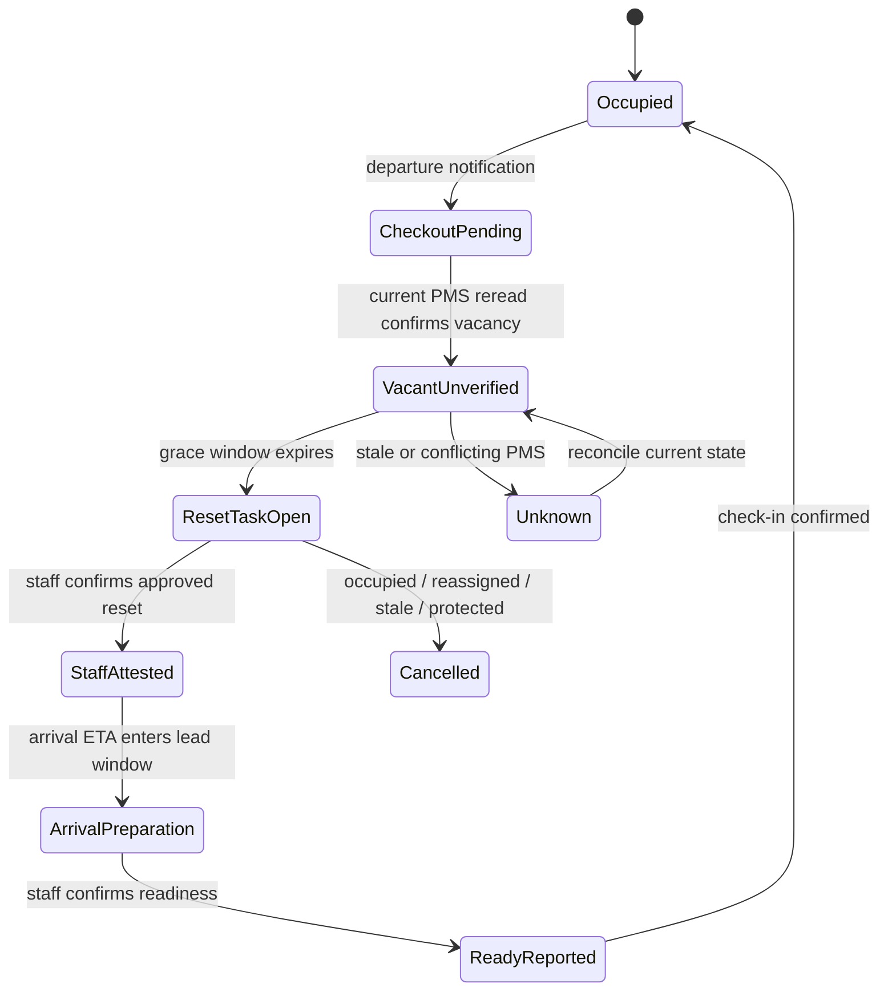
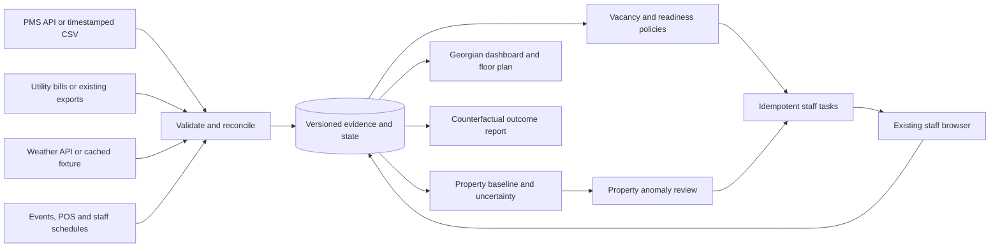

# Challenge 1 — Smart Resources: software-only energy, water and climate optimization

**Research date: 24 September 2026. Geography: Kakheti and regional Georgian hotels. Delivery: research, implementation specification, and an executed offline reference replay. No hotel deployment or realized utility saving is claimed.**

## 1. Decision and evidence boundaries

**[I] Build a vacancy-to-readiness coordination engine with a utility-baseline audit.** Combine PMS room state, arrival forecasts, approved operating schedules, weather, utility invoices and staff acknowledgements. Detect missed room-reset checks immediately; detect unusual property consumption only at the resolution of the existing utility data. Assign inspections and approved operating tasks, re-check occupancy before execution, and measure outcomes against a frozen baseline. The core product works with exports and ordinary staff browsers; it requires no new meters, sensors, gateways, thermostats, controllers, wiring or building equipment.

**[I] The strongest honest promise:** “Find preventable resource waste, get the right person to act, and show whether the hotel's consumption improved.” Software cannot guarantee the elimination of all waste. It cannot infer a specific open window, running air conditioner or leaking tap from monthly bills. A floor-plan overlay can show **modeled exposure and workflow risk**, not measured room energy. Unrented is not synonymous with safe to switch off: cleaning, imminent arrivals, equipment protection and shared systems create legitimate demand.

**[D/VS] Basic software-only hotel utility analytics already exists.** SmartBEA advertises bill uploads, occupancy/weather comparisons and a no-hardware service. That establishes a credible precedent and weakens any claim that a bill dashboard alone is novel. Its outcome claims are vendor marketing, not independent verification of software-only savings. [SmartBEA product page](https://www.sensorflow.co/smartbea/).

**[U] Local commercial validation remains open.** Neither named input dossier establishes property-level utility waste, representative Georgian utility OPEX ratios, actual PMS access or willingness to pay. This investigation adds a historical Georgian feasibility projection, international observed benchmarks, current product documentation, and a tested synthetic replay. It does not turn these into evidence of local realized savings.

### Evidence labels

| Label | Meaning |
|---|---|
| **[D]** | Documented in a linked primary source; **VS** further marks vendor-stated capabilities/outcomes. |
| **[O]** | Directly inspected local artifact or executed calculation/test, with its limitations. |
| **[I]** | Proposed design, assumption, scenario, interpretation or acceptance target. |
| **[U]** | Not established, inaccessible, or awaiting operator evidence. |
| **[USER]** | Organizer-announced text supplied by the user; authoritative project input, not independently retrieved from the organizer. |

**[I] Reading convention:** design sections and code are proposals unless explicitly marked otherwise. Search discovery is not verification. A source's publication date, population and denominator travel with its numbers. No supplier's hardware-assisted saving is counted as a software-only result.

### Inputs and scope

- [Ground-truth research](../../task_research.md): incident evidence, operator discovery, simpler-baseline comparison, and internal engineering gates. Its internal 0–100 framework is explicitly not the GITA rubric.
- [Hospitality technology landscape](../hospitality_tech_landscape.md): fragmented hotel systems, regional integration uncertainty and reconciliation requirements. Its hand-picked website observations are not a representative installed-base survey.
- [Shared GITA 35-point rubric](../../docs/gita_35_rubric.md): the full text supplied by the user during this investigation, preserved separately for reuse across challenges.

## 2. What software can know without installing anything

### 2.1 Capability ladder: admission depends on existing data

**[I] “Zero hardware” means zero product-supplied or newly installed physical devices.** Utility invoices necessarily originate from existing utility measurement. Reading an invoice is permitted; adding a device to obtain better data is outside this project. The baseline has no dependency on an existing BMS. An optional adapter is eligible only if an already accessible API exists and no site installation is needed.

| Mode | Permitted inputs | Defensible output and cadence | Forbidden inference | Action channel |
|---|---|---|---|---|
| A: Bills + PMS export | Dated invoices, occupied-room nights, weather history, room/zone list, existing staff checklist | Monthly normalized consumption/cost; current workflow status only as fresh as latest PMS export | Live electrical anomaly; actual room load; leak localization; indoor temperature | Staff work orders and finance review |
| B: Existing utility interval export/API | A plus existing daily/hourly property consumption | Property residual at that interval, with source latency and uncertainty | Room-specific electrical state; peak demand from monthly kWh | Staff response; finer M&V |
| C: Existing operational APIs | A/B plus PMS webhooks, housekeeping/POS/event data | Near-real-time **workflow** risk, arrival preparation and task cancellation | Actual presence from check-in status; POS receipts as exact appliance load | Staff browser or existing operations API |
| D: Optional existing BMS API | Verified access to existing digital points and allowed writes; no gateway installation | Observed point state and bounded approved control | Setpoint equals actual runtime or measured kWh; unobserved temperature is known | Initially read-only; optional approved writes with readback |

**[I] Data loss causes a capability downgrade.** If hourly exports stop, remove live anomaly claims. If PMS reconciliation expires, display gray “occupancy unknown” and block vacancy actions. Bills-only hotels retain the workflow product and monthly audit. If a prospective customer requires a new gateway for its BMS, decline that integration and remain in staff-task mode.

### 2.2 Observability and identifiability

**[I] A single aggregate equation cannot identify dozens of room loads.** If `E_property = E_rooms + E_kitchen + E_cellar + E_laundry + E_common`, infinitely many component combinations fit the same invoice. Occupancy and weather reduce uncertainty about expected total consumption; they do not make those components independently measured. Correlated predictors, seasonal closures and occupancy-dependent meal service make causal interpretations particularly weak.

| Claim on screen | Allowed evidence | UI wording |
|---|---|---|
| Building used 12,300 kWh | Valid supplier quantity for a specified reading period | “Billed property consumption; 1–31 August; actual-read bill” |
| Expected 11,200 kWh | Versioned weather/occupancy model | “Estimated baseline 11,200; prediction interval …” |
| Room 304 needs attention | Current PMS vacancy + overdue approved reset checklist | “Vacant-room reset unconfirmed” |
| Window closed | Named staff attestation, time and task identity | “Staff reported window closed” |
| HVAC running | Existing API point whose semantics actually represent runtime | “Existing BMS reports fan/compressor running”; identify point |
| Saved 30 kWh | Valid counterfactual evaluation over a reporting period | “Estimated avoided property energy”; uncertainty and method visible |
| Avoided 4 kWh in Room 304 | Assumed unit power and avoided operating hours | “Scenario exposure”; never “measured savings” |

**[I] Staff verification establishes a reported action, not physical proof.** A checked box may be mistaken. Separate `staff_attested_at` from `independently_verified_at`; the latter stays null without appropriate evidence. Use sampled supervisor inspections and anomaly recurrence to find process failures. Do not label a cleaner responsible based on correlation alone. No camera, microphone, motion, location or phone-sensing substitute is introduced.

## 3. Virtual metering and forecasting design

### 3.1 Data contract and quality checks

**[I] Minimum onboarding:** room and zone IDs; building area; rooms served by each heating/cooling system; protected cellar/kitchen/server areas; usual arrival/departure windows; cleaning shifts; 12–24 months of utility quantities and charges where available; occupied-room nights and guest nights for matching periods; holidays, weddings, tastings and harvest-season operations; and approved operating limits. The actual data sufficiency decision depends on independent variation and model complexity, not just a month count.

| Source | Fields | Validation and failure handling |
|---|---|---|
| Utility invoice | Account alias, reading start/end, kWh or m³, actual/estimated reading, currency, energy/demand/fixed/tax components, source hash | Reject duplicate overlapping consumption; distinguish amended bills; reviewed OCR quantities must reconcile to original; credits remain monetary adjustments unless quantity corrected |
| Existing interval data | UTC interval start/end, quantity, unit, meter/account alias, quality, fetched time | Detect gaps, duplicates, reset/rollover in cumulative exports, negative deltas, unit changes and inconsistent totals; no zero-fill of missing consumption |
| PMS | Room ID, reservation-state version, assignment, actual checkout, arrival ETA, reconciliation time | Deduplicate event ID; reread current record; handle room moves, extensions, no-shows, day use, cancellations and out-of-order delivery |
| Staff workflow | Task ID, room-state version, due time, actor, reported action, exception | Do not infer completion from room-clean status; preserve separate HVAC/window checklist fields |
| Weather | Location/elevation, provider/model, issued time, valid time, temperature, optionally radiation/wind | Store historical observations/reanalysis separately from forecast vintages; units and time zone explicit; stale forecasts cannot silently masquerade as fresh |
| Hotel operating context | Meal covers, event hours, pool/spa opening schedule, laundry kg/batches, winery production | Optional predictive inputs; missing context lowers confidence rather than inventing measurements |
| Tariff | Effective range, supplier/contract class, unit rates, blocks/time bands, tax treatment, fixed/demand charges | User-approved bill/contract mapping; no household rate assumed for a hotel; effective dates cannot overlap |

**[I] Align predictors to invoice reading intervals, not calendar months by convenience.** Aggregate daily weather and occupancy across the exact interval. UTC is the storage convention; display and tariff-calendar evaluation use `Asia/Tbilisi`. Preserve the PMS business date separately from wall-clock time. Require an explicit mapping of the meter boundary: resort-only versus resort-plus-winery versus tenant restaurant. A shared bill cannot support a hotel-only efficiency conclusion without a justified allocation.

### 3.2 Explainable aggregate baseline

**[I] Start with a regularized, constrained change-point regression rather than a large neural model:**

```text
E_t [kWh] = b0 * days_t
            + b_occ * occupied_room_nights_t
            + b_heat * HDD_t(T_heat)
            + b_cool * CDD_t(T_cool)
            + b_meals * meal_covers_t
            + b_event * event_hours_t
            + b_laundry * laundry_kg_t
            + seasonal/calendar terms + error_t
HDD_t = sum_days max(T_heat - mean_outdoor_C, 0)
CDD_t = sum_days max(mean_outdoor_C - T_cool, 0)
```

**[I] Select balance temperatures and regularization only on training folds.** Drop unsupported terms for sparse data; do not fit eight predictors to twelve bills and report training R² as proof. Compare an intercept/occupied-night model and last-year seasonal baseline. Use forward time validation, calibration intervals, residual plots and out-of-range flags. Separate gas and electricity models; do not add m³ gas to kWh. Convert only with an explicit documented factor appropriate to the account.

**[D] CalTRACK provides a reproducible precedent for site-level avoided-energy estimates from meter and weather data, with billing, daily and hourly methods. Its output is whole-building savings; attribution to a specific intervention is outside its stated scope.** [CalTRACK Methods v2.0](https://docs.caltrack.org/en/latest/methods.html). **[I] Our occupancy/POS extensions are custom hotel modeling, not a claim of CalTRACK conformance.** Pin the implementation and run the method's actual qualification checks before using that label.

**[I] Residual alert:** `r_t = measured_E_t − predicted_E_t`. Flag only if the interval is valid, the model is qualified for that operating regime, and excess exceeds both the calibrated upper prediction bound and an operator-approved materiality threshold. For high-frequency data require persistence across several intervals; for a monthly bill raise one finance/engineering review, not thirty daily alarms. Use a false-discovery policy and daily task cap across multiple rooms/properties. Negative residuals are possible and must remain visible.

**[I] Split reasons for overspend:** quantity change, rate change, fixed-charge change, demand-charge change, and unexplained bill components. A higher bill at unchanged kWh is not evidence that staff wasted more energy. Monthly kWh cannot identify a peak kW demand charge; use a billed peak or eligible interval series. Under a flat tariff, shifting the same kWh to night does not produce energy-charge savings.

### 3.3 Virtual allocation, without false precision

**[I] Optional room-level allocation:** partition a modeled guest-room component with transparent weights such as floor area, exterior exposure, occupancy and expected conditioning hours. Normalize the weights to that component, preserve an explicit unallocated/common-load remainder, and show low/base/high scenarios. Estimates should reconcile algebraically to the chosen aggregate allocation; this is accounting consistency, not validation of their accuracy. With insufficient information, show room risks without kWh labels.

**[I] Example:** “Room 304 has six avoidable scheduled hours under policy K-7; assumed average electrical draw 0.6 kW yields 3.6 kWh of scenario exposure.” The power is an operator-approved assumption, not extracted from a monthly bill. Two alerts sharing a heating circuit cannot each claim the full circuit saving. Do not distribute a 120 kWh property residual across vacant rooms as if their guilt were established.

### 3.4 Thermal inertia and arrival readiness

**[I] For planning, use a deliberately low-order thermal model:**

```text
C [kWh/K] * dT_in/dt [K/h] =
    (T_out - T_in) / R [K/kW]
    + Q_solar + Q_internal + Q_HVAC [kW]
tau [h] = R * C
```

**[I] R, C, solar gain and equipment capacity come from building descriptions/manuals and conservative ranges; they cannot all be identified from one aggregate bill.** Without observed indoor temperature, maintain a range of possible initial temperatures and simulate pessimistic recovery times. Calculate preparation lead time from the slowest plausible case plus an approved margin. If the uncertainty is too broad, fall back to the hotel's fixed preparation schedule and staff confirmation. Do not promise closed-loop comfort control.

**[D] EnergyPlus is an established software simulation precedent using heat-balance models and coupled zone/HVAC behavior.** [EnergyPlus](https://energyplus.net/). **[I] Detailed geometry, fabric and system inputs make a calibrated digital twin inappropriate for the core hackathon dependency.** A floor plan supplies room mapping and rough geometry; it does not reveal insulation, air leakage, actual window position, indoor humidity or HVAC capacity. Rich simulation is a later validation option, not required to run the product.

**[I] Kakheti policies:** protect wine storage, fermentation/process zones, occupied rooms, booked tasting spaces, food storage and system minimum conditions. Keep guest preference and room assignment constraints above energy optimization. Never move a guest to save energy without permitted operational approval. Group future vacant-wing preparation tasks only where a real shared system and feasible staffing make that useful. Do not treat central plant energy as linear in room count.

## 4. Staff protocols and water waste

### 4.1 Vacancy-to-readiness state machine

**[I] The policy engine, not an LLM, decides whether an action is allowed.**



**[I] Suggested task:** “Room 304: checkout confirmed, next arrival tomorrow, reset checklist overdue. Check window closure and apply approved vacant-room settings; report exceptions.” Do not send “cleaner left HVAC on” unless an actual observation supports it. A 15-minute freshness TTL and two-hour arrival lead are demo values, not universal operating policy. A room serviced by staff remains operationally in use; staff may defer a reset until work is complete.

**[I] Execution gate:** authenticate space and actor; load the latest room state and task version; verify freshness, vacancy, arrival lead, protected-zone rules and cleaning activity; confirm the action remains in scope; append an audit entry; then deliver the task. Immediately before an optional BMS write, repeat the checks. A PMS event can change between checks and physical execution; staff must check current room status before entry, and the system must issue cancellation/preparation tasks on changed state. No software transaction can atomically lock both a guest's arrival and external equipment.

**[I] Record four distinct outcomes:** no issue found, reset performed, unable to act, and data wrong. Measure confirmed issue yield, tasks per shift, time spent, overdue duration and repeat incidents. Sampling a supervisor's verification helps assess attestation reliability without installing surveillance. A failed reset task escalates to a named operations owner; a comfort complaint cancels energy-first scheduling for that room until reviewed.

### 4.2 Water: useful screening without imaginary leak detection

**[D] The Hotel Water Measurement Initiative supplies a hotel-specific method and tool for property water reporting per occupied room per day and meeting-space area-hour.** [HWMI](https://sustainablehospitalityalliance.org/resource/hotel-water-measurement-initiative/). **[I] Such normalized metrics are useful comparisons, but dividing by occupied rooms does not remove all base load, restaurant, pool, laundry or landscaping effects.** Report absolute m³ and available-room-day intensity alongside occupancy-normalized figures; define zero-occupancy behavior as “not applicable,” never division by zero.

**[I] Water baseline:** model `m³/day = base + guest_nights*coefficient + laundry_kg*coefficient + meal_covers*coefficient + event/pool/irrigation terms` only where data exists. Track supplied water, sewer billing, purchased water and shared winery use separately. Daily/night-flow anomalies are possible only if an existing export actually provides that resolution; monthly invoices support monthly exception review. A night residual could reflect laundry, pool makeup or an unlogged event, not necessarily leakage.

| Software intervention | Existing inputs | Proposed operation | Verification boundary |
|---|---|---|---|
| Unexpected water increase | Invoice or existing daily export; guest nights; events | Assign property inspection and bill review | Cannot name a leaking room from the aggregate |
| Repeated running-tap reports | Staff/guest reports with room ID | Deduplicate and escalate a maintenance task | Repair completion is staff-reported; savings not inferred from ticket closure |
| Linen/towel service coordination | Guest opt-in preferences, housekeeping schedule | Avoid unnecessary scheduled replacement while honoring service commitments | Count cycles actually skipped; no assumed universal liters per cycle |
| Laundry batching | Existing laundry schedule and batch records | Combine compatible loads within capacity/linen availability | Compare logged batches and aggregate utility trend; avoid increasing service delays |
| Pool/spa/irrigation schedule discrepancy | Approved schedule, event calendar, weather | Ask responsible staff to review operation | Never disable hygiene, treatment, required circulation or safety procedures |
| Wrong billing class/duplicate invoice | Contract, invoice line items | Finance exception with exact source evidence | Recovered credit is a financial correction, not physical water saved |

**[I] Software schedules and documentation are in scope; replacement fixtures, pipe works and new equipment are not proposed deliverables.** If an inspection reveals a physical fault, route it through the hotel's existing maintenance process and do not claim that the software itself repaired it. Water-treatment, food-safety and freeze-protection settings are outside automated optimization. The system uses the operator's qualified, approved procedures without inventing new temperature or sanitation advice.

## 5. Financial evidence and measurable ROI

### 5.1 What is known about utility cost share

| Evidence | Exact population/period/denominator | Usable conclusion | Transfer limitation |
|---|---|---|---|
| **[D] CBRE, 1 April 2024** | US sample: 4,072 hotels in 2019–22; preliminary 2,000 in 2023; utilities estimated at 3.3% of **total revenue** in 2023, versus 2.9% in 2019 | A measured industry research program shows utilities matter financially | Not a Georgian sample; revenue is not OPEX; 2023 estimate is not 2026 tariff evidence |
| **[D/O] Gonio Resort business plan, May 2015** | Proposed 150-room Georgian resort; forecast stabilized 2022 utilities $1,494 per available room/year and 4.0% of revenue | A locally relevant planning reference with explicit assumptions | Forecast, not operating results; Adjara, not Kakheti; old prices and proposed property |
| **[U] Contemporary Georgian regional hotel utility/OPEX ratio** | No verified representative dataset established | Report unknown and request actual chart-of-accounts data | Do not substitute US Georgia data, residential bills, foreign resorts or general travel receipts |

Sources: [CBRE utility-cost study](https://www.cbre.com/insights/briefs/gaining-control-of-utility-costs); [Gonio Resort Development business plan, PDF](https://www.enterprisegeorgia.gov.ge/uploads/files/publications/5b4dda1004746-2.pdf), PDF pages 185 and 187, printed C55 and C57. **[O] The latter was downloaded, text-extracted, and its C33 table visually inspected.**

**[O] Denominator reconstruction from the Gonio forecast:** 2022 utility 224 divided by departmental expenses 1,990 plus undistributed expenses 981 gives **7.54% of that defined operating-expense subtotal**. Including management fees 168 gives **7.14%**. The table's monetary totals share a scale, so it cancels in the ratio. These are calculations from a hypothetical forecast, not observed “typical Georgian OPEX.” Rounding in the source prevents excessive precision. [Gonio plan, Exhibit C33](https://www.enterprisegeorgia.gov.ge/uploads/files/publications/5b4dda1004746-2.pdf).

**[I] General denominator identity:** `utilities/OPEX = (utilities/revenue)/(OPEX/revenue)`. A hypothetical utility/revenue share of 4% and an OPEX/revenue share of 60% imply 6.67% utilities/OPEX. Never place a published revenue percentage beneath an OPEX heading without converting it with a matched expense denominator.

**[I] Local measurement template:** collect the same twelve months of electricity, gas/fuel, water/sewer, total operating expenses and revenue; define treatment of VAT, management fees, rent, depreciation, outsourced laundry and winery costs; reconcile invoices to ledger; retain monthly and annual ratios. Separate ordinary operating expenses from financing and capital expenditure. Analyze comparable cohorts by amenities and season rather than calling one resort “the Georgian average.”

### 5.2 Evidence for savings, and what 15–25% means

**[D] Berkeley Lab's 2016–2020 Smart Energy Analytics Campaign covered 104 organizations and 6,500 commercial buildings. It reported median annual energy savings of 3% for energy information systems and 9% for fault detection/diagnostics, and a two-year simple payback.** This is evidence for analytics plus operational action, not a controlled trial of bills-only software at Georgian hotels. Monitoring-based commissioning and existing building data are material dependencies. [Berkeley Lab, October 2020 report](https://bies.lbl.gov/publications/proving-business-case-building).

**[I] The requested 15–25% reduction is a test hypothesis for the energy spent conditioning eligible unrented rooms, not an established whole-hotel saving.** Translate it using explicit fractions:

```text
whole-property electricity saving fraction
  = HVAC share of electricity
    * eligible vacant-room-conditioning share of HVAC electricity
    * achieved reduction in that component
  = 0.45 * 0.30 * 0.20 = 0.027 = 2.7%  [assumed example]
```

**[I] Vacancy share here is a share of HVAC energy, not room occupancy.** Recovery energy, weather, shared systems, staff compliance and protected areas can reduce the net effect. No evidence inspected establishes the 15–25% result specifically for this software-only intervention. Vendor percentages for hardware control and total operational-cost reductions cannot validate that hypothesis. Model uncertainty may exceed the expected 2.7% signal in a small property.

### 5.3 Transparent GEL business case

**[I] Synthetic 40-room Kakheti resort scenario; all monetary and engineering inputs below are assumptions.** The model is not a tariff quotation, vendor offer or measured hotel financial statement. Use a signed tariff/invoice before a live case. The [GNERC electricity tariff entry point](https://gnerc.org/en/tariffs/tariff-el-energy) was discovered, but a current applicable commercial rate for a specific hotel was not verified; no numerical rate is imported from it.

| Monthly input | Assumption |
|---|---:|
| Electricity spend | 15,000 GEL |
| Water/sewer spend | 3,000 GEL |
| HVAC share of electricity | 45% |
| Eligible vacant conditioning share of HVAC electricity | 30% |
| Reduction tested on that component | 15%, 20%, 25% |
| Separate water savings hypothesis | 2% = 60 GEL |
| Software fee | 180 GEL |
| Allocated hosting/weather/integration cost | 40 GEL |
| Additional staff/verification cost | 100 GEL |
| Total monthly incremental cost | 320 GEL |
| One-time onboarding/setup | 1,200 GEL |

| Scenario | Electricity benefit | Water benefit | Gross monthly benefit | Net monthly benefit | Simple payback |
|---|---:|---:|---:|---:|---:|
| 15% component reduction | 303.75 | 60 | 363.75 | 43.75 | 27.43 months |
| 20% component reduction | 405.00 | 60 | 465.00 | 145.00 | 8.28 months |
| 25% component reduction | 506.25 | 60 | 566.25 | 246.25 | 4.87 months |

**[O] These calculations are reproduced by the tested reference program.** Base-case annual net benefit before setup is 1,740 GEL; after setup, first-year cash benefit is 540 GEL. Gross benefit is 2.58% of the assumed combined 18,000 GEL utility spend, not 20%. If only half the modeled electricity benefit materializes, keeping the 60 GEL water hypothesis yields `202.5 + 60 − 320 = −57.5 GEL/month`: there is no payback. If water savings are unproven and excluded, base-case net becomes 85 GEL/month and payback 14.12 months.

**[I] Formula:** `net = avoided quantities valued at applicable marginal rates + independently supported bill credits − recurring incremental costs`. `payback = setup/net` only if `net > 0`; otherwise show “no payback.” Keep recoverable billing errors, labor time freed and physical resource savings in separate ledgers. Do not count saved staff minutes as payroll savings unless they reduce paid cost or demonstrably enable a valuable alternative. Do not charge the same infrastructure allocation twice if the subscription already includes it.

**[I] Break-even small-hotel test:** at the base fractions, electricity benefit is 2.7% of electricity spend. With zero water benefit and 320 GEL recurring cost, electricity spend must exceed about **11,852 GEL/month** for positive recurring net benefit. Lower-cost hotels need a cheaper pooled service, materially better intervention yield or a broader operational benefit. This is why a low monthly bill can make a technically successful product commercially unattractive.

### 5.4 Measurement and verification plan

1. **[I] Freeze the boundary and baseline before intervention.** Save data hashes, quality exclusions, model version, operating variables, tariff version and selected comparison periods. Obtain a complete seasonal history where possible; use shadow-mode results to assess detectable effect size.
2. **[I] Separate behavior from consumption.** Track checklists completed within SLA, minutes of unconfirmed vacancy, false-alert yield and labor time immediately. These are observable process outcomes; they are not utility savings.
3. **[I] Use an eligible comparison.** Prefer staggered rollout across comparable properties or a carefully designed property-level switchback when operationally safe. Shared HVAC makes room-level randomization and room-level savings attribution unreliable. Account for staff learning, thermal carryover and spillover.
4. **[I] Estimate reporting-period avoided consumption:** `sum(frozen_model(reporting_weather, reporting_occupancy, exogenous_context) − actual_consumption)`. Do not condition away the intervention itself: if reduced unnecessary laundry is the mechanism, using the reduced laundry count as a baseline adjustment can erase its effect. Predefine which variables are exogenous and which are outcomes.
5. **[I] Quantify uncertainty with time dependence.** Use blocked residual resampling or a validated temporal interval method; document coverage on holdout data. If the interval includes zero, report inconclusive savings. Do not set negative savings to zero in the M&V ledger.
6. **[I] Value quantities separately from prices.** Show constant-tariff efficiency benefit and actual-bill benefit. Include reheating/recooling rebound, new amenities, events, winery production, outages and unusual closures. Log non-routine adjustments with an approver.
7. **[I] Verify persistence and guest experience.** Monitor complaints, readiness delays, task burden and recurrence across seasons. Re-baseline after material building changes, with a new version and an explicit break in the savings series.

## 6. Competitive teardown: borrow methods, prove a distinct workflow

**[I] This is a documentation-based comparison, not a hands-on product test.** Public material establishes advertised scope; absence of a feature in it is not proof that the vendor lacks the feature. All deployment and pricing claims require property-specific confirmation. Keep existing commercial products as research precedents; build and demonstrate a new hackathon artifact as required by the supplied rules.

| Product / engine | What the reviewed primary source supports | Hardware boundary | What we should borrow | Gap to test in a vendor demo / our proposed distinction |
|---|---|---|---|---|
| **Ynance hotel energy management** | VS: expected consumption from occupancy/weather, bill component analysis, occupancy-report upload, rate structure and demand-charge awareness | Bill/export-first capability is compatible with baseline scope | Explicit quantity-versus-price separation; source bill traceability | Does it cancel a room-reset task on a PMS extension and retain staff evidence? Public page does not establish that workflow |
| **SmartBEA** | VS: hotel utilities benchmarking with bills, occupancy, weather and other factors; monthly uploads; advertised no-hardware service | Analytics qualifies; other products in the same portfolio involve retrofits and must not be conflated | Low-friction data intake and cross-utility overview | Test Georgian UI, uncertainty display and closed-loop staff work; advertised operational savings do not prove causal benefit |
| **ENERGY STAR Portfolio Manager** | Bill/building-data benchmarking; comparisons and weather/operating normalization; water tracking | Compatible with existing records | Transparent property boundary and normalization | Reference tool, not a demonstrated room-task runtime; US/Canada scores do not establish Georgian percentile performance |
| **RETScreen Expert** | Government-developed planning, financial feasibility and performance analysis; climate databases; viewer and professional modes | Software analysis does not require a new device | Scenario analysis and economic feasibility before rollout | Analyst-oriented modeling; a PMS-to-shift-workflow integration is not established by the reviewed overview |
| **BrainBox AI Cloud BMS / AI Control** | VS: centralized existing building infrastructure, scheduling, setpoint/workflow capabilities | **Conditional comparator only.** Supplier terms include on-site edge gateways/equipment; do not classify all deployments as zero hardware | Bounded control, observable command outcomes and operator workflow | Require written confirmation that a proposed installation uses only an already accessible API; reject any new edge device in this challenge |
| **CalTRACK** | Open measurement methods, not a hotel operations SaaS | Uses existing meter/weather datasets | Reproducible site-level counterfactual methodology | Custom occupancy/event extensions need their own validation; does not supply task orchestration |
| **HWMI** | Hotel-specific water accounting/reporting methodology | Existing property records | Consistent water reporting units and scope | Does not independently identify leaks or perform repairs |

Primary sources: [Ynance](https://www.ynancelabs.com/energy-management); [SmartBEA](https://www.sensorflow.co/smartbea/); [Portfolio Manager](https://www.energystar.gov/buildings/benchmark); [RETScreen](https://natural-resources.canada.ca/maps-tools-publications/tools-applications/retscreen); [BrainBox AI Cloud BMS announcement](https://brainboxai.com/en/newsroom/brainbox-ais-cloud-building-management-system-and-award-winning-ai-agent-aria-unite-at-ahr-2025), [supplier equipment terms](https://brainboxai.com/en/ssa-parts-ii-iii-iv); [CalTRACK](https://docs.caltrack.org/en/latest/methods.html); [HWMI](https://sustainablehospitalityalliance.org/resource/hotel-water-measurement-initiative/).

**[I] Competitive acceptance script:** give each candidate the same amended invoice, flat tariff, early check-in, stale PMS feed, shared cellar meter and unconfirmed window checklist. Ask it to explain the evidence, abstain where room load is unknown, cancel unsafe work, and reconcile the outcome. Compare setup labor and recurring cost with a spreadsheet and a scheduled checklist. This is a stronger test than comparing marketing claims about AI.

**[I] Product edge to earn:** a Georgian-language, PMS-aware vacancy/readiness workflow with event reconciliation, explicit uncertainty and audit-ready outcomes. No claim of unique patentable algorithms is made. If a basic departure checklist solves the incident with equal reliability and lower cost, use it; do not add agents merely to create the appearance of complexity.

## 7. Executable product architecture

### 7.1 MVP scope and integration approach

**[I] The MVP has five services/modules, deployable in one application plus a background worker:** ingestion and reconciliation, baseline evaluation, deterministic policy/task engine, evidence store, and Georgian/English operator UI. PostgreSQL or a local demo database persists events and state; an outbox delivers tasks to existing operations software. A simple in-memory replay is included in Appendix A to make core behavior reproducible without infrastructure.



**[I] Core integrations are read-only for PMS and utility data.** Task writes affect the operations queue, not guest reservations or financial records. The optional BMS adapter is absent from the baseline deployment. If enabled later, credentials remain server-side, allowed endpoints and point IDs are explicit, command limits are policy-bound, and timeouts trigger reconciliation rather than blind repeated writes. Never bypass local equipment protections.

**[D] Cloudbeds documents event notifications and scoped webhook subscriptions that can trigger a subsequent API fetch.** This supports an event-plus-reread adapter pattern, not guaranteed access for this project. [Cloudbeds webhook documentation](https://developers.cloudbeds.com/docs/webhooks-1). **[I] The locally relevant PMS mix makes a canonical CSV adapter essential.** Exely and other PMS adapters should be selected after the hotel's actual export/access is checked. Do not describe Exely, Poster or FINA as implemented integrations merely because they appear in the rubric. For POS, use aggregate meal covers/event totals if available; receipt values are not energy measurements. Channel-manager reservations do not override actual PMS room status.

**[D] Open-Meteo documents forecast variables/time-zone options and separates evaluation access from commercial licensing.** Its current pricing page states the open-access service is non-commercial; commercial use requires the appropriate arrangement, with attribution obligations. [Forecast API](https://open-meteo.com/en/docs), [pricing and licensing](https://open-meteo.com/en/pricing). **[I] Cache property-level responses server-side, never one request per room.** Keep issue and valid timestamps, provider attribution and a last-known-good fallback. Production weather costs belong in the unit economics. Forecast microclimate error near hills and vineyards remains a model uncertainty.

### 7.2 Persistence specification

**[I] The following is an implementation data model, not a claim that a production database was deployed for this research task.** All primary/foreign keys include `space_id`; application authorization derives tenant identity from the authenticated session. Enforce tenant isolation in the database as well as the API, and test access through the real non-owner application role.

| Entity | Essential fields and constraints |
|---|---|
| `resource_zones` | `(space_id, zone_id)`, room IDs, floor polygon, building/system group, area, protected flag, source revision; geometry manually confirmed |
| `utility_accounts` | Account alias, resource type, unit, property boundary, tariff ID; avoid exposing account numbers in general UI |
| `utility_periods` | Account + start/end + revision; quantity, reading quality, source hash, imported time; active revisions do not double-count overlapping periods |
| `pms_room_state` | Room ID, canonical status, source version, occurred/reconciled times, arrival ETA, assigned reservation alias; latest state selected deterministically |
| `weather_runs` | Provider/model/location, issued/valid time, units, values, response hash; forecasts and historical weather distinct |
| `baseline_models` | Version, training/calibration periods, feature spec, coefficients, diagnostics, allowed operating range, immutable training hash |
| `resource_policies` | Version, effective range, approver, zone scope, freshness TTL, grace/arrival lead, operational exclusions; drafts cannot issue tasks |
| `resource_alerts` | Evidence class, resource/scope, model/policy versions, input revision IDs, threshold, observed/expected values, uncertainty, status |
| `resource_tasks` | Unique `(space_id, room_id, room_state_version, policy_version, task_type)`; owner, due time, expected version, lifecycle, cancellation cause |
| `resource_attestations` | Append-only actor/time/task-version/report; no automatic promotion to independent verification |
| `resource_outbox` | Event ID, payload, created time, attempts, next attempt, delivered time; retries idempotent at receiver |
| `resource_mv_reports` | Frozen baseline and reporting periods, approved adjustments, signed result, interval, tariffs and costs; negative/inconclusive outcomes retained |

**[I] Transactions:** insert a new alert, task and outbox entry together; never create a task without its evidence record. Use optimistic state-version checks when acknowledging or changing work. Task cancellation is an explicit event, not deletion. Reconciliation checks both source state and outbox delivery. Identical transport retries deduplicate, but a fresh operational episode receives a new task identity. Keep a current-open-episode constraint so cosmetic PMS version changes do not flood staff with tasks.

**[I] Retention:** propose 24 months of de-identified consumption/model history for seasonality, 90 days of raw operational payloads and a configurable audit retention agreed with the operator. Guest names, messages, payment data and contact information are unnecessary for this product. Preserve only room/stay aliases and operational preferences essential to readiness. Logs must not contain integration secrets; source document hashes demonstrate byte consistency, not truth or operator approval by themselves.

### 7.3 Concrete internal API examples

**[I] These are new internal contracts for this challenge, not modifications to locked contracts of other apps.** An adapter must validate and map them into the existing operations API before production use. No claim of exact App 3 schema compatibility is made here.

`POST /v1/resource-events` accepts a canonical event from an authenticated tenant adapter. Use an idempotency key and resolve the space from authentication; a conflicting body `space_id` is rejected. The production validator rejects unknown fields, invalid timestamps, unsupported units and missing provenance.

```json
{
  "schema_version": "1.0",
  "event_id": "pms-demo-304-42",
  "space_id": "demo-kakheti",
  "type": "room_state_reconciled",
  "room_id": "304",
  "source_version": "42",
  "status": "VACANT",
  "occurred_at": "2026-09-24T07:00:00Z",
  "reconciled_at": "2026-09-24T07:01:00Z",
  "next_arrival_at": "2026-09-25T11:00:00Z",
  "source": {"kind": "pms_simulator", "synthetic": true}
}
```

`GET /v1/resource-alerts` returns typed evidence. A room workflow alert deliberately has no measured room kWh:

```json
{
  "schema_version": "1.0",
  "space_id": "demo-kakheti",
  "alert_id": "reset-304-42",
  "kind": "RESET_CHECK_OVERDUE",
  "scope": {"type": "room", "id": "304"},
  "evidence_class": "WORKFLOW_RISK",
  "observed_hvac_state": null,
  "observed_window_state": null,
  "measured_room_kwh": null,
  "verified_savings_kwh": null,
  "state_version": "42",
  "policy_version": "kakheti-reset-7",
  "action": "VERIFY_VACANT_ROOM",
  "message_ka": "ოთახის მომზადების შემოწმება საჭიროა",
  "message_en": "Vacant-room reset check required",
  "synthetic": true
}
```

A **separate property anomaly** carries `measurement_scope=property`, `period_start/end`, `source_quality`, `observed_quantity`, `expected_quantity`, `prediction_interval`, `resource`, `unit`, `model_version` and `source_hash`. It must never inherit a room scope merely because it is displayed beside the floor plan. An estimate-only response cannot populate fields reserved for measured values.

**[I] `POST /v1/resource-tasks/{id}/attest`:** require current expected version, named authenticated actor, reported action fields and timestamp. Response is `STAFF_ATTESTED`, `409 STATE_CHANGED`, `409 TASK_CANCELLED` or a validation/authentication error. Return `INDEPENDENT_VERIFICATION_PENDING` when appropriate; ticket closure is not a savings certificate. Resource IDs in URLs require tenant authorization just like list endpoints.

### 7.4 Failure modes and controls

| Failure | Response | Demonstrable acceptance condition |
|---|---|---|
| PMS feed stale | Block vacancy recommendations; gray room | No new vacancy task after freshness expiry |
| Guest checks in early | Cancel/deactivate pending reset; prioritize readiness | An old task cannot be acknowledged as current |
| Task worker receives duplicate | Unique episode key/outbox receiver dedup | Exactly one open task per episode |
| Invoice OCR misreads decimal | Quality review; retain original image/text | Unreviewed quantity excluded from baseline |
| Weather forecast unavailable | Show cached age; use approved fixed schedule | No invented weather or confidence |
| High consumption due to wedding | Include event evidence and widen/reassess model | No automatic blame of vacant rooms |
| Estimated bill later corrected | Version and supersede; recompute affected reports | No duplicate usage or silent historic mutation |
| Existing BMS write times out | Query state before retry; reconcile | No repeated command without state assessment |
| Shared cellar and room circuit | Protected-system override | Room vacancy cannot disable cellar conditioning |
| Cost savings below model error | Report inconclusive | No positive “verified savings” badge |
| Staff rejects repeated low-value alerts | Review thresholds and bundle inspections | Task cap and false-positive metrics visible |
| Cross-tenant task or source request | Deny before retrieval or execution | Separate-tenant negative test passes |

**[I] Production SLO proposals:** alert evaluation p95 under two seconds after a reconciled event for a small property; reconciliation lag below five minutes where source access supports it; source staleness displayed at all times; no vacancy action on stale/unknown data. These are targets, not measured deployment performance. Auth, durable storage, retries, database tenant policies and live adapter behavior are release gates beyond the reference replay.

## 8. Hackathon prototype and the 10-point live demo

### 8.1 Demo experience

**[I] One synthetic Kakheti wine resort, 40 rooms, a protected cellar and tasting/event zone.** Use a manually annotated SVG or simple coordinate map imported from a supplied floor plan. A user must confirm room-to-PMS mapping; do not claim automatic construction of a calibrated twin. The reference replay below uses labeled room tiles as a minimal diagram; floor-plan upload and polygon editing remain specified UI work.

**[I] Screen design:** top row shows data mode, last PMS reconciliation, last bill/interval and weather age. The floor plan separates a workflow-risk overlay from the property energy chart. Amber means reset check needed; gray means insufficient state; protected zones carry a lock label; a staff-reported completion has an explicit text label. Green never means “energy measured as efficient.” Accessible text accompanies every color. Selecting a room opens the evidence, next arrival, task owner and permissible next action. Georgian is the default interface; English is a switch, not the sole working language.

**[I] Three numbers remain separate:** estimated opportunity, staff-confirmed actions, and statistically estimated avoided property consumption. A synthetic replay is marked on every screen. The product must not show a real-time cumulative “GEL saved” counter driven only by ticket completion. It can show the changing cost scenario and the staff minutes actually logged in the demo.

### 8.2 Ten live demonstration checkpoints

**[USER] Prototype is worth up to 10 of 35 points; this is the supplied rubric's largest single category.** The ten checkpoints below are our rehearsal checklist, not ten official sub-points or a guaranteed score. Appendix A already implements a subset of this flow and identifies the rest honestly.

| Step | Presenter action | Visible proof | Failure/claim boundary |
|---|---|---|---|
| 1 | Load Kakheti layout and canonical PMS snapshot | Matched room IDs, protected cellar, timestamp and synthetic label | Reject unmapped rooms; layout has no claimed thermal measurements |
| 2 | Load baseline bills, occupancy and cached weather | Units, dates, model fit/holdout and exact sources | Show one rejected/estimated bill; no hidden zero-fill |
| 3 | Replay checkout for Room 304 | Vacancy recorded; overdue reset becomes amber | HVAC/window actual state remains unknown |
| 4 | Replay duplicate and older events | One task; audit explains deduplication | No duplicate staff work |
| 5 | Raise aggregate consumption 120 kWh above baseline | Property “Ghost Energy” investigation banner | No attribution of that residual to Room 304 |
| 6 | Replay staff attestation | Actor and time logged; task changes status | “Reported reset,” with verified savings still null |
| 7 | Replay early check-in while another reset is pending | Task cancelled; arrival readiness shown | Old acknowledgement rejected |
| 8 | Disconnect PMS and utility inputs | Gray state/data gap; cancellation or hold behavior | No inference of zero consumption or safe vacancy |
| 9 | Change weather, arrival ETA and tariff scenario | Lead-time recommendation and ROI sensitivity update | No savings from equal-kWh time shifting on a flat rate |
| 10 | Export evidence and switch Georgian/English labels | Reproducible input hash, audit, task state and cost assumptions | No unsupported “15–25% whole-hotel savings” claim |

**[I] Suggested five-minute presentation:** 30 seconds problem and evidence; 150 seconds live replay, including early-arrival and outage cases; 45 seconds financial sensitivity; 45 seconds pilot/customer plan; 30 seconds limitations and ask. Keep a cached offline replay and a short recording of the exact tested build. The rehearsal duration is a team choice, not a verified organizer time limit.

### 8.3 Realistic build sequence

**[I] Within the local project's 115-hour engineering constraint, prioritize a complete vertical slice.** The rubric itself does not specify that duration. If the event permits less build time, cut optional features rather than claiming they are implemented.

| Time allocation | Deliverable | Exit evidence |
|---|---|---|
| 0–10 h | Confirm property incident, export fields, approved protocols, source/tariff boundaries | Redacted artifact or clearly labeled fixture; operator owner |
| 10–28 h | Canonical imports, event dedup, durable state, Georgian task labels | Replay checkout/extension and one quality error |
| 28–48 h | Qualified simple baseline and opportunity/ROI calculation | Forward holdout; negative/inconclusive outcomes supported |
| 48–70 h | Floor-plan mapping, task acknowledgment, evidence panel | End-to-end state transition in UI |
| 70–88 h | Outages, authorization, cancellation, reconciliation and audit export | Negative tests and restart/replay tests |
| 88–100 h | Optional live PMS read adapter if authorized; otherwise improve CSV onboarding | Exact implemented scope documented |
| 100–115 h | Georgian operator review, pilot walkthrough, pitch rehearsal and backup | Reproducible build, truthful demo and signed-off claims |

**[I] Exclude from the core sprint:** device installation, autonomous equipment discovery, complex building simulation, multi-property training on private data, arbitrary BMS writes, computer vision of occupancy, speculative emissions claims and broad PMS replacement. An optional LLM can explain evidence or translate drafted text, but cannot create measurements, decide safety gates or calculate the authoritative bill. The replay needs no model API at all.

## 9. Commercialization and pilot readiness

### 9.1 Buyer and segment

**[I] Initial buyer hypothesis:** owner/GM of a seasonal regional hotel with sufficiently high utility spend, at least one recurring vacancy/readiness coordination failure, and staff able to execute existing approved controls. Operations/housekeeping is the daily user; finance supplies invoices; engineering approves constraints. Kakheti wine resorts require explicit separation of rooms, cellar, kitchen, events and winery production. A tiny guesthouse with low spend and one operator may be better served by a checklist and spreadsheet.

**[I] Revenue options:** property subscription plus one-time onboarding, or inclusion in a broader hotel operations subscription. Price against conservative net benefit and operator willingness to pay, not a percentage copied from a hardware vendor. Pure savings-share contracts should wait until M&V boundaries, uncertainty and attribution are accepted; tiny uncertain benefits cannot support costly disputes. Weather, PMS fees, support, onboarding and staff burden all belong in contribution-margin calculations.

**[I] Bottom-up market sizing template:** `eligible properties × verified software access fraction × material-waste fraction × reachable adoption fraction × annual fee`. Populate only after screening hotels and actual records; do not multiply all Georgian accommodation establishments by the assumed demo price and call it a serviceable market. Document ownership groups and procurement cycles separately from property counts.

### 9.2 Operator discovery checklist

**[I] Ask for the latest actual incident, not agreement with a hypothetical product:**

1. Identify the last vacant room or unused event area that needed a resource reset; obtain checkout, cleaning, task and complaint records.
2. Establish who noticed, who acted, delay, actual consequence and how often similar episodes occur per checkout or unoccupied zone-hour.
3. Inspect twelve months of utility invoices and matching occupancy; confirm actual versus estimated readings, shared winery loads and tariff applicability.
4. Inspect a PMS export and available scopes; test a redacted record before promising an integration.
5. Compare the current checklist and a simple improved checklist with the proposed coordination engine.
6. Obtain an operator's actual pilot commitment, staff time budget and price discussion; these have not occurred in this research.

### 9.3 Pilot plan and stopping rules

**[I] Start with shadow mode, then operator-supervised staff tasks.** A proposed two-week onboarding/shadow period can establish data quality and workflow yield; a subsequent four-to-eight-week task pilot can measure process outcomes. Monthly bills may require multiple reporting periods and seasonal comparison before energy savings are detectable. No arbitrary eight-week end date proves energy benefit.

| Gate | Required evidence before proceeding |
|---|---|
| Data | Signed boundary, valid bill quantities, timestamped occupancy mapping, shared-load register |
| Operations | Hotel-approved reset/preparation policy; protected areas; task owner and escalation path |
| Language | Georgian-speaking operator completes intake, task, rejection, cancellation and outage workflows without English assistance |
| Integration | Real authorized adapter or explicit CSV workflow; reconciliation tested; no new equipment needed |
| Value | Confirmed actionable issue yield and conservative net value exceed task/implementation cost |
| Guest experience | No unresolved readiness/service regression attributable to the pilot |
| Savings claim | Frozen baseline, adjustments, reporting data and uncertainty support the claimed effect |

**[I] Stop or reduce scope if:** source data is persistently stale; virtually all alerts are explained by legitimate operations; staff workload exceeds expected benefit; the hotel cannot define safe vacant-room procedures; a necessary integration requires hardware; or a simple checklist performs equally well. An inconclusive energy result can still justify a process product, but must not be marketed as proven utility reduction.

## 10. Alignment with the supplied official 35-point GITA rubric

**[USER] The user supplied the organizer-announced rubric on 24 September 2026 and requested its preservation in [docs/gita_35_rubric.md](../../docs/gita_35_rubric.md).** Use that exact six-category weighting. It supersedes uncertainty about the scoring categories; independent public retrieval remains unverified. The local research brief's internal 100-point framework remains a separate engineering decision aid.

| Official category | Maximum | What this project should demonstrate | Evidence currently available | Gap before claiming the top band |
|---|---:|---|---|---|
| Problem Scale & Understanding | 5 | Specific vacancy/readiness incidents, utility boundary, frequency and material cost | International benchmark; historical Georgian projection; observability analysis | Actual Georgian operator incident, recurrent denominator and loss records |
| Solution | 5 | Software-only closed-loop task coordination, grounded property estimates and safe arrival handling | Architecture and executed deterministic core | Validate that it improves on an ordinary checklist and existing analytics |
| Commercialization Potential | 5 | Buyer, segment, subscription economics, onboarding cost and conservative payback | Scenario/sensitivity and stop rules | Willingness to pay, real integration cost, reachable local market evidence |
| Team | 5 | Clear responsibility and competent live explanation | Proposed role division below | Actual named team, rehearsal and skills evidence; no invented credentials |
| Prototype | 10 | Functional integrated demo, reliable state transitions and recovery | 18 executed reference checks; generated offline replay | Full floor-plan/import UI, durable services, live/CSV onboarding and Georgian operator acceptance |
| Presentation Quality | 5 | Clear narrative, readable visuals, measured-versus-estimated labels | Demo sequence, diagrams and bilingual reference labels | Rehearsed deck/demo and time discipline |
| **Total** | **35** | Official maximum, not predicted award | No self-awarded score | Judges determine the actual score |

**[I] Proposed four-person responsibilities:** integration/state engineer; model/M&V and finance owner; Georgian UX/front-end owner; hospitality discovery/pilot and presentation owner. With fewer people, combine responsibilities explicitly. Everyone should be able to explain why Room 304's risk does not prove a running air conditioner; do not rely on one specialist to defend the core claim.

### Key success factors mapped to deliverables

| Organizer-supplied factor | Concrete response |
|---|---|
| Measurable results | Actual task transitions and test outputs; operator pilot metrics; separately labeled projected savings and later M&V |
| Realistic implementation cost | No equipment purchase; CSV baseline; setup/recurring/staff costs and downside sensitivity |
| Integration with existing systems | Canonical event/export contract and real PMS reconciliation; existing POS/event data optional; no unsupported adapter claim |
| Pilot readiness in Georgian | Default Georgian workflows, existing staff devices, approved procedures, clear data permissions and acceptance checklist |
| New hackathon project | Original replay/workflow built for this investigation; commercial systems are precedents only; retain commit/build provenance and confirm organizer interpretation of permitted reused libraries/data |

**[I] Defensible pitch statement:** “Our software spots missed vacant-room reset checks, coordinates staff before the next guest arrives, and compares property utility use with weather- and occupancy-adjusted expectations. It works from systems and records the hotel already has. The demo proves the workflow; the pilot will test net resource savings.”

## 11. Local verification and limitations

**[O] Executed on 24 September 2026:** the standard-library Python program in Appendix A generated 365 synthetic daily records, trained on the first 270, calibrated on the next 45, and evaluated on the last 50. Holdout MAE was **4.587 kWh/day**. This is an implementation sanity check against a deliberately simple synthetic generating process, not hotel forecasting accuracy. Its illustrative error band does not establish coverage for real temporally dependent data.

**[O] Eighteen checks passed:** baseline fit, excess detection, weather-normalized normal consumption, missing data, invalid bill quality, duplicate task suppression, tenant mismatch, stale PMS, imminent arrival, occupied room, older event, cancellation with rejected late acknowledgment, staff attestation without savings promotion, protected zone, ROI arithmetic/no-payback, no room-meter claim, monthly property scope and deterministic replay. The fixture checksum below fingerprints the generated result before the checksum field is added:

```text
9fcff12dbdb53a1ca375eaaba049d9957c607f588211bc8eb51c01e5bb623aa8
```

**[O] Program outputs:** `demo-output.json` and a self-contained `demo.html` with Georgian/English labels, Next/Reset controls, workflow tiles, property anomaly and task evidence. The generated browser script was syntax-checked separately. Both embedded JSON examples parsed successfully; the embedded Python matched the executed source exactly; relative document links resolved; the supplied rubric maxima sum to 35; and the read-only input hashes were unchanged. Browser rendering, accessibility, native-language usability and external integrations were not exercised here. These remain acceptance work; generation of HTML is not a claim of end-to-end browser testing.

**[I] Reference-program limits:** in-memory state; only integer monotonic simulator versions; no authentication service, durable outbox, production RLS or network calls; fixed demo freshness/arrival policies; linear daily electricity baseline only; no water baseline fit, tariff engine, thermal simulation, floor-plan upload or actual BMS control. Production imports require stronger validation and connector-specific version semantics. The reference demonstrates the minimum core safely and exposes unknown values rather than synthesizing sensors.

**[O] Read-only input hashes retained:**

```text
task_research.md
f0ee1ae0c272a54e56a64c25e3351aacf21bd10a78a8a0be2b88a445958095c3
research/hospitality_tech_landscape.md
55bf5c6c24ff449289a1da0b8e01734d8f2d56207a19dd399938f9102e0679a5
```

**[O] Downloaded Georgian source PDF SHA-256:** `dfe4cf48270973a0a573e6016f57dd03527d4dcafb0d2d04e31f3de619ab7845`. The inspected source is a 2015 business plan, not an actual 2022 hotel financial statement.

### Research coverage and unresolved evidence

**[O] The investigation covered primary product pages, official technical methods, US building/hotel benchmarks, a Georgian government-hosted resort projection, local project inputs and organizer criteria supplied by the user.** Search terms included Georgian and English SmartStay/GITA rubric terms, Georgian commercial tariffs and hotel utility expenses, hotel bill-only analytics, occupancy/weather baselines and existing-BMS deployment requirements. Searches often returned the US state of Georgia; those results were excluded from Georgian cost inference.

**[U] Not established:** representative Kakheti OPEX share; actual 15–25% component savings from this intervention; current hotel-specific tariffs; deployed commercial competitor performance; authorized live PMS access; local ROI; operator willingness to pay; a calibrated room thermal model. A workcloud24 hospitality page could not be opened reliably and was excluded from the verified comparison. No claim that all products or publications were exhaustively tested is made; coverage is exhaustive across the requested decision dimensions and principal failure modes.

## Appendix A. Reproducible offline reference program

**[I/O] Save the following block as `demo.py` in a scratch directory and run `python3 demo.py` with Python 3.10 or newer.** It uses only the standard library, makes no network calls, and writes only `demo-output.json` and `demo.html` in the current directory. Run in a new directory to avoid overwriting files with those names. The same source was executed during this investigation. Open the generated HTML locally to rehearse the minimal replay; the fuller ten-step demo above remains the implementation target.

```python
"""Synthetic software-only Kakheti resource replay. Python 3.10+, stdlib only."""
import copy, hashlib, html, json, math, random, statistics, unittest
from pathlib import Path

SPACE = 'demo-kakheti'

def features(occupied, temp):
    return [1., float(occupied), max(0., 18-temp), max(0., temp-22)]

def solve(a, b):
    m = [list(row)+[v] for row, v in zip(a, b)]
    n = len(b)
    for c in range(n):
        p = max(range(c, n), key=lambda r: abs(m[r][c]))
        if abs(m[p][c]) < 1e-9:
            raise ValueError('insufficient independent baseline variation')
        m[c], m[p] = m[p], m[c]
        d = m[c][c]
        m[c] = [x/d for x in m[c]]
        for r in range(n):
            if r != c:
                k = m[r][c]
                m[r] = [x-k*y for x, y in zip(m[r], m[c])]
    return [row[-1] for row in m]

def predict(beta, row):
    return sum(a*b for a, b in zip(beta, features(row['occupied'], row['temp'])))

def baseline():
    rng = random.Random(41)
    rows = []
    for day in range(365):
        temp = 16+13*math.sin(2*math.pi*(day-80)/365)
        occupied = rng.randrange(5, 36)
        x = features(occupied, temp)
        y = sum(a*b for a,b in zip([150, 4, 9, 11], x))+rng.uniform(-8,8)
        rows.append(dict(day=day, occupied=occupied, temp=temp, kwh=y))
    train, cal, test = rows[:270], rows[270:315], rows[315:]
    xs = [features(r['occupied'], r['temp']) for r in train]
    beta = solve([[sum(x[i]*x[j] for x in xs) for j in range(4)] for i in range(4)],
                 [sum(x[i]*r['kwh'] for x,r in zip(xs,train)) for i in range(4)])
    errors = sorted(abs(r['kwh']-predict(beta,r)) for r in cal)
    # Split-conformal rank; temporal exchangeability is NOT established by this demo.
    q = errors[min(len(errors)-1, math.ceil((len(errors)+1)*.95)-1)]
    mae = statistics.mean(abs(r['kwh']-predict(beta,r)) for r in test)
    return beta, q, mae

def classify_meter(actual, expected, q, granularity='daily', quality='valid'):
    if actual is None or quality != 'valid':
        return dict(state='DATA_GAP', residual_kwh=None, estimated_excess_kwh=None)
    if granularity not in ('daily', 'monthly'):
        raise ValueError('unsupported demo granularity')
    residual = actual-expected
    # q and 10% are demo thresholds, not calibrated production guarantees.
    flagged = residual > max(q, .10*expected)
    return dict(state='INVESTIGATE' if flagged else 'WITHIN_EXPECTED_RANGE',
                residual_kwh=round(residual,2),
                estimated_excess_kwh=round(max(0,residual),2),
                measurement_scope='property', cadence=granularity)

class Engine:
    def __init__(self):
        self.rooms = {}
        self.tasks = {}
        self.audit = []
    def ingest(self, e):
        if e['space_id'] != SPACE:
            raise ValueError('tenant mismatch')
        old = self.rooms.get(e['room_id'])
        if old and e['version'] <= old['version']:
            self.audit.append('duplicate_or_older_event_ignored')
            return
        self.rooms[e['room_id']] = copy.deepcopy(e)
        if e['status'] != 'VACANT':
            for t in self.tasks.values():
                if t['room_id'] == e['room_id'] and t['state'] == 'OPEN':
                    t['state'] = 'CANCELLED_STATE_CHANGED'
    def evaluate(self, room_id, now):
        r = self.rooms[room_id]
        if not 0 <= now-r['reconciled_at'] <= 900:
            return 'UNKNOWN_STALE_PMS'
        if r.get('protected',False):
            return 'PROTECTED_ZONE'
        if r['status'] != 'VACANT':
            return 'NO_VACANCY_ACTION'
        if r.get('arrival_at') is not None and r['arrival_at']-now <= 7200:
            return 'PREPARE_ARRIVAL'
        key = f"{SPACE}:{room_id}:{r['version']}:reset"
        if key in self.tasks and self.tasks[key]['state'] == 'STAFF_ATTESTED':
            return 'STAFF_ATTESTED'
        if r.get('reset_attested',False):
            return 'STAFF_ATTESTED'
        self.tasks.setdefault(key, dict(task_id=key, room_id=room_id,
            expected_version=r['version'], state='OPEN', type='VERIFY_VACANT_ROOM',
            observed_hvac_state=None, observed_window_state=None,
            measured_room_kwh=None, verified_savings_kwh=None))
        return 'RESET_CHECK_OVERDUE'
    def attest(self, key, now, actor, window_closed, hvac_reset):
        t = self.tasks[key]
        r = self.rooms[t['room_id']]
        if not actor or not window_closed or not hvac_reset:
            raise ValueError('incomplete staff attestation')
        if (t['state'] != 'OPEN' or r['version'] != t['expected_version'] or
                r['status'] != 'VACANT' or not 0 <= now-r['reconciled_at'] <= 900 or
                r.get('protected',False) or
                (r.get('arrival_at') is not None and r['arrival_at']-now <= 7200)):
            raise ValueError('room state changed or unsafe task')
        t.update(state='STAFF_ATTESTED', actor=actor, attested_at=now,
                 window_closed_reported=True, hvac_reset_reported=True)
        self.audit.append('staff_attestation_recorded_not_meter_verified')

def event(room='304', version=1, status='VACANT', **kw):
    return dict(space_id=SPACE, room_id=room, version=version, status=status,
                reconciled_at=kw.pop('reconciled_at',1000), **kw)

def economics(reduction=.20):
    gross = 15000*.45*.30*reduction + 60
    net = gross-320
    return dict(assumed_gross_gel_month=round(gross,2),
                assumed_net_gel_month=round(net,2),
                payback_months=round(1200/net,2) if net>0 else None)

def run():
    beta,q,mae = baseline()
    row = dict(occupied=18,temp=29)
    expected = predict(beta,row)
    e = Engine()
    e.ingest(event())
    e.ingest(event('305',status='OCCUPIED'))
    e.ingest(event('306',arrival_at=2000))
    e.ingest(event('cellar',protected=True))
    e.ingest(event('307',reconciled_at=0))
    steps=[]
    def snap(label):
        risks={r:e.evaluate(r,1100) for r in e.rooms}
        steps.append(dict(label=label,risks=risks,tasks=copy.deepcopy(list(e.tasks.values()))))
    snap('1. PMS and floor plan replay / მონაცემების ჩატვირთვა')
    e.ingest(event())
    snap('2. Duplicate replay / დუბლიკატი')
    key=next(iter(e.tasks))
    e.attest(key,1100,'demo-housekeeper',True,True)
    snap('3. Staff attestation / თანამშრომლის დასტური')
    e.ingest(event(version=2,status='OCCUPIED'))
    snap('4. Early check-in / სტუმრის დაბინავება')
    result=dict(mode='SYNTHETIC_DEMO',baseline_beta=beta,
        heldout_mae_kwh=round(mae,3),calibration_error_band_kwh=round(q,3),
        normal=classify_meter(expected,expected,q),
        anomaly=classify_meter(expected+120,expected,q),
        outage=classify_meter(None,expected,q),steps=steps,
        economics={str(r):economics(r) for r in [.15,.20,.25]},
        verified_savings_kwh=None)
    result['fixture_sha256']=hashlib.sha256(json.dumps(result,sort_keys=True).encode()).hexdigest()
    return result

class Checks(unittest.TestCase):
    def setUp(self):
        self.e=Engine(); self.e.ingest(event())
    def test_fit(self):
        b,q,mae=baseline(); self.assertLess(mae,10); self.assertGreater(q,0)
    def test_anomaly(self):
        self.assertEqual(classify_meter(420,300,10)['state'],'INVESTIGATE')
    def test_weather_normalized(self):
        self.assertEqual(classify_meter(400,400,10)['state'],'WITHIN_EXPECTED_RANGE')
    def test_missing(self):
        self.assertIsNone(classify_meter(None,300,10)['residual_kwh'])
    def test_bad_quality(self):
        self.assertEqual(classify_meter(900,300,10,quality='estimated_bill')['state'],'DATA_GAP')
    def test_duplicate(self):
        self.e.evaluate('304',1100); self.e.ingest(event()); self.e.evaluate('304',1100)
        self.assertEqual(len(self.e.tasks),1)
    def test_tenant(self):
        r=event(); r['space_id']='other'
        with self.assertRaises(ValueError): self.e.ingest(r)
    def test_stale(self):
        self.assertEqual(self.e.evaluate('304',2000),'UNKNOWN_STALE_PMS')
    def test_arrival(self):
        self.e.ingest(event(version=2,arrival_at=1400))
        self.assertEqual(self.e.evaluate('304',1100),'PREPARE_ARRIVAL')
    def test_occupied(self):
        self.e.ingest(event(version=2,status='OCCUPIED'))
        self.assertEqual(self.e.evaluate('304',1100),'NO_VACANCY_ACTION')
    def test_old_event(self):
        self.e.ingest(event(version=2,status='OCCUPIED')); self.e.ingest(event())
        self.assertEqual(self.e.rooms['304']['status'],'OCCUPIED')
    def test_task_cancel(self):
        self.e.evaluate('304',1100); self.e.ingest(event(version=2,status='OCCUPIED'))
        key=next(iter(self.e.tasks))
        self.assertEqual(self.e.tasks[key]['state'],'CANCELLED_STATE_CHANGED')
        with self.assertRaises(ValueError): self.e.attest(key,1100,'staff',True,True)
    def test_attestation(self):
        self.e.evaluate('304',1100); key=next(iter(self.e.tasks))
        self.e.attest(key,1100,'staff',True,True)
        self.assertEqual(self.e.evaluate('304',1100),'STAFF_ATTESTED')
        self.assertIsNone(self.e.tasks[key]['verified_savings_kwh'])
    def test_protected(self):
        self.e.ingest(event(version=2,protected=True))
        self.assertEqual(self.e.evaluate('304',1100),'PROTECTED_ZONE')
    def test_roi(self):
        self.assertEqual(economics()['assumed_net_gel_month'],145)
        self.assertIsNone(economics(0)['payback_months'])
    def test_no_room_meter_claim(self):
        self.e.evaluate('304',1100)
        self.assertIsNone(next(iter(self.e.tasks.values()))['measured_room_kwh'])
    def test_monthly_scope(self):
        self.assertEqual(classify_meter(420,300,10,'monthly')['measurement_scope'],'property')
    def test_deterministic(self):
        self.assertEqual(run()['fixture_sha256'],run()['fixture_sha256'])

def write_html(result):
    payload=json.dumps(result,ensure_ascii=False).replace('<','\\u003c')
    page='''<!doctype html><html lang="ka"><meta charset="utf-8">
<title>კახეთი — რესურსები</title><style>
body{font:18px system-ui;max-width:1000px;margin:30px auto;padding:20px;background:#faf7ef;color:#222}
button{padding:12px;margin:8px}#map{display:flex;gap:10px;flex-wrap:wrap}.room{padding:24px;border:2px solid #444;border-radius:8px;white-space:pre-line}
pre{white-space:pre-wrap;font-size:14px} .amber{background:#ffe1a1}.gray{background:#ddd}.green{background:#d4ead8}
</style><h1>რესურსების კონტროლი / Kakheti resources</h1>
<p>SYNTHETIC DEMO — room colors show workflow risk, never measured room energy.</p>
<button id="next">შემდეგი / Next event</button><button id="reset">თავიდან / Reset</button>
<h2 id="title"></h2><div id="map"></div><h2>Property-level model and task evidence</h2><pre id="details"></pre>
<script>const data=PAYLOAD;let index=0;
function render(){const s=data.steps[index];document.getElementById('title').textContent=s.label;
const map=document.getElementById('map');map.replaceChildren();
for(const [id,risk] of Object.entries(s.risks)){const r=document.createElement('div');
r.className='room '+(risk==='RESET_CHECK_OVERDUE'?'amber':risk.includes('STALE')?'gray':'green');
r.textContent=id+'\\n'+risk;map.appendChild(r);}
document.getElementById('details').textContent=JSON.stringify({anomaly:data.anomaly,
missing_data:data.outage,tasks:s.tasks,roi_assumptions:data.economics,
verified_savings_kwh:null},null,2);}
document.getElementById('next').onclick=()=>{index=(index+1)%data.steps.length;render()};
document.getElementById('reset').onclick=()=>{index=0;render()};render();</script></html>'''
    Path('demo.html').write_text(page.replace('PAYLOAD',payload),encoding='utf-8')

if __name__=='__main__':
    suite=unittest.defaultTestLoader.loadTestsFromTestCase(Checks)
    result=unittest.TextTestRunner(verbosity=1).run(suite)
    if not result.wasSuccessful(): raise SystemExit(1)
    out=run()
    Path('demo-output.json').write_text(json.dumps(out,ensure_ascii=False,indent=2)+'\n')
    write_html(out)
    print(json.dumps(dict(tests=result.testsRun,mae=out['heldout_mae_kwh'],
                         economics=out['economics'],fixture_sha256=out['fixture_sha256'])))
```
