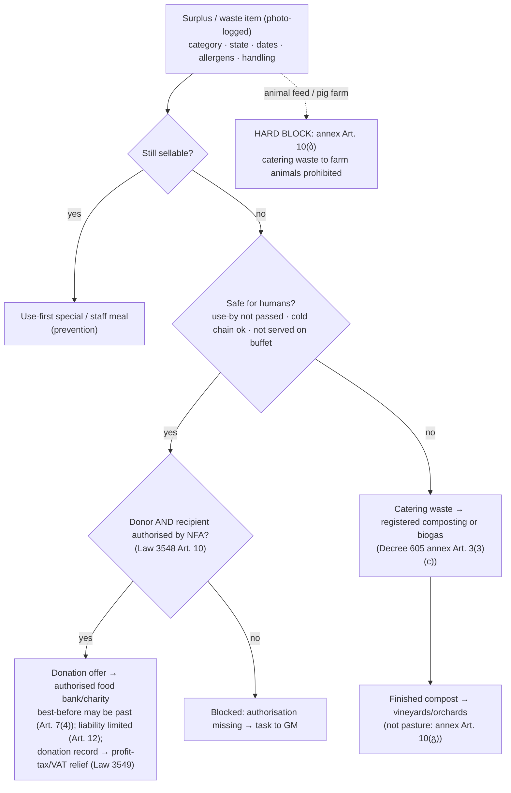

# Challenge #2 — Circular Hotel: smart waste and inventory supply chain (pure software)

**Retrieval date: 24 September 2026.**

**Scope.** How a regional or boutique hotel in Kakheti can:
- predict kitchen demand;
- prevent spoilage;
- route surplus food and organic waste to lawful circular destinations.

The only inputs are software algorithms, PMS/POS data, and a smartphone camera. There are **no scales, smart bins, fixed cameras or IoT**.

**Judging reference:** the GITA 35-point rubric in [`docs/gita_35_rubric.md`](../../docs/gita_35_rubric.md), supplied by the team on 24 Sep 2026 and not found on a public GITA page (§6).

**Local inputs (read-only):**
- [`task_research.md`](../../task_research.md): evidence rules, gates G1–G7, interview method;
- [`hospitality_tech_landscape.md`](../hospitality_tech_landscape.md): Georgian stack, Poster/FINA/Exely, payments.

## 0. Evidence convention

Same labels as `task_research.md`:

| Label | Meaning |
|---|---|
| **[D]** | Documented on a fetched primary source: legislation on matsne.gov.ge, UN/WRAP/WRI reports, official docs. |
| **[O]** | Directly observed in this investigation, e.g. legal text re-read by hand. |
| **[I]** | Inference, design or assumption, including every GEL model input. |
| **[U]** | Unverified: secondary source, snippet, vendor claim not checked, or unreachable page. |
| **VS** | Vendor-stated. |

**[O] Method.**
- **Parallel research.** Four passes: benchmarks, software methods, Georgian regulation, and the rubric. Primary PDFs and legislation were downloaded with `curl` and parsed with `pdftotext`/`catdoc`.
- **Hand-verified legal texts.** The two findings that most change the brief were re-read in the original Georgian:
  - Law No. 3548: 7-page PDF, SHA-256 prefix `af7d30e70b2ba049`;
  - Decree 605, annex: SHA-256 prefix `251086f7d4cd9ab0`.
- **[U] Search limitation.** The session's web-search quota ran out partway through. Some sub-questions were answered by fetching known URLs directly, and a few remain open (§8).

---

## 1. Executive summary

1. **[O/D] The "pig farm" leg of the brief is illegal in Georgia.** Georgia is where African swine fever entered Eurasia in 2007: catering waste fed to free-ranging pigs near Poti was the most likely source [D, CDC *Emerging Infectious Diseases*]. Georgia has since banned it. Government Decree No. 605 (29 Dec 2017), annex Art. 10(ბ), prohibits "feeding of farm animals (other than fur animals) with catering waste or with feed material that contains or is derived from catering waste" [O]. The same regulation names composting and biogas as the lawful routes for catering waste.

   **The product must hard-block animal feed as a destination.** Built as a compliance guard, this becomes a feature rather than a gap.
2. **[O] Georgia already has a food-donation law, and software can operationalise it.** Law No. 3548 "On Reduction of Food Loss and Waste and on Food Donation" (4 Oct 2023):
   - **Art. 7(2):** surplus that is safe may be donated.
   - **Art. 7(4):** donation is allowed **after the "best before" date** if the food is still safe.
   - **Art. 7(5):** a preferential tax regime applies.
   - **Art. 10:** donor and recipient must both be **authorised** by the National Food Agency.
   - **Art. 12:** the donor is **not liable** if the food met safety requirements when handed over.

   The companion Tax Code amendment (Law No. 3549) makes donated food profit-tax exempt (Art. 98(3)(თ)) and zero-rated for VAT [D, research pass; not re-read by hand].
3. **[D] The brief's "4–10% of food spend lost to spoilage" figure is vendor marketing, not a benchmark.**
   - **Origin:** it traces to scale/camera vendors. Winnow alone gives "4–12%" and "5–15%" on different pages [VS/U]. No independent source states it.
   - **Defensible numbers instead:**
     - **Pre-consumer waste:** a median of 4.7% (average 6.8%) of COGS across 42 hotels [D, WRI/Champions 12.3 2018].
     - **All stages:** about 19% of food purchased by UK hotels [D, WRAP 2013].
   - **Breakdown (hotel data, Turkey):** most hotel waste is plate and buffet waste, not storage spoilage; production and storage are about 5% [D, FAO/Metro Turkey 2022, n = 2 properties].

   **Forecasting headcounts and buffet production matters more than expiry tracking.**
4. **[D] Measurement alone pays:** 42 hotels cut food waste **21% in year 1**, with a 7:1 average benefit-cost ratio; 70% paid back within 1 year and 95% within 2. Average investment was 0.9% of food sales, with 90% of sites under $20k [D, WRI/Champions 12.3]. This supports a zero-hardware, software-only offer.
5. **[I] Honest GEL economics for a 25-room Kakheti hotel with a restaurant.** Modelled food purchases are about **GEL 163k/yr**. Direct food-purchase savings come to **GEL 1.6k–6.5k/yr** (conservative to broad scope, §4), before labour and disposal savings, which WRAP shows make up most of the true cost.

   Against a **GEL 39/month** module, payback is **1–4 months**. The savings are real but modest. The pitch should also claim:
   - fewer stock-outs and over-orders;
   - the chef's ordering time;
   - legal donation with tax relief.
6. **[I] The prototype (§5) is a multi-agent *transaction*, not a dashboard:**
   - a reservation batch or cancellation re-forecasts covers, then drives the prep sheet, stock netting and a draft purchase order;
   - near-expiry lots become "use-first" specials;
   - surplus goes to a **legal-hierarchy router** (staff meal → authorised donation → compost/biogas; animal feed blocked);
   - a Telegram offer goes to an authorised partner, their acceptance becomes an ops pickup task, and staff attestation produces a **donation record for the tax regime**.

   It reuses the existing Smartstay platform (Supabase RPCs, forced RLS, Realtime, Telegram, Gemini), which is consistent with the hackathon's "built for this hackathon" rule.

### 1.1 Corrections to the brief

| # | Brief premise | Finding | Evidence |
|---|---|---|---|
| C1 | Redistribute organic waste to **pig farms** | **Prohibited** (Decree 605 annex Art. 10(ბ)); catering waste caused the 2007 ASF introduction | [O] matsne 3977566; [D] CDC EID 14(12) |
| C2 | Spoilage is "typically 4–10% of food spend" | Vendor figure with no methodology. Use WRI 4.7% median of COGS (pre-consumer) and WRAP 19% of purchases (all stages) | [D] WRI 2018 Table 1; WRAP 2013 Table E1 |
| C3 | Barcode scanning tracks expiry dates | Retail EAN-13 carries **no expiry**. GS1 DataMatrix can (AI 17), but the 2D migration targets 2027 and most supplier packs are still 1D | [D] GS1 "Sunrise 2027"; MDN BarcodeDetector |
| C4 | Compost goes to "local farms" freely | Annex Art. 10(გ) restricts feeding farm animals grass from land where **organic fertiliser other than manure** was applied. Route compost to **vineyards and orchards**, not pasture | [O] matsne 3977566 |
| C5 | "GITA 35-point rubric" | Supplied by the team; no public copy found on gita.gov.ge, whose events page reads "No events for now" | [D] gita.gov.ge; §6 |

---

## 2. Dimension 1: software-driven predictive procurement

### 2.1 Where the waste actually is

| Stage | Share of hotel food waste | Software lever | Evidence |
|---|---|---|---|
| Plate | 54% (hotels), 65% (boutique hotel) | Portion sizes, buffet layout, nudges; outside procurement | [D] FAO/Metro Turkey 2022, pp. 14–17 (n = 2) |
| Buffet overproduction | 15% (boutique) – 40% (all-inclusive) | **Headcount-driven production planning**, the main lever | [D] same |
| Preparation (sector-wide, UK) | 45% | Prep quantities from forecast; BOM-based prep sheets | [D] WRAP 2013c |
| Spoilage (sector-wide, UK) | 21% | FEFO stock, expiry capture, use-first specials, right-sized orders | [D] WRAP 2013c |
| "Safety margin" behaviour | 85% of surveyed Turkish HoReCa add one; 32% have a donation programme | Forecast confidence bands replace gut margins | [D] FAO/Metro Turkey 2022 |

### 2.2 Demand forecasting from PMS headcounts

**[I] Model: a transparent baseline first, learned adjustments second.**
- **Why a baseline.** No paper was found that publishes breakfast take-up accuracy [U]; "capture rate" is industry practice rather than a validated academic construct.
- **The accepted test.** Evaluate the forecast on the hotel's own history: MAPE against actual covers from POS or the breakfast list, compared with a naive "same weekday last week" forecast.

```text
breakfast_covers(d) = Σ_rooms in-house night (d−1→d) · guests_per_room · board_takeup(board_basis, weekday, segment)
                      + day_passes(d)                            # rare in Kakheti
dinner_covers(d)    = in_house(d) · capture(HB/FB = 1.0, BB = c_dinner(weekday, segment))
                      + walk_ins(d)                              # from POS history (Poster) by weekday/season
                      + events(d)                                # group menus: exact counts from the group contract
production(item,d)  = BOM(item) · menu_mix_share(item) · covers(d) · (1 + band_q)   # band_q = upper quantile, not a flat margin
order(item)         = max(0, Σ_d≤lead+cycle production(item,d) − usable_stock_before_expiry(item) − open_POs(item))
```

**Inputs:**

| Input | Source | Feasibility | Label |
|---|---|---|---|
| In-house / arrivals / departures, guests per room | Exely Read Reservation API (credentials by request), Cloudbeds API, or a nightly CSV/arrivals list | Exely public API exists; 3 req/s, 300/h per IP | [D] production roadmap §3.3 |
| Board basis (BB/HB/FB), group bookings | Reservation rate plan / group block | Often only in the rate-plan name; map per hotel | [I] |
| Menu mix, walk-ins | **Poster POS open Web API + webhooks** | Documented | [D] landscape §5.1 |
| Actual covers (the oracle) | POS tickets; breakfast-list check-offs in the app | Needed to measure MAPE | [I] |
| Recipes / BOM | Chef enters once; a photo of the recipe card goes through Gemini extraction with human confirmation | Human-verified | [I] |

**[D] Related literature, for methodology only:**
- food-production time-series forecasting, where a double moving average performed best among simple methods (Miller, McCahon & Bloss, 1990);
- a 2025 ensemble hotel-demand paper reporting MAPE under 5.1%.

These are not breakfast-specific and not Georgian; do not quote their accuracy as the prototype's.

### 2.3 Shelf-life and spoilage tracking with a smartphone

| Method | Works today? | Notes | Label |
|---|---|---|---|
| **Invoice/delivery-note photo → line items** (Gemini multimodal or Azure Document Intelligence prebuilt-invoice) | Yes, with human confirmation | Azure: 27 languages, per-field confidence, no single accuracy figure. Gemini invoice accuracy on Georgian invoices **untested**: build a 50-invoice eval | [D] Azure docs; [U] Gemini |
| **Label photo → expiry date** (OCR of "უმჯობესია გამოყენებულ იქნეს …-მდე" / "use by") | Yes, with confirmation | The primary expiry-capture path, because barcodes rarely carry dates | [I] |
| **Barcode scan in the browser** | Partly | `BarcodeDetector` is not Baseline (no Safari/iOS or Firefox), so ship a ZXing/html5-qrcode fallback. EAN-13 yields the GTIN (item identity) only | [D] MDN |
| **GS1 DataMatrix / Digital Link** (AI 01 GTIN, 10 batch, 17 expiry) | Rare on supplier packs until the 2027 migration | Parse when present | [D] GS1 |
| **Photo-logged waste** (photo + category + portion fraction, e.g. ¼ gastronorm pan) | Yes | Peer-reviewed photographic plate-waste methods show "high agreement" with weighing in school, childcare and hospital settings; exact error figures not retrieved. AI portion estimates must be staff-confirmed | [D] qualitative; [U] numbers |

**[I] "Use-first" specials (FEFO).**
1. Each morning, lots expiring within the next 48–72 h are joined to recipes that consume them.
2. Items are ranked by value at risk × feasibility (stock on hand, prep time, menu fit).
3. The chef gets 2–3 Georgian-language special suggestions, e.g. "დღის შეთავაზება", plus a staff-meal plan.

The chef approves; nothing auto-publishes.

**[U]** No controlled study of software-generated specials was found. Measure it in the pilot: value of lots expiring unused, before and after.

---

## 3. Dimension 2: regional circular B2B matching (legal by construction)

### 3.1 The legal destination hierarchy (software-enforced)



| Destination | Legal status | Software rule | Label |
|---|---|---|---|
| Pig or other farm animals (swill) | **Prohibited** for catering waste; fur animals are the only exception | Destination type `animal_feed` cannot be selected for any catering-waste item. The guard cites the article | [O] Decree 605 annex Art. 10(ბ) |
| Food donation (cooked or packaged) | Allowed if safe; donor and recipient NFA-authorised; best-before may be past; liability limited | Offer only to partners with a valid authorisation number and expiry on file; block use-by-expired items; require a handover attestation | [O] Law 3548 Arts. 7, 10, 12; implementing Decrees 149/2024 and 161/2024 [D, research pass] |
| Composting / biogas | Lawful route for catering waste | Only to registered facilities; record the handover | [O] annex Art. 3(3) |
| Compost to farmland | Allowed; grazing restriction on land treated with non-manure organic fertiliser | Tag compost for vineyards and orchards; warn if the partner type is pasture | [O] annex Art. 10(გ) |
| Grape pomace (wineries) | A plant by-product; a natural co-feedstock with hotel food waste in Kakheti | Match winery pomace with hotel waste at the same composter | [I] |

### 3.2 Matching algorithm [I]

```text
candidates = partners where accepts(category, state, allergens) AND legal_route_ok(item, partner.type)
             AND authorised(partner, date) AND distance(hotel, partner) ≤ partner.radius_km
             AND pickup_window ∩ item.safe_until ≠ ∅
score      = w1·hierarchy_rank(partner.type)  (donation > compost > biogas)
           + w2·(1 − distance/radius) + w3·reliability(partner.accept_rate, on_time_rate)
           + w4·capacity_fit(qty, partner.capacity_today)
offer      = top-k in order: first acceptance wins; others are auto-withdrawn; offer expires at safe_until − handling_buffer
```

**[D] Patterns borrowed from existing platforms:**
- geo-radius and category tags;
- time-boxed pickup windows;
- automatic versus negotiated acceptance, as in Phenix (charity matching by proximity and specialisation), OLIO and Too Good To Go.

**[D] None operates in Georgia.** Industrial-symbiosis marketplaces are described as underdeveloped. That gap is real, but the "pure software" pitch must not over-claim network effects before partners sign.

### 3.3 Kakheti partner reality

| Partner type | Evidence | Status |
|---|---|---|
| Food bank / charity | **FoodBank Georgia** exists (Tbilisi/Rustavi; staple parcels funded by money donations), **not** a prepared-food pickup network in Kakheti | [D] foodbank.ge; Kakheti coverage [U] |
| Composting | Georgia generates 517,055 t/yr of biodegradable waste; 54.7% of municipal waste is organic | [D] EU4GenderEquality/FAO assessment (2022) |
| Kakheti composting facility | No facility confirmed; Solid Waste Management Company site unreachable | [U] |
| Circular grants | **CENN** is running a grant competition "Supporting Waste Prevention and Circular Economy Practices in Kakheti and Adjara" | [U], per the research pass; confirm on cenn.org. This is the most actionable partner and funding lead |
| Organic farms / vineyards | Kakheti is Georgia's main wine region; Elkana (organic farming association) unreachable | [D] region; [U] Elkana |

**[I] Pilot implication.** The circular leg needs **one authorised recipient and one composter signed before the demo claims a live network**. Until then, label partner endpoints in the demo as simulated, as `task_research.md` §4.3 requires.

---

## 4. Dimension 3: benchmarks and GEL economics

### 4.1 Benchmarks

| Metric | Value | Scope | Source |
|---|---|---|---|
| Hotel food waste, % of COGS | low 0.4 / **median 4.7** / average 6.8 / high 28.8% | Pre-consumer, 42 hotels, 15 countries | [D] WRI/Champions 12.3 2018, Table 1 |
| Year-1 reduction from measurement programmes | **21%** by weight | same | [D] |
| Benefit-cost ratio / payback | 7:1 average; 70% within 1 yr, 95% within 2 yrs; investment 0.9% of food sales | same | [D] |
| UK hotels, food purchased wasted | **~19%** by weight; £0.52 per meal; £6,300 per tonne avoidable | All stages, 2011–12 | [D] WRAP 2013, Table E1 / 1.2 |
| True cost structure | Purchases + labour > 90% of the cost of wasted food; disposal ~3% | UK HaFS | [D] WRAP 2013b |
| Food-service waste, global | 36 kg/capita/yr; 28% of food waste | UNEP FWI 2024, low confidence | [D] |
| Georgia food-service waste data | **None** (UNEP has only a household figure: 101 kg/capita/yr, Kutaisi 2014) | — | [D] |
| "4–10% of food spend" | Vendor marketing | — | [U]/VS |

### 4.2 GEL model: independent 25-room Kakheti hotel with a restaurant [I]

Every input below is an assumption to replace with the pilot hotel's POS and purchase ledger.

| Input | Value | Basis |
|---|---|---|
| Rooms × occupancy | 25 × 40% = **3,650 room-nights/yr** | Branded-hotel occupancy outside Tbilisi and Batumi was 35.3% in Q1 2025 [D, GNTA]; seasonal year assumed higher |
| Guests per room | 1.8, giving **6,570 guest-nights** | Assumption |
| Breakfasts (included, 90% take-up) | 5,913 × GEL 11 food cost = **GEL 65,043** | Assumption |
| Dinners (45% guest capture + 2,500 external covers) | 5,457 × GEL 18 food cost = **GEL 98,226** | Assumption |
| **Food purchases (COGS)** | **≈ GEL 163,300/yr** | Sum |

| Scenario | Waste baseline | Reduction | Direct food-purchase saving |
|---|---|---|---|
| A: conservative, pre-consumer median (WRI) | 4.7% × 163.3k = GEL 7,675 | 21% | **GEL 1,612/yr** |
| A′: pre-consumer average (WRI) | 6.8% = GEL 11,104 | 21% | **GEL 2,332/yr** |
| B: all stages, including buffet overproduction (WRAP 19%) | GEL 31,027 | 21% | **GEL 6,516/yr** |

**[I] Reading the model.**
- **Excluded:** labour on food that is prepared and then wasted (the dominant hidden cost per WRAP), disposal fees, the chef's ordering time, and stock-out recovery.
- **Donation relief:** the profit-tax relief on donated food is real, but small in GEL for one hotel.
- **Payback:** at a **GEL 39/month** module price (GEL 468/yr), payback takes about **3.5 months** in scenario A and **under 1 month** in scenario B.
- **What to say to judges:** "GEL 1.6–6.5k per year per 25-room hotel in avoided food purchases alone, from published hotel benchmarks, to be replaced by your pilot numbers." Do not say "10% of food spend."

---

## 5. Dimension 4: prototype and 10-point live demo

### 5.1 Architecture: extends the existing Smartstay platform

The existing stack is the Next.js Web OS, Supabase with forced RLS and RPC-only writes, Realtime, the Telegram webhook with `after()`, and Gemini 3.8 Flash. It is already tested: 20/20 browser checks and 38/38 SQL checks. It supplies tenancy, `ops.tasks` with human attestation, the Telegram channel and the agent step log.

The challenge adds one schema, `kitchen`, plus agents:

| Table | Purpose |
|---|---|
| `kitchen.items`, `kitchen.recipes(item, ingredient, qty_per_portion)` | Menu, BOM |
| `kitchen.stock_lots(item, qty, unit, received_at, use_by, best_before, source ∈ invoice_photo/label_photo/manual/scan, lot)` | FEFO inventory |
| `kitchen.forecasts(date, meal, covers, low, high, basis jsonb, model_version)` | Explainable forecast (basis = headcount breakdown) |
| `kitchen.prep_plans(date, item, qty, status)` · `kitchen.purchase_drafts(supplier, lines, status)` | Production and ordering |
| `kitchen.waste_logs(photo_path, category, portion_fraction, reason, logged_by)` | Photo logging; no scale |
| `circular.partners(type ∈ food_bank/charity/composter/biogas/staff, nfa_authorisation_no, valid_until, radius_km, accepts jsonb)` | Partner registry with authorisation dates |
| `circular.offers(item, qty, safe_until, route, status)` · `circular.handover_records(offer, recipient, attested_by, photo, tax_record jsonb)` | Offers and handover proof |
| Guard: `circular.route_allowed(item, partner)` SQL function | Encodes §3.1. `animal_feed` always false for catering waste; returns the legal citation |

| Agent | Owns | Writes through |
|---|---|---|
| **Forecaster** | Covers per meal and day, with bands | `kitchen.forecasts` |
| **Chef assistant** | Prep sheet; use-first specials (Georgian) | `prep_plans`; proposals for chef approval |
| **Procurement** | Stock netting; supplier draft PO | `purchase_drafts`; sent only after human approval |
| **Circular coordinator** | Surplus routing, offers, partner negotiation | `circular.offers` via `route_allowed()` |
| **Compliance guard** (deterministic, not an LLM) | Legal hierarchy, authorisations, date rules | Rejects commands; cites the article |

**[I] Why this is A2A and not a to-do list (gate G3/G7).** A single booking change propagates across four dependent responsibilities: forecast, then production, then procurement, then surplus.

Each has its own constraints:
- supplier lead time and minimum order;
- expiry windows;
- partner pickup windows and authorisation;
- a legal hierarchy.

Acceptance by one partner withdraws the other offers. A missed pickup re-routes to compost before `safe_until`.

### 5.2 Ten-point live demo (about 7 minutes)

| # | Step | What the judges see | Real vs simulated |
|---|---|---|---|
| 1 | **Reservation batch arrives**: a wine-tour group of 18 on half board tomorrow, via the Exely/Cloudbeds adapter or a CSV drop | Realtime: the Ops board and forecast update live | Adapter real (CSV) or sandbox; labelled |
| 2 | **Forecast recalculates**: breakfast 41 → 59, dinner 22 → 40, with the headcount explanation and band | Forecaster steps in the AI Team feed | Real computation |
| 3 | **Prep sheet** from the BOM: khinkali, mtsvadi, salads, in Georgian | Chef view | Real |
| 4 | **Stock netting**: shortfall of 6 kg pork shoulder and 40 eggs; a draft PO to the supplier in Georgian | Procurement card awaiting approval | Real; send is simulated |
| 5 | **Invoice photo** (phone camera) → lots with dates; the chef confirms two low-confidence fields | Camera → form | Real Gemini call; human confirm |
| 6 | **Use-first**: 3 lots expire within 48 h, so 2 specials are suggested; the chef approves one | Georgian menu line | Real |
| 7 | **Cancellation**: 12 guests cancel; the forecast drops and **surplus is flagged** (prepped salads, bread, dairy) | Surplus panel appears live | Real |
| 8 | **Compliance router**: salads go to donation (authorised partner), trimmings to the composter. A judge picks "pig farm" and gets **blocked with the Decree 605 article** | The guard message | Real (SQL guard) |
| 9 | **Telegram offer** → the partner taps "Accept" → a pickup task on the Ops board → staff attest the handover with a photo | Telegram inline button; attestation modal | Real Telegram test bot and test partner; labelled |
| 10 | **Impact ledger**: kg and GEL avoided (photo-estimated, confirmed), the donation record for tax relief, forecast MAPE against the naive baseline over replayed weeks | Analytics rings | Real; replay set labelled |

**[I] Oracle and baseline** (`task_research.md` §4.3). Replay 4–8 weeks of a hotel's reservations and POS sales under three regimes:
1. the manual process;
2. a fixed "occupancy × 1.2" rule;
3. the agent system.

Compare covers MAPE, over-ordered value, expired-lot value and surplus reaching a lawful destination. Do not convert replay results into claimed deployed savings.

---

## 6. Dimension 5: alignment with the GITA 35-point rubric

Rubric source: [`docs/gita_35_rubric.md`](../../docs/gita_35_rubric.md), supplied by the team.

**[D]** An independent search found no public copy: gita.gov.ge lists no events, and no "Smartstay" hackathon is indexed. Georgian-language and hackathon-platform listings were not checked because the search quota ran out.

| Criterion (max) | What earns 4–5 (or 8–10) | This dossier's evidence |
|---|---|---|
| 1. Problem scale (5) | Scale, importance, urgency | WRI/WRAP/UNEP benchmarks (§4.1). Georgia's 2023 law makes food loss a **national policy priority** [O]; 517k t/yr of biodegradable waste [D]; the ASF history explains why routing matters [D]. Honest caveat: no Georgian HoReCa data exists, so say so and show the pilot plan |
| 2. Solution (5) | Innovative, fully addresses the problem | Headcount-driven forecasting plus FEFO plus a **legal-by-construction** circular router. No competitor combines these for the Georgian law set, and none operates in Georgia [D] |
| 3. Commercialisation (5) | Market, audience, revenue | 2,783 hotel establishments in Georgia (Geostat 2025) [D, roadmap §7.1]. Module at GEL 39/month on the Smartstay platform; payback 1–4 months (§4.2). Channel: CENN Kakheti circular grants as a pilot co-funder [U] |
| 4. Team (5) | Clear roles | Roles map to the agents: forecasting/data, kitchen UX, integrations, legal/compliance (owns §3.1), pitch |
| **5. Prototype (10)** | Functional, convincing | The §5.2 demo changes real state end to end, on an already-tested platform. The deterministic guard makes the legal claim demonstrable live |
| 6. Presentation (5) | Clear visuals | One diagram (§3.1), one money slide (§4.2 with sources), a live demo |

| GITA success factor | How the solution meets it |
|---|---|
| Measurable results | GEL per year avoided (scenarios A–B), MAPE against baseline, and the share of surplus reaching lawful destinations, all computed live from the ledger |
| Realistic implementation cost | Smartphone plus browser only; no hardware; GEL 39/month; payback in months |
| Integration with existing systems | Exely (read reservations), Cloudbeds, **Poster** (open POS API) [D]; FINA API undocumented [U], so CSV import is the fallback |
| Readiness for pilot, in Georgian | Georgian UI and labels; Georgian date-label OCR ("უმჯობესია გამოყენებულ იქნეს …-მდე"); Georgian supplier POs; laws cited in Georgian |
| Not an existing commercial product | Built on the team's own hackathon platform. It does not resell Winnow, Leanpath or Too Good To Go, several of which need hardware anyway [D] |

**[I] Gate check from `task_research.md` §4.1.**
- **Passes on design:** G3 (structural coordination), G4 (software leverage) and G6 (verifiable within the build window).
- **Unproven:** G1 (a real problem) and G2 (recurrent and material) need **one Kakheti hotel's purchase ledger and waste episodes**. Without them, the problem-scale score rests on international benchmarks.

---

## 7. Pilot plan (2 weeks, one Kakheti hotel) [I]

1. **Collect data:** export 8 weeks of reservations (Exely/CSV) and POS sales (Poster/FINA). Photograph 4 weeks of supplier invoices.
2. **Photo-log waste:** at the end of each service, log waste by category and portion fraction; use about 5 photos a day for calibration.
3. **Secure partners:** confirm one NFA-authorised recipient (or start the hotel's own authorisation under Decree 149/2024) and one composter.
4. **Replay:** run the three-regime comparison in §5.2, then run live for 1 week with chef approval on every action.
5. **Report:** actual waste % of COGS, MAPE, GEL avoided, and donated kg with tax records. These replace every [I] number in §4.2.

---

## 8. Open questions

| # | Question | Why it matters | Next step |
|---|---|---|---|
| Q1 | Is there an NFA-authorised food bank or charity able to collect in Kakheti? | The donation leg needs a lawful recipient | NFA registry; FoodBank Georgia; Caritas |
| Q2 | Is there a registered composter or biogas plant near Telavi? | The lawful destination for inedible catering waste | Solid Waste Management Company; CENN; municipality |
| Q3 | Exact scope of the Law 3549 tax relief (valuation, documentation) | The value of donation records | Georgian tax adviser; Revenue Service guidance |
| Q4 | Gemini accuracy on Georgian invoices and date labels | Invoice and label capture is the primary expiry input | Build a 50-invoice / 50-label eval |
| Q5 | Photo-based portion-estimate error for hotel kitchen waste | Honesty of GEL-avoided figures | Calibrate against the hotel's own counts; report as an estimate |
| Q6 | Current ASF status in Georgia (WOAH WAHIS 2024–2026) | Strengthens the rationale for the hard block | WAHIS dashboard (JavaScript-only, not queried) |
| Q7 | Public source for the GITA rubric | Citation hygiene | Ask the organisers for the document |

## 9. Sources

**Legislation (Georgia)**
- Law No. 3548 "On Reduction of Food Loss and Waste and on Food Donation" (4 Oct 2023): https://matsne.gov.ge/ka/document/view/5932169. Re-read by hand: Arts. 7(2), 7(4), 7(5), 10, 12.
- Government Decree No. 605 (29 Dec 2017), technical regulation on animal by-products not intended for human consumption: https://matsne.gov.ge/ka/document/view/3977566 (annex download /download/3977566/0/1). Re-read by hand: Art. 10(ბ), 10(გ); Art. 3(3) per the research pass.
- Tax Code of Georgia, as amended by Law No. 3549 (Art. 98(3)(თ); VAT treatment): https://matsne.gov.ge/ka/document/view/1043717 (research pass).
- Waste Management Code, Law No. 2994 (26 Dec 2014), Art. 11: matsne.gov.ge (research pass).
- NFA implementing rules, Decrees 149/2024 and 161/2024 (research pass).

**Evidence**
- CDC *Emerging Infectious Diseases* 14(12): ASF in Georgia 2007, https://wwwnc.cdc.gov/eid/article/14/12/08-0591_article
- WRI/Champions 12.3, *The Business Case for Reducing Food Loss and Waste: Hotels* (2018)
- WRAP, *Overview of Waste in the UK Hospitality and Food Service Sector* (2013a/b/c)
- UNEP *Food Waste Index Report 2024*
- FAO/Metro Turkey, *Guidelines on the Prevention of Food Waste at Hotels, Restaurants and Other Public Consumption Points* (2022)
- EU4GenderEquality/FAO, *Gender Impact Assessment* of Georgia's food loss and waste law (2022)
- MDN, BarcodeDetector
- GS1, Sunrise 2027 / GS1 DataMatrix application identifiers
- Azure Document Intelligence, prebuilt-invoice
- Phenix, OLIO, Too Good To Go (country lists)
- foodbank.ge
- gita.gov.ge (events and programmes pages)

**Vendor figures cited only as VS:** Winnow ("4–12%" / "5–15%"; >70% pre-plate), Leanpath.
