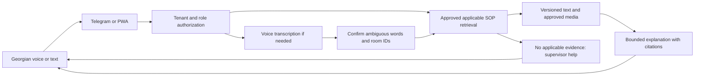
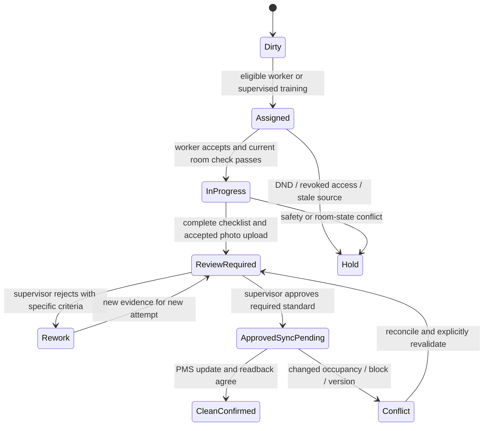
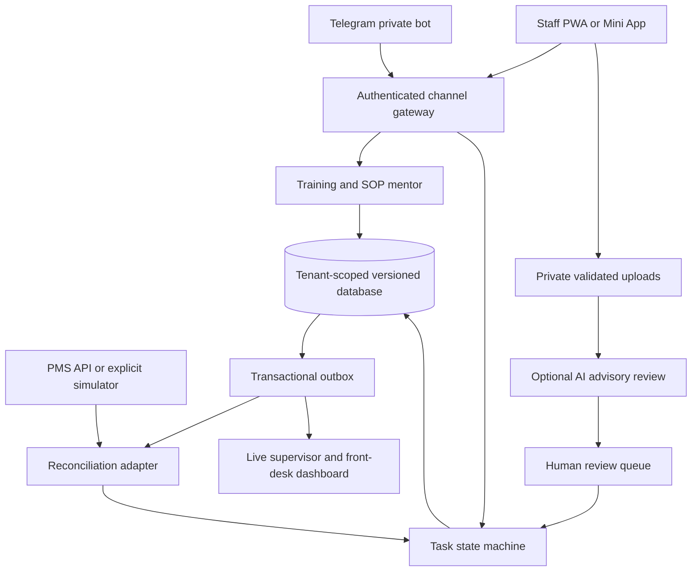

# Challenge 4 — Digital onboarding and housekeeping operational support

**Research date: 24 September 2026. Domain: seasonal Kakheti wine hotels, chateaux and regional Georgian accommodation. Scope: software on existing staff smartphones, Telegram or mobile web/PWA, approved Georgian SOP guidance and accountable housekeeping dispatch. No dedicated devices or installation.**

## 1. Recommendation and strength of evidence

**[I] Build a Georgian-speaking, property-specific mentor connected to a competence-aware room-turnover queue.** A new worker opens a short-lived invitation, learns a small approved procedure, practices retrieval through a quiz, and receives a supervised task. The worker submits a checklist and a task-bound photo; a supervisor reviews the evidence and any required physical inspection before the system requests a PMS room-condition update. Front desk sees the confirmed result and its freshness. Training, work and inspection share the same versioned standard.

**[I] The product addresses lost operating knowledge, repeated questions, avoidable rework and delayed coordination.** It does not create missing workers, fix inadequate pay, eliminate seasonality or replace physical practice. A 30-second demo quiz is a demonstration of the learning interaction, not proof that someone is qualified to clean a guest room independently. A single photo documents a limited view, not room-wide hygiene or safety.

**[D] Local evidence:** BMG's 7 September 2026 report attributes difficulty finding and retaining staff, seasonal reductions and service-quality effects to Amirbari Hospitality Agency managing partner Ketevan Amirbari. It identifies a credible Kakheti discovery lead but gives no property-level turnover rate, training-time denominator or ranking of all hotel bottlenecks. [BMG interview report](https://bm.ge/en/news/staff-shortages-and-seasonality-challenge-kakheti-hotels).

**[U] The prompt's “#1 most frequently cited” designation is a challenge framing, not a frequency finding established here.** The two local input dossiers do not contain a representative coded problem survey or completed hotel interviews. Verbal-only training, chaotic housekeeping and a typical 3–5-day shadowing baseline need direct operator evidence. Repeated articles quoting the same person are not independent observations.

**[D] International context:** AHLA's survey of 282 hoteliers, conducted 6 December 2024–3 January 2025 and published 20 February 2025, reported staffing shortages at 65% of respondents. Housekeeping was the most-mentioned shortage category at 38%, followed by front desk at 26%. This is a US respondent sample, not a Georgian prevalence estimate or evidence that an AI mentor solves retention. [AHLA survey](https://www.ahla.com/news/65-surveyed-hotels-report-staffing-shortages).

### 1.1 Evidence labels and source inputs

| Label | Meaning |
|---|---|
| **[D]** | Documented by a linked source; interview reports establish the attributed speaker's account. |
| **[D/VS]** | Vendor-stated capability or result, not independently tested here. |
| **[O]** | Local artifact inspection, calculation or executed test. |
| **[I]** | Proposed design, scenario, target, interpretation or recommendation. |
| **[U]** | Unverified or requiring property-level evidence. |
| **[USER]** | Organizer-announced rubric supplied by the user, preserved in the shared reference. |

**[I] Design sections inherit [I] unless marked otherwise.** The research is comprehensive across the requested dimensions and major failure modes; it is not a claim that every vendor was tested or every hotel surveyed.

Read-only inputs: [task_research.md](../../task_research.md), particularly practitioner evidence, incident discovery and root-cause tests; [hospitality_tech_landscape.md](../hospitality_tech_landscape.md), particularly staff collaboration, regional systems and shift continuity. Judging criteria: [GITA 35-point rubric](../../docs/gita_35_rubric.md).

**[I] Important update to the local landscape's inference:** its suggestion that established operations products assume an already trained workforce should not be repeated as a demonstrated competitor deficiency. Current vendor pages explicitly offer SOPs, onboarding and AI knowledge assistance. Our edge must be demonstrated in Georgian usability, property-specific correctness, approval controls, total cost and operational reliability.

### 1.2 Claim register

| Claim | Evidence status | Allowed formulation |
|---|---|---|
| Kakheti hotels face staff retention and seasonality problems | Documented practitioner account | “A locally documented problem requiring property validation” |
| This is the statistically ranked #1 Georgian hotel problem | Not established | “Challenge priority; ranking unverified” |
| Onboarding normally takes 3–5 days | User-proposed baseline; not locally measured | “Baseline to measure” |
| Two hours replaces all job training | Unsupported and conflates learning with competence | “Target for initial self-guided orientation, plus practice and assessment” |
| One photo proves a room is clean | False observability assumption | “Limited visual evidence for selected checklist items” |
| AI reduces negative check-in reviews | Hypothesis | “Evaluate complaint/review incidence with denominators and comparison” |
| Tested workflow blocks premature Clean status | Observed in offline reference | “28 checks passed in a synthetic in-memory engine” |

## 2. Competitive teardown and differentiation

**[I] Method:** inspect primary product and developer pages, compare documented capabilities, and distinguish marketing outcomes from tested behavior. Missing details on a public page are questions for a vendor demonstration, not proof of absence. No commercial accounts, trial deployments or Georgian-language usability tests were performed.

| Precedent | Documented capability | Strength to borrow | What remains to verify / differentiation to earn |
|---|---|---|---|
| **hotelkit Housekeeping** | VS: allocation, cleaning/inspection checklists, dynamic priority and two-way PMS room updates | Shared room state and clear supervisor workflow | Actual Georgian usability, offline conflicts, photo-review boundaries and competence gating |
| **hotelkit Knowledge AI** | VS: digital-handbook chatbot, role-based answers, multilingual responses and SOP grounding | Access-scoped property knowledge at point of work | Page advertises hallucination avoidance, but no guarantee is accepted without tests; named Georgian support and approval/citation behavior need verification |
| **Flexkeeping QA and digital SOPs** | VS: SOP libraries with images, videos/documents, assigned checklists and usage/completion tracking | Link teaching media with operational standards | Version invalidation, hands-on competence evidence and Georgian voice quality need testing |
| **ALICE / Actabl** | VS: mobile room assignments, rush rooms, inspection visibility and two-way PMS updates | Dispatch and front-desk coordination | New-worker learning and safety/approval behavior in the exact target workflow |
| **Optii Housekeeping** | VS: AI-assisted routing, timeline visibility, two-way PMS, photos/notes and inspections | Deadline-aware planning and workload visibility | Whether predictions generalize to a small seasonal team; treatment of breaks, new-worker practice and stale arrivals |
| **eduMe** | VS: frontline mobile training and hospitality onboarding | Short learning units at the point of need | Hotel-specific competence and dispatch integration; training-time marketing lacks a matched local baseline |
| **Existing PMS + checklist + trainer** | Current baseline to inspect at the pilot hotel | Low cost, familiar ownership and minimal integration | Measure whether a separate mentor/queue improves enough to justify switching and review overhead |

Sources: [hotelkit Housekeeping](https://hotelkit.net/products/housekeeping/), [hotelkit Knowledge AI](https://hotelkit.net/products/knowledge-ai/), [Flexkeeping QA](https://flexkeeping.com/products/hotel-quality-assurance-software), [Actabl Housekeeping](https://actabl.com/operations-software/housekeeping/), [Optii Housekeeping](https://www.optiisolutions.com/housekeeping), [eduMe hospitality training](https://www.edume.com/industries/hospitality-training).

**[D/VS] Quantitative claims are leads, not our forecast.** Flexkeeping's QA page advertises 50% faster onboarding; eduMe's hospitality page advertises a 70% onboarding-time reduction. Neither reviewed overview supplies a controlled Georgian study or demonstrates that two hours produces independent housekeeping competence. Do not average these percentages or import them into a local ROI forecast. [Flexkeeping QA](https://flexkeeping.com/products/hotel-quality-assurance-software), [eduMe hospitality](https://www.edume.com/industries/hospitality-training).

**[I] Proposed competitive test:** give every candidate the same expired Georgian SOP, ambiguous “King” bed request, incorrect towel-location answer, repeated upload, room reassignment, missing photo and early arrival. Ask for cited answers, an explicit abstention, training-version tracking, a safe review queue and correct PMS reconciliation. Compare total staff minutes and error rates against the existing checklist. A chat interface plus a task board alone is not a defensible novelty claim.

**[I] Positioning:** “The property's approved Georgian mentor and first-shift work companion.” The differentiator is the connection between the exact SOP learned, permitted task, submitted evidence, supervisor decision and room-state update. This is a new hackathon implementation, with existing products used only as research references.

## 3. Digital onboarding: Day 1 to demonstrated competence

### 3.1 Capture verbal knowledge without turning rumors into policy

1. **Record a consented walkthrough by the responsible trainer** or accept a voice/text note. Identify property, department, room type and procedure. Capture room cleaning sequence, linen arrangements, towel locations, wine-glass presentation and escalation paths separately.
2. **Transcribe and structure a draft:** objective, prerequisites, equipment already used by the hotel, sequence, illustrated examples, completion criteria, prohibited actions and when to stop. Mark uncertain words and contradictions for review; do not invent missing steps.
3. **Confirm with a second responsible person where practice varies.** “We usually do this” is not necessarily the hotel's approved standard. A newer voice memo does not automatically supersede a signed procedure.
4. **Approve Georgian text and all instructional media.** Record an accountable approver and native-language reviewer. Use the hotel's actual room/linen/glass reference images; generic AI images are not evidence of its standard.
5. **Publish an immutable version** with applicability, role access, effective dates, prerequisite competencies, quiz and source references. Drafts cannot answer production worker questions.
6. **Review after incidents and location changes.** Moving spare towels changes the location entry immediately. A material procedure change invalidates affected training acknowledgments and requires a targeted refresher.

### 3.2 SOP record and publication lifecycle

| Field | Purpose |
|---|---|
| `space_id`, `sop_id`, `version`, `locale` | Property and immutable content identity |
| `role_scope`, `room_types`, `zone_ids` | Prevent cross-role or wrong-room guidance |
| `status`, `valid_from`, `valid_until` | Retrieve only approved, currently applicable instructions |
| `source_sha256`, `source_refs`, `section_ids` | Trace answers and quiz items back to approved content |
| `approved_by`, `approved_at`, `language_reviewed_by` | Human accountability |
| `risk_class`, `required_competencies` | Determine escalation and practical-assessment requirements |
| `steps`, `media`, `completion_criteria`, `stop_rules` | Instructions and observable assessment basis |
| `change_type`, `supersedes_version` | Decide whether existing competence remains valid |

**[I] Lifecycle:** `DRAFT → REVIEW_REQUIRED → APPROVED_ACTIVE → SUPERSEDED/ARCHIVED`. Only one active version per property, locale and applicability key may answer a given question. A translation is approved content with its own review record, not an automatically trusted rendering of another language. Retain previously issued versions for audit; withdraw them from current retrieval. Material changes cancel or revalidate in-flight training and work evidence under a supervisor decision.

**[I] The two knowledge types need different freshness policies:** stable procedures such as bed presentation versus changing facts such as towel stock locations and today's supervisor. The mentor can report an approved storage location, but cannot assert stock availability without an inventory record or recent staff confirmation. Show timestamp and owner for dynamic facts. Cached offline safety guidance has an expiry and cannot silently remain authoritative after revocation.

### 3.3 Secure QR entry on existing phones

**[D] Telegram supports bot deep links with a start parameter.** [Telegram bot features](https://core.telegram.org/bots/features#deep-linking). **[I] Use a QR shown on an existing screen or an existing printout linking to an opaque, short-lived enrollment token.** It is an invitation, not a permanent tenant credential. A public property QR can open the welcome page but must not grant staff access.

**[I] Enrollment sequence:** worker initiates Telegram or opens the PWA; selects Georgian; redeems an invitation; a supervisor verifies the worker against the roster; the server binds channel identity to the property and role. Store the invitation token as a hash, expire it, consume it once, and rate-limit attempts. Do not encode employee details or authorization claims in a reusable QR. A Telegram display name is not an employee identity. A shared phone needs explicit sign-out and individual worker sessions.

**[I] Access states:** `INVITED → IDENTITY_VERIFIED → ORIENTATION_IN_PROGRESS → SUPERVISED_ELIGIBLE → PRACTICALLY_SIGNED_OFF → INDEPENDENT_ELIGIBLE`; `SUSPENDED/REVOKED` can interrupt access. Competence is per task family and SOP version, not a universal “trained” Boolean. A worker trained in linen presentation is not automatically qualified for chemical handling, electrical faults or cellar equipment.

### 3.4 Two-hour orientation target, not a job-readiness promise

**[I] Proposed 120-minute first-day digital orientation:**

| Module | Minutes | Example interaction | Completion evidence |
|---|---:|---|---|
| Welcome, navigation and whom to ask | 10 | Find current shift supervisor; rehearse help button | Worker can open assistance route |
| Room access, guest privacy, DND and stop conditions | 15 | Arrival/status conflict scenario | Correct escalation choices, including all critical items |
| Cleaning sequence | 25 | Order the hotel's approved stages; watch short clips | Retrieval quiz and stated stop rules |
| King bed and linen standards | 20 | Compare correct/incorrect approved reference images | Explain sequence; practical sign-off still pending |
| Bathroom and amenities checklist | 15 | Identify omitted item in a fixture | Checklist understanding, not hygiene certification |
| Wine-glass handling and presentation | 10 | Select approved tray/layout and breakage escalation | Hotel-approved knowledge check |
| Towels, supplies and defect reporting | 10 | Find location card; report shortage without inventing stock | Correct route and report |
| Task acceptance, photo privacy and supervisor handoff | 15 | Rehearse Room 12 task in a training room | Demo task and review workflow |
| **Total** | **120** | Initial orientation target | Hands-on practice and local mandatory instruction remain separate |

**[I] Chunk modules into 1–3-minute cards with pause/resume, readable text, optional audio and short quizzes.** Training happens during an agreed work/training period, not through off-shift pressure. A worker who needs longer is not failed for being slower; provide another language or in-person help. Use progressive disclosure and large controls on ordinary phones, with no app-store installation requirement.

**[D] Learning-design precedent:** the US Institute of Education Sciences practice guide recommends spacing learning and using quizzes for retrieval. That supports repeat practice as a design choice, not a numerical hotel onboarding effect. [IES practice guide](https://ies.ed.gov/ncee/wwc/practiceguide/1). **[I] Schedule brief refreshers on later shifts and reassess retained understanding after a week; do not optimize only for the first quiz score.**

### 3.5 Thirty-second quiz and competence gate

**[I] Demo question in Georgian:** “ოთახზე მითითებულია „არ შემაწუხოთ“. როგორ მოიქცევით?” (“The room is marked ‘Do not disturb.’ What do you do?”). The approved training answer is to follow the property's DND procedure and contact the supervisor when needed; the app must not authorize entry based on an arrival deadline. Use the property's exact approved wording before a real trial.

**[I] A passing micro-quiz unlocks only a supervised training-room task.** For independent work, a supervisor observes the relevant physical procedure and records criteria, result, SOP version and reassessment date. A failed quiz gives an explanation and a retry after reviewing the card, not public ranking. Critical steps must all be understood; an overall percentage cannot compensate for a failed critical item. The 30-second demonstration condenses one question, not the whole 120-minute curriculum.

## 4. Georgian conversational SOP mentor

### 4.1 Voice and text path



**[D] Georgian `ka-GE` is listed in Google Cloud Speech-to-Text V2's support table, including named Chirp models/regions.** Availability does not establish recognition accuracy in a noisy housekeeping corridor. [Speech-to-Text supported languages](https://docs.cloud.google.com/speech-to-text/docs/speech-to-text-supported-languages). **[I] Select a currently supported region/model at implementation time; test recordings from consenting Georgian speakers before enabling voice-dependent actions.** No voice provider was called in this investigation.

**[I] Voice processing:** explicit push-to-talk, visible recording status, bounded duration, server-side transcription, displayed editable transcript and confirmation for room numbers, negation or uncertain terms. Do not continuously record staff. If speech fails or the connection drops, offer text, fixed topic buttons and saved approved learning cards. Audio narration can use a locally recorded, approved Georgian clip; synthetic Georgian speech support and quality must be separately verified rather than assumed from speech-to-text support.

**[I] Language evaluation set:** at least 50 property-specific questions reviewed by Georgian-speaking trainers, with quiet/noisy variants and multiple speakers for voice. Include “King”/“კინგ”, room 12 versus 20, towel versus bedsheet terms, local place names, negation, slang, typos and ambiguous requests. Measure actionable intent/room-ID accuracy, unsafe substitutions, supported-answer rate and abstention quality separately from generic word error rate. A model can transcribe many words correctly while missing the critical “do not.” Proposed acceptance: no unsafe actionable answer in the critical test set and every supported procedure answer linked to current evidence. Zero observed failures is not a guarantee of zero risk in deployment.

### 4.2 Grounded responses and examples

**[I] Retrieve by authenticated property, role, current approved version, room type and locale before lexical/semantic ranking.** Exact room IDs and inventory names need lexical matching; semantic search helps colloquial Georgian questions. Each chunk preserves one procedural step with its prerequisites and warnings. A source's instruction to ignore policy is document content, not a command to the model. No retrieved text or photo OCR can grant tool permissions.

**[I] Example fixture, not a real hotel's instruction:**

- Worker: **“როგორ მოვამზადო King ზომის საწოლი?”** (“How do I prepare a King-size bed?”)
- Mentor: **“რომელი ოთახისთვის გჭირდებათ ინსტრუქცია?”** (“Which room is this for?”) if room type is unknown.
- After Room 12 is selected: **“გახსენით დამტკიცებული ინსტრუქცია და მიჰყევით ნაბიჯებს. თუ თეთრეული დაზიანებულია, აცნობეთ უფროსს.”** (“Open the approved instruction and follow the steps. Report damaged linen to the supervisor.”)
- Evidence card: `SOP HK-KING, version 3, Georgian, steps 1–6, approved date, source hash`; tap to view the approved bed diagram and captioned clip. A step-by-step answer must come from those actual approved steps; this dossier does not invent a universal bed specification.

**[I] Second fixture:** “დამატებითი პირსახოცები სად ინახება?” (“Where are the extra towels kept?”). A demo location card may answer **“მეორე სართულის თეთრეულის კარადაში, თარო B.”** (“Second-floor linen cupboard, shelf B.”), explicitly labeled fictional and property-scoped. It says nothing about stock remaining. If that card is expired or missing, answer **“დამტკიცებული ინფორმაცია ვერ ვიპოვე. მიმართეთ ცვლის უფროსს.”** (“I couldn't find approved information. Contact the shift supervisor.”).

**[I] Multimodal output:** approved reference image with alt text, short subtitled video, optional reviewed voice clip and concise steps. Do not generate a convincing but unapproved room layout or handling demonstration. Safety answers quote or point to the current approved procedure; ambiguous spills, damage or hazards route to a qualified human. The mentor does not invent chemical dilutions, mix products or provide improvised equipment-repair instructions.

### 4.3 Answer contract

**[I] Proposed internal response, not an assertion of compatibility with other app dossiers:**

```json
{
  "schema_version": "1.0",
  "space_id": "kakheti-demo",
  "status": "SUPPORTED",
  "locale": "ka",
  "answer": "იხილეთ საწოლის მომზადების დამტკიცებული ინსტრუქცია.",
  "evidence": [{
    "sop_id": "HK-KING",
    "version": 3,
    "section_ids": ["step-1", "step-2"],
    "valid_from": "2026-09-01T00:00:00Z",
    "valid_until": "2026-12-01T00:00:00Z",
    "source_sha256": "aaaaaaaaaaaaaaaaaaaaaaaaaaaaaaaaaaaaaaaaaaaaaaaaaaaaaaaaaaaaaaaa"
  }],
  "media_ids": ["approved-demo-bed-reference-v3"],
  "requires_supervisor": false,
  "synthetic": true
}
```

**[I] The repeated `a` hash is a schema example placeholder, not a real source digest.** Production computes hashes from immutable source bytes. `NEEDS_CLARIFICATION` requests missing context; `ESCALATE` has no supported procedural answer and an explicit supervisor route. No result may contain evidence from another property or an unapproved version. Persist the retrieved version and answer for bounded audit review; redact unrelated personal information.

## 5. Real-time housekeeping dispatch

### 5.1 Required inputs and state ownership

| Input | Meaning | Treatment |
|---|---|---|
| PMS actual checkout and occupancy | Whether departure cleaning may proceed | Reconcile current state; scheduled departure alone does not authorize entry |
| Arrival ETA and source | Deadline estimate with uncertainty | Distinguish actual arrival, guest-confirmed ETA, transport estimate and default check-in time |
| DND, refused service, blocked room | Operational access constraints | Hard exclusions; deadline pressure cannot override them |
| Room type and approved task type | Expected scope and prerequisites | Differentiate stayover, departure, deep clean, tasting-room reset and training |
| Worker shift, break, skill and workload | Available qualified capacity | No assignment outside availability; new workers get approved supervision |
| Linen/supply and maintenance status | Dependencies | Mark blocked work and request the actual missing resource |
| Supervisor capacity | Inspection bottleneck | Reserve review time; do not assume inspection is instantaneous |
| Latest source version and reconciliation time | Freshness and conflict control | Stale data blocks new release decisions and prompts a reread |

**[I] Canonical room dimensions remain separate:** occupancy, access restrictions, cleaning condition, inspection result and maintenance availability. `Clean` does not mean vacant, inspected, sellable or guest-ready. A tidy occupied stayover remains occupied. Front desk retains responsibility for guest admission and overall readiness.

**[D] Cloudbeds' documented room conditions distinguish clean, inspected, occupied/vacant, DND and blocked conditions.** [Cloudbeds room conditions](https://myfrontdesk.cloudbeds.com/hc/en-us/articles/216540808-Housekeeping-room-conditions), [API housekeeping status reference](https://developers.cloudbeds.com/v1.2/reference/post_posthousekeepingstatus-1). **[I] Map our canonical dimensions to the specific deployed PMS version after a sandbox test.** Do not blindly treat all integrations as one interchangeable “set Clean” endpoint or write unrelated occupancy flags.

### 5.2 Dispatch policy

**[I] Use a transparent constrained scheduler before a learned optimizer.** Filter hard constraints first, then prioritize eligible work by earliest credible ready-by deadline and risk of lateness. Define:

```text
ready_by = credible_arrival_time - front_desk_buffer
remaining_minutes = cleaning_estimate + inspection_estimate + expected_travel/setup
slack = ready_by - now - remaining_minutes
```

**[I] Sort most negative slack first, with aging and an explicit operational override.** Estimate durations by room/task type using enough observed jobs and a conservative percentile; new workers receive a larger supervised duration range, not a punitive productivity label. In-progress jobs are not constantly interrupted for slightly changed ETAs. Batch nearby tasks only when deadlines and room access allow it. A rush label must have a reason, author and expiry.

**[I] Worked synthetic queue at 13:00:** Room 12 has confirmed arrival 14:00, 30 minutes of cleaning, 10 inspection and 10 buffer: slack 10 minutes. Room 14 has arrival 13:40, 20 cleaning, 10 inspection and 10 buffer: slack 0; it takes priority among otherwise eligible rooms. Room 16 has DND and is excluded. Room 18 has a plumbing block and cannot be promised ready by moving it to the top. If Room 12 is used for the demo's supervised training, the supervisor explicitly designates a safe training room rather than overriding a real rush deadline silently.

**[I] Infeasible capacity must remain visible.** If two available workers cannot complete the deadline workload plus breaks and inspections, notify the operations/front-desk owner to adjust promises, obtain approved assistance or change eligible assignments. Do not shorten the checklist or accelerate workers beyond the hotel's safe procedure. This is where coordination helps; it cannot erase a physical staffing deficit.

### 5.3 Room-turnover workflow and approvals



**[I] Approval invariant:** a worker action or AI verdict alone never changes the MVP's official room condition to Clean. “Submitted” means `REVIEW_REQUIRED`. Supervisor approval records the checked standard and any in-person inspection; successful PMS acknowledgment/readback establishes synchronization, not physical cleanliness. `READY_FOR_GUEST` additionally requires all local front-desk, maintenance and availability gates, outside the single photo's scope.

**[I] Material changes invalidate dependent evidence:** task reassignment, room occupancy/version change, rework attempt or material SOP revision prevents an old approval from releasing a room. Use one active assignment per room/cleaning episode, explicit worker capacity and expected-version checks. Reject self-approval in the pilot; if the hotel needs a one-person operating mode, document a different explicit control policy rather than silently making the attendant a supervisor.

## 6. Smartphone photo attestation: evidence, not an omniscient inspection

### 6.1 What a single photo can and cannot establish

| Evidence type | Can reasonably support | Cannot establish |
|---|---|---|
| Bed reference photo | Visible linen layout, obvious missing pillows, gross presentation mismatch | Fresh linen, hidden stains, actual bed hygiene or correct work sequence |
| Bathroom photo | Visible amenities and gross layout within frame | Disinfection, smell, drains, concealed damage or all surfaces |
| Checklist | Named worker's reported completion of each item | Independent physical verification |
| AI image review | Candidate visible issues or unreadable/irrelevant-image flags | Full-room safety, microbe absence, causality or worker intent |
| Supervisor inspection | Observed criteria at a stated time and scope | Everything outside the inspection or later changes |

**[I] Default MVP:** one photo of an approved limited scene, all mandatory checklist items, AI-assisted triage if available, and a human approval. Choose a scene that avoids guest belongings and identifiable people. A photo is supplementary: items that require touch, operation, smell or broader observation need an on-site check under the hotel's procedure. An empty-room photo cannot prove that the room is actually vacant at release time; use current PMS and staff checks.

### 6.2 Upload and provenance controls

1. Bind a short-lived upload session to tenant, task, room-state version, worker and evidence attempt. Authorize again when finalizing the upload.
2. Validate actual file type, size, dimensions and decodability server-side; limit resource use, scan and re-encode images. Reject unsupported or corrupted files. Client-provided MIME, “validated” flags and room labels are not trusted.
3. Record receipt time, bytes hash and storage object version; strip unnecessary EXIF/location metadata from serving copies. Camera time and metadata are not proof of capture time.
4. Check exact duplicate hashes and optionally similarity against recent attempts. Flag reuse for review; recompression/cropping defeats exact hash matching, so do not call this fraud-proof.
5. Quarantine images containing guests, staff faces, documents, screens or obvious personal belongings; ask for a privacy-preserving recapture or in-person review. Automated detection may miss sensitive content, so worker instruction and reviewer judgment remain necessary.
6. Store private objects and serve brief signed URLs after task/tenant authorization. Do not place room photos in a public Telegram group or public bucket.
7. A retry with the same idempotency key and same payload returns the previous result; the same key with different evidence is a conflict. Rework requires a new attempt and fresh evidence.

**[I] Channel choice:** Telegram is suitable for task notices and training. Prefer an authenticated PWA/Mini App upload into the hotel's private storage for room photos. If a hotel explicitly chooses Telegram photo messages, explain that Telegram processes those messages and assess that data path; do not promise that deleting the hotel's copy deletes every third-party copy. Existing smartphone cameras are the only capture mechanism; no dedicated hardware is added.

### 6.3 AI review contract and calibration

**[I] Return per-criterion outcomes, not an overall “clean probability”:** `VISIBLE_PASS`, `VISIBLE_FAIL`, `NOT_VISIBLE`, `UNCERTAIN`, plus frame/region reference and model version. “Not visible” is not a pass. Example: pillow count visible; linen cleanliness unknown; bathroom not in frame. A model may prioritize a suspected missing item but never issue a PMS write. The gateway rejects such calls regardless of prompt wording.

**[I] Validate against independent supervisor labels on consented, property-specific images:** different phones, lighting, room types, occlusions, mirrored/old images, reference pictures, and misleading text inside the image. Measure false acceptance of visible defects, missed defects, unnecessary rework and abstention rate per criterion. Use a held-out set and adjudicate reviewer disagreement. Begin with human review of all submissions; any later automated acceptance is a separate, constrained policy decision requiring evidence and must not include invisible hygiene/safety checks.

**[I] Review workload is part of feasibility:** 900 monthly submissions at 20 seconds each consume five supervisor hours before in-person inspections and rework. At 60 seconds they consume fifteen hours. A model that creates many false flags can erase coordination gains. Do not claim staffing savings while omitting the new inspection queue.

## 7. Quantifiable operational impact and labor metrics

### 7.1 Treat “3–5 days to 2 hours” as a falsifiable scope claim

**[I] Three to five eight-hour shifts would be 24–40 elapsed scheduled hours; two hours is arithmetically 91.7–95% less. That is not a defensible measured improvement when the first number includes practice and productive work while the second is orientation content only.** Shadowing may involve a mentor intermittently, and a trainee may already perform useful work. Record active teaching minutes, trainee learning/practice time and time to independent competence separately.

**[I] Honest experiment:** compare equivalent competencies. Establish baseline median/p90 hours from first shift to a pre-specified observed practical pass, mentor minutes to that pass, first-ten-room defect rate and seven-day retained knowledge. Test whether a two-hour initial digital orientation plus supervised practice reduces mentor burden without worsening quality. Do not count unchanged practical instruction as eliminated, or an automatically graded quiz as a replacement for a physical assessment.

### 7.2 Metric dictionary

| Metric | Numerator / denominator or timing | Interpretation and confounders |
|---|---|---|
| Initial orientation time | Active module time per completed new-hire orientation | Exclude network waiting but report it separately; completion alone is not competence |
| Time to competence | First shift to observed pass of defined task-family assessment | Report shifts and active practice hours; stratify prior experience and room/task type |
| Mentor effort | Logged teaching/help/review minutes per new hire to competence | Do not count all shadowing time as mentor work |
| Repeat-question burden | Confirmed repeated SOP questions per worker-shift; mentor handling minutes | Bot queries increasing may indicate healthier help-seeking, not failure |
| First-pass quality | Rooms passing a consistent independent inspection / inspected rooms | Keep inspection sampling/criteria stable; more intensive inspection can raise detection |
| Defect incidence | Rooms with at least one specified defect / inspected rooms | Count defect types separately; multiple defects do not become multiple failed rooms |
| Rework burden | Active correction minutes / completed room turns | Separate maintenance, shortages and housekeeping rework |
| Ready-by adherence | Eligible arrival rooms ready by agreed deadline / eligible arrival rooms | Use authoritative timestamps, real ETA changes and inspection completion |
| Guest room-wait time | Arrival to permitted ready-room access | Report p50/p90 and counts; exclude unrelated check-in/payment delay |
| Cleaning complaints | Relevant unique stay incidents / completed stays | Code with evidence; do not attribute all complaints to housekeeping |
| Negative check-in reviews | Relevant negative reviews / reviews received, plus incidence per stays | Review participation and posting delay cause selection bias |
| Turnover | Defined separations / average headcount over a stated period | Separate seasonal contract endings, transfers and resignations; no causal software claim |
| Task system quality | Duplicates, stale releases, blocked conflicts, offline delay | Safety/reliability outcomes, not individual worker rankings |

**[I] Protect interpretation:** a faster room turnaround is not automatically lower paid labor; a delayed room may reflect a late checkout or missing linen; a negative review may reflect reception or billing. Use human-coded incident categories and adjudicate ambiguous reviews. Do not infer staff emotion, honesty or competence from facial appearance, voice accent or a single photo. Provide a way for workers to correct mislabeled evidence.

### 7.3 Complaint-reduction example and uncertainty

**[O/I] Illustrative arithmetic:** 20 relevant complaints in 500 stays versus 12 in 500 is a reduction from 4.0% to 2.4%: **1.6 percentage points absolute, 40% relative**. A simple unadjusted normal approximation for the difference gives a 95% interval of approximately **−3.78 to +0.58 percentage points**, including no reduction. This is calculated from hypothetical independent samples, not a hotel finding or the final pilot analysis. Clustered shifts, repeat guests and changing review response rates require a more appropriate analysis.

**[I] Prefer process and inspection outcomes for the short pilot; track guest complaints/reviews over a longer period.** Never suppress complaints or manipulate review solicitation to improve the metric. Prespecify the primary outcome and sampling plan before rollout. A small number of good reviews after launch cannot establish causality.

### 7.4 Pilot design

1. **Baseline:** observe at least two representative working weeks and recent training cohorts; reconstruct actual task/arrival/inspection timestamps. Extend if event schedules or harvest season make the period atypical.
2. **Simple comparator:** improved paper/PMS checklist and a static Georgian SOP library. Test the incremental value of conversational guidance and dynamic coordination, not merely any documentation versus none.
3. **Rollout:** stagger comparable shifts/teams or properties where feasible, keeping inspection criteria and staffing exposure comparable. Staff learning persists, so a naive alternating-day crossover has carryover; do not pretend it resets knowledge.
4. **Inspection:** sample rooms consistently, use reviewers unaware of the teaching method where practical, and independently adjudicate defects. Include training attrition and failed assessments in the denominator.
5. **Analysis:** stratify new versus experienced staff, room types, occupancy, late departures, events, maintenance and supervisor availability. Report distributions and uncertainty; log concurrent process changes.
6. **Guardrails:** no rise in material defects, unauthorized room entry, privacy incidents or missed breaks; monitor alert/review burden. Pause automation if evidence or access control is unreliable.
7. **Commercial result:** document what hours were redeployed and whether paid overtime/agency cost actually fell. Distinguish observed cash savings, modeled capacity value and unproven revenue/reputation effects.

### 7.5 GEL economics with explicit assumptions

**[I] Synthetic 40-room seasonal hotel; no local wage survey or supplier price is asserted.** The table values productive time at an assumed loaded rate of 18 GEL/hour. It is a capacity valuation, not automatic cash recovery.

| Input or effect | Assumption | Monthly result |
|---|---|---:|
| New hires | 24/year; mentor effort 4 → 1.5 hours per hire | 5.00 mentor hours freed, annualized |
| Coordination | 45 → 20 minutes/day over 26 days | 10.83 hours freed |
| Rework | 900 turns/month; room rework 8% → 5%; 12 minutes each | 5.40 hours freed |
| **Gross capacity** | Sum non-overlapping activities | **21.23 h = 382.20 GEL equivalent** |
| Photo review | 900 × 20 seconds | 5.00 additional hours |
| SOP maintenance | 2 hours/month | 2.00 additional hours |
| Review/content labor | 7 × 18 GEL | 126 GEL equivalent |
| Subscription | Assumed | 150 GEL |
| Hosting/model/storage/integration allocation | Assumed; check overlap with subscription | 40 GEL |
| **Total incremental cost/value consumed** | 126 + 150 + 40 | **316 GEL** |
| **Net capacity-value benefit** | 382.20 − 316 | **66.20 GEL/month** |
| One-time content/onboarding | Assumed 900 GEL | **13.60-month capacity-value payback** if benefit persists |

**[I/O] Sensitivity:** at 60 seconds per photo review, net capacity value becomes **−113.80 GEL/month**. If no freed minutes reduce paid hours or create demonstrable value, actual cash ROI is not established; the subscription/cloud outlay still occurs. Seasonal hiring is lumpy, so annualized mentor savings cannot justify identical monthly cash benefits. Include supervisor practical assessments, consented content capture, translations, storage retention, integration fees, support and any employee data-cost reimbursement in the real quote. Avoid double counting baseline inspection time if the photo review replaces rather than adds to it.

**[I] Break-even formula:** `realized labor/agency cost avoided + separately verified economic benefit − added paid review/content work − software/infrastructure/support`. Payback exists only if recurring net benefit is positive. Never add speculative review-driven bookings or turnover reduction to make an unfavorable case look viable.

## 8. Engineering specification

### 8.1 Minimal deployment

**[I] A modular application with a database, private object storage and background worker is sufficient for the MVP.** Use existing phones and ordinary browsers; the Telegram transport is optional. Core correctness stays deterministic. Language models explain approved content and assist photo triage; they cannot create competence records, approve rooms or bypass authorization.



**[D] Telegram's Bot API documents webhook delivery and an optional secret-token header; failed deliveries can be retried.** [Telegram Bot API](https://core.telegram.org/bots/api#setwebhook). **[I] Validate that header, persist the update ID before acknowledging, deduplicate processing, and keep bot tokens out of URLs in logs, prompts and client bundles.** Callback payloads contain opaque server-side action references, not trusted roles or tenant IDs. Bind each action to the current authenticated worker and task version.

**[D] Telegram Mini App documentation says to validate server-received `initData` and not trust `initDataUnsafe`.** [Mini App validation](https://core.telegram.org/bots/webapps#validating-data-received-via-the-mini-app). **[I] Verify signature and freshness, prevent replay, and map identity to current hotel membership.** A generic web session uses the hotel's approved authentication path. Workers without Telegram use the same PWA functionality; do not make a personal messaging account a prerequisite for employment.

### 8.2 Persistent entities and invariants

| Entity | Key data | Required invariant |
|---|---|---|
| Staff membership | Tenant, worker, role, shift, active/revoked state, channel binding | Server establishes identity; cross-tenant access denied |
| SOP versions | Applicability, locale, content hash, approval and valid time | Only approved current applicable content answers |
| Learning modules/attempts | SOP version, questions, answers, feedback, completion | Old content cannot silently confer current competence |
| Practical assessments | Assessor, observed criteria, result, scope/version | Authorized human sign-off; distinct from quiz |
| Room snapshots | Occupancy, restrictions, clean/inspection state, source version/time | Current state is reconciled before operational decisions |
| Cleaning episodes/tasks | Room, task type, assignee, prerequisites, deadline, version, status | One active room episode assignment; capacity constraints |
| Evidence attempts | Checklist, photo objects/hashes, actor, attempt, room/SOP versions | New rework needs new evidence; immutable past attempts |
| Review decisions | Reviewer, criteria, scope, result, exceptions, evidence version | No self/AI approval in default pilot policy |
| Integration outbox | Event ID, expected state, payload, retries, acknowledgment | Atomic local transition/outbox; idempotent external work |
| Audit events | Actor, reason, event time, received time, before/after versions | Append-only history; visibility scoped by role |

**[I] PostgreSQL production constraints:** composite tenant foreign keys; row-level access policies tested through the actual non-owner application role; unique event/idempotency keys; partial uniqueness for active room assignments; optimistic state versions and row locks for competing assignments. Database constraints enforce tenant relationships and uniqueness, while application transition functions enforce permitted lifecycle changes. This is a design specification, not an executed DDL deliverable for this challenge.

**[I] Transaction boundaries:** checklist validation, accepted evidence reference, `REVIEW_REQUIRED` transition and outbox notification commit together. Reviewer approval and the PMS-write outbox commit together. A separate worker reads current PMS state before writing the permitted condition field, records the response, and re-reads to confirm convergence. External systems do not share a database transaction; if they lack compare-and-set, re-read/reconcile reduces but cannot eliminate a race. Retain `SYNC_CONFLICT` rather than claiming atomic safety across vendors.

**[I] Real-time dashboard:** authenticated server-sent events or WebSocket updates carry monotonically increasing tenant stream sequence numbers. On reconnect, replay from the last cursor or fetch an authoritative snapshot. Show “last updated” and “PMS sync pending.” Do not optimistically display Clean merely because a phone animation completed. Polling is an acceptable fallback; local latency targets must be measured with the chosen transport.

### 8.3 Offline behavior and error recovery

**[I] Cache approved learning cards with expiry, not unrestricted guest data.** A worker can draft checklist answers offline and see a clear unsent indicator. Offline photos stay in a bounded local queue only with explicit UI status; remove cached sensitive media after confirmed upload/logout. Browser storage is not guaranteed durable, and device sharing or storage eviction may interrupt work. No offline completion can update authoritative room status. On reconnect, reauthenticate and revalidate task/room/SOP versions before accepting the submission.

| Event | Required response |
|---|---|
| Same Telegram callback delivered twice | Same result; no second quiz award, task or room update |
| Same idempotency key with different photo/checklist | Conflict; never overwrite silently |
| Worker revoked mid-shift | Block new operations; reassign work through supervisor |
| Photo upload incomplete | Keep draft; no `REVIEW_REQUIRED` until storage validation succeeds |
| Photo processor/model unavailable | Human-review fallback; no default AI pass |
| SOP withdrawn | Stop serving it; hold affected pending work for reviewed instructions |
| Guest extends stay or DND appears | Stop departure task, notify attendant, reconcile; do not publish Clean from old evidence |
| PMS write times out | Keep pending; read back state before retrying |
| Wrong-property media/task request | Deny before returning metadata or signed URLs |
| Supervisor absent | Escalate to a designated backup; queue remains pending |

### 8.4 Proposed command/event examples

**[I] These internal contracts require an adapter to whichever hotel systems are authorized; no exact compatibility with another app is asserted.** Validate server-side role, tenant, state and version even when the JSON shape is valid.

```json
{
  "schema_version": "1.0",
  "command_id": "demo-submit-12-attempt-1",
  "space_id": "kakheti-demo",
  "task_id": "turn-12-42",
  "expected_task_version": 5,
  "room_state_version": "42",
  "sop_version": 3,
  "attempt": 1,
  "action": "SUBMIT_FOR_REVIEW",
  "checklist": [
    {"item_id": "linen", "result": "DONE"},
    {"item_id": "bathroom", "result": "DONE"},
    {"item_id": "amenities", "result": "DONE"},
    {"item_id": "reported_defects", "result": "DONE"}
  ],
  "upload_id": "validated-private-upload-demo-12-1",
  "synthetic": true
}
```

**[I] Checklist `BLOCKED` or an unapproved `NOT_APPLICABLE` routes to a supervisor instead of being coerced into DONE.** The uploader cannot supply the trusted `validated` flag used internally in the reference test fixture. Resolve actor identity from authentication, not a request body. The storage service provides the final digest and scan result.

```json
{
  "schema_version": "1.0",
  "event_id": "demo-room-clean-12-42",
  "space_id": "kakheti-demo",
  "type": "housekeeping.clean_confirmed",
  "room_id": "12",
  "task_id": "turn-12-42",
  "sop_version": 3,
  "evidence_attempt": 1,
  "approval_id": "supervisor-review-demo-1",
  "pms_sync": "CONFIRMED",
  "source": "pms_simulator",
  "occurred_at": "2026-09-24T10:20:00Z",
  "ready_for_guest": false,
  "synthetic": true
}
```

### 8.5 Data minimization and staff trust

**[I] Collect room/task aliases, work evidence and training results needed for operations.** Avoid guest names and booking messages in staff photos and learning prompts. Do not collect location trails, continuous audio, biometrics, emotion estimates or automated disciplinary scores. Workers can see and challenge their task/inspection history. Treat blocked supplies and invalid ETA as process defects, not poor worker performance.

**[I] Proposed retention defaults for operator review:** raw voice deleted after confirmed transcription or within a short configured window; ordinary room photos 14 days after review; operational audit and competence records according to a documented hotel retention policy. These are proposed product defaults, not legal requirements. Support incident holds, access logs and deletion across serving/storage copies. Inspect provider processing/data-retention terms before real staff or guest data is sent; no blanket compliance certification is claimed here.

**[I] Cost controls:** bound voice length, image size/count, answer tokens and per-property daily model spend. Cache approved media and deterministic answers where appropriate. On budget exhaustion, preserve static SOP access and human task/review operations. Record actual transcription minutes, image calls, generation tokens, storage bytes and egress before quoting margins. Provider prices and live model latency were not benchmarked in this investigation.

## 9. Hackathon prototype and 10-point live demo architecture

### 9.1 One coherent demonstration

**[I] Scene:** a fictional Kakheti chateau prepares for a harvest-weekend arrival. Nino is a newly verified seasonal worker; Room 12 is an explicitly supervised training room; a supervisor and front-desk dashboard are shown in separate sessions. The phone interface uses Georgian. All hotel identities, SOP content and media in the demonstration are synthetic or approved demo assets.

**[I] Required sequence:** QR/start invitation → verified worker welcome → 30-second quiz → supervised Room 12 assignment → start/checklist → one private photo upload → supervisor review → PMS simulator acknowledgment → live dashboard update. The supervisor also demonstrates a failed photo or changed room state, so judges see that the system can refuse an unsafe release.

**[USER] The Prototype category is worth 10 points of 35.** The ten checkpoints below are an internal demo plan, not official sub-point allocations.

| # | Demo action | Visible evidence | What it proves |
|---:|---|---|---|
| 1 | Open QR link in Telegram or PWA | Short-lived invite, Georgian welcome and verified membership | Access is property-scoped, not granted by a public link alone |
| 2 | Ask the King-bed question by text; optional voice | Approved version and media, editable transcript if used | Grounded local assistance; voice failures have a fallback |
| 3 | Complete one 30-second quiz | Immediate explanation and `SUPERVISED_ELIGIBLE` | Knowledge check does not imply independent competence |
| 4 | Supervisor assigns training Room 12 | Room eligibility, due time and supervisor visible | New hire receives permitted supervised work |
| 5 | Move another eligible room's ETA earlier | Queue reorders with a visible reason | Dynamic coordination uses operational deadlines |
| 6 | Complete checklist and upload one demo photo | Progress → uploaded → validated → review required | Submission is recorded with evidence, not auto-Clean |
| 7 | Supervisor rejects a visible omission | Specific rework instruction, attempt 2 required | Feedback loop is actionable and old evidence cannot pass |
| 8 | Submit corrected evidence and approve | Named approval plus PMS sync pending | Human authority is separate from AI triage |
| 9 | Deliver PMS acknowledgment and dashboard event | Room condition becomes Clean-confirmed; readiness remains separately gated | End-to-end state convergence |
| 10 | Replay duplicate, stale-room and outage cases; export audit | No duplicate work or stale release, clear pending/conflict | Prototype reliability beyond a scripted success animation |

**[I] Visual layout:** phone shows one task, one next action and “ask supervisor”; supervisor web view shows rooms by deadline and review queue; front desk sees clean/inspection/availability as separate columns. Use a readable timeline of invitation, quiz, assignment, upload, approval and acknowledgment. State labels in Georgian should be reviewed by a native operator; do not rely on untranslated internal enum strings in the production worker UI.

**[I] Live latency goals, to measure rather than claim:** UI feedback under one second for local actions, task/dashboard propagation under two seconds after server commit on the venue network, and a visible progress indicator for voice/photo processing. Set bounded request timeouts and keep the human/manual path usable when AI is slow. No result is silently converted to success on timeout.

### 9.2 Build plan and scope cuts

| Stage | Deliverable | Proof to retain |
|---|---|---|
| First 10 h | Property incident and approved demo SOP; Georgian terminology; flow sketch | Evidence/assumption register and content approval |
| 10–28 h | Enrollment, scoped sessions, SOP retrieval and quiz version tracking | Revoked invite/expired SOP negative cases |
| 28–50 h | Room/worker state machine and queue with simulator | Occupancy/DND/capacity conflicts and duplicate tests |
| 50–72 h | Phone checklist, private photo upload and supervisor review | Actual test image intake and rejected evidence |
| 72–90 h | Outbox/PMS simulator and dashboard updates | Pending/timeout/reconnect replay |
| 90–102 h | Georgian operator walkthrough; optional real read-only PMS/voice adapter | Actual scope, model quality and latency results |
| 102–115 h | Rehearsal, financial sensitivity, audit export and offline backup | Reproducible build and exact tested demo recording |

**[I] The 115-hour envelope comes from the local engineering brief, not the judging rubric.** If less time is available, use one property, one SOP, one worker and one room; preserve authorization, human approval and failure recovery. Cut speech and AI photo scoring before cutting the supervisor gate. Do not claim a real Telegram/PMS integration when using a styled mock. Do not present an existing vendor's operating product as the hackathon project.

### 9.3 What was actually executed here

**[O] Appendix A is a self-contained Python reference core, tested offline.** It processes a synthetic training/assignment/checklist/photo-metadata/review/PMS-ack sequence and writes `replay.json`. It does not send Telegram messages, record audio, analyze real photos, run an LLM, render a phone UI or connect to a hotel PMS. The photo fixture is metadata representing a trusted upload processor's output, not a real image. This distinction is printed in the output flags.

**[O] Twenty-eight checks passed:** untrained worker; quiz versus competence; supervised eligibility; failed quiz; ETA order; DND exclusion; stale PMS; unapproved SOP; wrong-tenant SOP; expired SOP; missing photo; incomplete checklist; wrong photo/task binding; sensitive-photo flag; submission not Clean; duplicate submission; idempotency conflict; self-approval denial; AI approval denial; changed room; changed SOP; rework photo invalidation; pending sync; occupied-room sync conflict; successful acknowledgment/dedup; revoked worker; cross-tenant submission; worker capacity.

**[I] Remaining production gates:** durable transactions/concurrency tests; full authentication; real upload decoding/privacy review; actual Georgian speech/answer evaluation; mobile browser/offline tests; signed Telegram intake; PMS adapter contract tests; native-language acceptance and property approval. The reference uses a simplified earliest-ETA queue rather than the full slack-based scheduler, and synthetic integer versions rather than vendor-specific reconciliation. Its training room is selected explicitly for demonstration; it is not an optimization result.

## 10. Commercialization and operator discovery

### 10.1 Buyer and initial segment

**[I] Buyer hypothesis:** owner/GM or housekeeping/operations lead at a regional hotel with recurring seasonal hiring, an identifiable trainer, inconsistent room-turnover coordination and enough room volume to justify review costs. The daily beneficiaries are workers seeking clear instructions and supervisors handling exceptions. Do not pitch worker replacement; demonstrate reduced avoidable questions, rework and status confusion.

**[I] Start with a single property paid pilot or an operations-suite add-on.** Test a property subscription with a seasonal active-worker allowance and modest onboarding/content fee. Annual per-seat commitments may fit seasonal hotels poorly; price testing is required. Content capture and supervisor approval are real implementation labor. Integration with an existing PMS or operations queue should avoid creating duplicate task entry. If the hotel already has an effective SOP/dispatch product, offer a validated Georgian training component only if interoperability and incremental value are demonstrable.

**[U] No willingness-to-pay interviews, authorized integration credentials or signed pilots were obtained.** No representative market size is calculated from broad accommodation counts. Estimate serviceable demand only after screening actual staffing patterns, language needs, system access and economic benefit.

### 10.2 Ask for incidents and artifacts

1. The last seasonal hire: dates, prior experience, actual mentor minutes, practice, assessment and first-ten-room inspection records.
2. The last delayed room: checkout/arrival timestamps, assignments, cleaning completion, inspection, PMS updates and what blocked each transition.
3. The last repeated question or inconsistent standard: exact wording, who answered and whether two supervisors agree.
4. Current SOP media, linen/room-type differences, towel-location changes, privacy and safety procedures, DND process and responsible approvers.
5. Existing staff phone access, Georgian literacy/voice preferences, connectivity, shared-device behavior and willingness to use Telegram versus PWA.
6. Actual rework, complaint and payroll/overtime records for a common period; establish what the operator could realize economically.

**[I] Interview workers separately from managers when possible.** A dashboard can make management feel informed while adding burdens to attendants. Count time spent taking photos, waiting for approvals, retrying uploads and correcting model mistakes. Compare against a static SOP/checklist baseline before claiming AI or multi-agent value.

### 10.3 Pilot acceptance and stop rules

**[I] Proposed pilot:** one approved room-turnover procedure and one shift, followed by comparable shifts only after safe operation. Start with all room releases human-approved. Run shadow queue recommendations before permitting assignment changes. Have a Georgian-speaking worker complete the entire flow without English help, including rejection, offline status and escalation.

**[I] Acceptance targets to agree with the hotel:** fewer mentor interruption minutes per new hire without worse practical assessment; fewer preventable rework minutes under stable inspection; no unauthorized entry/release; manageable supervisor review time; clear worker feedback; lower confirmed paid cost or valued capacity exceeding software and content effort. Exact thresholds require the baseline. Do not set a flattering percentage before measuring it.

**[I] Stop or narrow the product if:** guidance cannot be approved; the hotel lacks inspection capacity; a simple checklist performs equally well; Georgian answers are unreliable; staff do not have a workable channel; the required adapter is unavailable; or the primary bottleneck is unpaid vacancies, linen shortage or physical capacity. Route those limitations to the operator rather than claiming software solved them.

## 11. Alignment with GITA's supplied 35-point rubric

**[USER] The shared rubric was supplied by the user as organizer-announced criteria on 24 September 2026.** It is preserved at [docs/gita_35_rubric.md](../../docs/gita_35_rubric.md). Its category weights are used exactly; no independent public verification or predicted judge score is claimed.

| Category | Maximum | Evidence to show for the upper band | Current dossier evidence / remaining gap |
|---|---:|---|---|
| Problem Scale & Understanding | 5 | Recent Kakheti staffing/onboarding/readiness incidents, frequency and consequences | Local practitioner account and bounded international context; real property logs still needed |
| Solution | 5 | Approved Georgian mentor linked to competence and safe dispatch/review | Full workflow and executed reference core; differentiation needs operator comparison |
| Commercialization Potential | 5 | Specific buyer, seasonal pricing, costed implementation and realized value | Transparent economics and negative sensitivity; willingness to pay unverified |
| Team | 5 | Named owners for hospitality content, Georgian UX, state/integrations and evaluation | Responsibility plan below; actual team credentials/rehearsal not invented |
| Prototype | 10 | Working phone-to-dashboard flow, actual evidence upload and reliable failure recovery | 28 offline engine tests; live mobile/Telegram/photo/PMS demo still to implement |
| Presentation Quality | 5 | Clear Georgian experience, readable state timeline, candid measured-versus-hypothetical results | Ten-step plan and diagrams; final deck/rehearsal remains team work |
| **Total** | **35** | Official maximum | No self-awarded score |

**[I] Suggested responsibilities:** hospitality/content owner approves applicability and assessment; Georgian UX owner validates language and existing-phone usability; backend/integration owner owns event integrity and access controls; evaluation/demo owner measures baseline, verifies arithmetic and rehearses recovery. Combine roles if team size is smaller, but name the accountable person for each.

| Organizer-supplied success factor | Concrete response |
|---|---|
| Measurable results | Mentor/rework/review minutes, retained competence, inspection defects and room readiness; no invented review lift |
| Realistic cost | Existing phones, no installation, bounded model use, explicit content and supervisor labor, negative ROI sensitivity |
| Existing-system interoperability | PMS canonical adapter and reconciliation; Exely/Cloudbeds/FINA support claimed only after testing the actual interface |
| Georgian pilot readiness | Approved Georgian content, text/voice fallback, native operator walkthrough and named supervisor |
| New hackathon project | Original workflow/reference implementation; competitors are precedents, not a reused operating commercial project |

**[I] Presentation narrative:** “When seasonal staff change, the hotel's standards should not disappear. Our Georgian mentor teaches the approved procedure, routes a supervised task, and preserves evidence through human review and confirmed room-status updates. The demo proves that workflow; a hotel pilot will measure competence, rework and actual economic value.”

## 12. Verification record and research limits

**[O] The reference source in Appendix A was executed with Python using only the standard library.** Final Room 12 state was `CLEAN_CONFIRMED` after a named mock supervisor decision and simulated PMS readback. The deterministic replay digest, computed over sorted-key JSON with default Python JSON escaping, was:

```text
d2857dcc04327385fe128a41ea2da69ffe7c48544740a0500aa405a26ddbd398
```

**[O] The capacity-value and complaint-difference calculations in §7 were independently executed.** They reproduce 21.23 gross hours/month, 66.20 GEL/month net capacity value at 20-second review, and −113.80 GEL/month at 60-second review. They are scenario arithmetic, not pilot findings.

**[O] Final document checks:** all three JSON examples parsed; the embedded Python matched the tested source exactly and passed all 28 checks again after extraction; relative document links resolved; the shared rubric maxima total 35; both read-only input hashes remained unchanged. No browser, live speech, image-analysis or external-integration test is implied by these checks.

**[O] Read-only input hashes:**

```text
task_research.md
f0ee1ae0c272a54e56a64c25e3351aacf21bd10a78a8a0be2b88a445958095c3
research/hospitality_tech_landscape.md
55bf5c6c24ff449289a1da0b8e01734d8f2d56207a19dd399938f9102e0679a5
```

**[U] Research limitations:** no representative Georgian ranking of bottlenecks, measured 3–5-day local baseline, observed two-hour competence result, validated photo classifier, live Georgian speech test, hotel deployment, tested commercial account or verified economic outcome. The Flexkeeping SOP help article returned a loading/CSS-error page; detailed behavior from that page was not used. Primary product pages establish vendor statements only. The shared rubric is user-supplied. No external messages were sent and no hardware is needed by the design or replay.

## Appendix A. Reproducible offline housekeeping core

**[I/O] Save the following as `replay.py` in a new scratch directory, then run `python3 replay.py` with Python 3.10 or newer.** It executes 28 checks and writes `replay.json` to the current directory. No external packages, credentials, network services or physical devices are used. The program models only trusted internal fixture data; production must validate authentication and media before creating such records. Its output explicitly says that no real photo, AI model or Telegram connection was used.

```python
"""Offline synthetic housekeeping core; no Telegram, AI, camera or PMS calls."""
import copy, hashlib, json, unittest
from pathlib import Path

SPACE='kakheti-demo'
SOP={'id':'king-bed','version':3,'space_id':SPACE,'approved':True,
     'from':0,'until':10000,'locale':'ka','text':'იხილეთ საწოლის მომზადების დამტკიცებული ინსტრუქცია.'}
SOP['sha256']=hashlib.sha256(SOP['text'].encode()).hexdigest()
CHECKS={'linen','bathroom','amenities','reported_defects'}

def answer(sop,space,now):
    if not (sop['space_id']==space and sop['approved'] and sop['from']<=now<sop['until']):
        return {'status':'ESCALATE','evidence':[]}
    return {'status':'SUPPORTED','text':sop['text'],
            'evidence':[{'sop_id':sop['id'],'version':sop['version'],'sha256':sop['sha256']} ]}

class Engine:
    def __init__(self):
        self.sop=copy.deepcopy(SOP)
        self.worker={'id':'nino','space_id':SPACE,'active':True,'quiz_version':None,
                     'practical_version':None,'supervisor':False}
        self.rooms={12:dict(version=1,vacant=True,dnd=False,blocked=False,
                           eta=1600,fresh_at=1000,state='DIRTY'),
                    14:dict(version=1,vacant=True,dnd=False,blocked=False,
                           eta=1300,fresh_at=1000,state='DIRTY')}
        self.tasks={}; self.audit=[]; self.seen={}; self.outbox={}
    def guard(self,room,now):
        r=self.rooms[room]
        if not r['vacant'] or r['dnd'] or r['blocked'] or not 0<=now-r['fresh_at']<=300:
            raise ValueError('room unavailable or stale')
        if not self.sop['approved'] or not self.sop['from']<=now<self.sop['until']:
            raise ValueError('SOP not current')
    def quiz(self,correct,now):
        if not self.worker['active']: raise ValueError('worker revoked')
        if answer(self.sop,SPACE,now)['status']!='SUPPORTED': raise ValueError('SOP not active')
        if correct: self.worker['quiz_version']=self.sop['version']
        return 'SUPERVISED_ONLY' if correct else 'RETEACH'
    def practical(self,actor):
        if actor!='supervisor': raise ValueError('supervisor required')
        if self.worker['quiz_version']!=self.sop['version']: raise ValueError('quiz required')
        self.worker['practical_version']=self.sop['version']
    def queue(self,now):
        candidates=[]
        for room,r in self.rooms.items():
            try: self.guard(room,now)
            except ValueError: continue
            if r['state']=='DIRTY': candidates.append((r['eta'],room))
        return [room for _,room in sorted(candidates)]
    def assign(self,room,now,supervised=False):
        self.guard(room,now)
        w=self.worker
        if not w['active'] or w['quiz_version']!=self.sop['version']: raise ValueError('training required')
        if not supervised and w['practical_version']!=self.sop['version']: raise ValueError('practical required')
        if any(t['state'] in ('ASSIGNED','IN_PROGRESS','REVIEW_REQUIRED','REWORK') for t in self.tasks.values()):
            raise ValueError('one active task per worker in demo')
        r=self.rooms[room]
        if r['state']!='DIRTY': raise ValueError('room not dirty')
        key=f'{SPACE}:{room}:{r["version"]}'
        self.tasks[key]=dict(id=key,room=room,room_version=r['version'],
            sop_version=self.sop['version'],state='ASSIGNED',attempt=1,
            worker=w['id'],photo=None,supervised=supervised)
        r['state']='ASSIGNED'; self.audit.append('assigned')
        return key
    def start(self,key,now):
        t=self.tasks[key]; self.guard(t['room'],now)
        if not self.worker['active'] or t['state']!='ASSIGNED': raise ValueError('not startable')
        if self.rooms[t['room']]['version']!=t['room_version']: raise ValueError('stale task')
        t['state']='IN_PROGRESS'; self.rooms[t['room']]['state']='IN_PROGRESS'
    def submit(self,key,checks,photo,event_id,now,space=SPACE):
        if space!=SPACE: raise ValueError('tenant mismatch')
        payload=json.dumps([key,sorted(checks),photo],sort_keys=True)
        if event_id in self.seen:
            if self.seen[event_id]!=payload: raise ValueError('idempotency conflict')
            return 'DUPLICATE'
        t=self.tasks[key]; r=self.rooms[t['room']]; self.guard(t['room'],now)
        if not self.worker['active'] or t['state'] not in ('IN_PROGRESS','REWORK'): raise ValueError('not submittable')
        if r['version']!=t['room_version'] or t['sop_version']!=self.sop['version']: raise ValueError('stale evidence')
        if set(checks)!=CHECKS: raise ValueError('incomplete checklist')
        # Metadata is a MOCK upload processor result, never client-trusted in production.
        if photo is None or not photo['validated'] or photo['task_id']!=key or photo['attempt']!=t['attempt']:
            raise ValueError('invalid photo binding')
        if not 0<=now-photo['uploaded_at']<=300: raise ValueError('photo stale')
        if photo['privacy_flag']: raise ValueError('private content needs recapture')
        t.update(state='REVIEW_REQUIRED',photo=copy.deepcopy(photo))
        r['state']='REVIEW_REQUIRED'; self.seen[event_id]=payload
        self.audit.append('submitted_not_clean'); return 'REVIEW_REQUIRED'
    def review(self,key,actor,passed,now,ai='UNKNOWN'):
        if actor!='supervisor': raise ValueError('human supervisor required')
        t=self.tasks[key]; r=self.rooms[t['room']]; self.guard(t['room'],now)
        if t['state']!='REVIEW_REQUIRED' or r['version']!=t['room_version'] or t['sop_version']!=self.sop['version']:
            raise ValueError('not current review')
        if not passed:
            t.update(state='REWORK',attempt=t['attempt']+1,photo=None); r['state']='REWORK'
            self.audit.append('rework'); return
        t['state']='APPROVED_SYNC_PENDING'; r['state']='APPROVED_SYNC_PENDING'
        self.outbox[key]=dict(id=key,room=t['room'],expected_version=r['version'],
                             sop_version=t['sop_version'],delivered=False)
        self.audit.append('human_approved_ai_advisory_'+ai)
    def sync(self,key,now,ack=True):
        msg=self.outbox[key]
        if msg['delivered']: return 'DUPLICATE'
        t=self.tasks[key]; r=self.rooms[t['room']]; self.guard(t['room'],now)
        if r['version']!=msg['expected_version'] or self.sop['version']!=msg['sop_version']:
            raise ValueError('sync conflict')
        if not ack: return 'PENDING'
        msg['delivered']=True; t['state']='CLEAN_CONFIRMED'; r['state']='CLEAN_CONFIRMED'
        self.audit.append('pms_simulator_readback_confirmed'); return 'CLEAN_CONFIRMED'

def photo(key,**kw):
    p=dict(task_id=key,attempt=1,validated=True,uploaded_at=1100,privacy_flag=False,
           sha256=hashlib.sha256(b'synthetic-image-fixture-not-a-real-photo').hexdigest())
    p.update(kw); return p

def prepared(supervised=False):
    e=Engine(); e.quiz(True,1100)
    if not supervised: e.practical('supervisor')
    k=e.assign(12,1100,supervised); e.start(k,1100)
    return e,k

def submitted():
    e,k=prepared(); e.submit(k,CHECKS,photo(k),'event-1',1100); return e,k

class Checks(unittest.TestCase):
    def test_untrained(self):
        with self.assertRaises(ValueError): Engine().assign(12,1100)
    def test_quiz_not_competence(self):
        e=Engine();e.quiz(True,1100)
        with self.assertRaises(ValueError): e.assign(12,1100)
    def test_supervised(self):
        e,k=prepared(True);self.assertTrue(e.tasks[k]['supervised'])
    def test_failed_quiz(self): self.assertEqual(Engine().quiz(False,1100),'RETEACH')
    def test_eta(self): self.assertEqual(Engine().queue(1100),[14,12])
    def test_dnd(self):
        e=Engine();e.rooms[14]['dnd']=True;self.assertEqual(e.queue(1100),[12])
    def test_stale_pms(self): self.assertEqual(Engine().queue(2000),[])
    def test_unknown_sop(self):
        s=copy.deepcopy(SOP);s['approved']=False;self.assertEqual(answer(s,SPACE,1100)['status'],'ESCALATE')
    def test_wrong_tenant_sop(self): self.assertEqual(answer(SOP,'other',1100)['evidence'],[])
    def test_expired_sop(self): self.assertEqual(answer(SOP,SPACE,10000)['status'],'ESCALATE')
    def test_missing_photo(self):
        e,k=prepared()
        with self.assertRaises(ValueError):e.submit(k,CHECKS,None,'e',1100)
    def test_missing_check(self):
        e,k=prepared()
        with self.assertRaises(ValueError):e.submit(k,{'linen'},photo(k),'e',1100)
    def test_photo_binding(self):
        e,k=prepared()
        with self.assertRaises(ValueError):e.submit(k,CHECKS,photo('other'),'e',1100)
    def test_private_photo(self):
        e,k=prepared()
        with self.assertRaises(ValueError):e.submit(k,CHECKS,photo(k,privacy_flag=True),'e',1100)
    def test_submit_not_clean(self):
        e,k=submitted();self.assertEqual(e.rooms[12]['state'],'REVIEW_REQUIRED')
    def test_duplicate(self):
        e,k=submitted();self.assertEqual(e.submit(k,CHECKS,photo(k),'event-1',1100),'DUPLICATE')
    def test_idempotency_conflict(self):
        e,k=submitted()
        with self.assertRaises(ValueError):e.submit(k,CHECKS,photo(k,sha256='different'),'event-1',1100)
    def test_self_approval(self):
        e,k=submitted()
        with self.assertRaises(ValueError):e.review(k,'nino',True,1100)
    def test_ai_not_approver(self):
        e,k=submitted()
        with self.assertRaises(ValueError):e.review(k,'ai',True,1100,ai='PASS')
    def test_changed_room(self):
        e,k=submitted();e.rooms[12]['version']=2
        with self.assertRaises(ValueError):e.review(k,'supervisor',True,1100)
    def test_changed_sop(self):
        e,k=submitted();e.sop['version']=4
        with self.assertRaises(ValueError):e.review(k,'supervisor',True,1100)
    def test_rework_invalidates_photo(self):
        e,k=submitted();e.review(k,'supervisor',False,1100)
        with self.assertRaises(ValueError):e.submit(k,CHECKS,photo(k),'e2',1100)
    def test_sync_pending(self):
        e,k=submitted();e.review(k,'supervisor',True,1100)
        self.assertEqual(e.sync(k,1100,False),'PENDING')
        self.assertNotEqual(e.rooms[12]['state'],'CLEAN_CONFIRMED')
    def test_sync_conflict(self):
        e,k=submitted();e.review(k,'supervisor',True,1100);e.rooms[12]['vacant']=False
        with self.assertRaises(ValueError):e.sync(k,1100)
    def test_success(self):
        e,k=submitted();e.review(k,'supervisor',True,1100)
        self.assertEqual(e.sync(k,1100),'CLEAN_CONFIRMED');self.assertEqual(e.sync(k,1100),'DUPLICATE')
    def test_revoked(self):
        e,k=prepared();e.worker['active']=False
        with self.assertRaises(ValueError):e.submit(k,CHECKS,photo(k),'e',1100)
    def test_tenant_submission(self):
        e,k=prepared()
        with self.assertRaises(ValueError):e.submit(k,CHECKS,photo(k),'e',1100,space='other')
    def test_capacity(self):
        e,k=prepared()
        with self.assertRaises(ValueError):e.assign(14,1100)

def replay():
    e=Engine();steps=[]
    def snap(label): steps.append(dict(label=label,worker=copy.deepcopy(e.worker),rooms=copy.deepcopy(e.rooms)))
    snap('1. ახალი თანამშრომელი / New worker')
    e.quiz(True,1100);snap('2. ტესტი დასრულებულია / Supervised tasks only')
    k=e.assign(12,1100,supervised=True);e.start(k,1100);snap('3. ოთახი 12 / Training task')
    e.submit(k,CHECKS,photo(k),'event-1',1100);snap('4. შემოწმების მოლოდინში / Review required')
    e.review(k,'supervisor',True,1100);snap('5. დამტკიცებულია / PMS sync pending')
    e.sync(k,1100);snap('6. დასუფთავებულია / PMS simulator confirmed')
    return dict(mode='SYNTHETIC_OFFLINE',steps=steps,audit=e.audit,
                answer=answer(e.sop,SPACE,1100),real_photo_processed=False,
                real_ai_called=False,real_telegram_connected=False)

if __name__=='__main__':
    results=unittest.TextTestRunner().run(unittest.defaultTestLoader.loadTestsFromTestCase(Checks))
    if not results.wasSuccessful():raise SystemExit(1)
    r=replay();Path('replay.json').write_text(json.dumps(r,ensure_ascii=False,indent=2)+'\n')
    print(json.dumps({'tests_passed':results.testsRun,'final_room_12':r['steps'][-1]['rooms'][12]['state'],
                      'sha256':hashlib.sha256(json.dumps(r,sort_keys=True).encode()).hexdigest()}))
```
