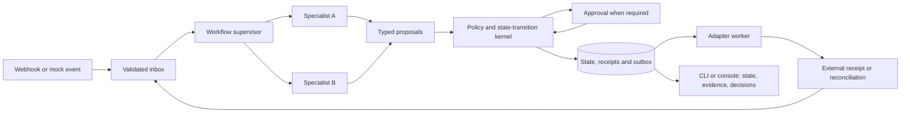

# Extensible agent application scaffolding: evidence and build blueprint

Research date: 23 September 2026. Scope: pure software; a reusable host for domain applications selected during the Smartstay sprint. Read-only project baseline: [`task_research.md`](../../task_research.md), especially §§4.1–4.4.

**[I] Architectural answer.** Build a small, versioned application SDK on top of a deterministic workflow kernel. An application registers its schemas, genuine operational responsibilities, permitted tools, model bindings, and a bounded coordination function. The host supplies persistence, policy enforcement, scheduling, approvals, model calls, replay, and observability. Default to supervisor-controlled specialist calls with structured proposals and an atomic state-transition service. Add MCP at tool boundaries and the A2A protocol at independently deployed agent boundaries. Keep these protocols out of ordinary in-process calls unless interoperability is itself required.

**[I] “Zero friction” is a developer-experience objective, not a property of arbitrary integrations.** Mounting an app in fewer than 50 lines is feasible after the host, domain adapters, and reusable contracts exist. It does not mean implementing a new PMS connector, approval policy, commercial negotiation algorithm, data model, and evaluation corpus in 50 lines. The correct promise is **small marginal application code, explicit supporting infrastructure, and no host edits for an app using existing capabilities**.

**[O] Executed evidence.** Retrieved 40 source records: 39 successful HTTP responses and one explicitly retained A2A documentation 404. Inspected official documentation, repository READMEs, package manifests, SDK source, and primary research abstracts. Built a 32-line sample application against a separate 145-line Python host proof and passed 14 offline tests. These are local contract tests, not live model benchmarks or a production certification. Source snapshots, SHA-256 hashes, retrieval outcomes, and proof files are under [`agent_template_evidence/`](agent_template_evidence/).

**[U] Not established.** Production hotel demand; a winning domain problem; API access to hotel systems; provider account entitlements; performance/cost of any model on actual hotel tasks; Jev's callable interface; production reliability of the proposed host. No live LLM calls, deployment, load test, external-action delivery test, or head-to-head framework benchmark was performed.

## Evidence conventions and decision criteria

| Marker | Meaning |
|---|---|
| **[D]** | Documented by an identified primary source. A repository's “production-ready” statement is its maintainers' claim, not this investigation's independent certification. |
| **[O]** | Observed in local files, HTTP results, source inspection, or executed tests. |
| **[I]** | Proposed architecture, engineering judgment, acceptance criterion, or inference. |
| **[U]** | Unestablished or untested. |

**[I] Reading rule.** A paragraph's marker covers its statements and following code block. In mixed tables, each cell or row identifies its evidence. All proposed defaults, budgets, and schedules below are design choices, not performance findings. Source identifiers link to the source register at the end; saved text provides searchable section/keyword locators.

**[O] Project alignment.** The existing dossier makes G3 depend on real asynchronous cross-responsibility constraints, G6 on a replayable end-to-end transaction, and G7 on advantage over a simpler deterministic control. It explicitly separates proposal, validated decision, external action, and observed completion. The scaffold must preserve those distinctions; it must not make a weak problem appear qualified by multiplying agents.

**[I] Evaluation lens.** Prefer a design that makes a new app easy to mount, a failed command easy to explain, and a committed action easy to audit. Assess state ownership, durable waiting, replay semantics, provider portability, typed boundaries, dependency compatibility, integration authority, and recovery. Repository popularity, agent count, and an animated chat transcript do not establish these qualities.

## 1. State of the art: separate the architectural layers

### 1.1 The layers that starter kits often conflate

| Layer | Responsibility | Evidence and implication |
|---|---|---|
| Model transport | Send requests, receive structured output/tool calls, expose usage and errors | **[D]** `google-genai` and OpenAI SDKs provide provider calls. **[I]** Hide provider differences behind adapters, while retaining native capability and usage metadata. [google_genai] [openai_python] |
| Agent execution | Instructions, tools, bounded reasoning/action loops, handoffs | **[D]** Agents SDK, ADK, Pydantic AI, and AutoGen expose variants of these primitives. **[I]** An agent loop is not a business transaction manager. [agents_readme] [adk] [pydantic_ai] [autogen] |
| Workflow execution | Scheduling, dependencies, waits, checkpoints, retries, resume | **[D]** LangGraph, CrewAI Flows, and Microsoft Agent Framework document workflow facilities. **[I]** Select one owner of workflow lifecycle. [langgraph_interrupt] [crewai_flows] [maf] |
| Tool interoperability | Discover and call tools; retrieve resources/prompts | **[D]** MCP standardizes this boundary and explicitly does not dictate LLM/context orchestration. [mcp_architecture] |
| Agent interoperability | Discover separately implemented agents; exchange messages, tasks, artifacts, status | **[D]** A2A standardizes this boundary while preserving opaque implementations. [a2a_spec] [a2a_home] |
| Business kernel | Authority, resource constraints, state transitions, receipts, action intent | **[I]** This remains application-owned even when a framework handles conversations or checkpoints. Use transactions and explicit policies. [sqlite_transaction] [outbox] |
| Product host | Install/mount apps, route events, expose approved capabilities, render work and evidence | **[I]** This is the starter kit being proposed. It should wrap a selected runtime, not duplicate every framework feature. |

### 1.2 MCP: host/client architecture, not an OS scheduler

**[D]** MCP's architecture names a host application, a client per server connection, and servers exposing tools, resources, and prompts. The inspected architecture documents JSON-RPC, stdio for local process communication, and Streamable HTTP for remote services. The scope statement is explicit: MCP does not dictate how applications use LLMs or manage context. [mcp_architecture]

**[O] Version sensitivity matters.** The architecture URL redirected to a `2026-07-28` edition, which describes stateless discovery through `server/discover` and deprecates sampling. The security URL retrieved a `2025-11-25` edition. These are different versioned documents; do not mix their handshake details into hand-written protocol code. Record negotiated versions and use an official compatible SDK. The scaffold blueprint depends on the stable host/client/tool separation, not a particular handshake. [mcp_architecture] [mcp_security]

**[I] Recommended use.** Implement a `ToolGateway` that can dispatch either a local typed callable or an MCP tool with the same application-facing contract. Host-issued identity, property scope, tool allowlist, timeout, input/output validation, and audit policy apply to both. An MCP server advertising `refund` does not grant authority to refund, and discovery metadata is not trusted executable policy. Do not create an MCP process for every local function just to display a protocol badge.

**[D]** MCP security guidance discusses confused-deputy and token-passthrough risks. **[I]** Keep server trust, delegated authorization, and business approval separate; do not forward arbitrary provider credentials to tool servers or accept unreviewed server launch commands from a plugin manifest. [mcp_security]

### 1.3 Swarm and Agents SDK: handoff versus specialist-as-tool

**[D]** Swarm describes itself as experimental and educational, is stateless between calls, and directs production users to the OpenAI Agents SDK. Its small `Agent`/handoff primitives are useful to study; its README is not an appropriate production starter recommendation. [swarm]

**[D]** The current official OpenAI agent guide distinguishes application-owned Agents SDK orchestration from hosted Agents API orchestration and direct Responses API use. The SDK runs inside the application, with application-controlled deployment, storage, approvals, and integration. The repository exposes agents, tools, handoffs, guardrails, sessions, and tracing. [openai_agents] [agents_readme]

| SDK pattern | Actual control behavior | Scaffold consequence |
|---|---|---|
| Handoff | **[D]** Represented to the model as a tool; delegates control to a target agent. `input_type` specifies handoff arguments; `input_filter` controls transferred history. [agents_handoffs] | **[I]** Useful for changing the owner of an interactive conversation; do not mistake it for an atomic transfer of hotel inventory or authority. |
| `Agent.as_tool()` | **[D]** Exposes an agent as a callable specialist; source exposes output extraction, nested-run configuration, and turn limits. [agents_source_pinned] | **[I]** Prefer when a coordinator needs a bounded specialist result and then resumes its own workflow. Validate the returned proposal at the business boundary. |
| Local context | **[D]** `RunContextWrapper` carries application dependencies; it is not sent to the model automatically. Nested runs share underlying app context rather than receiving isolated copies. [agents_context] | **[I]** Pass scoped read interfaces and immutable snapshots; never infer isolation from separate agent names. |
| Approval/resume | **[D]** `needs_approval`, interruptions, and serializable `RunState` support pause/approve/reject/resume, including nested tools. [agents_human] | **[I]** Persist the application's approval record and payload/version binding as well. An SDK approval cannot supersede a later stale-state rejection. |
| Tracing | **[D]** Enabled by default; generation and function spans can contain input/output data. [agents_tracing] | **[I]** Configure export and redaction deliberately; local case events remain the business audit record. |

**[O] Repository inspection.** `src/agents/agent.py` was fetched both from `main` and commit `32edd3c3ecde37a7fb6bf4b082f35f1d8f7f086b`; the bytes matched. The inspected `as_tool()` interface accepts `max_turns` and per-run configuration. This is implementation evidence for composable specialist execution, not proof of automatic durable business transactions. [agents_source_pinned] [agents_commit]

### 1.4 Framework comparison: useful abstractions and their costs

| Option | Documented strengths | Engineering cost / failure exposure | Fit for this starter |
|---|---|---|---|
| Agents SDK | **[D]** Lightweight agent/tool/handoff API, approvals, structured outputs, model abstraction, tracing. [agents_readme] [agents_models] | **[I]** SDK result/history/context objects can spread through domain code; nested context can be shared. Session history is not the hotel ledger. | **[I]** Strong optional agent-loop implementation behind a narrow executor interface. |
| LangGraph `StateGraph` | **[D]** Typed state examples, graph routing, checkpoint/thread persistence, interrupts and resume. [langgraph_durable] [langgraph_interrupt] | **[D]** Interrupted nodes restart from their beginning; preceding side effects must be idempotent. **[I]** Developers must understand reducers, checkpoint ownership, replay, and node boundaries. | **[I]** Prefer if multi-step waiting/restart is central and the team can use it confidently. Keep domain commits behind a separate transactional service. |
| AutoGen | **[D]** Core message passing/event-driven runtime; higher-level AgentChat and Extensions. Current README says maintenance mode and recommends Microsoft Agent Framework for new projects. [autogen] | **[I]** Old tutorials and current APIs may differ; avoid starting a new host on a superseded API without a specific compatibility reason. | **[I]** Architectural reference and existing-code option, not default greenfield selection. |
| Microsoft Agent Framework | **[D]** Graph orchestration, checkpointing, streaming, HITL, middleware, OpenTelemetry, provider support, declarative agents and skills are documented. [maf] | **[I]** Broader lifecycle and abstractions to learn. Provider flexibility does not remove integration-contract tests. | **[I]** Credible alternative when the team already knows its workflow model or needs its ecosystem. Not rejected merely for being Microsoft. |
| CrewAI Crews + Flows | **[D]** Role-based collaborative Crews; event-driven Flows, typed Pydantic state, persistence, routing and human feedback. SQLite is the documented default flow persistence implementation. [crewai] [crewai_flows] | **[I]** Crew/task/flow abstractions and package footprint add concepts. Do not conflate flow state persistence with exactly-once external effects. | **[I]** Fast for teams already fluent in Crews/Flows; less attractive for a minimal new cross-provider kernel. |
| Google ADK | **[D]** Current repository documents ADK 2.0 graph workflow runtime, task delegation, tools/MCP, confirmation, and local CLI/Web UI; optimized for Gemini but described as model-agnostic. [adk] | **[I]** Workflow/session conventions and fast-moving APIs must be pinned. A Gemini-native development UI could save real work. | **[I]** Serious alternative for a Gemini-first team; compare the same recovery slice before choosing custom code. |
| Pydantic AI | **[D]** Typed output, dependency injection via context, function tools, model abstractions; current docs link optional durable execution and separate graph/eval packages. [pydantic_ai] | **[I]** Attractive type boundary, but adding its complete harness, durability integrations, and another orchestration engine can erase the simplicity benefit. | **[I]** Good alternative executor for Python. Install only selected provider extras and keep domain contracts independent. |
| Custom actor/transactional outbox | **[D]** SQLite transactions and the outbox pattern address local atomic writes and the database/message dual-write problem. [sqlite_transaction] [outbox] | **[I]** You own timers, worker leases, crash recovery, migrations, approvals, and delivery ambiguity. Less dependency lock-in can mean more maintenance risk. | **[I]** Recommended bounded kernel for a single-machine demo, provided recovery tests pass. Do not grow it into an untested distributed workflow platform. |

**[I] Heavy versus lean is a measured tradeoff, not a slogan.** A larger framework that already solves the team's hardest lifecycle problem may be faster than a custom kernel. “Debugging hell” is not an empirical finding of this investigation. The inspectable risks are hidden state, overlapping retry loops, mutable shared context, replayed effects, incompatible packages, and failure to expose the actual business state.

**[O] Dependency evidence from downloaded package manifests:**

| Inspected package manifest | Declared direct dependencies | Relevant declarations |
|---|---:|---|
| `openai-agents` (`0.22.3` in retrieved project metadata) | 12 | `openai>=3.0.0,<4`, `pydantic>=2.12.2,<3`, MCP and transport packages. [agents_pyproject] |
| `langgraph` (`1.2.12` in retrieved project metadata) | 6 | Includes LangChain core, checkpoint, SDK, prebuilt packages; therefore six is not the transitive footprint. [langgraph_pyproject] |
| `crewai` manifest | 31 | Includes `crewai-core==1.15.22`, CLI, storage/document/telemetry dependencies, and `openai>=2.30.0,<3`. [crewai_pyproject] |

**[I] Concrete consequence.** The inspected Agents SDK and CrewAI OpenAI dependency ranges do not overlap. Those exact declarations cannot share one resolved OpenAI package version in one interpreter. This is a reason to select one executor, use isolated runtimes if genuinely necessary, or resolve a compatible release combination before the sprint. These counts are source observations, not installed size, speed, vulnerability count, or import-time measurements. No package-resolution experiment was run.

### 1.5 Practical research: what multi-agent papers do and do not establish

**[D]** ReAct studies interleaved reasoning and environment actions, including information retrieval and interactive task benchmarks. It motivates observations between decisions, not a requirement for multiple agents or free-form debate. The AutoGen paper describes programmable multi-agent conversations mixing models, humans, and tools. [react] [autogen_paper]

**[D]** The retrieved abstract of *Why Do Multi-Agent LLM Systems Fail?* reports a failure taxonomy grouped into system-design issues, inter-agent misalignment, and task verification. Its evidence concerns its reported models, traces, frameworks, and tasks. It does not establish performance for a Georgian hotel workflow or the user's current models. [mas_failures]

**[I] Design translation.** Make roles and ownership explicit; attach evidence and versions to messages; bound interaction; require an independent deterministic outcome check. Compare a rule baseline, a single-agent-with-tools baseline, and the coordinated system on the same cases. Additional agents are justified only by a measured benefit or a required responsibility boundary.

## 2. The pluggable “agent-as-an-app” contract

### 2.1 App, agent, skill, tool, and AgentCard are different objects

**[I] App:** a versioned deployable workflow capability, including contracts, registered responsibilities, allowed actions, policies, fixtures, and migrations. **Agent:** a bounded decision-making executor for one responsibility. **Skill:** reviewed instructions/resources that inform execution; it does not grant permissions. **Tool:** an explicitly typed operation implemented by trusted code or an authenticated adapter. An app may contain deterministic steps and several agents; a deterministic classifier does not need to masquerade as an LLM.

**[D]** A2A's AgentCard publishes discovery and interoperability information, including name/description, supported interfaces, version, capabilities, security information, skills, and input/output modes. The inspected specification documents `/.well-known/agent-card.json`. It also defines messages, tasks, artifacts, task status, cancellation, and multiple protocol bindings. [a2a_spec]

**[I] Do not rename an internal manifest “A2A compliant.”** An internal AppManifest carries dependencies, detailed JSON Schemas, policy IDs, migration hooks, and executable handlers that need not be exposed publicly. Generate an external AgentCard from a deliberately limited projection only when an A2A server actually implements the selected specification. App JSON Schemas are not automatically standard AgentCard fields; expose them through task payload contracts or an explicit compatible extension. Keep secrets, internal prompts, database locators, and authority rules private.

### 2.2 Required manifest fields and registration checks

| Contract field | Content | Mount-time / runtime rule (**[I]** throughout) |
|---|---|---|
| Identity | Namespaced `app_id`, semantic `app_version`, `sdk_abi`, description, owner | Reject duplicate ID/version and incompatible ABI; pin installed digest. Version ongoing runs separately from new registrations. |
| Entry points | Event types and handler names | Explicit registry; no arbitrary import path supplied by an inbound event. Reject ambiguous routing. |
| Agent roles | Stable role ID, purpose, persona/instruction resource, capabilities, binding alias | Require meaningful responsibility, allowlisted peers and tools, bounded execution. Persona text cannot override policy. |
| Contracts | Input, result, state, and event JSON Schemas, each with a version | Compile at mount; reject unknown fields; validate every trust boundary. Export Draft 2020-12 as canonical contracts. |
| Dependencies | Tool IDs/versions, optional app capability IDs, model capability requirements | Resolve at startup; detect missing or cyclic initialization dependencies; distinguish optional features explicitly. |
| Tools/actions | Namespaced tool ID, argument/result schema, timeout, effects classification | Restrict reads/writes to host-scoped capabilities; enforce authorization in handler, not just model-visible tool lists. |
| State ownership | App-local fields, shared resource references, expected source versions | App cannot directly write another app's state. Shared inventory/finance constraints go through the kernel. |
| Policy | Policy version, allowable transitions, money/communication/availability authority, approval route | Evaluate outside the LLM before commit and before external execution where needed. |
| Coordination | Allowed topology, round/call budgets, deadline, fallback/escalation | No unbounded loops or recursively re-created budgets. |
| Lifecycle | Migration, compatibility, health checks, fixtures, shutdown hook | Hot reload only for development/new runs; draining or migration for in-flight work. |

**[I] Loading sequence:** discover trusted installed packages → parse/freeze manifest → validate schemas → resolve dependencies/bindings → check capability compatibility → load policies → register event routes → run offline smoke fixture → mark ready. Startup reports unavailable capabilities explicitly. A missing Jev adapter must not silently route classification to another model.

**[I] Type discipline.** In Python, use Pydantic models with `extra='forbid'` and deliberate strict numeric validation at boundaries, typed `Protocol`s for ports, and a static checker in CI. In TypeScript, use strict compiler settings plus Zod/another runtime validator; TypeScript interfaces disappear at runtime. Generate JSON Schema from one canonical definition where practical; contract-test exported schemas rather than hand-maintaining diverging TS/Python variants. Provider-specific schema subsets require a separate compilation/compatibility check.

### 2.3 Actions, webhooks, and queries

**[I] Action contract:** `ToolSpec(id, input_schema, output_schema, effect, required_scope, deadline, idempotency_mode, implementation)`. Distinguish `read`, `propose`, `local_commit`, and `external_effect`. A model may choose a permitted action and fill arguments; it cannot choose its own property identity, authority, connector credentials, or SQL statements.

**[I] Webhook intake:** authenticate the sender → preserve raw-body digest → map to a canonical event with source ID/version → deduplicate → persist inbox row → acknowledge receipt → schedule app processing. A received event is not necessarily ordered or true; reconcile source versions and query authoritative state for consequential writes. Use parameterized, predeclared database query tools with host-injected tenant filters. Treat message bodies and tool results as data, never as new permissions.

**[I] External action path:** validated proposal → business-policy decision → human approval when required → transactional action intent → adapter execution → receipt/reconciliation → observed completion. A tool that submits an email or a refund should not directly mutate the case to “guest served” or “cash settled” without confirmation evidence.

### 2.4 Model binding without lowest-common-denominator behavior

| Binding | Documented / observed status | Proposed role and boundary |
|---|---|---|
| `reasoner → gemini-3.8-flash`, HIGH | **[D]** Current Google model listing names Gemini 3.8 Flash; thinking documentation lists `gemini-3.8-flash` with low/medium/high. [google_models] [google_thinking] | **[I]** Candidate for ambiguous interpretation and bounded constraint proposals. Benchmark HIGH against lower effort for this workflow; never use it to enforce arithmetic or database invariants. **[U]** Account availability, latency, and advantage remain untested. |
| `classifier → Jev` | **[O]** No Jev implementation/interface was found in the inspected project research/docs/scripts/schema files. **[U]** Provider API, schema behavior, determinism, calibration, and performance are unestablished. | **[I]** Define a typed decision port and require contract/evaluation results before binding. Use an explicitly labeled fixture adapter for offline work; do not claim Jev integration exists. |
| `policy → deterministic` | **[I]** Local arithmetic, set/constraint checks, permissions, idempotency, transitions | A regular function; no model request, token cost, or anthropomorphic role is necessary. |
| `developer/reviewer → gpt-6-astra` | **[D]** Current OpenAI structured-output guide uses this identifier in examples. [openai_structured] | **[I]** Development/review use and runtime use are separate decisions. Do not infer API account entitlement or hotel-domain superiority from the name or its use in Codex. |
| `mock → fixture` | **[O]** Executed in the proof, with deterministic schema-shaped outputs | Offline replay and failure injection. Label as mock in every event and UI. |

**[I] Provider-neutral request:** binding ID/version, exact model ID, instructions, scoped messages, output schema, allowed tools, deadline, call/token budget, and provider-specific options. **Result:** validated output or typed failure, usage with native counters, request ID, finish/refusal reason, latency, and provenance. Keep `provider_options` explicit and validated; do not translate every provider's HIGH setting into an invented universal token budget.

**[D]** The Agents SDK model documentation warns that some compatible providers do not support schema-constrained output. Google SDK source exposes `ThinkingConfig.thinking_level`, `GenerateContentConfig.response_json_schema`, and asynchronous generation. **[I]** “OpenAI compatible” is a transport claim until tool calls, structured output, streaming, error handling, and usage have passed the adapter's tests. [agents_models] [google_genai] [genai_types]

### 2.5 Context and memory: pass views, not globals

**[I] Construct a fresh execution context per `(tenant_id, property_id, app_id, case_id, run_id)`**, containing immutable snapshot/version references, actor identity, bounded capability clients, clock, budgets, and trace writer. Inject the model adapter and repository through constructors. Share connection pools only through scoped services; never keep the “current hotel,” conversation, role, or mutable case state in module globals.

| Memory class | Owner / lifetime | Rule (**[I]**) |
|---|---|---|
| Authoritative operational state | Kernel/source-of-record adapters; durable | Structured and versioned; only validated commands mutate it. |
| Run working state | One workflow run; checkpointed if needed | Explicit serializable state; save node/result receipts separately from prose. |
| Model context | Per-agent projection; bounded | Include necessary facts with source/version/age; do not dump every agent's transcript. |
| Long-term knowledge | Tenant-scoped curated repository | Optional retrieval with provenance, retention and correction; no automatic vector DB on day one. |
| Secrets and connection handles | Process-scoped credential provider | Rehydrate via handles; exclude from model context, checkpoints, manifests, and public cards. |

**[I] Handoff envelope:** task/case IDs, responsibility, goal, input schema version, relevant facts/evidence, expected state/resource versions, deadline, permitted actions, reply schema, correlation/causation IDs, and remaining global budget. Return a proposal, unresolved constraints, evidence references, and status. Send only the context required by the receiver. An acknowledgement is not completion, and a generated rationale is not source evidence.

## 3. Coordination topology and failure control

### 3.1 Default: supervisor plus typed requests and a durable event log

**[I] Recommended composition:** a deterministic workflow coordinator controls lifecycle; specialized agents interpret evidence and propose actions; policy/constraint functions decide whether proposals may commit. Independent read-only specialist work may run concurrently. Conflicting updates serialize at the state boundary. The coordinator can use a model for bounded planning, but the model never owns the durable scheduler or the commit lock.



| Pattern | Best use | Principal failure risk | Recommended controls (**[I]**) |
|---|---|---|---|
| Supervisor / orchestrator | One accountable case owner coordinates dependent responsibilities | Bottleneck; opaque planner; waiting forever for a specialist | Persisted stage, typed results, parallel independent reads, explicit deadlines, bounded replans, deterministic join/validation. |
| Peer-to-peer handoff | Ownership genuinely changes; conversational triage or independent remote service | Circular transfers, losing context/authority, no accountable closer | Allowlisted routes, explicit acceptance, global hop budget, handoff envelope, timeout back to owner. |
| Shared blackboard | Specialists need a common structured snapshot | Lost writes, stale reads, shared prompt contamination | Versioned state and compare-and-swap; append proposals instead of mutating shared objects. |
| Event bus | Asynchronous events, work completion, adapters, observability | Duplicate/out-of-order delivery, fan-out loops, events mistaken for transactions | Inbox dedupe, causation IDs, per-resource ordering/version checks, durable outbox and idempotent handlers. |

**[I] These are not mutually exclusive.** Use a supervisor for decisions, a structured blackboard for state, and events for durable facts and notifications. Avoid making every specialist a free-running bus subscriber. Start with in-process calls; preserve the message contract so a specialist can move behind A2A later without changing the business transaction semantics.

**[D]** The inspected A2A specification separates task/message operations from transport bindings, supports input/auth-required states, and defines task cancellation. **[I]** An A2A `completed` response is a remote task result; the host must still validate its domain result and commit authority. Cancellation does not prove an external side effect was undone. [a2a_spec]

### 3.2 Finite workflow, not an endless conversation

**[I] Proposed lifecycle:** `received → validated → planning → collecting_proposals → checking → awaiting_approval | committed → executing → reconciling → completed`. Alternative explicit outcomes: `rejected`, `expired`, `canceled`, `failed`, `needs_human`, and `external_status_unknown`. Only a documented receipt or tested local completion predicate permits `completed`; exhaustion produces escalation, not a confident answer.

| Failure | Enforce in code (**[I]**) | What the demo should show |
|---|---|---|
| A ↔ B handoff loop | Shared persisted hop/round/call budget; reject repeated `(responsibility, goal, snapshot hash)` with no progress | Visible stop reason and unresolved responsibility. |
| Agent changes wording but makes no progress | Compare satisfied constraints and proposal/state versions, not prose | Escalation after bounded unchanged rounds. |
| Deadlock waiting for a peer | Coordinator-owned dependency graph, deadlines, no peer-held database locks; reject wait cycles | Timeout moves case to an explicit pending/failed state. |
| Model/tool timeout | Per-call native timeout plus workflow deadline; cancel outstanding local work and invalidate late results by run generation | Late reply cannot commit to a canceled or revised run. |
| Worker dies | Durable work item, lease expiry, attempt counter, persisted result receipt | Reclaim or reconcile without duplicating a committed intent. |
| Repeated malformed output | Schema validation, bounded repair attempts charged to the same budget | Reject after limit; no automatic text-to-permission conversion. |
| Concurrent conflicting proposals | Validate all affected resource versions in one short transaction | Exactly one succeeds; the other replans or escalates. |
| Human pause | Persist pending approval; release worker/SQL lock; resume from authenticated decision event | Restart while waiting, then approve/reject the same payload. |
| Provider rate limit | Bounded backoff with jitter, account concurrency cap, deadline-aware retry | Trace explains backoff and eventual stop. |
| External response lost | Mark status unknown; query by idempotency key or reconcile before retry | Never assume “timeout” means “not executed.” |

**[I] Suggested initial configuration:** at most two revision rounds, four specialist requests per round, and a separate workflow deadline; use different deadlines for interactive interpretation and long human waits. These are starting knobs to test, not measured optimal values. Store remaining budgets in run state so resume/retry/subagents cannot reset them. Reserve budget before parallel calls; count unsuccessful attempts and retries.

**[I] Human interruption must bind a concrete action.** Persist `approval_id`, tenant, actor scope, app/policy version, action payload hash, expected resource versions, expiry, and decision. Display the action, relevant evidence, amount/currency if applicable, and consequences. Edits create a new proposal version. Revalidate authorization and state before execution; an old approval never authorizes a different amount or a changed booking. Existing authorized policy paths can execute without repetitive approvals.

**[D]** LangGraph documents that resuming an interrupt restarts the containing node, and side effects before the interrupt can be repeated. Agents SDK documents serializable paused run state. **[I]** In either case, put consequential effects behind idempotent application commands and receipts rather than relying on stack position or conversational state. [langgraph_interrupt] [agents_human]

### 3.3 Where A2A complexity earns its place

**[I] Good fit:** several responsibilities possess distinct, changing constraints and must exchange proposals/commitments before a permitted action. Independent agents can provide scoped interpretation or negotiation, while the coordinator verifies the result. **Poor fit:** `approved = min(requested, stock, budget)` with fully structured inputs; a deterministic rule solves it directly. The included sample deliberately falls into the latter category so it proves extension mechanics without pretending to validate a hotel product.

**[I] A2A is not a fast distributed lock.** Avoid placing LLMs in the critical path of sub-second inventory exclusion, money arithmetic, or uniqueness constraints. Use transactional state/resource arbitration for these. Agents may interpret exceptions or propose recovery plans around that kernel. Neither a handoff nor a message bus creates an atomic transaction across unrelated OTA/PMS APIs.

## 4. Infrastructure to prebuild once

### 4.1 Minimum host, deferred features, and honest readiness

| Build into the initial host (**[I]**) | Purpose / acceptance check | Defer unless the chosen app requires it |
|---|---|---|
| Registry, schema compiler, capability resolver | Mount two different apps without editing core; fail startup on missing binding | Public plugin marketplace or hot-loading arbitrary code. |
| Model port, fixture provider, Google and OpenAI adapters | Same schema/error/usage contract; explicit provider limitations | A universal router over dozens of providers. |
| Scoped context, deterministic tools, policy kernel | No cross-property state access; reject forbidden action | Generic SQL/shell/code-execution tools. |
| SQLite state/inbox/outbox/receipts | Atomic local commit, stale update rejection, crash/retry behavior | Distributed event broker and multi-region state. |
| Scheduler, budgets, cancellation, persistent wait | No unbounded execution; restart during human wait | Unrestricted agent self-spawning. |
| CLI event stream and case inspector | Explain each decision and actual state without reading model prose | Custom graph animation or large dashboard stack. |
| Seed/reset/replay fixtures | Run complete demo offline with repeatable outcomes | Mandatory live hotel connections for the judging path. |
| Structured evals and deterministic baseline | Correct state and effects checked under failures | LLM-only grading as the success oracle. |

**[I] Production-oriented does not mean production-complete.** Before real hotel use, the host also needs authenticated actors, tenant isolation enforcement, managed secrets, tested migrations/backups, resource-level concurrency, adapter reconciliation, retention controls, dependency maintenance, and operational ownership. These are specific engineering boundaries of the proposed runtime; a small app registration function does not implement them.

### 4.2 Unified model adapter: use native SDKs through a small port

**[I] Port shape:** `async propose(request, cancel) -> ModelResult`. The host owns retries, budget reservation, correlation IDs, deadlines, and schema validation. Keep provider calls as leaf operations. Avoid an SDK retry loop nested inside an executor retry loop nested inside a worker retry loop; set a single attempt budget and record native automatic retries if retained. For consequential tools, disable automatic provider-side execution and route calls through the ToolGateway.

**[D]** Google's README documents `client.aio.models.generate_content`, JSON schema output configuration, and native SDK clients. OpenAI's documentation demonstrates structured output through Responses and Chat Completions, and the Python SDK exposes async clients. The following uses these documented surfaces. [google_genai] [genai_types] [openai_structured] [openai_python]

**[I] Copy-ready adapter primitive for schema-compatible models.** This is a proposal-only example with an injected native client. It is not an entire agent loop. Its schema must first pass provider compatibility checks; canonical Draft 2020-12 is broader than providers' supported subsets. Both timeout and output budget below are example configuration, not measured requirements. No provider request was executed in this investigation.

```python
import asyncio
import json
from jsonschema import Draft202012Validator

async def json_proposal(provider, client, model, prompt, schema):
    Draft202012Validator.check_schema(schema)
    provider_schema = {k: v for k, v in schema.items() if k != '$schema'}
    async with asyncio.timeout(30):
        if provider == 'google':
            response = await client.aio.models.generate_content(
                model=model, contents=prompt,
                config={'response_mime_type': 'application/json',
                        'response_json_schema': provider_schema,
                        'thinking_config': {'thinking_level': 'HIGH'},
                        'max_output_tokens': 1024})
            if not response.candidates or len(response.candidates) != 1:
                raise ValueError('missing or ambiguous candidate')
            reason = response.candidates[0].finish_reason
            if getattr(reason, 'value', reason) != 'STOP':
                raise ValueError('incomplete or blocked generation')
            text, usage = response.text, response.usage_metadata
        elif provider == 'openai_responses':
            response = await client.responses.create(
                model=model, input=prompt, max_output_tokens=1024,
                text={'format': {'type': 'json_schema', 'name': 'proposal',
                                 'strict': True, 'schema': provider_schema}})
            if response.status != 'completed':
                raise ValueError('incomplete generation')
            text, usage = response.output_text, response.usage
        elif provider == 'openai_chat':
            response = await client.chat.completions.create(
                model=model, messages=[{'role': 'user', 'content': prompt}],
                response_format={'type': 'json_schema', 'json_schema': {
                    'name': 'proposal', 'strict': True, 'schema': provider_schema}})
            if len(response.choices) != 1:
                raise ValueError('missing or ambiguous choice')
            choice = response.choices[0]
            if choice.finish_reason != 'stop' or choice.message.refusal:
                raise ValueError('incomplete or refused generation')
            text, usage = choice.message.content, response.usage
        else:
            raise ValueError('unsupported provider; no silent fallback')
    if not text:
        raise ValueError('no structured answer')
    value = json.loads(text)
    Draft202012Validator(schema).validate(value)
    return {'output': value,
            'native_usage': usage.model_dump() if usage is not None else None}
```

**[I] Client wiring:** Google uses `from google import genai; client = genai.Client(api_key=...)`; OpenAI uses `from openai import AsyncOpenAI; client = AsyncOpenAI(api_key=..., max_retries=0)`. A compatible Chat Completions endpoint can be supplied through an explicitly configured `base_url`, with a separate credential reference. Instantiate/close clients at host startup/shutdown, never per token or through mutable global “current client” state. The fixture adapter implements the same logical port without network access. Set a provider-supported output limit for the Chat Completions branch during capability binding; parameter names differ across compatible endpoints.

**[I] Before calling this primitive in production:** verify exact model/API version, schema subset, output-limit parameter, thinking support, refusal handling, usage fields, timeout cancellation behavior, and streaming tool-call reconstruction. Preserve provider request IDs, error categories, model identity and native usage in the surrounding adapter. A missing field must remain unknown rather than silently becoming zero. Google's thinking guide currently illustrates the Interactions API, while the SDK source retains GenerateContent thinking configuration; the shown GenerateContent/model combination still requires an account-level contract test. [google_thinking] [genai_types]

### 4.3 SQLite: local atomicity and durable action intent

**[D]** SQLite supports transactions with commit/rollback. WAL permits readers alongside a writer, but there is still only one writer at a time and WAL is not suitable for a shared network filesystem. **[I]** Use one local database for the first demo, short write transactions, busy handling, and a bounded number of workers. Do not hold a transaction open during an LLM call or a human wait. [sqlite_transaction] [sqlite_wal]

| Table (**[I]**) | Key information |
|---|---|
| `apps` / `runs` | Installed manifest digest, app/policy versions, status, deadline, remaining budgets, cancellation generation. |
| `inbox` | Source event ID + tenant/source uniqueness, source version, raw digest, normalized payload, processing state. |
| `cases` / `resources` | Current versioned case state and shared resource state/reservations. |
| `commands` / `receipts` | Tenant/app-scoped idempotency key, request fingerprint, expected versions, accepted/rejected result. |
| `events` | Immutable sequence, actor, correlation/causation, state delta, evidence references. |
| `outbox` | Stable effect ID, payload, ordering key, status, attempts, lease, next attempt, external receipt or ambiguity. |
| `approvals` | Exact payload/version/policy binding, authorized decision, expiry and audit. |
| `agent_results` | Validated result, input snapshot hash, adapter/model/prompt version and usage. |

**[I] Local commit algorithm:**

1. Read scoped snapshots; perform expensive model/read-only work outside the transaction.
2. `BEGIN IMMEDIATE`; check duplicate command/fingerprint, cancellation, policy, approval and all affected resource versions.
3. Validate invariant-preserving state transition; update shared resource reservations and case state together.
4. Insert immutable event, action intent(s), and command receipt in the same transaction.
5. Commit; a separate worker later claims outbox work. On validation/error, roll back all local writes.

**[I] Cross-case correctness.** A case version alone is insufficient when two different cases consume the same room, budget, or service capacity. Check/update the shared resource version or reservation constraint in the same transaction. A process-local actor mailbox is not enough after adding another process; retain database enforcement. In-memory mode is for disposable tests and explicitly has no crash durability.

**[D]** AWS's outbox guidance describes the database/event dual-write problem, duplicate-delivery handling, ordering, and rollback. **[I]** The achievable default is atomic local intent plus at-least-once delivery and idempotent/reconciled effects. Do not promise exactly-once end-to-end execution or atomic rollback of an already sent email, OTA update, or refund. A compensating action is a new authorized operation, not a SQL rollback. [outbox]

**[I] Recovery contract.** If a worker crashes before send, retry its lease-expired intent. If it crashes after the remote service applied an effect but before receipt persistence, reuse the external idempotency key or reconcile against an external identifier. If the adapter cannot distinguish success from nonexecution, mark the action unknown and escalate; do not blindly retry financial/availability actions. Resume from recorded agent results where possible. Replaying saved outputs is reproducible; asking the model again is a new nondeterministic attempt.

### 4.4 Observability: show work, evidence, state and cost

**[I] Start with JSONL events and a terminal renderer.** Give the console a read-only stream of persisted events with a cursor; reconnect from the last sequence. A Web UI can use SSE for one-way updates, plus authenticated commands for approval/cancel/retry. It must never mutate a database row merely because a browser button changed its local state.

**[I] Event envelope:** `event_id`, sequence, timestamp, tenant/property, app/version, case/run, correlation/causation, actor/role, event type, expected/new state versions, sanitized summary, evidence IDs, model/provider/request ID, latency, token counters, pricing version, and error category. Display proposal → rejection/revision → approval → committed intent → external confirmation distinctly. “Agent negotiations” should be structured proposals and reasons, not a theatrical chat log.

**[I] Cost accounting:** preserve native usage and normalize it with a versioned provider mapping. Compute estimated cost from disjoint billed categories and dated per-model prices; cached input and reasoning counters may be subsets of other counts, so adding all fields can double count. Use `null/unknown` for unavailable price or usage and label estimated versus billed cost. Include failed attempts where usage is known. Count deterministic steps as no model call, not as fabricated token usage. Store decision summaries and tool evidence; do not require hidden chain-of-thought disclosure.

**[D]** The inspected CrewAI Flows documentation explicitly distinguishes whole-flow aggregated usage from the last Crew result's usage, and notes that cache/reasoning counters can be breakdowns of totals. Agents SDK tracing can capture sensitive model/tool inputs. **[I]** These are reasons to test normalization and redact guest/private business data before export, independently of the selected framework. [crewai_flows] [agents_tracing]

### 4.5 Offline event generator and evaluation harness

**[I] Prebuild a fixture runner with a fake clock, seeded event IDs, injectable model responses, and mock adapters.** Supply JSONL inbound events plus expected terminal states/effects. Include duplicate, out-of-order, stale-data, timeout, malformed-output, refusal, delayed approval, cancellation, worker restart, and ambiguous external receipt scenarios. A fixture is visibly synthetic; a real redacted operator case retains provenance and consent constraints.

**[I] Proposed commands:** `host doctor`, `host list-apps`, `host replay fixture.jsonl --model fixture`, `host inspect CASE`, `host events --follow`, and `host reset --demo-only`. These are blueprint commands, not commands installed by this research task. The executed proof's real commands appear in §5.3.

**[I] Evaluate outcomes before agent eloquence.** Check valid terminal states, invariant violations, duplicate effects, missed commitments, escalation correctness, recovery, latency and cost. Compare identical cases under the deterministic baseline, a single agent with tools, and the coordinated app. Keep development and holdout fixtures separate. A fast multi-agent answer that commits an invalid action fails; a proper escalation can be a correct outcome.

## 5. Concrete workspace and developer experience

### 5.1 Proposed layout: one backend language, explicit boundaries

**[I] Choose Python for the first implementation.** The workspace already executes Python research/evaluation tools, and the proof runs on the installed interpreter. Use TypeScript only for a browser console if it materially improves the demo. A TypeScript backend is a reasonable alternative for a team fluent in it, but maintaining equivalent Python and TypeScript host implementations during the sprint adds avoidable work. Canonical JSON Schemas permit a later client SDK without duplicating the business kernel.

**[I] Proposed tree; these production packages are a blueprint, not files implemented by this research task:**

```text
smartstay-hackathon/
├── pyproject.toml                 # selected packages, scripts, checker/test config
├── uv.lock                        # one resolved, committed dependency set
├── .env.example                   # binding names and secret-variable names only
├── packages/
│   ├── core/src/smartstay_core/
│   │   ├── registry.py            # freeze/validate manifests and resolve capabilities
│   │   ├── coordinator.py         # bounded lifecycle, dependency joins, cancellation
│   │   ├── commands.py            # authority, invariants, version checks, transitions
│   │   ├── store.py               # SQLite repositories and transaction boundary
│   │   ├── outbox.py              # leases, delivery receipts, reconciliation
│   │   ├── approvals.py           # payload-bound durable approve/reject/resume
│   │   └── telemetry.py           # events, redaction, usage normalization
│   ├── sdk/src/smartstay_sdk/
│   │   ├── contracts.py           # Manifest, AgentSpec, ToolSpec, envelopes
│   │   ├── context.py             # typed, scoped capability ports
│   │   └── testing.py             # fixture model, fake clock, fixture runner
│   └── adapters/src/smartstay_adapters/
│       ├── models/                # google.py, openai.py, fixture.py; Jev when verified
│       ├── tools/                 # trusted local tools and optional MCP gateway
│       └── a2a.py                 # optional remote-agent boundary, not mandatory
├── apps/
│   ├── worker/                    # composition root, event intake, scheduler
│   └── console/                   # CLI first; optional TS UI reading API/SSE
├── examples/sample_app/
│   ├── app.py                     # manifest, specialist coordination, registration
│   ├── contracts.py               # domain schemas when larger than the small example
│   ├── skills/                    # reviewed role instructions/resources, if needed
│   └── fixtures/                  # synthetic happy path and failures
├── migrations/                    # numbered transactional schema changes
├── evals/
│   ├── contract/                  # model/tool/app boundary tests
│   ├── baselines/                 # deterministic and single-agent comparators
│   └── scenarios/                 # invariants, failure/restart tests, holdout replay
├── docs/                          # ADRs, app authoring guide, reset/demo runbook
└── research/                      # existing evidence remains separate from live state
```

**[I] Dependency direction:** `sdk` depends on contracts/validation, not the host; `core` implements SDK ports; `adapters` implement tool/model ports; a domain app imports SDK contracts only; `worker` is the composition root that wires them together. Console calls the worker API. No domain app imports the console, reaches into a global SQLite connection, or initializes another app as a side effect. For the very first slice these may be modules in one installable distribution rather than several independently published packages.

**[I] A plugin extension test is more valuable than an elaborate directory tree.** Mount a second app with different schemas, state and two role bindings using the same host. Its addition must require only package registration/configuration, new app files/fixtures, and genuinely new domain adapters. If the host contains conditionals such as `if app_id == 'hotel_x'`, refactor the extension boundary before adding more apps.

### 5.2 Actual copy-ready 32-line application

**[O] The following is the complete executed [`sample_app.py`](agent_template_evidence/proof/sample_app.py), including imports, schemas, domain coordination, validation and registration: 32 physical lines, including blank lines.** It mounts on [`mini_host.py`](agent_template_evidence/proof/mini_host.py), a separate 145-line support module. The host owns fixture model binding, schema validation, fresh context, timeout/call limits, optimistic version checks, local rollback, command receipts and an outbox row. This is a real runnable proof, not an import from an imaginary published SDK.

**[I] Domain semantics and limitation.** The sample concerns synthetic capacity and an authorized **unit** allowance. `spend_limit` is a maximum number of units, not a currency value or verified cash loss. Two fixture specialists return independent constraints; the deterministic tool computes their intersection. This proves mounting and coordination contracts only. A rule already solves this toy problem, so it would fail the project's G7 as a flagship AI use case. The minimal AgentSpec contains role/binding/output schema; full instruction resources, rich manifests and capability authorization follow the production contract in §2 rather than being hidden in the 32-line count.

```python
"""Synthetic proposal example; deterministic baseline already solves this case."""
import asyncio
from mini_host import AgentSpec, AppManifest

def object_schema(names):
    return {'$schema': 'https://json-schema.org/draft/2020-12/schema',
            'type': 'object', 'additionalProperties': False,
            'properties': {n: {'type': 'integer', 'minimum': 0} for n in names},
            'required': list(names)}

INPUT = object_schema(['requested', 'available', 'spend_limit'])
LIMIT = object_schema(['limit'])
OUTPUT = object_schema(['approved_units'])

async def handle(ctx, event):
    capacity, finance = await asyncio.gather(
        ctx.ask('capacity', {'available': event['available']}),
        ctx.ask('finance', {'spend_limit': event['spend_limit']}))
    return ctx.tool('bounded_proposal', {'requested': event['requested'],
                    'capacity': capacity['limit'], 'finance': finance['limit']})

def check(event, result):
    if result['approved_units'] > min(event.values()):
        raise ValueError('proposal exceeds source constraints')

def mount(host):
    host.mount(AppManifest(
        app_id='sample.capacity_budget', version='1.0.0',
        input_schema=INPUT, output_schema=OUTPUT,
        agents=(AgentSpec('capacity', 'reasoner', LIMIT),
                AgentSpec('finance', 'classifier', LIMIT)),
        tools=('bounded_proposal',), handle=handle, check=check))
```

**[O] Composition is explicit in the separate 21-line [`demo.py`](agent_template_evidence/proof/demo.py):** construct a host, supply `reasoner` and `classifier` fixture bindings, register the deterministic `bounded_proposal` tool, call `mount(host)`, and submit a versioned event. Adding a real provider changes the adapter/binding implementation, not application registration. The current fixture `Model.complete` port passes role, facts and output schema; a production executor must also apply the registered instruction resource, identity, budgets and usage envelope described above.

**[I] Honest line-count contract:** the app file is 32 lines; bootstrapping is 21 additional lines; the proof host is 145 additional lines; tests are 117 additional lines. A production host will be larger. A new app with new schemas, connectors, policies or evaluation cases must count that domain-specific work separately. The general “under 100 lines for any new app” claim remains unestablished; this experiment demonstrates one small app over prepared primitives.

### 5.3 Reproduce the executed local verification

**[O] Environment:** Python 3.12.3, `jsonschema` 4.26.0. No API key or model SDK is required by the offline proof. Run from the project root:

```bash
python3 research/derived/agent_template_evidence/proof/demo.py
python3 -m unittest discover -s research/derived/agent_template_evidence/proof -v
```

**[O] Actual demo output:**

```json
{"mode": "fixture", "result": {"approved_units": 5}}
```

**[O] Actual test result: 14 tests passed, exit code 0.** Full saved output: [`proof_test_results.txt`](agent_template_evidence/proof_test_results.txt). The tests cover:

| Executed check | Observed scope |
|---|---|
| Two-role mount and commit | Schema-shaped fixture outputs lead to one local proposal/outbox row. |
| Duplicate replay | Sequential retry returns the receipt without a second action intent. |
| Reused key, changed input | Rejects an idempotency key with a different request fingerprint. |
| Transaction rollback | Injected exception before commit leaves state, receipts and outbox empty. |
| Restart | Closing/reopening SQLite preserves receipt-based replay. |
| Isolation | Distinct tenant keys and copied nested context state remain separate in the test. |
| Stale version | Rejects a command against an old case version. |
| Concurrent proposals | Two in-process proposals from the same version cannot both commit. |
| Bad input | Rejects extra fields under the input schema. |
| Bad model output | Rejects a string where a numeric limit is required. |
| Inflated model output | Independent deterministic policy rejects a result exceeding source constraints. |
| Model deadline | A delayed fixture provider raises timeout. |
| Permissions and budget | Undeclared tool and exhausted local call budget are rejected. |
| Binding/registration errors | Missing model binding and duplicate app mounting are rejected. |

**[U] Proof limitations.** This is runtime schema validation, not a completed static type-safety audit. The 145-line module does not implement A2A/MCP transport, live LLM clients, authentication, durable approvals/timers, worker leases, external delivery, shared-resource arbitration across cases, migrations, backup recovery, distributed actors, or production observability. Its rollback test injects an exception; it does not kill an operating-system process during a disk write. Its restart test persists a completed command, not an interrupted LLM call. Its tenant/context tests are functional checks, not a security audit. Plugins are trusted Python code, not isolated untrusted programs. The adapter snippet in §4.2 was syntax-parsed but not imported against installed provider SDKs or called live.

### 5.4 Implementation sequence and stop conditions

**[I] Before domain selection, build only reusable mechanics:** manifest/schema validation; scoped model/tool ports; fixture mode; persistent command/event/outbox transaction; a CLI inspector; failure/replay tests; and a short app authoring guide. Store model IDs and provider options in bindings. Avoid hotel-specific assumptions in the kernel and defer new connectors until an actual problem requires them.

**[I] Within the 115-hour sprint, retain the existing dossier's evidence-first schedule:**

| Elapsed window | Architectural work and decision |
|---|---|
| 0–12 hours | Confirm candidate evidence and usable inputs while verifying the host runs offline. Do not spend discovery time on another agent framework migration. |
| 12–24 | Define the deterministic baseline, real responsibility boundaries, success oracle and permitted actions. Reject candidates failing G3/G4/G7. |
| 24–38 | Mount the selected app; finalize domain schemas, resource invariants, authority and fixture adapters. |
| 38–66 | Complete one persistent path through specialist proposals, state transition, adapter intent and observed result. |
| 66–84 | Finish failure handling, cancellation/approval resume, duplicate/out-of-order inputs, stale resources and restart/reconciliation tests. |
| 84–103 | Compare holdout cases against the baseline; obtain operator review; measure actual latency/usage. |
| 103–115 | Freeze dependencies and fixtures; rehearse live and offline demos; prepare reset/recovery and an evidence-led explanation. |

**[I] Framework selection stop rule.** If checkpointed waiting and restart are required immediately and the team cannot implement/test them in the bounded kernel, choose LangGraph, ADK, Agents SDK lifecycle primitives, or MAF as appropriate rather than improvising durability. Do not combine several orchestrators merely to satisfy a framework checklist. Retain the same app contracts and business kernel so the executor choice can change behind a narrow boundary.

**[I] Readiness gate for the starter kit:** a new prepared app mounts without host edits; invalid/missing dependencies fail closed; the same fixture runs offline; invalid/stale/unauthorized proposals never commit; retry/restart does not duplicate local intent; approval resumes the exact reviewed action; external uncertainty is visible; event traces explain state; and any claimed A2A advantage survives a deterministic baseline. The current proof satisfies only the subset explicitly tested in §5.3.

## 6. Research provenance, reproducibility, and unresolved questions

**[O] Retrieval method.** Used live `curl` requests to official documentation and raw public repository files, then BeautifulSoup text extraction for HTML. A focused Google search for official Agents SDK handoff documentation returned a redirect/interstitial page rather than useful results; direct official retrieval supplied the evidence. Initial collector requests failed DNS resolution, including the collector retry; those outcomes are retained in [`initial_network_failures.json`](agent_template_evidence/initial_network_failures.json). Subsequent direct curl batches succeeded except for the recorded A2A overview 404. The valid A2A home, README and specification were fetched explicitly; the failed URL was not silently treated as a source.

**[O] Repositories were inspected selectively, not cloned or exhaustively audited.** Evidence includes relevant READMEs, Python dependency manifests, OpenAI's `Agent` implementation, Google SDK type definitions, and an OpenAI commit snapshot. Documentation and `main` URLs can change. The local raw snapshots and hashes are the audit trail; the pinned OpenAI source is also linked by commit. Package versions in this report describe downloaded metadata, not a resolver-tested installation recommendation.

**[O] Input integrity.** `task_research.md` SHA-256 at inspection: `f0ee1ae0c272a54e56a64c25e3351aacf21bd10a78a8a0be2b88a445958095c3`. The task's existing research was read and left unchanged. Environment metadata is saved in [`local_environment.json`](agent_template_evidence/local_environment.json).

**[I] Retrieve an individual source without a search interstitial:**

```bash
curl -L --fail --retry 2 --max-time 60 \
  https://raw.githubusercontent.com/openai/openai-agents-python/32edd3c3ecde37a7fb6bf4b082f35f1d8f7f086b/src/agents/agent.py \
  -o /tmp/agents-agent.py
sha256sum /tmp/agents-agent.py
```

**[O] The retained [`collect.py`](agent_template_evidence/collect.py) implements curl retrieval plus extraction.** Its original run encountered DNS failures in this environment; direct tool-level curl calls supplied the final snapshots. The collector was subsequently adjusted to include supplemental URLs from the final manifest and default to a separate `refresh/` directory, preserving original evidence. That refresh path was syntax-checked but not rerun over the network. The final [`manifest.json`](agent_template_evidence/manifest.json) is the complete record for this investigation, including supplemental sources and observed redirects.

**[U] Questions for implementation, not reasons to invent certainty:** which domain problem passes the real evidence gates; whether Jev has the required API and evaluable behavior; which provider/version/account supports the chosen output and thinking contract; whether a prepared framework beats the small kernel for this team's restart/approval needs; which authorized integration permits a real external effect; and whether coordinated agents improve the chosen workflow enough to justify their latency and cost.

### Source register

**[O] The register below links each inspected source to its local extracted text, retrieval status, and raw-file SHA-256 prefix.** Full hashes, raw filenames, original URLs, redirects and record timestamps are in `agent_template_evidence/manifest.json`. HTTP 200 is retrieval evidence, not an independent guarantee that a maintainer's performance claim is true. Source IDs used throughout the report resolve to official original URLs.

| Source / primary document | HTTP | SHA-256 prefix | Local text |
|---|---:|---|---|
| [openai_agents] | 200 | `db804ebf7b96` | [openai_agents.txt](agent_template_evidence/openai_agents.txt) |
| [mcp_architecture] | 200 | `31843226a7f4` | [mcp_architecture.txt](agent_template_evidence/mcp_architecture.txt) |
| [mcp_security] | 200 | `4b4880225d9a` | [mcp_security.txt](agent_template_evidence/mcp_security.txt) |
| [a2a] | 404 | `f9d994c81396` | [a2a.txt](agent_template_evidence/a2a.txt) |
| [agents_readme] | 200 | `00bf6db68509` | [agents_readme.txt](agent_template_evidence/agents_readme.txt) |
| [agents_handoffs] | 200 | `a2a4a999dd42` | [agents_handoffs.txt](agent_template_evidence/agents_handoffs.txt) |
| [agents_context] | 200 | `5b24beace18e` | [agents_context.txt](agent_template_evidence/agents_context.txt) |
| [agents_human] | 200 | `316d4d2ddd2d` | [agents_human.txt](agent_template_evidence/agents_human.txt) |
| [agents_models] | 200 | `c5cdd8699b5d` | [agents_models.txt](agent_template_evidence/agents_models.txt) |
| [agents_tracing] | 200 | `d670355d7219` | [agents_tracing.txt](agent_template_evidence/agents_tracing.txt) |
| [agents_pyproject] | 200 | `86792844efc7` | [agents_pyproject.txt](agent_template_evidence/agents_pyproject.txt) |
| [swarm] | 200 | `59245018ba7a` | [swarm.txt](agent_template_evidence/swarm.txt) |
| [langgraph_durable] | 200 | `280658c68dd7` | [langgraph_durable.txt](agent_template_evidence/langgraph_durable.txt) |
| [langgraph_interrupt] | 200 | `060f63af7e41` | [langgraph_interrupt.txt](agent_template_evidence/langgraph_interrupt.txt) |
| [langgraph_pyproject] | 200 | `7224a70df0fa` | [langgraph_pyproject.txt](agent_template_evidence/langgraph_pyproject.txt) |
| [autogen] | 200 | `5d300aa3304a` | [autogen.txt](agent_template_evidence/autogen.txt) |
| [crewai] | 200 | `b0f39843f936` | [crewai.txt](agent_template_evidence/crewai.txt) |
| [crewai_flows] | 200 | `5e9a55063872` | [crewai_flows.txt](agent_template_evidence/crewai_flows.txt) |
| [crewai_pyproject] | 200 | `ad3fa16dee2e` | [crewai_pyproject.txt](agent_template_evidence/crewai_pyproject.txt) |
| [pydantic_ai] | 200 | `824afc40e65f` | [pydantic_ai.txt](agent_template_evidence/pydantic_ai.txt) |
| [google_genai] | 200 | `d76f5ec55368` | [google_genai.txt](agent_template_evidence/google_genai.txt) |
| [google_thinking] | 200 | `0e5d2f438d51` | [google_thinking.txt](agent_template_evidence/google_thinking.txt) |
| [google_models] | 200 | `8c25e43153bd` | [google_models.txt](agent_template_evidence/google_models.txt) |
| [sqlite_transaction] | 200 | `b65dc308fd9e` | [sqlite_transaction.txt](agent_template_evidence/sqlite_transaction.txt) |
| [sqlite_wal] | 200 | `f3467b530b88` | [sqlite_wal.txt](agent_template_evidence/sqlite_wal.txt) |
| [outbox] | 200 | `8444f45302b4` | [outbox.txt](agent_template_evidence/outbox.txt) |
| [react] | 200 | `66a324b6bf60` | [react.txt](agent_template_evidence/react.txt) |
| [mas_failures] | 200 | `106aa092d753` | [mas_failures.txt](agent_template_evidence/mas_failures.txt) |
| [autogen_paper] | 200 | `67472921c0c5` | [autogen_paper.txt](agent_template_evidence/autogen_paper.txt) |
| [a2a_home] | 200 | `cd8978404ffb` | [a2a_home.txt](agent_template_evidence/a2a_home.txt) |
| [a2a_readme] | 200 | `440930f05147` | [a2a_readme.txt](agent_template_evidence/a2a_readme.txt) |
| [agents_source] | 200 | `16dddcf79534` | [agents_source.txt](agent_template_evidence/agents_source.txt) |
| [agents_commit] | 200 | `d24a310df6fb` | [agents_commit.txt](agent_template_evidence/agents_commit.txt) |
| [a2a_spec] | 200 | `4805254c10d8` | [a2a_spec.txt](agent_template_evidence/a2a_spec.txt) |
| [maf] | 200 | `4a628aa224c0` | [maf.txt](agent_template_evidence/maf.txt) |
| [adk] | 200 | `2c00eddffa97` | [adk.txt](agent_template_evidence/adk.txt) |
| [genai_types] | 200 | `ceef32e30799` | [genai_types.txt](agent_template_evidence/genai_types.txt) |
| [openai_structured] | 200 | `e9d2a2d57efa` | [openai_structured.txt](agent_template_evidence/openai_structured.txt) |
| [openai_python] | 200 | `4f2d0bd3add8` | [openai_python.txt](agent_template_evidence/openai_python.txt) |
| [agents_source_pinned] | 200 | `16dddcf79534` | [agents_source_pinned.txt](agent_template_evidence/agents_source_pinned.txt) |

**[O] Locator guide.** MCP: Scope / Participants / Layers; A2A: AgentCard / task operations / protocol bindings; Agents SDK: Handoffs / Local context / Human in the loop / Sensitive data / `as_tool`; LangGraph: Checkpointers / Side effects before interrupt; CrewAI: Flow State Management / Persistence / Usage Metrics; Google: Thinking levels and SDK config definitions; SQLite: transactions / WAL concurrency; AWS: Issues and considerations; papers: Abstract and version history. Dependency counts were parsed from each saved TOML `project.dependencies` list.

[openai_agents]: https://developers.openai.com/api/docs/guides/agents-sdk
[mcp_architecture]: https://modelcontextprotocol.io/docs/learn/architecture
[mcp_security]: https://modelcontextprotocol.io/specification/2025-11-25/basic/security_best_practices
[a2a]: https://a2a-protocol.org/latest/topics/overview/
[agents_readme]: https://raw.githubusercontent.com/openai/openai-agents-python/main/README.md
[agents_handoffs]: https://raw.githubusercontent.com/openai/openai-agents-python/main/docs/handoffs.md
[agents_context]: https://raw.githubusercontent.com/openai/openai-agents-python/main/docs/context.md
[agents_human]: https://raw.githubusercontent.com/openai/openai-agents-python/main/docs/human_in_the_loop.md
[agents_models]: https://raw.githubusercontent.com/openai/openai-agents-python/main/docs/models/index.md
[agents_tracing]: https://raw.githubusercontent.com/openai/openai-agents-python/main/docs/tracing.md
[agents_pyproject]: https://raw.githubusercontent.com/openai/openai-agents-python/main/pyproject.toml
[swarm]: https://raw.githubusercontent.com/openai/swarm/main/README.md
[langgraph_durable]: https://docs.langchain.com/oss/python/langgraph/durable-execution
[langgraph_interrupt]: https://docs.langchain.com/oss/python/langgraph/interrupts
[langgraph_pyproject]: https://raw.githubusercontent.com/langchain-ai/langgraph/main/libs/langgraph/pyproject.toml
[autogen]: https://raw.githubusercontent.com/microsoft/autogen/main/README.md
[crewai]: https://raw.githubusercontent.com/crewAIInc/crewAI/main/README.md
[crewai_flows]: https://docs.crewai.com/en/concepts/flows
[crewai_pyproject]: https://raw.githubusercontent.com/crewAIInc/crewAI/main/lib/crewai/pyproject.toml
[pydantic_ai]: https://raw.githubusercontent.com/pydantic/pydantic-ai/main/README.md
[google_genai]: https://raw.githubusercontent.com/googleapis/python-genai/main/README.md
[google_thinking]: https://ai.google.dev/gemini-api/docs/thinking
[google_models]: https://ai.google.dev/gemini-api/docs/models
[sqlite_transaction]: https://www.sqlite.org/lang_transaction.html
[sqlite_wal]: https://www.sqlite.org/wal.html
[outbox]: https://docs.aws.amazon.com/prescriptive-guidance/latest/cloud-design-patterns/transactional-outbox.html
[react]: https://arxiv.org/abs/2210.03629
[mas_failures]: https://arxiv.org/abs/2503.13657
[autogen_paper]: https://arxiv.org/abs/2308.08155
[a2a_home]: https://a2a-protocol.org/latest/
[a2a_readme]: https://raw.githubusercontent.com/a2aproject/A2A/main/README.md
[agents_source]: https://raw.githubusercontent.com/openai/openai-agents-python/main/src/agents/agent.py
[agents_commit]: https://api.github.com/repos/openai/openai-agents-python/commits/main
[a2a_spec]: https://a2a-protocol.org/latest/specification/
[maf]: https://raw.githubusercontent.com/microsoft/agent-framework/main/README.md
[adk]: https://raw.githubusercontent.com/google/adk-python/main/README.md
[genai_types]: https://raw.githubusercontent.com/googleapis/python-genai/main/google/genai/types.py
[openai_structured]: https://developers.openai.com/api/docs/guides/structured-outputs
[openai_python]: https://raw.githubusercontent.com/openai/openai-python/main/README.md
[agents_source_pinned]: https://raw.githubusercontent.com/openai/openai-agents-python/32edd3c3ecde37a7fb6bf4b082f35f1d8f7f086b/src/agents/agent.py
