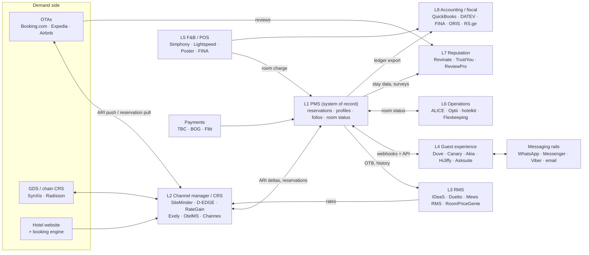
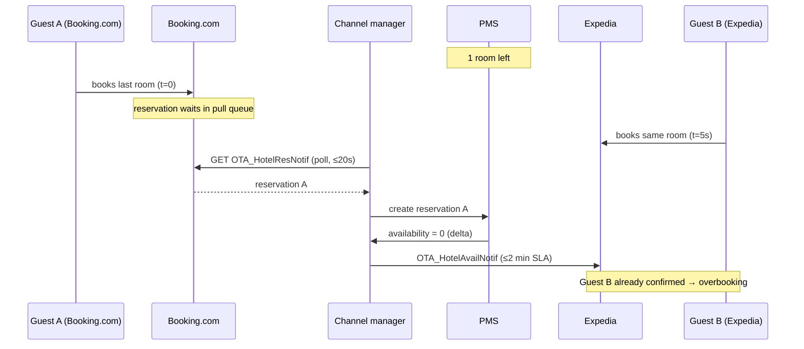
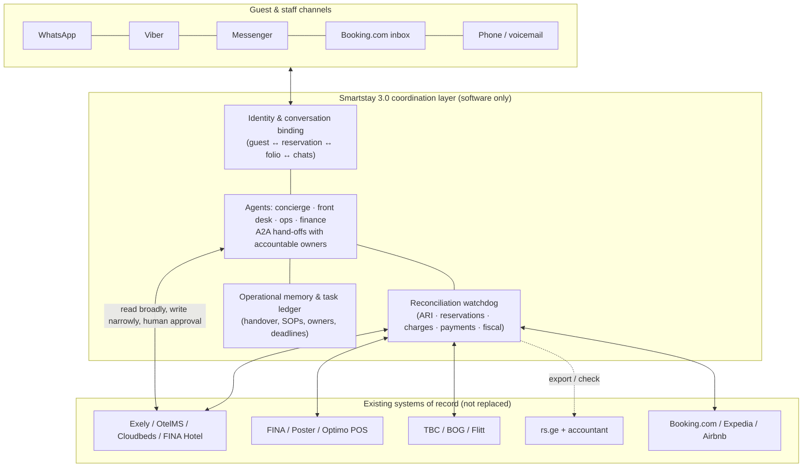

# Hospitality technology landscape and the hotel software stack

**Source retrieval: 24 September 2026. Scope: the software layers of a hotel, how they interconnect, where integration fails, and what regional/boutique hotels in Georgia (Kakheti, Kazbegi) actually run. Pure software; no hardware, IoT, or device dependency is proposed.**

**[I] Purpose.** Map the fragmented systems an AI-native Business OS (Smartstay 3.0) would sit on top of, so the product is designed as a coordination layer over existing systems rather than as another PMS. This dossier complements the ground-truth methodology in [task_research.md](../task_research.md) and the Kakheti evidence in [derived/market_findings.md](derived/market_findings.md); it does not repeat their macro/tourism data.

**[U] What this dossier does not establish.** No Georgian hotelier was interviewed and no property's systems were inspected from the inside. The Kakheti stack evidence (§4.1) is an outside-in fingerprint of 13 hand-picked public websites, not a representative census. No willingness-to-pay figure for Georgian boutique hotels was found. Nearly every quantitative "integration pain" statistic in the industry comes from a vendor that sells integration or consolidation (§3.4). Vendor capability claims are what the vendor publishes, not tested behaviour.

## Evidence convention

Same labels as [task_research.md](../task_research.md):

| Label | Meaning here |
|---|---|
| **[D]** | Documented on the cited primary page: vendor developer documentation, official press release, regulator/court page, or publisher's survey page. For vendor marketing, the claim is additionally marked **VS** (vendor-stated). |
| **[O]** | Directly observed: raw HTML fetched with `curl` and grepped; the quoted string was present on retrieval. |
| **[I]** | Inference, synthesis, design, or recommendation. Not an empirical fact. |
| **[U]** | Unverified, inaccessible (403/404/JS-only), snippet-only, or unknown. |

**[O] Method note.** Pages were fetched on 24 September 2026 with WebFetch (which returns a model summary of the page, so short quotes are close paraphrases unless marked verbatim) and with `curl` for raw-HTML fingerprinting. Where a page could not be fetched, the claim is [U] even if a search snippet stated it. One fetch-summary error was caught and corrected: FIAS was mis-expanded by the summarizer and was re-checked against the PDF text with `pdftotext` (§2.3).

---

## Executive summary

1. **[D] The stack is seven-plus independent systems joined by thin, unreliable pipes.** Even API-first PMSs send webhooks that contain only an ID (Mews, Apaleo, Cloudbeds), give no ordering guarantee (Apaleo, Cloudbeds), and drop events after a short retry budget (Cloudbeds: 5 tries at 1-minute intervals). Booking.com, the dominant OTA, is still **pull-only**: the connector must poll every 20 s, and unacknowledged reservations fall back to an **email to the property after 30 minutes**. (§2.4)
2. **[D] The "integration tax" is real but has moved.** Oracle OHIP makes the API free for OPERA Cloud hotels but meters partners **per API call or per streamed event, including in sandbox, with no spending cap** (overage ≈ USD 20 per 10,000 calls per Oracle's FAQ). Challenger PMSs (Mews, Apaleo, Stayntouch) advertise "no integration fees" (VS), yet Apaleo's store terms let it introduce listing fees/commissions on six weeks' notice. No independent audited dataset of interface fees exists; the famous "$10,000 per integration" figure is Stayntouch's own competitive research. (§3.2)
3. **[D] Consolidation is the market's answer, and it creates lock-in.** Mews bought Atomize (RMS, Nov 2024) and Flexkeeping (operations, Sep 2025) and raised $300M at a $2.5B valuation (Jan 2026). Canary bought OpenKey (Feb 2026); Duve raised $60M (Dec 2025). Suites are absorbing layers. (§1.9)
4. **[O] Kakheti runs on regional, not Western, software.** Of 11 Kakheti/Kazbegi lodging sites with an identifiable booking setup, **5 use Exely/TravelLine** (the CIS-origin vendor with a Georgian-language site claiming 150+ Georgian hotel clients). There was 1 Cloudbeds, 1 Georgian vendor (Arealy), 1 custom form, 1 Wix Hotels, and 2 chain CRSs (Radisson, Sabre SynXis). **Zero Mews, zero OtelMS, zero Bnovo.** (§4.1)
5. **[D] The local ecosystem has specific gaps.** **Stripe does not support Georgia.** Card acceptance runs through TBC/BOG APIs and Flitt. No PMS inspected documents a link to the Revenue Service (RS.ge) e-invoicing. A draft "universal cash register" reform would push real-time fiscal transmission from 2027–2028. Among the guest-messaging vendors checked, only **HiJiffy explicitly lists Georgian**. **WhatsApp service replies become billable from 1 October 2026.** (§4.3–4.5, §1.4)
6. **[I] White spaces for an A2A coordination layer** (§5): (a) a Georgian-language conversation-to-action layer that binds a WhatsApp/Messenger/OTA message to the right reservation, folio and task; (b) a cross-system reconciliation watchdog for sync failures, email-fallback bookings, unposted charges, expiring pre-authorisations and fiscal gaps; (c) institutional memory and shift continuity for seasonal, high-turnover staff, the one Kakheti bottleneck that is independently documented.

---

# 1. Anatomy of the modern hotel software stack

## 1.1 The layers and how data flows between them

**[I] Reference architecture, synthesised from the vendor documentation cited in §1.2–1.8.** The PMS is the system of record for reservations, guest profiles, folios and room status. Every other layer is a satellite that reads from the PMS or writes into it, usually through a separate point-to-point integration.



**[I] Reading the diagram.** Every arrow is a separately built, separately certified, separately failing integration. A 20-room hotel with a PMS, a channel manager, a POS, a messaging tool and an accountant already depends on at least four of them. Guest identity is re-keyed at each boundary (§3.1).

## 1.2 Layer 1: Property Management Systems (PMS)

| PMS | Deployment | API style | Push events | Rate limit | Partner-fee model | Evidence |
|---|---|---|---|---|---|---|
| **Mews** | Cloud SaaS | REST/JSON Connector API (OpenAPI); separate Channel Manager API and Booking Engine API | General webhooks (10 event types: `ServiceOrderUpdated`, `ResourceUpdated`, `ResourceDeleted`, `MessageAdded`, `ResourceBlockUpdated`, `CustomerAdded`, `CustomerUpdated`, `PaymentUpdated`, `ProductUpdated`, `ProductDeleted`) + WebSockets (4 types) | 200 requests per access token per 30 s, sliding window; 429 + `Retry-After` | "1,000+ integrations. No connection fees." (VS); API "free of charge for integration partners and Mews customers" | [D] https://docs.mews.com/connector-api ; https://docs.mews.com/connector-api/events/wh-general ; https://docs.mews.com/connector-api/guidelines/environments ; https://www.mews.com/en/marketplace |
| **Apaleo** | Cloud, API-first | REST (Swagger), OAuth 2.0 | Webhooks across 17+ topics (Reservation, Folio, Invoice, Night Audit, Payment Transaction, Unit…); thin payload (`entityId`) | Live: 3,500/min, burst 200/s; reservation/offer endpoints exempt | "No setup / licence / maintenance / integration fees" (VS), but see §3.2 on store terms | [D] https://apaleo.dev/guides/api/rate-limiting.html ; https://apaleo.dev/guides/webhook/configuration.html ; https://apaleo.com/pricing |
| **Cloudbeds** | Cloud SaaS | REST v1.2/1.3 ("50+ API calls"); GraphQL also mentioned; API keys / OAuth 2.0 | Webhooks, 35+ `object/action` events (`reservation/created`, `guest/details_changed`, `housekeeping/room_condition_changed`, `accounting/transaction`, `fiscal_document/create`…) | 5 req/s per property, 10 req/s per tech partner; exceeding it can suspend credentials | Not published; tech partners need ≥5 pilot properties | [D] https://developers.cloudbeds.com/docs/faq ; https://developers.cloudbeds.com/docs/webhooks-1 |
| **Oracle OPERA Cloud (OHIP)** | Cloud (OCI); legacy on-prem OPERA 5 reachable through OPERA Cloud Central for distribution | REST Property APIs; Distribution (Shop/Book) APIs; ARI push webhooks; **Streaming API = GraphQL subscriptions over WebSocket** | Business Events: pull (`getBusinessEvents`, 300/min) or push stream (Kafka-backed, 7-day replay, strict ordering, one consumer per stream, no server-side ACK/DLQ) | 50 req/s per gateway, shared by all clients | Metered per call or per event for partners; "OAuth tokens are billable"; free for OPERA Cloud hotels | [D] https://docs.oracle.com/en/industries/hospitality/integration-platform/ohipu/c_limits.htm ; …/stmig/c_faqs.htm ; …/ohipu/c_faqs.htm |
| **Stayntouch** | Cloud SaaS | REST "Connect API" v2, OAuth 2.0 | Webhooks ("event-based HTTP notifications") | Not found | "unlimited connections, certifications, and support at no additional charge" (VS) | [D] https://www.stayntouch.com/developers/ ; https://api-specs.stayntouch.com/v2/index.html |
| **Shiji Daylight** (ex-Shiji Enterprise Platform) | "100% cloud-based" (VS) | HTTP API, "over 1,200 API endpoints" (VS) | Webhooks listed in the docs index; details JS-rendered | [U] | [U] | [D] https://www.shijigroup.com/daylight-pms ; [U] docs.shijigroup.com |

**[D] Core data model per PMS.** The same four concepts carry different names, which is why every integration needs a mapping layer.

| Concept | Mews | Apaleo | Cloudbeds | OPERA Cloud | Stayntouch |
|---|---|---|---|---|---|
| Stay | Reservation / Service order | Booking → Reservation | Reservation | Reservation | Reservation |
| Person | Customer | Guest data on booking; Company | Guest | Profile | Guest; Account |
| Money | Bill, Payment, Product | Folio, Invoice, Payment transaction | Folio (items, payments) | Cashiering / folio | Bills (guest/deposit/AR), charge codes |
| Space | Resource, ResourceCategory | Unit, Unit group | Room, Room type | Rooms, Housekeeping | Inventory, Room status |

Sources: [D] https://docs.mews.com/connector-api/concepts ; https://apaleo.dev/ ; https://developers.cloudbeds.com/llms.txt ; https://docs.oracle.com/en/industries/hospitality/integration-platform/ohipu/c_property_apis.htm ; https://api-specs.stayntouch.com/v2/index.html

**[I] Open API vs legacy on-prem.** The dividing line is no longer "has an API". What matters is (1) whether the API is self-service or needs a partner contract, (2) whether events are pushed, and how reliably, and (3) who pays per call. Legacy on-prem interfaces (FIAS over a socket, §2.3) still reach the long tail through middleware.

## 1.3 Layer 2: Channel managers, CRS, and OTA connectivity

| System | Role | Protocol | ARI (availability, rates, inventory) | Reservation delivery | Evidence |
|---|---|---|---|---|---|
| **SiteMinder pmsXchange** | Channel manager hub (PMS side) | SOAP 1.1 + OpenTravel 2003/05 | PMS must push **deltas within 2 min** of a change; repeated full flushes prohibited | **PMS polls** (`OTA_ReadRQ` → `OTA_ResRetrieveRS` → `OTA_NotifReportRQ`) every 2–5 min | [D] https://developer.siteminder.com/pmsxchange-api/guides/integration-requirements |
| SiteMinder SiteConnect | Channel side | SOAP 1.1, OpenTravel 2010A | `OTA_HotelAvailRQ/RS` | — | [D] https://developer.siteminder.com/siteconnect-api/guides/integration-requirements ; "2,350+" integrations (VS) https://www.siteminder.com/integrations/ |
| **Booking.com Connectivity API** | OTA | OpenTravel 2003B XML, B.XML, some JSON | Provider pushes `OTA_HotelRateAmountNotif`, `OTA_HotelInvNotif`; must load ≥ 1 year of ARI; `OTA_HotelInvNotif` capped at **75/min** | **Pull queue**: `GET OTA_HotelResNotif` every **20 s**, POST to acknowledge; unacknowledged → **email to property after 30 min** (extendable to 24 h, which "increases… overbooking risk") | [D] https://developers.booking.com/connectivity/docs ; …/reservations-api/reservations-overview ; …/retrieving-new-reservations-ota |
| **Mews Channel Manager API** | PMS ↔ CM | REST | Mews pushes availability to the CM's endpoint | CM pushes reservations into Mews | [D] https://docs.mews.com/channel-manager-api |
| **OPERA Cloud Distribution** | PMS ↔ OTA/CM | REST + outbound webhooks | ARI Push | Inbound Reservation Notification; a channel cannot use both Shop/Book and ARI Push | [D] https://docs.oracle.com/en/industries/hospitality/integration-platform/ohipu/c_oracle_hospitality_distribution_apis.htm |
| **D-EDGE** | CRS + CM + booking engine | not public | "Central Inventory … updates availability instantly"; "Channel Pooling" (VS) | not public | [D] https://www.d-edge.com/product/channel-manager/ ("300+ channels", VS) |
| **Cloudbeds channel manager** | Built into the PMS | internal | "real time… zero lag time" (VS) | internal | [D] https://www.cloudbeds.com/channel-manager/ ("450+ OTAs", VS) |
| **RateGain RezGain** | CM | [U] site blocked the fetch | [U] | [U] | [U] "1500+ channels" is snippet-only |
| **Expedia (EQC)** | OTA | XML over HTTPS | Availability & Rates API | Booking Notification (push, email fallback) or Booking Retrieval (pull) | [U] developer pages redirect to a JS-only portal; snippet-only |

**[I] Two-way sync mechanics, synthesised from the documents above.**



- **[I] Inventory pooling vs allocation.** In a pooled ("one inventory") model every channel sells from one free-to-sell count, so each sale must propagate to every channel. That propagation window is where overbookings happen. In an allocation model each channel holds a fixed block. It is safer per channel but strands rooms. D-EDGE's "Channel Pooling" is a bulk-action grouping of channels, not the pooled-inventory model itself [D]. No single primary definition page for pooling was fetched; the distinction is standard industry practice.
- **[I] Documented causes of overbooking, each tied to a documented mechanism:** gaps between polls (20 s at Booking.com, 2–5 min at SiteMinder); ARI propagation SLA (2 min at SiteMinder); email fallback after 30 min without acknowledgement; rate-limit throttling during bulk updates (75/min inventory at Booking.com; 150/h rate-plan PUTs at Apaleo); out-of-order events (Apaleo, Cloudbeds); room/rate code mapping errors; webhooks dropped after their retry budget (Cloudbeds).
- **[D] Rate parity.** The European Commission designated Booking.com a DMA gatekeeper on **13 May 2024**. From **14 November 2024** Booking "must now allow hotels… to offer better prices and conditions on other online channels, including their own websites" (https://digital-markets-act.ec.europa.eu/booking-must-comply-all-relevant-obligations-under-digital-markets-act-2024-11-14_en). The CJEU ruled on 19 September 2024 (C-264/23) that parity clauses cannot, in principle, be treated as ancillary restraints (https://curia.europa.eu/site/upload/docs/application/pdf/2024-09/cp240145en.pdf). **[U] Whether these protections reach Georgian (non-EU) properties is unknown.** A hotel's own Booking.com contract is the authoritative source.

## 1.4 Layer 3: Revenue management systems (RMS) and dynamic pricing

| Vendor | How it prices (VS) | Inputs / outputs | Segment | Public price | Evidence |
|---|---|---|---|---|---|
| **IDeaS G3** (owned by SAS) | "Over 100 models tuned to different types of hotel business"; dynamic-programming optimisation over competitor prices, events, booking patterns, price response | PMS/CRS history + on-the-books → decisions to selling systems | Enterprise to boutique; "34,000+ properties" (VS) | Not public | [D] https://ideas.com/ ; https://ideas.com/science-behind-g3-rms/ |
| **Duetto GameChanger** | "Open Pricing": each segment, channel and room type priced independently instead of a BAR ladder; "AutoPilot"; forecasts up to 5 years | PMS integration (Opera, Mews, Apaleo, Infor, Cloudbeds named); rate-shopping partners **Amadeus, eRevMax, Lighthouse** | Full-service, groups, casino, luxury | "a number here would be misleading" | [D] https://www.duettocloud.com/gamechanger ; https://www.duettocloud.com/en-us/buyer-faq ; https://www.duettocloud.com/partners/tag/rate-shopping |
| **Atomize → Mews RMS** | Room-type-level pricing from "historical data and live booking pace, plus competitive rates"; up to 24 months ahead | Native in Mews PMS; support for non-Mews PMSs not stated [U] | Independents to chains | Not shown | [D] Acquired **21 Nov 2024**: https://www.mews.com/en/press/mews-acquires-atomize ; atomize.com now redirects to Mews |
| **RoomPriceGenie** | Tracks "your 10 biggest competitors and hundreds of local AirBnBs", events calendar, pickup; user sets min/max and seasonality | Auto-uploads to PMS/CM; "70+ integrations" (VS) | Independents, B&Bs | **Not published**: quote by room-count band; billed per property per month, annually; 14-day trial | [D] https://roompricegenie.com/pricing/ . Update frequency is internally inconsistent: 4×/day (Core) and 24×/day (Premium) on the pricing page vs "12 times a day" on the homepage. |
| **FLYR (ex-Pace)** | "real-time, micro-targeted pricing" with hourly updates | not stated | Mid/enterprise; >1,000 hotels at acquisition | Not public | [D] Acquired **20 Sep 2022**: https://www.flyrhospitality.com/resources/flyr-acquires-pace-extending-its-revenue-operating-system-to-hotels |

**[I] Relevance to Kakheti.** Every RMS needs clean PMS history and on-the-books pace. A property whose reservations live partly in a PMS, partly in an OTA extranet and partly in WhatsApp threads cannot feed one. PMC reports that Kakheti advertised prices "fluctuate through the year" rather than following a sharp summer peak ([market_findings.md](derived/market_findings.md) A07). Event-driven demand (harvest, *Rtveli*, festivals) is therefore the pricing signal, and it is exactly the kind of local knowledge generic competitor-rate scrapers miss.

## 1.5 Layer 4: Guest experience, messaging and digital check-in

| Vendor | Core functions (VS) | Channels | Georgian? | 2024–2026 corporate events | Evidence |
|---|---|---|---|---|---|
| **Canary Technologies** | Digital arrivals (mobile check-in), upsells, AI messaging with auto-handoff and service tickets, AI voice | Messaging (SMS/WhatsApp per press, [U] on product page) | "Speak 100+ Languages" via translation; Georgian not named | $80M Series D, 12 Jun 2025 (~$600M valuation); acquired OpenKey, 3 Feb 2026 | [D] https://www.canarytechnologies.com/press/canary-raises-series-d ; …/products/ai-guest-messaging |
| **Duve** | Online check-in with ID capture, e-signature, payment write-back to PMS, upsells; unified inbox | WhatsApp, SMS, email, in-app, OTA (OTA depends on PMS) | Not mentioned | $60M Series B, 9 Dec 2025; acquired Easyway (GenAI messaging), 28 Jan 2024 | [D] https://skift.com/2025/12/09/duve-60-million-series-b-hotels-guest-management/ ; https://duve.com/press-room/duve-acquires-easyway/ ; https://duve.com/contactless-online-check-in/ |
| **Akia** | Messaging, calls, reviews; digital check-in with ID + selfie match; "up to 90% of messages never reach your team" (VS) | SMS, WhatsApp, voice | Not mentioned | Series A $6M (Jan 2023) [D]; a 2024 round is aggregator-only [U] | [D] https://www.akia.com/ |
| **HiJiffy** | Unified web/social/WhatsApp/OTA conversations with human routing | Web, social, WhatsApp, OTA | **Yes. Georgian appears in its ~51-language chatbot list** (quality not stated) | No 2024–26 round found | [D] https://help.hijiffy.com/supported-languages |
| **Asksuite** | "50+ languages"; official WhatsApp; AskFlow agents (concierge, check-in/out, group quote, abandonment recovery) | WhatsApp, Instagram, Messenger, email, webchat | Not named | No 2024–26 round found | [D] https://asksuite.com/ |

**[D] Messaging-rail economics change on 1 October 2026.** Since 1 July 2025 Meta has charged per template message. Non-template (service) replies are free, and so are utility templates inside the 24-hour customer-service window (https://developers.facebook.com/documentation/business-messaging/whatsapp/pricing). Outside that window only pre-approved templates can be sent (https://developers.facebook.com/documentation/business-messaging/whatsapp/messages/send-messages). **From 1 October 2026, service (non-template) messages and utility templates inside the window become billable per message** at utility/authentication rates by market. The 72-hour free window after click-to-WhatsApp ads remains free. Meta Business Agent messages are billed from 1 August 2026 at $2.00 per 1M tokens (https://developers.facebook.com/documentation/business-messaging/whatsapp/pricing/non-template-messages). **[I]** Guest-messaging cost models must now count every reply, and the Georgia (+995) rate card needs checking.

## 1.6 Layer 5: F&B, POS, inventory

| Vendor | Georgia relevance | Hotel link | Price (as published) | Evidence |
|---|---|---|---|---|
| **Poster POS** | Cloud POS; VS "110 countries". **No Georgian locale** (`/ka`, `/ge` return 404) and **GEL absent** from the pricing currency list. A "Poster Georgia" Facebook page appears only in search results [U] | Open API: Web API, POS-embedded JS apps, webhooks (md5-signed, retried until `{"status":"accept"}`); **published PMS room-charge guideline** (Cloudbeds as reference). Storage API covers supplies, transfers, write-offs | Mini $26, Business $44 (with KDS), Pro $62 per month billed annually | [D] https://joinposter.com/en/pricing ; https://dev.joinposter.com/en/docs/v3/market/guidelines/pms ; https://dev.joinposter.com/en/docs/v3/web/webhooks |
| **FINA** (Georgian, founded 2011) | "6000+ organizations" (VS); café-restaurant, **hotel**, accounting modules; accounting advertises "Full integration with RS.ge" | Hotel module includes a channel manager (Booking.com, hotels.com, Expedia) | Restaurant: **80 ₾/month per sale point** | [D] https://fina.ge/prices-restorani/en ; https://fina.ge/sastumros-programa ; https://fina.ge/sabugaltro-programa/en |
| **Optimo** (Georgian) | Stock/sales; RS.ge waybill integration; Glovo/WooCommerce | none stated | from 40 GEL/month | [D] https://optimo.ge/en |
| **iiko / Syrve** | Syrve partner "Syrve Georgia" appears in search results; iiko.ge shows only a login page | not stated | not shown | [U] |
| **Lightspeed Restaurant** | Global | "PMS connectivity for hotel restaurants with room charge" | tiers, no figures | [D] https://www.lightspeedhq.com/pos/restaurant/ |
| **Oracle Simphony** | Enterprise | OPERA PMS Enhanced Interface; "OPERA Room Charge" tender | not public | [D] https://docs.oracle.com/en/industries/food-beverage/simphony/19.8/simcg/c_opera_pms_enhanced_interface.htm |
| **Mews POS** | Mews-native | Room charge by room number or name, auto-synced | not shown | [D] https://www.mews.com/en/products/point-of-sale |
| **Toast** | **Not available in Georgia** (US, CA, UK, IE, AU only) | — | — | [D] https://support.toasttab.com/en/article/Differences-in-Toast-s-Back-end-for-Canada-Ireland-and-U-K-Locations |

**[D] How "post to room" works.** Legacy: Oracle FIAS over IFC8. `PS` (Posting Simple, room number only) is used for minibar and phone. `PR`/`PA` (Posting Request/Answer, reservation-based after an inquiry) is used for POS/spa (https://docs.oracle.com/cd/E94145_01/docs/HGBU-HPI-IFC8-FIAS-Specification2.25.pdf). Modern: OPERA Cloud `postBillingCharges`. In the Mews Connector API, *Add order* posts to the **customer profile, not the room**, with an optional `LinkedReservationId` (https://docs.mews.com/connector-api/use-cases/point-of-sale).

**[U] Wine cellar.** No dedicated hotel wine-cellar product was verified. Generic stock modules (Poster Storage, Syrve, Lightspeed, FINA warehouse) could hold bottles, but vintage/lot/*qvevri* batch tracking is unconfirmed for all of them. For Kakheti wine hotels, cellar sales (tastings, bottle shop, shipping) are likely a revenue line that sits outside both the PMS and the POS; this remains to be confirmed in interviews [I].

## 1.7 Layer 6: Staff collaboration and operations

| Vendor | Function (VS) | PMS link | Corporate status | Evidence |
|---|---|---|---|---|
| **ALICE (Actabl)** | Housekeeping, rush rooms, inspections, guest messaging with tickets | Two-way PMS housekeeping | Actabl formed June 2022 from ProfitSword + Hotel Effectiveness + ALICE + Transcendent [U: not fetched] | [D] https://actabl.com/operations-software/housekeeping/ |
| **Optii** | Predictive routes, auto-assignment, maintenance assets/schedules; "47% reduction in unplanned work" (VS) | Two-way PMS | Owned by MCR since Dec 2021 [U: press summary] | [D] https://www.optiisolutions.com/housekeeping ; …/maintenance |
| **hotelkit** | Room status, daily planning, checklists, repairs, handovers; "automated preventive maintenance" | "real-time updates of cleaning and room status" (two-way) | Independent | [D] https://hotelkit.net/products/housekeeping/ |
| **Flexkeeping** | Dynamic cleaning, skills-based allocation, maintenance, no-code workflow builder (beta) | Multi-PMS historically | **Acquired by Mews, 30 Sep 2025**; continued availability on other PMSs not stated | [D] https://www.mews.com/en/press/mews-acquires-flexkeeping ; https://www.mews.com/en/blog/why-mews-acquired-flexkeeping |

**[I]** These tools assume a staffed, trained team that uses an app every shift. Kakheti's documented problem is the opposite: seasonal reductions and turnover ([market_findings.md](derived/market_findings.md) A10–A11). Every departure takes tacit knowledge with it, and every new hire has to be onboarded onto yet another app.

## 1.8 Layer 7: Reputation, plus Layer 8: accounting and fiscal back office

| Vendor | Function (VS) | Price | Evidence |
|---|---|---|---|
| **TrustYou** | Review inbox, Response AI, Sentiment AI, benchmarking, surveys, AI agents | **Public**: CXP from €75 per property per month; AI Agents from €100 (annual billing) | [D] https://www.trustyou.com/ |
| **ReviewPro** (Shiji) | 140+ sources, 45 languages, Global Review Index, sentiment by concern | Not disclosed | [D] https://www.shijigroup.com/reviewpro-reputation |
| **Revinate** | Reviews and surveys scored 0–100 and auto-sorted by department; PMS-triggered surveys | Not shown | [D] https://www.revinate.com/hotel-software/revinate-guest-feedback/ |

**[D] Review-data access constraints.** The Booking.com Review API is for connectivity partners only. Reviews are for "internal use by properties", not public display. **One reply per review**, moderated before it appears (https://developers.booking.com/connectivity/docs/review-api). Google Business Profile API access needs an application; the profile must have been verified for 60+ days; quota is 0 until approved (https://developers.google.com/my-business/content/prereqs).

**[D] Layer 8: accounting and night audit.**

| Item | Finding | Evidence |
|---|---|---|
| Mews → accounting | Excel accounting report with ledger/posting account codes; QuickBooks via Omniboost posts **daily drafts** that depend on Mews's "Accounting Editable History Window" | [D] https://help.omniboost.io/en/articles/6627705-mews-pms-to-quickbooks-accounting-integration |
| OPERA Cloud end of day | Business date does not roll while departures remain "Due Out", arrival deposits are unresolved or cashiers are open | [D] https://docs.oracle.com/en/industries/hospitality/opera-cloud/24.3/ocsuh/c_endofday_procedures.htm |
| Mews night audit | "automatically transitions to the next day" at midnight; no manual audit (VS) | [D] https://www.mews.com/en/blog/hotel-night-audit-automation |
| Georgian accounting | FINA advertises full RS.ge integration and has a hotel product; ORIS pages do not mention RS.ge; Balance.ge's page title claims RS.ge integration but the page was blocked | [D] https://fina.ge/sabugaltro-programa/en ; [U] balance.ge |
| PMS ↔ Georgian accounting | **No connector found** between any global PMS and FINA/ORIS/Balance | [U]; [I] likely CSV or manual re-entry |

## 1.9 Market structure: suites are absorbing layers

| Date | Event | Evidence |
|---|---|---|
| 21 Nov 2024 | Mews acquires Atomize (RMS) | [D] https://www.mews.com/en/press/mews-acquires-atomize |
| 30 Sep 2025 | Mews acquires Flexkeeping (operations) | [D] https://www.mews.com/en/press/mews-acquires-flexkeeping |
| 22 Jan 2026 | Mews raises $300M Series D at $2.5B valuation | [D] https://www.mews.com/en/press/mews-secures-300-million-investment |
| 12 Jun 2025 / 3 Feb 2026 | Canary $80M Series D; acquires OpenKey | [D] see §1.5 |
| 28 Jan 2024 / 9 Dec 2025 | Duve acquires Easyway; $60M Series B | [D] see §1.5 |
| 25 Mar 2021 | HTNG agrees to join AHLA (closing expected April 2021) | [D] https://www.ahla.com/news/ahla-integrate-htng-strengthening-technology-expertise-advocacy-focus |

**[I]** The industry is resolving fragmentation by **vertical consolidation** (one vendor owns more layers) rather than by **horizontal coordination**. For a small Georgian hotel that already runs Exely or OtelMS, migrating to a Western suite is expensive and the suite may not cover local payments and fiscal rules (§4). That leaves room for a coordination layer that works across whatever stack the hotel already has.

---

# 2. Integration protocols and interoperability standards

## 2.1 HTNG (now part of AHLA)

- **[D] Correction to the brief.** HTNG did not join AHLA in 2019. AHLA and HTNG announced the agreement on **25 March 2021**, with closing expected before the end of April 2021; the HTNG brand was retained (https://www.ahla.com/news/ahla-integrate-htng-strengthening-technology-expertise-advocacy-focus).
- **[D] Completed workgroups** include Property Web Services, Payment Systems & Data Security, Guest & Room Status Messaging, Customer Profile, Single Guest Itinerary, API Registry, HTNG Web Services Framework (XML), **Lightweight Messaging (JSON)**, Folio Detail Exchange, Point of Sale, Back Office, and **Express PMS Integrations Phase I** (https://www.ahla.com/htng-completed-workgroups).
- **[D] Active workgroups (2026)** include AI Distribution Readiness, Digital Identity, **Express PMS Integrations Phase II** ("Enhancing a JSON-based standard designed to simplify vendor integrations with PMS", adding folio/charge posting) and a **Revenue Management** API group (https://www.ahla.com/htng/workgroups). AHLA states that Phase II exists because integrations "still lack key capabilities… especially around charge posting" (https://www.ahla.com/htng-express-pms-workgroup). No time-saved figures are published.

## 2.2 OpenTravel Alliance

- **[D]** OpenTravel publishes the legacy **XML 1.0** message sets and a **2.0 JSON object model**. It states that the XML→JSON shift "has been treated as a syntax change, ignoring deeper architectural differences". It is forming an **Open Travel Foundation with the Linux Foundation** in response to "API costs and barriers to interoperability" (https://opentravel.org/).
- **[D] Messages in daily use** (as implemented by, for example, LODGEA): `OTA_HotelAvailNotifRQ` (availability), `OTA_HotelRateAmountNotifRQ` (rates), `OTA_ReadRQ` (pull reservations), `OTA_HotelResNotifRQ` (push reservations), `OTA_NotifReportRQ` (acknowledge / link IDs) (https://developer.lodgea.com/opentravel.html). Booking.com and SiteMinder both run on these families (§1.3).

## 2.3 FIAS: the legacy on-premises interface that still underpins POS and minibar

**[D]** Oracle's *IFC8 FIAS Specification* (Release 2.20.25, May 2022) describes FIAS as "a universal protocol specification used by different kinds of third-party property systems to exchange data". It uses **pipe-delimited records over a socket link**, with link control (`LS`/`LA`/`LE`), database resync (`DR`/`DS`/`DE`), night audit (`NS`/`NE`), guest in/out/change, and postings (`PS`, `PR`, `PA`) (https://docs.oracle.com/cd/E94145_01/docs/HGBU-HPI-IFC8-FIAS-Specification2.25.pdf). The spec's copyright notice prohibits reverse engineering except as required by law for interoperability.

## 2.4 Webhooks vs polling: what the docs actually guarantee

| Platform | Mechanism | Payload | Ordering | Delivery / retry | Evidence |
|---|---|---|---|---|---|
| Mews | Polling, webhooks, WebSockets (4 types only) | **Thin** (entity type + ID) | Not addressed | Receiver must answer within 5 s; re-sent "after a few minutes"; **discarded** after repeated failure | [D] https://docs.mews.com/connector-api/events/wh-faq.md ; …/websockets.md |
| Apaleo | Webhooks | **Thin** (`entityId`) | "**not sent in any specific order**" | At least once; normally ≤ 60 s; 3 retries, then up to 24 h | [D] https://apaleo.dev/guides/webhook/best-practices.html |
| Cloudbeds | Webhooks | **Minimal (IDs)** | "**Order of the events is not guaranteed**" | 5 attempts, 1 min apart, then **dropped**; handler > 2 s → duplicates | [D] https://developers.cloudbeds.com/docs/webhooks-1 |
| Oracle OHIP | Streaming (GraphQL/WSS) or polling | Business events | **Strict per stream** | 7-day replay; one consumer per stream; no server ACK/DLQ; **both billed per unit** | [D] https://docs.oracle.com/en/industries/hospitality/integration-platform/stmig/c_faqs.htm |
| Booking.com | **Pull only** (reservations) | Full OTA XML | Queue | GET every 20 s; email fallback after 30 min | [D] §1.3 |
| Poster POS | Webhooks | Entity + action | Not stated | Retried until the endpoint returns `{"status":"accept"}` | [D] https://dev.joinposter.com/en/docs/v3/web/webhooks |

**[I] Why two-way sync delays persist, derived from the table.**
1. **Notify-then-fetch.** Thin payloads mean every event costs a second API call, and that call runs into rate limits (Cloudbeds allows 5 req/s per property).
2. **No ordering.** A `reservation/dates_changed` can arrive before `reservation/created`, so consumers must reorder by timestamp or re-fetch the current state.
3. **Lossy retry budgets.** A 5-minute outage at the integrator loses Cloudbeds events for good, so every serious integration still needs a periodic **reconciliation poll**.
4. **Mixed paradigms in one chain.** A booking can travel OTA (pull, 20 s) → CM (poll, 2–5 min) → PMS (push) → satellite (webhook, ≤ 60 s + fetch). The end-to-end latency is the sum of the stages, and each stage fails independently.
5. **Metered events** (OHIP) make "just subscribe to everything" a cost decision.

**[I] Design consequence for Smartstay:** treat every upstream system as eventually consistent. Keep a local event log keyed by source ID and version, deduplicate idempotently, run scheduled reconciliation against each system of record, and never act on a single notification without re-reading current state.

---

# 3. Systemic bottlenecks and the "integration tax"

## 3.1 Fragmented guest identity

**[I] Synthesis from the data models in §1.2 and the channel reality in §4.** One guest can exist as:

| System | Record | Key |
|---|---|---|
| Booking.com | Reservation with a proxy email | OTA reservation ID |
| PMS | Customer / Guest / Profile | PMS ID (Mews Customer ≠ Apaleo guest-on-booking) |
| POS | Diner/transaction, or a room-charge link | Order ID; room number or profile |
| WhatsApp / Viber / Messenger | Phone number or PSID | Channel-specific handle |
| Payment gateway | Card token, pre-authorisation | Gateway payment ID |
| Accounting / RS.ge | Invoice counterparty | Tax ID for companies; often none for individuals |

**[I]** None of these keys is shared. Mews even posts POS orders to a **customer profile rather than a room** (§1.6). A guest who books on Booking.com, messages on WhatsApp from a different number, orders wine at the restaurant, and asks for an invoice to their company exists as four unlinked records. The local dossier [02_guest_crm_dossier.md](apps/02_guest_crm_dossier.md) develops the identity-resolution design.

## 3.2 The integration tax: what is documented and what is marketing

| Claim | Status | Evidence |
|---|---|---|
| Oracle OHIP is "available only through a paid subscription under a pay-as-you-go model"; billed per call (polling) or per event (streaming) "regardless of the environment: Sandbox, Non-Production, or Production"; overage "approximately USD 20 per 10,000 calls"; "no system-enforced hard limits, and it is not possible to manually set one" | **[D]**, Oracle's own FAQ | https://docs.oracle.com/en/industries/hospitality/integration-platform/ohipu/c_faqs.htm |
| OHIP is free for hotels on OPERA Cloud; mandatory certification removed ("reduced partner fees") in 2021 | [D] Oracle-sourced press | https://hospitalitynet.org/news/4103698.html |
| Oracle PartnerNetwork $500/yr; OPERA 5 licence & hardware track $3,000/yr; validation $7,000–$15,000 one-time | [D] **third-party blog figures**, not Oracle | https://www.altexsoft.com/blog/opera-pms-integration/ |
| "$10 for up to 10,000 REST API transactions/month" | **[U]** snippet only; the data sheet returned 403; conflicts with the FAQ overage figure | — |
| Mews: "No connection fees"; Apaleo: "No integration fees"; Stayntouch: free certification | [D] **VS** | §1.2 |
| Apaleo store terms §8: apaleo "may introduce fees… or commissions with a notice period of six weeks"; silence counts as acceptance | **[D]** contract text | https://apaleo.com/terms-conditions-store |
| "Legacy enterprise platforms can charge as much as $10,000 for a single new integration" | [D] **Stayntouch internal competitive research**, i.e. a competitor's claim | https://www.stayntouch.com/articles/hotel-pms-open-api-2026 |
| "The cost of integrating with some legacy PMS systems can run into the tens of thousands" | [D] **opinion column** | https://www.hospitalitynet.org/opinion/4124184.html |
| "A ten-property collection is ten authorisations, not one" (OHIP) | [D] VS (vendor blog) | https://chatlyn.com/en/blog/what-is-ohip/ |

**[I] Bottom line.** The documented tax has three parts:
- **Metering.** Oracle's partner pricing is per call or per event, and vendors pass it on to hotels.
- **Friction.** Certification, pilot-property requirements (Cloudbeds needs 5), per-property authorisation, and the need to build a separate mapping for each vendor.
- **Optionality risk.** Fees can be introduced later (Apaleo §8), and acquired satellites may become PMS-exclusive (Flexkeeping under Mews: not stated either way).

No independent, audited dataset of interface fees was found. Pitch material should quote Oracle's FAQ and Apaleo's contract terms, not the "$10k" figure.

**[D] Regulatory backdrop.** The EU Data Act has applied since 12 September 2025. Switching charges must be cost-based until they are abolished on 12 January 2027, and providers must export data in machine-readable formats (https://digital-strategy.ec.europa.eu/en/factpages/data-act-explained). **[I]** It covers switching and export, not ongoing API access or interface fees, and Georgia is not in the EU. It is a negotiating argument, not a Georgian right.

## 3.3 Multi-tab chaos

**[I] Composite of a Kakheti front desk, built from the fingerprints in §4.1 and the layer tables above; not an observed desk.**

```
┌ Tab 1: Exely / OtelMS PMS + channel manager  (reservations, room grid)
├ Tab 2: Booking.com extranet                   (messages, reviews, one-reply rule)
├ Tab 3: WhatsApp Web  (+ Viber desktop, Messenger)   (guest chat, driver, winery)
├ Tab 4: Bank merchant portal (TBC / BOG)        (pre-auths, refunds, settlements)
├ Tab 5: POS back office (FINA / Poster)         (restaurant, wine tasting, bar)
├ Tab 6: rs.ge                                   (VAT invoices, waybills)
└ Paper / Excel / notebook                       (housekeeping list, handover, supplier orders)
```

**[D] Survey evidence. Every row is sponsored by a vendor or a vendor-funded publisher; quote with the sponsor.**

| Statistic | Sample / date | Sponsor | Evidence |
|---|---|---|---|
| Managers spend **78 min/day** switching systems; average 5 systems; 46% use 5+ | Sample not stated | Access Hospitality (vendor) | [D] https://lodgingmagazine.com/access-hospitality-research-highlights-impact-of-toggle-tax-on-hoteliers/ |
| 39% spend 1–2 h/day switching; 98% say unconnected systems cost money; average **9** systems (conflicts with "5" above) | 400 US operators, 2025 | Access (vendor) | [D] https://www.theaccessgroup.com/en-us/blog/hos-toggle-tax-hotel/ |
| 79% spend > 11 h/week on automatable tasks | 700 hoteliers, Aug 2025, six countries | SiteMinder (vendor) | [D] https://www.hospitalitynet.org/news/4128943.html |
| 38% name integration a top pain point; 51% plan to replace or upgrade their stack within 12–24 months | 300+ professionals, Nov 2025 | NYU Tisch with Stayntouch & IDeaS (vendors) | [D] https://www.sps.nyu.edu/about/news-and-ideas/articles/press-releases/2025/nyu-jonathan-tisch-center-hospitality-stayntouch-ideas-release-2026-hotel-technology-outlook-report.html |
| 40% say disconnected systems are the main data barrier; 49% struggle to access data | ~200, Apr–May 2025 | Revinate (vendor) | [D] https://www.revinate.com/press-releases/the-future-of-hotel-data-report-reveals-nearly-50-of-hoteliers-struggle-to-access-critical-data/ |
| Integration is the most-cited frustration; adoption: PMS 74.4%, CRS/booking engine 64.0%, RMS 50% | 264 (38% tech providers), May 2025 | Hotel Yearbook (media) | [D] https://www.hotelyearbook.com/article/122000481/annual-survey-results-the-state-of-hospitality-tech-2025.html |
| 45% want "faster integrations and open marketplaces" | 450, Sep 2026 | Hotel Tech Report (vendor-funded marketplace) | [D] https://hoteltechreport.com/news/2026-hotel-pms-report |

**[U]** None of these samples is Georgian. None measures a 15–40-room Kakheti property. Use them as international context and replace them with interview-based measurement (see [interview_toolkit.md](../docs/interview_toolkit.md)).

---

# 4. Technology stack reality in Georgia and regional boutique hotels

## 4.1 What Kakheti and Kazbegi properties actually run (outside-in fingerprints)

**[O] Method.** Each property's own site was fetched with `curl -sL` on 24 September 2026 and the raw HTML was grepped for booking-engine domains, `wa.me`/Viber/Telegram links, and vendor keywords. JS-injected widgets could be missed. The sample was hand-picked, not random.

| # | Property (area) | Booking engine / PMS fingerprint (exact evidence) | Messaging links |
|---|---|---|---|
| 1 | Kvareli Lake Resort (Kvareli) | **Exely**: footer `<a href="https://exely.com/" …>Hotel management software</a>`; `data-module-price-load-hotel-id="17168"` | tel/mailto only |
| 2 | Chateau Kvareli (Kvareli) | **Exely**: images from `secure.exely.com/resource/images/rt/5007589/…` | none found |
| 3 | Bodbe Hotel (Sighnaghi area) | **Exely**: `"BE-INT-bodbehotel-ge_2025-03-20"`, `exelyPurchase`, `ibe.hopenapi.com`; also a stray `widget.siteminder.com/ibe.min.js` | `wa.me/+995322222242`, Telegram |
| 4 | Esquisse Design Hotel (Telavi) | **Exely**: `href="https://exely.com/"` next to the `bookingengine` loader | `wa.me/995596727722`, `viber://…`, Telegram |
| 5 | Schuchmann Wines Chateau & Spa (Telavi) | **TravelLine** (Exely's former brand): `<div id='tl-search-form'…><a href='https://travelline.ge/'>online booking system</a>` | `wa.me/+995577508005` |
| 6 | Communal Hotel Telavi | **Cloudbeds**: `href="https://communalhotels.cloudbeds.com/"` | none on homepage |
| 7 | Hotel Kabadoni (Sighnaghi) | **Arealy** (Georgian): `website.area.ly/en/engine/booking/227` | social links only |
| 8 | Chateau Mere (Telavi area) | **Custom** form `action="https://chateaumere.ge/transaction/1"` with a `_token` field | tel, Facebook |
| 9 | Hotel Qvevrebi (Sighnaghi) | **Wix Hotels** app (`"appDefinitionName":"Wix Hotels"`) | `wa.me/995551551557` |
| 10 | Radisson Collection Tsinandali | **Chain CRS**: links out to radissonhotels.com | tel |
| 11 | Rooms Hotel Kazbegi | **Sabre SynXis**: `be.synxis.com/?chain=5154…` | none |
| 12 | Stancia Kazbegi | No engine; Booking.com CDN images and a `sameAs` Booking.com link; **whether the site is official is uncertain** | none |
| 13 | Pheasant's Tears (Sighnaghi winery) | No lodging engine; Wix Restaurants / Table Reservations only | none |

**[O] Tally over the 11 lodging sites with an identifiable setup (rows 1–11):** Exely/TravelLine **5**, chain CRS 2, Cloudbeds 1, Arealy 1, custom 1, Wix Hotels 1. **Zero** used Mews, OtelMS, Bnovo, HotelRunner, WuBook or an embedded Booking.com widget. **4 of 11** expose a WhatsApp link. Viber and Telegram appear alongside WhatsApp at Esquisse and Bodbe. Unreachable or unidentified: Wine Hotel Telavi, Twins Old Cellar, Rcheuli Marani, Kvareli Eden [U].

**[I] Interpretation, bounded by a small hand-picked sample.**
- The regional default for a booking engine and channel manager looks like **Exely**, a vendor with CIS origins and a Georgian-language site. It is not Cloudbeds or Mews.
- The booking engine visible on a website does not prove which PMS sits behind it; Exely sells both, but that must be confirmed per property.
- Larger branded properties run chain CRSs, so they are a different buyer.
- The smallest properties (guesthouses, marani stays) likely have no engine at all and rely on Booking.com plus phone and WhatsApp. That is consistent with Stancia and Pheasant's Tears, but unmeasured.
- The Chateau Kvareli trail is itself a signal of migration: a 2017 HMS.ge client list names it, and it now runs Exely.

## 4.2 Local and regional vendors and published prices

| Vendor | Origin / presence | Products | Published price | Evidence |
|---|---|---|---|---|
| **Exely** (ex-TravelLine) | Georgian-language site: "we help Georgian hotels", "150+ customers", "450+ daily bookings" (VS) | PMS, booking engine, channel manager, website builder | **Not published** (pricing URL 404) [U] | [D] https://exely.com/ge-ge/ |
| **OtelMS** | Georgian, founded March 2013; +995 sales line; Georgian UI | Front desk PMS, channel manager ("more than forty" OTAs), booking engine, housekeeping, reputation | **Free GEL 0; Standard GEL 99/month; Ultra GEL 329/month**; BOG acquiring "from 2% + 0.2%" (as of Oct 2022) | [D] https://otelms.com/price/ ; https://otelms.com/history/ ; https://otelms.com/acquiring/ |
| **HMS.ge / Pro-Service** | Tbilisi, hosting company since 2003 | PMS + website + booking/payment bundle; automatic invoice generation | Monthly/annual, VAT incl.: ≤10 rooms GEL 100 / 1,000; 10–15 rooms 200 / 2,000; 15–20 rooms 250 / 2,800; 50–60 rooms 600 / 7,000. Lifetime licence from GEL 2,000 + 100/yr support (the 5-room and 10-room figures look inconsistent on the source page) | [D] https://proservice.ge/Hotel_management_system/679 |
| **FINA Hotel** | Georgian ERP/accounting (2011) | Reception, reservations, housekeeping, restaurant, warehouse, night audit, multilingual invoices, channel manager (Booking.com, hotels.com, Expedia) | [U] | [D] https://fina.ge/sastumros-programa |
| **Arealy** | Georgian | PMS, booking, channel management; connections include Booking.com, Expedia, Agoda, Trip.com, SiteMinder, Channex, Exely | [U] | [D] https://area.ly/ ; [O] Kabadoni |
| ODISSIA, HotelPro | Georgian-titled hotel software | — | — | [U] 403 / JS-only |
| **Channex** (white-label CM) | Connection listed by Arealy | Channel manager API | $130/month platform fee + $7/property | [D] https://channex.io/pricing |
| **Cloudbeds, Mews, SiteMinder** | Present (Communal; EPISODE Tbilisi case study [U: redirect]; stray SiteMinder script) | — | Not published / region-dependent | [O]/[U] |

**[U] Budget and willingness to pay.** No source documents what a 15–40-room Kakheti boutique hotel spends, or would spend, on software. **[I] Published anchors for framing interviews:**
- OtelMS: GEL 99–329/month.
- HMS.ge: about GEL 200–250/month for 10–20 rooms.
- FINA POS: GEL 80/month per sale point.
- TrustYou: €75/month per property.
- Poster: $26–62/month.

A plausible current total software spend is therefore in the low hundreds of GEL per month. That is an inference to test, not a finding. Combine it with the margin pressure in [market_findings.md](derived/market_findings.md) (A13): any Smartstay price has to be justified by recovered revenue or saved labour, not by feature count.

## 4.3 Payments

| Rail | Key capabilities | Evidence |
|---|---|---|
| **Stripe** | **Georgia is not on Stripe's supported-country list**; the fetched page contains "Gibraltar" but not "Georgia" | [O] https://stripe.com/global |
| **TBC Checkout (tpay)** | Create payment; **pre-authorisation** (`preAuth`; completion "not later than 30 days"); recurring; split; WooCommerce plugin; go-live requires published Terms/Return/Privacy policies | [D] https://developers.tbcbank.ge/docs/checkout-create-checkout-payment |
| **BOG Payments API** | REST/JSON, OAuth 2.0; cards from BOG and other banks; pre-authorisation; saved cards; callbacks | [D] https://api.bog.ge/docs/en/payments/introduction |
| **Flitt** | Georgia among supported countries; GEL/USD/EUR; Apple/Google Pay, open banking, capture/reversal, "Fiscalisation" | [D] https://docs.flitt.com/ |
| Keepz | Cards, open banking, QR | [D] https://www.developers.keepz.me/ |
| PayZe | payze.io returned 530; docs redirect to `/inactive` | [O] |

**[I] Consequences.**
- Global guest-experience tools that assume Stripe (or Adyen) for deposits, pre-arrival payment and upsells will not work out of the box in Georgia.
- Each Georgian bank's API is a separate integration.
- Pre-authorisations expire (TBC gives 30 days to complete). Holding a deposit for a harvest-season booking made months ahead therefore needs scheduled re-authorisation or a different deposit policy.

## 4.4 Messaging and language

| Signal | Value | Evidence |
|---|---|---|
| WhatsApp used in the last week (Georgian-speaking internet users, 2024) | **29%** mentioned | [D] CRRC/IREX Georgia Media Consumption Survey 2024: https://caucasusbarometer.org/en/irex2024/USWHAT/ |
| Viber, same survey | **27%** mentioned | [D] https://caucasusbarometer.org/en/irex2024/USVIB/ |
| Facebook Messenger advertising reach, Georgia | **2.50M** (internet users 3.12M, 81.9%) | [D] https://datareportal.com/reports/digital-2026-georgia |
| Kakheti hotel sites exposing WhatsApp | 4 of 11 | [O] §4.1 |
| Georgian in Gemini Apps / Vertex AI / WhatsApp template languages / Whisper tokenizer | Listed | [D] https://support.google.com/gemini/answer/13575153 ; https://cloud.google.com/vertex-ai/generative-ai/docs/learn/models ; https://developers.facebook.com/docs/whatsapp/business-management-api/message-templates/supported-languages/ ; https://github.com/openai/whisper/blob/main/whisper/tokenizer.py |
| Georgian in hotel guest-messaging vendors | Only HiJiffy lists it explicitly | [D] §1.5 |

**[I] Correction to the brief's premise.** "WhatsApp dominance over SMS/email" is **not** supported for *Georgian residents*. WhatsApp and Viber are roughly tied at 27–29% weekly use among internet users, and Messenger's reach is far larger. What is observed is that **hotels advertise WhatsApp** to guests, and many of those guests are international visitors whose own channel mix was not measured here. **[I]** A Georgian-market product must therefore be **multi-channel from day one** (WhatsApp + Viber + Messenger + Booking.com messaging + phone/SMS), with Georgian, Russian and English as the baseline languages. The foundation models support Georgian, but hospitality vendors mostly do not package it.

## 4.5 Fiscal and compliance

| Item | Finding | Evidence |
|---|---|---|
| VAT | 18%; mandatory registration above GEL 100,000 turnover in any 12 months; VAT invoices issued and stored electronically on rs.ge; monthly returns due by the 15th | [D] https://www.grantthornton.global/en/insights/indirect-tax-guide/indirect-tax---Georgia/ |
| Universal cash register (draft) | Combined cash register + card terminal transmitting to the Revenue Service in real time; new-type registrations from **1 Jan 2027**, transition mandatory by **1 May 2028**; card fees capped at 0.3%; **draft, not law**; hotels not specifically mentioned | [D] https://georgiatoday.ge/georgia-to-introduce-universal-cash-register-system-under-draft-amendments/ |
| PMS ↔ RS.ge | Georgian accounting/POS vendors advertise RS.ge integration (FINA; Optimo waybills; Balance page title); **no PMS inspected documents it** | [D]/[U] §1.6, §1.8 |

**[I]** The fiscal chain (folio → invoice → rs.ge → accounting) is where a Western PMS is weakest in Georgia and where Georgian vendors have an advantage. A coordination layer should reconcile across this chain rather than try to become a fiscal system itself. Fiscal devices and cash registers are out of scope under the no-hardware invariant.

## 4.6 Georgian stack profile

**[I] Composite, not observed at any single property.**

| Layer | Typical Kakheti independent (15–40 rooms) | Confidence |
|---|---|---|
| L1 PMS | Exely or OtelMS/HMS.ge/FINA Hotel, or none (Excel, extranet) | Exely: [O] in 5 of 11; others [I] |
| L2 Channel | Exely / OtelMS / Arealy built-in CM, or Booking.com extranet directly | [O]/[I] |
| L3 RMS | None; manual pricing by owner/GM | [I] (no RMS fingerprint seen) |
| L4 Guest messaging | Personal/business WhatsApp, Viber, Booking.com inbox, phone | [O] wa.me links; [D] survey |
| L5 F&B/POS | FINA / Optimo / possibly Poster or iiko/Syrve; separate winery sales | [D] vendors exist; property usage [U] |
| L6 Operations | Paper, phone, messenger groups | [U], to be observed in interviews |
| L7 Reputation | Booking.com / Google / TripAdvisor portals, answered manually | [I] |
| L8 Accounting | External accountant on FINA/ORIS/Balance + rs.ge | [D] vendors; usage [U] |
| Payments | TBC / BOG merchant, bank transfer, cash | [D] rails; mix [U] |

---

# 5. Strategic white spaces for an AI-native Business OS (A2A)

**[I] Design principle, derived from §1.9 and §4.** Do not replace the PMS or channel manager. In Kakheti that means Exely, OtelMS or FINA, not a Western suite, and the market is already consolidating around suites. Sit **above** the existing systems as a coordination layer. Read broadly. Write narrowly, through documented APIs and with human approval. Hold the state and the responsibilities that no single vendor holds.



## White space 1: a Georgian-language conversation-to-action layer

| | |
|---|---|
| **Gap (evidence)** | [D] Only HiJiffy lists Georgian (§1.5). [D] Guests and hotels are split across WhatsApp, Viber and Messenger (§4.4). [D] Booking.com allows one moderated reply per review and routes messaging through its own inbox (§1.8). [D] PMS webhooks are thin and unordered (§2.4). [D] WhatsApp service replies become billable on 1 Oct 2026 (§1.5). |
| **What the layer does** | [I] Binds every inbound message, on any channel and in Georgian, Russian or English, to the correct reservation and guest record. It answers from the property's own knowledge, and turns requests into owned tasks (transfer, late checkout, wine tasting, invoice for a company) with a named owner and deadline. It posts charges or notes back to the PMS only through documented endpoints. |
| **Why not Canary/Duve** | [I] They assume Western PMSs (Mews, OPERA, Cloudbeds) and Stripe-style payments, and do not package Georgian. Exely/OtelMS connectivity for them is not documented [U]. |
| **Proof needed** | [U] Message volume, response delay, and missed revenue (tastings, transfers, dinners) from real Kakheti inboxes; per-message WhatsApp cost at +995 rates. |
| **Links** | [01_contact_center_dossier.md](apps/01_contact_center_dossier.md), [02_guest_crm_dossier.md](apps/02_guest_crm_dossier.md) |

## White space 2: a cross-system reconciliation watchdog ("sync integrity")

| | |
|---|---|
| **Gap (evidence)** | [D] Booking.com email fallback after 30 min; SiteMinder 2–5 min polls; Cloudbeds drops events after 5 retries; Apaleo is unordered (§1.3, §2.4). [D] OPERA end of day is blocked by unresolved deposits and due-outs; Mews→QuickBooks drafts depend on an editable-history window (§1.8). [D] TBC pre-authorisations must be completed within 30 days (§4.3). [D] No PMS ↔ RS.ge link documented; draft real-time fiscal reform from 2027 (§4.5). [D] POS room charges map to profile or room differently per system (§1.6). |
| **What the layer does** | [I] Runs scheduled, read-only reconciliation across OTA ↔ channel manager ↔ PMS ↔ POS ↔ bank ↔ accounting. It flags availability mismatches, reservations that arrived only by email, unposted or duplicated room charges, deposits whose pre-authorisation is about to expire, folios closed without an invoice, and daily totals that do not match bank settlements. Each exception becomes a task with evidence attached, and fixes are applied only with human approval. |
| **Why it fits A2A** | [I] Each exception crosses a responsibility boundary (reservations ↔ finance ↔ F&B). The value is in routing it to an accountable owner, which a single-layer tool cannot do. |
| **Proof needed** | [U] [market_findings.md](derived/market_findings.md) explicitly lists double bookings, billing/folio disputes and duplicate refunds as **unsupported** by current evidence. Interviews must collect real incidents and their costs before this is claimed as a loss ([overbooking_hedging_evaluation.md](../docs/overbooking_hedging_evaluation.md)). |

## White space 3: operational memory and shift continuity for seasonal teams

| | |
|---|---|
| **Gap (evidence)** | [D] Kakheti practitioners report difficult retention, post-season staff reductions, and turnover degrading service quality ([market_findings.md](derived/market_findings.md) A10–A11). [D] PMC cites workforce/skills gaps and inconsistent data (A15). [D] Western ops tools (ALICE, Optii, hotelkit, Flexkeeping) assume a stable team using an app each shift, and Flexkeeping is now Mews-owned (§1.7). |
| **What the layer does** | [I] Keeps the property's operating knowledge in a form that survives staff changes: SOPs, supplier contacts, winery and tour partners, room quirks, guest preferences. It runs the daily task ledger (arrivals prep, housekeeping, maintenance, F&B prep) through the messengers staff already use, not another app. It generates handovers at shift or season change, and gives new seasonal hires an agent that answers "how do we do X here" in Georgian. |
| **Why it fits A2A** | [I] This is the only one of the three white spaces anchored in a **documented Kakheti bottleneck** rather than in international vendor surveys. Agents hold continuity; humans keep authority. |
| **Proof needed** | [U] Handover failures, onboarding time, and repeated questions, measured at real properties ([03_operations_task_dossier.md](apps/03_operations_task_dossier.md), [04_storage_knowledge_dossier.md](apps/04_storage_knowledge_dossier.md), [turnaround_deadlock_evaluation.md](../docs/turnaround_deadlock_evaluation.md)). |

## 5.1 Integration feasibility for the Georgian stack

| Target | Public API evidence | Feasibility for a hackathon MVP |
|---|---|---|
| Cloudbeds | [D] REST + webhooks, documented | High, if the property uses Cloudbeds (1 of 11) |
| Exely | **[U] no public developer documentation was located in this investigation** | **Critical unknown.** Exely is the regional default (5 of 11). Ask Exely directly; the fallback is read-only exports or channel-side data |
| OtelMS, HMS.ge, FINA Hotel, Arealy | [U] no public API docs located | Unknown; ask vendors. Arealy lists Channex/SiteMinder connections |
| Booking.com | [D] Connectivity API needs connectivity-partner status; Review API is partner-only | Not self-serve; go through the property's existing channel manager |
| Poster POS | [D] open Web API + webhooks + PMS room-charge guideline | High, where it is deployed |
| TBC / BOG / Flitt | [D] documented REST APIs, pre-authorisation, callbacks | High, with merchant credentials |
| WhatsApp Business Platform | [D] documented; paid per message from 1 Oct 2026 | High; budget per reply |
| Gemini (Georgian) | [D] Georgian listed | High; quality needs a fluent reviewer |

---

# 6. Takeaways for the Smartstay 3.0 pitch

1. **[I] Position the product as "the coordination layer above your existing systems", not as a PMS.** The evidence: even the best open PMSs deliver thin, unordered, lossy events (§2.4), and the global market is consolidating into suites that Kakheti hotels are not buying (§1.9, §4.1).
2. **[I] Name the local stack.** "Works with Exely, OtelMS, FINA, TBC/BOG, WhatsApp/Viber/Messenger, in Georgian" is a differentiator no incumbent claims. It is only credible once the Exely integration route is confirmed (§5.1).
3. **[I] Quote only defensible numbers:**
   - Oracle's metered API pricing (FAQ).
   - Booking.com's 20-second poll and 30-minute email fallback.
   - Cloudbeds' event-drop rule.
   - Stripe's absence from Georgia.
   - WhatsApp charging for service replies from 1 Oct 2026.
   - Exely in 5 of 11 sampled Kakheti sites.
   - Kakheti retention/seasonality testimony, with its source (market_findings A10–A13).

   Always name the sponsor of vendor survey figures, such as the 78 minutes a day.
4. **[I] Lead the demo with White space 3 or 1, and use 2 as the "trust" story.** Continuity and multilingual guest handling have the strongest local grounding. Reconciliation shows why an A2A layer must be accountable and evidence-backed.
5. **[I] Respect the invariants.** No hardware, no fiscal devices, no mobile keys (§4.5, §1.5 Canary/OpenKey). Every write to a system of record goes through a documented API with human approval.
6. **[U] Open questions to close before the pitch:**
   - Is there an Exely API or partner programme, and on what terms?
   - What do 3–5 Kakheti owners actually run behind their booking engines, and what do they pay?
   - Are Booking.com's parity rules applied to Georgian properties?
   - What is the WhatsApp +995 per-message rate after 1 October 2026?
   - Is there a PMS vendor with a live RS.ge integration?
   - What is the real volume of cross-channel guest messages at a 20-room wine hotel in harvest season?

---

# 7. Source register and unverified items

**[D] Primary developer and regulatory documentation used:** docs.mews.com (Connector, Channel Manager, events, environments, point-of-sale, certification); apaleo.dev (rate limiting, webhooks); developers.cloudbeds.com (FAQ, webhooks, llms.txt); docs.oracle.com (OHIP user guide limits/FAQ/property/distribution/property-interfaces, Streaming guide FAQ, IFC8 FIAS 2.25 PDF, OPERA Cloud end of day, Simphony configuration); developer.siteminder.com (pmsXchange, SiteConnect); developers.booking.com (connectivity, reservations, review API); developers.facebook.com (WhatsApp pricing, non-template pricing, send messages, template languages); dev.joinposter.com; developers.tbcbank.ge; api.bog.ge; docs.flitt.com; developers.google.com (Business Profile); digital-markets-act.ec.europa.eu; curia.europa.eu (C-264/23); digital-strategy.ec.europa.eu (Data Act); ahla.com (HTNG); opentravel.org. Full URLs appear inline next to each claim.

**[U] Items attempted and not verified. Do not cite without re-checking:**
- Oracle OHIP data sheet and partner pricing pages (403); the "$10 per 10k calls" figure is snippet-only.
- RateGain (blocked); Expedia supply docs (JS-only portal).
- Shiji Daylight API docs (JS-rendered); Apaleo certification page (404); Cloudbeds Marketplace FAQ (403).
- Exely pricing (404) and Exely developer docs (not located); ODISSIA (403); HotelPro (JS-only); Balance.ge (bot challenge); iiko.ge (login only); Syrve Georgia partner (bot challenge).
- Poster's Georgian presence (Facebook snippet only).
- Optii's ownership details and Actabl's formation date (press summaries only); Akia's 2024 round (aggregator only).
- The Mews EPISODE Tbilisi case study (redirect; search summary only).
- ChatGPT's language list (JS-only).
- The Skift "63% legacy budget" figure (no methodology visible).
- Kakheti websites not reached: Wine Hotel Telavi, Twins Old Cellar, Rcheuli Marani, Kvareli Eden.

**[I] Reproduce the website fingerprinting (§4.1)** from the project root:

```bash
for url in https://kvarelilakeresort.ge/ https://chateaukvareli.ge/ https://bodbehotel.ge/ \
           https://esquisse-hotel.com/en/ https://www.schuchmann-wines.com/hotel/ \
           https://communalhotels.com/ https://kabadoni.ge/ https://chateaumere.ge/ \
           https://www.qvevrebi.com/ https://tsinandaliestate.ge/ https://roomshotels.com/hotel/kazbegi/; do
  echo "== $url"
  curl -sL --max-time 30 "$url" \
    | grep -oiE '(exely|travelline|hopenapi|cloudbeds|mews|siteminder|synxis|otelms|bnovo|wubook|hotelrunner|area\.ly|Wix Hotels|radissonhotels|wa\.me/[+0-9]+|viber://[^"]+)[^"'"'"' <]{0,40}' \
    | sort -u
done
```

**[I]** Websites change. Record the retrieval date and save the raw HTML under `research/raw/` with a SHA-256 before citing a fingerprint as current, following the manifest convention in [task_research.md](../task_research.md) §1.7.
