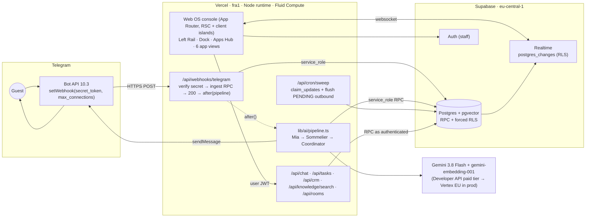
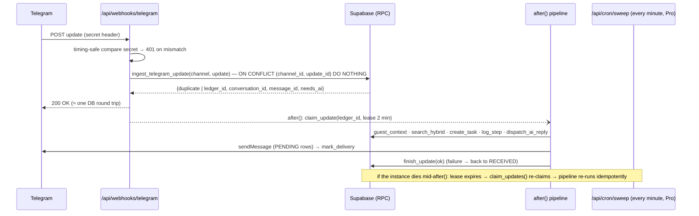

# Smartstay 3.0 on Next.js + Vercel + Supabase + Telegram + Gemini 3.8 Flash — engineering blueprint

**Retrieval date for external evidence: 24 September 2026.**

**Companion artefact:** [`db/supabase_master_schema.sql`](../db/supabase_master_schema.sql) (1,145 lines; SHA-256 `65a55423…0775b00d`).

**Goal.** Make the six Smartstay apps work as one production-shaped system:

- Contact Center
- CRM
- Operations
- Storage/RAG
- AI Team
- Analytics

It runs as a Next.js App Router application on Vercel, backed by Supabase (PostgreSQL + pgvector). Guests reach it through a live Telegram bot, and Gemini 3.8 Flash does the reasoning.

## 0. Evidence convention and what was actually tested

| Label | Meaning |
|---|---|
| **[D]** | Documented on a fetched primary page (official docs, changelogs, registries). URL inline or in §12. |
| **[O]** | Observed in this repository: executed SQL, test output. |
| **[I]** | Inference or design, including all TypeScript in this document: written against the documented APIs but **not executed here**. |
| **[U]** | Unverified: secondary source, snippet, or conflicting reports. |

**[O] What was executed.**

- **Local emulation of Supabase.** `db/supabase_master_schema.sql` was run with `psql -v ON_ERROR_STOP=1` against PostgreSQL **16.15**, pgvector **0.8.6**, btree_gist 1.7 and pgcrypto 1.3.
  - The script ran as a **non-superuser `postgres` role with `BYPASSRLS`**, which approximates the hosted SQL Editor role [D: the editor runs as `postgres`; not a true superuser, U].
  - The emulated environment had `anon`/`authenticated`/`service_role` roles, an `auth.uid()` reading `request.jwt.claims`, `auth.users`, and a `supabase_realtime` publication. The prelude is in §11.
- **Results:**
  - two consecutive runs on a fresh database, **0 errors each**;
  - an end-to-end suite of **38 checks, 38 PASS, 0 FAIL** (§11.2);
  - RLS forced on **21/21** tables;
  - 6 tables in `supabase_realtime`.

**[U] What was not executed.**

- **A hosted Supabase project.** The actual SQL Editor, PostgREST, Realtime and the Postgres 17 default were not tested.
- **The Next.js code.** No Vercel deployment, no Telegram bot, no Gemini call.
- **Required first step on a real project:** paste the SQL and run the §11.2 checks through supabase-js.

---

## 1. Executive summary

1. **[I] Architecture.**
   - **Frontend and API:** one Next.js 16 App Router project on Vercel in `fra1` (Frankfurt). It serves the Web OS console (Left Rail, Dock, Apps Hub, six focused views) and thin Route Handlers.
   - **Business logic:** in PostgreSQL, as RPC functions with row-level security. This is where every invariant from the platform research is enforced:
     - idempotency;
     - the task state machine and attestation;
     - the dispatch gate;
     - tenant isolation.
   - **Realtime:** the console listens to Supabase Realtime.
2. **[I/O] Telegram without timeouts.** The webhook does four things:
   - verifies `X-Telegram-Bot-Api-Secret-Token`;
   - writes the update through `contact_center.ingest_telegram_update()`, deduplicated on `update_id` in one transaction;
   - returns **200 immediately**;
   - runs the Gemini pipeline in `after()`.

   A leased ledger (`contact_center.inbound_updates`) plus a Vercel Cron sweeper recovers work lost if an instance dies mid-`after()`. Vercel documents that `waitUntil`/`after()` work is **not durable** [D]. Dedupe, lease exclusivity and sweeper re-claim were tested [O].
3. **[O] The master SQL:**
   - 7 schemas and 21 tables;
   - forced RLS everywhere;
   - staff read via RLS and write **only via RPCs**; the server uses `service_role`;
   - `btree_gist` exclusion constraints prevent double-booking a room and overlapping approved document versions;
   - `vector(768)` chunks with `kb.match_documents` and a hybrid lexical/vector search that works before any embedding exists;
   - analytics views with `security_invoker`;
   - the Kakheti seed: Chateau Telavi, Room 12, Saperavi 2022 at 90 GEL, Nino with a Telegram deep-link token.
4. **[D/I] Realtime.**
   - Use **Postgres Changes** for the console now: RLS-filtered per subscriber, zero extra code.
   - Plan **Broadcast from Database** (`realtime.broadcast_changes()` triggers plus private channels) as the scale path. Postgres Changes is processed on a single thread and documented to top out around **3,000 msgs/s** [D].
   - SSE from Vercel functions is the weakest option: connections are bounded by function duration and billed while open.
5. **[D/I] Gemini:**
   - **SDK:** `@google/genai` **v2.24.0**. `@google/generative-ai` is deprecated.
   - **Model:** `gemini-3.8-flash` with `thinkingConfig.thinkingLevel` of `low`/`medium`/`high`. `minimal` errors on 3.8 Flash. Keep temperature at the default 1.0 [D].
   - **Embeddings:** `gemini-embedding-001` with `outputDimensionality: 768` and `taskType` `RETRIEVAL_DOCUMENT`/`RETRIEVAL_QUERY`. The newer `gemini-embedding-2` **drops `taskType`** [D].
   - **Residency:** the Gemini Developer API has **no EU data-residency guarantee**, and its free tier's content **is used to improve Google products**. A guest-PII production deployment needs the paid tier at minimum, and Vertex AI in the EU via Vercel OIDC federation (no key files) [D].
6. **[O/U] Honest scope.**
   - The SQL is a **clean, demo-scale consolidation (21 tables)** of the MVP and the verified platform patterns. It is **not** a literal merge of the five locked app DDLs; the 04 residual scan covered 114 tables.
   - Not ported: the RTBF saga, the R1 relay with head-of-line ordering and dead letters, and the causal-depth limiter (research 02 and 04). §5.6 lists them as the next migrations.

### 1.1 Corrections to the brief's premises

| # | Premise | Finding | Label |
|---|---|---|---|
| C1 | "Next.js 15+" | The current stable line is **Next.js 16.3.6**. In 16.3 **`runtime = 'edge'` is no longer supported** and `middleware.ts` is renamed `proxy.ts`. Target 16.x with the Node runtime | [D] nextjs.org; [D] vercel.com runtime docs; rename [U] |
| C2 | "`@google/genai` (or `@google/generative-ai`)" | `@google/generative-ai` is **deprecated** (repo renamed `deprecated-generative-ai-js`; flagged EOL 30 Nov 2025). Use `@google/genai` 2.24.0 | [D] npm registry, GitHub |
| C3 | "`vector(768)` or `vector(1536)`" | Both work with `gemini-embedding-001` (MRL, 128–3072). **768 chosen**: half the storage of 1536, and per-tenant corpora are small (§5.4). With cosine distance (`<=>`), re-normalising truncated vectors does not change rankings; it matters only for inner-product search | [D] ai.google.dev embeddings; normalisation reasoning [I] |
| C4 | Supabase schemas "accessible via Supabase client" | Since **30 May 2026, new Supabase projects no longer auto-grant Data API access** to new tables and functions. The script therefore GRANTs explicitly and sets default privileges. Custom schemas must also be added to **Exposed schemas** in the dashboard (not settable from SQL) | [D] Supabase changelog 45329 |
| C5 | "Immediately acknowledge Telegram … without timing out" | Timeouts are not the risk: Vercel functions default to **300 s** on every plan (Pro up to 800 s GA) with Fluid Compute. The risks are **durability** (`after()` dies with the instance) and **Telegram's undocumented retry count**. The fix is the ledger plus sweeper, not a longer timeout | [D] vercel.com/docs/functions; [D] core.telegram.org/bots/api |
| C6 | Supabase "PostgreSQL 16" | New hosted projects appear to default to **Postgres 17** [U]. The SQL uses only PG15+ features (`security_invoker` views, `ON DELETE SET NULL (col)`) and ran on 16.15 [O]. Verify with `select version()` | [U]/[O] |

---

## 2. System architecture



### 2.1 Project structure [I]

```text
smartstay/
├─ app/
│  ├─ (os)/layout.tsx                 # Web OS shell: LeftRail, Header, BottomDock (client), Realtime provider
│  ├─ (os)/page.tsx                   # Apps Hub (8 cards)
│  ├─ (os)/contact/page.tsx           # Contact Center: channels, conversation list, transcript, takeover
│  ├─ (os)/crm/page.tsx               # CRM table (guest_crm.profiles + stays + preferences)
│  ├─ (os)/ops/page.tsx               # Room turnover + task board
│  ├─ (os)/drive/page.tsx             # Storage: kb.documents by folder, chunk preview, citations
│  ├─ (os)/ai/page.tsx                # AI Team: agents, live reasoning (ai_team.steps)
│  ├─ (os)/analytics/page.tsx         # analytics.kpis / daily_messages / task_throughput
│  ├─ login/page.tsx                  # Supabase Auth (staff)
│  └─ api/
│     ├─ webhooks/telegram/route.ts   # service_role; secret-token verified; after()
│     ├─ cron/sweep/route.ts          # CRON_SECRET; re-claims leased/failed updates; flushes PENDING sends
│     ├─ chat/route.ts                # staff reply / takeover (user JWT) → Telegram send
│     ├─ tasks/[id]/route.ts          # ops.task_action (user JWT) → flush guest notice
│     ├─ rooms/[id]/route.ts          # ops.room_action (user JWT) → flush guest notice
│     ├─ crm/route.ts                 # guest_crm reads + create_link_token (user JWT)
│     └─ knowledge/search/route.ts    # embed query → kb.search_hybrid (user JWT)
├─ lib/
│  ├─ supabase/server.ts              # @supabase/ssr createServerClient (cookies) — user JWT
│  ├─ supabase/admin.ts               # createClient(url, SERVICE_ROLE_KEY) — server-only module
│  ├─ telegram.ts                     # sendMessage / sendChatAction / setWebhook helpers
│  ├─ ai/gemini.ts                    # GoogleGenAI client (Developer API or Vertex+OIDC)
│  ├─ ai/pipeline.ts                  # multi-agent loop
│  └─ ai/embed.ts                     # embedContent helpers
├─ components/os/*                    # the verified Web OS components (apps/frontend/src/components → TSX)
├─ scripts/embed-backfill.ts          # fills kb.chunks.embedding
├─ vercel.json                        # crons + regions
└─ db/supabase_master_schema.sql
```

**[I] Porting the existing UI.** The Web OS components in `apps/frontend/src/components/` (LeftRail, Header, BottomDock, AppsGrid, and the five views) move over nearly unchanged as client components. `ctx.ov` (the FastAPI `/api/overview`) is replaced by typed Supabase queries in Server Components, plus Realtime subscriptions in a `RealtimeProvider`. The mapping from the FastAPI endpoints is in §8.2.

### 2.2 Route Handlers and credentials

| Route | Caller | Supabase key | Main RPCs |
|---|---|---|---|
| `POST /api/webhooks/telegram` | Telegram | `service_role` (server only) | `ingest_telegram_update`, `claim_update`, pipeline RPCs, `finish_update` |
| `GET /api/cron/sweep` | Vercel Cron (`Authorization: Bearer $CRON_SECRET`) | `service_role` | `claim_updates`, pipeline, `mark_delivery` |
| `POST /api/chat` | staff browser | user JWT (`authenticated`) | `set_control`, `operator_reply`; then the server sends to Telegram and calls `mark_delivery` with `service_role` |
| `POST /api/tasks/[id]` | staff | user JWT | `ops.task_action`; flush the returned `notice_message_id` |
| `POST /api/rooms/[id]` | staff | user JWT | `ops.room_action`; flush notice |
| `GET/POST /api/crm` | staff | user JWT | table reads (RLS); `guest_crm.create_link_token` |
| `POST /api/knowledge/search` | staff | user JWT | embed the query, then `kb.search_hybrid` |

**[I] Rule.** The service-role key never reaches the browser, and staff mutations run **as the staff user**. That way `platform.require_staff()`, the role checks (for example, only a supervisor may `MarkClean`) and RLS all apply [O: tested].

---

## 3. Telegram webhook resilience on Vercel

### 3.1 Platform facts

| Fact | Value | Label |
|---|---|---|
| Bot API version | **10.3** (24 Aug 2026) | [D] core.telegram.org/bots/api |
| Webhook auth | `setWebhook(secret_token)` (1–256 chars) → header `X-Telegram-Bot-Api-Secret-Token` on every call | [D] |
| Concurrency | `max_connections` 1–100 (default 40): parallel deliveries | [D] |
| Retries | On non-2xx, Telegram "will repeat the request and give up after a reasonable amount of attempts". **No documented count or backoff** | [D] |
| Idempotency key | `update_id` | [D] |
| Ports | 443, 80, 88, 8443 | [D] |
| Health | `getWebhookInfo`: `pending_update_count`, `last_error_message` | [D] |
| Deep links | `t.me/<bot>?start=<payload>`; payload `[A-Za-z0-9_-]`, **≤ 64 chars** | [D] core.telegram.org/bots/features |
| Bots cannot message first | The user must `/start` the bot | [U] (well established) |
| `sendChatAction('typing')` | Lasts about 5 s; repeat every ~4 s | [D/U] |
| Text limit | 4,096 chars per `sendMessage`. The SQL enforces `length(body) <= 4096` [O] | [D] |
| Vercel function duration | Default **300 s** on all plans with Fluid Compute (default since 23 Apr 2025); Pro/Enterprise max **800 s** GA | [D] vercel.com/docs/functions |
| `after()` | Stable since Next **15.1.0**; runs after the response is sent; **shares the route's `maxDuration`**; implemented with `waitUntil` on Vercel | [D] nextjs.org |
| Durability | `waitUntil` work is **cancelled on timeout**, with no retry if the instance dies | [D] vercel.com/docs/functions |
| Region | `fra1` available; default `iad1` | [D] |

### 3.2 Ack-fast pattern with a durable ledger [I, SQL tested]



**[O] Invariants tested in SQL.**
- A Telegram retry of the same `update_id` returns `{duplicate: true}` and writes nothing.
- A leased row cannot be claimed by a second worker.
- An unfinished row is re-claimed by the sweeper after its lease.
- `ai_team.start_session()` is idempotent per trigger message, so a re-run cannot create a second reasoning session.

`claim_updates()` marks a row `FAILED` after `p_max_attempts` (default 5).

```ts
// app/api/webhooks/telegram/route.ts   [I — written against documented APIs, not executed here]
import { after } from 'next/server';
import { timingSafeEqual } from 'node:crypto';
import { admin } from '@/lib/supabase/admin';
import { runPipeline } from '@/lib/ai/pipeline';
import { flushOutbound, sendWelcome } from '@/lib/telegram';

export const maxDuration = 60;            // the pipeline budget; the default (300 s) would also do
const CHANNEL_ID = process.env.TELEGRAM_CHANNEL_ID!;   // contact_center.channels.id

function secretOk(req: Request) {
  const got = Buffer.from(req.headers.get('x-telegram-bot-api-secret-token') ?? '');
  const want = Buffer.from(process.env.TELEGRAM_WEBHOOK_SECRET!);
  return got.length === want.length && timingSafeEqual(got, want);
}

export async function POST(req: Request) {
  if (!secretOk(req)) return new Response('unauthorized', { status: 401 });
  const update = await req.json();
  const { data, error } = await admin.schema('contact_center')
    .rpc('ingest_telegram_update', { p_channel_id: CHANNEL_ID, p_update: update });
  if (error) return new Response('retry', { status: 500 });   // Telegram will redeliver; ingest is idempotent
  if (data.duplicate || data.ignored) return Response.json({ ok: true });

  after(async () => {
    const { data: claimed } = await admin.schema('contact_center').rpc('claim_update', { p_ledger_id: data.ledger_id });
    if (!claimed) return;                                        // another worker (or the sweeper) owns it
    try {
      if (data.command === 'start_bound' || data.command === 'start') await sendWelcome(data);  // includes AI disclosure
      else if (data.needs_ai) await runPipeline(data);           // writes steps, tasks, reply (PENDING)
      await flushOutbound(data.conversation_id);                 // sendMessage for PENDING rows → mark_delivery
      await admin.schema('contact_center').rpc('finish_update', { p_ledger_id: data.ledger_id, p_ok: true });
    } catch (e) {
      await admin.schema('contact_center').rpc('finish_update', { p_ledger_id: data.ledger_id, p_ok: false, p_error: String(e) });
    }
  });
  return Response.json({ ok: true });
}
```

```ts
// app/api/cron/sweep/route.ts   [I]
export async function GET(req: Request) {
  if (req.headers.get('authorization') !== `Bearer ${process.env.CRON_SECRET}`) return new Response('no', { status: 401 });
  const { data: rows } = await admin.schema('contact_center').rpc('claim_updates', { p_limit: 10 });
  for (const row of rows ?? []) { /* re-run ingest result → pipeline → flush → finish_update (same code path as after()) */ }
  // also: select PENDING outbound older than 30 s → send → mark_delivery (covers operator replies and notices)
  return Response.json({ reclaimed: rows?.length ?? 0 });
}
```

```json
// vercel.json   [I] — cron cadence below daily requires a paid plan [U: Hobby = daily only]
{ "regions": ["fra1"], "crons": [{ "path": "/api/cron/sweep", "schedule": "* * * * *" }] }
```

```bash
# Register the webhook (once per deployment URL)   [D parameters]
curl -s "https://api.telegram.org/bot$TELEGRAM_BOT_TOKEN/setWebhook" \
  -d url="https://smartstay.example.com/api/webhooks/telegram" \
  -d secret_token="$TELEGRAM_WEBHOOK_SECRET" \
  -d max_connections=10 \
  -d allowed_updates='["message","business_message"]' \
  -d drop_pending_updates=false
```

**[I] Per-conversation ordering.** Telegram delivers updates in parallel, but the database assigns each message's `seq` under a row lock on the conversation [O]. The transcript order is therefore consistent even if two updates race. To avoid two concurrent AI replies to the same guest, the pipeline processes only the **newest** unanswered guest message per conversation, feeding earlier ones in as context. Before running, it checks for a `RUNNING` session on the conversation; if one exists, it leaves the row `RECEIVED` for the sweeper.

**[D/I] When to move beyond `after()` and the sweeper:**
- **Vercel Queues** (public beta since about Feb 2026; at-least-once delivery with consumer retries), and **Vercel Workflows** for durable multi-step runs [D, beta];
- **Upstash QStash** or **Inngest** (mature at-least-once delivery) [D];
- **Supabase Queues (pgmq)**, which keeps the queue in the same database [D exists].

The ledger design maps onto any of them: the ledger row is the message, and `update_id` is the idempotency key.

---

## 4. Real-time console synchronisation

| Option | How | Pros | Cons | Label |
|---|---|---|---|---|
| **Supabase Realtime: Postgres Changes** | Tables in the `supabase_realtime` publication (done by the SQL [O]). The client subscribes with `schema`/`table`/`filter` | Zero server code; **RLS evaluated per subscriber**, so tenant isolation carries through; works with the forced-RLS schema | Changes processed **on a single thread**; about **3,000 msgs/s** ceiling regardless of compute size; above about 3,000 concurrent subscribers, docs recommend Broadcast | [D] supabase.com/docs/guides/realtime |
| **Supabase Realtime: Broadcast from Database** | Triggers call `realtime.broadcast_changes()` / `realtime.send()` into **private channels**; authorisation via RLS on `realtime.messages` | Scales horizontally; payload shaping; one topic per property | Needs trigger and policy SQL (§4.2); topic authorisation must mirror `platform.my_space_ids()` | [D] |
| **SSE from Vercel Route Handlers** | Stream a `ReadableStream`; server polls or LISTENs | Familiar (the MVP uses SSE) | Connection lives inside a function invocation (bounded by `maxDuration`, billed while open); no fan-out between instances; you rebuild what Realtime provides | [I] from Vercel duration and billing docs |

**[I] Decision.** Use Postgres Changes for launch (demo to about 50 properties). Switch to Broadcast-from-Database when the console's concurrent subscriptions, or change volume, approach the documented limits.

The subscription set is:
- `contact_center.messages` (transcripts);
- `contact_center.conversations` (AI/Operator status pills);
- `ops.tasks` and `ops.rooms` (turnover board);
- `ai_team.steps` and `ai_team.sessions` (live reasoning feed).

### 4.1 Client subscription [I]

```ts
// components/os/RealtimeProvider.tsx (client) — user session from @supabase/ssr; RLS filters events per user
const channel = supabase.channel(`space:${spaceId}`)
  .on('postgres_changes', { event: '*', schema: 'contact_center', table: 'messages', filter: `space_id=eq.${spaceId}` }, onMessage)
  .on('postgres_changes', { event: '*', schema: 'ops', table: 'tasks', filter: `space_id=eq.${spaceId}` }, onTask)
  .on('postgres_changes', { event: '*', schema: 'ops', table: 'rooms', filter: `space_id=eq.${spaceId}` }, onRoom)
  .on('postgres_changes', { event: 'INSERT', schema: 'ai_team', table: 'steps', filter: `space_id=eq.${spaceId}` }, onStep)
  .subscribe();
// analytics: re-query analytics.kpis on any event (debounced 500 ms) — views are not publishable
```

### 4.2 Scale path: Broadcast from Database [D pattern, I adaptation]

```sql
-- One private topic per property; RLS on realtime.messages authorises subscribers by membership.
create or replace function ops.broadcast_task() returns trigger language plpgsql security definer set search_path = '' as $$
begin
  perform realtime.broadcast_changes('space:' || coalesce(new.space_id, old.space_id)::text, tg_op, tg_op,
                                     tg_table_name, tg_table_schema, new, old);
  return null;
end $$;
create trigger tasks_broadcast after insert or update or delete on ops.tasks for each row execute function ops.broadcast_task();
create policy "members receive their property topic" on realtime.messages for select to authenticated
  using ( split_part(realtime.topic(), ':', 2)::uuid in (select platform.my_space_ids()) );
```

This is not included in the master SQL: the `realtime` schema exists only on Supabase, and the emulation could not test it.

---

## 5. Data layer: `db/supabase_master_schema.sql`

### 5.1 How to install

1. **Create the project.** Region **eu-central-1 (Frankfurt)** [D available].
2. **Run the SQL.** Dashboard → SQL Editor → paste the file → Run. It wraps everything in `begin … commit`, and on a demo project **it re-runs cleanly: it drops and recreates its own seven schemas** [O: 2 consecutive runs, 0 errors].
3. **Expose the schemas.** Dashboard → Project Settings → Data API → **Exposed schemas**, add:
   - `platform`
   - `contact_center`
   - `guest_crm`
   - `ops`
   - `kb`
   - `ai_team`
   - `analytics`

   This is dashboard configuration and cannot be set from SQL [D].
4. **Create the staff logins.** Authentication → create users, then link each to a staff row:

   ```sql
   update platform.staff set user_id = '<auth uid>' where display_name = 'Levan Beridze';
   ```

5. **Backfill the embeddings** (§6.3). Until then, `kb.search_hybrid` ranks lexically [O].

### 5.2 Schema map

| Schema | Tables | Purpose | Realtime |
|---|---|---|---|
| `platform` | `spaces`, `staff` | Tenant authority; staff ↔ `auth.users`; role catalogue (`FRONT_DESK_LEAD`, `ROOM_ATTENDANT`, `HOUSEKEEPING_SUPERVISOR`, `SOMMELIER`, `GENERAL_MANAGER`) | — |
| `contact_center` | `channels`, `conversations`, `chapters`, `messages`, `inbound_updates` | Telegram channel; conversation control (`AI_ACTIVE`/`OPERATOR_LOCKED`/`RESOLVED`); semantic chapters per stay; **immutable** messages with gap-free `seq` and delivery bookkeeping; webhook ledger | messages, conversations |
| `guest_crm` | `profiles`, `identities`, `stays`, `preferences`, `link_tokens` | Guests, Telegram identities, stays (**btree_gist no-overlap per room**), preferences (sensitive requires `explicit_consent` plus `consent_ref`), deep-link tokens (`gen_random_bytes`) | — |
| `ops` | `rooms`, `room_events`, `tasks`, `attestations` | Turnover DIRTY→CLEANING→CLEAN; task machine QUEUED→CLAIMED→IN_PROGRESS→COMPLETED with **mandatory human attestation** and +1 `state_version` | tasks, rooms |
| `kb` | `documents`, `chunks` | Versioned, approved, time-valid knowledge (**btree_gist: one approved version valid at a time**); chunks with `content_sha256` (pgcrypto `digest`), `fts`, `embedding vector(768)` | — |
| `ai_team` | `agents`, `sessions`, `steps` | Mia / Sommelier / Operations Coordinator (`gemini-3.8-flash`, per-agent `thinking_level`); sessions with token accounting; step log for the live reasoning feed | sessions, steps |
| `analytics` | views `kpis`, `daily_messages`, `task_throughput` | `security_invoker = true`, so RLS applies to the viewer [O] | (re-query) |

### 5.3 Security model

| Principal | Can do | Enforced by | Tested |
|---|---|---|---|
| `anon` | Nothing | No grants on any Smartstay schema | [O] "anon has no access" |
| `authenticated` (staff) | **SELECT** own properties' rows; **EXECUTE** only `set_control`, `operator_reply`, `task_action`, `room_action`, `create_link_token`, `match_documents`, `search_hybrid`, `my_space_ids` | Forced RLS `space_id in (select platform.my_space_ids())`; RPCs are `SECURITY DEFINER` with `set search_path = ''` and `platform.require_staff()` plus role checks | [O] RLS isolation; direct INSERT refused; foreign staff refused (42501); attendant cannot `MarkClean`; stale version 40001 |
| `authenticated` | Cannot read `inbound_updates` (raw payloads) or `link_tokens` | SELECT revoked; no policy | [O] |
| `service_role` (server only) | All tables and functions; `BYPASSRLS` | Supabase role attribute [D]; key kept in server-only modules | [O] pipeline |
| PUBLIC | No EXECUTE on any Smartstay function | `revoke execute … from public` plus default privileges | [O] `has_function_privilege` false for `authenticated` on ingest and for `anon` on search |

**How the platform research carries over [O/I]:**

| Research invariant | Supabase form |
|---|---|
| 01: transaction-local tenant context via `begin_request()` | PostgREST runs each request in its own transaction with `request.jwt.claims` set per request. Tenant scope is derived from `auth.uid()` → `platform.staff`, not a client-set GUC. There is nothing for a client to spoof |
| 01: `NOBYPASSRLS` runtime role and FORCE RLS | `authenticated` has no BYPASSRLS, and FORCE RLS is on all 21 tables. `service_role` bypass is confined to server code |
| 01: single-role members, separation of duties | `platform.staff.role`, checked inside RPCs (e.g. only `HOUSEKEEPING_SUPERVISOR`/`GENERAL_MANAGER` can `MarkClean`) |
| 03/04: App 3 attestation; the AI never claims completion | `ops.guard_task` trigger plus `attestations` statement check |
| MVP: dispatch gate (operator lock, evidence re-validation) | `contact_center.dispatch_ai_reply()` sends only if `AI_ACTIVE` **and** `kb.evidence_valid()`; otherwise it stores an internal draft [O] |
| 04 G5: one app per transaction to avoid deadlocks | RPCs touch the tables they own; cross-app effects (guest notices) are row appends inside the same RPC. Acceptable at demo scale; revisit if lock waits appear |

### 5.4 Vector sizing and indexing

- **[D]** pgvector HNSW is supported on Supabase, and an index can be created before data exists. `halfvec` is available.
- **[I] Tenant-scoped search does not need an ANN index at demo or pilot scale.** Every query filters `space_id` first; a hotel has hundreds to low thousands of chunks, and exact cosine over them is fast with perfect recall. This follows [production_product_roadmap.md](production_product_roadmap.md) §2.5, which also covers the post-filter recall problem of HNSW combined with RLS.
- **[I] When a tenant passes about 20k chunks,** add HNSW with `hnsw.iterative_scan = relaxed_order` (commented in the SQL).
- **[O] Tested:** `kb.match_documents` returns the nearest chunk by cosine, and returns **zero rows for another tenant's `space_id`**. `kb.search_hybrid` fuses lexical and vector ranks by reciprocal rank (k = 60) and returns Saperavi for "Saperavi 2022" before any embedding exists.

### 5.5 Seed (Kakheti demo)

| Entity | Seed |
|---|---|
| Property | `6f1c2d3e-…c7e1`, Chateau Telavi Wine Resort, Kakheti, Asia/Tbilisi |
| Staff | Levan Beridze (FRONT_DESK_LEAD), Tamar Gelashvili (ROOM_ATTENDANT), Ana Jorjadze (HOUSEKEEPING_SUPERVISOR), Giorgi Maisuradze (SOMMELIER), Nana Kapanadze (GENERAL_MANAGER). `user_id` is NULL until they sign up |
| Rooms | 12 Deluxe (DIRTY), 101 Superior (CLEAN), 102 Superior (CLEAN) |
| Guest | Nino Kakhetelashvili (Gold, +995555123456, verified); stay in room 12 from today (Tbilisi date) for 3 nights; preferences: Saperavi, qvevri tour, firm pillow, **tree-nut allergy (sensitive, consent_ref)** |
| Deep link | `https://t.me/<your_bot>?start=nino-telavi-demo` binds Nino's Telegram account [O] |
| Knowledge | Cellar & Wine List v3 (**Saperavi 2022 Estate Reserve, 90 GEL / 750 ml, sulphites, allergen-verified**; Rkatsiteli 65; Kindzmarauli 70); Guest Services Policy v5 (checkout / late checkout for Gold, tasting cancellation 24 h, towels within 30 min) |
| AI team | `mia` (medium thinking), `sommelier` (high), `coordinator` (low); all `gemini-3.8-flash` |
| Channel | Telegram channel `6f1c2d3e-…c4a01`, `bot_username` placeholder `ChateauTelaviBot` (set to your bot) |

### 5.6 Not in this consolidation (next migrations)

| Gap | Source spec | Why it matters |
|---|---|---|
| RTBF / erasure saga with receipts and a shipped anti-resurrection ledger | research 04 §1–§2 | The Georgian 10-working-day subject-request deadline; backups resurrect erased guests without it |
| Relay with head-of-line ordering, dead letters and the causal-depth limiter | research 02 §7 | Needed once apps exchange events asynchronously. Here, cross-app effects are synchronous in RPCs |
| Kernel capability matrix (templates, skills) | research 01 §5–§6 | Replaces the 5-value role enum when properties customise roles |
| Consent-evidence table and withdrawal flow | production roadmap §6.2 | Written consent for allergy (health) data |
| Retention jobs (`pg_cron`) for `inbound_updates.payload` and masked traces | roadmap §5.4 | Raw Telegram payloads contain PII; purge after processing (e.g. 30 days) |

---

## 6. Gemini 3.8 Flash and embeddings in Next.js

### 6.1 Client

| Item | Value | Label |
|---|---|---|
| Package | `@google/genai` **2.24.0** (Node ≥ 20) | [D] registry.npmjs.org |
| Model | `gemini-3.8-flash`: 1M context, 64K output, thinking `low`/`medium`(default)/`high`; `minimal` unsupported | [D] ai.google.dev |
| Temperature | Keep the default **1.0** for Gemini 3. Use `responseSchema` for determinism, not low temperature | [D] |
| Thought signatures | Mandatory when you replay multi-turn **function-calling** history: echo parts verbatim, or get a 400. The pipeline below avoids the issue by making **stateless single-turn calls** and running tools in code | [D] |
| Price (Developer API) | $0.75 / $3.75 per 1M input/output until 31 Dec 2026, then $1.50 / $7.50 | [D] ai.google.dev/pricing |
| Data use | **Free tier: content used to improve products. Paid tier: not.** Use a billed key for anything with guest data | [D] |
| Residency | Developer API: global processing, **no EU guarantee**. Vertex AI: regional or EU endpoints. Confirm `gemini-3.8-flash` is offered on the EU endpoint before relying on it | [D]/[U] |
| Vercel → Vertex auth | **Vercel OIDC federation to GCP Workload Identity Federation**, documented, with no JSON key in env vars | [D] vercel.com/docs/oidc/gcp |

```ts
// lib/ai/gemini.ts   [I]
import { GoogleGenAI } from '@google/genai';
export const ai = process.env.GOOGLE_GENAI_USE_VERTEX === '1'
  ? new GoogleGenAI({ vertexai: true, project: process.env.GCP_PROJECT_ID, location: process.env.GCP_LOCATION /* EU endpoint */,
                      googleAuthOptions: { authClient: vercelOidcAuthClient(), projectId: process.env.GCP_PROJECT_ID } })
  : new GoogleGenAI({ apiKey: process.env.GEMINI_API_KEY });   // demo: paid-tier key only
export const MODEL = 'gemini-3.8-flash';
```

### 6.2 The multi-agent pipeline (Mia → Sommelier → Coordinator) [I]

**Design rule [I]: the model decides and phrases; code and SQL enforce.**
- Prices, allergens, task creation, the dispatch gate and evidence validity are all checked outside the model.
- The model never sees credentials, never chooses the tenant, and never receives sensitive CRM facts in its prompt. Allergens are compared in code against the chunk's structured `allergens`.

```ts
// lib/ai/pipeline.ts   [I — condensed; every RPC exists in the master SQL and was exercised in §11.2]
import { Type } from '@google/genai';
const INTENTS = { type: Type.OBJECT, properties: { intents: { type: Type.ARRAY, items: { type: Type.OBJECT, properties: {
  kind: { type: Type.STRING, enum: ['wine_order','wine_info','amenity','policy','other'] },
  query: { type: Type.STRING }, item: { type: Type.STRING }, quantity: { type: Type.INTEGER }, room: { type: Type.STRING } },
  required: ['kind'] } } }, required: ['intents'] };

export async function runPipeline(x: IngestResult) {
  const cc = admin.schema('contact_center'), team = admin.schema('ai_team');
  const { data: s } = await team.rpc('start_session', { p_conversation_id: x.conversation_id, p_trigger_message_id: x.message_id });
  if (s.state !== 'RUNNING') return;                                    // idempotent re-run: already handled
  const step = (agent: string, kind: string, title: string, detail = {}, u?: Usage) =>
    team.rpc('log_step', { p_session_id: s.id, p_agent_key: agent, p_kind: kind, p_title: title, p_detail: detail,
      p_input_tokens: u?.promptTokenCount ?? 0, p_output_tokens: u?.candidatesTokenCount ?? 0, p_thinking_tokens: u?.thoughtsTokenCount ?? 0 });
  const typing = keepTyping(x.chat_id);                                 // sendChatAction every 4 s
  try {
    const text = await lastGuestText(x.message_id);
    // 1. Mia classifies (low thinking, JSON schema)
    const cls = await ai.models.generateContent({ model: MODEL, contents: text,
      config: { systemInstruction: MIA_CLASSIFY, responseMimeType: 'application/json', responseSchema: INTENTS,
                thinkingConfig: { thinkingLevel: 'low' } } });
    const { intents } = JSON.parse(cls.text ?? '{"intents":[]}');
    await step('mia', 'DECISION', `Classified ${intents.length} intent(s)`, { intents }, cls.usageMetadata);
    // 2. CRM Layer-1 memory (sensitive facts stay in code)
    const { data: ctx } = await admin.schema('guest_crm').rpc('guest_context', { p_profile_id: x.profile_id });
    await step('mia', 'TOOL_RESULT', `${ctx.profile.full_name} · room ${ctx.stay?.room_number ?? '—'}`, { preferences: ctx.preferences });
    if (!intents.length || intents.every((i: any) => i.kind === 'other')) return handoff(s, x, text);
    // 3. Sommelier / policy retrieval: embed query → hybrid search (approved + valid now)
    const evidence = [];
    for (const i of intents.filter((i: any) => i.kind !== 'amenity' && i.kind !== 'other')) {
      await step(i.kind.startsWith('wine') ? 'sommelier' : 'mia', 'TOOL_CALL', 'knowledge.search', { query: i.query ?? i.item });
      const qv = await embedQuery(i.query ?? i.item ?? text);
      const { data: hits } = await admin.schema('kb').rpc('search_hybrid',
        { query_text: i.query ?? i.item ?? text, p_space_id: x.space_id, query_embedding: qv, match_count: 3 });
      const top = hits?.[0]; if (!top) continue;
      const conflict = (top.structured.allergens ?? []).some((a: string) => ctx.sensitive.some((f: any) => f.value.toLowerCase().includes(a)));
      await step('sommelier', 'GUARDRAIL', conflict ? 'Allergen conflict → staff' : 'Allergen check passed', { allergens: top.structured.allergens });
      evidence.push({ chunk_id: top.chunk_id, document: top.document_title, version: top.document_version, structured: top.structured });
    }
    // 4. Coordinator creates tasks (never completes them)
    for (const i of intents.filter((i: any) => i.kind === 'amenity' || i.kind === 'wine_order')) {
      await admin.schema('ops').rpc('create_task', { p_conversation_id: x.conversation_id, p_session_id: s.id,
        p_category: i.kind === 'amenity' ? 'housekeeping' : 'food_beverage', p_title: taskTitle(i), p_detail: taskDetail(i, ctx),
        p_room_id: ctx.stay?.room_id ?? null, p_quantity: i.quantity ?? 1, p_requires_confirmation: i.kind === 'wine_order' });
      await step('coordinator', 'TOOL_RESULT', `Task queued · ${taskTitle(i)}`);
    }
    // 5. Mia composes from facts only (medium thinking); deterministic price check before dispatch
    const reply = await ai.models.generateContent({ model: MODEL,
      contents: JSON.stringify({ guest_message: text, guest: ctx.profile, preferences: ctx.preferences, facts: evidence, tasks: intents }),
      config: { systemInstruction: MIA_COMPOSE /* includes: never claim completion; only quote facts */, thinkingConfig: { thinkingLevel: 'medium' } } });
    const body = reply.text ?? '';
    assertPricesGrounded(body, evidence);                               // every "NN GEL" must equal a cited price_gel
    await step('mia', 'REPLY', 'Composed grounded reply', { chars: body.length }, reply.usageMetadata);
    await cc.rpc('dispatch_ai_reply', { p_session_id: s.id, p_body: body, p_evidence: evidence.map(e => ({ chunk_id: e.chunk_id })) });
  } catch (e) {
    await team.rpc('fail_session', { p_session_id: s.id, p_error: String(e) });
    throw e;                                                            // → finish_update(false) → sweeper retry
  } finally { typing.stop(); }
}
```

**[I] Latency budget.** Classify (low thinking), about 1–3 s; embed plus search, well under 1 s; compose (medium), about 2–6 s. That is typically under 15 s, well inside `maxDuration = 60` and far below the 300 s platform default [D]. These are estimates to measure, not benchmarks.

**[I] 429 and 503 handling.** Use exponential backoff with jitter (the documented guidance [D]), up to 3 attempts. If generation still fails, the session is marked `FAILED`, the update goes back to `RECEIVED` for the sweeper, and after `p_max_attempts` it becomes `FAILED` for staff review. Guests are never left without a path: the handoff message and operator takeover remain available.

### 6.3 Embeddings [D API, I code]

```ts
// lib/ai/embed.ts   [I]
export async function embedQuery(text: string) {
  const r = await ai.models.embedContent({ model: 'gemini-embedding-001', contents: text,
    config: { outputDimensionality: 768, taskType: 'RETRIEVAL_QUERY' } });
  return r.embeddings![0].values;                          // number[768]; cosine (<=>) is scale-invariant
}
// scripts/embed-backfill.ts — run with the service key after installing the schema
const { data: rows } = await admin.schema('kb').from('chunks').select('id, content').is('embedding', null).limit(100);
for (const c of rows ?? []) {
  const r = await ai.models.embedContent({ model: 'gemini-embedding-001', contents: c.content,
    config: { outputDimensionality: 768, taskType: 'RETRIEVAL_DOCUMENT' } });
  await admin.schema('kb').from('chunks')
    .update({ embedding: r.embeddings![0].values, embedding_model: 'gemini-embedding-001@768', embedded_at: new Date().toISOString() })
    .eq('id', c.id);
}
```

- **[D]** `gemini-embedding-2` (GA about Apr 2026, multimodal, 3072-dimensional, $0.20 per 1M text tokens) **has no `taskType`**. `gemini-embedding-001` keeps the asymmetric query/document pattern.
- **[U]** The `-001` price was not re-confirmed.
- **[U]** Georgian is not named in either model's documentation. Run the Georgian retrieval eval from the roadmap (§5.6) before relying on semantic ranking for Georgian queries. The lexical leg of `search_hybrid` still works.

---

## 7. The six-app loop, end to end

```mermaid
sequenceDiagram
  participant Guest as Guest (Telegram)
  participant CC as App 1 Contact Center
  participant AI as App 5 AI Team (Gemini)
  participant CRM as App 2 CRM
  participant KB as App 4 Storage/RAG
  participant OPS as App 3 Operations
  participant AN as App 6 Analytics
  participant Staff as Staff console (Realtime)
  Guest->>CC: "Saperavi 2022 + 2 extra towels, room 12"
  CC->>CC: ingest_telegram_update → message seq n, chapter "Stay 24 Sep – 27 Sep"
  CC-->>Staff: realtime: messages INSERT, conversation status "AI Replying"
  CC->>AI: after(): start_session
  AI->>CRM: guest_context → Gold, room 12, prefs; sensitive kept in code
  AI->>KB: embed + search_hybrid → Saperavi 90 GEL, sulphites (chunk + sha256)
  AI->>OPS: create_task ×2 (towels; wine needing confirmation)
  OPS-->>Staff: realtime: tasks INSERT → board
  AI-->>Staff: realtime: ai_team.steps INSERT → live reasoning feed
  AI->>CC: dispatch_ai_reply (AI_ACTIVE + evidence valid) → PENDING → sendMessage → SENT
  Staff->>OPS: Claim → Start → Attest (task_action as the staff user)
  OPS->>CC: queue_guest_notice "Done: deliver 2 extra towels — room 12."
  Staff->>OPS: room_action StartCleaning → (supervisor) MarkClean → notice "room 12 ready"
  AN-->>Staff: analytics.kpis re-queried on events (open tasks, rooms ready, AI sessions, tokens)
```

| Hop | Table / RPC | Test evidence [O] |
|---|---|---|
| Telegram → message | `contact_center.ingest_telegram_update` | deep link binds; dedupe; `needs_ai`; chapter "Stay 24 Sep – 27 Sep" |
| Message → AI session | `ai_team.start_session` (unique per trigger), `log_step` | idempotent; token accounting |
| CRM memory | `guest_crm.guest_context` | room 12; 1 sensitive fact separated |
| RAG | `kb.search_hybrid`, `kb.match_documents`, `kb.evidence_valid` | Saperavi found lexically and by vector; tenant-scoped |
| Tasks | `ops.create_task` → `ops.task_action` | state machine; stale version; attestation; notice |
| Rooms | `ops.room_action` | attendant blocked from release; supervisor releases; "room ready" notice |
| Reply gate | `contact_center.dispatch_ai_reply` | sent while `AI_ACTIVE`; **draft** after operator takeover |
| Staff reply | `set_control`, `operator_reply` | queued PENDING for the server to send |
| Analytics | `analytics.kpis` | 1 guest, 1 open task, 3/3 rooms ready, 3 inbound, 2 AI sessions, 1 handoff, 1,580 tokens (test data) |

---

## 8. Deployment runbook

### 8.1 Environment [I]

| Variable | Where | Notes |
|---|---|---|
| `NEXT_PUBLIC_SUPABASE_URL`, `NEXT_PUBLIC_SUPABASE_ANON_KEY` | Vercel (all envs) | Browser client. `anon` has no grants: staff must log in |
| `SUPABASE_SERVICE_ROLE_KEY` | Vercel (server) | Import only from `lib/supabase/admin.ts` (add `import 'server-only'`) |
| `TELEGRAM_BOT_TOKEN`, `TELEGRAM_WEBHOOK_SECRET`, `TELEGRAM_CHANNEL_ID` | Vercel (server) | Secret: 1–256 chars; the channel id is the seeded `6f1c2d3e-…c4a01` |
| `GEMINI_API_KEY` **or** Vertex variables (`GOOGLE_GENAI_USE_VERTEX=1`, `GCP_PROJECT_ID`, `GCP_PROJECT_NUMBER`, `GCP_LOCATION`, WIF pool/provider, `GCP_SERVICE_ACCOUNT_EMAIL`) | Vercel (server) | A paid-tier key for any guest data; Vertex + OIDC for production residency |
| `CRON_SECRET` | Vercel | Vercel sends it as `Authorization: Bearer` on cron invocations |

### 8.2 FastAPI MVP → Next.js mapping [I]

| MVP (`apps/backend/routes.py`) | Next.js |
|---|---|
| `GET /api/overview` | Server Components query the tables and views directly (RLS) |
| `GET /api/stream` (SSE plus in-memory broker plus outbox relay) | Supabase Realtime `postgres_changes` (§4) |
| `POST /api/chat/send` (simulate) | Telegram, or a staff-only "simulate" action calling `ingest_telegram_update` with a synthetic update |
| `POST /api/tasks/{id}/action` | `POST /api/tasks/[id]` → `ops.task_action` |
| `POST /api/rooms/{id}/action` | `POST /api/rooms/[id]` → `ops.room_action` |
| `POST /api/conversations/control`, `/api/chat/operator` | `POST /api/chat` → `set_control` / `operator_reply` |
| `POST /api/demo/reset` | Re-run the SQL (demo project only) |

### 8.3 Smoke test after deployment [I]

1. `getWebhookInfo` shows the URL and `pending_update_count` 0.
2. Open `t.me/<bot>?start=nino-telavi-demo`. You should get a welcome with the AI disclosure, and `guest_crm.identities` gains a verified row.
3. Send "I want to order Saperavi 2022 and need 2 extra towels". You should get a reply quoting 90 GEL, two tasks on the Ops board, and steps in the AI Team feed within seconds.
4. As Tamar: Claim → Start → Attest the towels task. The guest receives the notice.
5. As Levan: take over, then reply. The reply arrives in Telegram. A new guest message produces no AI reply, only a draft.
6. `select * from analytics.kpis` reflects the run.
7. Kill-test: make the pipeline throw once. The update returns to `RECEIVED`, and the cron sweep completes it.

---

## 9. Security and compliance deltas

- **[D] EU AI Act Art. 50** has applied since 2 Aug 2026. The `/start` welcome and the first AI reply must say the guest is talking to an AI, with a human available. The `sendWelcome` step in §3.2 carries this.
- **[I] Data residency:**
  - Supabase Frankfurt: in the EU.
  - Vercel `fra1`: EU compute, but Vercel is a US company, so it needs a DPA and sub-processor listing.
  - Gemini Developer API: global processing.

  For real guest data follow [production_product_roadmap.md](production_product_roadmap.md): Vertex EU endpoints, and GCP as a sub-processor under the DPA.
- **[I] PII minimisation:**
  - Raw Telegram payloads in `inbound_updates` should be purged about 30 days after `DONE` (via `pg_cron`; see §5.6).
  - Sensitive preferences never enter prompts (§6.2).
  - Staff cannot read raw payloads [O].
- **[I] Secrets:**
  - The bot token and service key live only in Vercel server environment variables.
  - The webhook secret is compared in constant time.
  - No secrets are stored in the database (`channels.bot_username` only).

---

## 10. Open items

| # | Item | Action |
|---|---|---|
| O1 | Hosted Supabase run of the SQL (Postgres 17, real SQL Editor, PostgREST exposure, Realtime) | Paste, run, and repeat the §11.2 checks via supabase-js |
| O2 | `gemini-3.8-flash` availability on the Vertex EU endpoint | Check the Vertex locations page or ask the account team (roadmap Q6) |
| O3 | Vercel Cron cadence per plan; Queues/Workflows GA status | Re-verify before relying on per-minute sweeps [U] |
| O4 | Telegram Business connected bots (`business_message`) for hotels that answer from a staffed account | Test with a Telegram Business account; the ingest already accepts `business_message` |
| O5 | Georgian quality for generation and embeddings | Build an eval set of 300 or more items (roadmap §5.6) |
| O6 | Port the RTBF saga, the relay and dead letters, and the capability matrix (§5.6) | Next migrations |

---

## 11. Reproduction

### 11.1 Supabase emulation prelude (run as a superuser in a throwaway PostgreSQL 16 + pgvector cluster)

```sql
-- roles approximating hosted Supabase
create role postgres login createrole createdb bypassrls nosuperuser;
create role anon nologin noinherit; create role authenticated nologin noinherit; create role service_role nologin noinherit bypassrls;
create role authenticator login noinherit; grant anon, authenticated, service_role to authenticator, postgres;
create database supa owner postgres;
\c supa
create schema extensions; grant usage, create on schema extensions to postgres; grant usage on schema extensions to anon, authenticated, service_role;
create extension vector with schema extensions; create extension btree_gist with schema extensions; create extension pgcrypto with schema extensions;
create schema auth; grant usage on schema auth to postgres, anon, authenticated, service_role;
create table auth.users (id uuid primary key default gen_random_uuid(), email text); grant select, references on auth.users to postgres;
create function auth.uid() returns uuid language sql stable as $$
  select coalesce(nullif(current_setting('request.jwt.claim.sub', true), ''),
                  (nullif(current_setting('request.jwt.claims', true), '')::jsonb ->> 'sub'))::uuid $$;
grant execute on function auth.uid() to public;
create publication supabase_realtime; alter publication supabase_realtime owner to postgres;
```

Then: `psql -U postgres -d supa -v ON_ERROR_STOP=1 -f db/supabase_master_schema.sql`, run twice.

### 11.2 End-to-end checks (38/38 PASS on 24 Sep 2026) [O]

The suite switches between `service_role`, `authenticated` (with `request.jwt.claims.sub` set to a staff user) and `anon`:

- **Contact Center (6):**
  - deep link binds and resolves to Nino;
  - a retried `update_id` is deduplicated;
  - a guest message needs AI;
  - a chapter opens for the stay;
  - after the operator takes over, a new message does not trigger the AI.
- **Webhook ledger (4):**
  - `after()` claims its row;
  - a second claimer is refused;
  - the sweeper re-claims an unfinished update;
  - the sweeper respects live leases.
- **CRM (1):** context returns room 12 and keeps the sensitive fact separate.
- **Knowledge search (4):**
  - lexical search finds Saperavi;
  - vector nearest-neighbour works;
  - vector search is tenant-scoped;
  - search works for authenticated staff under RLS.
- **AI Team (5):**
  - the session is idempotent;
  - token accounting;
  - the dispatch gate sends;
  - after takeover, the reply is a draft;
  - the outbound queue holds 3 PENDING messages.
- **Operations (7):**
  - illegal transitions are refused;
  - stale versions return 40001;
  - completion requires attestation;
  - attestation notifies the guest;
  - an attendant cannot release a room;
  - a supervisor releases the room and the guest is notified;
  - the operator reply is queued.
- **Integrity (3):**
  - messages are immutable;
  - the btree_gist no-double-booking constraint holds;
  - only one approved document version is valid at a time.
- **Isolation and privileges (8):**
  - staff see only their property's tasks and rooms;
  - staff cannot write tables directly;
  - the ledger is hidden from staff;
  - the other tenant sees zero rows;
  - cross-tenant task and control actions are refused;
  - foreign staff are blocked with 42501;
  - `anon` has no access.

---

## 12. Sources

**Next.js and Vercel**
- nextjs.org (16.3.6; `after()` docs)
- vercel.com/docs/functions (duration, Fluid Compute, `waitUntil`, regions)
- vercel.com/docs/queues
- vercel.com/docs/oidc/gcp

**Telegram**
- core.telegram.org/bots/api (Bot API 10.3; setWebhook, getWebhookInfo, sendMessage, sendChatAction)
- core.telegram.org/bots/features (deep linking)

**Supabase**
- supabase.com/docs/guides/database/extensions
- supabase.com/docs/guides/api/using-custom-schemas
- supabase.com/changelog (Data API default-grant change, 45329)
- supabase.com/docs/guides/database/postgres/row-level-security
- supabase.com/docs/guides/realtime/postgres-changes
- supabase.com/docs/guides/realtime/broadcast
- supabase.com/docs/guides/ai/vector-columns
- supabase.com/docs/guides/database/database-linter

**Gemini**
- registry.npmjs.org/@google/genai/latest (2.24.0)
- github.com/google-gemini/deprecated-generative-ai-js
- ai.google.dev/gemini-api/docs/gemini-3
- ai.google.dev/gemini-api/docs/pricing
- ai.google.dev/gemini-api/docs/generate-content/thought-signatures
- ai.google.dev/gemini-api/docs/embeddings
- ai.google.dev/api/embeddings
- ai.google.dev/gemini-api/docs/troubleshooting

**Local**
- [production_product_roadmap.md](production_product_roadmap.md)
- [platform/subcomponents/01](platform/subcomponents/01_kernel_iam_research.md)
- [02](platform/subcomponents/02_event_mesh_research.md)
- [03](platform/subcomponents/03_cross_app_bridges_research.md)
- [04](platform/subcomponents/04_rtbf_saga_falsification_research.md)
- [hospitality_tech_landscape.md](hospitality_tech_landscape.md) (Georgian channel mix). The landscape measured WhatsApp (29%) and Viber (27%) weekly use and Messenger reach, but **not Telegram**. Telegram links appeared on only 2 of the 11 sampled Kakheti sites (Bodbe, Esquisse). Treat Telegram as the pilot channel (free, self-serve API), with the `channels` table ready for WhatsApp.
