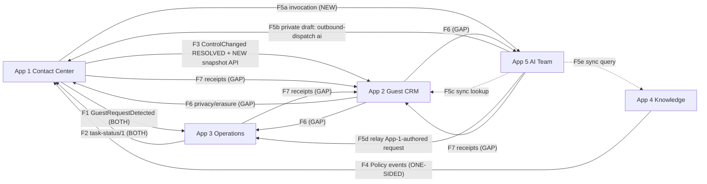
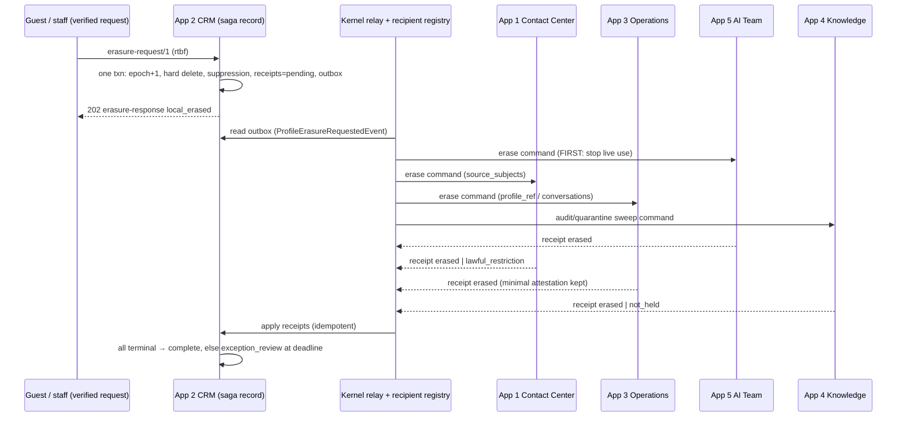

# Master Platform Kernel — Multi-App Integration Research

**Macro-research report · 24 September 2026 · PostgreSQL 16 · SmartStay hospitality Business Operating System (Kakheti wine resorts)**

**Scope.** How to host five independently verified domain applications — App #1 Contact Center, App #2 Guest CRM, App #3 Operations, App #4 Storage & Knowledge, App #5 AI Team — as one multi-tenant platform: database topology, tenant/actor context, the inter-app event mesh, IAM consolidation, coordinated erasure, and integration failure modes. **This is a research phase. It contains no master DDL, no production scripts and no executable tests** — by design. Where a mechanism is described, it is described in prose and tables so the next phase can implement and falsify it.

## 0. Evidence rules, inputs and how to read this report

**Labels.** **[L]** a fact stated in a locked app dossier, cited as `NN:Lnnn` (dossier number : line). **[D]** documented PostgreSQL 16 behavior (§11 lists the manual pages; they were not re-fetched in this session, so pin and re-read them at implementation). **[O]** observed in this repository during this investigation (cross-dossier greps and comparisons). **[I]** this report's inference, proposal or recommendation. **[U]** unknown or unresolved. Anything unlabeled inside a recommendation is **[I]**.

**Method.** All five dossiers were read in full by five parallel extraction passes, each returning a line-cited fact sheet. Load-bearing claims were then re-checked directly against the source text (schema names, GUC reads, tenant registries, member tables, outbox shapes, event names, erasure receipt codes). No code was executed against a database for this report; the per-app DDL was already executed and verified by each dossier.

**Grounding boundary.** `task_research.md` is a market/customer-discovery brief; it contains no platform-integration evidence and is used only for product framing (its §4.3: *"prove an operating system transaction, not an agent conversation"*). Nothing here claims hotel ROI, operator willingness to pay or measured latency.

**Read-only inputs (SHA-256, unchanged by this work):**

| Input | SHA-256 |
|---|---|
| `task_research.md` | `f0ee1ae0c272a54e56a64c25e3351aacf21bd10a78a8a0be2b88a445958095c3` |
| `research/apps/01_contact_center_dossier.md` | `d60c9100092e275a9a4165e5a139f3f7e5c96273dbec53e6a18f234b485edd65` |
| `research/apps/02_guest_crm_dossier.md` | `e7481fcce7303cb55864ddfaac5c6f2bd8b4d2458eb427f6d3a286c815b7f2fb` |
| `research/apps/03_operations_task_dossier.md` | `e0de5d8b68a4ff106d164dfdf39790213d7b83b4e2b372d8ba875946419f5c1b` |
| `research/apps/04_storage_knowledge_dossier.md` | `fb7d4c8dee0e5ab423421a548716b83452560f99ebb5ff863bb1ea7acaaa870a` |
| `research/apps/05_ai_team_agent_core_dossier.md` | `d3bb193d0be03f0f78bd9b7b263a571cd04fd5e6d75f86045348f232e78dd97e` |

**Erratum in an input [O].** The App #5 re-verification note (`05:L1869`) says RLS was confirmed "on all twelve tables". The `workforce` DDL defines **14** tables (`05:L262–L371`); the query behind that note filtered on `agent%`/`ai_agents` and omitted `ai_spaces` and `ai_members`. The DDL's RLS loop covers every table in the schema (`05:L380–385`), so this is a documentation error, not an isolation gap. It should be corrected in App #5 by its owner; this report does not edit locked inputs.

---

## 1. Executive findings

1. **[O] The apps were already built for Pattern A.** Each DDL creates its own schema — `contact_center`, `guest_crm`, `ops`, `kb`, `workforce` — with non-colliding role prefixes. A consolidated single namespace (Pattern B) would require renaming at least four `spaces` tables, two `consumer_inbox` tables and three `tenant()`/`actor()` helper pairs, and would destroy the per-schema RLS/GRANT loops every app relies on. **Recommendation: schema-per-app plus a thin `platform` kernel schema that apps may depend on but never through each other.**
2. **[O] There are five tenant registries with three different shapes and no shared authority.** `contact_center.spaces(id … DEFAULT gen_random_uuid())`, `guest_crm.spaces(id)`, `ops.spaces(space_id)`, `kb.spaces(space_id, knowledge_epoch)`, `workforce.ai_spaces(space_id, enabled)`. App #2 and App #3 already say theirs are *projections* of App #1's property UUID (`02:L243`, `03:L196`); App #1's default UUID generator makes it a de-facto authority it was never designed to be. **The kernel must own tenant identity and provision all five projections.**
3. **[O] Tenant context is uniform; actor context is not.** All five apps read `app.space_id` transaction-locally. For actor: App #3 reads **`app.staff_id`** (`03:L221`), Apps #4/#5 read **`app.actor_id`** (`04:L258`, `05:L260`), Apps #1/#2 have **no actor GUC** and take the actor as a function argument (`01:L186`, `02:L754`). A kernel that sets only `app.actor_id` silently makes `ops.actor()` NULL.
4. **[L] Transaction-local context is compatible with transaction pooling — except App #1's send gate.** App #1's dispatcher holds a **session-level advisory lock across the provider HTTP call on a dedicated pinned connection, "never transaction-pooled"** (`01:L193–196`). The kernel needs two pool classes, not one.
5. **[O] Three of the five requested event flows do not exist on both ends.** App #1 → App #3 and App #3 → App #1 are fully specified on both sides. **App #1 → App #2** exists only on App #2's side (it consumes `ConversationControlChangedEvent` and requires a *new* App #1 resolved-snapshot endpoint, `02:L148–150`). **App #4 → App #1** exists only on App #4's side: App #1 has a local `knowledge_items` table with no consumer, no policy state and no tombstones (`04:L228`, `04:L230`). **App #5 ↔ App #1**: App #1 models AI as an in-app actor (`actor_kind 'ai'`) with an internal drafts endpoint (`01:L772`); App #5's invocation contract is new (`05:L580`).
6. **[O] No app consumes App #2's privacy events.** `ProfileChangedEvent` and `ProfileErasureRequestedEvent` (`02:L738`) are not mentioned by name in Apps #1, #3, #4 or #5. App #2's `erase_profile` creates pending receipts for `contact_center, operations, cache_search, object_store, backup_ledger` (`02:L638`) — **no receipt for App #5 (`workforce`) or App #4 (`kb`)**, and no contract by which any recipient returns a receipt.
7. **[L] Global event ordering is explicitly forbidden by the dossiers.** App #1: *"Do not use a global `BIGSERIAL` as a commit-order SSE cursor"* (`01:L216`); App #2: *"No global sequence is assumed to equal commit order"* (`02:L187`). The achievable, sufficient guarantee is **per-aggregate monotonic order** (conversation `event_seq`, task `task_seq`, policy `state_version`, session `state_version`) with at-least-once delivery and hash-checked inbox dedupe.
8. **[O] Five outbox shapes, zero dead-letter tables, one silent-loss trap.** The outboxes differ in lease columns (App #1 `claimed_until`; Apps #3/#4/#5 `lease_token`+`leased_until`; App #2 none). No DDL has a dead-letter state. Every outbox is under `FORCE ROW LEVEL SECURITY`, so **a relay that forgets to set `app.space_id` sees zero rows and reports "nothing to publish" — indistinguishable from health.**
9. **[O] Role models are single-role-per-member and use different vocabularies.** App #3 `ATTENDANT|TECHNICIAN|FRONT_DESK|SUPERVISOR`; App #4 `EDITOR|APPROVER`; App #5 `CONFIGURATOR|APPROVER`; App #1 has no role enum (only `participants.kind='operator'` plus prose roles, `01:L2689`); App #2 has no staff table at all. App #5's `ai_members` has **no `auth_subject` column**. The task brief's examples (`operator`, `front_desk`, `approver`, `configurator`) map to these, but not literally.
10. **[I] Coordinated erasure should be an orchestrated saga whose ledger already exists in App #2** (`erasure_requests` + `erasure_receipts`), with the kernel providing reliable delivery, a receipt-return contract, deadline monitoring and restore-time replay. Pure choreography cannot prove completion, and App #2 already models the orchestration state machine `local_erased → propagating → complete | exception_review` (`02:L220–225`).

---

## 2. Baseline: the integration surface each app actually exposes

### 2.1 Structural inventory [L/O]

| Dimension | App #1 Contact Center | App #2 Guest CRM | App #3 Operations | App #4 Knowledge | App #5 AI Team |
|---|---|---|---|---|---|
| Schema | `contact_center` (`01:L253`) | `guest_crm` (`02:L273`) | `ops` (`03:L216`) | `kb` (`04:L253`) | `workforce` (`05:L255`) |
| Tables | 19 | 19 | 20 | 10 | 14 |
| Extensions | `btree_gist` | `btree_gist` | `btree_gist` | `vector`, `btree_gist`, `pgcrypto` | `pgcrypto` |
| DB roles created | none (deployment-provisioned, `01:L245`) | `guest_crm_privacy_maintenance` | `ops_owner/_human/_integration/_watchdog` | `kb_owner/_ingest/_reviewer/_guest/_operations/_transport` | `ai_owner/_config/_runtime/_gateway/_transport` |
| Tenant registry | `spaces(id DEFAULT gen_random_uuid(), property_code UNIQUE)` | `spaces(id, property_code UNIQUE)` "same UUID as App #1" | `spaces(space_id, property_name)` "projection" | `spaces(space_id, name, knowledge_epoch)` | `ai_spaces(space_id, enabled)` |
| Tenant GUC | `app.space_id` (inline policy) | `app.space_id` (inline policy) | `app.space_id` via `ops.tenant()` | `app.space_id` via `kb.tenant()` | `app.space_id` via `workforce.tenant()` |
| Actor context | function arg `p_actor` | resolved in service | **`app.staff_id`** via `ops.actor()` | `app.actor_id` via `kb.actor()` | `app.actor_id` via `workforce.actor()` |
| Function security | all security-invoker, **no pinned `search_path`** (`01:L245`) | all security-invoker, **no pinned `search_path`** (`02:L265`) | DEFINER with `search_path=ops,pg_temp` | DEFINER with `pg_catalog,kb,public,pg_temp` | DEFINER with `pg_catalog,workforce,public,pg_temp` |
| Staff/member table | `participants` (`kind='operator'` ⇔ `auth_subject`) | none (bare actor UUIDs) | `staff_members(auth_subject, staff_role)` | `knowledge_members(auth_subject, role_name)` | `ai_members(role_name)` — **no `auth_subject`** |
| Outbox | `outbox_events` (per-conversation `event_seq`, `claimed_until`) | `crm_outbox` (`published_at` only, no lease) | `task_outbox` (`task_seq`, `lease_token`) | `storage_outbox` (`aggregate_version`, `lease_token`) | `agent_outbox` (`state_version`, `lease_token`) |
| Inbox | `consumer_inbox(space, consumer_name, event_id)` | `consumer_inbox(space, consumer, event_id, expires_at)` | `task_inbox(space, source, event_id, payload_hash, disposition)` | none (`04:L230`) | none in DDL (`05:L568`) |
| Dead-letter | prose only (`01:L749`) | prose only (`02:L2614`) | prose only (`03:L705`) | prose only (`04:L594`) | none |
| Advisory locks | `hashtextextended(space‖':'‖conversation)` xact + **session-level on pinned conn** | `hashtextextended(space‖':'‖profile)` | `hashtextextended(space‖request)` | ingest command lock | `hashtextextended(tenant‖command)` |

### 2.2 What every app already agrees on [L]

These shared conventions are the kernel's foundation; none needs to be invented:

- **Tenant = property ("space")** with UUID identity and composite `(space_id, …)` keys and foreign keys in every table (`01:L228`, `02:L243`, `03:L194`, `04:L166`, `05:L25`).
- **`ENABLE` + `FORCE ROW LEVEL SECURITY` on every table**, policy `space_id = nullif(current_setting('app.space_id', true), '')::uuid`, failing closed to zero rows when unset (`01:L721`, `02:L689`, `03:L1397`, `04:L1673`, `05:L2253`).
- **Runtime roles are `NOSUPERUSER NOBYPASSRLS`, never table owners;** superusers/BYPASSRLS are explicitly acknowledged as a trust boundary RLS cannot constrain.
- **Custom settings are not authentication:** "a hostile holder of the DB service credential can spoof them" (`05:L241`, same point `04:L166`, `03:L198`). The *gateway* authenticates; the database enforces isolation given a trusted gateway.
- **Transactional outbox, at-least-once delivery, consumer-side dedupe by `(space, consumer, event_id)`** with rejection of same-ID/different-payload (`01:L747–749`, `02:L740`, `03:L705`, `04:L594`, `05:L568`).
- **Stable schema `$id` domain** `https://schemas.smartstay.example/<app>/<contract>/<version>`, Draft 2020-12, `additionalProperties:false` consumers (`04:L635`, `02:L2616`).
- **Timestamps in UTC `timestamptz`; display in `Asia/Tbilisi`.**
- **No model, browser or guest ever holds database credentials.**

---

## 3. Dimension 1 — Database integration topology

### 3.1 The patterns compared

Three patterns are relevant; the brief names A and B, and C is the necessary control.

| Criterion | **A. Schema-per-app + `platform` kernel schema** (one database) | **B. Consolidated single namespace** (one schema) | **C. Database-per-app** (one cluster) |
|---|---|---|---|
| Fit with locked DDL [O] | Near-native: each DDL already creates its own schema | Requires renaming ≥8 colliding objects and rewriting every per-schema RLS/GRANT/`REVOKE … IN SCHEMA` loop | Native, but App #4's modular-DB lock option (`04:L224`) and any shared tenant FK are lost |
| Least privilege | Per-schema `USAGE`; `GRANT … ON ALL TABLES IN SCHEMA x` stays app-scoped | Schema-wide grants span apps; one mistaken `GRANT ALL IN SCHEMA` exposes all five | Strongest: a role has no connect privilege to other DBs |
| Name collisions | None at object level; residual collisions in GUCs, advisory-lock keyspace, unqualified function bodies (§3.4) | Dense: `spaces`×4, `consumer_inbox`×2, `tenant()`/`actor()`×3, generic App #1 names (`channels`, `participants`, `reservations`, `knowledge_items`) | None |
| Advisory-lock keyspace [D] | **Shared** (advisory locks are per database) | Shared | Separate |
| Tenant registry | One `platform.spaces` referenced by app projections | One table, but every app's differently-shaped registry must merge | Must be replicated per DB by provisioning; no cross-DB FK |
| Cross-app atomicity available | Yes (single DB transaction) — **a capability to restrict, not to use for domain effects** (§3.6) | Yes, and easy to abuse | No; forces explicit messaging |
| In-DB outbox relay | Possible without a network hop | Possible | Needs a network hop or `dblink`/FDW |
| Backup / PITR | One consistent point across all apps — valuable for restore-time erasure replay (§6.6) | Same | Cluster-level physical backup is still consistent; logical per-DB dumps are not mutually consistent |
| Blast radius | Shared connection limits, `max_locks_per_transaction`, vacuum/WAL, one migration pipeline | Worst | Better (still one cluster's CPU/IO/WAL) |
| Migration independence | Per-schema migration tracks; kernel schema first | One interleaved track | Fully independent |
| Later extraction of an app | Easy — contracts are already HTTP/event-shaped | Hard | Already extracted |

**Recommendation [I]: Pattern A**, with an explicit rule that apps depend **downward on `platform` only**, never sideways on each other. Keep Pattern C as the planned escape hatch: because every cross-app interaction is contract-shaped, any app (most plausibly App #4 with its vector index, or App #5 with bursty agent load) can move to its own database without contract changes. Reject Pattern B: it gains nothing the kernel needs and discards the isolation the five dossiers already verified.

### 3.2 The `platform` kernel schema — responsibilities, not DDL

The kernel schema should own only what no app can own without becoming a hidden authority over the others [I]:

| Kernel concern | Why it cannot stay in an app | Evidence of the gap |
|---|---|---|
| **Tenant registry** (property UUID, code, timezone, lifecycle: provisioning → active → suspended → offboarded) | Five registries today; App #1 generates UUIDs by default | `01:L262`, `02:L284`, `03:L196` |
| **Principal registry** (`auth_subject` → platform member per space → per-app actor mapping) | Each app maps `auth_subject` separately; App #5 cannot map it at all | §5 |
| **Capability grants and role templates** | Role vocabularies disagree; single-role PKs | §5 |
| **Event routing table** (producer, event type, schema `$id`, allowed consumers) | Dossiers specify pairwise endpoints; nothing prevents an unintended consumer or a cycle | §4, §7.1 |
| **Relay/delivery ledger and dead-letter** | No DDL has a dead-letter store | §2.1 |
| **Erasure saga delivery + receipt return** | No receipt-return contract exists | `02:L223`, §6 |
| **Schema registry** (the `$id` catalog, versions, dual-consumer rollout state) | Breaking changes require dual-consumer rollout (`02:L2616`); no owner | — |

What the kernel must **not** own: guest identity/preferences (App #2), conversation control and the right to speak (App #1), task truth and attestation (App #3), approved knowledge (App #4), graph configuration and agent execution state (App #5). App #5's own rule generalizes to the kernel: it must not become "a competing source of truth" for the apps (`05:L23`).

**Tenant registry decision [I].** Each app keeps its local registry table (their RLS policies, composite FKs and app-specific columns — `knowledge_epoch`, `enabled`, `timezone` — depend on it) but rows become **provisioned projections of `platform.spaces`**, written only by a kernel provisioning path under the same UUID. Two sub-options:

- *Hard link*: each app registry references `platform.spaces` by foreign key. Pro: an orphan or mistyped tenant is impossible. Con: cross-schema FK couples migrations and makes Pattern C extraction a schema change.
- *Soft link*: no FK; a reconciliation job compares all five registries to the kernel and alerts on drift. Pro: preserves extractability. Con: drift is detected, not prevented.

Prefer **hard link for the pilot, documented as the one sanctioned cross-schema FK direction** (app → platform), and require that App #1's `DEFAULT gen_random_uuid()` on `spaces.id` never be exercised by the provisioning path. Property suspension must propagate as a **single kernel decision** that every app gateway rechecks (App #5 already requires re-checking `ai_spaces.enabled` at every boundary, `05:L562`).

### 3.3 Tenant and actor context injection across schema boundaries

**PostgreSQL 16 semantics that matter [D]:**

1. `SET LOCAL x = v` and `set_config('x', v, true)` are equivalent: the value lasts until the end of the current transaction and reverts on commit **or** rollback. Outside an explicit transaction block, `SET LOCAL` has no lasting effect (PostgreSQL emits a warning), so an autocommit client that "sets" context and then runs a statement gets **no context** — which, under these policies, fails closed to zero rows rather than leaking.
2. `SET x = v` / `set_config('x', v, false)` persists for the session. Behind a transaction-mode pooler (PgBouncer `pool_mode=transaction`) the server connection is handed to another client after `COMMIT`, **so a session-level tenant setting leaks into the next client's transactions.** This is the classic cross-tenant leak in pooled RLS designs.
3. Custom placeholder settings with a dotted prefix (`app.*`) can be set by **any** role; there is no privilege on them. This is why every dossier treats them as a trusted-gateway mechanism, not authentication.
4. After a transaction-local custom setting reverts, `current_setting('app.space_id', true)` can return an empty string rather than NULL in the same session. That is exactly why all five policies wrap it in `nullif(…, '')` — a detail any kernel helper must preserve.
5. `SECURITY DEFINER` functions change the effective role, not the settings: they see the caller's `app.*` values. App #3/#4/#5 definer functions are owned by `NOBYPASSRLS` owners, so RLS still applies inside them (`03:L198`, `05:L241`).
6. Session-level features — session advisory locks, `LISTEN`, `WITH HOLD` cursors, temporary tables — do not survive transaction pooling.

**Comparison for the kernel:**

| Mechanism | Pooled-connection safety | Crosses schema boundaries? | Verdict |
|---|---|---|---|
| Session GUC (`SET`) | **Unsafe** under transaction pooling; safe only with session pooling and a reset on check-in (`DISCARD ALL` / `RESET ALL`) | Yes | Reject for request context |
| `SET LOCAL` / `set_config(…, true)` inside an explicit transaction | Safe: reverts at commit/rollback regardless of pool mode | Yes — one setting is visible to all schemas' policies in that transaction | **Adopt** (all five dossiers already specify it) |
| Per-tenant database roles (`SET ROLE tenant_x`) | Safe if `SET LOCAL ROLE` | Yes | Reject: role explosion (roles × properties), cluster-global role catalog |
| Passing tenant as a function argument only | Safe | No policy enforcement without a GUC | Insufficient alone; App #1/#2 combine it with the GUC |

**Kernel context contract [I].** One kernel-owned "open request transaction" step, executed by each app's gateway process — not by callers — that, inside `BEGIN`, sets:

- `app.space_id` — the authenticated property UUID (identical value for all apps, because registries are projections).
- `app.actor_id` — the platform member UUID for this person in this property (see §5.3 for why one value can serve every app).
- `app.staff_id` — **the same value**, set as a compatibility alias for App #3's `ops.actor()` until App #3 migrates to `app.actor_id`. Setting both is cheap and removes the silent-NULL trap from finding 3.
- Optionally `app.request_id` / correlation ID for audit joins (no policy depends on it).

plus `search_path` and `TimeZone=UTC` via `SET LOCAL`. The gateway must refuse to run any statement if context-setting failed, and must never accept these values from a request body (`02:L265`, `03:L198`, `04:L164`).

**The one-app-per-transaction rule [I].** A single request transaction should touch exactly one app's schema (plus read-only kernel lookups). This keeps each app's lock order, invariants and triggers authoritative, and makes the actor alias harmless. Cross-app effects go through the event mesh (§4) or a synchronous contract call — both of which open their own transaction in the target app's gateway.

### 3.4 Residual collision hazards inside Pattern A [O/D]

Separate schemas remove table-name collisions, but five mechanisms remain shared inside one database:

| Hazard | Where it bites | Mitigation [I] |
|---|---|---|
| **Unpinned `search_path` in security-invoker functions.** App #1 and App #2 function bodies reference unqualified tables and set no `search_path` (`01:L245`, `02:L265`); they resolve through the caller's path | A gateway whose path lists another app's schema first (or a pooled connection with a stale path) makes `conversations`/`spaces`/`consumer_inbox` resolve to the wrong app — or, where the name doesn't exist elsewhere, fail | Every gateway sets `SET LOCAL search_path = <own schema>, pg_catalog` per transaction. Next phase: App #1/#2 pin `search_path` on functions (Apps #3–#5 already do) |
| **Identically named helpers** `tenant()` / `actor()` in `ops`, `kb`, `workforce` | Harmless where policies call them schema-qualified (they do); dangerous in any unqualified cross-schema view or ad-hoc report | Forbid unqualified cross-schema SQL; kernel read models use fully qualified names |
| **Advisory-lock keyspace** — all apps use single-`bigint` keys from `hashtextextended(...)` | Keys are per database, not per schema. A collision between, e.g., App #1's `space:conversation` and App #2's `space:profile` hash only serializes unrelated work (`01:L193`) — a performance, not correctness, issue — but it becomes a **cross-app lock dependency** that can join a deadlock cycle | [D] PostgreSQL's two-`int4` advisory-key form is a key space that does not overlap the `bigint` form. Assign each app a fixed `classid` and hash only the object into the second key; or salt every bigint hash with the schema name. Record the allocation in the kernel |
| **Cluster-global role names** | Role prefixes currently do not collide (`guest_crm_*`, `ops_*`, `kb_*`, `ai_*`; App #1 creates none). Every DDL issues bare `CREATE ROLE` and assumes a fresh cluster (`03:L1438`, `04:L234`, `05:L2007`) | Kernel migration tooling provisions roles idempotently and audits memberships; reserve prefixes per app, including one for App #1 |
| **Database-wide statements** — `REVOKE CREATE ON SCHEMA public FROM PUBLIC` (`04:L252`, `05:L254`); extensions installed once per database (`vector` in `public`, `04:L243`) | Revoke is idempotent and already the default for new databases since PostgreSQL 15 [D], so it is harmless. Extensions: four apps' `CREATE EXTENSION IF NOT EXISTS btree_gist` coexist; `vector` version becomes a shared dependency | Kernel owns extension installation and version pins; apps declare requirements |

### 3.5 Pooling topology [I]

- **Transaction-mode pool per app workload role** (e.g. `ops_integration`, `kb_guest`, `ai_runtime`), because every request path uses transaction-local context. Separate pools also give per-app connection caps, so one app's surge cannot exhaust `max_connections` for the others.
- **Dedicated session-mode connections** only for: App #1's dispatcher send gate (session advisory lock across provider I/O, `01:L193–196`), any `LISTEN` wake-up listener (`03:L1172`), and migrations. These connections must `DISCARD ALL` (or be discarded) when returned, and App #1 already requires evicting broken pooled connections (`01:L196`).
- **Statement and lock timeouts per role** (`lock_timeout`, `statement_timeout`, `idle_in_transaction_session_timeout` set on the role), so that one app's stuck transaction cannot hold kernel rows or collided advisory keys indefinitely. Every dossier forbids holding a transaction across model inference or network I/O (`01:L196`, `02:L2614`, `03:L133`).

### 3.6 Cross-schema transactions: a capability to fence off

Pattern A makes it *possible* for one transaction to write App #1's outbox and App #3's task inbox together, or to delete a guest from four schemas at once. It is tempting because it looks like exactly-once delivery. **Reject it as a domain mechanism [I]:**

- It bypasses the receiving app's gateway checks. App #3's `ingest_request` validates `source = urn:smartstay:space:<sid>:contact-center`, the subject and version monotonicity (`03:L482–485`). A cross-schema insert would skip them unless it calls that function, which requires `ops_integration` privileges and couples App #1's role to App #3's.
- It couples lock orders. App #1 takes the advisory lock *before* the conversation row (`01:L743`); App #3 locks task → token → staff → roster → room (`03:L133`). A single transaction spanning both creates a lock graph neither app reviewed.
- It destroys extractability to Pattern C.
- It cannot include the external effects that matter (provider sends, object storage, OAuth connectors, backups).

**One narrow exception is worth researching:** App #4 proposes that, "in a modular single-database deployment", App #1's send gate take a bounded **shared** lock on the property row while App #4 publication takes an **exclusive** one, making "was this policy still approved when the send started?" enforceable (`04:L224`). That is a deliberate cross-app lock dependency. If adopted, it must be the only one, have a documented order (App #1 advisory lock → App #1 conversation row → App #4 space share-lock, never the reverse), a short `lock_timeout`, and a fallback to the lease protocol App #4 specifies for separate services.

---

## 4. Dimension 2 — Inter-app event mesh (outbox → inbox, brokerless)

### 4.1 The communication graph as the dossiers actually define it

Status legend: **BOTH** = producer and consumer contracts exist in locked dossiers; **ONE-SIDED** = specified by one app, absent in the other; **NEW** = a dossier names it as a new requirement; **GAP** = required by the brief or by a privacy obligation but specified nowhere.

| # | Flow | Mechanism and contract | Producer side | Consumer side | Status |
|---|---|---|---|---|---|
| F1 | App #1 → App #3: guest request → task | `GuestRequestDetectedEvent` in `contact-center/outbox-event/1`, narrowed as `operations/guest-request/1`; delivered to `POST /v1/internal/guest-requests` | `01:L1594–1744`, dedupe `(space, request_id)` (`01:L747`) | `ops.ingest_request` + `task_inbox` with payload hash and `APPLIED/STALE/QUARANTINED` (`03:L375–381`, `L482–499`, `L1019`) | **BOTH** |
| F1b | App #1 → App #3: amend/cancel | `GuestRequestChangedEvent` with `change_kind` | `01:L2044–2120` | Adapter specified, not in DDL (`03:L699`) | ONE-SIDED (consumer pending) |
| F2 | App #3 → App #1: progress and completion attestation | `contact-center/task-status/1`, flat body, `source:"task-management"`, `task_seq`; `completed` requires `completed_at` + ≥1 `evidence_refs` | `ops.emit_callback` → `task_outbox` `TaskStatusChangedEvent` (`03:L453–468`) | `POST /v1/internal/task-status` → durable inbox → projection → republished `GuestRequestStatusChangedEvent` (`01:L776`, `L2408`) | **BOTH** (publisher function not yet implemented, `03:L705`) |
| F3 | App #1 → App #2: resolution → profile extraction | App #2 consumes existing `ConversationControlChangedEvent` (`state:"RESOLVED"`), then calls a **new** App #1 endpoint `GET /v1/internal/conversations/{id}/resolved-snapshots?control_version={v}` | App #1 emits the event (`01:L714–717`) but defines no CRM contract and no snapshot endpoint | `02:L148–150`, `L769`, manifest `resolved-snapshot-manifest/1` (`02:L2242`) | **NEW** (App #1 endpoint) |
| F4 | App #4 → App #1: approved policy → cache invalidation | `knowledge/policy-event/1`: `PolicyApprovedEvent`, `PolicySupersededEvent`, `PolicyArchivedEvent`, identifiers/digests only | `kb.storage_outbox` inside the approve/archive transaction (`04:L417–428`) | App #1 has local `knowledge_items` with no policy state, no inbox for these, no tombstones; mapping rules are written in App #4 (`04:L228–230`) | **ONE-SIDED** |
| F5a | App #1 → App #5: invocation | `ai-team/invocation-request/1` (new), embeds `guest-crm/profile-lookup-request/1` | App #1 models AI as in-app `actor_kind 'ai'` and `POST …/drafts` (`01:L258`, `L772`) | `05:L580`, `L620` | **NEW** |
| F5b | App #5 → App #1: private draft | `contact-center/outbound-dispatch/1`, `author_kind:"ai"` branch, unchanged; App #1 remains sole sender | Wrapped in `ai-team/invocation-response/1` (`05:L811–817`) | Existing AI dispatch branch (`01:L1426–1469`) | BOTH at schema level; transport NEW |
| F5c | App #5 → App #2: Layer-1 memory | `profile-lookup-request/1` / `profile-context-response/1`, audience `contact_center` or `operations`, purpose `service_personalization` (no `ai_team` audience) | `05:L139` | `02:L1569`, `L1658` | **BOTH** (synchronous) |
| F5d | App #5 → App #3: tool effect | `operations/guest-request/1`, the **App #1-authored** event forwarded unchanged | `05:L584` | App #3 checks `source` = App #1's URN (`03:L482–485`) — so App #5 can relay but never author | BOTH, with authority constraint |
| F5e | App #5 → App #4: Layer-2 retrieval | `knowledge/query/1` / `knowledge/response/1` | `05:L976`, `L1241` | `04:L747`, `L806` | **BOTH** (synchronous) |
| F5f | App #3 → App #5: observation | scoped projection of `task-status/1` | `05:L584` | App #1 remains authoritative consumer | NEW (projection) |
| F5g | App #5 → any: session/handoff events | `AgentSessionChangedEvent`, `AgentHandoffEvent` in `agent_outbox` | `05:L371–378`, `L432–486` | No consumer defined anywhere | **GAP** (no consumer; confirm whether any is needed) |
| F6 | App #2 → Apps #1/#3/#5 (+#4 audit): privacy fence | `ProfileChangedEvent` (epoch bump reasons), `ProfileErasureRequestedEvent` | `crm_outbox` (`02:L462–472`, `L738`) | Named by no other dossier; App #5 describes a generic "correction/erasure" consumer as release work (`05:L161`) | **GAP** |
| F7 | Recipients → App #2: erasure receipts | receipt per `(request_id, system_code)` | `erasure_receipts` rows created `pending` (`02:L497–502`, `L638`) | No receipt-return contract or schema in any dossier | **GAP** |

**Reading the graph [I].** There is exactly one legitimate cycle: **F1 ⇄ F2** (request → task → status → request projection). Every other edge is acyclic. App #1 republishes `GuestRequestStatusChangedEvent` after consuming F2 (`01:L2408`), and App #3 must not consume it — that is the storm vector analyzed in §7.1. The routing table must encode the graph as data so an unintended edge is rejected, not merely undocumented.

### 4.2 Transport choice: synchronous contracts versus events

| Interaction | Mode | Rationale |
|---|---|---|
| F5c profile lookup, F5e knowledge query, App #4 evidence verify (`04:L626`) | **Synchronous request/response** via the owning app's gateway | The caller needs the answer *now* and must fail closed on unavailability (`02:L775` returns 503 `DEPENDENCY_UNAVAILABLE`; App #4 returns `200 ABSTAIN` on no-match) |
| F1, F1b, F2, F3 trigger, F4, F6, F7 | **Asynchronous events** via outbox → relay → inbox | Durable facts that must survive the consumer being down; ordering per aggregate matters |
| F5a invocation / F5b draft | Asynchronous command with a correlated async result (`invocation-response` status `QUEUED` then terminal) | Model latency is unbounded; App #1 must never hold its send gate while waiting |

**No broker is required for the pilot** — App #1, #2 and #3 all say so explicitly (`01:L88`, `02:L90`, `03:L91`) — but *"the outbox/inbox pattern is not optional"* (`02:L90`).

### 4.3 The relay problem in one database

A kernel relay reads each app's outbox and delivers to each consumer's inbox. Five facts constrain it:

1. **Outbox shapes differ** (§2.1). The relay needs one adapter per outbox — a *read-side mapping*, not a schema rewrite: App #1 `(id, event_seq, claimed_until)`, App #2 `(id, published_at)`, App #3 `(event_id, task_seq, lease_token, leased_until)`, App #4 `(event_id, aggregate_version, lease_token, leased_until)`, App #5 `(event_id, state_version, lease_token, leased_until)`.
2. **Envelopes are completed at publish time.** App #5: *"Do not publish the raw SQL payload as though it already included its transport metadata"* (`05:L1821`); App #2 maps `id→event_id`, `created_at→occurred_at`, `payload→data` (`02:L738`); App #1 maps `event_type→type`, `created_at→time` (`01:L2394`). The relay owns this mapping and must validate against the published `$id` before sending.
3. **`FORCE ROW LEVEL SECURITY` makes every outbox tenant-scoped.** A relay without `app.space_id` sees nothing (§7.5 turns this into a failure mode).
4. **`published_at` means transport acknowledgment, not that the consumer applied the event** (`04:L594`). Zero-loss therefore depends on the consumer inbox, not on the relay.
5. **Dead-letter is required in prose by four dossiers and implemented by none.**

**Relay designs compared [I]:**

| Design | How tenant scoping works | Pros | Cons |
|---|---|---|---|
| **R1. Per-tenant polling loop** — iterate `platform.spaces` (active), and for each property open a transaction, `SET LOCAL app.space_id`, claim a batch | Uses the existing policies unchanged | No new privilege; a bug cannot cross tenants; fair per-property scheduling | Cost scales with property count × outboxes; needs "has pending work" hint to avoid empty scans |
| **R2. Dedicated relay role with an additional permissive policy** allowing that role to see all tenants' *outbox rows only* | One role-specific policy per outbox table | One scan per outbox | Adds a cross-tenant reader — the exact capability every dossier avoids; the relay then writes consumer inboxes under per-tenant context anyway |
| **R3. `BYPASSRLS` relay** | None | Simplest | Contradicts every dossier's `NOBYPASSRLS` runtime rule. **Reject** |
| **R4. App-owned publisher per app** (each app runs its own relay, as each dossier assumes) | Each app loops over its own tenants | Matches locked designs; no kernel code on the hot path | Five implementations of the same hard problem; no central dead-letter or routing enforcement |

**Recommendation: R1, implemented once in the kernel with per-app outbox adapters**, and a lightweight "pending-work" signal to avoid scanning idle properties. `LISTEN/NOTIFY` may carry that signal — it is delivered only at commit, is not durable, and has an ~8 kB payload cap [D], so it is a *wake-up hint* only; App #1 and App #3 already restrict it to that role (`01:L212–214`, `03:L1172`). Correctness must come from polling with a bounded interval.

### 4.4 Ordering: what "monotonic" can and should mean

**Global order is neither available nor required.** Sequence values and `created_at` are assigned *before* commit, so a later-committing transaction can hold a smaller value; a reader that advances a global cursor past an in-flight lower value skips it permanently. The dossiers therefore forbid global cursors (`01:L216`, `02:L187`, `02:L740`).

**Per-aggregate order is what every consumer actually depends on** [L]:

| Aggregate | Order key | Allocation | Consumer rule |
|---|---|---|---|
| Conversation (App #1) | `event_seq` | Trigger under the conversation row lock (`01:L667–674`) — so commit order equals sequence order per conversation | App #3 must **not** reuse it as its own sequence (`01:L2408`) |
| Task (App #3 → App #1) | `task_seq` | Emitted by `emit_callback`, starting at 1 on claim; unique per task (`03:L382–393`) | App #1 ignores/quarantines stale sequences; `completed` never regresses (`01:L2660`) |
| Policy (App #4 → App #1) | `state_version` + property `knowledge_epoch` | Same transaction as approval, under the property row lock (`04:L479–503`) | **Supersession emits two events at the same epoch** — consumer must stage the pair atomically; inserting the successor first violates App #1's exclusion constraint (`04:L1407`) |
| Profile (App #2) | `profile_version`, `privacy_epoch` | *Consistency tokens, not gap-free counters* (`02:L740`) | Consumer refetches on unknown/stale; **erasure dominates regardless of arrival order** |
| Agent session (App #5) | `state_version` | Same-transaction checkpoint/outbox (`05:L558`) | Several event types can share one version; dedupe by event ID (`05:L1823`) |

**Relay rule for ordered streams [I]:** *head-of-line per aggregate.* Claim with `FOR UPDATE SKIP LOCKED` for concurrency across aggregates, but only rows that are the lowest unpublished sequence of their aggregate are eligible. App #1 states precisely why: *"unrestricted row-level `SKIP LOCKED` alone can publish later events ahead of earlier ones"*; partition by aggregate and publish the lowest unpublished sequence first (`01:L749`). A poison event therefore **blocks its own aggregate only** and is surfaced — App #1: *"preserving the aggregate gap until explicitly repaired"* (`01:L749`).

**If a cross-aggregate cursor is ever needed** (e.g., a kernel audit stream or an SSE feed across conversations), PostgreSQL 13+ provides a commit-safe horizon [D]: record `pg_current_xact_id()` (type `xid8`) on each outbox row, and have the reader advance only up to `pg_snapshot_xmin(pg_current_snapshot())` — no transaction below that horizon can still be in flight. This is research for a later phase; nothing in the five apps needs it today.

### 4.5 Zero-loss delivery — the complete argument

"Zero message loss" is achievable only as **at-least-once delivery + idempotent, hash-checked apply**, and only if every link below holds [I, built on L]:

1. **Atomic intent.** The producer writes domain change + outbox row in one transaction (all five apps do; e.g. App #4 emits inside approve/archive, `04:L417–428`; App #3's callback is emitted by trigger path `03:L453`).
2. **Durable claim, then I/O.** Claim a batch with a lease (random token + expiry + attempts), **commit**, then deliver outside any transaction (`01:L749`, `03:L705`, `04:L598–607`).
3. **Fenced acknowledgment.** Set `published_at` only where event ID **and** lease token still match — *"time alone is not ownership proof"* (`03:L705`). An expired lease is reclaimable; a late ack from the old holder is rejected.
4. **Idempotent apply.** Consumer records `(space, consumer, event_id, payload_hash)` in the **same transaction** as its domain change (`01:L747`, `02:L740`). Same ID + same hash → return prior result; same ID + different hash → reject/quarantine (`03:L487–499`, `04:L1407`).
5. **Retry with bounded exponential backoff and jitter**, same event ID and same body on every attempt (`03:L1166`).
6. **Dead-letter, visible.** After the retry budget, move to a dead-letter state with reason, keep the aggregate blocked, alert, and allow reviewed replay *with the original event ID* (`03:L705`). Payloads in dead-letter storage are personal data: encrypted, access-restricted, expiring (`03:L703`).
7. **Reconciliation.** Periodic read-API reconciliation catches anything the stream missed (App #1 reconciles task status every 5 minutes, `01:L2662`; App #4 requires a snapshot reconcile before resuming AI dispatch after a gap, `04:L230`).
8. **Retention ≥ replay window.** Outbox rows must outlive the longest consumer outage plus restore window — *"Outbox publication is not permission to delete all rows immediately"* (`01:L755`); App #1 proposes 7 days, App #3 ≥7 days after acknowledgment (`03:L713`).
9. **Restore safety.** After a backup restore, outbox and inbox state must be replay-safe and guest-facing AI stays disabled until reconciliation (`04:L1421`, `05:L572`); erasure tombstones are re-applied before anything is replayed (§6.6).

**In-database delivery [I].** Because Pattern A puts both ends in one database, the relay *could* deliver by calling the consumer's own ingest function (e.g. `ops.ingest_request`) under the consumer's role and tenant context, instead of making an HTTP call. That removes a network hop and makes steps 2–4 one local transaction per event, while keeping the consumer's validation authoritative. It is only acceptable if (a) the relay switches to the consumer's least-privilege role for that call, (b) it calls the consumer's public function, never its tables, and (c) the same function remains reachable via the HTTP contract, so Pattern C extraction stays possible.

### 4.6 Envelope and routing metadata the kernel must standardize [I]

The dossiers converge on a CloudEvents-shaped envelope (App #1: `specversion`, `source` URN, `subject`, `type`, `time`, `data`, `01:L1506–1591`). The kernel should standardize, without changing locked payloads:

- **`event_id`** stable across retries; **`source`** as `urn:smartstay:space:<uuid>:<app>`, which App #3 already verifies against the space (`03:L482–485`).
- **`correlation_id`** (the guest journey or erasure request) and **`causation_id`** (the event that caused this one). App #1 has both columns (`01:L518–519`); App #2 requires `causation_id` except for erasure (`02:L470`). These are the raw material for storm detection (§7.1).
- **Per-aggregate sequence** as a string, as the contracts already do.
- **`schema` `$id`** and version, with the kernel's routing table declaring, per `(producer, type, $id)`, the allowed consumers. An event whose type is not routed to a consumer is never delivered there — the graph in §4.1 becomes enforced configuration.

---

## 5. Dimension 3 — Centralized IAM and role harmonization

### 5.1 What each app means by "who is acting" [L/O]

| App | Human identity record | Link to IdP | Role vocabulary (exact) | Cardinality | Separation-of-duty rule enforced in DB |
|---|---|---|---|---|---|
| #1 | `contact_center.participants` with `kind actor_kind ('guest','operator','ai','system')` | `auth_subject`, required iff `kind='operator'`, `UNIQUE(space_id, auth_subject)` (`01:L281–292`) | **No DB role enum.** Prose roles: reception, housekeeping, maintenance, finance, supervisors, knowledge editors/approvers, auditors (`01:L2689`); "RLS protects property boundaries, while the API enforces team/role" | One participant row per person per property | Actor-kind state rules in triggers: only an operator may claim; AI only `AI_ACTIVE → ESC_REQUESTED/RESOLVED` (`01:L687–692`) |
| #2 | **None.** Actor columns are bare UUIDs, no FK (`02:L744`) | Service-level: "purpose/audience grants" and a "designated reviewer from auth" (`02:L754`, `L761`) | Service audiences `contact_center`, `operations`; purposes; no staff roles | n/a | Maintenance role is a DB role (`guest_crm_privacy_maintenance`), not a staff role |
| #3 | `ops.staff_members` | `auth_subject`, `UNIQUE(space_id, auth_subject)` (`03:L236–241`) | `staff_role IN ('ATTENDANT','TECHNICIAN','FRONT_DESK','SUPERVISOR')` + `skills text[]` | **Exactly one role** per staff member | Inspector ≠ attester; `SUPERVISOR` required for `INSPECTED/CLEAN` (`03:L672–680`) |
| #4 | `kb.knowledge_members` | `auth_subject`, `UNIQUE(space_id, auth_subject)` (`04:L266–270`) | `role_name IN ('EDITOR','APPROVER')` | **Exactly one role** (PK `(space_id, actor_id)`) | Approver ≠ uploader (`04:L483–484`) |
| #5 | `workforce.ai_members` | **None — no `auth_subject` column** (`05:L263–265`) | `role_name IN ('CONFIGURATOR','APPROVER')` | **Exactly one role** (PK `(space_id, actor_id)`) | Graph approver ≠ creator (`05:L414–415`); **no** interrupter ≠ resumer rule |

**Mapping the brief's examples to reality:** "`operator` in App #1" is an *actor kind*, not a role; "`front_desk` in App #3" is `FRONT_DESK` (lower-case `front_desk` is a task *category*, `03:L256`); "`approver` in App #4" is `APPROVER`; "`configurator` in App #5" is `CONFIGURATOR`.

### 5.2 The design problem

A Kakheti resort's night manager may need to: take over guest chats (App #1 operator), escalate and inspect rooms (App #3 `SUPERVISOR`), approve an updated cellar price list (App #4 `APPROVER`) and pause the AI team (App #5). Three structural issues block a naive "one role everywhere" approach:

1. **Role explosion.** Creating platform roles as the cross-product of app roles (e.g. `FRONT_DESK_EDITOR_CONFIGURATOR`) grows combinatorially per property, and properties differ.
2. **Single-role tables.** Apps #3/#4/#5 allow one role per member. A person who legitimately needs `EDITOR` *and* `APPROVER` in App #4 cannot exist today — and App #4's uploader ≠ approver rule assumes the two are usually different people.
3. **Identity drift.** Each app mints or stores its own actor UUID (`ops.staff_members.staff_id DEFAULT gen_random_uuid()`, `03:L237`); App #5 cannot map to `auth_subject` at all; App #1 has one participant row per property.

### 5.3 Recommended model: principals → memberships → capabilities → per-app projections [I]

**Layer 1 — Principal.** The IdP subject (`auth_subject`, OIDC `iss`+`sub`) is the only global human identifier. It lives in the kernel and nowhere else is it minted.

**Layer 2 — Membership.** A principal is a *member of a property* with one kernel-minted **member UUID per (principal, property)**. This UUID becomes the actor ID in every app for that property: `participants.id` for operators in App #1, `staff_id` in App #3, `actor_id` in Apps #4/#5, and the actor value App #2 records. One value per property is what makes the single `app.actor_id` (+ `app.staff_id` alias) in §3.3 correct, and it keeps App #1's "one participant per property" model intact. Using a per-property ID rather than a global person ID also prevents linking a staff member's activity across properties unless portfolio authorization requires it (`01:L222`).

**Layer 3 — Capabilities, owned by apps.** Each app publishes a small closed list of capabilities that map exactly to what its gateway and DB functions check. Example, not exhaustive:

| App | Capability | Maps to today |
|---|---|---|
| #1 | `cc.conversation.claim`, `cc.message.send`, `cc.draft.request`, `cc.request.approve_authority` | `kind='operator'` + API RBAC |
| #2 | `crm.profile.read_context`, `crm.merge.review`, `crm.erasure.request`, `crm.field.approve` | service grants / designated reviewer |
| #3 | `ops.task.claim` (with skills), `ops.room.inspect`, `ops.task.supervise` | `ATTENDANT`/`TECHNICIAN`/`FRONT_DESK`/`SUPERVISOR` |
| #4 | `kb.document.upload`, `kb.policy.approve`, `kb.policy.archive` | `EDITOR`/`APPROVER` |
| #5 | `ai.graph.configure`, `ai.graph.approve`, `ai.session.resume`, `ai.space.pause` | `CONFIGURATOR`/`APPROVER` |

**Layer 4 — Role templates, owned by the property.** A template is a named bundle of capabilities ("Reception", "Night manager", "Sommelier lead", "Housekeeping attendant", "Maintenance technician", "Content editor", "AI configurator"). Properties assign templates to members; the kernel resolves the **effective capability set** = union of assigned templates, minus explicit denials. Templates change without touching app code, and the number of templates grows with *job types*, not with app × role combinations.

**Projection into apps.** The kernel does **not** replace app authorization. It projects each member's effective capabilities into the app's own representation through the app's provisioning function, emitted as kernel events and applied idempotently:

- App #3: the projection selects the single `staff_role` the app understands (a documented precedence: `SUPERVISOR` > `FRONT_DESK` > `TECHNICIAN` > `ATTENDANT`) and the `skills` array. If precedence loses information the property needs, that is evidence for App #3 to support multiple roles — a next-phase change request, not a kernel workaround.
- App #4 / App #5: with single-role PKs, the kernel can express `EDITOR` *or* `APPROVER` per member, not both. **Recommended stance: keep it.** It enforces separation of duties structurally; a property that needs one person to do both is a governance exception to escalate, not to hide.
- App #5: add the `auth_subject` link (or rely on the kernel member UUID as the sole join) — until then, App #5's audit cannot be traced to an IdP subject without the kernel mapping table.
- App #1: provision an `operator` participant with the kernel member UUID and `auth_subject`; the API enforces the remaining capabilities.

**Where each check lives:**

| Check | Enforced by | Must not be delegated to |
|---|---|---|
| Is this principal authenticated, and a member of property P? | Kernel gateway (token validation, membership lookup) | Apps trusting a request body |
| Does the member hold capability C in P right now? | Kernel issues a short-lived, **audience-bound** token per app carrying the property and a digest/version of the capability set; the app gateway re-validates | A long-lived token reused across apps |
| May this member perform this specific transition on this row? | The app's DB function/trigger (`uploaded_by <> actor()`, `staff_role='SUPERVISOR'`, `created_by <> actor()`) | The kernel |
| Tenant row isolation | App RLS on `app.space_id` | Anything else |

### 5.4 Database roles are per workload, never per human or per property [I]

Database roles remain what the dossiers define: app workloads (`ops_integration`, `kb_guest`, `ai_runtime`, …) plus owners and maintenance roles. Humans never receive database logins; properties never become database roles. The kernel adds only its own workload roles (provisioning, relay, erasure coordinator), each `NOSUPERUSER NOBYPASSRLS`, each switching to the *target app's* least-privilege role when invoking that app's functions (§4.5). `guest_crm_privacy_maintenance` stays unreachable from ordinary app credentials (`02:L694`).

### 5.5 Lifecycle: joiners, movers, leavers

- **Revocation latency is the real security property.** A disabled member must lose the ability to act within a defined bound across all five apps. Mechanism: kernel sets membership disabled → (a) new tokens refused immediately, (b) outstanding app tokens expire within their short TTL (minutes), (c) projection events set `enabled=false` in Apps #3/#4/#5 and remove App #1 operator eligibility. App #3's 5-minute action tokens (`03:L534`) and App #5's per-boundary re-checks (`05:L562`) already bound exposure; App #1 needs an equivalent check before claims and sends.
- **In-flight work on departure.** Tasks claimed by a departed attendant, graphs drafted by a departed configurator and unsent operator drafts must be reassigned or released. App #1's rule applies generally: unsent drafts *"cannot silently dispatch under a new owner"* (`01:L200`).
- **Historical attribution survives.** Actor UUIDs in audit/attestation rows remain valid identifiers after a member is disabled; the kernel never reuses a member UUID.

---

## 6. Dimension 4 — Global data lifecycle and coordinated RTBF

### 6.1 Where a guest's personal data lives across the five apps [L]

| App | Guest personal data | Erasure mechanism in the dossier | Implemented in DDL? |
|---|---|---|---|
| #2 CRM | Profile, identities (HMAC tokens + optional ciphertext), preferences, permissions, source links, jobs, aliases | `erase_profile()`: advisory lock → `privacy_epoch+1` → snapshot `source_subjects` → hard delete + cascade → `suppress_until = now()+30 days` → pending receipts → outbox + audit, one transaction (`02:L623–644`) | **Yes** (except merge clusters: "erase merge cluster through coordinator", `02:L631`) |
| #1 Contact Center | Transcripts, message bodies, attachments refs, phone numbers, participant identities, reservation projection, special requests | Authorized maintenance procedure that redacts content/media/identity, keeps minimal audit/dedupe metadata, processes replicas/backups, writes a redaction audit event. `messages` are immutable by trigger (`01:L621–623`, `L757`) | **No** — procedure NOT PRESENT |
| #3 Operations | Task titles/details/reasons from guest text, `location_label` (room), completion photos, `profile_ref`, command bodies, outbox payloads | 8-step plan: epoch gate → revoke object URLs → neutralize text → tombstone evidence keeping minimal attestation → scrub command bodies/outbox → PII-free receipt → ack only after all stores confirm → tombstones before restore/replay (`03:L717–719`) | **No** — release gate (`03:L1376`) |
| #4 Knowledge | By design no guest profiles; accidental PII in uploads is quarantined; queries stored as keyed HMAC, not plaintext (`04:L21`, `L198`, `L351`) | Legal/privacy purge "requires a reviewed administrative procedure" (`04:L592`) | **No** |
| #5 AI Team | Session references (`profile_id`, `privacy_epoch`, conversation IDs), encrypted state blobs, checkpoints, traces, provider-side caches | Suppression fence, cancel sessions, remove prompt caches/state blobs, invalidate provider caches, delete traces, acknowledge (`05:L161`); retention bound by earliest source expiry and the 24-hour CRM transient ceiling (`05:L159`) | **No** — "release work" |
| Outside the database | Object storage, backups, logs/traces, analytics, subprocessors (model providers, channel providers) | App #2 lists them as recipients (`02:L220–225`) | — |

**Legal framing [L].** App #2 grounds erasure in GDPR Articles 12, 17 and 19, treats the one-month Article 12 limit as an *outer* bound while fencing immediately, and explicitly does not claim verified Georgian statutory deadlines (`02:L193–201`). This report inherits that boundary: the 24 h / 7 day / 24 month limits are **product policy**, not legal findings.

### 6.2 Choreography versus orchestration

| Criterion | **Choreography** (App #2 emits `ProfileErasureRequestedEvent`; each app reacts independently) | **Orchestration** (a coordinator tracks each recipient, sends commands, awaits receipts, escalates) |
|---|---|---|
| Proof of completion | None intrinsic; completion is inferred from silence | Explicit: per-recipient receipt with outcome |
| Maps to App #2's state machine `local_erased → propagating → complete \| exception_review` | Cannot reach `complete` honestly | Native (`02:L220–225`, `erasure_receipts.outcome IN ('pending','erased','lawful_restriction','failed')`) |
| Lawful retention exceptions (App #3 safety/employment records, finance, `03:L717`, `02:L229`) | Invisible | Recorded as `lawful_restriction` with reason |
| Adding a new data holder | Silent omission until an audit finds it (the current `workforce`/`kb` gap is exactly this) | Recipient list is data; a missing recipient is a visible configuration defect |
| Coupling / availability | Loose; producer never blocks | Coordinator is a dependency, but erasure is not latency-critical once the fence is up |
| Audit / regulator question "show me it was erased everywhere" | Hard | Direct |

**Recommendation [I]: an orchestrated, forward-only saga with event transport.** Orchestration defines *what must happen and how completion is proven*; the event mesh (§4.5) carries the commands and receipts. It is forward-only because erasure has no compensating action — a failed step is retried or escalated to `exception_review`, never "undone".

**Who orchestrates.** App #2 already owns the request, its authentication, the privacy epoch, the suppression record and the receipt ledger. Creating a separate kernel coordinator would duplicate that state. The better split:

- **App #2 is the saga's system of record** (request, epoch, recipients, receipts, final state).
- **The kernel provides the saga machinery App #2 lacks:** reliable command delivery, the **receipt-return contract** (the missing F7), per-recipient deadlines and alerting, the authoritative **recipient registry** (so `workforce`, `kb` and any future holder cannot be omitted silently), and restore-time replay (§6.6).

### 6.3 The coordinated erasure sequence [I, built on L]

**Step-level requirements:**

1. **Fence first, delete second.** App #2's committed epoch bump is the fence. Every read path that could re-materialize the guest — App #2 lookups, App #5 Layer-1 injection, App #3 profile rehydration (`03:L717`), App #1 drafting context — must check the **current** epoch at use time, not a cached one (`02:L187`: a cache-only tombstone cannot guarantee RTBF). Fencing is what makes the rest of the saga safely asynchronous.
2. **Order by harm, not by convenience.** Stop *live processing* before *stored data*: App #5 active sessions and caches first (a running agent could otherwise re-inject preferences into a draft), then App #1 pending AI drafts and queued sends, then stored transcripts and task records. Cancellation of an App #5 session must also fence its outbound draft at App #1 (App #1's control/epoch checks already reject stale drafts, `05:L54`).
3. **Identity resolution.** App #2 snapshots `profile_source_links` into `source_subjects` (`02:L640`) — the only reliable way to tell App #1 *which* participant(s) to redact. App #3 locates records by `profile_ref` and conversation (`03:L424` `profile_erasure_lookup`); App #5 by `profile_id` and conversation. Merge clusters must be erased as a unit through App #2's coordinator path (`02:L631`).
4. **Command content is minimal.** The erase command carries identifiers only (request ID, epoch, source subjects, deadline) — never the personal data being erased.
5. **Recipients act idempotently and report truthfully.** Outcomes: `erased`, `lawful_restriction` (with a reason code such as safety incident, employment, finance), `failed`, and a proposed `not_held` for recipients like App #4 that usually hold nothing. **A recipient acknowledges only after all its stores confirm** (`03:L717`), including object storage and outbox/command payload scrubbing, and must not return a stored API response that reintroduces erased data (`03:L717`).
6. **App #1's immutability.** `messages` block UPDATE/DELETE by trigger. Redaction must run through a separately authorized maintenance role that can pass that guard under audit — the same pattern App #2 uses with `guest_crm_privacy_maintenance` (`02:L693–694`) and that App #1 requires in prose (`01:L757`). Dedupe tombstones remain (`01:L755`), because deleting them would let a replayed provider event recreate the message.
7. **Deadline and escalation.** Each recipient has a deadline (well inside the one-month outer bound); the kernel alerts on overdue receipts and moves the saga to `exception_review` rather than falsely reporting `complete` (`02:L224`: keep `complete` only after required receipts and backup/restore suppression are in place).

### 6.4 Why not "delete across all schemas in one transaction"?

Pattern A makes a single transaction spanning `guest_crm`, `contact_center`, `ops`, `workforce` technically possible. It is **not** recommended as the primary mechanism [I]:

- It would bypass App #1's immutability trigger and App #3's attestation guards, or require a superuser — both contradict locked invariants.
- It cannot cover object storage, backups, provider caches, traces or subprocessors, so it cannot prove completion anyway.
- It holds locks across four apps' hot tables in one transaction, joining their lock graphs (§7.2).
- It breaks when any app moves to its own database.

The saga keeps each app's erasure logic inside that app, where its invariants are understood.

### 6.5 Retention coordination [L/I]

Retention periods differ by purpose and are all labeled proposals: App #1 transcript 180 days, replay outbox 7 days, drafts 30 days (`01:L755`); App #2 transient 24 h, visitor 7 days, registered ≤24 months (`02:L203–210`); App #3 closed-task free text/photos 30 days, receipts 90 days (`03:L713`); App #4 audit 30 days (`04:L198`); App #5 bound by the earliest source expiry and privacy epoch (`05:L159`). App #3 notes *"App #2's 24h/7d/24-month policies do not govern Operations records"* and that a property-wide policy must be coordinated (`03:L715`).

**Kernel role [I]:** a **retention register** — per property, per app, per data class: purpose, period, legal basis reference, owner, and whether erasure requests override it. It does not execute deletion (each app's sweeper does); it makes the policy reviewable in one place and gives the erasure saga its list of `lawful_restriction` justifications.

### 6.6 Backups, restore and resurrection

Erasure is only durable if restores cannot undo it:

- **Anti-resurrection records survive:** App #2's `erasure_requests` is explicitly a *"restricted pseudonymous anti-resurrection record; NOT anonymous audit"* (`02:L496`); suppression lasts at least the replay/backup window (`02:L224`, `L237`).
- **Restore procedure:** restore into isolation → replay the deletion ledger into every app **before** serving traffic, extracting profiles or re-enabling relays → reconcile outboxes/inboxes → only then re-enable guest-facing AI (`02:L225`, `04:L1421`, `05:L572`, `03:L717`).
- **Source-side rejection:** App #1 and other sources must reject events older than the deletion watermark (`02:L237`), so a replayed pre-erasure `ConversationControlChangedEvent` cannot re-trigger extraction.
- **Pattern A advantage:** one database gives one consistent recovery point for all five apps, so the replay ledger applies to a mutually consistent state. Under Pattern C this requires coordinated per-database recovery targets.
- **Encryption:** deleting SQL ciphertext alone is not cryptographic erasure (`02:L216`); object-store keys must be revoked. Crypto-shredding is proposed by App #5 as release work (`05:L161`) and absent elsewhere.

---

## 7. Dimension 5 — How multi-app AI operating systems collapse during integration

Ranked by likelihood × blast radius for *this* platform, given the evidence above. Each mode lists its concrete trigger in the SmartStay apps, why it is hard to see, and the mitigations.

### 7.1 Circular event storms and write-back loops

**Trigger in this platform.** The one sanctioned cycle is F1 ⇄ F2: App #1 emits `GuestRequestDetectedEvent`; App #3 emits `task-status`; App #1 applies it and **republishes** `GuestRequestStatusChangedEvent` (`01:L2408`). If any consumer of that republished event (a future App #3 subscription, an App #5 "continuation" observer that re-proposes a request, or a PMS adapter whose writes echo back, `03:L111`) turns it into a new request, the loop amplifies. A second latent loop: App #4 publishes a policy → App #1 invalidates → App #5 regenerates drafts → a configurator edits knowledge in response → App #4 publishes again. Agent handoffs can ping-pong without end (Mia ⇄ Sommelier, `05:L50`).

**Why it hides.** Each hop is individually correct and idempotent *per event ID*. Storms create **new** event IDs, so inbox dedupe never fires.

**Mitigations [I, built on L]:**

- **Routing graph as enforced data** (§4.6): the kernel refuses delivery of `GuestRequestStatusChangedEvent` to App #3, and of any App #1 status event back into request creation.
- **Causation chains with a depth limit:** every event carries `correlation_id` and `causation_id`; the relay computes causal depth per correlation and dead-letters beyond a small bound (e.g. 8) with an alert. App #1 and App #2 already carry the fields.
- **Origin tagging and self-echo suppression:** events carry their originating app; an adapter never republishes a change whose origin is itself (App #3's PMS rule: echoed writes carry an origin key and are *"not endlessly re-published"*, `03:L111`).
- **Semantic idempotency, not only event idempotency:** App #1 dedupes requests by `(space, conversation, intent_key)` (`01:L569`), App #3 by `(space, request_id, request_version)`. A storm that mints new events for the same intent collapses there.
- **Bounded agent behavior:** App #5's ≤4 handoffs, ≤64 steps, ≤2 retries and a per-session budget (`05:L196`) stop a model-driven loop and escalate to a human.
- **Per-aggregate and per-property rate ceilings** on the relay, so a runaway stream degrades one conversation, not the property.

### 7.2 Cross-schema lock coupling, distributed deadlocks and lock-hold across I/O

**Trigger in this platform.**
- **Shared advisory keyspace** (§3.4): App #1's `space:conversation`, App #2's `space:profile`, App #3's `space‖request`, App #5's `tenant‖command` all hash into one database-wide `bigint` space. A collision makes two apps' unrelated critical sections wait on each other; combined with row locks, that can close a cycle neither app's lock-order discipline anticipated.
- **App #1's session advisory lock across provider HTTP** (`01:L193–196`): if the provider hangs, every takeover and send for that conversation waits; if the connection is mistakenly transaction-pooled, the lock is held by a connection now serving another client.
- **App #4's proposed cross-app share lock** on the property row during sends (`04:L224`): App #4 publication already takes `spaces … FOR UPDATE` for the property (`04:L479`). A slow send holding the share lock blocks every policy publication for that property; a publication waiting behind it blocks subsequent sends — a property-wide convoy.
- **Distributed deadlock outside the database:** App #1 waits (HTTP, synchronously) on App #4's evidence verify while holding its send gate; App #4 waits on its publication lock held by a transaction that is waiting on something App #1 holds. PostgreSQL's deadlock detector cannot see waits that pass through HTTP.

**Why it hides.** Each app's DDL was verified alone, on a fresh database, with its own lock order. The combined lock graph has never been exercised.

**Mitigations [I]:**

- **One app per transaction** (§3.3) and **no cross-schema writes** (§3.6). The only permitted cross-app lock dependency is the App #4 share-lock, if adopted, with a fixed global order and a short `lock_timeout`.
- **Namespaced advisory keys:** a per-app `classid` in the two-`int4` form, allocated by the kernel [D: the two key spaces do not overlap].
- **Never hold a database lock or transaction across network I/O, model inference or uploads** — already a rule in all five dossiers (`01:L196`, `02:L2614`, `03:L133`); the kernel turns it into role-level `idle_in_transaction_session_timeout` and `statement_timeout`.
- **Synchronous cross-app calls carry deadlines shorter than the caller's lock budget** (App #1: *"Keep external HTTP deadlines shorter than the operational takeover budget"*, `01:L197`), and are never made while holding a lock the callee might need.
- **Session-pinned connections are a separate, small, monitored pool** (§3.5).
- **Deadlocks retry with jitter and the same idempotency key** (`03:L133`); semantic conflicts return 409 (`04:L590`).

### 7.3 Stale-context poisoning

**Trigger in this platform.** An answer or action is assembled from a snapshot that was valid when read and wrong when used:

- App #4 supersedes the cellar price list, but App #1 has **no consumer** for policy events (F4 is one-sided), so its local `knowledge_items` keeps serving the old vintage price.
- App #2 bumps `privacy_epoch` after a guest withdraws a preference; App #5 injected it into Layer-1 memory 30 seconds earlier and a draft containing it is queued at App #1.
- App #1's control version changes (an operator took over); App #5's invocation, created under the old version, completes and proposes a draft.
- App #3 accepted a task, but the guest amended the request (`GuestRequestChangedEvent` consumer not yet in the DDL, `03:L699`).
- A cached context survives a backup restore.

**Why it hides.** Every component returns *valid-looking, schema-conformant* data; nothing errors.

**Mitigations [L/I]:** the dossiers already contain the right primitive — **epoch fences checked at the moment of use, failing closed**:

- **Carry versions, re-check at the point of effect.** App #5 sessions record `control_version`, `binding_version`, `last_message_seq`, `profile_id`, `privacy_epoch`, `knowledge_epoch` (`05:L328–342`); App #1 rejects stale drafts with 409 on `expected_last_message_seq` (`01:L200`); App #4 evidence carries a short-lived signed receipt verified before send (`04:L218–222`).
- **Cache keys include every epoch they depend on** (App #4: space, audience, locale, normalization/embedding/retrieval versions and `knowledge_epoch`; TTL ≤ earliest policy end or receipt expiry, `04:L198`).
- **Gap → reconcile → resume.** Any detected sequence gap or relay outage for F4/F6 triggers a snapshot reconcile before AI dispatch resumes (`04:L230`).
- **Close F4 and F6 before enabling guest-facing automation.** These gaps are release blockers, not enhancements.
- **Fail closed when the authority is unreachable:** no personalization if App #2 is down (`02:L775`), `ABSTAIN` if App #4 cannot ground (`04:L1405`).

### 7.4 Authorization and tenant spoofing across app boundaries

**Trigger in this platform.**

- **GUC injection.** `app.*` settings are settable by any role [D]. Any code path that lets a caller influence the SQL session (a shared admin console, a reporting tool on a runtime credential, an ORM that exposes raw SQL) can set `app.space_id` to another property.
- **Pool leakage.** A session-level `SET` behind transaction pooling hands one property's context to the next client (§3.3).
- **`search_path` confusion.** App #1/#2 security-invoker functions resolve unqualified names through the caller's path (§3.4).
- **Relay laundering.** App #5 legitimately forwards App #1's `GuestRequestDetectedEvent` to App #3 unchanged; a compromised or buggy App #5 could author one. App #3's check that `source` is App #1's URN for that space (`03:L482–485`) blocks the naive case but not a forged envelope — events need **source authentication** (App #4: *"Events need authentication of their source service"*, `04:L1409`; App #1: signed task-app events, `01:L776`).
- **Model-chosen identifiers.** A model emitting `space_id`, `profile_id` or an approver UUID in a tool call (`05:L123`: an LLM cannot choose `space_id`, owner, epoch, graph version or signing keys).
- **Actor-ID confusion.** Before the kernel unifies member UUIDs, the same UUID could denote different people in different apps, or the same person could have unlinked identities — breaking separation-of-duty checks that compare actor IDs.
- **Capability drift.** A person removed from App #4 approvers but still `APPROVER` in App #5 because projections lagged.

**Mitigations [I, built on L]:**

- **Only gateways hold database credentials; only gateways set context, inside `BEGIN`, from the authenticated token** — never from a body, header or model output (all five dossiers).
- **Transaction-local context only**, plus `DISCARD ALL` on any session-mode connection check-in.
- **Pinned `search_path`** set per transaction by every gateway, and on every function in the next phase.
- **Signed event envelopes** (producer workload identity), verified by the relay and by the consumer; asymmetric signatures where independent verification matters (`04:L218`).
- **Consumers cross-check** envelope `space_id` = authenticated space = nested payload `space_id` (App #3 does this in SQL; App #5 in its gateway, `05:L209`).
- **Kernel-minted member UUIDs** (§5.3) so separation-of-duty comparisons are comparing like with like.
- **Short-lived, audience-bound app tokens** so capability revocation propagates within the TTL.
- **No `BYPASSRLS` anywhere in runtime**, including the relay (§4.3 R3).

### 7.5 Silent loss and silent drift: the invisible-failure family

**Trigger in this platform.**

- **The zero-row relay.** Every outbox is under `FORCE ROW LEVEL SECURITY`. A relay that runs without `app.space_id` — a deployment misconfiguration, a new property missing from the relay's iteration list, a refactor that drops `SET LOCAL` — sees **zero rows** and reports "nothing to publish". Guest requests never reach housekeeping; nothing errors. App #1's outbox index is not even space-leading (`outbox_ready(available_at, created_at)`, `01:L532`), which invites a cross-tenant scan design that RLS will silently empty.
- **Missing recipients.** App #2's receipt list omits `workforce` and `kb` (`02:L638`); the erasure saga would reach `complete` without App #5 ever erasing.
- **Tenant registry drift.** A property is suspended in App #5 (`ai_spaces.enabled=false`) but still active in App #1; or it exists in `contact_center.spaces` with an App #1-generated UUID that no other app knows.
- **Dead-letter without a home.** Poison events retried forever or dropped, because no DDL has a dead-letter state.
- **`published_at` mistaken for applied** (`04:L594`).

**Why it hides.** Every one of these presents as *health*: empty queues, no errors, green dashboards.

**Mitigations [I]:**

- **Relay iterates the kernel tenant registry**, not a config list, and emits a per-property heartbeat metric ("scanned P, found N") — a property with zero scans is an alert.
- **End-to-end canaries per property:** a synthetic, clearly labelled request traverses F1 → F2 on a schedule and alarms if the round trip exceeds its SLO. Housekeeping never sees it (routed to a test team).
- **Outbox age SLO per producer and property** (oldest unpublished row age), measured by a context-aware monitor — a monitor without tenant context would see zero rows too.
- **Recipient registry owned by the kernel** (§6.2); App #2's receipt codes derive from it; adding an app requires registering what personal data it holds.
- **Registry reconciliation**: kernel compares all five tenant projections and all member projections nightly and on demand; drift pages an owner.
- **Dead-letter as a first-class kernel store** with owner, reason, age and reviewed replay.
- **Consumer-side lag** measured from the inbox (last applied sequence per aggregate), not from `published_at`.

### 7.6 Further anti-patterns worth naming

| Anti-pattern | Why it fails here | Guardrail |
|---|---|---|
| "Shared database, so just JOIN across apps" | Couples schemas, bypasses app authorization and RLS assumptions, blocks extraction | Read-only kernel read models built from events; no cross-schema SQL in app code |
| Treating an agent handoff as a change of speaker | App #1 is the sole sender; a handoff changes reasoning, not ownership (`05:L133`) | Only App #1 dispatch gates can send |
| Treating task acceptance as service delivery | App #1 names "ticket creation mistaken for service" as a failure mode (`01:L54`); completion requires human attestation + evidence (`03:L297–300`) | UI and events distinguish accepted / in_progress / completed |
| One god-role for "hotel staff" | Violates least privilege and every separation-of-duty rule | Capability templates (§5.3) |
| Global event sequence | Skips in-flight rows; forbidden by dossiers | Per-aggregate order (§4.4) |
| Kernel as a sixth source of truth | Duplicates guest, task or knowledge state and drifts | Kernel owns only tenant, principal, routing, delivery, recipient and retention registries |

---

## 8. Consolidated change requests to the locked apps (for the next phase)

None of these edits the locked dossiers now; they are the integration backlog this research surfaces, each traceable to evidence above.

| # | App | Change | Why | Priority |
|---|---|---|---|---|
| CR1 | #1 | Consumer for App #4 policy events with staging of supersede pairs, tombstones and gap → snapshot reconcile; add policy state to `knowledge_items` or replace with a projection | F4 one-sided; stale-price risk (§7.3) | **Blocker** for guest-facing AI |
| CR2 | #1 | `GET /v1/internal/conversations/{id}/resolved-snapshots` endpoint | F3 requires it (`02:L150`) | Blocker for CRM extraction |
| CR3 | #1 | Consumer of `ai-team/invocation-response/1` mapping to the existing AI dispatch branch; producer of invocation requests | F5a/F5b new | Blocker for App #5 |
| CR4 | #1 | Authorized redaction maintenance procedure and role | No erasure path for transcripts (`01:L757`) | Blocker for RTBF |
| CR5 | #1, #2 | Pin `search_path` on functions | Shared-DB resolution risk (§3.4) | High |
| CR6 | #2 | Recipient list sourced from the kernel registry (adds `workforce`, `kb`); receipt-apply API | F7 gap; missing recipients (§7.5) | **Blocker** for RTBF |
| CR7 | #2 | JSON Schemas with `$id` for `ProfileChangedEvent` and `ProfileErasureRequestedEvent` | Currently inline only (`02:L738`) | High |
| CR8 | #3 | Accept `app.actor_id` (keep `app.staff_id` as alias during migration) | Actor GUC divergence | Medium |
| CR9 | #3 | Erasure function per its 8-step plan; amendment adapter; outbox publisher function | Specified but not implemented (`03:L699`, `L705`, `L1376`) | Blocker (erasure), High (others) |
| CR10 | #3, #4, #5 | Decide multi-role support vs. structural SoD (§5.3) | Single-role PKs | Decision |
| CR11 | #4 | Inbox semantics documented for any consumer; dead-letter state | No inbox/dead-letter (`04:L230`, `L594`) | Medium |
| CR12 | #5 | `auth_subject` linkage (or kernel mapping); interrupter ≠ resumer rule decision; erasure consumer; consumers (or none) for `AgentSessionChangedEvent`/`AgentHandoffEvent`; correct "twelve" → fourteen tables note | IAM traceability; F5g; §6; erratum | High |
| CR13 | All | Namespaced advisory-lock keys (per-app `classid`) | Shared keyspace (§3.4, §7.2) | Medium |
| CR14 | All | Tenant registry rows provisioned only from the kernel; App #1 `spaces.id` default unused | Registry drift (§3.2) | High |

---

## 9. Open questions and decisions for the architecture review

1. **Hard vs. soft link** from app tenant registries to `platform.spaces` (§3.2). Recommendation: hard for the pilot.
2. **Adopt App #4's cross-app share-lock** for publication-versus-send, or require the lease protocol even in one database? (§3.6, §7.2). Recommendation: lease protocol first; measure before adding a cross-app lock.
3. **Kernel relay (R1) versus five app-owned publishers (R4).** Recommendation: R1 with per-app adapters; apps keep their outbox tables and emit functions.
4. **In-database delivery** via consumer functions under the consumer's role, or HTTP only? (§4.5).
5. **Multi-role membership** in Apps #3/#4/#5, or keep single-role as structural separation of duties? (§5.3).
6. **Erasure deadlines per recipient** and the `lawful_restriction` reason catalog — requires legal review; the dossiers deliberately do not claim Georgian statutory periods.
7. **Does anything need `AgentSessionChangedEvent`/`AgentHandoffEvent`?** If not, stop emitting them or keep them kernel-audit-only.
8. **Property-wide retention policy** ownership (§6.5): kernel register only, or kernel-enforced ceilings?

## 10. What the next (implementation) phase must prove

Research claims above become engineering facts only when falsified by tests. Proposed verification gates, to be written in the next phase — **not** here:

- All five DDLs co-installed in one fresh PostgreSQL 16 database under Pattern A with the kernel schema; every app's existing verification suite still passes unchanged.
- Cross-tenant isolation under transaction pooling: session-level `SET` leak is demonstrated in a negative test and is impossible via the kernel gateway path.
- Relay: kill/restart during every step of §4.5 with zero lost and zero duplicated *applied* events; per-aggregate order preserved under concurrent relays; zero-row relay detected by the heartbeat alarm.
- Storm test: injected loop edge is rejected by routing; causal-depth limit fires.
- Lock-graph test: concurrent App #1 sends, App #4 publications and App #3 claims on one property under colliding advisory keys, with no deadlock and bounded waits.
- Erasure: a guest present in Apps #1/#2/#3/#5 is fenced within seconds and fully erased with receipts; a restore from a pre-erasure backup does not resurrect them.
- IAM: revocation propagates to all five apps within the token TTL; separation-of-duty checks hold with kernel-minted member IDs.

---

## 11. Source register

**Locked dossiers (primary evidence).** Line citations `NN:Lnnn` refer to the files and hashes in §0: `01` Contact Center, `02` Guest CRM, `03` Operations, `04` Storage & Knowledge, `05` AI Team.

**PostgreSQL 16 documentation** — the [D] behaviors this report relies on; read and pin these pages before implementation:

| Topic | Page | Used for |
|---|---|---|
| `SET` / `SET LOCAL` | https://www.postgresql.org/docs/16/sql-set.html | Transaction-local vs session settings |
| `set_config`, `current_setting` | https://www.postgresql.org/docs/16/functions-admin.html | `is_local` semantics, `missing_ok` |
| Customized options | https://www.postgresql.org/docs/16/runtime-config-custom.html | `app.*` placeholders are unprivileged |
| Row security | https://www.postgresql.org/docs/16/ddl-rowsecurity.html | `FORCE RLS`, BYPASSRLS/superuser caveat |
| Advisory locks | https://www.postgresql.org/docs/16/explicit-locking.html#ADVISORY-LOCKS | Per-database scope; bigint vs two-int4 key spaces; session vs transaction locks |
| `SELECT … FOR UPDATE SKIP LOCKED` | https://www.postgresql.org/docs/16/sql-select.html#SQL-FOR-UPDATE-SHARE | Concurrent claim semantics |
| `LISTEN` / `NOTIFY` | https://www.postgresql.org/docs/16/sql-notify.html | Commit-time, non-durable, payload limit |
| Transaction ID and snapshot functions | https://www.postgresql.org/docs/16/functions-info.html | `pg_current_xact_id`, `pg_snapshot_xmin` commit-safe horizon |
| Schemas and `search_path` security | https://www.postgresql.org/docs/16/ddl-schemas.html | Usage patterns, public-schema default since v15 |
| `CREATE FUNCTION … SECURITY DEFINER` | https://www.postgresql.org/docs/16/sql-createfunction.html | Safe definer functions and pinned `search_path` |
| Server configuration (timeouts) | https://www.postgresql.org/docs/16/runtime-config-client.html | `lock_timeout`, `statement_timeout`, `idle_in_transaction_session_timeout` |

**Connection pooling.** PgBouncer feature compatibility by pool mode: https://www.pgbouncer.org/features.html — session-level features (session `SET`, session advisory locks, `LISTEN`) are not safe under transaction pooling.

**Regulatory framing** is inherited from App #2 (GDPR Articles 12, 17, 19; `02:L193–201`, `L2717–2719`); no additional legal sources were consulted, and no Georgian statutory deadline is asserted.

**Not done in this phase (by instruction):** no master DDL, no production scripts, no executable tests, no database execution. All [I] recommendations await the verification gates in §10.
