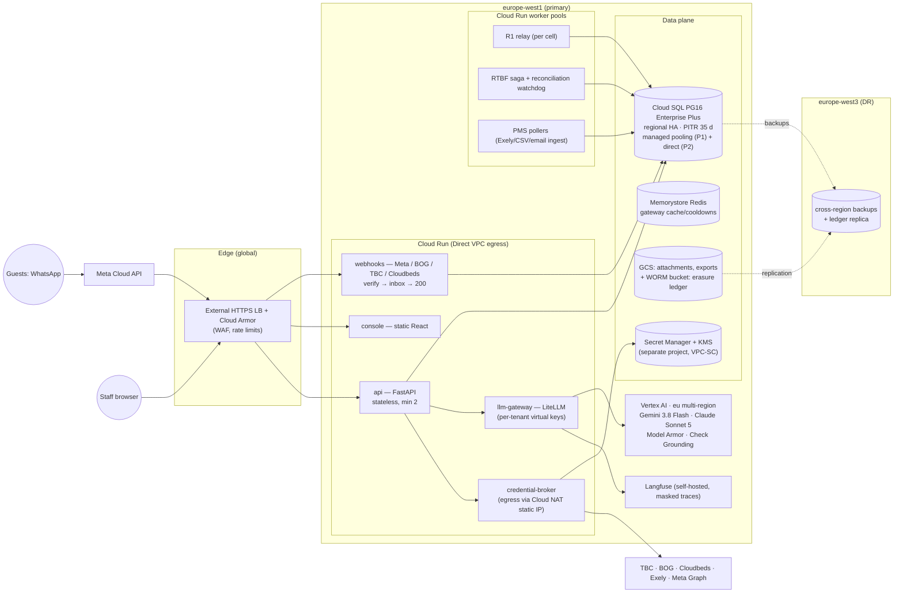
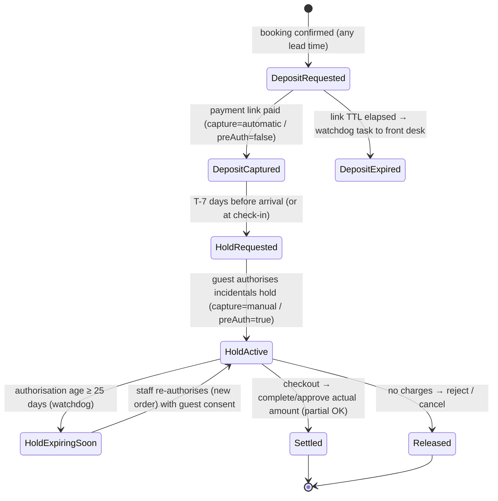
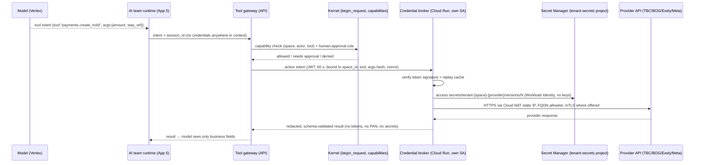
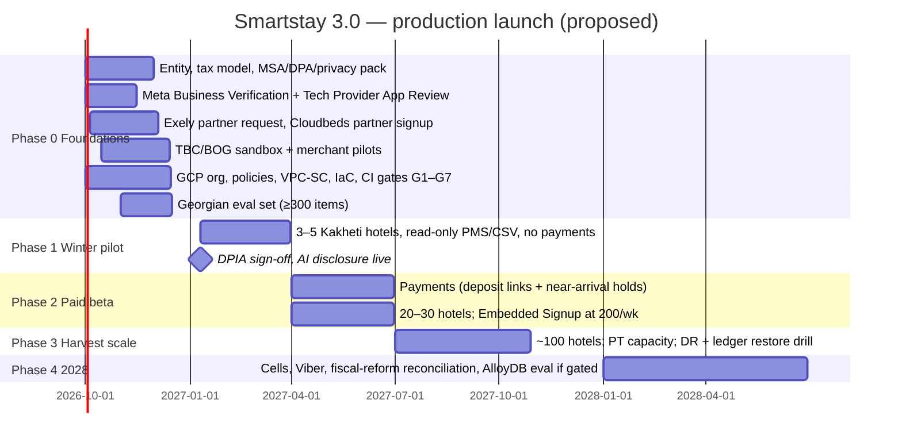

# Smartstay 3.0 — Production Product Roadmap (MVP → commercial B2B SaaS)

**Retrieval date for all external evidence: 24 September 2026.** Scope: what it takes to move the local Smartstay MVP (FastAPI + PostgreSQL 16 + React, one seeded property) to a commercial, multi-tenant, AI-native operating layer for independent hotels in Georgia. It covers seven topics:

- cloud topology and database scale;
- live WhatsApp, PMS and bank integrations;
- the tenant credential broker;
- the LLM gateway and guardrails;
- Georgian/EU compliance;
- packaging and pricing;
- a phased launch plan.

This is research and architecture, not legal, tax or financial advice. Items marked for counsel must be confirmed by a Georgian-licensed lawyer or tax adviser.

## 0. Evidence convention and how this was produced

Same labels as [hospitality_tech_landscape.md](hospitality_tech_landscape.md):

| Label | Meaning here |
|---|---|
| **[D]** | Documented on a fetched primary page: official developer docs, pricing pages, regulator or legislation pages. URL given inline or in §10. |
| **[O]** | Observed directly in this repository's own experiments (the platform research reports 00–04 and the running MVP). |
| **[I]** | Inference, design or recommendation. Not an empirical fact. |
| **[U]** | Unverified: search-snippet only, secondary/aggregator source, unfetchable page, or conflicting sources. Do not budget or contract on it without re-checking. |

**[O] Method.**
- **Local inputs (read-only):**
  - the Georgian stack evidence in [hospitality_tech_landscape.md](hospitality_tech_landscape.md) §4–§5;
  - the platform decisions in [platform/00_master_kernel_research.md](platform/00_master_kernel_research.md);
  - the verified sub-component specifications in [01 IAM](platform/subcomponents/01_kernel_iam_research.md), [02 event mesh](platform/subcomponents/02_event_mesh_research.md), [03 bridges](platform/subcomponents/03_cross_app_bridges_research.md) and [04 RTBF saga](platform/subcomponents/04_rtbf_saga_falsification_research.md).
- **External evidence:** six parallel research passes (GCP, WhatsApp, payments, PMS, LLM stack, law and pricing). Each labelled every claim [D]/[U].
- **Load-bearing figures re-checked by hand** against the raw official pages, fetched with `curl`:
  - the Gemini 3.8 Flash model listing and Vertex AI prices;
  - Cloud SQL and Cloud Run regional rates;
  - Cloud Run region tiers;
  - Secret Manager prices.

  The GCP pricing pages are rendered by JavaScript. Their numbers were extracted from the calculator data embedded in the raw HTML. SHA-256 of the saved pages:
  - `cloud.google.com/sql/pricing` → `028055b6…a2529`
  - `/run/pricing` → `36823a99…4cb798`
  - `/secret-manager/pricing` → `88b51f3e…43c52`

  Reproduction commands are in §10.3.

**[U] What this roadmap does not establish.**
- No hotelier interviews; no willingness-to-pay data (see landscape §4.2).
- WhatsApp per-message rates for Georgia's price band are not verified; the live rate card blocks scripted access.
- GCP regional prices need a final check in the Pricing Calculator. The embedded data holds several engine variants with near-identical values.
- Georgian fine amounts, the adequacy list, and PSP-licensing scope are not confirmed from primary text.
- Exely partner fees and terms are not published.
- Georgian-language model quality has no published per-model benchmark (§5.6).

---

## 1. Executive summary

1. **[D] Five premises in the brief need correcting before engineering starts** (details in §1.1):
   - the proposed LLM fallback no longer exists;
   - a single pre-authorisation cannot cover a booking made months ahead;
   - Exely *does* have a public API;
   - WhatsApp service replies become billable in **one week** (1 Oct 2026);
   - the commonly cited Georgian data-protection law is the *repealed* 2011 act.
2. **[I] Recommended topology:**
   - **Region:** GCP `europe-west1` (Belgium) as primary, with `europe-west3` (Frankfurt) for cross-region backups and disaster recovery. Both are inside Google's EU Data Boundary [D]. Belgium is a Tier-1 Cloud Run region and runs about 17–20% cheaper than Frankfurt for Cloud SQL and Cloud Run [D, §2.2]. Round-trip latency from Tbilisi differs by a few milliseconds, which is irrelevant for messaging [I].
   - **Database:** one Cloud SQL for PostgreSQL 16 Enterprise Plus instance per *cell* (100–500 hotels). Pattern A (schema-per-app), forced RLS, the two connection pools already specified in research 01 §4.4, and managed transaction pooling.
   - **Workers:** the R1 relay and the RTBF saga run as Cloud Run worker pools. Stateless APIs run on Cloud Run.
3. **[I] Tenancy scales by rows, not by schemas.** Pattern A is schema-per-*app*; tenants are separated by RLS inside each schema. 100 or 1,000 hotels is therefore a row-count and connection question, not a DDL question.
4. **[I] "10M+ chunks" does not need approximate-nearest-neighbour (ANN) search.** Every knowledge query is tenant-scoped, and a hotel's corpus is thousands of chunks, not millions. Exact per-tenant search with a `space_id` B-tree avoids pgvector's documented weakness: post-filter recall loss under RLS [U, §2.5]. ANN (HNSW, or AlloyDB ScaNN) is reserved for any future cross-tenant corpus.
5. **[D/I] Integrations:**
   - **WhatsApp:** register as a Meta **Tech Provider**. Each hotel onboards its *own* WhatsApp Business Account (WABA) through Embedded Signup and pays Meta directly.
   - **Payments:** TBC Checkout and BOG Payments, going into each **hotel's own merchant account**. The platform never holds funds, which keeps it outside payment-service licensing pending counsel [U].
   - **Deposits:** captured at booking; the pre-authorisation is opened only **near arrival**, because TBC and BOG both enforce a 30-day completion window [D].
   - **PMS tiers:** Cloudbeds (certified API) → Exely (request-based partner API) → fallback (channel manager, reservation-email parsing, CSV upload) for Georgian vendors with no public API.
6. **[I] Credentials:** the credential broker is **Google Secret Manager + Cloud KMS**, not HashiCorp Vault [D pricing, §4.4]. The model sees a tool *intent*, never a credential. The broker executes calls from a network-isolated worker with a static egress IP and an FQDN allowlist.
7. **[D/I] LLM stack:**
   - a self-hosted **LiteLLM** gateway;
   - **Gemini 3.8 Flash** as primary, with `thinking_level` set per step;
   - **Claude Sonnet 5 on Vertex AI's `eu` multi-region endpoint** as fallback. Client-side fallback is mandatory: Claude on Vertex does not support server-side fallbacks [D];
   - **Model Armor** plus Sensitive Data Protection as guardrails;
   - **Langfuse** for traces, with content masked before ingestion.
8. **[D/I] Compliance is live now, not later:**
   - **EU AI Act Art. 50:** AI disclosure has applied since 2 Aug 2026 [D].
   - **Georgian PDP Law (No. 3144, in force 1 Mar 2024):**
     - 72-hour breach notification;
     - 10-working-day responses to data-subject requests;
     - a written processor contract (Art. 36);
     - written consent for health data such as allergies [D, with counsel to confirm].
9. **[I] Pricing proposal:**
   - **Base fee:** GEL 12 per room per month, minimum GEL 190, including 1,000 AI-handled turns. That is GEL 240/month for the national-average 20-room hotel.
   - **AI overage:** GEL 0.20 per turn.
   - **WhatsApp:** billed by Meta directly to the hotel, with zero markup.
   - **Upsells:** 5% of attributed direct upsell revenue, invoiced monthly.

   Anchors: Georgian PMSs cost GEL 99–329/month and HiJiffy €99–319/month [D].
10. **[I] Launch plan:**
    - **Foundations** (Oct–Dec 2026): entity, legal pack, Meta verification, partner applications.
    - **Winter pilot** (Jan–Mar 2027): 3–5 Kakheti hotels, read-only, no payments.
    - **Paid beta** (Apr–Jun 2027): 20–30 hotels, payments on.
    - **Harvest-season scale** (Jul–Oct 2027): ~100 hotels.
    - **Cells, fiscal reform and extra channels** (2028).

    Every phase exit is gated by the falsification gates G1–G7 from research 04, re-run against production infrastructure.

### 1.1 Corrections to the brief (read first)

| # | Brief premise | Finding | Evidence |
|---|---|---|---|
| C1 | Fallback "Gemini 3.8 Flash HIGH → Claude 3.5 Sonnet / Astra" | **Gemini 3.8 Flash is real and GA** (`gemini-3.8-flash`, launched 2 Sep 2026). "High thinking" is a `thinking_level` setting, not a model. **Claude 3.5 Sonnet was retired on 28 Oct 2025**; requests fail. **"Astra" is Google DeepMind's research prototype and has no API.** Use **Claude Sonnet 5** (`claude-sonnet-5`) on Vertex AI | [D] ai.google.dev/gemini-api/docs/models (fetched by hand); [D] platform.claude.com model deprecations; [D] deepmind.google/models/project-astra |
| C2 | Pre-authorisation "30-day completion windows" can hold a harvest booking | TBC: completion "not later than 30 days from Preauthorization date" [D]. BOG: auto-release after 30 days [U, corroborated]. Card networks: roughly 30–31 days for lodging [U]. **A booking made in May for October cannot be held by one pre-auth.** Capture a deposit at booking; pre-authorise within ~7 days of arrival | [D] developers.tbcbank.ge/docs/checkout-complete-pre-authorized-payment |
| C3 | Exely has no public developer documentation (landscape §5.1) | **Exely publishes a Public API:** OAuth2 client credentials, 15-minute tokens, a Content API and a read-only Read Reservation API, **3 req/s, 300/hour per IP**. Credentials are issued on request (welcome@exely.com). No fee schedule or webhook catalogue is public | [D] exely.com/help/kb350837/ ; exely.com/tech-partners/ |
| C4 | WhatsApp "1 October 2026 pricing transition" | Confirmed and imminent. **Service (non-template) messages and utility templates sent inside the 24-hour window become billable from 1 Oct 2026**, at the market's utility rate, with no volume tiers. Georgia (+995) is priced in **"Rest of Central & Eastern Europe"**; the exact rate is not captured [U] | [D] developers.facebook.com/documentation/business-messaging/whatsapp/pricing/non-template-messages |
| C5 | "Law of Georgia on Personal Data Protection" | Current law: **No. 3144, adopted 14 Jun 2023, in force 1 Mar 2024**, at `matsne.gov.ge/en/document/view/5827307`. The widely linked `…/view/1561437` is the **repealed 2011 law** | [D] matsne.gov.ge |
| C6 | HashiCorp Vault as default secret store | Vault is BSL-licensed since Aug 2023, and HashiCorp has been part of IBM since early 2025. Secret Manager costs **$0.06 per active version per month** ([D] listed as $0.000082192/hour, 6 versions free) and **$0.03 per 10,000 accesses** (10,000 free). Vault or OpenBao is only justified for dynamic database credentials or PKI | [D] cloud.google.com/secret-manager/pricing ; [D] hashicorp.com IBM blog |
| C7 | "Usage-based billing for WhatsApp templates" by the platform | Under the **Tech Provider** model Meta bills each hotel directly; only a **Solution Partner** (with a Meta credit line) can invoice clients for WhatsApp. Reselling WhatsApp needs Solution Partner status | [D] developers.facebook.com/…/solution-providers/overview |

---

## 2. Production cloud topology and database architecture

### 2.1 Region and residency

| Item | Finding | Label |
|---|---|---|
| GCP region in Georgia or the Caucasus | **None.** The nearest EU regions are Frankfurt and Warsaw; the Middle East regions (Tel Aviv, Doha, Dammam) are closer but carry a different compliance posture | [D] (by omission, Assured Workloads locations list); distance [I] |
| `europe-west1` Belgium, `europe-west3` Frankfurt | Both active; both in the **Assured Workloads EU Data Boundary** list, together with `europe-central2`, `-west4`, `-west9`, `-west10`, `-southwest1`, `-north1`, `-north2` and the `europe` multi-region | [D] docs.cloud.google.com/assured-workloads/docs/locations |
| Residency enforcement | Organisation policy `gcp.resourceLocations` restricts where resources are created; project owners cannot override it | [D] same page |
| Pub/Sub, if used | Message storage policy can pin storage to EU regions | [D] docs.cloud.google.com/pubsub/docs/resource-location-restriction |
| Cloud Run price tier | `europe-west1` is **Tier 1**; `europe-west3` is **Tier 2** | [D] cloud.google.com/run/pricing (raw page, hand-checked) |
| Georgia's adequacy view of EU hosting | Germany and Belgium (EU/EEA) are reported on the PDPS adequate-countries list | [U]: personaldata.ge did not render; counsel to confirm |

**[I] Decision.**
- **Primary region:** `europe-west1`.
- **Backups and disaster recovery:** `europe-west3`.
- **Vertex AI:** the `eu` multi-region endpoint (§5.2).
- **Org policy:** locked to the EU set.

Frankfurt-primary is equally valid if a customer or investor asks for "Germany" specifically. The cost delta is quantified below.

```yaml
# Org policy (resource locations): apply at the organisation node, not per project
name: organizations/ORG_ID/policies/gcp.resourceLocations
spec:
  rules:
    - values:
        allowedValues:
          - in:eu-locations          # GCP value group for EU regions + eu/europe multi-regions
```

**[U]** Confirm that the value-group name `in:eu-locations` is still accepted in the current org-policy documentation before applying it. An explicit list such as `europe-west1` and `europe-west3` is the conservative alternative.

### 2.2 Verified unit prices (USD, list price, 24 Sep 2026)

Extracted from the calculator data embedded in the official pricing pages [D]. One month is taken as 730 hours = 2,628,000 seconds.

| SKU | Belgium `europe-west1` | Frankfurt `europe-west3` | Δ |
|---|---|---|---|
| Cloud SQL **Enterprise**, HA vCPU-hour / HA GiB-hour | $0.0826 / $0.014 | $0.0991 / $0.0168 | +20% |
| Cloud SQL **Enterprise Plus**, HA vCPU-hour / HA GiB-hour | $0.1074 / $0.0182 | $0.1289–0.1296 / $0.0216–0.0218 † | +20% |
| Cloud SQL SSD storage, HA (GiB-month) | $0.34 ($0.000465753/h) | $0.41 ($0.000558904/h) | +20% |
| Cloud SQL backups (GiB-month) | $0.080 | $0.096 | +20% |
| Cloud Run instance-based, vCPU-second / GiB-second | $0.000018 / $0.000002 | $0.0000216 / $0.0000024 | +20% |
| Secret Manager | $0.06 per active version per month (6 free); $0.03 per 10k accesses (10k free) | same (global SKU) | — |
| Vertex AI **Gemini 3.8 Flash**, non-global endpoint, input / output per 1M tokens | $0.825 / $4.125 until 31 Dec 2026; **$1.65 / $8.25 from 1 Jan 2027** | same | — |
| Vertex AI **Claude Sonnet 5**, regional or multi-region, input / output per 1M | $2.20 / $11.00 (global endpoint: $2.00 / $10.00) | same | — |

† The page embeds several engine variants with values differing in the fourth decimal place. Reconfirm in the Pricing Calculator for `POSTGRES_16`.

**[D]** "Output" includes reasoning tokens for Gemini: the page reads "Text output (response and reasoning)". High-thinking steps are therefore billed at the output rate.

### 2.3 Target topology



**[I] Why Cloud Run and not GKE for v1:**
- **Stateless services on Cloud Run.** API, webhooks, gateway and broker scale on requests and need no cluster fee.
- **Long-running loops on worker pools.** The relay, the saga worker and the pollers are pull-loops, which is what worker pools are for [D, docs.cloud.google.com/run/docs/deploy-worker-pools; GA date U].
- **When to move to GKE Autopilot:**
  - self-managed PgBouncer sidecars become necessary;
  - Langfuse's ClickHouse needs stateful sets;
  - or the team is already operating Kubernetes.

  GKE Autopilot adds a $0.10/cluster-hour management fee [U].
- **Not Cloud SQL managed pooling on Enterprise:** that feature is **Enterprise Plus only** [D], which is the main reason for choosing Enterprise Plus.

### 2.4 PostgreSQL 16 at 100+ properties under Pattern A

**[O] What is already proven locally** (research 01–04):
- **Isolation:**
  - forced RLS on every table;
  - `begin_request()` sets transaction-local context (`set_config(…, true)`);
  - 200 of 200 pooled transactions isolated, with the session-`SET` leak reproduced as a negative control (01 §4.4).
- **Relay:** head-of-line claiming gives 0 order inversions, versus 32 with naive `SKIP LOCKED` (02 §1).
- **Locking:** no deadlock path while each transaction touches one app (04 G5).

These become production invariants.

| Concern | Production decision | Evidence |
|---|---|---|
| **Pool P1 (transaction)** | Cloud SQL managed connection pooling. Enterprise Plus only; transaction mode is the default; `max_client_connections` default 5,000, `max_pool_size` default 50. **`max_prepared_statements` defaults to 0**: use protocol-level prepared statements only after raising it, or disable server-side prepares in the driver | [D] docs.cloud.google.com/sql/docs/postgres/managed-connection-pooling |
| What breaks in transaction pooling | `SET`/`RESET` (session-level), `LISTEN`, `WITH HOLD` cursors, `PREPARE`/`DEALLOCATE`, session advisory locks; temp tables only with `ON COMMIT DROP`. The same list applies to Cloud SQL pooling and PgBouncer | [D] pgbouncer.org/features.html; Cloud SQL doc above |
| **Pool P2 (session, pinned)** | Direct connection (bypassing the pooler) for the App 1 send gate's session advisory lock, `LISTEN` wake-ups and migrations. Small, monitored, and reset **only after** the owner releases its locks (01 §4.4 test 2.23: `DISCARD ALL` silently releases session advisory locks) | [O] 01 §4.4 |
| CI lint | Reject any `SET` without `LOCAL`, and any `pg_advisory_lock(` (session form), in code that uses P1 | [I] |
| Self-managed alternative | PgBouncer **1.26.0** (released 23 Sep 2026); `max_prepared_statements` default 200 since 1.24.0 | [D] github.com/pgbouncer/pgbouncer/releases |
| HA and recovery | Enterprise Plus: 99.99% SLA including maintenance, maintenance downtime under 1 s, **PITR log retention up to 35 days**. Enterprise: 99.95%, 7 days | [D] docs.cloud.google.com/sql/docs/postgres/editions-intro |
| Cross-region | Automated backups copied to `europe-west3`; a cross-region read replica is optional and adds replication lag | [U] |
| Erasure versus backups | The anti-resurrection ledger (04 §2) is shipped to a **GCS bucket with Bucket Lock retention** longer than the PITR plus backup window (≥ 35 days + backup retention). The restore runbook replays it **before** traffic is enabled | [O] 04 R.01–R.03; Bucket Lock [I] |
| Cells | One Cloud SQL instance per cell. `platform.spaces` gains `cell_id`, and a tiny global routing table maps property → cell. **No cross-cell transactions** (the 04 G5 invariant extended to cells). Start with one cell; split at ~70% sustained CPU or ~300 active properties, whichever comes first | [I] |

```bash
# Illustrative. Verify flag names against `gcloud sql instances create --help` at build time [U for pooling flags].
gcloud sql instances create smartstay-cell-01 \
  --database-version=POSTGRES_16 --edition=ENTERPRISE_PLUS \
  --tier=db-perf-optimized-N-4 --region=europe-west1 --availability-type=REGIONAL \
  --enable-point-in-time-recovery --retained-transaction-log-days=35 \
  --backup-start-time=01:00 --backup-location=europe-west3 \
  --no-assign-ip --network=projects/PROJECT/global/networks/smartstay-vpc \
  --disk-encryption-key=projects/KMS_PROJECT/locations/europe-west1/keyRings/sql/cryptoKeys/cell-01 \
  --database-flags=cloudsql.iam_authentication=on,log_min_duration_statement=500
```

Runtime roles carry the timeouts, not the pool (research 01 §4.4):

```sql
ALTER ROLE smartstay_app SET statement_timeout = '5s';
ALTER ROLE smartstay_app SET lock_timeout = '2s';
ALTER ROLE smartstay_app SET idle_in_transaction_session_timeout = '10s';
-- still: NOSUPERUSER NOBYPASSRLS; context only via platform.begin_request() + SET LOCAL
```

### 2.5 Knowledge retrieval at 10M+ chunks

| Fact | Label |
|---|---|
| pgvector 0.8.x adds **iterative index scans** (`hnsw.iterative_scan = relaxed_order`, `hnsw.max_scan_tuples` default 20,000) to recover results lost to post-filters | [U] pgvector changelog via search; PGXN changelog link in §10 |
| ANN indexes do not push tenant or RLS predicates into the graph traversal. **Filters apply after the scan, so selective tenant filters silently cut recall** | [U] (consistent across sources; test it) |
| A 10M × 1536-dimension HNSW index is reported at 80–120 GB; `maintenance_work_mem` must be sized for the build, or it falls back to a much slower disk path | [U] |
| AlloyDB ScaNN versus pgvector HNSW: **about 4× lower latency at ~1M vectors**; "10× / 60× cheaper build" only at **1 billion** vectors. Vendor-authored, with no recall figures | [D] Google Cloud blog (vendor benchmark) |

**[I] Design for tenant-scoped retrieval.**
- **Scale.** 10M chunks across 2,000 hotels is about 5,000 chunks per hotel.
- **Exact search is cheap.** A 768-dimension `halfvec` is about 1.5 KB. Exact k-NN over one hotel's 5,000 vectors reads about 7.5 MB of cached pages, well within a millisecond-range budget and without ANN recall loss.
- **Design:**
  - `kb.chunks(space_id, …, embedding halfvec(768))`;
  - B-tree `(space_id, document_id)`;
  - query `WHERE space_id = platform.tenant() ORDER BY embedding <=> $q LIMIT k` with **no ANN index**, plus the existing full-text leg (the MVP's `kb.search`) for hybrid ranking;
  - the approval and validity predicates stay in SQL: `APPROVED_ACTIVE`, `valid_during @> now()`.
- **Gate:** at 20,000 chunks per tenant, p95 retrieval must be under 50 ms on the production tier. If it isn't:
  - hash-partition `kb.chunks` by `space_id`;
  - or add per-partition HNSW with `iterative_scan`;
  - or evaluate AlloyDB ScaNN.

  Do not adopt ANN before this gate fails.
- **Embeddings:** Vertex AI text embeddings in the EU (the embedding model choice needs a Georgian retrieval eval, §5.6).

### 2.6 Workers and the R1 relay in production

- **[O] Carry over research 02 §7 unchanged:**
  - the `platform_relay` role switching transport roles per source;
  - head-of-line claims;
  - causal-depth limit 8;
  - dead letters without payloads;
  - the `mesh.relay_health()` statuses, including the `CONTEXTLESS_RELAY` alarm for the zero-row hazard.
- **[I] Deployment:** one relay worker-pool instance per cell (leader by `pg_try_advisory_xact_lock` per claim cycle, so a second instance is a warm standby, not a double publisher), plus the saga and reconciliation worker. The SSE fan-out moves out of the API process: the MVP's in-memory broker does not survive multiple API instances.
  - **Option A:** each API instance tails the delivery table by cursor.
  - **Option B:** relay → Pub/Sub topic (EU storage policy) → API instances subscribe.

  Start with A, which has fewer moving parts.
- **[I] SLOs:**
  - p95 outbox age under 2 s per property × source;
  - zero `UNSCANNED_BACKLOG` for more than 60 s;
  - dead letters page on-call.
- **[O] Retention hardening is still open (02 §7):** `mesh.lineage`, `mesh.deliveries`, heartbeats and published outbox rows. Heartbeats grow by about 5,000 rows per cycle at 1,026 properties.

### 2.7 Monthly infrastructure baseline

List prices, Belgium, from §2.2. Pilot and 100-hotel scale are shown separately.

| Component | Pilot (≤ 10 hotels) | Scale (1 cell, ~100 hotels) | Basis |
|---|---|---|---|
| Cloud SQL | Enterprise HA, 2 vCPU / 8 GiB: **$202**. Self-managed pooling needed | Enterprise Plus HA, 4 vCPU / 32 GiB: **$739**. Frankfurt ≈ $885 | [D] rates × 730 h |
| DB storage, HA SSD, 100 GiB, plus backups ~100 GiB | $42 | $42 | [D] |
| Cloud Run: API ×2, webhooks ×1, gateway ×2, broker ×1 at 1 vCPU / 2 GiB, always allocated | ~$347 (6 × $57.8) | ~$347 → scales with load | [D] rates; instance counts [I] |
| Worker pools: relay, saga/watchdog, pollers (3 × 1 vCPU / 2 GiB) | ~$173 | ~$173 per cell | [U] worker-pool SKU assumed equal to instance-based pricing |
| Secret Manager (~5 secrets per hotel) | < $5 | ~$30 (500 versions) | [D] |
| Memorystore, load balancer + Cloud Armor, NAT, logging, Langfuse host | budget $150–300 | budget $300–600 | [U]: price in the calculator |
| **Total, order of magnitude** | **~$0.9–1.1k / month** | **~$1.6–1.9k / month ≈ $16–19 per hotel** | [I] |

---

## 3. Live telecom, PMS and payment integrations

### 3.1 Meta WhatsApp Business Platform (Cloud API)

**Go-live prerequisites**

| Step | Requirement | Label |
|---|---|---|
| Vendor posture | **Tech Provider**: builds WhatsApp services for other businesses, with no credit line. Each client adds its own payment method and Meta bills the client. (A **Solution Partner** has a credit line and invoices clients.) | [D] …/solution-providers/overview |
| App permissions | `whatsapp_business_management` and `whatsapp_business_messaging` with **Advanced Access via App Review**. "You will not be able to onboard business customers until your app has been approved" | [D] developers.facebook.com/docs/whatsapp/embedded-signup |
| Client onboarding | **Embedded Signup**: the hotel authenticates, creates or selects its WABA, verifies its number and sets a display name. The platform receives the WABA ID, phone-number ID and an exchangeable code. **Limit: 10 new customers per rolling 7 days, 200/week after Business Verification, App Review and Access Verification** | [D] same |
| Business Verification | Needed to lift the 250/day messaging tier and for Official Business Account status (≥ 30 days on the platform, 2-step PIN, approved display name) | [D] …/official-business-accounts/ |
| On-Premises API | **Sunset**: final version expired 23 Oct 2025. Cloud API only | [D] …/on-premises/sunset |
| Webhooks | Verification via `hub.challenge`; payloads signed in `X-Hub-Signature-256` (HMAC-SHA256 of the raw body with the app secret); retries for up to **7 days**, with duplicates possible; **no ordering guarantee** documented | [D] set-up-webhooks; graph-api webhooks |
| Messaging limits | 250 → 2,000 → 10,000 → 100,000 → unlimited, **set at business-portfolio level** and shared by all its numbers. Auto-upgrade within 6 h at high quality and ≥ 50% usage | [D] …/messaging-limits |
| Throughput | 80 mps default, upgradable to 1,000 | [U] |
| Graph API management calls | 200/h per app per WABA; 5,000/h per active WABA; throttling error 80008 | [D] graph-api rate-limiting |
| Pricing | Per-message since 1 Jul 2025. **From 1 Oct 2026, service messages and in-window utility templates are billable** at the utility/authentication rate of the market, with no volume tiers. Georgia is priced in "Rest of Central & Eastern Europe"; the rate is not captured | [D] …/pricing/non-template-messages ; rate [U] |
| Free entry points | Click-to-WhatsApp ads and Page CTA open a **72-hour** free window | [D] …/pricing |
| AI policy | From 15 Jan 2026, "AI Providers" (general-purpose assistants) are restricted. A hotel's task-specific concierge reads as outside that definition. **Human escalation paths are mandatory**; opt-in is required | [D] …/pricing/ai-providers ; [D] whatsappbusiness.com/policy ; carve-out wording [U] |

**Architecture**

```mermaid
sequenceDiagram
  participant M as Meta Cloud API
  participant W as webhooks (Cloud Run)
  participant DB as contact_center (inbox + outbox)
  participant R as R1 relay
  participant A as AI team (App 5)
  participant B as credential broker
  M->>W: POST /webhooks/meta (X-Hub-Signature-256)
  W->>W: HMAC verify on raw body; reject on mismatch
  W->>DB: INSERT inbox ON CONFLICT (wamid) DO NOTHING  -- dedupe 7-day retries
  W-->>M: 200 within budget (no LLM work on the request path)
  R->>A: MessageReceived (per-conversation head-of-line order)
  A->>DB: reply draft → dispatch gate (owner/evidence check)
  DB->>R: outbox SendMessage
  R->>B: send intent (space_id, phone_number_id, body)
  B->>M: POST /{phone-number-id}/messages (hotel's system-user token)
```

```python
# Webhook signature check (FastAPI). Use the raw bytes, never re-serialised JSON.
import hmac, hashlib
def verify_meta(raw: bytes, header: str, app_secret: bytes) -> bool:
    expected = "sha256=" + hmac.new(app_secret, raw, hashlib.sha256).hexdigest()
    return hmac.compare_digest(expected, header or "")
```

**[I] Operational rules.**
- Order by the message `timestamp`, not arrival order.
- Map `wamid` to `contact_center.messages` idempotency keys.
- Keep the MVP's "operator locked → AI drafts only" gate: it *is* the human-escalation path the policy requires.
- Show the in-window cost of every AI reply in the console, because from 1 October each one costs money.

**[I] Other channels** (landscape §4.4: WhatsApp 29% versus Viber 27% weekly use in Georgia):
- **Messenger and Instagram:** add them through the same Meta app. The 24-hour window and message tags apply; Handover Protocol is moving to "Conversation Routing" [U].
- **Viber Business Messages:** partner-only access; reported at about €115 per sender per month plus about €0.0025 per message [U]. Phase 4 (2028).

### 3.2 Payments: TBC Checkout (tpay) and BOG Payments API

| Capability | TBC Checkout | BOG Payments | Label |
|---|---|---|---|
| Auth | `apikey` header plus `POST /v2/tpay/access-token` (client_id/secret) → Bearer, `expires_in` 86,400 s in the example | `POST https://oauth2.bog.ge/auth/realms/bog/protocol/openid-connect/token`, Basic client credentials → Bearer (TTL not stated) | [D] |
| Create | `POST /tpay/payments` (`amount`, `currency`, `returnurl`, `callbackUrl`, `preAuth`, `methods`, `extra`) | `POST /payments/v1/ecommerce/orders` (`callback_url`, `purchase_units`, **`capture: automatic\|manual`**, `ttl` 2–1,440 min, `payment_method[]`, `config.split`) | TBC fields [U]; BOG [D] |
| Complete a pre-auth | `POST /v1/tpay/payments/{payId}/completion` `{amount}`. **Partial allowed** (the remainder is auto-returned). **≤ 30 days** | `POST /payments/v1/payment/authorization/approve/{order_id}` `{amount?}`; reject: `…/reject/{order_id}`. Auto-release after 30 days | [D]; BOG 30 d [U] |
| Refund / cancel | `POST /v1/tpay/payments/{payId}/cancel`. Partial cancel is not allowed before completion; one partial cancel per day | `POST /payments/v1/payment/refund/{order_id}` `{amount?}` | [D] |
| Idempotency | not documented | `Idempotency-Key` (UUID v4) header | [D] |
| Callback authenticity | **Signing not confirmed.** Always re-query `GET /tpay/payments/{payId}` | `Callback-Signature`: SHA256withRSA over the body with BOG's public key. If no callback arrives, poll order details | TBC [U]; BOG [D] |
| Go-live | The site must publish Terms, Return, Privacy and Delivery policies plus contact details | Onboarding handled by business banking, not in the API docs | TBC [D]; BOG [U] |
| Fees | Not published; negotiated | Not published | [D] (absence) |

**[I] Deposit and pre-authorisation lifecycle** (fixes C2):



**[I] Rules.**
- **Money flow and the NBG question.** Funds go from the acquirer to the **hotel's own merchant account**. The platform stores only order IDs and states. The National Bank of Georgia's pages do not define a "technical service provider" carve-out [D, by absence], so a Georgian financial-regulatory lawyer must confirm that orchestrating the API calls stays outside payment-service licensing *before* any split-payment (`extra`/`config.split`) is used to route the platform's revenue share.
- **PCI scope.** Use hosted payment pages and redirects only: no card data touches Smartstay. SAQ A: PCI SSC removed 6.4.3 / 11.6.1 from SAQ A effective 31 Mar 2025 and replaced them with a script-attack eligibility statement [D, blog.pcisecuritystandards.org]. Confirm eligibility with each acquirer.
- **Reconciliation watchdog** (landscape white space 2):
  - pre-authorisations older than 25 days;
  - callbacks without a matching re-query;
  - folios closed with an active hold;
  - daily bank-settlement totals against the PMS.

  Each becomes a task with an owner.
- **Flitt** (Georgia supported; SHA1 signature over sorted parameters; capture API; fiscalisation module) [D] is a candidate third rail for hotels that bank elsewhere.

### 3.3 PMS partner reality

| Tier | Target | Access path | Constraints | Label |
|---|---|---|---|---|
| **A** | **Cloudbeds** (1 of 11 sampled Kakheti sites) | Partner programme: self-implement → app details → live certification call. OAuth2 or API key; property or group access | 5 req/s (10 for certified partners); webhooks retried **5 times at 1-minute intervals**, then dropped, so a reconciliation poll is required; v1.1 deprecated March 2025, use v1.2/v1.3 | [D] developers.cloudbeds.com |
| **B** | **Exely / TravelLine** (5 of 11) | Request credentials from welcome@exely.com via the Tech Partner programme; Public API with Content and **Read Reservation** (read-only) | Token 15 min, no refresh; **3 req/s, 15/min, 300/h per IP**. With one static egress IP, 300 req/h across *all* hotels means about 100 hotels at one poll per 20 minutes. **Negotiate partner limits; do not evade them with IP rotation.** Webhooks are mentioned for the extranet but have no catalogue [U]. No guest-messaging partner precedent is listed | [D] exely.com/help/kb350837/ ; exely.com/tech-partners/ |
| B′ | TravelLine (Russia) | `partner.tlintegration.com`, the same OAuth2 pattern, a PMS Integration API | A different counterparty from Exely. Sites badged "TravelLine" may be on either platform; **sanctions and legal-entity diligence is required** before contracting | [D] travelline.ru dev portal; relationship [U] |
| **C** | OtelMS, HMS.ge, FINA Hotel, Arealy | No public API (FINA advertises an undocumented "FINA HOTEL WEB Api") | Ask each vendor; treat as fallback until then | [D] (absence) / [U] |
| **Fallback** | Any PMS | (1) The property's **channel manager** (Channex: $130/month plus $7/property; SiteMinder pmsXchange) as the reservation read source; (2) a per-hotel forwarding address that **parses OTA booking-notification emails**; (3) a daily **arrivals CSV/Excel upload**; (4) manual entry in the console | All read-only and human-confirmed. No screen scraping: terms-of-service risk, and no vendor sanctions it | [D] channex.io/pricing; practices [U] |
| OTA messaging | Booking.com Messaging API | Real and scoped, but gated behind **Connectivity Partner** status (PCI/PII requirements). A pure messaging SaaS probably rides on the hotel's channel manager | [D] developers.booking.com messaging-api; eligibility [U] |

**[I] Integration contract.** Every PMS adapter emits the same normalised events (`ReservationUpserted`, `GuestUpserted`, `StayStatusChanged`, `FolioPosted`) into App 2 and App 3 inboxes through the R1 relay. This keeps the apps PMS-agnostic, and "read broadly, write narrowly" (landscape §5) becomes a code boundary. Writes back to a PMS (notes, charges) are tier-A only and human-approved.

---

## 4. Enterprise secret vault and zero-trust credential brokerage

### 4.1 What must be stored per tenant

| Secret | Owner | Lifetime / rotation | Label |
|---|---|---|---|
| WhatsApp system-user access token for the hotel's WABA (from Embedded Signup code exchange) | hotel WABA | long-lived; re-onboard on revoke | [D] embedded signup; lifetime [U] |
| TBC `client_id` / `client_secret` plus platform `apikey` | hotel merchant; platform app | manual rotation; access token 24 h (cache in memory only) | [D] |
| BOG client credentials | hotel merchant | manual rotation; access token TTL not stated | [D]/[U] |
| Exely client credentials | per hotel or partner | access token 15 min | [D] |
| Cloudbeds OAuth refresh token or API key | per property | rotate per Cloudbeds policy | [D] |
| Meta app secret, BOG public key, webhook verify tokens | platform | platform rotation | [D] |

### 4.2 Broker architecture



**[I] Controls.**
1. **Isolation by project.** Secrets live in a dedicated `smartstay-tenant-secrets` project inside a **VPC Service Controls** perimeter with the broker. Only the broker's service account holds `secretmanager.secretAccessor`, restricted by an IAM Condition to `tenant-` secrets.

   ```bash
   gcloud projects add-iam-policy-binding smartstay-tenant-secrets \
     --member=serviceAccount:broker@smartstay-prod.iam.gserviceaccount.com \
     --role=roles/secretmanager.secretAccessor \
     --condition='title=tenant-only,expression=resource.name.startsWith("projects/PROJECT_NUMBER/secrets/tenant-")'
   ```

2. **Per-tenant binding at call time.** Secret IDs are derived from the action token's `space_id`, never from model output. The token's args-hash prevents parameter swapping between approval and execution.
3. **Short-lived everything.**
   - Cloud Run workload identity: no service-account keys.
   - Provider access tokens cached in the broker's memory for less than their TTL.
   - Secret versions pinned, with rotation implemented by adding a version and then disabling the old one.
   - Access volume stays inside the 10k-free / $0.03-per-10k band [D].
4. **Network isolation.**
   - Direct VPC egress → Cloud NAT with a reserved static IP. Banks and Exely may allowlist it, and the Exely per-IP limit becomes predictable.
   - Egress firewall / Secure Web Proxy FQDN allowlist:
     - `api.tbcbank.ge`
     - `api.bog.ge`
     - `oauth2.bog.ge`
     - `connect.hopenapi.com`
     - `api.cloudbeds.com`
     - `graph.facebook.com`
5. **Zero LLM context exposure.**
   - The broker returns only an allowlisted response schema per tool.
   - Secrets, raw payloads and PANs never enter prompts, traces, logs or the outbox (research 02's dead letters already store only payload hashes).
   - Output from providers is treated as **untrusted data** before it re-enters a prompt: OWASP LLM01, indirect injection (§5.4).
6. **Encryption.** CMEK via Cloud KMS for Cloud SQL, Secret Manager and GCS.
7. **Audit.**
   - Cloud Audit Logs Data Access on for Secret Manager.
   - A broker audit row per call (space, tool, actor, approval id, provider status). No payload.
8. **Revocation.** Disabling a member or suspending a property in the kernel invalidates action tokens at the next check. Research 04 G7 showed revocation is immediate on database-enforced paths. The broker also checks `platform.spaces.lifecycle = 'ACTIVE'` on every call.

### 4.3 Where HashiCorp Vault or OpenBao would earn its place [I]

- Dynamic, per-request PostgreSQL credentials, replacing long-lived IAM database users.
- An internal PKI for mTLS between services.
- A multi-cloud requirement.

None of these is needed for v1. If one appears, prefer **OpenBao** (MPL-2.0, Linux Foundation) over Vault Enterprise or HCP Vault Dedicated, reported at about $1,150–6,900/month [U].

### 4.4 Cost [D]

- **Secret count:** 5 secrets × 100 hotels ≈ 500 active versions ≈ **$30/month**.
- **Access calls:** with in-memory token caching, well under 1M per month ≈ **< $3**.

---

## 5. Production LLM gateway, observability and guardrails

### 5.1 Model routing

| Role | Model | Endpoint | Price (per 1M in/out) | Label |
|---|---|---|---|---|
| Primary: intents, concierge replies, sommelier, ops planning | **Gemini 3.8 Flash** (`gemini-3.8-flash`); `thinking_level` low / medium / high per step (default medium) | Vertex AI **`eu` multi-region** (processing kept in the EU); regional `europe-west1` only if per-model availability is confirmed | $0.825 / $4.125 to 31 Dec 2026; **$1.65 / $8.25 from 2027** (non-global) | [D] price and GA; thinking levels [U] |
| Fallback: 429, 5xx, timeouts, safety-refusal-on-benign | **Claude Sonnet 5** (`claude-sonnet-5`) | Vertex **`eu` multi-region**. Sonnet 4.5+ supports **only global or `us`/`eu` multi-region**; regional/multi-region carries a 10% premium; **no server-side fallbacks**, so the fallback is client-side | $2.20 / $11.00 | [D] |
| Cheap tier (classification, redaction) | Gemini 3.5 Flash-Lite, or Claude Haiku 4.5 | `eu` | see Vertex pricing page | [D] listed; price not re-checked |
| Retired / non-existent | Claude 3.5 Sonnet (retired 28 Oct 2025); "Astra" (no API) | — | — | [D] |

**[D] Capacity.** Gemini on Vertex runs on **Dynamic Shared Quota**: a best-effort pool, where a 429 means the shared pool is saturated, not that a project cap was hit. Guaranteed capacity requires **Provisioned Throughput**, bought in GSUs and needing a regional endpoint.

**[I] Plan:**
- pay-as-you-go through the pilot;
- measure the peak (check-in/check-out waves in harvest season);
- buy Provisioned Throughput for the primary model before Phase 3 if p99 queueing or the 429 rate exceeds its SLO;
- fall back to Claude, then to **human handoff** (the MVP's `HANDED_TO_HUMAN` path). Never silence.

**[D] Pitfall.** An API-key-only client can silently fall through to the *global* endpoint (gemini-cli issue #27984). Pin location in gateway config, and alert on any request served outside `eu`.

### 5.2 Gateway: LiteLLM, self-hosted in the primary region

| Option | Licence | Fit | Label |
|---|---|---|---|
| **LiteLLM Proxy** | MIT core (`enterprise/` licensed separately) | Router fallbacks on 429/5xx with cooldowns; per-tenant **virtual keys with budgets**; Redis cache; Langfuse callback; runs inside our VPC | [D] licence; features [U] |
| Portkey Gateway | MIT core; hosted EU residency is Enterprise-only | Good gateway; the hosted control plane is US by default | [U] |
| Langfuse | MIT self-host; **server-side ingestion masking is Enterprise**; Cloud EU is in AWS Ireland | Observability and evals, not routing | [D]/[U] |
| OpenTelemetry GenAI semconv | Apache-2.0 | **All `gen_ai.*` attributes are still "Development"**; split into its own repo in June 2026 with no tagged release. Keep the mapping in one adapter | [D] opentelemetry.io blog 2026 |

```yaml
# litellm config.yaml (illustrative; verify param names against the LiteLLM version pinned at build) [U]
model_list:
  - model_name: concierge
    litellm_params:
      model: vertex_ai/gemini-3.8-flash
      vertex_project: smartstay-prod
      vertex_location: eu            # multi-region: EU processing; never "global"
      reasoning_effort: medium       # maps to Gemini thinking_level; "high" only for planning steps
  - model_name: concierge-fallback
    litellm_params:
      model: vertex_ai/claude-sonnet-5
      vertex_project: smartstay-prod
      vertex_location: eu
router_settings:
  num_retries: 2                     # exponential backoff with jitter on 429/5xx
  allowed_fails: 3
  cooldown_time: 30
  fallbacks: [{ "concierge": ["concierge-fallback"] }]
litellm_settings:
  callbacks: ["langfuse"]
  turn_off_message_logging: true     # spend/latency/tokens only; content masked upstream
general_settings:
  master_key: os.environ/LITELLM_MASTER_KEY   # from Secret Manager at deploy
# one virtual key per tenant: max_budget + budget_duration=30d → OWASP LLM10 (unbounded consumption) control
```

### 5.3 Request pipeline with guardrails

```mermaid
flowchart LR
  IN["Guest message (WhatsApp)"] --> MA1["Model Armor: prompt screen<br/>injection · jailbreak · malicious URL · PII"]
  MA1 -->|block| HUM["Human handoff task"]
  MA1 --> PLAN["Planner (Gemini 3.8 Flash, low/medium)"]
  PLAN --> TOOLS["Tools via gateway + broker<br/>(CRM Layer-1, kb.search, operations.request)"]
  TOOLS --> SPAN["Untrusted-content spans<br/>(retrieved docs, provider data, guest text)"]
  SPAN --> GEN["Compose (medium/high) with citations"]
  GEN --> GRD["Grounding check: claims vs approved chunks<br/>(Vertex Check Grounding score + our evidence re-validation)"]
  GRD -->|score < threshold| HUM
  GRD --> MA2["Model Armor: response screen"]
  MA2 --> GATE["Dispatch gate (existing): owner lock · evidence still valid · no completion claims"]
  GATE --> OUT["Send via broker"]
```



| Control | Mechanism | Label |
|---|---|---|
| Prompt injection, direct and **indirect** (OWASP LLM01, 2025 edition) | Model Armor on input and output. Guest text and retrieved chunks are wrapped as quoted data with a fixed instruction hierarchy. Tools are allowlisted per step; the model cannot choose the tenant, the credential or the recipient | [D] OWASP list; Model Armor features [U]; design [I] |
| Excessive agency (LLM06) | Existing capability matrix plus human approval for writes (payments, PMS writes, charges); "AI never claims completion" (App 3 attestation) | [O] MVP, 03/04 research |
| Misinformation (LLM09) | Answers only from `APPROVED_ACTIVE` knowledge valid now (MVP `kb.search`), re-validated at dispatch; **Vertex Check Grounding** returns a 0–1 support score with per-claim citations to gate low-support answers | [O]; [D] docs.cloud.google.com/generative-ai-app-builder/docs/check-grounding |
| Sensitive data (LLM02) | Sensitive CRM facts (allergens) used for safety checks, not echoed; Sensitive Data Protection de-identification before any trace or log | [O] MVP; [U] SDP integration |
| Unbounded consumption (LLM10) | Per-tenant LiteLLM budgets; per-conversation turn caps; Cloud Armor rate limits on webhooks | [I] |
| Pricing of guardrails | Model Armor: 2M tokens/month free, then $0.10 per 1M tokens; EU regions include `europe-west1` and `europe-west3` | [U] |

### 5.4 Telemetry without guest PII

**[I] Record per model call:**
- tenant pseudonym (a keyed HMAC of `space_id`);
- session id and step kind;
- model and endpoint location;
- prompt template version;
- `thinking_level`;
- input, output and cached token counts;
- cost at list price;
- latency (queue / TTFT / total);
- fallback reason;
- guardrail verdicts;
- grounding score.

**Do not record** raw guest text, names, phone numbers or allergens.

Langfuse free/MIT offers only **client-side** masking, so the masking function runs in our gateway callback before export. Keep masked traces for 30 days and aggregates for 13 months. Spend per tenant comes from LiteLLM virtual keys and is reconciled monthly against Vertex billing export.

### 5.5 Evals and release gates

- **promptfoo** in CI: red-team suites (direct and indirect injection in Georgian, Russian and English) plus regression cases from the MVP's four canonical intents. It has published guides for testing Model Armor and hallucinations [D].
- **Ragas** faithfulness and context-precision dashboards on sampled, masked production traces [U].
- **Model changes** (Gemini 3.8 → next, or fallback promotion) ship only if all three hold:
  - faithfulness ≥ baseline;
  - injection pass-rate ≥ baseline;
  - Georgian task success ≥ threshold (§5.6).

### 5.6 Georgian language quality: an evidence gap

**[U] No published per-model Georgian scores were found** for Gemini or Claude on Global-MMLU, MMLU-ProX, Belebele or FLORES. Belebele and FLORES-200 include Georgian (`kat_Geor`), but no current-model scores were located.

**[I] Build an internal Georgian eval set** before the pilot:
- ≥ 300 items: guest intents, policy questions, allergen and price answers, handoff triggers;
- 3 native reviewers;
- a stricter grounding threshold for Georgian until measured.

Hotels see Georgian replies only after the set passes.

---

## 6. Regulatory compliance

### 6.1 Roles

**[I]** For guest data processed on a hotel's behalf:
- the **hotel is the controller**;
- **Smartstay is the processor**;
- Google Cloud (including Vertex AI) is Smartstay's sub-processor;
- Meta is engaged by the hotel under WhatsApp Business terms.

For platform accounts, billing and security telemetry, Smartstay is a controller.

### 6.2 Law of Georgia on Personal Data Protection (No. 3144, in force 1 Mar 2024)

| Obligation | Article | Platform mechanism | Label |
|---|---|---|---|
| Processor contract: written; purpose, categories, term, security, deletion on termination | Art. 36 | DPA template signed with every hotel (§6.5) | [D] matsne 5827307 |
| Special-category (health) data. **Allergies = health data → written consent** | Art. 6(a) | CRM `basis=explicit_consent` exists [O]. Add a consent-evidence record (channel, text version, timestamp) and withdrawal. **Counsel: does WhatsApp confirmation satisfy "written"?** | [D]; interpretation [U] |
| Consent form: separate, plain language; under-16s need guardian consent | Art. 32(1), Art. 7 | Consent texts in Georgian, Russian and English, versioned | [D] |
| Breach (incident) notification: **72 hours** to the regulator; data subjects without undue delay if significant harm | Arts. 29–30 | Incident runbook with 24/48/72 h clock; the processor notifies the hotel immediately | [D] |
| Data-subject requests (access, rectification, erasure): **10 working days** | Arts. 13–16 | The RTBF saga (research 04) plus deadline alerting, still open in 04 §6. Saga completion SLO: 5 working days | [D]; [O] |
| Processing catalogue (registry) | Art. 28 | Generated from the kernel app registry plus the recipient registry (03 CR6) | [D]; [I] |
| DPIA for profiling, large-scale special data, systematic monitoring | Art. 31 | DPIA before the pilot: guest preference profiling plus allergen data | [D] |
| DPO: mandatory for public bodies, banks and large-scale processors (thresholds reported) | Art. 33 | Voluntary DPO or privacy lead from Phase 1; reassess at scale | [D] article; thresholds [U] |
| Cross-border transfer: regulator's adequacy list, otherwise safeguards or a permit | Arts. 37–38 | EU hosting (Belgium/Frankfurt): reported adequate [U]. **US sub-processing: avoid.** Vertex `eu` endpoints keep ML processing in the EU [D]; confirm no Anthropic- or Google-US access paths in the contract | [D]/[U] |
| Direct marketing: consent; opt-out honoured within 7 working days | Art. 12 | Marketing templates need separate opt-in; this aligns with WhatsApp's opt-in rules | [D] |
| Fines | — | Reported ranges conflict (GEL 1,000–20,000); **no primary figure retrieved** | [U] |
| Regulator | — | Personal Data Protection Service (PDPS), personaldata.ge | [D] |

### 6.3 EU law that reaches a Georgian vendor

| Instrument | Why it applies | Action | Label |
|---|---|---|---|
| **EU AI Act Art. 50**: disclose AI interaction | Applies from **2 Aug 2026**. Art. 2(1)(c) reaches non-EU providers whose output is used in the EU. Digital Omnibus delayed high-risk duties (to Dec 2027 and Aug 2028) and gave a 4-month grace for Art. 50(2) watermarking, **not** the disclosure duty | First message in every AI-handled conversation: "You're chatting with Mia, an AI assistant for {hotel}. A person can take over any time." (ka/ru/en); persistent label in the console | [D] |
| **GDPR** Art. 3(2) | Targeting EU residents (EUR prices, EU marketing, EU-language sites) can bring hotels and the processor into scope | Assess per hotel. If in scope: Art. 27 EU representative; Art. 28 terms in the DPA; SCCs 2021/914 (Module 2/3) + TIA for any non-EEA sub-processor | [D] articles; scope [I] |
| EU–US Data Privacy Framework | General Court dismissed *Latombe* (T-553/23) on 3 Sep 2025; appeal C-703/25 P pending; DPF remains valid | Not relied on by default (EU-only processing) | [D]/[U] |

### 6.4 Tax and entity (for counsel)

- **VAT:** 18%. Georgian B2B recipients self-account on imported electronic services under reverse charge [U].
- **Profit tax:** Estonian-model 15% on distributed profits [D, secondary].
- **IT regimes:** Virtual Zone (0% profit tax on software *exports*) and International Company (5%) likely do **not** cover revenue from Georgian hotels (domestic supply) [U]. Model the base case at the standard regime.

### 6.5 Mandatory legal artefacts before the first paid hotel

| Artefact | Owner | Contents | Phase |
|---|---|---|---|
| Master Subscription Agreement + SLA | Smartstay ↔ hotel | Service scope, 99.9% target, support hours, liability caps, AI limitations (no autonomous payments/charges) | 0 |
| **DPA (processor contract)** | Smartstay ↔ hotel | Georgian Art. 36 + GDPR Art. 28 clauses; sub-processor list (Google Cloud EU incl. Vertex AI; Langfuse if cloud-hosted); 72 h breach assistance; DSAR assistance within the 10-working-day clock; deletion at termination; audit rights | 0 |
| Sub-processor register + change notice (30 days) | Smartstay | Public page | 0 |
| Guest privacy notice template | hotel (Smartstay drafts) | Controller identity, purposes (service, safety, personalisation), AI use, retention, rights, PDPS complaint route; ka/ru/en | 0 |
| Consent register | platform | Health-data (allergy) written consent; marketing opt-in; WhatsApp opt-in evidence; withdrawal | 1 |
| AI disclosure + human-escalation statement | platform | EU AI Act Art. 50; WhatsApp policy escalation paths | 1 |
| DPIA | Smartstay + pilot hotels | Profiling, allergen data, AI replies, cross-border | 1 |
| Retention schedule | Smartstay | Per table class; the anti-resurrection ledger is pseudonymous and restricted-purpose (04 §2) | 1 |
| Incident response plan | Smartstay | 72 h PDPS clock; hotel notification; forensics | 1 |
| Acceptable Use Policy | Smartstay | No general-assistant use (WhatsApp AI Provider policy); no marketing without opt-in | 1 |
| TBC/BOG go-live pages per hotel | hotel | Terms, returns, privacy, delivery, contacts (TBC requirement) | 2 |

---

## 7. B2B packaging and pricing

### 7.1 Anchors

| Anchor | Value | Label |
|---|---|---|
| Georgian hotels, 2025 | 2,783 hotels / 54,300 rooms, so **~19.5 rooms per hotel** | [D] Geostat (via georgiatoday) / [I] average |
| Branded-hotel ADR, Q1 2025 | GEL 244.5; RevPAR GEL 95.5; occupancy outside Tbilisi and Batumi 35.3% | [D] GNTA |
| Georgian PMS prices | OtelMS GEL 0 / 99 / 329 per month; HMS.ge ~GEL 200–250 per month for 10–20 rooms | [D] landscape §4.2 |
| Guest-messaging SaaS | HiJiffy €99 / 159 / 319 per month; Bookboost min €399/month, **AI Agent €3.00/room/month**, Inbox €2.80, CDP €2.20 | [D] hijiffy.com/pricing; bookboost.io/pricing |
| FX, 24 Sep 2026 | 1 USD = 2.6229 GEL; 1 EUR = 2.9925 GEL | [D] nbg.gov.ge |
| Kakheti-specific counts / ADR | **Not found** | [U] |

### 7.2 Proposed packaging [I]

| Line | Price | Rationale |
|---|---|---|
| **Platform fee** | **GEL 12 per room per month, minimum GEL 190**. A 20-room hotel pays GEL 240 (≈ €80 / $92) | Sits between Georgian PMS spend and Western messaging tools; about 1 room-night of ADR per month |
| Included AI | 1,000 AI-handled turns per property per month | Covers the modelled median (§7.3) with headroom |
| AI overage | GEL 0.20 per AI-handled turn | About 2.7× the 2027 list-price model cost, covering guardrails, observability and fallback premium |
| WhatsApp | **Pass-through by Meta** (Tech Provider: hotel's own WABA and payment method). Dashboard shows cost per conversation | Avoids reseller status (C7). Revisit Solution Partner consolidated billing at >100 hotels |
| Upsell revenue share | **5% of attributed direct upsell revenue** (wine, tastings, transfers, late checkout) paid via platform payment links; invoiced monthly; cap GEL 500/month | Invoicing (not payment splitting) avoids the NBG question (§3.2) until counsel clears split payments |
| Onboarding | GEL 0 for the pilot; GEL 300 one-off afterwards (Embedded Signup, PMS connection, knowledge import) | HiJiffy charges setup fees of €99–599 per 5 properties [D] |

### 7.3 Unit economics for a 20-room hotel [I, with measured-later assumptions]

| Assumption (to be measured in the pilot) | Value |
|---|---|
| Occupancy | 40% → 240 occupied room-nights/month (national non-city occupancy 35.3% [D]) |
| AI-handled guest turns | 3 per occupied room-night → **720 turns/month** |
| Model calls per turn | classify (2k in / 0.3k out, low thinking) + compose (6k in / 1.5k out incl. reasoning) |
| Model cost per turn | 2027 list, non-global: (8k × $1.65 + 1.8k × $8.25) / 1M ≈ **$0.028** (≈ $0.014 on 2026 intro pricing). Context caching of the system prompt and knowledge lowers the input cost further |

| Monthly line (GEL) | Amount |
|---|---|
| Revenue: platform fee | 240 |
| Revenue: upsell share (assume GEL 3,000 attributed × 5%) | 150 |
| **Revenue total** | **390** |
| Cost: model inference (720 × $0.028 × 2.6229) | −53 |
| Cost: Model Armor, grounding, embeddings (estimate) | −10 |
| Cost: infrastructure share at 100 hotels ($17.5 × 2.6229) | −46 |
| **Gross margin before support** | **≈ 281 (72%)** |

**[I] Sensitivity:**
- At 10 hotels the infrastructure share is about GEL 260 per hotel, so the pilot runs at a planned loss.
- Break-even on infrastructure alone: platform fee minus model cost ≈ GEL 187 (≈ $71) per hotel, against $1.0–1.9k/month of infrastructure, so **≈ 15–27 paying hotels** before support and sales costs.
- WhatsApp costs are the hotel's, but they are real: 720 service replies × the CEE utility rate. **Show them before contracting** once the rate is captured (§3.1).

---

## 8. Phased commercial launch timeline



| Phase | Exit criteria (all must hold) |
|---|---|
| **0 Foundations** (Oct–Dec 2026) | Legal entity and tax model signed off by counsel. MSA, DPA and privacy templates reviewed by counsel. Meta app approved for Advanced Access. At least one PMS path confirmed in writing (Cloudbeds cert call or Exely credentials). Production infrastructure via IaC with org-policy residency. **Gates G1–G7 (research 00 §10 / 04) pass against Cloud SQL Enterprise Plus with managed pooling**, including the pooled-isolation negative control and the relay kill/restart |
| **1 Winter pilot** (Jan–Mar 2027) | 3–5 hotels live on WhatsApp. Zero cross-tenant reads in the continuous G2 probe. Georgian eval ≥ threshold. Human-handoff median under 5 min in staffed hours. RTBF saga end-to-end in under 5 working days with the residual scan clean (04 S.07). Measured turns per room-night replace the §7.3 assumption |
| **2 Paid beta** (Apr–Jun 2027) | Payments in production with the watchdog (no hold older than 25 days unhandled). SAQ A confirmed with acquirers. 20–30 paying hotels. Unit economics recomputed on real data. Incident runbook exercised (tabletop) |
| **3 Harvest scale** (Jul–Oct 2027) | ~100 hotels. SLO 99.9% on the API and relay (p95 outbox age < 2 s). Provisioned Throughput decision taken on measured 429s. **Restore drill: PITR restore + shipped-ledger replay → 0 resurrected subjects (04 R.02)**. ISO 27001 gap assessment started |
| **4 2028** | Second cell. Viber channel. Reconciliation hooks for the universal cash register (draft reform: new-type registrations from 1 Jan 2027, mandatory by 1 May 2028 [D, draft]). ANN or AlloyDB only if the §2.5 gate failed |

---

## 9. Open decisions and questions to close

| # | Question | Who answers | Blocks |
|---|---|---|---|
| Q1 | Exact WhatsApp service/utility rate for "Rest of Central & Eastern Europe" from 1 Oct 2026 (download the USD rate card manually), and whether a payment method must be on file by 30 Sep 2026 [U] | Meta rate card / Business Support | Pricing page, §7 |
| Q2 | Exely: partner terms for a non-PMS/non-OTA SaaS; fees; rate limits above 300/h per IP; webhook catalogue; which legal entity and hosting serve Georgian hotels; relationship to TravelLine (Russia) | Exely (welcome@exely.com) | Tier-B integration |
| Q3 | Does orchestrating TBC/BOG API calls for hotels' own merchant accounts fall outside NBG payment-service licensing? May split payments carry the platform fee? | Georgian financial-regulatory counsel | Split payments, §7 revenue share collection |
| Q4 | Is WhatsApp or console confirmation "written consent" for allergy (health) data under Art. 6(a)? | Georgian data-protection counsel | CRM sensitive facts |
| Q5 | PDPS adequacy list: confirm EU/EEA (Belgium, Germany) are listed | Counsel / personaldata.ge | Hosting sign-off |
| Q6 | Per-model availability of Gemini 3.8 Flash on single-region `europe-west1` versus the `eu` multi-region; Provisioned Throughput pricing per GSU | Google Cloud account team | Capacity plan |
| Q7 | Does the Cloud SQL managed pooler preserve the `set_config(…, true)` semantics proven locally? Test protocol-level prepared statements with `max_prepared_statements` > 0 | Engineering (Phase 0 G2 run) | Production pooling |
| Q8 | Real message volume per room-night and upsell conversion at Kakheti properties | Pilot measurement | Pricing validation |

---

## 10. Source register

### 10.1 Primary sources [D]

**GCP**
- docs.cloud.google.com/assured-workloads/docs/locations
- docs.cloud.google.com/sql/docs/postgres/editions-intro
- docs.cloud.google.com/sql/docs/postgres/managed-connection-pooling
- cloud.google.com/sql/pricing *(raw HTML, hand-extracted)*
- cloud.google.com/run/pricing *(raw HTML, hand-extracted)*
- cloud.google.com/secret-manager/pricing *(raw HTML)*
- cloud.google.com/vertex-ai/generative-ai/pricing *(raw HTML, hand-extracted)*
- docs.cloud.google.com/run/docs/deploy-worker-pools
- docs.cloud.google.com/pubsub/docs/resource-location-restriction
- docs.cloud.google.com/vertex-ai/generative-ai/docs/learn/data-residency
- docs.cloud.google.com/generative-ai-app-builder/docs/check-grounding
- cloud.google.com/blog/products/ai-machine-learning/learn-how-to-handle-429-resource-exhausted-errors-in-your-llms
- cloud.google.com/blog/products/databases/how-scann-for-alloydb-vector-search-compares-to-pgvector-hnsw *(vendor benchmark)*

**Models**
- ai.google.dev/gemini-api/docs/models *(hand-checked: `gemini-3.8-flash` listed as new stable)*
- platform.claude.com/docs/en/about-claude/model-deprecations
- platform.claude.com/docs/en/build-with-claude/claude-on-vertex-ai
- deepmind.google/models/project-astra/

**Postgres and pooling**
- github.com/pgbouncer/pgbouncer/releases
- pgbouncer.org/features.html

**Meta**
- developers.facebook.com/documentation/business-messaging/whatsapp/pricing
- …/pricing/non-template-messages
- …/pricing/ai-providers
- …/messaging-limits
- …/solution-providers/overview
- …/official-business-accounts/
- developers.facebook.com/docs/whatsapp/embedded-signup
- …/cloud-api/guides/set-up-webhooks
- …/on-premises/sunset
- developers.facebook.com/docs/graph-api/webhooks/getting-started
- developers.facebook.com/docs/graph-api/overview/rate-limiting
- whatsappbusiness.com/policy/

**Payments**
- developers.tbcbank.ge/docs/checkout-overview
- developers.tbcbank.ge/docs/checkout-api-overview
- developers.tbcbank.ge/docs/get-access-token
- developers.tbcbank.ge/docs/checkout-complete-pre-authorized-payment
- developers.tbcbank.ge/docs/checkout-cancel-checkout-payment
- api.bog.ge/docs/en/payments/authentication
- api.bog.ge/docs/en/payments/standard-process/create-order
- api.bog.ge/docs/en/payments/standard-process/callback
- api.bog.ge/docs/en/payments/preauthorization/approve
- docs.flitt.com/api/introduction/
- docs.flitt.com/api/building-signature/
- blog.pcisecuritystandards.org/important-updates-announced-for-merchants-validating-to-self-assessment-questionnaire-a
- nbg.gov.ge/en/page/law-on-payment-services
- nbg.gov.ge/en/page/payment-service-providers-2

**PMS and distribution**
- exely.com/help/kb350837/
- exely.com/tech-partners/
- travelline.ru/dev-portal/docs/api/
- developers.cloudbeds.com/docs/webhooks-1
- developers.cloudbeds.com/docs/getting-started-as-a-partner-in-5-steps
- developers.cloudbeds.com/docs/property-and-group-account-api-access
- channex.io/pricing
- developer.siteminder.com/pmsxchange-api
- developers.booking.com/connectivity/docs/messaging-api/understanding-the-messaging-api

**Law and market**
- matsne.gov.ge/en/document/view/5827307 *(current PDP law; 1561437 is repealed)*
- artificialintelligenceact.eu/article/50/
- artificialintelligenceact.eu/article/2/
- gdpr-info.eu/art-27-gdpr/
- iapp.org (Latombe dismissal)
- nbg.gov.ge/en/monetary-policy/currency
- hijiffy.com/pricing
- bookboost.io/pricing
- geostat.ge (hotels 2025)
- api.gnta.ge (statistical overview 2025 Q1)

**Observability**
- opentelemetry.io/blog/2026/genai-observability/
- github.com/BerriAI/litellm (licence)
- promptfoo.dev/docs/guides/google-cloud-model-armor/

### 10.2 Unverified items [U]: re-check before relying on them

- WhatsApp CEE rate figures; the 80/1,000 mps throughput; the reported 30 Sep 2026 payment-method deadline; the reported removal of the 2K/10K tiers.
- Gemini 3.8 Flash thinking-level details; Model Armor price and regions; Portkey and LiteLLM feature details.
- BOG 30-day hold (corroborated but not read verbatim); TBC callback signing; Visa/Mastercard lodging hold windows.
- Cloud Run worker-pool GA date and SKU; GKE Autopilot and HCP Vault prices.
- pgvector 0.8.2 details; RLS–ANN recall behaviour; HNSW index sizes.
- PDPS adequacy list; Georgian DPO thresholds; fine amounts; VAT reverse-charge mechanics; IT-regime eligibility.
- Viber partner pricing; Duve, Mews and Cloudbeds price aggregates; Oaky's model.
- TravelLine/Exely corporate history.

### 10.3 Reproduce the price extraction

```bash
# From any shell; saves the raw pages and prints the Frankfurt/Belgium Cloud SQL and Cloud Run rows.
for u in sql/pricing run/pricing secret-manager/pricing vertex-ai/generative-ai/pricing; do
  curl -sL -A "Mozilla/5.0" "https://cloud.google.com/$u" -o "gcp_$(echo $u | tr / _).html"
done
sha256sum gcp_*.html
python3 - <<'EOF'
import re
for f in ['gcp_sql_pricing.html','gcp_run_pricing.html']:
    s=open(f,errors='ignore').read().replace('\\u003cp\\u003e','').replace('\\u003c/p\\u003e','')
    for reg in ['Belgium (europe-west1)','Frankfurt (europe-west3)']:
        rows=set()
        for k in [m.start() for m in re.finditer(re.escape(reg)+'"', s)]:
            r=re.findall(r'"([A-Za-z() -]{3,50})"\]\]\],\[1,1,null,\[null,\[null,"(\$[^"]+)"', s[max(0,k-1200):k])
            if r: rows.add(tuple(r[-6:]))
        print(f, reg); [print('  ', x) for x in sorted(rows)]
EOF
```

Pricing pages change. Record the retrieval date and hashes, following [hospitality_tech_landscape.md](hospitality_tech_landscape.md) §7, before quoting a figure as current.
